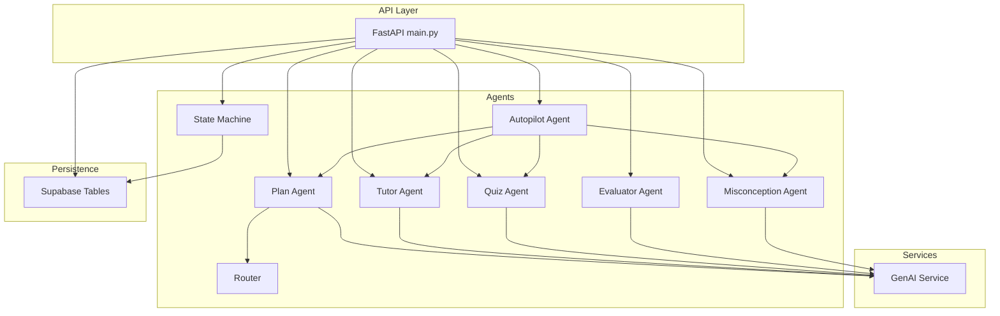
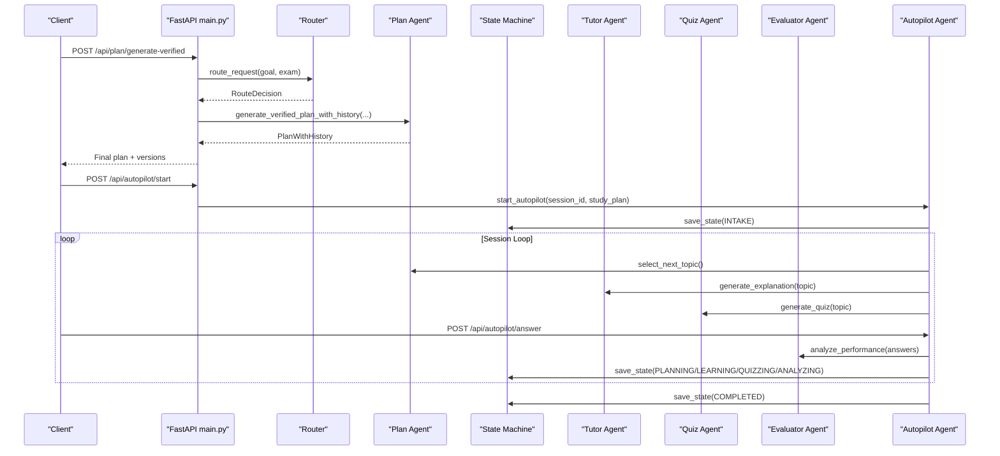
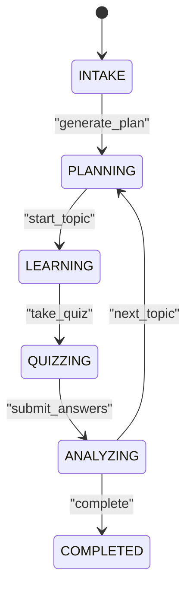
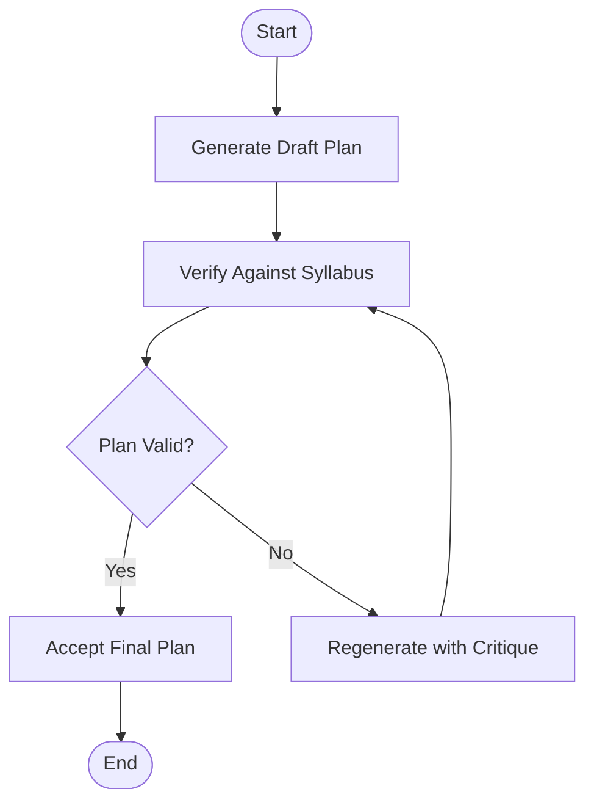
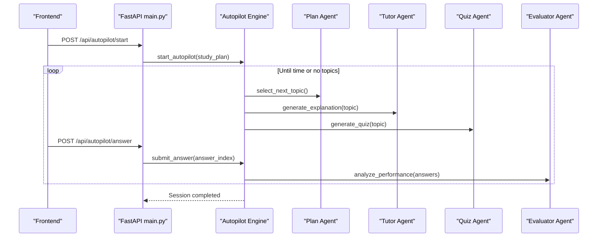
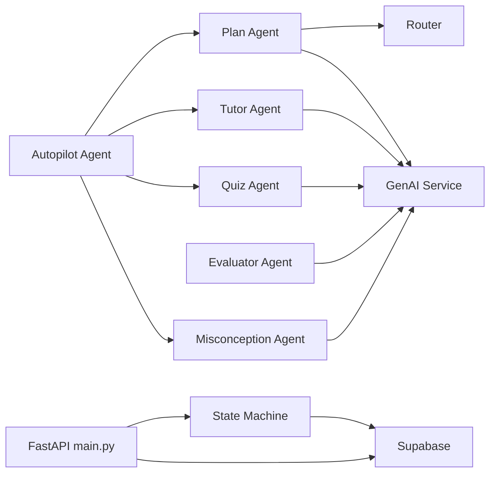

# AI Agent System

<cite>
**Referenced Files in This Document**
- [backend/agents/state_machine.py](file://backend/agents/state_machine.py)
- [backend/agents/schemas.py](file://backend/agents/schemas.py)
- [backend/agents/plan_agent.py](file://backend/agents/plan_agent.py)
- [backend/agents/tutor_agent.py](file://backend/agents/tutor_agent.py)
- [backend/agents/quiz_agent.py](file://backend/agents/quiz_agent.py)
- [backend/agents/autopilot_agent.py](file://backend/agents/autopilot_agent.py)
- [backend/agents/evaluator_agent.py](file://backend/agents/evaluator_agent.py)
- [backend/agents/misconception_agent.py](file://backend/agents/misconception_agent.py)
- [backend/services/genai_service.py](file://backend/services/genai_service.py)
- [backend/router.py](file://backend/router.py)
- [backend/migrations/001_create_core_schema.sql](file://backend/migrations/001_create_core_schema.sql)
- [backend/migrations/002_add_session_context.sql](file://backend/migrations/002_add_session_context.sql)
- [backend/migrations/003_fix_users_rls.sql](file://backend/migrations/003_fix_users_rls.sql)
- [backend/migrations/004_create_persistence_tables.sql](file://backend/migrations/004_create_persistence_tables.sql)
- [backend/main.py](file://backend/main.py)
</cite>

## Table of Contents
1. [Introduction](#introduction)
2. [Project Structure](#project-structure)
3. [Core Components](#core-components)
4. [Architecture Overview](#architecture-overview)
5. [Detailed Component Analysis](#detailed-component-analysis)
6. [Dependency Analysis](#dependency-analysis)
7. [Performance Considerations](#performance-considerations)
8. [Troubleshooting Guide](#troubleshooting-guide)
9. [Conclusion](#conclusion)
10. [Appendices](#appendices)

## Introduction
This document explains the multi-agent system architecture powering Exammentor AI. The platform uses a coordinated set of specialized agents to deliver a structured, adaptive, and autonomous learning experience. The agents collaborate around a central state machine that enforces a strict study-phase workflow, ensuring the AI progresses logically from intake, planning, learning, quizzing, analyzing, to completion. The system emphasizes:
- Structured, validated outputs via Pydantic models for reliable inter-agent communication
- Self-correction loops for robust plan generation
- Multimodal reasoning for image-based content
- Streaming responses for real-time UI updates
- Persistent session state and analytics for long-term learning insights

## Project Structure
The backend is organized into modular components:
- Agents: Specialized modules for planning, tutoring, quizzing, evaluating, misconception remediation, and autopilot orchestration
- Services: Shared service layer for generative AI clients
- Router: Intent and scope routing for syllabus-aware content generation
- Persistence: Supabase-backed schema and tables for sessions, topics, misconceptions, and chat/quizzes
- API: FastAPI endpoints exposing agent capabilities and session management

**Diagram sources**
- [backend/main.py](file://backend/main.py#L1-L843)
- [backend/agents/plan_agent.py](file://backend/agents/plan_agent.py#L1-L524)
- [backend/agents/tutor_agent.py](file://backend/agents/tutor_agent.py#L1-L277)
- [backend/agents/quiz_agent.py](file://backend/agents/quiz_agent.py#L1-L283)
- [backend/agents/evaluator_agent.py](file://backend/agents/evaluator_agent.py#L1-L198)
- [backend/agents/misconception_agent.py](file://backend/agents/misconception_agent.py#L1-L64)
- [backend/agents/autopilot_agent.py](file://backend/agents/autopilot_agent.py#L1-L628)
- [backend/agents/state_machine.py](file://backend/agents/state_machine.py#L1-L136)
- [backend/router.py](file://backend/router.py#L1-L129)
- [backend/services/genai_service.py](file://backend/services/genai_service.py#L1-L10)
- [backend/migrations/001_create_core_schema.sql](file://backend/migrations/001_create_core_schema.sql#L1-L46)
- [backend/migrations/002_add_session_context.sql](file://backend/migrations/002_add_session_context.sql#L1-L16)
- [backend/migrations/003_fix_users_rls.sql](file://backend/migrations/003_fix_users_rls.sql#L1-L41)
- [backend/migrations/004_create_persistence_tables.sql](file://backend/migrations/004_create_persistence_tables.sql#L1-L44)

**Section sources**
- [backend/main.py](file://backend/main.py#L1-L843)
- [backend/agents/state_machine.py](file://backend/agents/state_machine.py#L1-L136)
- [backend/router.py](file://backend/router.py#L1-L129)

## Core Components
- State Machine: Enforces valid transitions across study phases and persists session state and action logs
- Router: Determines intent, exam type, and subject scope to constrain content generation
- Plan Agent: Generates and self-corrects study plans using structured outputs
- Tutor Agent: Provides structured, streaming explanations and multimodal image interpretation
- Quiz Agent: Creates adaptive quizzes and evaluates answers with misconception detection
- Autopilot Agent: Orchestrates autonomous 30-minute learning sessions with interactive controls
- Evaluator Agent: Analyzes performance and generates recommendations
- Misconception Agent: Diagnoses conceptual errors and provides targeted remediation
- GenAI Service: Centralized client for asynchronous model calls
- Persistence: Supabase tables for sessions, topics, misconceptions, and chat/quizzes

**Section sources**
- [backend/agents/state_machine.py](file://backend/agents/state_machine.py#L17-L136)
- [backend/router.py](file://backend/router.py#L64-L129)
- [backend/agents/plan_agent.py](file://backend/agents/plan_agent.py#L49-L304)
- [backend/agents/tutor_agent.py](file://backend/agents/tutor_agent.py#L51-L248)
- [backend/agents/quiz_agent.py](file://backend/agents/quiz_agent.py#L53-L247)
- [backend/agents/autopilot_agent.py](file://backend/agents/autopilot_agent.py#L100-L558)
- [backend/agents/evaluator_agent.py](file://backend/agents/evaluator_agent.py#L59-L151)
- [backend/agents/misconception_agent.py](file://backend/agents/misconception_agent.py#L21-L63)
- [backend/services/genai_service.py](file://backend/services/genai_service.py#L1-L10)
- [backend/migrations/001_create_core_schema.sql](file://backend/migrations/001_create_core_schema.sql#L7-L46)
- [backend/migrations/002_add_session_context.sql](file://backend/migrations/002_add_session_context.sql#L2-L16)
- [backend/migrations/004_create_persistence_tables.sql](file://backend/migrations/004_create_persistence_tables.sql#L3-L44)

## Architecture Overview
The system follows an agent-based design pattern with explicit roles and structured communication:
- API layer exposes endpoints for each agent’s capabilities and session management
- Router constrains content generation to the correct exam and subject scope
- Agents produce validated outputs via Pydantic models to ensure consistent schemas
- State Machine coordinates transitions and persists session state and logs
- Autopilot orchestrates multiple agents in a closed-loop session with interactive controls
- Persistence stores sessions, topics, misconceptions, and chat/quizzes

**Diagram sources**
- [backend/main.py](file://backend/main.py#L128-L223)
- [backend/router.py](file://backend/router.py#L64-L129)
- [backend/agents/plan_agent.py](file://backend/agents/plan_agent.py#L163-L304)
- [backend/agents/autopilot_agent.py](file://backend/agents/autopilot_agent.py#L431-L558)
- [backend/agents/state_machine.py](file://backend/agents/state_machine.py#L80-L136)

## Detailed Component Analysis

### State Machine and Session Workflow
The state machine defines a strict six-phase workflow and enforces valid transitions. It persists session state and maintains an action audit log.

- Responsibilities:
  - Validate transitions based on current phase and action
  - Persist current state and context to Supabase
  - Append action logs to session history
- Persistence:
  - Uses Supabase tables for study sessions, plan cache, and related analytics
  - Adds JSONB fields for current context and agent history arrays

**Diagram sources**
- [backend/agents/state_machine.py](file://backend/agents/state_machine.py#L17-L78)
- [backend/migrations/001_create_core_schema.sql](file://backend/migrations/001_create_core_schema.sql#L14-L22)
- [backend/migrations/002_add_session_context.sql](file://backend/migrations/002_add_session_context.sql#L2-L4)

**Section sources**
- [backend/agents/state_machine.py](file://backend/agents/state_machine.py#L38-L136)
- [backend/migrations/001_create_core_schema.sql](file://backend/migrations/001_create_core_schema.sql#L7-L46)
- [backend/migrations/002_add_session_context.sql](file://backend/migrations/002_add_session_context.sql#L1-L16)

### Router and Scope Constrained Generation
The Router determines intent, exam type, and subject scope, and the Plan Agent injects scope constraints into the generation prompt.

- Intent classification: plan, explain, quiz, autopilot
- Scope guard ensures syllabus alignment and prevents cross-domain requests
- Plan Agent applies scope constraints to the goal to keep outputs aligned

**Section sources**
- [backend/router.py](file://backend/router.py#L64-L129)
- [backend/agents/plan_agent.py](file://backend/agents/plan_agent.py#L181-L214)

### Plan Agent: Self-Correction and Diff UI
The Plan Agent generates a study plan and iteratively verifies it against syllabus and pedagogical constraints. It supports:
- Draft generation with structured outputs
- Verification loop with critique and fixes
- Streaming generation with NDJSON chunks for UI updates
- Full history export for “Action Era” diff visualization

**Diagram sources**
- [backend/agents/plan_agent.py](file://backend/agents/plan_agent.py#L146-L304)

**Section sources**
- [backend/agents/plan_agent.py](file://backend/agents/plan_agent.py#L49-L304)

### Tutor Agent: Structured Explanations and Multimodal Support
The Tutor Agent provides:
- Structured explanations with intuition, steps, examples, pitfalls, and quick checks
- Streaming explanations for real-time UI feedback
- Multimodal explanations using image highlights and grounded references
- Image description for uploaded documents/notes to enrich context

**Section sources**
- [backend/agents/tutor_agent.py](file://backend/agents/tutor_agent.py#L51-L248)

### Quiz Agent: Adaptive Quizzes and Multimodal Reasoning
The Quiz Agent creates adaptive quizzes and evaluates answers:
- Structured quiz generation with concept coverage and difficulty balance
- Answer evaluation with personalized feedback and misconception identification
- Multimodal quiz generation from diagrams with spatial references

**Section sources**
- [backend/agents/quiz_agent.py](file://backend/agents/quiz_agent.py#L53-L247)

### Evaluator Agent: Performance Analysis and Recommendations
The Evaluator Agent analyzes quiz results and produces:
- Topic mastery profiles
- Identified misconceptions with corrective suggestions
- Prioritized recommendations for next steps
- Encouraging, growth-mindset feedback

**Section sources**
- [backend/agents/evaluator_agent.py](file://backend/agents/evaluator_agent.py#L59-L151)

### Misconception Agent: Remediation and Redemption
The Misconception Agent:
- Diagnoses the underlying confusion from a wrong answer
- Provides a counter-example that breaks the misconception
- Offers a redemption question to verify understanding

**Section sources**
- [backend/agents/misconception_agent.py](file://backend/agents/misconception_agent.py#L21-L63)

### Autopilot Agent: Autonomous Learning Orchestration
The Autopilot Agent orchestrates a 30-minute autonomous session:
- Selects the next topic based on mastery and plan
- Teaches two micro-lessons
- Runs a short quiz and analyzes results
- Updates mastery and logs decisions with reasoning
- Supports pause/resume/stop and interactive answer submission

**Diagram sources**
- [backend/agents/autopilot_agent.py](file://backend/agents/autopilot_agent.py#L431-L558)
- [backend/main.py](file://backend/main.py#L582-L757)

**Section sources**
- [backend/agents/autopilot_agent.py](file://backend/agents/autopilot_agent.py#L100-L558)
- [backend/main.py](file://backend/main.py#L582-L757)

### Structured Output Schemas and Pydantic Contracts
Agents communicate using validated Pydantic models to guarantee consistent data exchange:
- Plan Agent: StudyPlan, StudyDay, DailyPlan, PlanVerification
- Tutor Agent: TutorExplanation, ExplanationStep, MultimodalExplanation, ImageHighlight
- Quiz Agent: Quiz, Question, ImageQuiz, ImageQuizQuestion, AnswerEvaluation
- Evaluator Agent: PerformanceAnalysis, TopicMastery, Misconception, StudyRecommendation
- State Machine: StudentContext, StudyPhase

**Section sources**
- [backend/agents/schemas.py](file://backend/agents/schemas.py#L12-L106)
- [backend/agents/plan_agent.py](file://backend/agents/plan_agent.py#L17-L144)
- [backend/agents/tutor_agent.py](file://backend/agents/tutor_agent.py#L16-L47)
- [backend/agents/quiz_agent.py](file://backend/agents/quiz_agent.py#L28-L50)
- [backend/agents/evaluator_agent.py](file://backend/agents/evaluator_agent.py#L15-L44)
- [backend/agents/state_machine.py](file://backend/agents/state_machine.py#L27-L36)

### Streaming Responses for Real-Time UI Updates
The system streams agent outputs for immediate UI feedback:
- Plan Agent: stream_verified_plan_with_history yields NDJSON chunks
- Tutor Agent: stream_explanation yields text chunks
- Frontend consumes streams to render incremental content

**Section sources**
- [backend/agents/plan_agent.py](file://backend/agents/plan_agent.py#L307-L476)
- [backend/agents/tutor_agent.py](file://backend/agents/tutor_agent.py#L51-L127)
- [backend/main.py](file://backend/main.py#L205-L261)

### Multimodal Reasoning for Image-Based Content
The system supports multimodal capabilities:
- Tutor Agent: explain_image and describe_image_for_context
- Quiz Agent: generate_quiz_from_image with visual grounding
- Router and Plan Agent integrate scope constraints to align multimodal content with exam domains

**Section sources**
- [backend/agents/tutor_agent.py](file://backend/agents/tutor_agent.py#L189-L248)
- [backend/agents/quiz_agent.py](file://backend/agents/quiz_agent.py#L138-L202)
- [backend/router.py](file://backend/router.py#L91-L129)

### Agent Communication Patterns and Shared State
- Centralized GenAI client via services/genai_service.py
- Router decouples intent and scope from generation prompts
- State Machine coordinates transitions and persists context
- Autopilot composes multiple agents into a cohesive session loop

**Section sources**
- [backend/services/genai_service.py](file://backend/services/genai_service.py#L1-L10)
- [backend/router.py](file://backend/router.py#L64-L129)
- [backend/agents/state_machine.py](file://backend/agents/state_machine.py#L54-L136)
- [backend/agents/autopilot_agent.py](file://backend/agents/autopilot_agent.py#L100-L558)

### Persistence Mechanisms
- Supabase tables:
  - study_sessions: session lifecycle and state
  - topics: topic tracking per session
  - misconceptions: conceptual error records
  - tutor_chats and quizzes: chat and quiz persistence
- Plan cache table for semantic caching of plans
- Row-level security policies for controlled access

**Section sources**
- [backend/migrations/001_create_core_schema.sql](file://backend/migrations/001_create_core_schema.sql#L7-L46)
- [backend/migrations/002_add_session_context.sql](file://backend/migrations/002_add_session_context.sql#L6-L16)
- [backend/migrations/003_fix_users_rls.sql](file://backend/migrations/003_fix_users_rls.sql#L1-L41)
- [backend/migrations/004_create_persistence_tables.sql](file://backend/migrations/004_create_persistence_tables.sql#L3-L44)

### Agent Lifecycle Management, Error Handling, and Fallbacks
- Lifecycle:
  - Sessions created via API and persisted to Supabase
  - Autopilot engines run asynchronously with pause/resume/stop controls
- Error handling:
  - Retry logic with exponential backoff for model overload
  - Graceful degradation when persistence is unavailable
- Fallbacks:
  - Router clarifications and scope constraints
  - Legacy plan generation when routing fails
  - Streaming endpoints for progressive UI updates

**Section sources**
- [backend/agents/autopilot_agent.py](file://backend/agents/autopilot_agent.py#L142-L162)
- [backend/agents/plan_agent.py](file://backend/agents/plan_agent.py#L212-L214)
- [backend/agents/state_machine.py](file://backend/agents/state_machine.py#L80-L136)
- [backend/main.py](file://backend/main.py#L582-L757)

### Examples of Agent Collaboration in Complex Scenarios
- Autonomous Study Session:
  - Router scopes content
  - Plan Agent generates and verifies the plan
  - Autopilot selects topics, orchestrates tutoring and quizzing, and updates mastery
  - Evaluator and Misconception Agents refine understanding and recommendations
- Multimodal Learning:
  - Tutor Agent describes and explains images
  - Quiz Agent generates image-grounded questions
  - Router ensures domain-appropriate content

**Section sources**
- [backend/agents/autopilot_agent.py](file://backend/agents/autopilot_agent.py#L431-L558)
- [backend/agents/tutor_agent.py](file://backend/agents/tutor_agent.py#L189-L248)
- [backend/agents/quiz_agent.py](file://backend/agents/quiz_agent.py#L138-L202)
- [backend/router.py](file://backend/router.py#L91-L129)

## Dependency Analysis
The agents depend on shared services and schemas, with the state machine coordinating persistence and transitions.

**Diagram sources**
- [backend/agents/plan_agent.py](file://backend/agents/plan_agent.py#L12-L13)
- [backend/router.py](file://backend/router.py#L4-L4)
- [backend/services/genai_service.py](file://backend/services/genai_service.py#L1-L10)
- [backend/agents/autopilot_agent.py](file://backend/agents/autopilot_agent.py#L16-L20)
- [backend/agents/state_machine.py](file://backend/agents/state_machine.py#L54-L63)
- [backend/main.py](file://backend/main.py#L19-L22)

**Section sources**
- [backend/agents/plan_agent.py](file://backend/agents/plan_agent.py#L12-L13)
- [backend/router.py](file://backend/router.py#L4-L4)
- [backend/services/genai_service.py](file://backend/services/genai_service.py#L1-L10)
- [backend/agents/autopilot_agent.py](file://backend/agents/autopilot_agent.py#L16-L20)
- [backend/agents/state_machine.py](file://backend/agents/state_machine.py#L54-L63)
- [backend/main.py](file://backend/main.py#L19-L22)

## Performance Considerations
- Asynchronous model calls reduce latency and improve throughput
- Streaming endpoints minimize perceived latency for UI rendering
- Retry logic mitigates transient model overload conditions
- Plan cache reduces repeated computation for identical inputs
- Indexes on frequently queried columns optimize Supabase performance

[No sources needed since this section provides general guidance]

## Troubleshooting Guide
- Missing Supabase credentials:
  - State Machine prints warnings and disables persistence
- Model overload errors:
  - Autopilot retries with exponential backoff
- Session conflicts:
  - Autopilot prevents starting multiple concurrent sessions
- Persistence failures:
  - Misconception and performance endpoints log and continue

**Section sources**
- [backend/agents/state_machine.py](file://backend/agents/state_machine.py#L56-L63)
- [backend/agents/autopilot_agent.py](file://backend/agents/autopilot_agent.py#L142-L162)
- [backend/main.py](file://backend/main.py#L593-L597)
- [backend/main.py](file://backend/main.py#L448-L460)

## Conclusion
Exammentor AI’s multi-agent system integrates structured outputs, multimodal reasoning, and autonomous orchestration to deliver a robust, adaptive learning experience. The state machine ensures disciplined progression, while shared schemas and streaming responses enable responsive UIs. Persistence and analytics support long-term learning insights, and the router and self-correction loops maintain quality and relevance across diverse exam domains.

[No sources needed since this section summarizes without analyzing specific files]

## Appendices

### API Endpoint Reference
- Plan: generate, verified, verified-with-history, stream-verified
- Tutor: explain, stream, explain-image, describe-image
- Quiz: generate, generate-from-image, evaluate
- Evaluator: analyze-performance
- Misconception: misconception-buster
- Session: start, save, state
- Autopilot: start, status, pause, resume, stop, answer

**Section sources**
- [backend/main.py](file://backend/main.py#L128-L800)