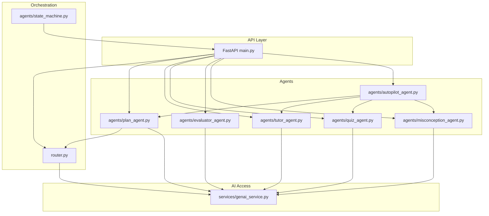
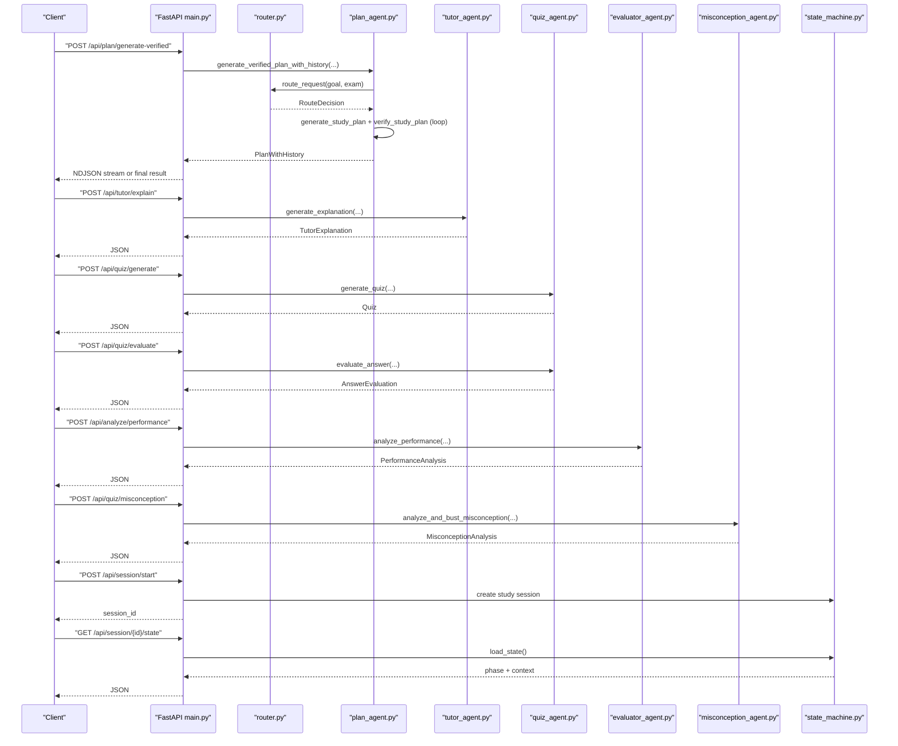
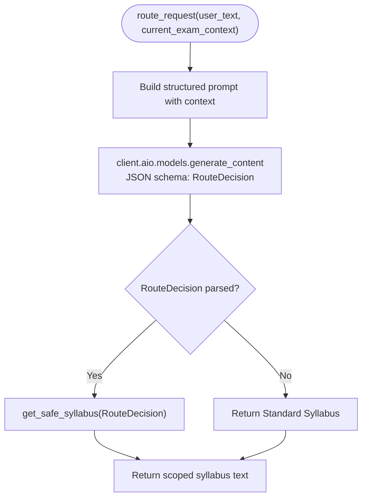
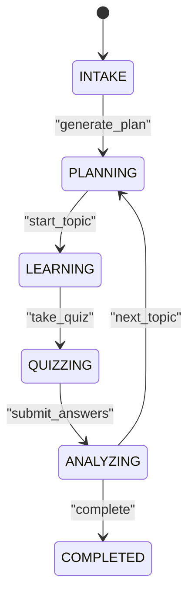
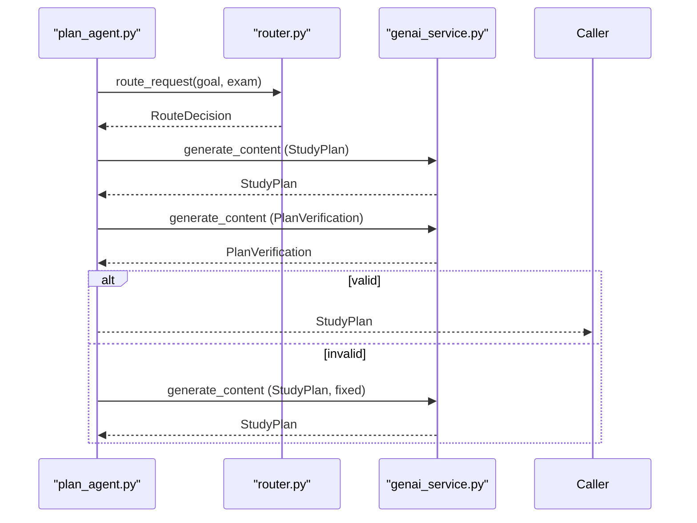
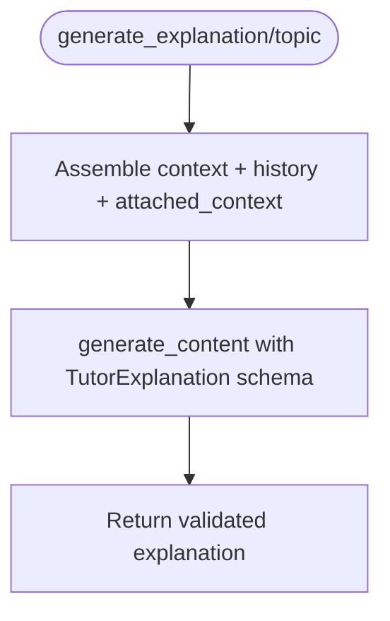
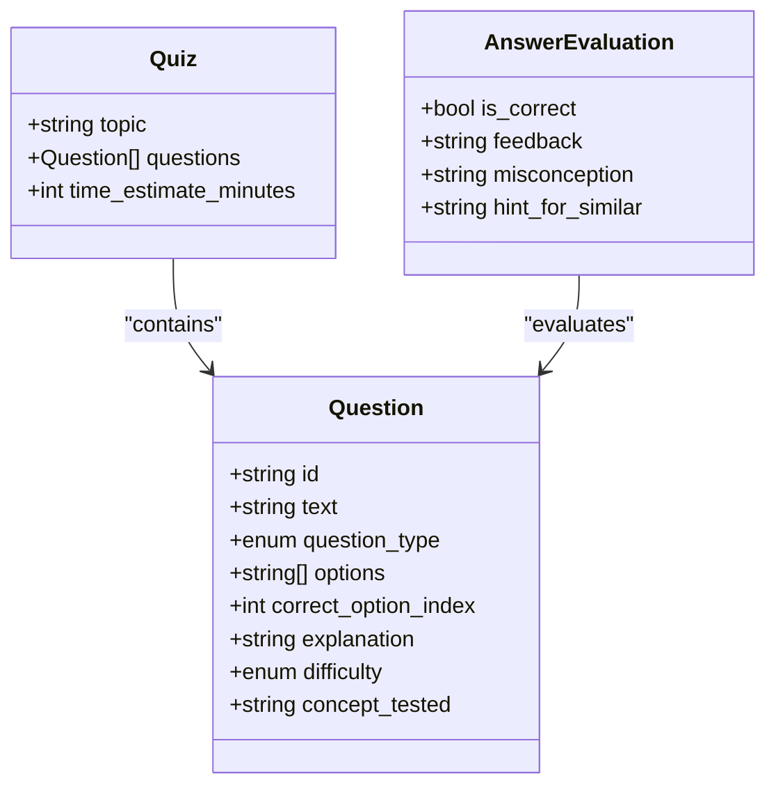
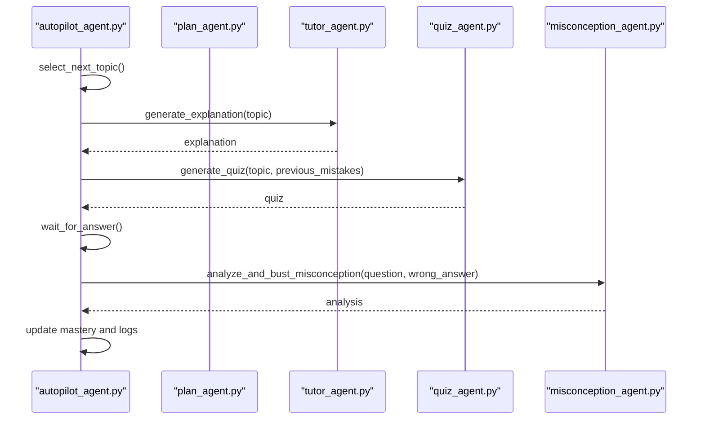
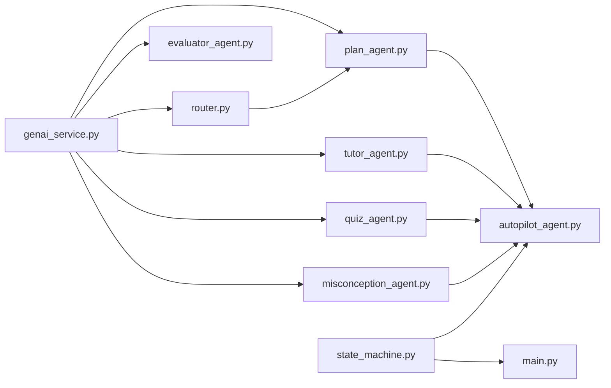

# Agent Architecture and Communication

<cite>
**Referenced Files in This Document**
- [router.py](file://backend/router.py)
- [main.py](file://backend/main.py)
- [state_machine.py](file://backend/agents/state_machine.py)
- [genai_service.py](file://backend/services/genai_service.py)
- [plan_agent.py](file://backend/agents/plan_agent.py)
- [tutor_agent.py](file://backend/agents/tutor_agent.py)
- [quiz_agent.py](file://backend/agents/quiz_agent.py)
- [evaluator_agent.py](file://backend/agents/evaluator_agent.py)
- [misconception_agent.py](file://backend/agents/misconception_agent.py)
- [autopilot_agent.py](file://backend/agents/autopilot_agent.py)
- [schemas.py](file://backend/agents/schemas.py)
</cite>

## Table of Contents
1. [Introduction](#introduction)
2. [Project Structure](#project-structure)
3. [Core Components](#core-components)
4. [Architecture Overview](#architecture-overview)
5. [Detailed Component Analysis](#detailed-component-analysis)
6. [Dependency Analysis](#dependency-analysis)
7. [Performance Considerations](#performance-considerations)
8. [Troubleshooting Guide](#troubleshooting-guide)
9. [Conclusion](#conclusion)

## Introduction
This document explains the Exammentor AI multi-agent architecture and communication patterns. The system centers on a router that classifies user intents and scopes the syllabus, a centralized state machine that orchestrates agent execution, and specialized agents that collaborate to deliver a structured learning experience. Agents access AI capabilities through Google Gemini structured outputs and streaming APIs. The autopilot demonstrates autonomous, multi-step workflows with interactive controls and robust error handling.

## Project Structure
The backend is organized around:
- A FastAPI server exposing endpoints for each agent and orchestration features
- An intent router and syllabus scoping module
- A state machine for session lifecycle and audit logging
- Specialized agents for planning, tutoring, quizzing, evaluation, and misconception remediation
- A centralized Gemini client for AI access

**Diagram sources**
- [main.py](file://backend/main.py#L1-L843)
- [router.py](file://backend/router.py#L1-L129)
- [state_machine.py](file://backend/agents/state_machine.py#L1-L136)
- [genai_service.py](file://backend/services/genai_service.py#L1-L10)
- [plan_agent.py](file://backend/agents/plan_agent.py#L1-L524)
- [tutor_agent.py](file://backend/agents/tutor_agent.py#L1-L277)
- [quiz_agent.py](file://backend/agents/quiz_agent.py#L1-L283)
- [evaluator_agent.py](file://backend/agents/evaluator_agent.py#L1-L198)
- [misconception_agent.py](file://backend/agents/misconception_agent.py#L1-L64)
- [autopilot_agent.py](file://backend/agents/autopilot_agent.py#L1-L628)

**Section sources**
- [main.py](file://backend/main.py#L1-L843)
- [router.py](file://backend/router.py#L1-L129)
- [state_machine.py](file://backend/agents/state_machine.py#L1-L136)
- [genai_service.py](file://backend/services/genai_service.py#L1-L10)

## Core Components
- Router: Classifies user intent, determines exam type, and scopes syllabus content. Returns a structured decision used by agents to constrain their work.
- State Machine: Enforces ordered workflow phases (INTAKE → PLANNING → LEARNING → QUIZZING → ANALYZING → COMPLETED) and persists session state and action logs.
- Agents:
  - Plan Agent: Generates study plans with optional self-correction and streaming diffs.
  - Tutor Agent: Provides structured, streaming explanations and multimodal explanations grounded in images.
  - Quiz Agent: Creates adaptive quizzes and evaluates answers with misconception detection.
  - Evaluator Agent: Analyzes quiz performance and generates recommendations.
  - Misconception Agent: Diagnoses conceptual errors and prescribes targeted remediation.
  - Autopilot Agent: Orchestrates autonomous 30-minute sessions with interactive controls and detailed run logs.

**Section sources**
- [router.py](file://backend/router.py#L64-L88)
- [state_machine.py](file://backend/agents/state_machine.py#L17-L78)
- [plan_agent.py](file://backend/agents/plan_agent.py#L49-L87)
- [tutor_agent.py](file://backend/agents/tutor_agent.py#L51-L127)
- [quiz_agent.py](file://backend/agents/quiz_agent.py#L53-L111)
- [evaluator_agent.py](file://backend/agents/evaluator_agent.py#L59-L115)
- [misconception_agent.py](file://backend/agents/misconception_agent.py#L21-L63)
- [autopilot_agent.py](file://backend/agents/autopilot_agent.py#L100-L545)

## Architecture Overview
The system uses a centralized state machine to coordinate agent interactions. The router feeds intent and scope into planning, which informs tutoring and quizzing. Evaluator and misconception agents refine learning outcomes. The autopilot composes these agents into an autonomous loop with interactive controls.

**Diagram sources**
- [main.py](file://backend/main.py#L128-L222)
- [router.py](file://backend/router.py#L64-L88)
- [plan_agent.py](file://backend/agents/plan_agent.py#L163-L304)
- [tutor_agent.py](file://backend/agents/tutor_agent.py#L131-L186)
- [quiz_agent.py](file://backend/agents/quiz_agent.py#L53-L111)
- [evaluator_agent.py](file://backend/agents/evaluator_agent.py#L59-L115)
- [misconception_agent.py](file://backend/agents/misconception_agent.py#L21-L63)
- [state_machine.py](file://backend/agents/state_machine.py#L96-L113)

## Detailed Component Analysis

### Router: Intent Classification and Syllabus Scoping
- Purpose: Parse user input to infer intent (plan, explain, quiz, autopilot), exam type, and subject scope; return a structured decision.
- Integration: Uses the centralized Gemini client to produce JSON constrained by a Pydantic schema.
- Scope Guard: Safely selects syllabus text based on exam and scope, with fallbacks and nested chemistry handling.

**Diagram sources**
- [router.py](file://backend/router.py#L64-L88)
- [router.py](file://backend/router.py#L91-L129)

**Section sources**
- [router.py](file://backend/router.py#L64-L88)
- [router.py](file://backend/router.py#L91-L129)

### State Machine: Workflow Phases and Transition Logic
- Phases: INTAKE, PLANNING, LEARNING, QUIZZING, ANALYZING, COMPLETED.
- Transitions: Deterministic mapping from (current_phase, action) to next_phase.
- Persistence: Saves and loads session state and agent action history to/from Supabase.

**Diagram sources**
- [state_machine.py](file://backend/agents/state_machine.py#L17-L52)

**Section sources**
- [state_machine.py](file://backend/agents/state_machine.py#L17-L78)
- [state_machine.py](file://backend/agents/state_machine.py#L80-L113)

### Plan Agent: Self-Correction and Streaming
- Generates a study plan with strict JSON schema.
- Iterative verification loop: audits coverage, feasibility, sequencing, and revision timing; fixes and regenerates until valid or max iterations.
- Streaming: Emits NDJSON chunks for UI feedback during drafting, verification, fixing, and completion.

**Diagram sources**
- [plan_agent.py](file://backend/agents/plan_agent.py#L163-L304)
- [router.py](file://backend/router.py#L64-L88)
- [genai_service.py](file://backend/services/genai_service.py#L9-L9)

**Section sources**
- [plan_agent.py](file://backend/agents/plan_agent.py#L49-L87)
- [plan_agent.py](file://backend/agents/plan_agent.py#L90-L126)
- [plan_agent.py](file://backend/agents/plan_agent.py#L163-L304)
- [plan_agent.py](file://backend/agents/plan_agent.py#L307-L475)

### Tutor Agent: Structured Explanations and Multimodal Grounding
- Generates structured explanations with intuition, steps, real-world example, common pitfalls, and quick checks.
- Streaming mode supports live UI updates.
- Multimodal explanations ground concepts in images with visual highlights.

**Diagram sources**
- [tutor_agent.py](file://backend/agents/tutor_agent.py#L131-L186)

**Section sources**
- [tutor_agent.py](file://backend/agents/tutor_agent.py#L51-L127)
- [tutor_agent.py](file://backend/agents/tutor_agent.py#L131-L186)
- [tutor_agent.py](file://backend/agents/tutor_agent.py#L189-L222)

### Quiz Agent: Adaptive Quizzes and Answer Evaluation
- Generates adaptive quizzes with concept-specific questions and explanations.
- Evaluates answers and surfaces misconceptions with targeted tips.
- Supports multimodal quizzes referencing specific image regions.

**Diagram sources**
- [quiz_agent.py](file://backend/agents/quiz_agent.py#L28-L50)

**Section sources**
- [quiz_agent.py](file://backend/agents/quiz_agent.py#L53-L111)
- [quiz_agent.py](file://backend/agents/quiz_agent.py#L206-L246)
- [quiz_agent.py](file://backend/agents/quiz_agent.py#L138-L201)

### Evaluator Agent: Performance Analysis and Recommendations
- Analyzes quiz results to compute mastery, detect misconceptions, and prioritize next actions.
- Provides encouragement and actionable recommendations.

**Section sources**
- [evaluator_agent.py](file://backend/agents/evaluator_agent.py#L59-L115)
- [evaluator_agent.py](file://backend/agents/evaluator_agent.py#L120-L151)

### Misconception Agent: Conceptual Remediation
- Diagnoses the root cause of a wrong answer and proposes a counter-example and redemption question.

**Section sources**
- [misconception_agent.py](file://backend/agents/misconception_agent.py#L21-L63)

### Autopilot Agent: Autonomous Orchestration and Interactive Control
- Orchestrates topic selection, micro-lessons, quizzes, and misconception remediation.
- Tracks mastery, logs decisions with reasoning, and supports pause/resume/stop.
- Implements retry with exponential backoff for model overload conditions.

**Diagram sources**
- [autopilot_agent.py](file://backend/agents/autopilot_agent.py#L182-L256)
- [autopilot_agent.py](file://backend/agents/autopilot_agent.py#L258-L294)
- [autopilot_agent.py](file://backend/agents/autopilot_agent.py#L295-L334)
- [autopilot_agent.py](file://backend/agents/autopilot_agent.py#L336-L429)

**Section sources**
- [autopilot_agent.py](file://backend/agents/autopilot_agent.py#L100-L545)

### Shared State Management and Message Passing
- Session state is persisted to Supabase with current phase, context, and agent history.
- Agents communicate indirectly via shared state and explicit function calls (e.g., router output guiding plan generation).
- Streaming endpoints emit NDJSON for real-time UI updates.

**Section sources**
- [state_machine.py](file://backend/agents/state_machine.py#L80-L113)
- [main.py](file://backend/main.py#L205-L222)
- [main.py](file://backend/main.py#L245-L260)

### Gemini Integration Patterns
- Structured outputs: Each agent passes a Pydantic model as the response schema to enforce JSON validity.
- Streaming: Tutor agent uses a streaming API for live UI feedback.
- Model selection: Agents choose appropriate models per task (e.g., Flash for speed, Pro for reasoning).

**Section sources**
- [genai_service.py](file://backend/services/genai_service.py#L9-L9)
- [plan_agent.py](file://backend/agents/plan_agent.py#L78-L84)
- [tutor_agent.py](file://backend/agents/tutor_agent.py#L120-L126)
- [quiz_agent.py](file://backend/agents/quiz_agent.py#L102-L109)

### Examples of Agent Collaboration Scenarios
- Study Plan Generation with Self-Correction:
  - Router classifies intent and scope → Plan Agent drafts and verifies → Iteratively fixes until valid → Returns final plan.
- Autonomous Learning Session:
  - Autopilot selects topic → Micro-lessons → Quiz → Misconception analysis → Mastery update → Repeat until time limit or completion.
- Interactive Quiz with Remediation:
  - Quiz generation → Student answer → Evaluation → Misconception analysis → Redemption question.

**Section sources**
- [plan_agent.py](file://backend/agents/plan_agent.py#L163-L304)
- [autopilot_agent.py](file://backend/agents/autopilot_agent.py#L431-L545)
- [quiz_agent.py](file://backend/agents/quiz_agent.py#L206-L246)
- [misconception_agent.py](file://backend/agents/misconception_agent.py#L21-L63)

## Dependency Analysis
- Coupling:
  - Router depends on Gemini client and syllabus registry.
  - Plan Agent depends on Router and Gemini.
  - Autopilot composes multiple agents and depends on state persistence.
- Cohesion:
  - Each agent encapsulates a single responsibility with strict schemas.
- External dependencies:
  - Gemini client for AI inference.
  - Supabase for session persistence and audit logging.

**Diagram sources**
- [genai_service.py](file://backend/services/genai_service.py#L9-L9)
- [router.py](file://backend/router.py#L1-L129)
- [plan_agent.py](file://backend/agents/plan_agent.py#L1-L524)
- [tutor_agent.py](file://backend/agents/tutor_agent.py#L1-L277)
- [quiz_agent.py](file://backend/agents/quiz_agent.py#L1-L283)
- [evaluator_agent.py](file://backend/agents/evaluator_agent.py#L1-L198)
- [misconception_agent.py](file://backend/agents/misconception_agent.py#L1-L64)
- [autopilot_agent.py](file://backend/agents/autopilot_agent.py#L1-L628)
- [state_machine.py](file://backend/agents/state_machine.py#L1-L136)
- [main.py](file://backend/main.py#L1-L843)

**Section sources**
- [main.py](file://backend/main.py#L1-L843)
- [state_machine.py](file://backend/agents/state_machine.py#L1-L136)

## Performance Considerations
- Structured outputs reduce retries and parsing overhead.
- Streaming endpoints improve perceived latency for tutoring and plan generation.
- Retry with exponential backoff mitigates transient model overload conditions.
- Prefer smaller, focused prompts and limit context sizes to maintain responsiveness.

## Troubleshooting Guide
- Router failures:
  - If routing fails, the Plan Agent falls back to legacy mode and logs warnings.
- Model overload:
  - Autopilot retries with exponential backoff on 503/429 errors.
- State persistence:
  - Missing Supabase credentials disables persistence; state machine logs warnings and continues.
- Quiz evaluation:
  - Ensure question reconstruction matches expected schema before evaluation.

**Section sources**
- [plan_agent.py](file://backend/agents/plan_agent.py#L212-L214)
- [autopilot_agent.py](file://backend/agents/autopilot_agent.py#L142-L162)
- [state_machine.py](file://backend/agents/state_machine.py#L61-L63)
- [main.py](file://backend/main.py#L430-L429)

## Conclusion
Exammentor’s multi-agent system combines a router for intent and scope, a state machine for ordered orchestration, and specialized agents for planning, tutoring, quizzing, evaluation, and misconception remediation. Centralized Gemini integration ensures reliable, structured AI outputs, while streaming and interactive features enhance the learning experience. The autopilot demonstrates autonomous execution with robust error handling and detailed run logs, enabling transparent “Action Era” demonstrations.