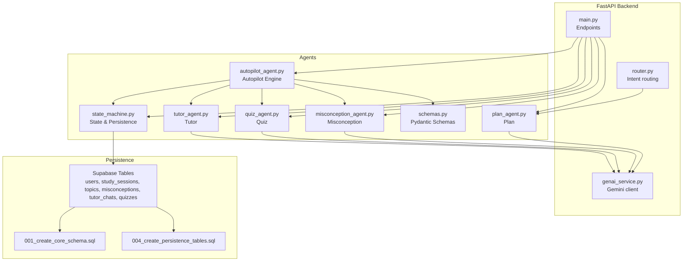
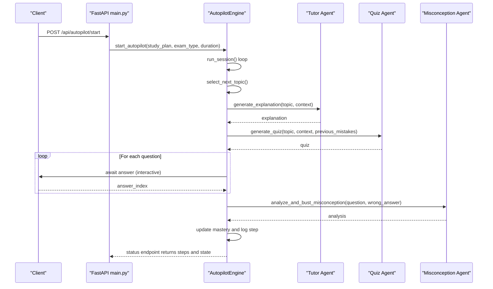
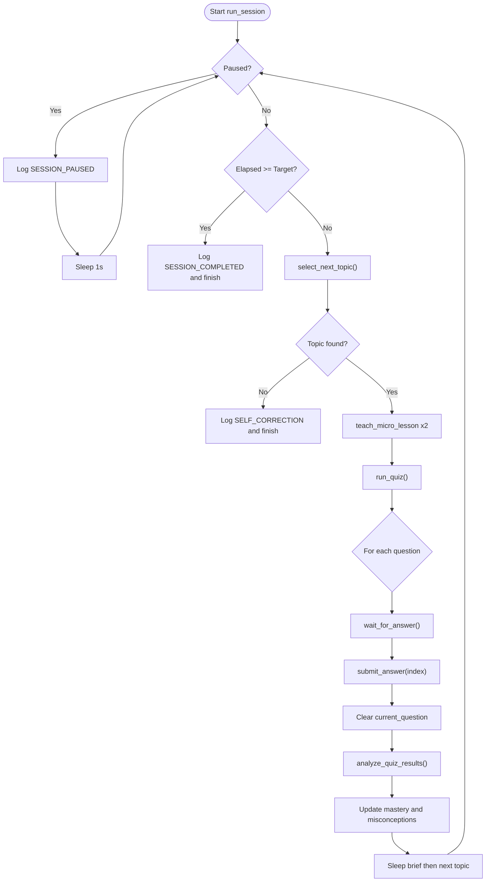
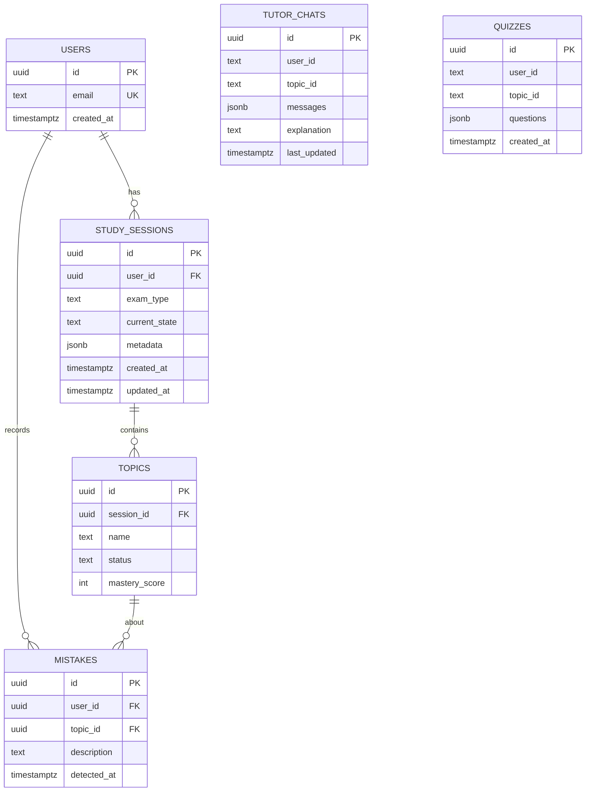
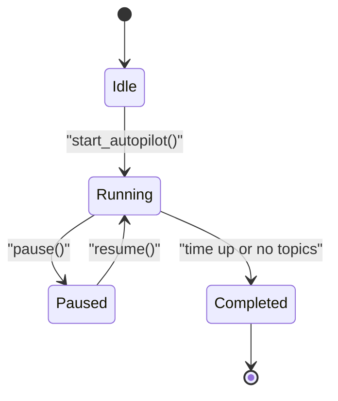
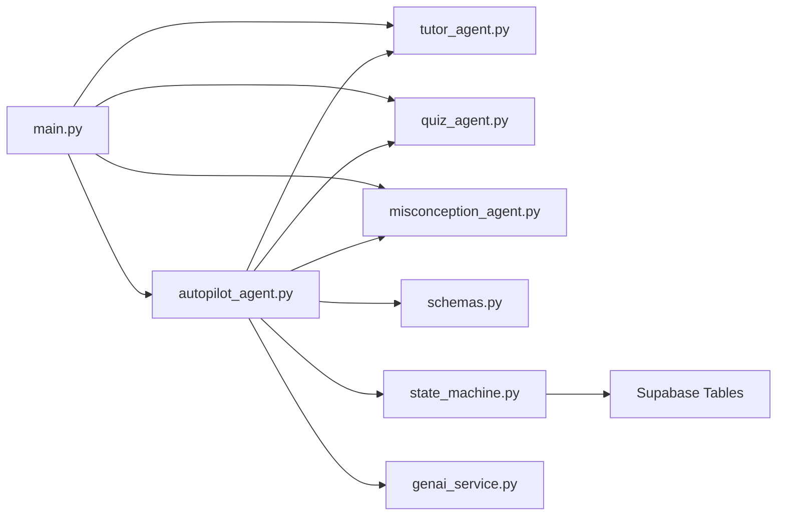

# Autopilot Agent - Autonomous Learning

<cite>
**Referenced Files in This Document**
- [autopilot_agent.py](file://backend/agents/autopilot_agent.py)
- [tutor_agent.py](file://backend/agents/tutor_agent.py)
- [quiz_agent.py](file://backend/agents/quiz_agent.py)
- [misconception_agent.py](file://backend/agents/misconception_agent.py)
- [plan_agent.py](file://backend/agents/plan_agent.py)
- [schemas.py](file://backend/agents/schemas.py)
- [state_machine.py](file://backend/agents/state_machine.py)
- [main.py](file://backend/main.py)
- [router.py](file://backend/router.py)
- [genai_service.py](file://backend/services/genai_service.py)
- [001_create_core_schema.sql](file://backend/migrations/001_create_core_schema.sql)
- [004_create_persistence_tables.sql](file://backend/migrations/004_create_persistence_tables.sql)
</cite>

## Table of Contents
1. [Introduction](#introduction)
2. [Project Structure](#project-structure)
3. [Core Components](#core-components)
4. [Architecture Overview](#architecture-overview)
5. [Detailed Component Analysis](#detailed-component-analysis)
6. [Dependency Analysis](#dependency-analysis)
7. [Performance Considerations](#performance-considerations)
8. [Troubleshooting Guide](#troubleshooting-guide)
9. [Conclusion](#conclusion)
10. [Appendices](#appendices)

## Introduction
The Autopilot Agent orchestrates 30-minute unattended learning sessions, demonstrating “Action Era” autonomy. It selects topics, delivers micro-lessons, administers quizzes, detects and busts misconceptions, adapts pacing, and maintains session continuity. It integrates tightly with supporting agents (Tutor, Quiz, Misconception, Planner) and persists state for resilience across interruptions.

## Project Structure
The backend is a FastAPI application exposing REST endpoints for multi-agent workflows. The Autopilot Agent lives under agents/autopilot_agent.py and coordinates other agents via structured outputs and shared schemas. Persistence is handled via Supabase tables and migration scripts.

**Diagram sources**
- [main.py](file://backend/main.py#L1-L843)
- [autopilot_agent.py](file://backend/agents/autopilot_agent.py#L1-L628)
- [tutor_agent.py](file://backend/agents/tutor_agent.py#L1-L277)
- [quiz_agent.py](file://backend/agents/quiz_agent.py#L1-L283)
- [misconception_agent.py](file://backend/agents/misconception_agent.py#L1-L64)
- [plan_agent.py](file://backend/agents/plan_agent.py#L1-L524)
- [schemas.py](file://backend/agents/schemas.py#L1-L106)
- [state_machine.py](file://backend/agents/state_machine.py#L1-L136)
- [router.py](file://backend/router.py#L1-L129)
- [genai_service.py](file://backend/services/genai_service.py#L1-L10)
- [001_create_core_schema.sql](file://backend/migrations/001_create_core_schema.sql#L1-L46)
- [004_create_persistence_tables.sql](file://backend/migrations/004_create_persistence_tables.sql#L1-L44)

**Section sources**
- [main.py](file://backend/main.py#L1-L843)
- [autopilot_agent.py](file://backend/agents/autopilot_agent.py#L1-L628)
- [tutor_agent.py](file://backend/agents/tutor_agent.py#L1-L277)
- [quiz_agent.py](file://backend/agents/quiz_agent.py#L1-L283)
- [misconception_agent.py](file://backend/agents/misconception_agent.py#L1-L64)
- [plan_agent.py](file://backend/agents/plan_agent.py#L1-L524)
- [schemas.py](file://backend/agents/schemas.py#L1-L106)
- [state_machine.py](file://backend/agents/state_machine.py#L1-L136)
- [router.py](file://backend/router.py#L1-L129)
- [genai_service.py](file://backend/services/genai_service.py#L1-L10)
- [001_create_core_schema.sql](file://backend/migrations/001_create_core_schema.sql#L1-L46)
- [004_create_persistence_tables.sql](file://backend/migrations/004_create_persistence_tables.sql#L1-L44)

## Core Components
- Autopilot Engine: Orchestrates topic selection, micro-lessons, quizzes, and analysis; maintains session state and run log; supports pause/resume/stop; handles retries and interactive answers.
- Tutor Agent: Provides structured, streaming explanations and multimodal explanations grounded in images.
- Quiz Agent: Generates adaptive quizzes and evaluates answers with misconception detection.
- Misconception Agent: Diagnoses conceptual errors and suggests targeted remediation.
- Planner Agent: Creates and verifies study plans with self-correction loops.
- State Machine: Enforces valid phase transitions and persists session state to Supabase.
- API Layer: FastAPI endpoints expose all agent capabilities and manage session lifecycle.

**Section sources**
- [autopilot_agent.py](file://backend/agents/autopilot_agent.py#L100-L628)
- [tutor_agent.py](file://backend/agents/tutor_agent.py#L1-L277)
- [quiz_agent.py](file://backend/agents/quiz_agent.py#L1-L283)
- [misconception_agent.py](file://backend/agents/misconception_agent.py#L1-L64)
- [plan_agent.py](file://backend/agents/plan_agent.py#L1-L524)
- [state_machine.py](file://backend/agents/state_machine.py#L1-L136)
- [main.py](file://backend/main.py#L1-L843)

## Architecture Overview
The Autopilot Agent runs an autonomous loop:
- Select next topic based on mastery and plan
- Teach 2 micro-lessons
- Generate and present a quiz
- Evaluate answers and detect misconceptions
- Update mastery and log steps
- Continue until time expires or no topics remain

**Diagram sources**
- [main.py](file://backend/main.py#L573-L757)
- [autopilot_agent.py](file://backend/agents/autopilot_agent.py#L431-L545)
- [tutor_agent.py](file://backend/agents/tutor_agent.py#L131-L186)
- [quiz_agent.py](file://backend/agents/quiz_agent.py#L53-L111)
- [misconception_agent.py](file://backend/agents/misconception_agent.py#L21-L63)

## Detailed Component Analysis

### Autopilot Engine
Responsibilities:
- Topic selection using AI with mastery-aware reasoning
- Micro-lesson delivery via Tutor Agent
- Adaptive quiz generation via Quiz Agent
- Misconception detection and remediation via Misconception Agent
- Run logging with reasoning traces
- Interactive answer handling and pause/resume/stop controls
- Retry logic for rate-limited or overloaded model responses

Key behaviors:
- Uses a retry mechanism with exponential backoff for model calls
- Maintains a run log with timestamps, actions, reasoning, and durations
- Tracks current phase, elapsed time, and mastery per topic
- Supports interactive mode: waits for user answers and resumes execution

**Diagram sources**
- [autopilot_agent.py](file://backend/agents/autopilot_agent.py#L431-L545)
- [autopilot_agent.py](file://backend/agents/autopilot_agent.py#L182-L256)
- [autopilot_agent.py](file://backend/agents/autopilot_agent.py#L258-L294)
- [autopilot_agent.py](file://backend/agents/autopilot_agent.py#L295-L334)
- [autopilot_agent.py](file://backend/agents/autopilot_agent.py#L336-L429)

**Section sources**
- [autopilot_agent.py](file://backend/agents/autopilot_agent.py#L100-L628)

### Topic Selection Algorithm
- Builds a mastery context from the study plan and current session state
- Asks the model to choose the next topic considering:
  - Low mastery scores
  - Prerequisites
  - Avoiding repeated topics unless mastery is very low
  - Spaced repetition for medium-mastery topics
- Logs the decision with reasoning and priority score

**Section sources**
- [autopilot_agent.py](file://backend/agents/autopilot_agent.py#L182-L256)

### Micro-Lesson Delivery
- Uses the Tutor Agent to generate a structured explanation with:
  - Intuition
  - Step-by-step breakdown
  - Real-world example
  - Common pitfall
  - Quick check question
- Stores the explanation’s intuition in session state for UI display

**Section sources**
- [autopilot_agent.py](file://backend/agents/autopilot_agent.py#L258-L294)
- [tutor_agent.py](file://backend/agents/tutor_agent.py#L131-L186)

### Adaptive Quiz Generation and Evaluation
- Generates 3–5 questions tailored to the topic and previous misconceptions
- Presents questions interactively; collects answers asynchronously
- Evaluates answers and logs misconception detection
- Updates mastery with weighted averaging of attempts

**Section sources**
- [autopilot_agent.py](file://backend/agents/autopilot_agent.py#L295-L334)
- [autopilot_agent.py](file://backend/agents/autopilot_agent.py#L336-L429)
- [quiz_agent.py](file://backend/agents/quiz_agent.py#L53-L111)
- [misconception_agent.py](file://backend/agents/misconception_agent.py#L21-L63)

### Self-Correction and Adaptation
- Topic selection incorporates mastery and plan context to self-correct sequencing
- Quiz generation targets previous misconceptions
- Mastery updates use a capped weighted average to stabilize scores
- Run log captures decisions and reasoning for transparency

**Section sources**
- [autopilot_agent.py](file://backend/agents/autopilot_agent.py#L394-L429)
- [autopilot_agent.py](file://backend/agents/autopilot_agent.py#L164-L181)

### State Persistence and Session Continuity
- Session state tracked in memory per session_id
- Background runner persists steps and manages lifecycle
- Optional Supabase-backed state machine for structured phase transitions and audit logs
- Tables include users, study_sessions, topics, misconceptions, tutor_chats, quizzes

**Diagram sources**
- [001_create_core_schema.sql](file://backend/migrations/001_create_core_schema.sql#L1-L46)
- [004_create_persistence_tables.sql](file://backend/migrations/004_create_persistence_tables.sql#L1-L44)

**Section sources**
- [autopilot_agent.py](file://backend/agents/autopilot_agent.py#L560-L628)
- [state_machine.py](file://backend/agents/state_machine.py#L80-L136)
- [001_create_core_schema.sql](file://backend/migrations/001_create_core_schema.sql#L1-L46)
- [004_create_persistence_tables.sql](file://backend/migrations/004_create_persistence_tables.sql#L1-L44)

### Integration with Other Agents
- Tutor Agent: Provides structured explanations and multimodal explanations
- Quiz Agent: Generates adaptive quizzes and evaluates answers
- Misconception Agent: Detects and busts misconceptions with targeted remediation
- Planner Agent: Produces study plans with self-correction verification
- Router: Routes requests to appropriate exam-specific syllabi and scopes

**Section sources**
- [tutor_agent.py](file://backend/agents/tutor_agent.py#L1-L277)
- [quiz_agent.py](file://backend/agents/quiz_agent.py#L1-L283)
- [misconception_agent.py](file://backend/agents/misconception_agent.py#L1-L64)
- [plan_agent.py](file://backend/agents/plan_agent.py#L1-L524)
- [router.py](file://backend/router.py#L1-L129)

### Session Lifecycle Management
- Start: Initializes session, sets status to running, and starts background loop
- Running: Iterates through topic selection, teaching, quizzing, and analysis
- Paused: Logs pause event and resumes cleanly
- Completed: Finalizes with total topics and run log
- Status endpoint exposes current state, content, questions, and run log

**Diagram sources**
- [autopilot_agent.py](file://backend/agents/autopilot_agent.py#L546-L558)
- [main.py](file://backend/main.py#L648-L757)

**Section sources**
- [autopilot_agent.py](file://backend/agents/autopilot_agent.py#L584-L628)
- [main.py](file://backend/main.py#L573-L757)

### Typical Autonomous Scenarios
- Topic sequencing: The engine selects the lowest-mastery topic not attempted recently, ensuring prerequisites are met.
- Adaptive pacing: After each quiz, mastery influences subsequent quiz difficulty and misconception targeting.
- Interactive elements: The engine waits for user answers, clears the question after submission, and proceeds with analysis.

**Section sources**
- [autopilot_agent.py](file://backend/agents/autopilot_agent.py#L472-L529)

### Fallback Mechanisms
- Model overload handling: Automatic retries with exponential backoff for 503/429-like errors
- Graceful completion: If no topics remain, the engine logs a self-correction and ends early
- Session cleanup: Background runner removes engine references upon completion or error

**Section sources**
- [autopilot_agent.py](file://backend/agents/autopilot_agent.py#L142-L162)
- [autopilot_agent.py](file://backend/agents/autopilot_agent.py#L478-L484)
- [autopilot_agent.py](file://backend/agents/autopilot_agent.py#L609-L628)

### Configuration and Monitoring
- Session parameters: Duration, exam type, and study plan passed at start
- Monitoring: Status endpoint returns run log, current topic, elapsed time, and interactive state
- Autonomy level: Controlled by target duration and whether the loop completes all planned topics

**Section sources**
- [main.py](file://backend/main.py#L573-L757)
- [autopilot_agent.py](file://backend/agents/autopilot_agent.py#L584-L628)

### Integrating Custom Learning Objectives
- Use the Planner Agent to generate verified plans aligned with custom goals
- Route requests to scope-specific syllabi via the Router
- Persist and reuse study plans in Autopilot sessions

**Section sources**
- [plan_agent.py](file://backend/agents/plan_agent.py#L146-L305)
- [router.py](file://backend/router.py#L64-L129)

## Dependency Analysis
The Autopilot Agent depends on:
- Structured schemas for consistent I/O across agents
- Gemini client for asynchronous model calls
- Supabase for optional state persistence and audit logging
- FastAPI endpoints for external orchestration and interactive answer submission

**Diagram sources**
- [autopilot_agent.py](file://backend/agents/autopilot_agent.py#L1-L628)
- [tutor_agent.py](file://backend/agents/tutor_agent.py#L1-L277)
- [quiz_agent.py](file://backend/agents/quiz_agent.py#L1-L283)
- [misconception_agent.py](file://backend/agents/misconception_agent.py#L1-L64)
- [schemas.py](file://backend/agents/schemas.py#L1-L106)
- [state_machine.py](file://backend/agents/state_machine.py#L1-L136)
- [genai_service.py](file://backend/services/genai_service.py#L1-L10)
- [main.py](file://backend/main.py#L1-L843)

**Section sources**
- [autopilot_agent.py](file://backend/agents/autopilot_agent.py#L1-L628)
- [main.py](file://backend/main.py#L1-L843)

## Performance Considerations
- Asynchronous model calls reduce latency and improve throughput
- Exponential backoff mitigates rate limits and transient failures
- Lightweight run log entries minimize overhead while preserving traceability
- Streaming explanations enable responsive UI updates

[No sources needed since this section provides general guidance]

## Troubleshooting Guide
- Model overload errors: Retries are automatic; monitor logs for repeated delays
- Session not found: Ensure session_id is correct and session exists
- Not waiting for input: Verify awaiting_input flag and that the engine is running
- Persistence failures: Check Supabase credentials and table policies

**Section sources**
- [autopilot_agent.py](file://backend/agents/autopilot_agent.py#L142-L162)
- [main.py](file://backend/main.py#L648-L757)
- [state_machine.py](file://backend/agents/state_machine.py#L80-L136)

## Conclusion
The Autopilot Agent demonstrates robust autonomous learning through structured topic selection, adaptive instruction, interactive assessment, and self-correction. Its integration with Tutor, Quiz, and Misconception Agents, combined with optional state persistence, enables resilient, high-quality 30-minute unattended sessions.

[No sources needed since this section summarizes without analyzing specific files]

## Appendices

### API Definitions
- Start Autopilot: POST /api/autopilot/start
- Get Status: GET /api/autopilot/status/{session_id}
- Pause/Resume/Stop: POST /api/autopilot/pause/{session_id}, POST /api/autopilot/resume/{session_id}, POST /api/autopilot/stop/{session_id}
- Submit Answer: POST /api/autopilot/answer/{session_id}

**Section sources**
- [main.py](file://backend/main.py#L573-L757)