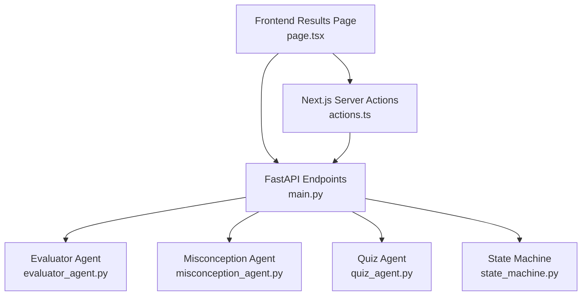
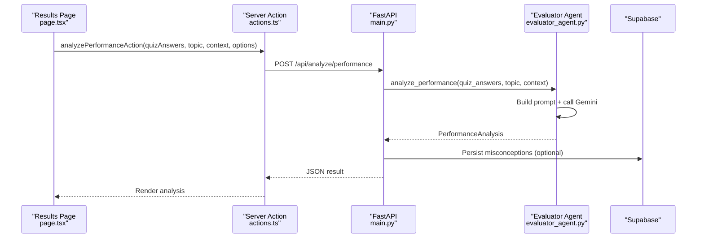
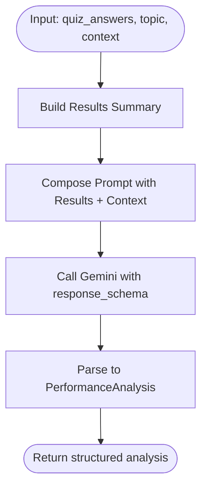
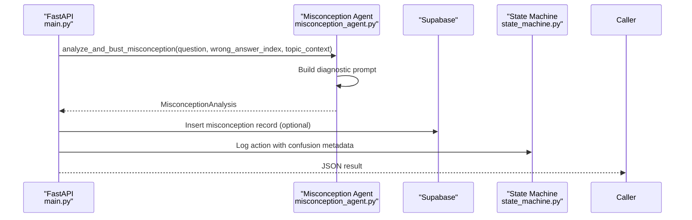
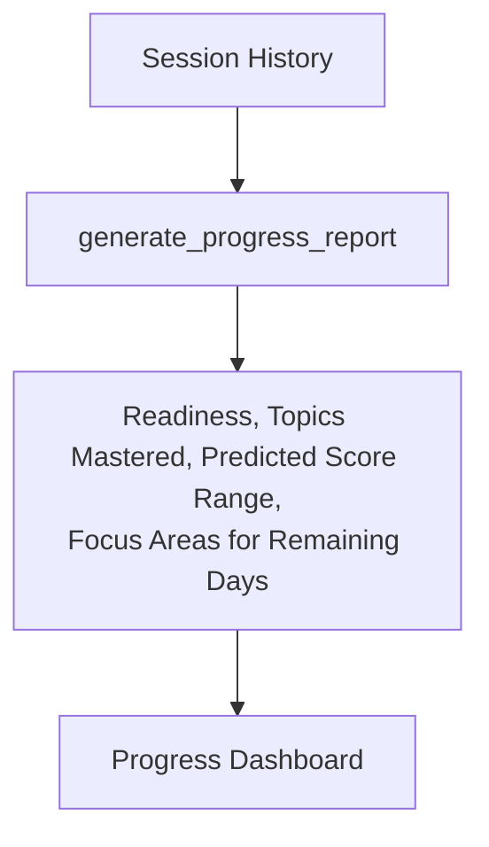
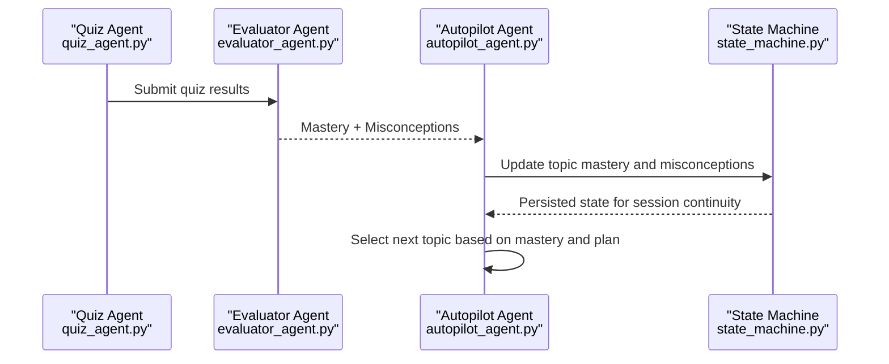
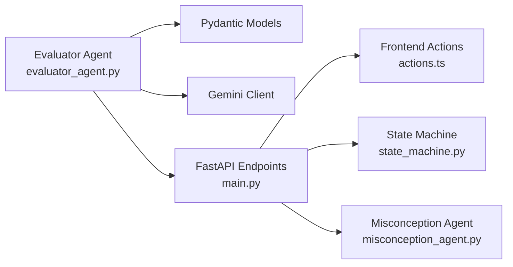

# Evaluator Agent - Performance Analysis

<cite>
**Referenced Files in This Document**
- [evaluator_agent.py](file://backend/agents/evaluator_agent.py)
- [misconception_agent.py](file://backend/agents/misconception_agent.py)
- [schemas.py](file://backend/agents/schemas.py)
- [quiz_agent.py](file://backend/agents/quiz_agent.py)
- [state_machine.py](file://backend/agents/state_machine.py)
- [main.py](file://backend/main.py)
- [router.py](file://backend/router.py)
- [actions.ts](file://frontend/app/actions.ts)
- [page.tsx](file://frontend/app/results/page.tsx)
- [types.ts](file://frontend/lib/types.ts)
</cite>

## Table of Contents
1. [Introduction](#introduction)
2. [Project Structure](#project-structure)
3. [Core Components](#core-components)
4. [Architecture Overview](#architecture-overview)
5. [Detailed Component Analysis](#detailed-component-analysis)
6. [Dependency Analysis](#dependency-analysis)
7. [Performance Considerations](#performance-considerations)
8. [Troubleshooting Guide](#troubleshooting-guide)
9. [Conclusion](#conclusion)
10. [Appendices](#appendices)

## Introduction
This document provides comprehensive documentation for the Evaluator Agent responsible for performance analysis and recommendation generation. It explains how mastery levels, progress tracking, and competency mapping are calculated, how the recommendation engine prioritizes next steps, and how analysis algorithms identify strengths, weaknesses, and learning patterns from assessment data. It also covers integration with the Misconception Agent for targeted interventions, reporting capabilities, and adaptive recommendation systems that evolve with ongoing performance data.

## Project Structure
The Evaluator Agent resides in the backend agents module and integrates with the frontend via FastAPI endpoints. The evaluation pipeline connects quiz results to structured analysis outputs, persists misconceptions, and feeds data into the broader state machine and autopilot orchestration.

**Diagram sources**
- [main.py](file://backend/main.py#L433-L463)
- [evaluator_agent.py](file://backend/agents/evaluator_agent.py#L59-L115)
- [misconception_agent.py](file://backend/agents/misconception_agent.py#L21-L63)
- [quiz_agent.py](file://backend/agents/quiz_agent.py#L206-L246)
- [state_machine.py](file://backend/agents/state_machine.py#L38-L136)
- [page.tsx](file://frontend/app/results/page.tsx#L1-L204)
- [actions.ts](file://frontend/app/actions.ts#L323-L357)

**Section sources**
- [main.py](file://backend/main.py#L433-L463)
- [evaluator_agent.py](file://backend/agents/evaluator_agent.py#L59-L115)
- [page.tsx](file://frontend/app/results/page.tsx#L1-L204)

## Core Components
- PerformanceAnalysis: Top-level analysis result containing overall score, summary, topic mastery breakdown, misconceptions, recommendations, and encouragement.
- TopicMastery: Per-topic mastery with score, status, strength, and weakness descriptors.
- Misconception: Identified conceptual error with description, correction, and suggested review.
- StudyRecommendation: Prioritized next-steps with topic, action, and time estimate.
- QuizAnswer: Input structure for individual quiz responses.
- analyze_performance: Orchestrates prompt construction, model invocation, and structured output parsing.
- generate_progress_report: Aggregates session history for high-level progress insights.

**Section sources**
- [evaluator_agent.py](file://backend/agents/evaluator_agent.py#L15-L44)
- [evaluator_agent.py](file://backend/agents/evaluator_agent.py#L59-L115)
- [evaluator_agent.py](file://backend/agents/evaluator_agent.py#L120-L151)

## Architecture Overview
The evaluation workflow begins when the frontend triggers an analysis request. The backend validates inputs, invokes the Evaluator Agent, and returns a structured PerformanceAnalysis. Misconceptions may be persisted to the database and integrated into the state machine for session-level tracking.

**Diagram sources**
- [page.tsx](file://frontend/app/results/page.tsx#L107-L117)
- [actions.ts](file://frontend/app/actions.ts#L323-L357)
- [main.py](file://backend/main.py#L433-L463)
- [evaluator_agent.py](file://backend/agents/evaluator_agent.py#L59-L115)

## Detailed Component Analysis

### Evaluator Agent: Performance Analysis and Recommendations
The Evaluator Agent transforms raw quiz results into actionable insights. It:
- Calculates overall score from correct answers.
- Formats detailed quiz result summaries.
- Calls Gemini with a structured prompt requesting mastery breakdown, misconceptions, recommendations, and encouragement.
- Parses the response into a strongly typed PerformanceAnalysis.

**Diagram sources**
- [evaluator_agent.py](file://backend/agents/evaluator_agent.py#L59-L115)

**Section sources**
- [evaluator_agent.py](file://backend/agents/evaluator_agent.py#L59-L115)

### Misconception Agent: Targeted Intervention
When a student answers incorrectly, the Misconception Agent:
- Infers the specific confusion behind the wrong choice.
- Provides a counter-example that exposes the flaw in reasoning.
- Offers a redemption question to verify conceptual clarity.
- Persists the inferred confusion and logs to session state when applicable.

**Diagram sources**
- [main.py](file://backend/main.py#L465-L513)
- [misconception_agent.py](file://backend/agents/misconception_agent.py#L21-L63)
- [state_machine.py](file://backend/agents/state_machine.py#L115-L136)

**Section sources**
- [misconception_agent.py](file://backend/agents/misconception_agent.py#L21-L63)
- [main.py](file://backend/main.py#L465-L513)
- [state_machine.py](file://backend/agents/state_machine.py#L115-L136)

### Recommendation Engine: Next Steps and Remediation
Recommendations are generated as part of the PerformanceAnalysis:
- Prioritized study actions with topic, action, and time estimate.
- Remediation suggestions aligned with identified misconceptions.
- Encouragement messages to support a growth mindset.

Integration points:
- Frontend displays recommendations and misconceptions for personalization.
- Autopilot uses mastery data to select next topics and adjust pacing.

**Section sources**
- [evaluator_agent.py](file://backend/agents/evaluator_agent.py#L30-L44)
- [page.tsx](file://frontend/app/results/page.tsx#L310-L326)

### Analysis Algorithms: Strengths, Weaknesses, and Patterns
The Evaluator Agent’s prompt explicitly requests:
- Mastery breakdown by sub-topics.
- Specific misconception identification from incorrect answers.
- Prioritized recommendations for most impactful study.
- Encouraging tone emphasizing growth.

These requirements guide the model to surface:
- Strengths (high-scoring areas) and weaknesses (low-scoring areas).
- Conceptual patterns underlying repeated errors.
- Remediation paths tailored to the student’s profile.

**Section sources**
- [evaluator_agent.py](file://backend/agents/evaluator_agent.py#L88-L104)

### Progress Tracking and Reporting
Two complementary mechanisms track progress:
- Per-session PerformanceAnalysis returned by the Evaluator Agent.
- generate_progress_report aggregates session history for high-level insights.

**Diagram sources**
- [evaluator_agent.py](file://backend/agents/evaluator_agent.py#L120-L151)

**Section sources**
- [evaluator_agent.py](file://backend/agents/evaluator_agent.py#L120-L151)

### Adaptive Recommendation System
Adaptivity emerges from:
- Mastery updates after each quiz (weighted averaging with prior attempts).
- Misconception persistence enabling targeted future quizzes.
- Autopilot topic selection considering prerequisite alignment and spacing.

**Diagram sources**
- [quiz_agent.py](file://backend/agents/quiz_agent.py#L206-L246)
- [evaluator_agent.py](file://backend/agents/evaluator_agent.py#L59-L115)
- [autopilot_agent.py](file://backend/agents/autopilot_agent.py#L394-L401)
- [state_machine.py](file://backend/agents/state_machine.py#L80-L114)

**Section sources**
- [autopilot_agent.py](file://backend/agents/autopilot_agent.py#L394-L401)
- [state_machine.py](file://backend/agents/state_machine.py#L80-L114)

### Integration with Router and State Machine
- Router determines intent and scope to guide content delivery.
- State Machine manages session lifecycle, persists context, and logs agent actions for auditability.

**Section sources**
- [router.py](file://backend/router.py#L64-L88)
- [state_machine.py](file://backend/agents/state_machine.py#L38-L136)

## Dependency Analysis
The Evaluator Agent depends on:
- Pydantic models for structured outputs.
- Gemini client for model invocation.
- Frontend actions and endpoints for request/response orchestration.

**Diagram sources**
- [evaluator_agent.py](file://backend/agents/evaluator_agent.py#L59-L115)
- [main.py](file://backend/main.py#L433-L463)
- [actions.ts](file://frontend/app/actions.ts#L323-L357)
- [state_machine.py](file://backend/agents/state_machine.py#L38-L136)
- [misconception_agent.py](file://backend/agents/misconception_agent.py#L21-L63)

**Section sources**
- [evaluator_agent.py](file://backend/agents/evaluator_agent.py#L59-L115)
- [main.py](file://backend/main.py#L433-L463)
- [actions.ts](file://frontend/app/actions.ts#L323-L357)

## Performance Considerations
- Structured outputs (response_schema) reduce ambiguity and improve reliability.
- Prompt length limits ensure efficient model calls; context truncation is applied.
- Asynchronous model calls enable concurrent processing in larger workflows.
- Persistence operations are guarded with retries and error logging.

[No sources needed since this section provides general guidance]

## Troubleshooting Guide
Common issues and resolutions:
- Model overload or rate limiting: The autopilot engine includes retry logic with exponential backoff for model operations.
- Missing Supabase credentials: State persistence is disabled with a warning; ensure environment variables are configured.
- Analysis failures: The FastAPI endpoint wraps exceptions and returns HTTP 500 with error details.

**Section sources**
- [autopilot_agent.py](file://backend/agents/autopilot_agent.py#L142-L161)
- [state_machine.py](file://backend/agents/state_machine.py#L56-L63)
- [main.py](file://backend/main.py#L461-L462)

## Conclusion
The Evaluator Agent provides a robust foundation for performance analysis, integrating structured outputs, misconception detection, and adaptive recommendations. By combining mastery tracking, targeted remediation, and session state persistence, it enables personalized learning pathways that evolve with student progress.

[No sources needed since this section summarizes without analyzing specific files]

## Appendices

### Example Evaluation Reports
- Mastery Calculation: Overall score computed from correct answers; topic mastery includes strengths and weaknesses.
- Skill Gap Identification: Misconceptions surfaced with corrections and suggested review.
- Personalized Recommendations: Prioritized actions with topic, action, and time estimate.

**Section sources**
- [evaluator_agent.py](file://backend/agents/evaluator_agent.py#L15-L44)
- [page.tsx](file://frontend/app/results/page.tsx#L238-L286)

### Customization Guidelines
- Evaluation Criteria: Adjust the prompt requirements in the Evaluator Agent to emphasize specific competencies or learning objectives.
- Interpretation of Indicators: Use topic mastery status and misconceptions to tailor study plans and remediation sequences.
- Feedback Loops: Persist misconceptions and mastery updates to continuously refine recommendations and topic selection.

**Section sources**
- [evaluator_agent.py](file://backend/agents/evaluator_agent.py#L88-L104)
- [autopilot_agent.py](file://backend/agents/autopilot_agent.py#L394-L401)