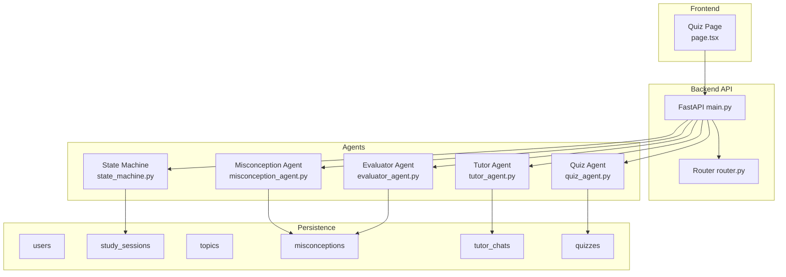
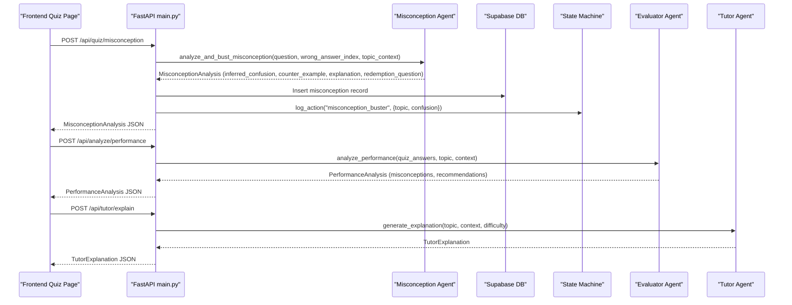
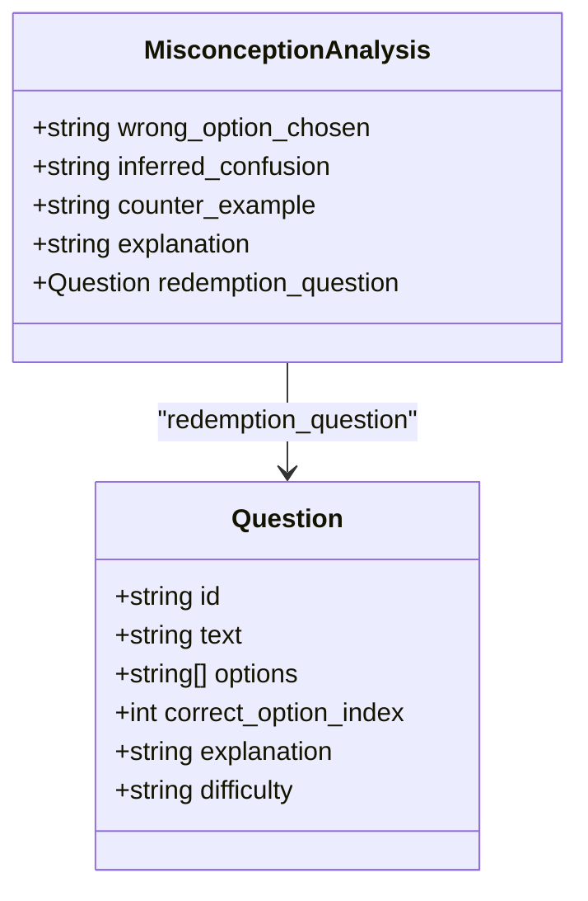
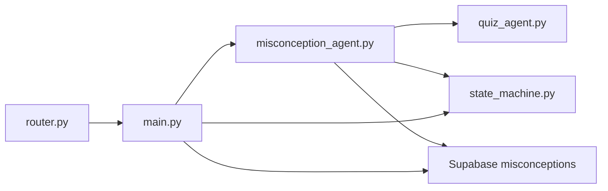

# Misconception Agent - Knowledge Gap Detection

<cite>
**Referenced Files in This Document**
- [misconception_agent.py](file://backend/agents/misconception_agent.py)
- [evaluator_agent.py](file://backend/agents/evaluator_agent.py)
- [tutor_agent.py](file://backend/agents/tutor_agent.py)
- [quiz_agent.py](file://backend/agents/quiz_agent.py)
- [schemas.py](file://backend/agents/schemas.py)
- [main.py](file://backend/main.py)
- [router.py](file://backend/router.py)
- [state_machine.py](file://backend/agents/state_machine.py)
- [001_create_core_schema.sql](file://backend/migrations/001_create_core_schema.sql)
- [004_create_persistence_tables.sql](file://backend/migrations/004_create_persistence_tables.sql)
- [page.tsx](file://frontend/app/quiz/[topicId]/page.tsx)
</cite>

## Table of Contents
1. [Introduction](#introduction)
2. [Project Structure](#project-structure)
3. [Core Components](#core-components)
4. [Architecture Overview](#architecture-overview)
5. [Detailed Component Analysis](#detailed-component-analysis)
6. [Dependency Analysis](#dependency-analysis)
7. [Performance Considerations](#performance-considerations)
8. [Troubleshooting Guide](#troubleshooting-guide)
9. [Conclusion](#conclusion)
10. [Appendices](#appendices)

## Introduction
This document explains the Misconception Agent that identifies and addresses knowledge gaps in student learning. It covers:
- Misconception detection algorithms that analyze assessment patterns, response inconsistencies, and learning behavior
- Remediation recommendation system that suggests targeted interventions, alternative explanations, and practice exercises
- Integration with the evaluator agent for coordinated remediation planning and with the tutor agent for personalized explanation delivery
- Misconception categorization system that classifies knowledge gaps by type, severity, and learning domain
- Tracking mechanisms that monitor remediation effectiveness and measure misconception resolution over time
- Examples of misconception identification scenarios and corresponding remediation strategies
- Adaptive learning integration that adjusts instruction based on identified misconceptions
- Guidance on configuring misconception models, interpreting detection results, and optimizing remediation effectiveness

## Project Structure
The Misconception Agent is part of a multi-agent system orchestrated by a FastAPI backend. The frontend integrates with the backend to trigger misconception analysis after quiz answers.

**Diagram sources**
- [main.py](file://backend/main.py#L1-L843)
- [misconception_agent.py](file://backend/agents/misconception_agent.py#L1-L64)
- [evaluator_agent.py](file://backend/agents/evaluator_agent.py#L1-L198)
- [tutor_agent.py](file://backend/agents/tutor_agent.py#L1-L277)
- [quiz_agent.py](file://backend/agents/quiz_agent.py#L1-L283)
- [state_machine.py](file://backend/agents/state_machine.py#L1-L136)
- [001_create_core_schema.sql](file://backend/migrations/001_create_core_schema.sql#L1-L46)
- [004_create_persistence_tables.sql](file://backend/migrations/004_create_persistence_tables.sql#L1-L44)
- [page.tsx](file://frontend/app/quiz/[topicId]/page.tsx#L1-L311)

**Section sources**
- [main.py](file://backend/main.py#L1-L843)
- [router.py](file://backend/router.py#L1-L129)

## Core Components
- Misconception Agent: Analyzes wrong answers and generates counter-examples, explanations, and redemption questions.
- Evaluator Agent: Analyzes quiz performance and generates personalized insights, misconceptions, and recommendations.
- Tutor Agent: Provides structured, pedagogical explanations and multimodal explanations with visual grounding.
- Quiz Agent: Generates adaptive quizzes and evaluates answers to surface misconceptions.
- State Machine: Manages session lifecycle and logs actions for audit and remediation tracking.
- Persistence: Stores user sessions, misconceptions, chats, and quizzes.

**Section sources**
- [misconception_agent.py](file://backend/agents/misconception_agent.py#L1-L64)
- [evaluator_agent.py](file://backend/agents/evaluator_agent.py#L1-L198)
- [tutor_agent.py](file://backend/agents/tutor_agent.py#L1-L277)
- [quiz_agent.py](file://backend/agents/quiz_agent.py#L1-L283)
- [state_machine.py](file://backend/agents/state_machine.py#L1-L136)
- [001_create_core_schema.sql](file://backend/migrations/001_create_core_schema.sql#L1-L46)
- [004_create_persistence_tables.sql](file://backend/migrations/004_create_persistence_tables.sql#L1-L44)

## Architecture Overview
The Misconception Agent participates in a closed-loop remediation pipeline:
- After a quiz, if a student answers incorrectly, the frontend triggers the misconception endpoint.
- The backend reconstructs the question and calls the Misconception Agent.
- The agent infers the underlying confusion, provides a counter-example, explains the correct concept, and generates a redemption question.
- The result is persisted to the misconceptions table and logged in the session history.
- The Evaluator Agent aggregates misconceptions and generates recommendations.
- The Tutor Agent delivers targeted explanations aligned with detected misconceptions.

**Diagram sources**
- [page.tsx](file://frontend/app/quiz/[topicId]/page.tsx#L240-L273)
- [main.py](file://backend/main.py#L465-L513)
- [misconception_agent.py](file://backend/agents/misconception_agent.py#L21-L63)
- [evaluator_agent.py](file://backend/agents/evaluator_agent.py#L59-L115)
- [tutor_agent.py](file://backend/agents/tutor_agent.py#L131-L186)
- [state_machine.py](file://backend/agents/state_machine.py#L115-L135)

## Detailed Component Analysis

### Misconception Agent
The Misconception Agent performs diagnosis and remediation:
- Input: Question, wrong answer index, topic context
- Output: Inferred confusion, counter-example, explanation, redemption question
- Method: Uses a structured prompt to infer why a wrong option was chosen, provide a counter-example that breaks the misconception, explain the correct concept, and generate a redemption question targeting the same edge case.

**Diagram sources**
- [misconception_agent.py](file://backend/agents/misconception_agent.py#L13-L20)
- [quiz_agent.py](file://backend/agents/quiz_agent.py#L28-L43)

**Section sources**
- [misconception_agent.py](file://backend/agents/misconception_agent.py#L21-L63)

### Evaluator Agent
The Evaluator Agent analyzes quiz results and generates:
- Overall score and summary
- Topic mastery breakdown
- Identified misconceptions
- Study recommendations
- Encouraging message

It aggregates quiz answers and uses structured prompts to diagnose patterns and prioritize remediation.

**Section sources**
- [evaluator_agent.py](file://backend/agents/evaluator_agent.py#L59-L115)

### Tutor Agent
The Tutor Agent provides:
- Structured explanations with intuition, steps, real-world examples, common pitfalls, and practice questions
- Multimodal explanations referencing image highlights
- Streaming and non-streaming modes for UI responsiveness

**Section sources**
- [tutor_agent.py](file://backend/agents/tutor_agent.py#L51-L186)
- [tutor_agent.py](file://backend/agents/tutor_agent.py#L189-L247)

### Quiz Agent
The Quiz Agent:
- Generates adaptive quizzes with concept-specific questions and explanations
- Evaluates answers and surfaces misconceptions
- Supports multimodal quiz generation from images

**Section sources**
- [quiz_agent.py](file://backend/agents/quiz_agent.py#L53-L111)
- [quiz_agent.py](file://backend/agents/quiz_agent.py#L206-L246)
- [quiz_agent.py](file://backend/agents/quiz_agent.py#L138-L201)

### State Machine
The State Machine manages:
- Study phases (INTAKE, PLANNING, LEARNING, QUIZZING, ANALYZING, COMPLETED)
- Valid transitions between phases
- Persistent state and action logging for audit and remediation tracking

**Section sources**
- [state_machine.py](file://backend/agents/state_machine.py#L38-L78)
- [state_machine.py](file://backend/agents/state_machine.py#L80-L114)
- [state_machine.py](file://backend/agents/state_machine.py#L115-L135)

### Frontend Integration
The frontend quiz page:
- Triggers misconception analysis after an incorrect answer
- Persists session and user identifiers for tracking
- Displays remediation results and redemption questions

**Section sources**
- [page.tsx](file://frontend/app/quiz/[topicId]/page.tsx#L240-L273)

## Dependency Analysis
The Misconception Agent depends on:
- Quiz Agent for question reconstruction and context
- State Machine for persistent session logging
- Supabase for storing misconceptions
- Router for routing requests and syllabus scope

**Diagram sources**
- [main.py](file://backend/main.py#L465-L513)
- [misconception_agent.py](file://backend/agents/misconception_agent.py#L1-L64)
- [quiz_agent.py](file://backend/agents/quiz_agent.py#L1-L283)
- [state_machine.py](file://backend/agents/state_machine.py#L1-L136)
- [router.py](file://backend/router.py#L1-L129)

**Section sources**
- [main.py](file://backend/main.py#L465-L513)
- [router.py](file://backend/router.py#L64-L88)

## Performance Considerations
- Structured outputs reduce parsing overhead and improve reliability.
- Streaming endpoints enable responsive UI feedback.
- Caching and reuse of context minimize repeated computations.
- Indexes on frequently queried columns (user_id, session_id) improve persistence performance.

[No sources needed since this section provides general guidance]

## Troubleshooting Guide
Common issues and resolutions:
- API failures: Verify environment variables (Gemini API key/model) and Supabase credentials.
- Misconception persistence errors: Check database connectivity and permissions; confirm table creation.
- State persistence errors: Ensure session_id is valid and Supabase keys are configured.
- Frontend integration: Confirm user_id and session_id are present when invoking misconception endpoints.

**Section sources**
- [main.py](file://backend/main.py#L465-L513)
- [state_machine.py](file://backend/agents/state_machine.py#L54-L63)
- [001_create_core_schema.sql](file://backend/migrations/001_create_core_schema.sql#L34-L40)

## Conclusion
The Misconception Agent forms a critical component of an adaptive, remediation-driven learning system. By combining diagnostic inference, targeted explanations, and persistent tracking, it enables personalized interventions that address specific knowledge gaps. Integration with the Evaluator and Tutor Agents ensures coordinated remediation planning and delivery, while the State Machine and persistence layer support long-term tracking and optimization.

[No sources needed since this section summarizes without analyzing specific files]

## Appendices

### Misconception Categorization System
- Type: Conceptual error inferred from wrong option
- Severity: Derived from frequency and impact in evaluator recommendations
- Learning Domain: Topic/concept tested by the question

**Section sources**
- [evaluator_agent.py](file://backend/agents/evaluator_agent.py#L23-L43)
- [quiz_agent.py](file://backend/agents/quiz_agent.py#L28-L43)

### Remediation Recommendation System
- Immediate: Counter-example and redemption question
- Short-term: Tutor explanations aligned with detected misconceptions
- Long-term: Evaluator-generated recommendations prioritized by impact

**Section sources**
- [misconception_agent.py](file://backend/agents/misconception_agent.py#L13-L20)
- [evaluator_agent.py](file://backend/agents/evaluator_agent.py#L30-L43)
- [tutor_agent.py](file://backend/agents/tutor_agent.py#L131-L186)

### Tracking Mechanisms
- Misconceptions table stores inferred confusion with timestamps
- Session history logs remediation actions for audit
- Topic mastery scores and recommendations guide next steps

**Section sources**
- [001_create_core_schema.sql](file://backend/migrations/001_create_core_schema.sql#L34-L40)
- [state_machine.py](file://backend/agents/state_machine.py#L115-L135)
- [evaluator_agent.py](file://backend/agents/evaluator_agent.py#L15-L43)

### Example Scenarios and Strategies
- Scenario: Student selects a plausible but incorrect option due to a common misconception.
  - Strategy: Provide a counter-example that exposes the flaw in reasoning, explain the correct concept, and offer a redemption question testing the same edge case.
- Scenario: Frequent wrong answers on a specific concept.
  - Strategy: Elevate recommendation priority, schedule targeted tutoring, and generate adaptive quizzes focusing on that concept.

**Section sources**
- [misconception_agent.py](file://backend/agents/misconception_agent.py#L21-L63)
- [evaluator_agent.py](file://backend/agents/evaluator_agent.py#L59-L115)
- [quiz_agent.py](file://backend/agents/quiz_agent.py#L53-L111)

### Adaptive Learning Integration
- Previous misconceptions influence quiz generation to target known weak spots.
- Tutor explanations adapt to student’s prior knowledge and session history.
- Evaluator recommendations adjust based on recent performance and remediation outcomes.

**Section sources**
- [quiz_agent.py](file://backend/agents/quiz_agent.py#L53-L111)
- [tutor_agent.py](file://backend/agents/tutor_agent.py#L131-L186)
- [evaluator_agent.py](file://backend/agents/evaluator_agent.py#L59-L115)

### Configuration and Interpretation Guidelines
- Configure Gemini API key and model in environment variables.
- Use structured outputs to ensure reliable parsing.
- Interpret inferred_confusion as the core misconception; use counter_example and explanation to guide remediation.
- Track remediation effectiveness via reduction in misconception frequency and improvement in mastery scores.

**Section sources**
- [main.py](file://backend/main.py#L17-L21)
- [misconception_agent.py](file://backend/agents/misconception_agent.py#L29-L61)
- [schemas.py](file://backend/agents/schemas.py#L90-L105)