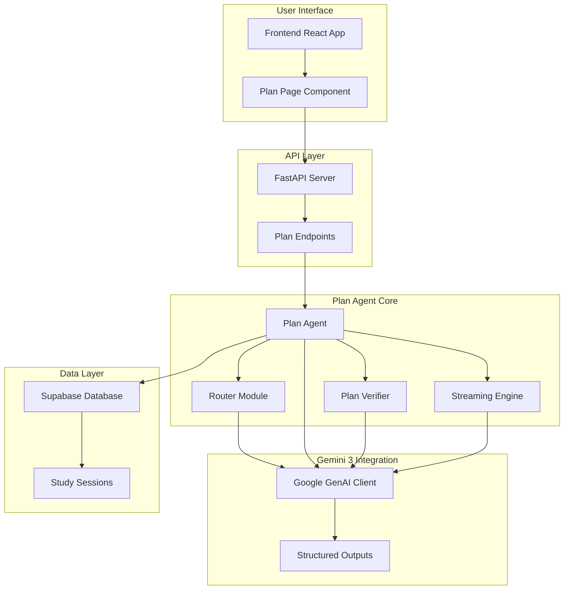
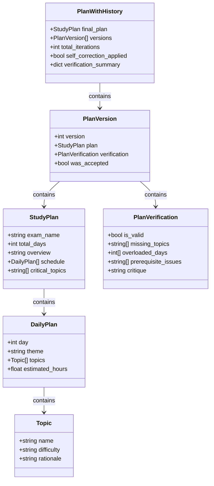
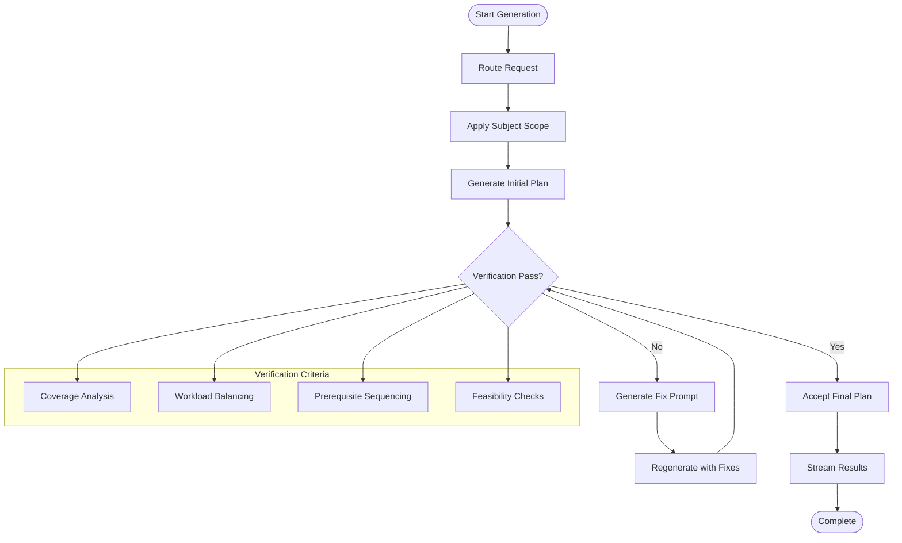
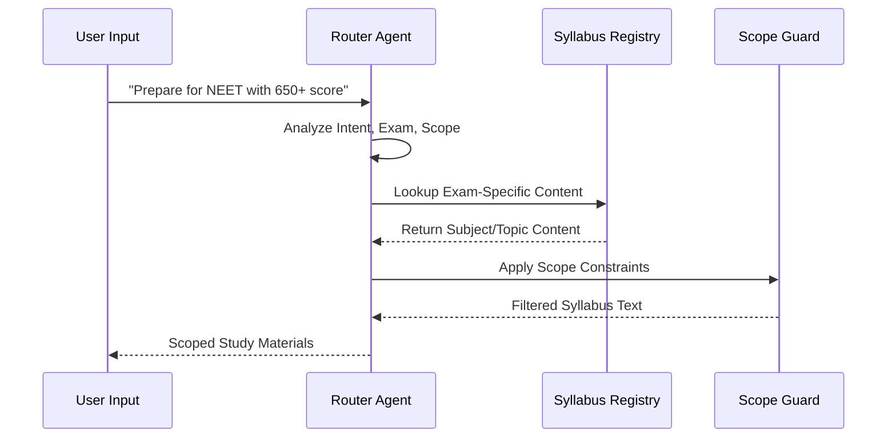
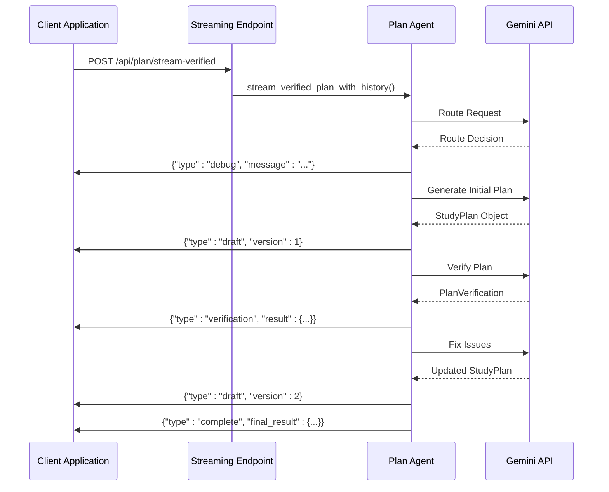

# Plan Agent - Study Plan Generation

<cite>
**Referenced Files in This Document**
- [plan_agent.py](file://backend/agents/plan_agent.py)
- [schemas.py](file://backend/agents/schemas.py)
- [router.py](file://backend/router.py)
- [genai_service.py](file://backend/services/genai_service.py)
- [main.py](file://backend/main.py)
- [page.tsx](file://frontend/app/plan/page.tsx)
- [.env](file://backend/.env)
</cite>

## Table of Contents
1. [Introduction](#introduction)
2. [System Architecture](#system-architecture)
3. [Core Components](#core-components)
4. [Structured Output Schemas](#structured-output-schemas)
5. [Self-Correction Algorithm](#self-correction-algorithm)
6. [Routing Integration](#routing-integration)
7. [Streaming Implementation](#streaming-implementation)
8. [Verification Criteria](#verification-criteria)
9. [Usage Examples](#usage-examples)
10. [API Endpoints](#api-endpoints)
11. [Troubleshooting Guide](#troubleshooting-guide)
12. [Conclusion](#conclusion)

## Introduction

The Plan Agent is a sophisticated AI-powered system designed to generate personalized study plans for competitive exam preparation. Built on Google's Gemini 3 technology, it leverages structured output schemas to guarantee valid JSON responses while implementing an intelligent self-correction algorithm that iteratively improves study plans based on pedagogical requirements.

The system integrates multiple AI agents working in concert: a routing system that scopes syllabi based on exam type and user goals, a verification system that ensures pedagogical soundness, and a streaming interface that provides real-time feedback during plan generation. This creates a transparent, auditable process that demonstrates the AI's reasoning and corrections to users.

## System Architecture

The Plan Agent operates within a multi-agent ecosystem that combines routing, generation, verification, and streaming capabilities:



**Diagram sources**
- [main.py](file://backend/main.py#L126-L223)
- [plan_agent.py](file://backend/agents/plan_agent.py#L181-L304)
- [router.py](file://backend/router.py#L64-L88)

## Core Components

### Plan Agent Implementation

The Plan Agent is implemented as a comprehensive asynchronous system that handles multiple phases of study plan generation:



**Diagram sources**
- [plan_agent.py](file://backend/agents/plan_agent.py#L17-L45)
- [plan_agent.py](file://backend/agents/plan_agent.py#L129-L143)

**Section sources**
- [plan_agent.py](file://backend/agents/plan_agent.py#L49-L304)

## Structured Output Schemas

The Plan Agent utilizes Pydantic models to ensure strict JSON output validation from Gemini 3's structured outputs feature. These schemas define the exact structure and constraints for all generated content.

### StudyPlan Schema

The StudyPlan model serves as the primary output structure, containing comprehensive study plan information:

| Field | Type | Constraints | Description |
|-------|------|-------------|-------------|
| exam_name | string | Required | Name of the target exam (e.g., "NEET", "JEE", "UPSC", "CAT") |
| total_days | integer | 1-30 | Total duration of the study plan in days |
| overview | string | Required | Brief strategy summary for the student |
| schedule | List[DailyPlan] | Required | Complete daily breakdown of study activities |
| critical_topics | List[string] | 3-5 items | Top priority topics requiring intensive focus |

### DailyPlan Schema

Each day in the study plan follows a standardized structure:

| Field | Type | Constraints | Description |
|-------|------|-------------|-------------|
| day | integer | 1-30 | Calendar day number in the plan |
| theme | string | Required | Daily focus area or learning theme |
| topics | List[Topic] | 1+ items | Specific topics to be covered that day |
| estimated_hours | float | 0.5-12 | Total time allocation for the day |

### Topic Schema

Individual learning topics are structured with pedagogical considerations:

| Field | Type | Constraints | Description |
|-------|------|-------------|-------------|
| name | string | Required | Topic identifier (e.g., "Cell Division", "Photosynthesis") |
| difficulty | string | "easy", "medium", or "hard" | Complexity level assignment |
| rationale | string | Required | Educational justification for topic inclusion |

### PlanVerification Schema

The verification system evaluates plans against multiple criteria:

| Field | Type | Description |
|-------|------|-------------|
| is_valid | boolean | Overall validity assessment |
| missing_topics | List[string] | Topics absent from the plan |
| overloaded_days | List[int] | Days exceeding recommended hour limits |
| prerequisite_issues | List[string] | Topics scheduled out of logical order |
| critique | string | Detailed feedback for improvements |

**Section sources**
- [plan_agent.py](file://backend/agents/plan_agent.py#L17-L45)

## Self-Correction Algorithm

The Plan Agent implements an iterative self-correction algorithm that continuously improves study plans through automated verification and refinement:



**Diagram sources**
- [plan_agent.py](file://backend/agents/plan_agent.py#L163-L304)

### Algorithm Phases

1. **Routing Phase**: Analyzes user intent and exam context to scope appropriate syllabus content
2. **Generation Phase**: Creates initial study plan using Gemini 3 structured outputs
3. **Verification Phase**: Evaluates plan against pedagogical criteria
4. **Correction Phase**: Generates targeted fixes for identified issues
5. **Iteration Phase**: Repeats verification until acceptable or iteration limit reached

### Verification Metrics

The system tracks several key metrics to assess plan quality:

- **Coverage Percentage**: `(100 - missing_topics_count * 5)%`
- **Workload Distribution**: Count of days exceeding 8-hour limits
- **Prerequisite Compliance**: Number of logical sequencing violations
- **Iteration Efficiency**: Total iterations required for acceptance

**Section sources**
- [plan_agent.py](file://backend/agents/plan_agent.py#L231-L283)
- [plan_agent.py](file://backend/agents/plan_agent.py#L455-L462)

## Routing Integration

The routing system intelligently scopes syllabi based on exam type and user goals, ensuring relevant content delivery:



**Diagram sources**
- [router.py](file://backend/router.py#L64-L88)
- [router.py](file://backend/router.py#L91-L128)

### Routing Capabilities

The router identifies three key aspects of user requests:

1. **Intent Classification**: Determines whether user wants planning, explanation, or quiz generation
2. **Exam Type Detection**: Identifies target exams (NEET, JEE, UPSC, CAT)
3. **Subject Scope Resolution**: Extracts specific subjects and sub-topics

### Syllabus Management

The system maintains comprehensive syllabus registries organized by exam type:

- **NEET/JEE**: Multi-subject with nested chemistry categories
- **UPSC**: Broad subjects including History, Geography, Polity, Economy
- **CAT**: Quantitative, Verbal, and Data Interpretation sections

**Section sources**
- [router.py](file://backend/router.py#L35-L61)
- [router.py](file://backend/router.py#L64-L88)

## Streaming Implementation

The Plan Agent provides real-time streaming feedback during the generation process, enabling responsive user interfaces:



**Diagram sources**
- [plan_agent.py](file://backend/agents/plan_agent.py#L307-L475)
- [main.py](file://backend/main.py#L205-L222)

### Streaming Event Types

The system emits structured JSON events with different types:

- **debug**: Internal routing and scoping information
- **status**: Progress updates and phase transitions
- **draft**: Complete study plan snapshots for each iteration
- **verification**: Detailed critique and validation results
- **complete**: Final result with full history and metrics

### Real-Time Feedback

The streaming implementation enables dynamic user interfaces that show:

- Current generation phase and progress
- Automated verification results with specific issue details
- Live plan previews for each iteration
- Final acceptance status and improvement metrics

**Section sources**
- [plan_agent.py](file://backend/agents/plan_agent.py#L313-L475)
- [main.py](file://backend/main.py#L205-L222)

## Verification Criteria

The Plan Agent employs comprehensive verification criteria to ensure pedagogical soundness and practical feasibility:

### Coverage Analysis

Ensures complete syllabus representation:
- **Missing Topics Detection**: Identifies unaddressed major topics
- **Weighted Priority**: Focuses on high-yield, frequently tested concepts
- **Content Completeness**: Verifies all essential learning objectives

### Workload Balancing

Maintains realistic and sustainable study schedules:
- **Hour Limits**: Prevents days exceeding 8-hour study capacity
- **Distribution Analysis**: Ensures balanced workload across schedule
- **Rest Days**: Incorporates adequate recovery and review periods

### Prerequisite Sequencing

Follows logical learning progression:
- **Concept Dependencies**: Identifies foundational knowledge requirements
- **Skill Building**: Ensures sequential development of complex abilities
- **Cognitive Load**: Manages increasing difficulty appropriately

### Feasibility Checks

Validates practical implementation:
- **Time Realism**: Aligns study plans with available daily hours
- **Resource Availability**: Considers accessibility of materials and resources
- **Progress Monitoring**: Enables tracking and adjustment mechanisms

**Section sources**
- [plan_agent.py](file://backend/agents/plan_agent.py#L98-L126)

## Usage Examples

### Basic Plan Generation

Simple synchronous usage for straightforward scenarios:

```python
# Basic usage pattern
plan = generate_study_plan_sync(
    syllabus_text="Biology content...",
    exam_type="NEET",
    goal="Score 650+ in NEET",
    days=7
)
```

### Verified Plan Generation

Asynchronous generation with automatic quality assurance:

```python
# Enhanced generation with verification
result = await generate_verified_plan_with_history(
    syllabus_text="Complete syllabus content",
    exam_type="JEE",
    goal="Master physics fundamentals",
    days=14,
    max_iterations=3
)
```

### Streaming Plan Generation

Real-time user experience with progress feedback:

```python
# Streaming implementation for UI responsiveness
async for event in stream_verified_plan_with_history(
    syllabus_text="Chemistry syllabus",
    exam_type="NEET",
    goal="Organic chemistry mastery",
    days=10
):
    data = json.loads(event.strip())
    handle_stream_event(data)
```

### Frontend Integration

React component integration for plan display:

```typescript
// Frontend consumption example
const StudyPlanDisplay = () => {
    const [plan, setPlan] = useState<StudyPlan | null>(null);
    
    useEffect(() => {
        const storedPlan = localStorage.getItem("studyPlan");
        if (storedPlan) {
            setPlan(JSON.parse(storedPlan));
        }
    }, []);
    
    return (
        <div>
            {plan && (
                <div>
                    <h1>{plan.exam_name}</h1>
                    <p>{plan.overview}</p>
                    {plan.schedule.map(day => (
                        <div key={day.day}>
                            <h3>Day {day.day}: {day.theme}</h3>
                            <p>{day.estimated_hours} hours</p>
                        </div>
                    ))}
                </div>
            )}
        </div>
    );
};
```

**Section sources**
- [plan_agent.py](file://backend/agents/plan_agent.py#L481-L490)
- [page.tsx](file://frontend/app/plan/page.tsx#L35-L267)

## API Endpoints

The Plan Agent exposes multiple endpoints for different use cases:

### Standard Endpoints

| Endpoint | Method | Purpose | Response |
|----------|--------|---------|----------|
| `/api/plan/generate` | POST | Legacy plan generation | StudyPlan JSON |
| `/api/plan/generate-verified` | POST | Verified plan generation | StudyPlan JSON |
| `/api/plan/generate-verified-with-history` | POST | Full history with metrics | Enhanced JSON |

### Streaming Endpoints

| Endpoint | Method | Purpose | Response |
|----------|--------|---------|----------|
| `/api/plan/stream-verified` | POST | Real-time plan generation | NDJSON Stream |

### Request/Response Formats

All endpoints accept the same request structure:

```json
{
  "syllabus_text": "Complete exam syllabus content",
  "exam_type": "NEET",
  "goal": "Score 650+ in NEET",
  "days": 7
}
```

**Section sources**
- [main.py](file://backend/main.py#L128-L202)

## Troubleshooting Guide

### Common Issues and Solutions

**Gemini API Errors**
- **Symptom**: Generation failures or timeouts
- **Solution**: Check API key validity and rate limits in environment variables
- **Prevention**: Implement retry logic and graceful degradation

**Schema Validation Failures**
- **Symptom**: JSON parsing errors from structured outputs
- **Solution**: Verify Pydantic model definitions match Gemini response expectations
- **Prevention**: Use consistent field definitions across all models

**Routing Ambiguity**
- **Symptom**: Incorrect subject scope or exam classification
- **Solution**: Enhance user input with clearer exam and goal specifications
- **Prevention**: Implement routing confidence thresholds and clarification prompts

**Streaming Connection Issues**
- **Symptom**: Interrupted streaming or incomplete event sequences
- **Solution**: Ensure proper NDJSON formatting and connection handling
- **Prevention**: Implement robust connection monitoring and reconnection logic

### Environment Configuration

Ensure proper environment setup:

```bash
# Required environment variables
GEMINI_API_KEY=your_api_key_here
GEMINI_MODEL=gemini-3-flash-preview
DATABASE_URL=your_supabase_connection_string
SUPABASE_URL=your_supabase_url
SUPABASE_KEY=your_supabase_key
```

**Section sources**
- [.env](file://backend/.env#L1-L5)
- [plan_agent.py](file://backend/agents/plan_agent.py#L78-L85)

## Conclusion

The Plan Agent represents a sophisticated implementation of AI-powered educational assistance, combining structured output validation, intelligent routing, and iterative self-correction to deliver high-quality, personalized study plans. Its modular architecture enables seamless integration with various frontend applications while maintaining transparency through streaming feedback and comprehensive verification metrics.

The system's strength lies in its pedagogical rigor, ensuring that generated plans not only cover essential content but also follow optimal learning principles including proper sequencing, workload distribution, and practical feasibility. The integration of real-time streaming provides users with immediate feedback and insight into the AI's reasoning process, enhancing trust and understanding of the generated recommendations.

Future enhancements could include expanded exam coverage, adaptive difficulty adjustment, integration with learning analytics, and enhanced collaborative features for peer-to-peer study planning.