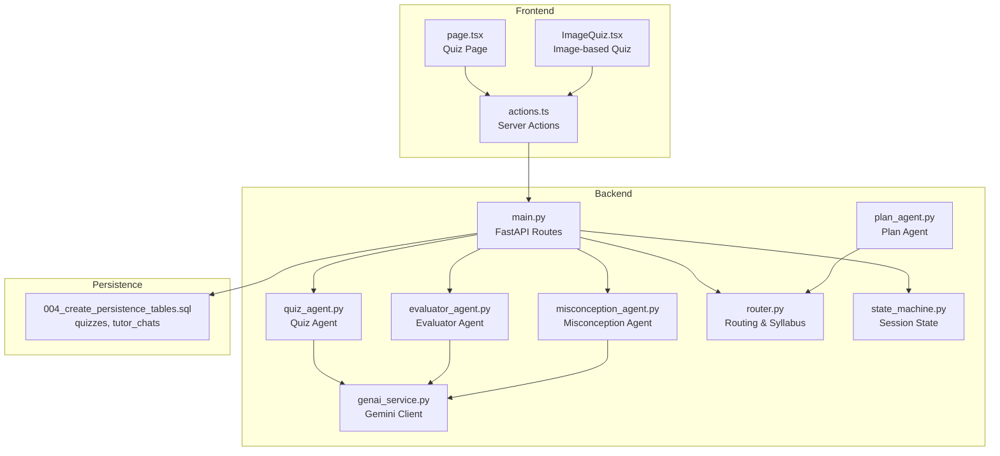
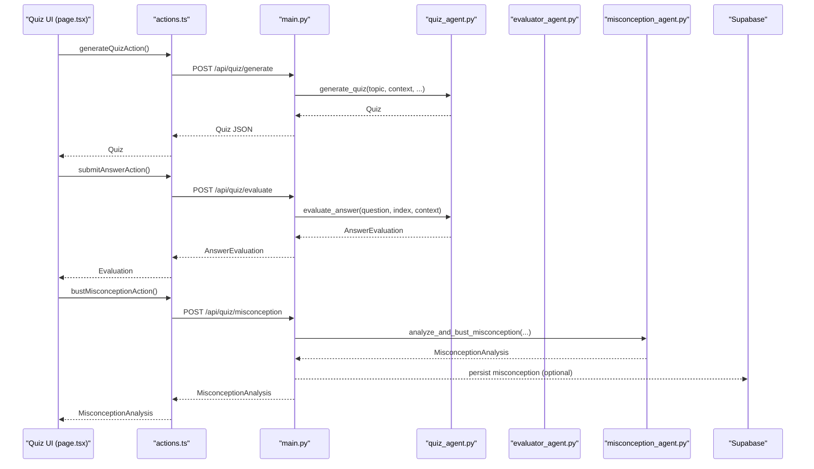
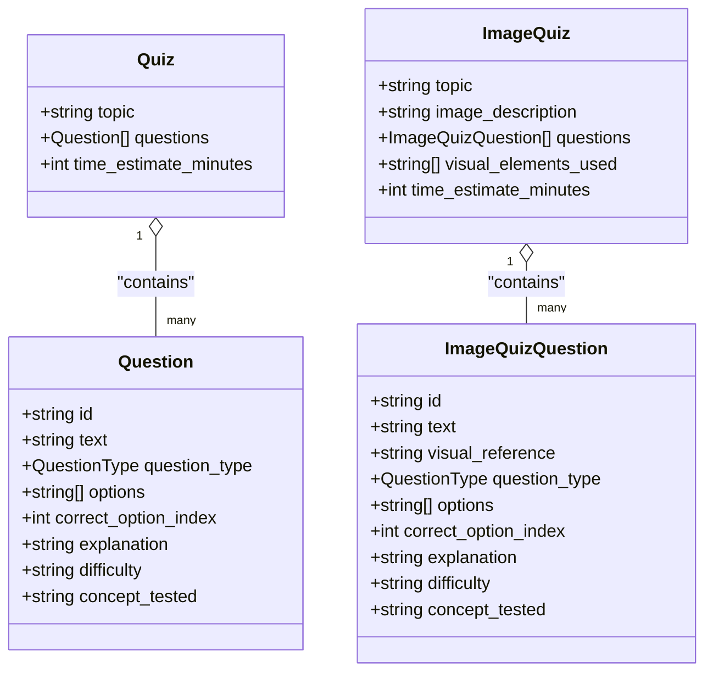
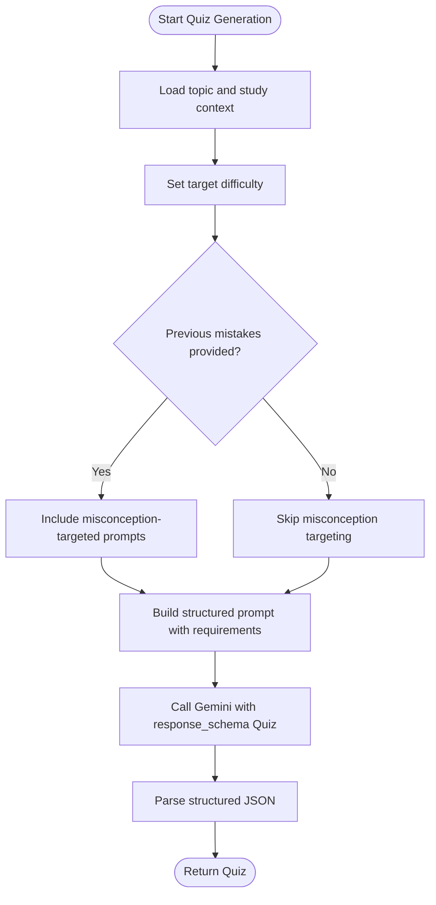
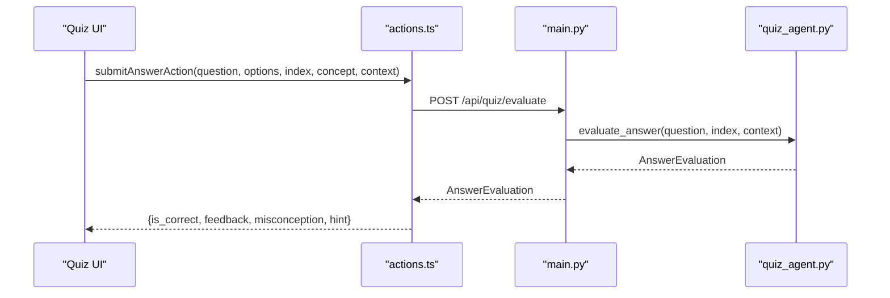
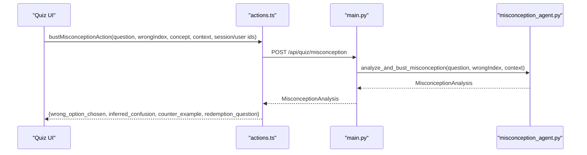
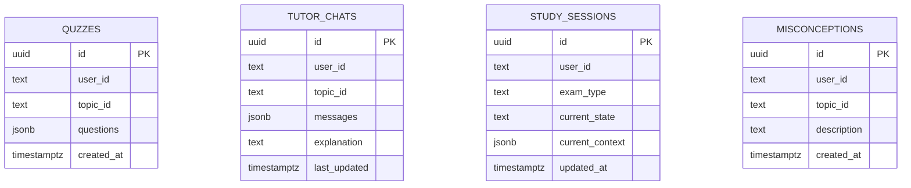
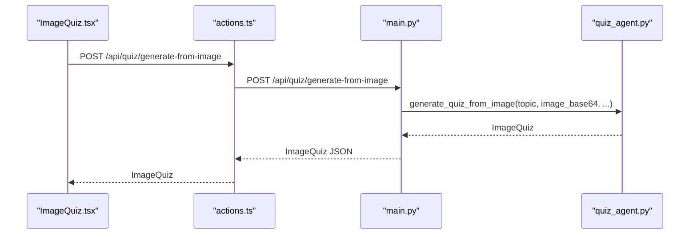
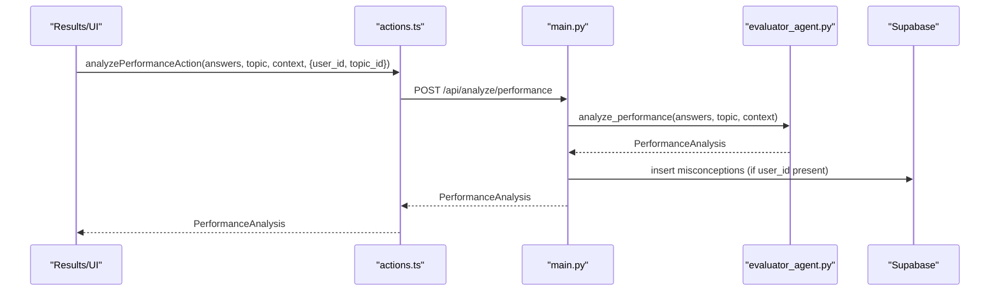
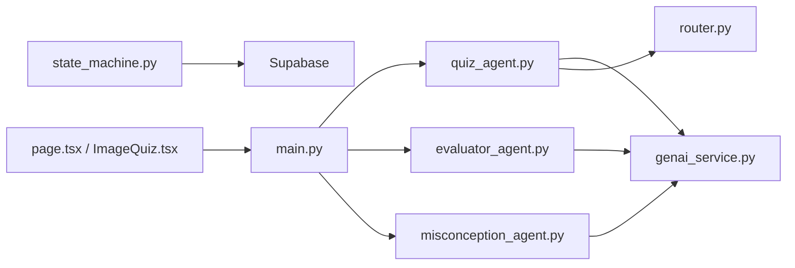

# Quiz Agent - Assessment Generation

<cite>
**Referenced Files in This Document**
- [quiz_agent.py](file://backend/agents/quiz_agent.py)
- [schemas.py](file://backend/agents/schemas.py)
- [genai_service.py](file://backend/services/genai_service.py)
- [misconception_agent.py](file://backend/agents/misconception_agent.py)
- [evaluator_agent.py](file://backend/agents/evaluator_agent.py)
- [router.py](file://backend/router.py)
- [main.py](file://backend/main.py)
- [actions.ts](file://frontend/app/actions.ts)
- [page.tsx](file://frontend/app/quiz/[topicId]/page.tsx)
- [ImageQuiz.tsx](file://frontend/components/ImageQuiz.tsx)
- [004_create_persistence_tables.sql](file://backend/migrations/004_create_persistence_tables.sql)
- [.env](file://backend/.env)
- [state_machine.py](file://backend/agents/state_machine.py)
- [plan_agent.py](file://backend/agents/plan_agent.py)
</cite>

## Table of Contents
1. [Introduction](#introduction)
2. [Project Structure](#project-structure)
3. [Core Components](#core-components)
4. [Architecture Overview](#architecture-overview)
5. [Detailed Component Analysis](#detailed-component-analysis)
6. [Dependency Analysis](#dependency-analysis)
7. [Performance Considerations](#performance-considerations)
8. [Troubleshooting Guide](#troubleshooting-guide)
9. [Conclusion](#conclusion)
10. [Appendices](#appendices)

## Introduction
This document explains the Quiz Agent responsible for generating adaptive assessments and evaluating student responses. It covers multimodal quiz generation (standard text-based and diagram-based), adaptive question generation, answer evaluation, misconception detection, persistence mechanisms, and integration with the broader system. It also documents quiz types, integration with the misconception agent, customization options, and streaming response support for real-time feedback.

## Project Structure
The Quiz Agent spans backend agents, frontend pages, and supporting services:
- Backend agents implement quiz generation, evaluation, and misconception analysis.
- Frontend pages orchestrate quiz lifecycle, persistence, and user interactions.
- Services provide shared Gemini client initialization and database persistence.

**Diagram sources**
- [main.py](file://backend/main.py#L327-L430)
- [quiz_agent.py](file://backend/agents/quiz_agent.py#L53-L111)
- [evaluator_agent.py](file://backend/agents/evaluator_agent.py#L59-L115)
- [misconception_agent.py](file://backend/agents/misconception_agent.py#L21-L63)
- [router.py](file://backend/router.py#L64-L88)
- [genai_service.py](file://backend/services/genai_service.py#L1-L10)
- [state_machine.py](file://backend/agents/state_machine.py#L38-L136)
- [plan_agent.py](file://backend/agents/plan_agent.py#L49-L87)
- [page.tsx](file://frontend/app/quiz/[topicId]/page.tsx#L127-L144)
- [ImageQuiz.tsx](file://frontend/components/ImageQuiz.tsx#L89-L114)
- [004_create_persistence_tables.sql](file://backend/migrations/004_create_persistence_tables.sql#L14-L26)

**Section sources**
- [main.py](file://backend/main.py#L327-L430)
- [quiz_agent.py](file://backend/agents/quiz_agent.py#L53-L111)
- [evaluator_agent.py](file://backend/agents/evaluator_agent.py#L59-L115)
- [misconception_agent.py](file://backend/agents/misconception_agent.py#L21-L63)
- [router.py](file://backend/router.py#L64-L88)
- [genai_service.py](file://backend/services/genai_service.py#L1-L10)
- [state_machine.py](file://backend/agents/state_machine.py#L38-L136)
- [plan_agent.py](file://backend/agents/plan_agent.py#L49-L87)
- [page.tsx](file://frontend/app/quiz/[topicId]/page.tsx#L127-L144)
- [ImageQuiz.tsx](file://frontend/components/ImageQuiz.tsx#L89-L114)
- [004_create_persistence_tables.sql](file://backend/migrations/004_create_persistence_tables.sql#L14-L26)

## Core Components
- Quiz Agent: Generates adaptive quizzes and evaluates answers with multimodal support.
- Evaluator Agent: Analyzes quiz performance and generates personalized insights.
- Misconception Agent: Diagnoses wrong answers and provides targeted remediation.
- Router: Routes requests and scopes syllabi for context-aware generation.
- State Machine: Tracks session phases and logs actions for autopilot workflows.
- Frontend Pages: Orchestrate quiz lifecycle, persistence, and user interactions.

**Section sources**
- [quiz_agent.py](file://backend/agents/quiz_agent.py#L53-L111)
- [evaluator_agent.py](file://backend/agents/evaluator_agent.py#L59-L115)
- [misconception_agent.py](file://backend/agents/misconception_agent.py#L21-L63)
- [router.py](file://backend/router.py#L64-L88)
- [state_machine.py](file://backend/agents/state_machine.py#L38-L136)

## Architecture Overview
The Quiz Agent integrates with FastAPI endpoints, Gemini structured outputs, and Supabase for persistence. The frontend invokes server actions that call backend routes, which delegate to agents.

**Diagram sources**
- [page.tsx](file://frontend/app/quiz/[topicId]/page.tsx#L127-L144)
- [actions.ts](file://frontend/app/actions.ts#L243-L299)
- [main.py](file://backend/main.py#L329-L429)
- [quiz_agent.py](file://backend/agents/quiz_agent.py#L53-L111)
- [evaluator_agent.py](file://backend/agents/evaluator_agent.py#L59-L115)
- [misconception_agent.py](file://backend/agents/misconception_agent.py#L21-L63)

## Detailed Component Analysis

### Quiz Generation and Multimodal Support
The Quiz Agent supports:
- Standard text-based quizzes with multiple-choice, true/false, and fill-in-the-blank types.
- Multimodal quizzes from images, where questions reference specific visual regions.

Key capabilities:
- Adaptive difficulty targeting via difficulty parameter.
- Previous misconception injection to target known weaknesses.
- Structured JSON output via Gemini 3 response_schema for robust parsing.

**Diagram sources**
- [quiz_agent.py](file://backend/agents/quiz_agent.py#L28-L43)
- [quiz_agent.py](file://backend/agents/quiz_agent.py#L116-L136)

**Section sources**
- [quiz_agent.py](file://backend/agents/quiz_agent.py#L53-L111)
- [quiz_agent.py](file://backend/agents/quiz_agent.py#L138-L201)

### Adaptive Question Generation Algorithm
The algorithm adapts to student performance and learning objectives:
- Difficulty targeting: The difficulty parameter steers question complexity.
- Previous mistakes: Passing previous misconceptions influences question selection to address those gaps.
- Contextual depth: Study material context ensures questions test understanding, not rote memorization.

**Diagram sources**
- [quiz_agent.py](file://backend/agents/quiz_agent.py#L53-L111)

**Section sources**
- [quiz_agent.py](file://backend/agents/quiz_agent.py#L53-L111)

### Answer Evaluation and Feedback
The evaluation process:
- Compares chosen option with correct answer.
- Generates personalized feedback and hints.
- Identifies misconceptions for remediation.

**Diagram sources**
- [actions.ts](file://frontend/app/actions.ts#L269-L299)
- [main.py](file://backend/main.py#L403-L429)
- [quiz_agent.py](file://backend/agents/quiz_agent.py#L206-L246)

**Section sources**
- [quiz_agent.py](file://backend/agents/quiz_agent.py#L206-L246)

### Misconception Detection and Remediation
When a student answers incorrectly, the system can trigger misconception analysis:
- Infers underlying confusion from the wrong choice.
- Provides a counter-example that breaks the misconception.
- Offers a redemption question at the same difficulty to confirm understanding.

**Diagram sources**
- [actions.ts](file://frontend/app/actions.ts#L408-L432)
- [main.py](file://backend/main.py#L465-L514)
- [misconception_agent.py](file://backend/agents/misconception_agent.py#L21-L63)

**Section sources**
- [misconception_agent.py](file://backend/agents/misconception_agent.py#L21-L63)
- [main.py](file://backend/main.py#L465-L514)

### Quiz Persistence and Tracking
The system persists quizzes and related chat history:
- Quizzes table stores generated questions per user/topic.
- Tutor chats table stores explanations and messages.
- Indexes and RLS enable efficient queries and access control.

**Diagram sources**
- [004_create_persistence_tables.sql](file://backend/migrations/004_create_persistence_tables.sql#L14-L44)

**Section sources**
- [004_create_persistence_tables.sql](file://backend/migrations/004_create_persistence_tables.sql#L14-L44)
- [main.py](file://backend/main.py#L762-L800)

### Multimodal Image-Based Assessments
The frontend supports image-based quizzes:
- Users upload diagrams/images.
- Backend generates questions grounded in visual references (e.g., “In the top-left section…”).
- UI renders the image, references, and answer options.

**Diagram sources**
- [ImageQuiz.tsx](file://frontend/components/ImageQuiz.tsx#L89-L114)
- [actions.ts](file://frontend/app/actions.ts#L361-L406)
- [main.py](file://backend/main.py#L356-L401)
- [quiz_agent.py](file://backend/agents/quiz_agent.py#L138-L201)

**Section sources**
- [ImageQuiz.tsx](file://frontend/components/ImageQuiz.tsx#L89-L114)
- [main.py](file://backend/main.py#L356-L401)
- [quiz_agent.py](file://backend/agents/quiz_agent.py#L138-L201)

### Integration with the Misconception Agent for Remediation
The Evaluator Agent aggregates performance and can persist misconceptions:
- On analysis completion, misconceptions are persisted to the database when user context is available.
- The system can also log misconceptions to session state for autopilot workflows.

**Diagram sources**
- [actions.ts](file://frontend/app/actions.ts#L323-L357)
- [main.py](file://backend/main.py#L433-L463)
- [evaluator_agent.py](file://backend/agents/evaluator_agent.py#L59-L115)

**Section sources**
- [main.py](file://backend/main.py#L433-L463)
- [evaluator_agent.py](file://backend/agents/evaluator_agent.py#L59-L115)

### Customization Options
- Quiz parameters: topic, context, number of questions, difficulty, previous mistakes.
- Question types: multiple choice, true/false, fill blank (via schemas).
- Evaluation criteria: correctness, feedback, misconception identification, hints.
- Multimodal image prompts: visual references and element usage.

Practical customization points:
- Adjust difficulty and num_questions in frontend actions and backend routes.
- Pass previous_mistakes to tailor quiz content.
- Modify prompts in agents for stricter requirements or different styles.

**Section sources**
- [quiz_agent.py](file://backend/agents/quiz_agent.py#L53-L111)
- [schemas.py](file://backend/agents/schemas.py#L56-L70)
- [main.py](file://backend/main.py#L329-L429)

### Streaming Response Implementation
While the Quiz Agent endpoints return JSON responses, the system demonstrates streaming elsewhere:
- Plan Agent supports streaming NDJSON for self-correction events.
- The Quiz Agent can adopt similar patterns for real-time feedback.

Recommendations:
- Use StreamingResponse for long-running operations.
- Emit newline-delimited JSON chunks for incremental UI updates.

**Section sources**
- [plan_agent.py](file://backend/agents/plan_agent.py#L307-L476)
- [main.py](file://backend/main.py#L205-L222)

## Dependency Analysis
The Quiz Agent depends on:
- Gemini client for structured outputs.
- Router for scope-aware syllabus retrieval.
- State Machine for session logging.
- Supabase for persistence.

**Diagram sources**
- [quiz_agent.py](file://backend/agents/quiz_agent.py#L73-L111)
- [evaluator_agent.py](file://backend/agents/evaluator_agent.py#L75-L115)
- [misconception_agent.py](file://backend/agents/misconception_agent.py#L29-L63)
- [genai_service.py](file://backend/services/genai_service.py#L1-L10)
- [router.py](file://backend/router.py#L64-L88)
- [state_machine.py](file://backend/agents/state_machine.py#L54-L136)
- [main.py](file://backend/main.py#L327-L514)
- [page.tsx](file://frontend/app/quiz/[topicId]/page.tsx#L127-L144)
- [ImageQuiz.tsx](file://frontend/components/ImageQuiz.tsx#L89-L114)

**Section sources**
- [quiz_agent.py](file://backend/agents/quiz_agent.py#L73-L111)
- [evaluator_agent.py](file://backend/agents/evaluator_agent.py#L75-L115)
- [misconception_agent.py](file://backend/agents/misconception_agent.py#L29-L63)
- [genai_service.py](file://backend/services/genai_service.py#L1-L10)
- [router.py](file://backend/router.py#L64-L88)
- [state_machine.py](file://backend/agents/state_machine.py#L54-L136)
- [main.py](file://backend/main.py#L327-L514)
- [page.tsx](file://frontend/app/quiz/[topicId]/page.tsx#L127-L144)
- [ImageQuiz.tsx](file://frontend/components/ImageQuiz.tsx#L89-L114)

## Performance Considerations
- Use structured outputs (response_schema) to reduce parsing overhead and improve reliability.
- Cache syllabus-scoped content and plan generations to minimize repeated LLM calls.
- Batch persistence writes for quizzes and misconceptions.
- Consider pagination for long quiz lists and performance-sensitive UI rendering.

## Troubleshooting Guide
Common issues and resolutions:
- Missing Gemini API key or model: Ensure environment variables are configured.
- Rate limits or timeouts: Implement retry logic and exponential backoff in server actions.
- Persistence failures: Verify Supabase credentials and table permissions.
- Incorrect quiz context: Confirm router scope and syllabus retrieval logic.

**Section sources**
- [.env](file://backend/.env#L1-L5)
- [actions.ts](file://frontend/app/actions.ts#L17-L70)
- [main.py](file://backend/main.py#L433-L463)

## Conclusion
The Quiz Agent provides a robust, multimodal assessment pipeline integrated with misconception detection, adaptive generation, and persistent tracking. By leveraging structured outputs, session state, and frontend orchestration, it delivers adaptive, real-time feedback essential for effective learning.

## Appendices

### API Endpoints Reference
- POST /api/quiz/generate: Generate a quiz with topic, context, difficulty, and optional previous mistakes.
- POST /api/quiz/generate-from-image: Generate image-grounded quiz from base64 image and MIME type.
- POST /api/quiz/evaluate: Evaluate a submitted answer and return correctness, feedback, and hint.
- POST /api/quiz/misconception: Analyze a wrong answer and return misconception analysis with a redemption question.
- POST /api/analyze/performance: Analyze quiz performance and return personalized insights.

**Section sources**
- [main.py](file://backend/main.py#L329-L429)
- [main.py](file://backend/main.py#L433-L514)