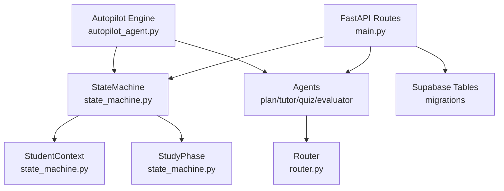
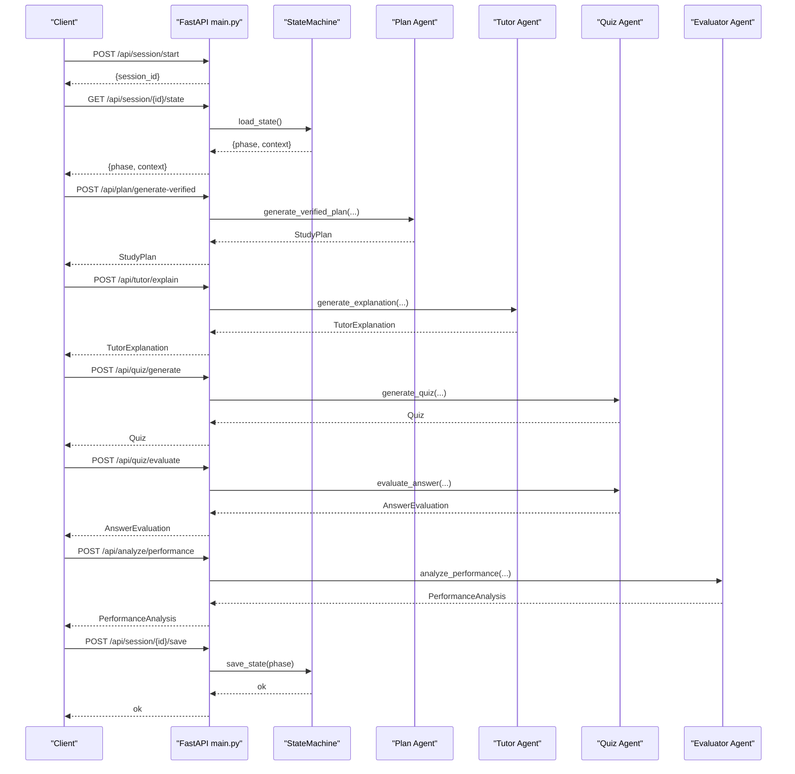
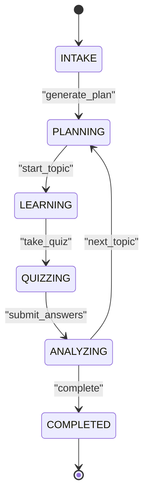
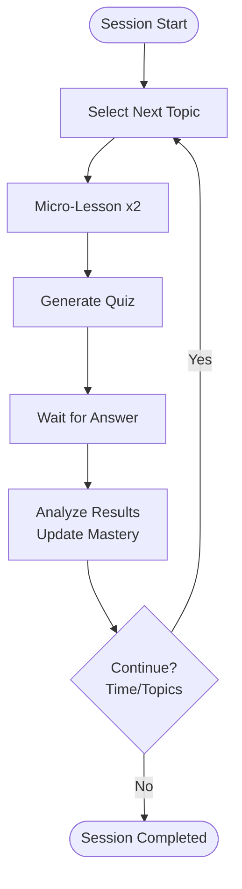
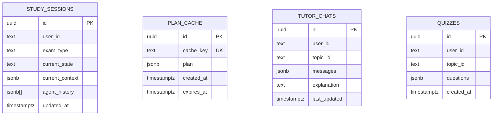
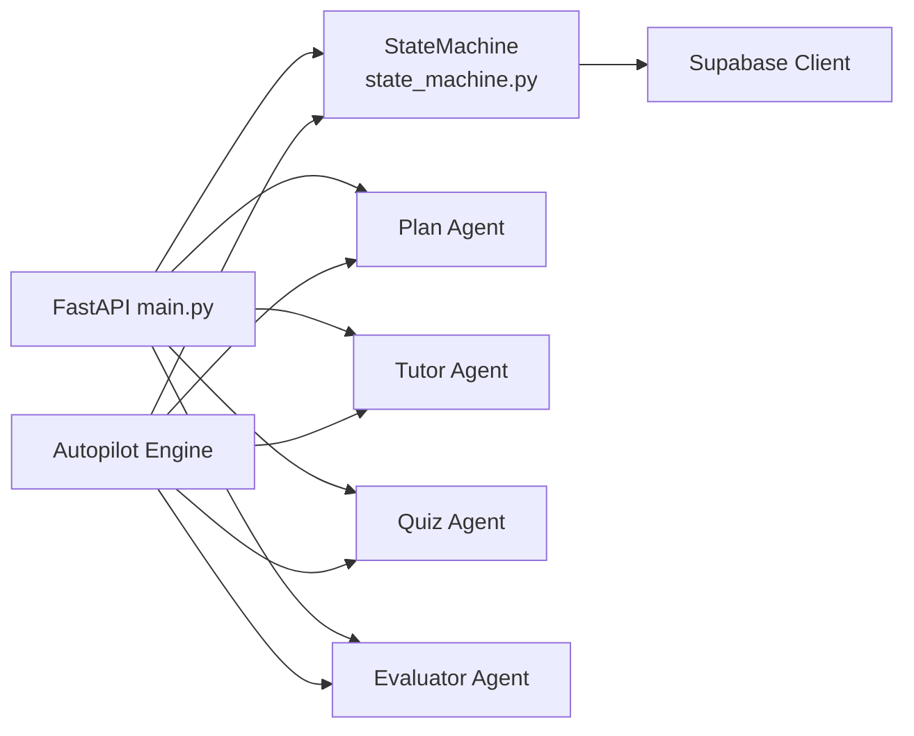

# State Machine - Workflow Coordination

<cite>
**Referenced Files in This Document**
- [state_machine.py](file://backend/agents/state_machine.py)
- [__init__.py](file://backend/agents/__init__.py)
- [schemas.py](file://backend/agents/schemas.py)
- [plan_agent.py](file://backend/agents/plan_agent.py)
- [tutor_agent.py](file://backend/agents/tutor_agent.py)
- [quiz_agent.py](file://backend/agents/quiz_agent.py)
- [evaluator_agent.py](file://backend/agents/evaluator_agent.py)
- [autopilot_agent.py](file://backend/agents/autopilot_agent.py)
- [router.py](file://backend/router.py)
- [main.py](file://backend/main.py)
- [002_add_session_context.sql](file://backend/migrations/002_add_session_context.sql)
- [004_create_persistence_tables.sql](file://backend/migrations/004_create_persistence_tables.sql)
</cite>

## Table of Contents
1. [Introduction](#introduction)
2. [Project Structure](#project-structure)
3. [Core Components](#core-components)
4. [Architecture Overview](#architecture-overview)
5. [Detailed Component Analysis](#detailed-component-analysis)
6. [Dependency Analysis](#dependency-analysis)
7. [Performance Considerations](#performance-considerations)
8. [Troubleshooting Guide](#troubleshooting-guide)
9. [Conclusion](#conclusion)
10. [Appendices](#appendices)

## Introduction
This document explains the State Machine that coordinates agent interactions and manages study session workflows in the ExamMentor AI system. It covers workflow phases (initialization, planning, learning, quizzing, analyzing, completion), state transition logic, session persistence, validation rules, error handling and recovery, examples of typical workflows, extensibility mechanisms, debugging and monitoring guidance, and integration with the database and caching strategies.

## Project Structure
The state machine and workflow orchestration span several modules:
- State machine and shared schemas: backend/agents/state_machine.py, backend/agents/schemas.py
- Agent implementations: plan_agent.py, tutor_agent.py, quiz_agent.py, evaluator_agent.py
- Orchestration: autopilot_agent.py
- Routing and scope enforcement: router.py
- API surface and persistence: main.py, migrations for persistence tables

**Diagram sources**
- [state_machine.py](file://backend/agents/state_machine.py#L17-L136)
- [autopilot_agent.py](file://backend/agents/autopilot_agent.py#L100-L628)
- [router.py](file://backend/router.py#L64-L88)
- [main.py](file://backend/main.py#L516-L757)
- [002_add_session_context.sql](file://backend/migrations/002_add_session_context.sql#L1-L15)

**Section sources**
- [state_machine.py](file://backend/agents/state_machine.py#L1-L136)
- [__init__.py](file://backend/agents/__init__.py#L1-L96)
- [main.py](file://backend/main.py#L516-L757)

## Core Components
- StudyPhase: Defines the six phases of the study workflow.
- StudentContext: Tracks session state across phases (user_id, session_id, current_topic, last_quiz_score, misconceptions, plan_cache_key, extra_data).
- StateMachine: Enforces valid transitions, persists state to Supabase, loads persisted state, and logs actions.

Key responsibilities:
- Transition validation prevents invalid jumps between phases.
- Persistence stores current_state and current_context in study_sessions.
- Action logging maintains an audit trail in agent_history.

**Section sources**
- [state_machine.py](file://backend/agents/state_machine.py#L17-L136)
- [__init__.py](file://backend/agents/__init__.py#L7-L24)

## Architecture Overview
The system orchestrates agents through a deterministic state machine with explicit transitions. The autopilot agent demonstrates autonomous orchestration, while the API exposes endpoints to start sessions, manage state, and integrate agents.

**Diagram sources**
- [main.py](file://backend/main.py#L523-L571)
- [state_machine.py](file://backend/agents/state_machine.py#L80-L136)
- [plan_agent.py](file://backend/agents/plan_agent.py#L146-L304)
- [tutor_agent.py](file://backend/agents/tutor_agent.py#L131-L186)
- [quiz_agent.py](file://backend/agents/quiz_agent.py#L53-L111)
- [evaluator_agent.py](file://backend/agents/evaluator_agent.py#L59-L115)

## Detailed Component Analysis

### State Machine and Transitions
The StateMachine defines valid transitions between phases and exposes helpers to compute valid actions and persist/load state.

- Transition validation: Only actions defined for the current phase are permitted.
- Valid actions enumeration: Useful for UI controls and agent gating.
- Persistence: Updates study_sessions with current_state and current_context.
- Audit logging: Appends entries to agent_history for traceability.

Operational notes:
- save_state writes current_state and current_context to study_sessions.
- load_state rehydrates context and returns stored StudyPhase.
- log_action appends a timestamped action with optional metadata.

**Diagram sources**
- [state_machine.py](file://backend/agents/state_machine.py#L44-L78)
- [state_machine.py](file://backend/agents/state_machine.py#L80-L136)

**Section sources**
- [state_machine.py](file://backend/agents/state_machine.py#L44-L78)
- [state_machine.py](file://backend/agents/state_machine.py#L80-L136)

### Workflow Phases and Agent Coordination
- INTAKE: Initialize session and collect user context.
- PLANNING: Generate and verify a study plan using Router and Plan Agent.
- LEARNING: Deliver structured explanations via Tutor Agent.
- QUIZZING: Generate adaptive quizzes and evaluate answers.
- ANALYZING: Diagnose misconceptions and produce recommendations.
- COMPLETED: Finalize session.

Typical agent coordination patterns:
- Router scopes syllabus and constraints before plan generation.
- Tutor generates explanations aligned with plan and topic.
- Quiz adapts to prior misconceptions tracked in StudentContext.
- Evaluator synthesizes performance and recommendations.

**Section sources**
- [router.py](file://backend/router.py#L64-L88)
- [plan_agent.py](file://backend/agents/plan_agent.py#L146-L304)
- [tutor_agent.py](file://backend/agents/tutor_agent.py#L131-L186)
- [quiz_agent.py](file://backend/agents/quiz_agent.py#L53-L111)
- [evaluator_agent.py](file://backend/agents/evaluator_agent.py#L59-L115)

### Autopilot Orchestration
The AutopilotEngine automates a full session lifecycle:
- Selects next topic considering mastery and plan.
- Teaches two micro-lessons.
- Runs a short quiz with interactive answer submission.
- Analyzes results, updates mastery, and logs reasoning.

**Diagram sources**
- [autopilot_agent.py](file://backend/agents/autopilot_agent.py#L431-L544)

**Section sources**
- [autopilot_agent.py](file://backend/agents/autopilot_agent.py#L100-L628)

### Validation Rules and Integrity Guarantees
- Transition matrix enforces strict ordering: INTAKE → PLANNING → LEARNING → QUIZZING → ANALYZING → COMPLETED.
- get_valid_actions prevents UI or agent misuse by limiting available actions per phase.
- Router scope guard ensures syllabus alignment and prevents cross-domain requests.
- Session persistence ensures continuity across restarts and agent handoffs.

**Section sources**
- [state_machine.py](file://backend/agents/state_machine.py#L44-L78)
- [router.py](file://backend/router.py#L90-L129)

### Error Handling and Recovery
- StateMachine save/load wrap persistence calls in try/catch and print warnings on failure.
- AutopilotEngine retries model calls with exponential backoff for transient errors.
- API routes catch exceptions and return HTTP 500 with error details.
- Session state can be manually saved via /api/session/{id}/save.

**Section sources**
- [state_machine.py](file://backend/agents/state_machine.py#L91-L94)
- [state_machine.py](file://backend/agents/state_machine.py#L126-L135)
- [autopilot_agent.py](file://backend/agents/autopilot_agent.py#L142-L161)
- [main.py](file://backend/main.py#L133-L142)
- [main.py](file://backend/main.py#L559-L570)

### Examples of Typical Workflows
- Verified Plan Generation:
  1. Router decides intent, exam, and scope.
  2. Plan Agent generates and verifies plan iteratively.
  3. StateMachine saves current_state=PLANNING and context.
- Learning Path:
  1. StateMachine transitions to LEARNING.
  2. Tutor Agent streams explanations.
  3. StateMachine logs action and persists state.
- Quiz and Remediation:
  1. StateMachine transitions to QUIZZING.
  2. Quiz Agent generates questions.
  3. Evaluator Agent analyzes performance and recommends next steps.
  4. StateMachine transitions to ANALYZING and persists.

**Section sources**
- [plan_agent.py](file://backend/agents/plan_agent.py#L146-L304)
- [tutor_agent.py](file://backend/agents/tutor_agent.py#L131-L186)
- [quiz_agent.py](file://backend/agents/quiz_agent.py#L53-L111)
- [evaluator_agent.py](file://backend/agents/evaluator_agent.py#L59-L115)
- [state_machine.py](file://backend/agents/state_machine.py#L80-L136)

### Extensibility Mechanisms
- Adding a new phase:
  - Extend StudyPhase with a new value.
  - Add a transition tuple in TRANSITIONS mapping (current_phase, action) → new_phase.
  - Implement agent(s) to handle the new phase and update StateMachine.save_state calls accordingly.
- Integrating a new agent:
  - Define Pydantic schemas in schemas.py or agent module.
  - Expose an API endpoint in main.py and integrate with StateMachine.transition and log_action.
  - Ensure the agent’s output aligns with StudentContext fields (e.g., misconceptions, last_quiz_score).

**Section sources**
- [state_machine.py](file://backend/agents/state_machine.py#L17-L52)
- [__init__.py](file://backend/agents/__init__.py#L64-L95)
- [schemas.py](file://backend/agents/schemas.py#L1-L106)
- [main.py](file://backend/main.py#L127-L223)

### Debugging, Monitoring, and Custom Handlers
- Debugging:
  - Use /api/session/{id}/state to inspect current phase and context.
  - Inspect agent_history entries logged by StateMachine.log_action.
  - For autopilot, poll /api/autopilot/status/{session_id} to observe run log and interactive state.
- Monitoring:
  - Track run logs (AutopilotStep) for reasoning and durations.
  - Observe valid actions per phase via StateMachine.get_valid_actions.
- Custom state handlers:
  - Extend StudentContext with new fields.
  - Update save_state/load_state to persist/rehydrate new fields.
  - Add custom validation in transition() if needed.

**Section sources**
- [main.py](file://backend/main.py#L541-L556)
- [main.py](file://backend/main.py#L648-L678)
- [state_machine.py](file://backend/agents/state_machine.py#L73-L78)
- [state_machine.py](file://backend/agents/state_machine.py#L115-L136)

### Database Integration and Caching Strategies
- Persistence schema:
  - study_sessions: current_state, current_context, agent_history.
  - plan_cache: semantic caching keyed by cache_key with TTL.
- Additional tables:
  - tutor_chats and quizzes for chat and quiz persistence.
- Caching:
  - plan_cache supports reuse of verified plans to reduce latency and cost.

**Diagram sources**
- [002_add_session_context.sql](file://backend/migrations/002_add_session_context.sql#L1-L15)
- [004_create_persistence_tables.sql](file://backend/migrations/004_create_persistence_tables.sql#L1-L44)

**Section sources**
- [state_machine.py](file://backend/agents/state_machine.py#L80-L136)
- [002_add_session_context.sql](file://backend/migrations/002_add_session_context.sql#L1-L15)
- [004_create_persistence_tables.sql](file://backend/migrations/004_create_persistence_tables.sql#L1-L44)

## Dependency Analysis
The state machine depends on Supabase for persistence and integrates with agents and API routes.

**Diagram sources**
- [state_machine.py](file://backend/agents/state_machine.py#L54-L63)
- [main.py](file://backend/main.py#L516-L757)
- [autopilot_agent.py](file://backend/agents/autopilot_agent.py#L100-L628)

**Section sources**
- [state_machine.py](file://backend/agents/state_machine.py#L54-L63)
- [main.py](file://backend/main.py#L516-L757)
- [autopilot_agent.py](file://backend/agents/autopilot_agent.py#L100-L628)

## Performance Considerations
- Asynchronous agent calls reduce latency and enable streaming responses.
- Retry with exponential backoff mitigates transient model errors.
- Plan cache reduces repeated plan generation costs.
- Indexes on tutor_chats and quizzes improve retrieval performance.

[No sources needed since this section provides general guidance]

## Troubleshooting Guide
- Missing Supabase credentials:
  - Symptom: Warning printed and persistence disabled.
  - Resolution: Set SUPABASE_URL and SUPABASE_*_KEY environment variables.
- State save/load failures:
  - Symptom: Exceptions caught and logged.
  - Resolution: Verify table permissions and network connectivity.
- Autopilot stuck or slow:
  - Symptom: Model overload errors.
  - Resolution: Engine retries with backoff; check logs for transient errors.
- Session not resuming:
  - Symptom: Defaults to INTAKE on load failure.
  - Resolution: Recreate session or inspect study_sessions row.

**Section sources**
- [state_machine.py](file://backend/agents/state_machine.py#L57-L63)
- [state_machine.py](file://backend/agents/state_machine.py#L91-L94)
- [state_machine.py](file://backend/agents/state_machine.py#L126-L135)
- [autopilot_agent.py](file://backend/agents/autopilot_agent.py#L142-L161)
- [main.py](file://backend/main.py#L541-L556)

## Conclusion
The State Machine provides a robust, deterministic framework for coordinating multi-agent study workflows. It enforces valid transitions, persists state for continuity, and integrates tightly with agents and the API. With clear validation rules, error handling, and extensibility hooks, the system supports scalable enhancements and reliable operation across restarts and agent handoffs.

## Appendices

### API Endpoints Related to Sessions and State
- POST /api/session/start: Creates a session and returns session_id.
- GET /api/session/{session_id}/state: Loads current phase and context.
- POST /api/session/{session_id}/save: Manually saves current_state and context.

**Section sources**
- [main.py](file://backend/main.py#L523-L571)