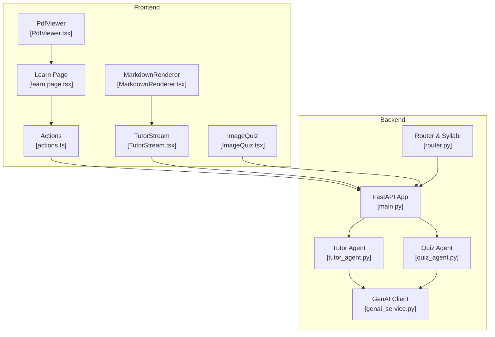
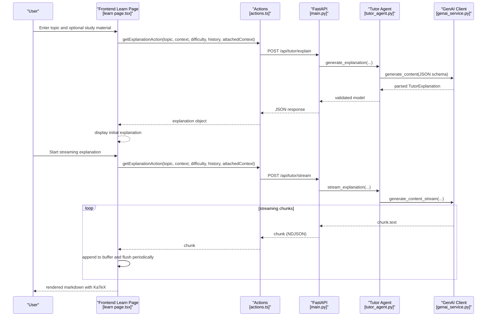
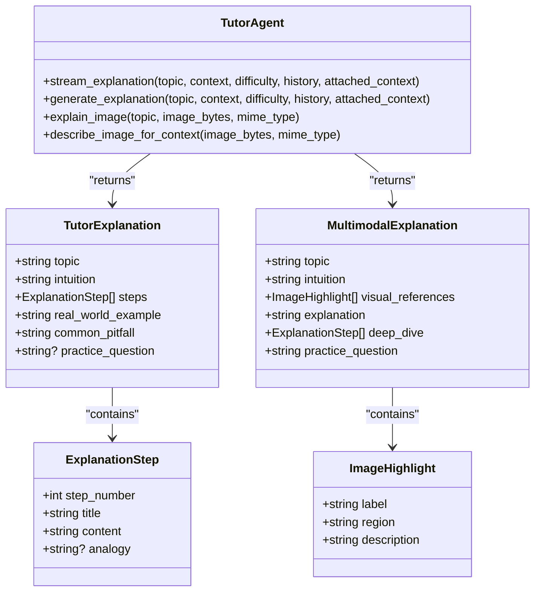
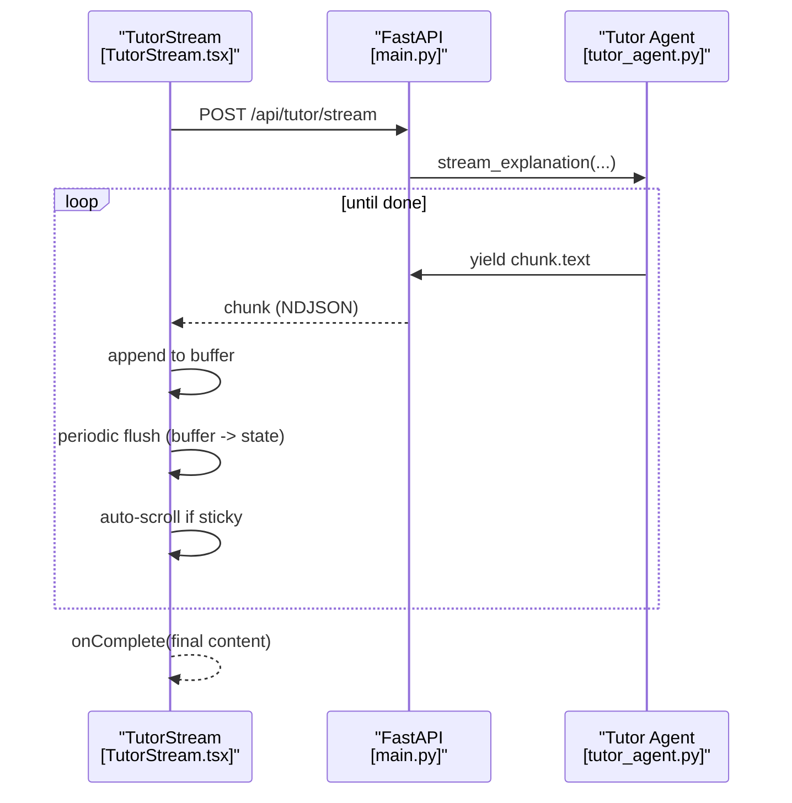
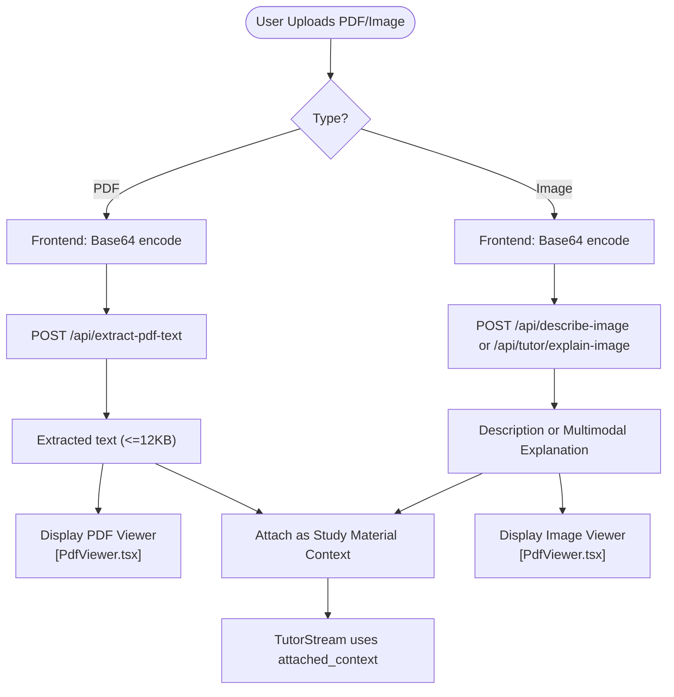
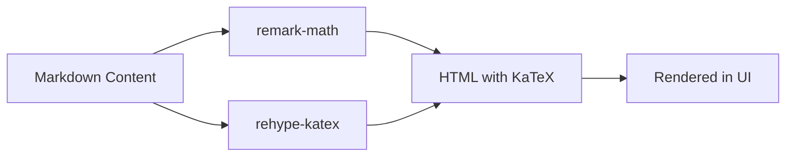
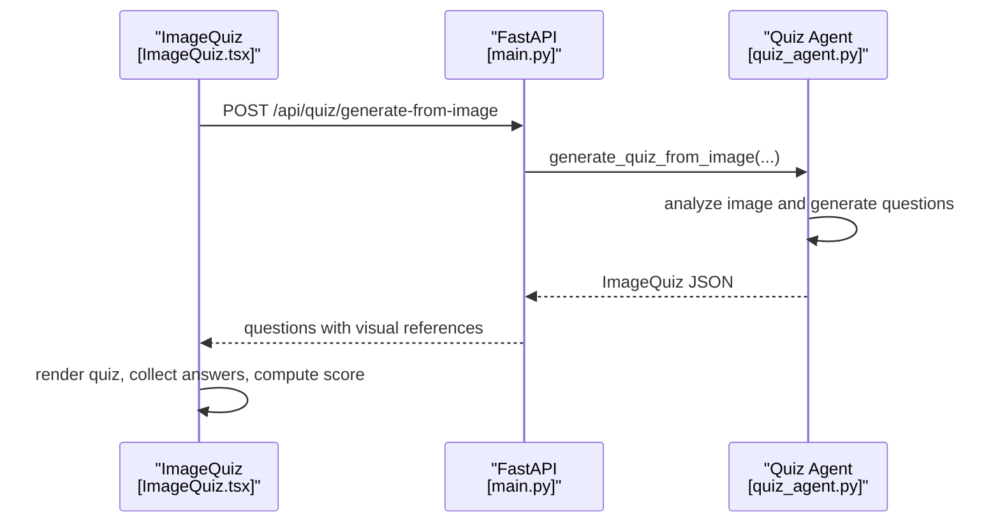
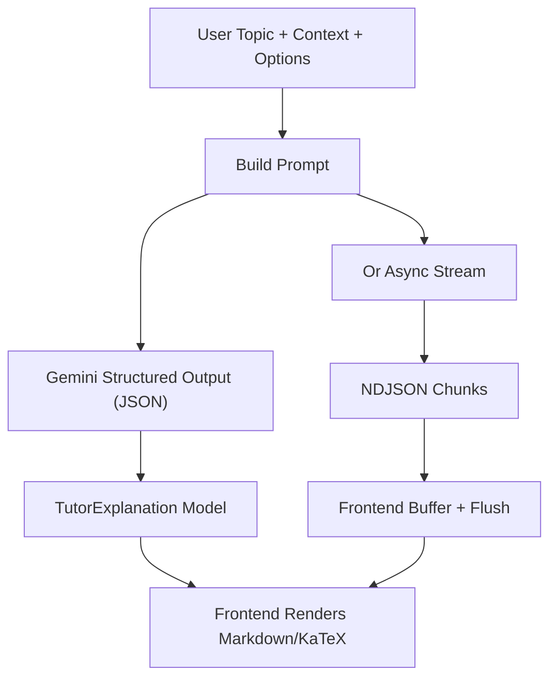
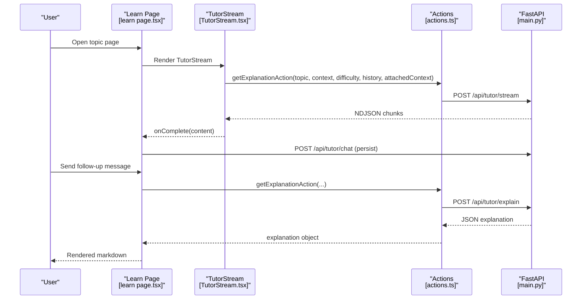
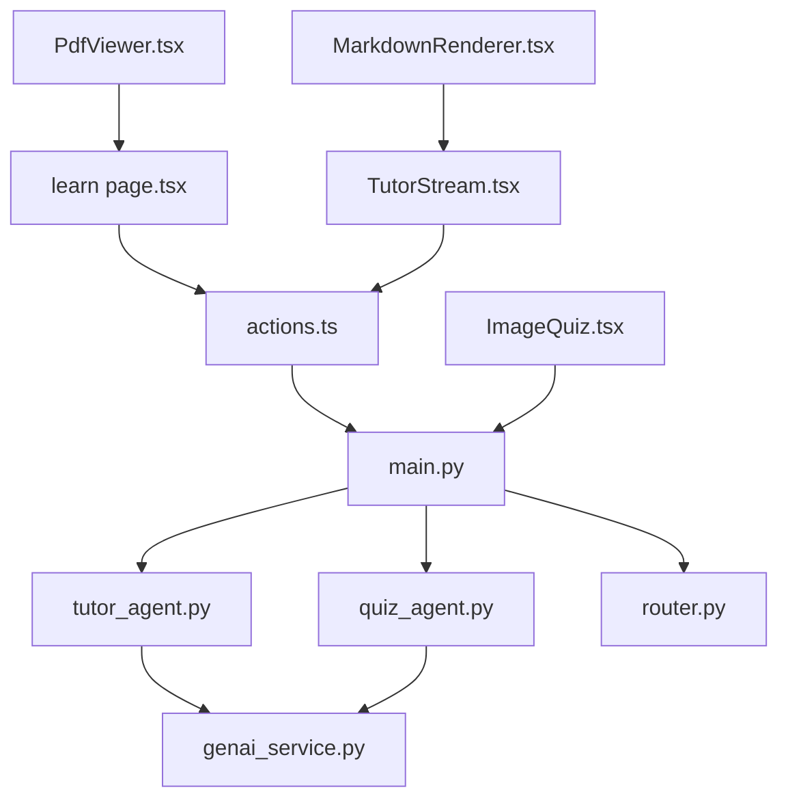

# Tutor Agent - Interactive Explanations

<cite>
**Referenced Files in This Document**
- [tutor_agent.py](file://backend/agents/tutor_agent.py)
- [genai_service.py](file://backend/services/genai_service.py)
- [router.py](file://backend/router.py)
- [main.py](file://backend/main.py)
- [TutorStream.tsx](file://frontend/components/TutorStream.tsx)
- [MarkdownRenderer.tsx](file://frontend/components/MarkdownRenderer.tsx)
- [PdfViewer.tsx](file://frontend/components/PdfViewer.tsx)
- [ImageQuiz.tsx](file://frontend/components/ImageQuiz.tsx)
- [actions.ts](file://frontend/app/actions.ts)
- [learn page.tsx](file://frontend/app/learn/[topicId]/page.tsx)
- [quiz_agent.py](file://backend/agents/quiz_agent.py)
</cite>

## Table of Contents
1. [Introduction](#introduction)
2. [Project Structure](#project-structure)
3. [Core Components](#core-components)
4. [Architecture Overview](#architecture-overview)
5. [Detailed Component Analysis](#detailed-component-analysis)
6. [Dependency Analysis](#dependency-analysis)
7. [Performance Considerations](#performance-considerations)
8. [Troubleshooting Guide](#troubleshooting-guide)
9. [Conclusion](#conclusion)
10. [Appendices](#appendices)

## Introduction
This document explains the Tutor Agent that delivers interactive, structured explanations using the Feynman teaching technique. It covers:
- Streaming response architecture enabling real-time UI updates
- Multimodal content handling (PDF text extraction, image analysis, mathematical notation rendering)
- Structured explanation generation with progressive disclosure
- Adaptive questioning and misconception detection
- Integration with KaTeX for mathematical formulas
- Examples of tutoring sessions and interactive Q&A
- Fallback mechanisms and customization guidance

## Project Structure
The system consists of:
- Backend FastAPI server exposing endpoints for tutoring, quizzes, and multimodal analysis
- Frontend Next.js app with streaming UI and markdown rendering
- Agents for tutoring, quiz generation, and multimodal reasoning
- Shared schemas and routing logic

**Diagram sources**
- [learn page.tsx](file://frontend/app/learn/[topicId]/page.tsx#L1-L490)
- [TutorStream.tsx](file://frontend/components/TutorStream.tsx#L1-L151)
- [MarkdownRenderer.tsx](file://frontend/components/MarkdownRenderer.tsx#L1-L53)
- [PdfViewer.tsx](file://frontend/components/PdfViewer.tsx#L1-L103)
- [ImageQuiz.tsx](file://frontend/components/ImageQuiz.tsx#L1-L409)
- [actions.ts](file://frontend/app/actions.ts#L1-L512)
- [main.py](file://backend/main.py#L1-L843)
- [router.py](file://backend/router.py#L1-L129)
- [genai_service.py](file://backend/services/genai_service.py#L1-L10)
- [tutor_agent.py](file://backend/agents/tutor_agent.py#L1-L277)
- [quiz_agent.py](file://backend/agents/quiz_agent.py#L1-L283)

**Section sources**
- [main.py](file://backend/main.py#L1-L843)
- [learn page.tsx](file://frontend/app/learn/[topicId]/page.tsx#L1-L490)

## Core Components
- Tutor Agent: Generates structured explanations and streams text in real time; supports multimodal image explanations and image context description.
- Quiz Agent: Creates adaptive quizzes with structured outputs and evaluates answers to surface misconceptions.
- Frontend TutorStream: Streams explanation text from the backend and renders markdown with KaTeX support.
- Router: Provides syllabus registry and intent routing for exam-specific contexts.
- GenAI Service: Centralized Google Generative AI client initialization.

**Section sources**
- [tutor_agent.py](file://backend/agents/tutor_agent.py#L1-L277)
- [quiz_agent.py](file://backend/agents/quiz_agent.py#L1-L283)
- [TutorStream.tsx](file://frontend/components/TutorStream.tsx#L1-L151)
- [MarkdownRenderer.tsx](file://frontend/components/MarkdownRenderer.tsx#L1-L53)
- [router.py](file://backend/router.py#L1-L129)
- [genai_service.py](file://backend/services/genai_service.py#L1-L10)

## Architecture Overview
The Tutor Agent integrates frontend streaming with backend structured generation and multimodal reasoning. The frontend requests explanations and receives newline-delimited JSON chunks for streaming. The backend uses Gemini’s async streaming to push text fragments to the UI. Markdown rendering includes KaTeX for math, and PDF/image uploads enrich context.

**Diagram sources**
- [learn page.tsx](file://frontend/app/learn/[topicId]/page.tsx#L178-L233)
- [actions.ts](file://frontend/app/actions.ts#L195-L223)
- [main.py](file://backend/main.py#L245-L260)
- [tutor_agent.py](file://backend/agents/tutor_agent.py#L51-L127)
- [genai_service.py](file://backend/services/genai_service.py#L1-L10)

## Detailed Component Analysis

### Tutor Agent: Structured Explanations and Streaming
- Structured Output Models:
  - ExplanationStep: numbered steps with title, content, optional analogy
  - TutorExplanation: topic, intuition, steps, real-world example, common pitfall, optional practice question
  - MultimodalExplanation: topic, intuition, visual_references (ImageHighlight), explanation, deep_dive steps, practice question
- Streaming:
  - stream_explanation yields character chunks via Gemini async streaming for real-time UI updates
  - Uses difficulty to adjust depth and includes optional history and attached context
- Non-streaming:
  - generate_explanation returns a validated TutorExplanation JSON schema
- Multimodal:
  - explain_image analyzes an image and returns a multimodal explanation with visual highlights
  - describe_image_for_context converts an image to factual study material text

**Diagram sources**
- [tutor_agent.py](file://backend/agents/tutor_agent.py#L16-L47)

**Section sources**
- [tutor_agent.py](file://backend/agents/tutor_agent.py#L1-L277)

### Streaming Architecture and UI Updates
- Backend streaming endpoint:
  - POST /api/tutor/stream returns newline-delimited JSON chunks
  - Uses StreamingResponse with application/x-ndjson media type
- Frontend streaming:
  - TutorStream fetches /api/tutor/stream and reads the body via a Reader
  - Buffers chunks and flushes at ~20fps (every 50ms) to smooth UI updates
  - Auto-scrolls to bottom when user is viewing latest content
  - Calls onComplete with the final rendered content

**Diagram sources**
- [main.py](file://backend/main.py#L245-L260)
- [tutor_agent.py](file://backend/agents/tutor_agent.py#L51-L127)
- [TutorStream.tsx](file://frontend/components/TutorStream.tsx#L63-L115)

**Section sources**
- [main.py](file://backend/main.py#L245-L260)
- [TutorStream.tsx](file://frontend/components/TutorStream.tsx#L1-L151)

### Multimodal Content Handling
- PDF text extraction:
  - Frontend uploads PDF, converts to base64, sends to backend
  - Backend extracts text from first 50 pages and truncates to 12KB
  - Frontend displays PDF in an iframe viewer and stores extracted text as attached context
- Image analysis:
  - Frontend uploads image, sends base64 to backend
  - Backend describes image for context (describe_image_for_context)
  - Backend explains image using multimodal explanation (explain_image)
- Study material panel:
  - Users can toggle between PDF and image viewers
  - Supports clearing and revoking object URLs

**Diagram sources**
- [learn page.tsx](file://frontend/app/learn/[topicId]/page.tsx#L148-L170)
- [actions.ts](file://frontend/app/actions.ts#L225-L239)
- [main.py](file://backend/main.py#L267-L324)
- [tutor_agent.py](file://backend/agents/tutor_agent.py#L189-L247)
- [PdfViewer.tsx](file://frontend/components/PdfViewer.tsx#L1-L103)

**Section sources**
- [learn page.tsx](file://frontend/app/learn/[topicId]/page.tsx#L148-L170)
- [actions.ts](file://frontend/app/actions.ts#L225-L239)
- [main.py](file://backend/main.py#L267-L324)
- [tutor_agent.py](file://backend/agents/tutor_agent.py#L189-L247)
- [PdfViewer.tsx](file://frontend/components/PdfViewer.tsx#L1-L103)

### Mathematical Notation Rendering with KaTeX
- Frontend MarkdownRenderer integrates:
  - remark-math for LaTeX parsing
  - rehype-katex for KaTeX rendering
  - Custom component overrides for headings, lists, code blocks
- This enables real-time math rendering inside streamed explanations and static markdown content

**Diagram sources**
- [MarkdownRenderer.tsx](file://frontend/components/MarkdownRenderer.tsx#L1-L53)

**Section sources**
- [MarkdownRenderer.tsx](file://frontend/components/MarkdownRenderer.tsx#L1-L53)

### Adaptive Questioning and Misconception Detection
- Quiz Agent:
  - generate_quiz produces structured quizzes with difficulty targeting and optional previous mistakes
  - evaluate_answer returns correctness, personalized feedback, identified misconception, and tips
- Multimodal Quiz:
  - generate_quiz_from_image creates questions grounded in visual regions of diagrams
- Frontend ImageQuiz:
  - Uploads an image, generates quiz, tracks answers, shows explanations, and computes scores

**Diagram sources**
- [ImageQuiz.tsx](file://frontend/components/ImageQuiz.tsx#L83-L114)
- [main.py](file://backend/main.py#L356-L400)
- [quiz_agent.py](file://backend/agents/quiz_agent.py#L138-L201)

**Section sources**
- [quiz_agent.py](file://backend/agents/quiz_agent.py#L1-L283)
- [ImageQuiz.tsx](file://frontend/components/ImageQuiz.tsx#L1-L409)
- [main.py](file://backend/main.py#L356-L400)

### Structured Explanation Generation Process
- Prompt engineering enforces:
  - Intuition, deep explanation with steps, real-world example, common pitfalls, quick check
  - Difficulty-aware language and depth
  - Optional history and attached context
- Backend returns validated JSON schema for non-streaming mode; streaming yields text fragments for progressive disclosure

**Diagram sources**
- [tutor_agent.py](file://backend/agents/tutor_agent.py#L51-L186)
- [MarkdownRenderer.tsx](file://frontend/components/MarkdownRenderer.tsx#L1-L53)

**Section sources**
- [tutor_agent.py](file://backend/agents/tutor_agent.py#L51-L186)

### Example Tutoring Sessions and Interactive Q&A
- Initial streaming:
  - On first visit, the Learn page triggers a streaming explanation for the topic
  - onComplete persists the explanation to backend storage
- Follow-up Q&A:
  - Users can send messages; backend responds with a structured explanation
  - Chat history is persisted and reloaded on subsequent visits
- Study material integration:
  - PDFs and images enhance context; TutorStream passes attached_context to backend

**Diagram sources**
- [learn page.tsx](file://frontend/app/learn/[topicId]/page.tsx#L178-L233)
- [TutorStream.tsx](file://frontend/components/TutorStream.tsx#L63-L115)
- [actions.ts](file://frontend/app/actions.ts#L195-L223)
- [main.py](file://backend/main.py#L245-L260)

**Section sources**
- [learn page.tsx](file://frontend/app/learn/[topicId]/page.tsx#L178-L233)
- [TutorStream.tsx](file://frontend/components/TutorStream.tsx#L63-L115)
- [actions.ts](file://frontend/app/actions.ts#L195-L223)
- [main.py](file://backend/main.py#L245-L260)

## Dependency Analysis
- Backend dependencies:
  - FastAPI app defines endpoints for tutoring, quiz, and multimodal features
  - Router module provides syllabus registry and intent routing
  - GenAI service initializes the client for async operations
  - Tutor and Quiz agents depend on the GenAI client and return validated Pydantic models
- Frontend dependencies:
  - Learn page orchestrates study material, streaming, and chat persistence
  - TutorStream consumes NDJSON streaming and renders markdown
  - MarkdownRenderer integrates KaTeX for math
  - ImageQuiz integrates multimodal quiz generation

**Diagram sources**
- [main.py](file://backend/main.py#L1-L843)
- [tutor_agent.py](file://backend/agents/tutor_agent.py#L1-L277)
- [quiz_agent.py](file://backend/agents/quiz_agent.py#L1-L283)
- [genai_service.py](file://backend/services/genai_service.py#L1-L10)
- [router.py](file://backend/router.py#L1-L129)
- [learn page.tsx](file://frontend/app/learn/[topicId]/page.tsx#L1-L490)
- [actions.ts](file://frontend/app/actions.ts#L1-L512)
- [TutorStream.tsx](file://frontend/components/TutorStream.tsx#L1-L151)
- [MarkdownRenderer.tsx](file://frontend/components/MarkdownRenderer.tsx#L1-L53)
- [PdfViewer.tsx](file://frontend/components/PdfViewer.tsx#L1-L103)
- [ImageQuiz.tsx](file://frontend/components/ImageQuiz.tsx#L1-L409)

**Section sources**
- [main.py](file://backend/main.py#L1-L843)
- [learn page.tsx](file://frontend/app/learn/[topicId]/page.tsx#L1-L490)

## Performance Considerations
- Streaming:
  - Backend uses async streaming to minimize latency and improve perceived responsiveness
  - Frontend buffers and flushes at ~20fps to balance smoothness and CPU usage
- PDF extraction:
  - Limits to first 50 pages and truncates text to prevent oversized payloads
- Retry and caching:
  - Frontend actions include retry logic with exponential backoff for robustness
  - Plan generation caches results keyed by request signature
- Rendering:
  - KaTeX rendering is efficient for math-heavy content; keep markdown lightweight for large explanations

[No sources needed since this section provides general guidance]

## Troubleshooting Guide
- Streaming not updating:
  - Verify backend endpoint returns application/x-ndjson and chunks are readable
  - Ensure frontend buffer flush interval is active and auto-scroll logic is enabled
- PDF extraction failures:
  - Confirm base64 encoding and endpoint reachability
  - Check backend error handling for invalid PDFs
- Image analysis issues:
  - Validate MIME type and base64 payload
  - Ensure backend endpoints for describe-image and explain-image are reachable
- Markdown math not rendering:
  - Confirm remark-math and rehype-katex are included in MarkdownRenderer plugins
- Quiz generation problems:
  - Check that image quiz endpoint receives valid image bytes and correct schema

**Section sources**
- [TutorStream.tsx](file://frontend/components/TutorStream.tsx#L63-L115)
- [main.py](file://backend/main.py#L267-L324)
- [MarkdownRenderer.tsx](file://frontend/components/MarkdownRenderer.tsx#L1-L53)
- [actions.ts](file://frontend/app/actions.ts#L22-L70)

## Conclusion
The Tutor Agent delivers an immersive, adaptive learning experience by combining structured explanations, real-time streaming, and multimodal content. The frontend’s streaming UI, backed by validated backend schemas and Gemini’s multimodal capabilities, enables progressive disclosure and deep engagement. Integrations with KaTeX, PDF/image uploads, and adaptive quizzes round out a comprehensive tutoring platform.

[No sources needed since this section summarizes without analyzing specific files]

## Appendices

### API Definitions
- POST /api/tutor/stream
  - Request: topic, context, difficulty, history, attached_context
  - Response: newline-delimited JSON chunks (NDJSON)
- POST /api/tutor/explain
  - Request: topic, context, difficulty, history, attached_context
  - Response: validated JSON (TutorExplanation)
- POST /api/extract-pdf-text
  - Request: pdf_base64
  - Response: { text }
- POST /api/describe-image
  - Request: image_base64, mime_type
  - Response: { description }
- POST /api/tutor/explain-image
  - Request: topic, image_base64, mime_type
  - Response: validated JSON (MultimodalExplanation)
- POST /api/quiz/generate-from-image
  - Request: topic, image_base64, mime_type, num_questions, difficulty
  - Response: ImageQuiz with questions referencing visual elements

**Section sources**
- [main.py](file://backend/main.py#L245-L324)

### Customization Guidance
- Explanation style:
  - Adjust difficulty parameter to control depth and language
  - Include history to enable follow-ups and deeper explanations
  - Add attached_context from PDFs/images to ground explanations
- UI rendering:
  - Extend MarkdownRenderer components for custom headings, lists, and code blocks
  - Add KaTeX macros or custom math classes as needed
- Multimodal enhancements:
  - Use explain_image for diagrams and images
  - Use describe_image_for_context for documents and notes
- Quiz customization:
  - Pass previous_mistakes to target misconception-prone areas
  - Use generate_quiz_from_image for visual reasoning assessments

[No sources needed since this section provides general guidance]