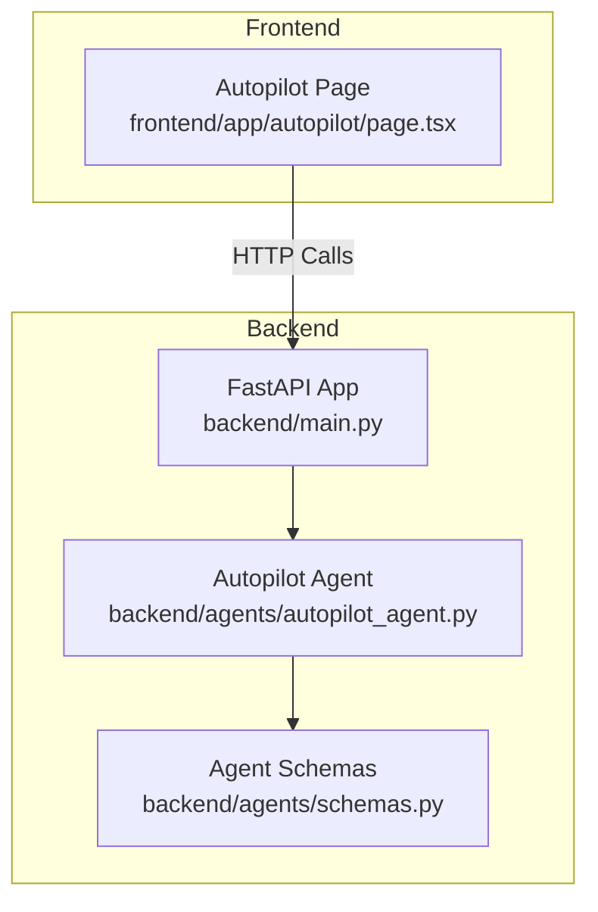
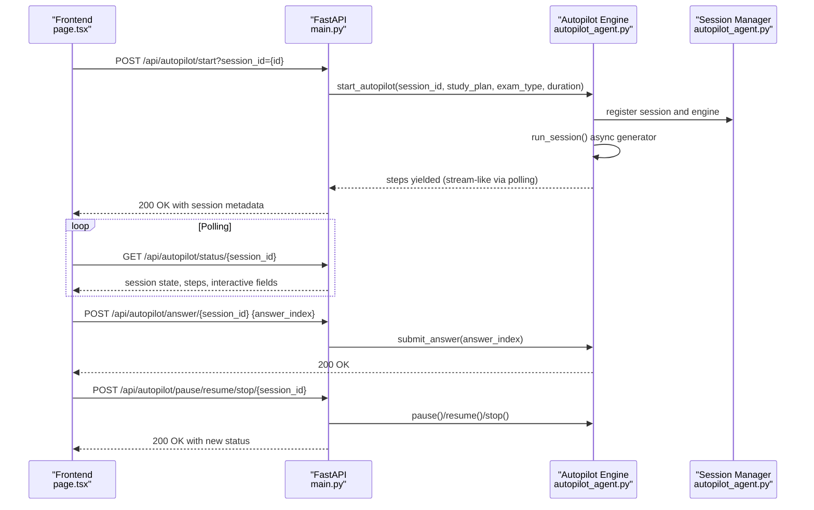
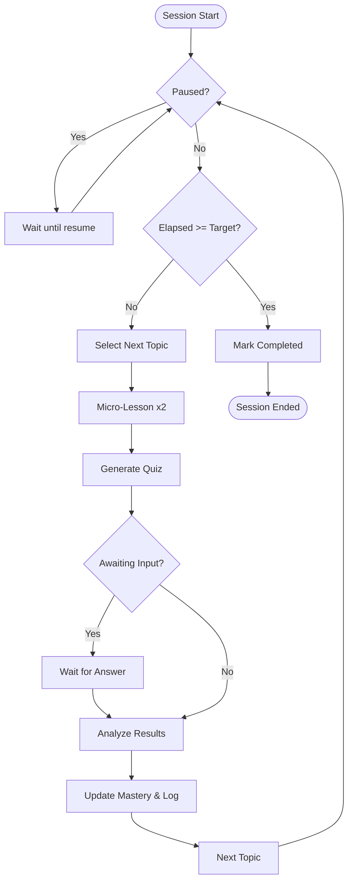
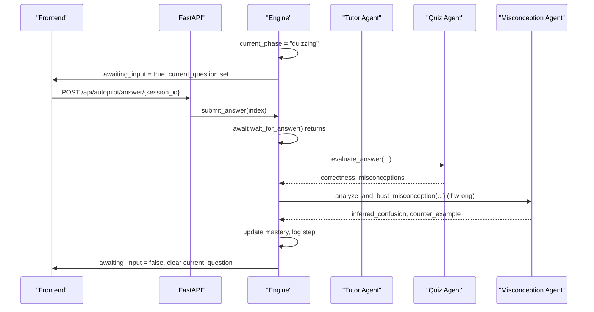
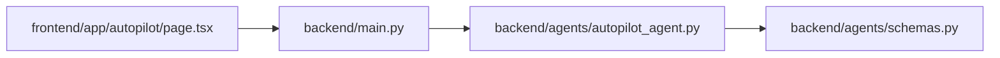

# Autopilot Control

<cite>
**Referenced Files in This Document**
- [main.py](file://backend/main.py)
- [autopilot_agent.py](file://backend/agents/autopilot_agent.py)
- [schemas.py](file://backend/agents/schemas.py)
- [page.tsx](file://frontend/app/autopilot/page.tsx)
</cite>

## Table of Contents
1. [Introduction](#introduction)
2. [Project Structure](#project-structure)
3. [Core Components](#core-components)
4. [Architecture Overview](#architecture-overview)
5. [Detailed Component Analysis](#detailed-component-analysis)
6. [Dependency Analysis](#dependency-analysis)
7. [Performance Considerations](#performance-considerations)
8. [Troubleshooting Guide](#troubleshooting-guide)
9. [Conclusion](#conclusion)

## Introduction
This document provides comprehensive API documentation for the Autopilot Control endpoints that power the flagship “Action Era” autonomous learning feature. It covers:
- POST /api/autopilot/start for initiating 30-minute unattended learning sessions
- GET /api/autopilot/status/{session_id} for real-time monitoring and run log retrieval
- POST /api/autopilot/pause/{session_id}, POST /api/autopilot/resume/{session_id}, POST /api/autopilot/stop/{session_id} for session control
- POST /api/autopilot/answer/{session_id} for interactive quiz responses

It also documents the session engine architecture, state tracking, real-time monitoring, and the interactive quiz flow, along with practical usage examples for building autonomous learning interfaces.

## Project Structure
The Autopilot Control endpoints are implemented in the backend FastAPI application and orchestrated by the Autopilot Engine. The frontend integrates with these endpoints to provide a live, interactive dashboard.

**Diagram sources**
- [main.py](file://backend/main.py#L582-L757)
- [autopilot_agent.py](file://backend/agents/autopilot_agent.py#L100-L628)
- [schemas.py](file://backend/agents/schemas.py#L12-L106)
- [page.tsx](file://frontend/app/autopilot/page.tsx#L173-L332)

**Section sources**
- [main.py](file://backend/main.py#L582-L757)
- [autopilot_agent.py](file://backend/agents/autopilot_agent.py#L100-L628)
- [page.tsx](file://frontend/app/autopilot/page.tsx#L173-L332)

## Core Components
- AutopilotSession: Tracks session state, timing, progress, and run log
- AutopilotEngine: Orchestrates autonomous cycles of topic selection, micro-lessons, quizzes, and misconception analysis
- Interactive Quiz Flow: Waits for user answers and resumes execution upon submission
- Session Manager: In-memory registry of active sessions and engines

Key runtime attributes include:
- status: idle, running, paused, completed, error
- current_phase: selecting_topic, teaching, quizzing, analyzing
- target_duration_minutes and elapsed_seconds
- current_topic, topics_completed, topic_mastery
- steps: run log of decisions with reasoning
- Interactive fields: current_content, current_question, awaiting_input

**Section sources**
- [autopilot_agent.py](file://backend/agents/autopilot_agent.py#L57-L87)
- [autopilot_agent.py](file://backend/agents/autopilot_agent.py#L100-L558)

## Architecture Overview
The Autopilot Control endpoints delegate to the Autopilot Engine, which runs asynchronously and yields steps as the session progresses. The frontend polls status to render live updates and handles interactive quiz submissions.

**Diagram sources**
- [main.py](file://backend/main.py#L582-L757)
- [autopilot_agent.py](file://backend/agents/autopilot_agent.py#L584-L628)
- [page.tsx](file://frontend/app/autopilot/page.tsx#L173-L332)

## Detailed Component Analysis

### Endpoint: POST /api/autopilot/start
- Purpose: Start an autonomous 30-minute learning session with a given study plan and optional user persistence
- Path: POST /api/autopilot/start
- Query parameter: session_id (string)
- Request body: AutopilotStartRequest
- Response: AutopilotSession metadata (session_id, status, target_duration_minutes, started_at)

Request schema (AutopilotStartRequest):
- study_plan: dict (required)
- exam_type: string (default NEET)
- duration_minutes: integer (default 30)
- user_id: string (optional, for persistence)

Validation rules:
- Reject if a running session already exists for the given session_id
- Optionally create study session and topic rows in Supabase when user_id is provided

Behavior:
- Initializes session state and registers engine
- Starts background task to run the session loop
- Immediately sets status to running to avoid frontend polling races

Example usage:
- Frontend constructs study_plan from prior planning, then calls /api/autopilot/start with session_id and duration_minutes set to 30

**Section sources**
- [main.py](file://backend/main.py#L582-L646)
- [autopilot_agent.py](file://backend/agents/autopilot_agent.py#L584-L606)

### Endpoint: GET /api/autopilot/status/{session_id}
- Purpose: Retrieve current session state, run log, and interactive fields for real-time UI
- Path: GET /api/autopilot/status/{session_id}
- Response fields:
  - session_id, status, current_phase, current_topic, topics_completed
  - elapsed_seconds, target_duration_minutes
  - topic_mastery (per-topic score, attempts, misconceptions)
  - steps (full run log)
  - started_at, completed_at
  - current_content, current_question, awaiting_input

Monitoring capabilities:
- Live run log shows every AI decision with reasoning
- Interactive state enables seamless quiz handoff and answer collection

**Section sources**
- [main.py](file://backend/main.py#L648-L678)
- [autopilot_agent.py](file://backend/agents/autopilot_agent.py#L57-L87)

### Endpoint: POST /api/autopilot/pause/{session_id}
- Purpose: Pause a running session
- Validation: Requires session.status == "running"
- Behavior: Engine.pause() sets internal paused flag; status becomes "paused"

**Section sources**
- [main.py](file://backend/main.py#L681-L697)
- [autopilot_agent.py](file://backend/agents/autopilot_agent.py#L546-L553)

### Endpoint: POST /api/autopilot/resume/{session_id}
- Purpose: Resume a paused session
- Validation: Requires session.status == "paused"
- Behavior: Engine.resume() clears paused flag and sets status to "running"

**Section sources**
- [main.py](file://backend/main.py#L700-L716)
- [autopilot_agent.py](file://backend/agents/autopilot_agent.py#L550-L553)

### Endpoint: POST /api/autopilot/stop/{session_id}
- Purpose: Stop a running or paused session
- Behavior: Engine.stop() terminates the loop; cleanup removes engine reference

**Section sources**
- [main.py](file://backend/main.py#L719-L732)
- [autopilot_agent.py](file://backend/agents/autopilot_agent.py#L555-L557)

### Endpoint: POST /api/autopilot/answer/{session_id}
- Purpose: Submit a quiz answer during an interactive quiz phase
- Request body: AutopilotAnswerRequest
- Schema: answer_index: integer
- Validation: Requires session.awaiting_input == true
- Behavior: Engine.submit_answer() resumes waiting execution

Interactive quiz flow:
- Engine sets session.awaiting_input = true and waits for answer
- Frontend polls status to detect awaiting_input and renders quiz UI
- On submission, answer is sent and engine resumes

**Section sources**
- [main.py](file://backend/main.py#L739-L756)
- [autopilot_agent.py](file://backend/agents/autopilot_agent.py#L122-L141)
- [page.tsx](file://frontend/app/autopilot/page.tsx#L315-L332)

### Session Engine Architecture
The engine orchestrates a continuous loop with four phases per iteration:
1. Topic Selection: Chooses next topic based on mastery and plan
2. Micro-Lesson Teaching: Provides two concise explanations
3. Quiz Generation: Creates 3–5 questions adapted to prior misconceptions
4. Misconception Analysis: Evaluates answers, detects confusions, updates mastery

**Diagram sources**
- [autopilot_agent.py](file://backend/agents/autopilot_agent.py#L431-L544)

**Section sources**
- [autopilot_agent.py](file://backend/agents/autopilot_agent.py#L100-L558)

### Interactive Question Answering System
- During quizzing, the engine sets current_question and clears current_content
- awaiting_input toggles to true, signaling the frontend to present the quiz UI
- On answer submission, awaiting_input resets and analysis proceeds

**Diagram sources**
- [autopilot_agent.py](file://backend/agents/autopilot_agent.py#L508-L524)
- [main.py](file://backend/main.py#L739-L756)
- [page.tsx](file://frontend/app/autopilot/page.tsx#L315-L332)

**Section sources**
- [autopilot_agent.py](file://backend/agents/autopilot_agent.py#L295-L429)
- [main.py](file://backend/main.py#L739-L756)
- [page.tsx](file://frontend/app/autopilot/page.tsx#L315-L332)

### Session State Management
- In-memory registry: _active_sessions and _active_engines
- Status lifecycle: idle → running → paused → running → completed/error
- Real-time fields: current_content, current_question, awaiting_input
- Run log: steps appended with timestamps, actions, reasoning, and durations

**Section sources**
- [autopilot_agent.py](file://backend/agents/autopilot_agent.py#L563-L581)
- [autopilot_agent.py](file://backend/agents/autopilot_agent.py#L57-L87)

### Practical Usage Examples

- Building autonomous learning interfaces:
  - Start session: Call POST /api/autopilot/start with session_id, study_plan, exam_type, duration_minutes
  - Monitor progress: Poll GET /api/autopilot/status/{session_id} every ~1.5 seconds
  - Render UI: Show current_phase badge, current_topic, topic mastery cards, and thought stream
  - Handle controls: Enable Pause/Resume/Stop based on status

- Implementing session orchestration:
  - Use session.status to gate control actions
  - Use current_phase to switch UI views (teaching vs quizzing)
  - Use steps to display AI reasoning and decisions

- Handling real-time user interactions:
  - When awaiting_input is true, show quiz options and disable until answer is submitted
  - On answer submission, optimistically clear awaiting_input and poll status to confirm

**Section sources**
- [page.tsx](file://frontend/app/autopilot/page.tsx#L173-L332)
- [main.py](file://backend/main.py#L648-L756)

## Dependency Analysis
- FastAPI routes depend on Autopilot Engine and Session Manager
- Engine depends on Tutor, Quiz, and Misconception Agents (via function calls)
- Frontend depends on API endpoints for session control and status

**Diagram sources**
- [page.tsx](file://frontend/app/autopilot/page.tsx#L173-L332)
- [main.py](file://backend/main.py#L582-L757)
- [autopilot_agent.py](file://backend/agents/autopilot_agent.py#L100-L628)
- [schemas.py](file://backend/agents/schemas.py#L12-L106)

**Section sources**
- [main.py](file://backend/main.py#L582-L757)
- [autopilot_agent.py](file://backend/agents/autopilot_agent.py#L100-L628)
- [schemas.py](file://backend/agents/schemas.py#L12-L106)
- [page.tsx](file://frontend/app/autopilot/page.tsx#L173-L332)

## Performance Considerations
- Asynchronous execution: Background tasks prevent blocking the API event loop
- Retry with exponential backoff: Engine retries model calls on transient errors (503/429)
- Minimal polling interval: Frontend polls every 1.5 seconds to balance responsiveness and cost
- In-memory sessions: Suitable for demos; production should migrate to persistent storage

## Troubleshooting Guide
- Session already running: POST /api/autopilot/start returns 400 if a session is already running
- Session not found: GET/Control endpoints return 404 if session_id does not exist
- Not running/paused: Pause/Resume endpoints validate current status and return 400 if mismatched
- Not awaiting input: POST /api/autopilot/answer/{session_id} returns 400 if not in interactive mode
- Engine errors: Session status flips to error; inspect steps for failure details

**Section sources**
- [main.py](file://backend/main.py#L592-L596)
- [main.py](file://backend/main.py#L686-L691)
- [main.py](file://backend/main.py#L705-L710)
- [main.py](file://backend/main.py#L744-L749)

## Conclusion
The Autopilot Control endpoints enable a robust, autonomous learning experience with real-time monitoring and interactive quiz handling. The session engine’s structured orchestration, combined with a clean API and responsive frontend, delivers a compelling “Action Era” demonstration of AI-driven education.