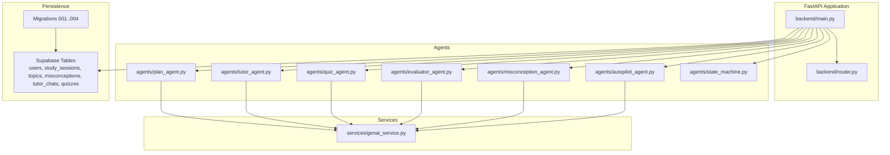
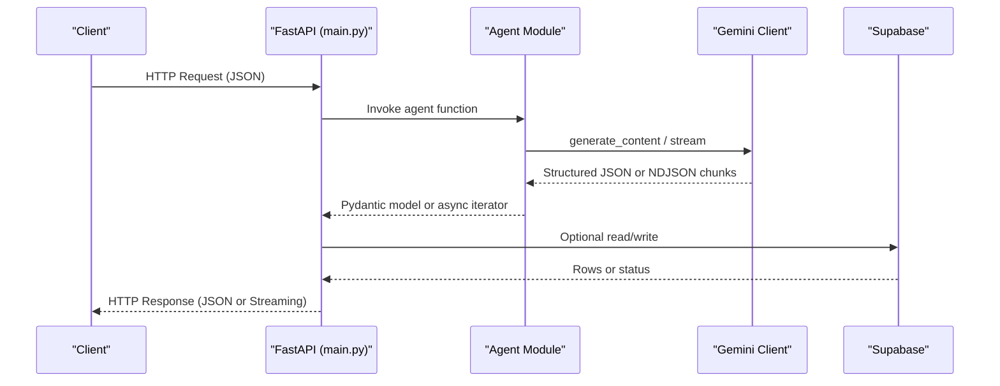
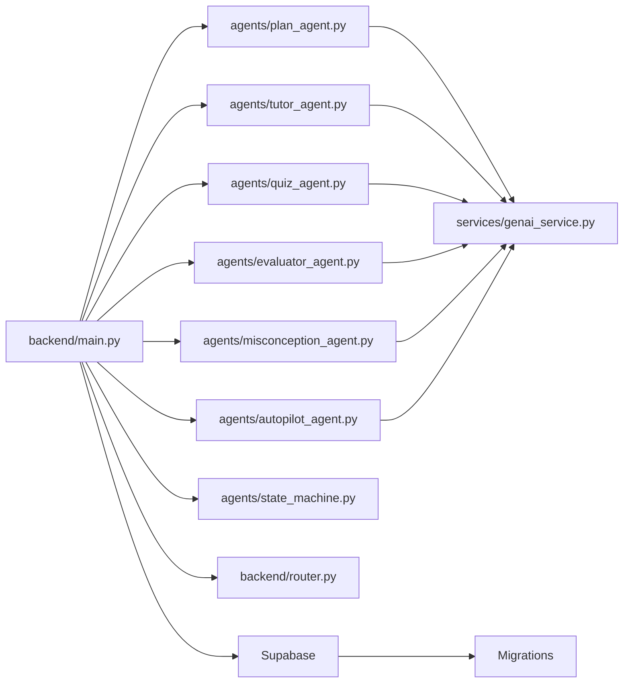
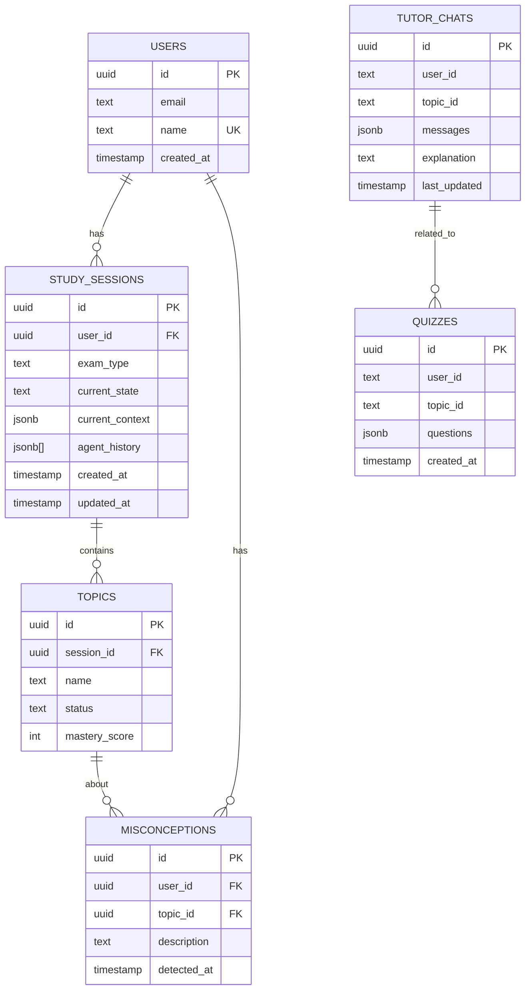

# Backend API Reference

<cite>
**Referenced Files in This Document**
- [main.py](file://backend/main.py)
- [router.py](file://backend/router.py)
- [schemas.py](file://backend/agents/schemas.py)
- [plan_agent.py](file://backend/agents/plan_agent.py)
- [tutor_agent.py](file://backend/agents/tutor_agent.py)
- [quiz_agent.py](file://backend/agents/quiz_agent.py)
- [evaluator_agent.py](file://backend/agents/evaluator_agent.py)
- [misconception_agent.py](file://backend/agents/misconception_agent.py)
- [autopilot_agent.py](file://backend/agents/autopilot_agent.py)
- [state_machine.py](file://backend/agents/state_machine.py)
- [genai_service.py](file://backend/services/genai_service.py)
- [requirements.txt](file://backend/requirements.txt)
- [001_create_core_schema.sql](file://backend/migrations/001_create_core_schema.sql)
- [002_add_session_context.sql](file://backend/migrations/002_add_session_context.sql)
- [003_fix_users_rls.sql](file://backend/migrations/003_fix_users_rls.sql)
- [004_create_persistence_tables.sql](file://backend/migrations/004_create_persistence_tables.sql)
</cite>

## Table of Contents
1. [Introduction](#introduction)
2. [Project Structure](#project-structure)
3. [Core Components](#core-components)
4. [Architecture Overview](#architecture-overview)
5. [Detailed Component Analysis](#detailed-component-analysis)
6. [Dependency Analysis](#dependency-analysis)
7. [Performance Considerations](#performance-considerations)
8. [Troubleshooting Guide](#troubleshooting-guide)
9. [Conclusion](#conclusion)
10. [Appendices](#appendices)

## Introduction
This document provides comprehensive API documentation for Exammentor AI’s backend. It covers all RESTful endpoints grouped by functional areas: Study Plan Generation, Interactive Tutoring, Quiz Management, Performance Analysis, Session Management, and Autopilot Control. For each endpoint, you will find HTTP methods, URL patterns, request/response schemas using Pydantic models, authentication requirements, error handling patterns, streaming behavior, and practical usage examples. It also documents the relationship between endpoints and underlying AI agents, CORS configuration, and monitoring capabilities.

## Project Structure
The backend is a FastAPI application that orchestrates multiple specialized agents powered by Google Gemini. Endpoints are defined in the main application module and delegate to agent implementations. A centralized Google Generative AI service client is used across agents for structured outputs and streaming. Supabase is used for persistence of users, sessions, topics, misconceptions, chat history, and quizzes.

**Diagram sources**
- [main.py](file://backend/main.py#L1-L843)
- [router.py](file://backend/router.py#L1-L129)
- [plan_agent.py](file://backend/agents/plan_agent.py#L1-L524)
- [tutor_agent.py](file://backend/agents/tutor_agent.py#L1-L277)
- [quiz_agent.py](file://backend/agents/quiz_agent.py#L1-L283)
- [evaluator_agent.py](file://backend/agents/evaluator_agent.py#L1-L198)
- [misconception_agent.py](file://backend/agents/misconception_agent.py#L1-L64)
- [autopilot_agent.py](file://backend/agents/autopilot_agent.py#L1-L628)
- [state_machine.py](file://backend/agents/state_machine.py#L1-L136)
- [genai_service.py](file://backend/services/genai_service.py#L1-L10)

**Section sources**
- [main.py](file://backend/main.py#L1-L843)
- [router.py](file://backend/router.py#L1-L129)

## Core Components
- FastAPI application with CORS enabled for frontend integration.
- Pydantic models define strict request/response schemas for all endpoints.
- Agents encapsulate AI logic and produce structured outputs compatible with Gemini 3’s response_schema feature.
- Supabase-backed persistence for users, sessions, topics, misconceptions, chat history, and quizzes.
- Centralized Google Generative AI client for async generation and streaming.

**Section sources**
- [main.py](file://backend/main.py#L8-L37)
- [requirements.txt](file://backend/requirements.txt#L1-L32)
- [genai_service.py](file://backend/services/genai_service.py#L1-L10)

## Architecture Overview
The API is organized around functional domains. Each domain exposes one or more endpoints that either call agents directly or integrate with state machines and persistence.

**Diagram sources**
- [main.py](file://backend/main.py#L120-L843)
- [genai_service.py](file://backend/services/genai_service.py#L1-L10)
- [001_create_core_schema.sql](file://backend/migrations/001_create_core_schema.sql#L1-L46)

## Detailed Component Analysis

### Study Plan Generation
Endpoints for generating, verifying, and streaming study plans.

- Base Request Model
  - PlanRequest
    - Fields: syllabus_text (str), exam_type (str), goal (str), days (int, default 7)
- Endpoints
  - POST /api/plan/generate
    - Description: Legacy plan generation.
    - Request: PlanRequest
    - Response: PlanOutput (Pydantic model)
    - Errors: 500 on internal failure
  - POST /api/plan/generate-verified
    - Description: Verified plan using iterative verification.
    - Request: PlanRequest
    - Response: PlanOutput
    - Errors: 500 on internal failure
  - POST /api/plan/generate-verified-with-history
    - Description: Full self-correction history with versions and verification summary.
    - Request: PlanRequest
    - Response: {
        final_plan: PlanOutput
        versions: [{version, plan, verification, was_accepted}]
        total_iterations: int
        self_correction_applied: bool
        verification_summary: dict
      }
    - Errors: 500 on internal failure
  - POST /api/plan/stream-verified
    - Description: Stream plan generation with self-correction events.
    - Request: PlanRequest
    - Response: application/x-ndjson (newline-delimited JSON)
    - Errors: 500 on internal failure
- Relationship to Agents
  - Delegates to plan_agent.py functions: generate_study_plan, generate_verified_plan, generate_verified_plan_with_history, stream_verified_plan_with_history.
- Validation and Constraints
  - Uses router.py to scope syllabi and inject constraints into the goal.
- Streaming Behavior
  - Media type: application/x-ndjson
  - Chunk types include debug, status, draft, verification, and complete.

**Section sources**
- [main.py](file://backend/main.py#L128-L223)
- [plan_agent.py](file://backend/agents/plan_agent.py#L49-L304)
- [router.py](file://backend/router.py#L64-L128)

### Interactive Tutoring
Endpoints for explanations, multimodal tutoring, and PDF text extraction.

- Request Models
  - TutorRequest: topic (str), context (str), difficulty (str, default "medium"), history (List[dict], optional), attached_context (str, optional)
  - ImageTutorRequest: topic (str), image_base64 (str), mime_type (str, default "image/jpeg")
  - ExtractPdfRequest: pdf_base64 (str)
- Endpoints
  - POST /api/tutor/explain
    - Description: Structured explanation with steps.
    - Request: TutorRequest
    - Response: TutorOutput (Pydantic model)
    - Errors: 500 on internal failure
  - POST /api/tutor/stream
    - Description: Streaming explanation for real-time UI.
    - Request: TutorRequest
    - Response: application/x-ndjson
    - Errors: 500 on internal failure
  - POST /api/extract-pdf-text
    - Description: Extract text from PDF (first 50 pages, capped at ~12KB).
    - Request: ExtractPdfRequest
    - Response: {text: str}
    - Errors: 400 on extraction failure
  - POST /api/tutor/explain-image
    - Description: Explain using an image (diagram).
    - Request: ImageTutorRequest
    - Response: MultimodalExplanation (Pydantic model)
    - Errors: 500 on internal failure
  - POST /api/describe-image
    - Description: Describe image content for context.
    - Request: DescribeImageRequest
    - Response: {description: str}
    - Errors: 500 on internal failure
- Relationship to Agents
  - Delegates to tutor_agent.py functions: generate_explanation, stream_explanation, explain_image, describe_image_for_context.
- Streaming Behavior
  - Media type: application/x-ndjson for streaming endpoint.

**Section sources**
- [main.py](file://backend/main.py#L227-L325)
- [tutor_agent.py](file://backend/agents/tutor_agent.py#L51-L247)

### Quiz Management
Endpoints for generating quizzes, evaluating answers, and multimodal quiz generation.

- Request Models
  - QuizRequest: topic (str), context (str), num_questions (int, default 5), difficulty (str, default "medium"), previous_mistakes (List[str], optional)
  - AnswerRequest: question_id (str), question_text (str), options (List[str]), correct_option_index (int), student_answer_index (int), concept_tested (str), topic_context (str)
  - ImageQuizRequest: topic (str), image_base64 (str), mime_type (str, default "image/jpeg"), num_questions (int, default 5), difficulty (str, default "medium")
- Endpoints
  - POST /api/quiz/generate
    - Description: Adaptive quiz generation.
    - Request: QuizRequest
    - Response: QuizOutput (Pydantic model)
    - Errors: 500 on internal failure
  - POST /api/quiz/generate-from-image
    - Description: Multimodal quiz referencing visual regions.
    - Request: ImageQuizRequest
    - Response: {
        topic: str
        image_description: str
        visual_elements_used: List[str]
        time_estimate_minutes: int
        questions: [ImageQuizQuestion...]
      }
    - Errors: 500 on internal failure
  - POST /api/quiz/evaluate
    - Description: Evaluate answer and provide feedback.
    - Request: AnswerRequest
    - Response: AnswerEvaluation (Pydantic model)
    - Errors: 500 on internal failure
- Relationship to Agents
  - Delegates to quiz_agent.py functions: generate_quiz, generate_quiz_from_image, evaluate_answer.

**Section sources**
- [main.py](file://backend/main.py#L329-L429)
- [quiz_agent.py](file://backend/agents/quiz_agent.py#L53-L246)

### Performance Analysis
Endpoints for analyzing quiz performance and busting misconceptions.

- Request Models
  - AnalysisRequest: quiz_answers (List[dict]), topic (str), context (str), user_id (str, optional), topic_id (str, optional)
  - MisconceptionRequest: question_id (str), question_text (str), options (List[str]), correct_option_index (int), student_answer_index (int), concept_tested (str), topic_context (str), session_id (str, optional), user_id (str, optional)
- Endpoints
  - POST /api/analyze/performance
    - Description: Analyze performance and generate insights.
    - Request: AnalysisRequest
    - Response: PerformanceAnalysis (Pydantic model)
    - Persistence: When user_id provided, persists misconceptions to misconceptions table.
    - Errors: 500 on internal failure
  - POST /api/quiz/misconception
    - Description: Analyze wrong answer and generate counter-example/redemption question.
    - Request: MisconceptionRequest
    - Response: MisconceptionAnalysis (Pydantic model)
    - Persistence: When user_id provided, persists misconception; when session_id provided, logs action to state machine.
    - Errors: 500 on internal failure
- Relationship to Agents
  - Delegates to evaluator_agent.py and misconception_agent.py.

**Section sources**
- [main.py](file://backend/main.py#L433-L514)
- [evaluator_agent.py](file://backend/agents/evaluator_agent.py#L59-L115)
- [misconception_agent.py](file://backend/agents/misconception_agent.py#L21-L63)

### Session Management
Endpoints for managing study sessions and resuming state.

- Request Models
  - SessionStartRequest: user_id (str), exam_type (str, default "NEET")
  - SaveSessionState: context_data (dict), phase (str)
- Endpoints
  - POST /api/session/start
    - Description: Create a new study session.
    - Request: SessionStartRequest
    - Response: {session_id: str}
    - Persistence: Inserts into study_sessions.
    - Errors: 500 on internal failure
  - GET /api/session/{session_id}/state
    - Description: Resume session state from Supabase.
    - Path params: session_id (str)
    - Response: {phase: str, context: dict}
    - Errors: 500 on internal failure
  - POST /api/session/{session_id}/save
    - Description: Manually save session state.
    - Path params: session_id (str)
    - Request: SaveSessionState
    - Response: {ok: true}
    - Errors: 500 on internal failure
- Relationship to Agents
  - Uses state_machine.py to manage phases and persistence.

**Section sources**
- [main.py](file://backend/main.py#L523-L571)
- [state_machine.py](file://backend/agents/state_machine.py#L54-L135)

### Autopilot Control
Endpoints for autonomous learning sessions with interactive quiz support.

- Request Models
  - AutopilotStartRequest: study_plan (dict), exam_type (str, default "NEET"), duration_minutes (int, default 30), user_id (str, optional)
  - AutopilotAnswerRequest: answer_index (int)
- Endpoints
  - POST /api/autopilot/start
    - Description: Start an autonomous 30-minute learning session.
    - Request: AutopilotStartRequest
    - Response: {
        session_id: str
        status: str
        target_duration_minutes: int
        started_at: str
      }
    - Persistence: Creates study_sessions and pre-seeds topics when user_id provided.
    - Errors: 400 if already running; 500 on internal failure
  - GET /api/autopilot/status/{session_id}
    - Description: Get current session status and run log.
    - Path params: session_id (str)
    - Response: {
        session_id: str
        status: str
        current_phase: str
        current_topic: str
        topics_completed: int
        elapsed_seconds: int
        target_duration_minutes: int
        topic_mastery: dict
        steps: List[AutopilotStep]
        started_at: str
        completed_at: str
        current_content: str
        current_question: dict
        awaiting_input: bool
      }
    - Errors: 404 if not found; 500 on internal failure
  - POST /api/autopilot/pause/{session_id}
    - Description: Pause the running session.
    - Path params: session_id (str)
    - Response: {status: "paused", session_id: str}
    - Errors: 404 if not found; 400 if not running
  - POST /api/autopilot/resume/{session_id}
    - Description: Resume a paused session.
    - Path params: session_id (str)
    - Response: {status: "running", session_id: str}
    - Errors: 404 if not found; 400 if not paused
  - POST /api/autopilot/stop/{session_id}
    - Description: Stop the session.
    - Path params: session_id (str)
    - Response: {status: "stopped", session_id: str}
    - Errors: 404 if not found
  - POST /api/autopilot/answer/{session_id}
    - Description: Submit an answer to the running session.
    - Path params: session_id (str)
    - Request: AutopilotAnswerRequest
    - Response: {status: "answer_received", session_id: str}
    - Errors: 404 if not found; 400 if not awaiting input; 500 on internal failure
- Relationship to Agents
  - Uses autopilot_agent.py for orchestration and state tracking.

**Section sources**
- [main.py](file://backend/main.py#L582-L757)
- [autopilot_agent.py](file://backend/agents/autopilot_agent.py#L584-L628)

### Additional Endpoints
- Authentication
  - POST /api/users/login
    - Description: Create or retrieve user by name.
    - Request: UserLoginRequest
    - Response: User row
    - Errors: 500 on internal failure
- Persistence
  - GET /api/tutor/chat
    - Description: Get chat history for a user/topic.
    - Query: user_id (str), topic_id (str)
    - Response: {messages: List[dict], explanation: str}
    - Errors: Returns empty on error
  - POST /api/tutor/chat
    - Description: Save chat history.
    - Request: ChatHistoryRequest
    - Response: Saved row
    - Errors: 500 on internal failure

**Section sources**
- [main.py](file://backend/main.py#L763-L800)

### Health Check and Monitoring
- GET /health
  - Description: Health check endpoint.
  - Response: {ok: true, service: "exammentor-ai", version: "0.1.0"}

**Section sources**
- [main.py](file://backend/main.py#L120-L123)

## Dependency Analysis
The API depends on:
- FastAPI for routing and request/response handling.
- Pydantic for strict schema validation.
- Google Generative AI client for structured outputs and streaming.
- Supabase for persistence and row-level security policies.

**Diagram sources**
- [main.py](file://backend/main.py#L1-L843)
- [plan_agent.py](file://backend/agents/plan_agent.py#L1-L524)
- [tutor_agent.py](file://backend/agents/tutor_agent.py#L1-L277)
- [quiz_agent.py](file://backend/agents/quiz_agent.py#L1-L283)
- [evaluator_agent.py](file://backend/agents/evaluator_agent.py#L1-L198)
- [misconception_agent.py](file://backend/agents/misconception_agent.py#L1-L64)
- [autopilot_agent.py](file://backend/agents/autopilot_agent.py#L1-L628)
- [state_machine.py](file://backend/agents/state_machine.py#L1-L136)
- [router.py](file://backend/router.py#L1-L129)
- [genai_service.py](file://backend/services/genai_service.py#L1-L10)
- [001_create_core_schema.sql](file://backend/migrations/001_create_core_schema.sql#L1-L46)

**Section sources**
- [main.py](file://backend/main.py#L1-L843)
- [requirements.txt](file://backend/requirements.txt#L1-L32)

## Performance Considerations
- Streaming Endpoints
  - application/x-ndjson is used for real-time UI updates. Clients should parse newline-delimited JSON.
- Request Size Limits
  - PDF text extraction caps processed text (~12KB) and limits to first 50 pages.
  - Image descriptions and attached contexts are truncated to prevent oversized prompts.
- Rate Limiting and Retries
  - Autopilot engine retries model calls with exponential backoff on 503/429-like errors.
- Model Selection
  - Different models are used for speed vs. quality trade-offs across endpoints.
- Persistence Throughput
  - Supabase operations are synchronous; consider batching or async patterns in production.

[No sources needed since this section provides general guidance]

## Troubleshooting Guide
- Common HTTP Errors
  - 400 Bad Request: Session already running, not awaiting input, incorrect state.
  - 404 Not Found: Session not found.
  - 500 Internal Server Error: Agent failures, persistence errors, or model overload.
- Streaming Issues
  - Ensure clients consume application/x-ndjson properly and handle newline-delimited JSON.
- CORS
  - CORS is configured to allow all origins/headers/methods for development ease. Adjust in production.
- Persistence Failures
  - Missing Supabase credentials disables persistence. Check environment variables and policies.

**Section sources**
- [main.py](file://backend/main.py#L596-L596)
- [main.py](file://backend/main.py#L689-L691)
- [main.py](file://backend/main.py#L748-L749)
- [autopilot_agent.py](file://backend/agents/autopilot_agent.py#L152-L161)

## Conclusion
Exammentor AI’s backend provides a modular, agent-driven API for intelligent study coaching. Endpoints are organized by functional domains, leverage structured AI outputs, and integrate with Supabase for persistence. Streaming endpoints enable real-time UI feedback, while state machines and autopilot orchestrate autonomous learning sessions. The documented schemas and patterns facilitate robust client integrations.

[No sources needed since this section summarizes without analyzing specific files]

## Appendices

### Authentication and Authorization
- Authentication
  - Name-based login via POST /api/users/login.
- Authorization
  - Row Level Security enabled on users, tutor_chats, quizzes; policies allow public access for MVP.

**Section sources**
- [main.py](file://backend/main.py#L763-L776)
- [003_fix_users_rls.sql](file://backend/migrations/003_fix_users_rls.sql#L15-L40)
- [004_create_persistence_tables.sql](file://backend/migrations/004_create_persistence_tables.sql#L28-L43)

### CORS Configuration
- Origins: All (*)
- Methods and Headers: All (*)
- Credentials: Allowed

**Section sources**
- [main.py](file://backend/main.py#L30-L37)

### Data Models and Schemas
- Study Plan Generation
  - PlanOutput, StudyDay, DailyPlan, Topic, PlanVerification, PlanWithHistory, PlanVersion
- Interactive Tutoring
  - TutorOutput, ExplanationStep, MultimodalExplanation, ImageHighlight
- Quiz Management
  - QuizOutput, Question, ImageQuiz, ImageQuizQuestion, AnswerEvaluation
- Performance Analysis
  - PerformanceAnalysis, TopicMastery, Misconception, StudyRecommendation, QuizAnswer
- Autopilot
  - AutopilotSession, AutopilotEngine, AutopilotStep, TopicMastery, TopicSelection

**Section sources**
- [schemas.py](file://backend/agents/schemas.py#L16-L105)
- [plan_agent.py](file://backend/agents/plan_agent.py#L17-L144)
- [tutor_agent.py](file://backend/agents/tutor_agent.py#L16-L47)
- [quiz_agent.py](file://backend/agents/quiz_agent.py#L28-L50)
- [evaluator_agent.py](file://backend/agents/evaluator_agent.py#L15-L43)
- [autopilot_agent.py](file://backend/agents/autopilot_agent.py#L39-L96)

### Database Schema Overview

**Diagram sources**
- [001_create_core_schema.sql](file://backend/migrations/001_create_core_schema.sql#L8-L40)
- [004_create_persistence_tables.sql](file://backend/migrations/004_create_persistence_tables.sql#L4-L21)