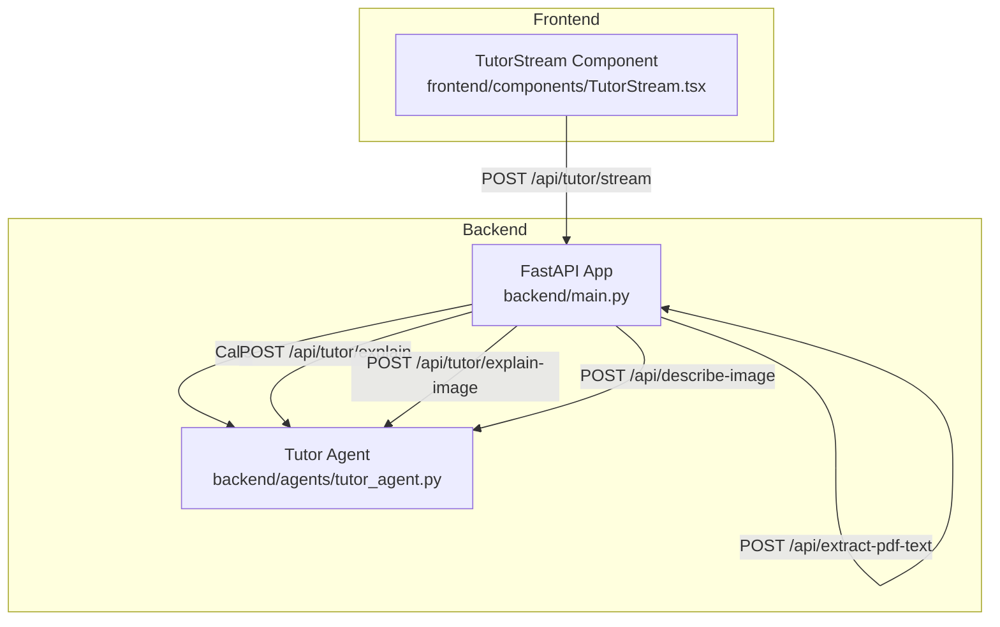
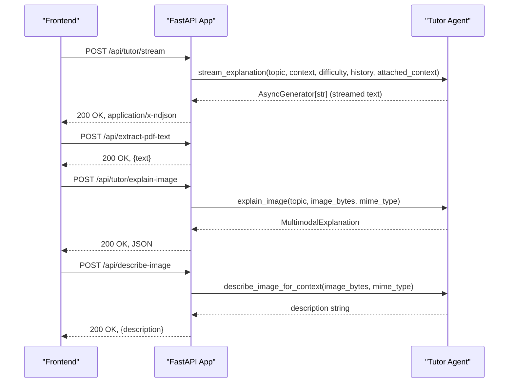
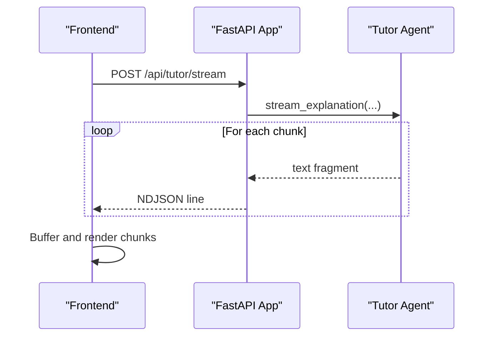
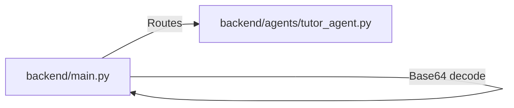

# Interactive Tutoring

<cite>
**Referenced Files in This Document**
- [backend/main.py](file://backend/main.py)
- [backend/agents/tutor_agent.py](file://backend/agents/tutor_agent.py)
- [frontend/components/TutorStream.tsx](file://frontend/components/TutorStream.tsx)
</cite>

## Table of Contents
1. [Introduction](#introduction)
2. [Project Structure](#project-structure)
3. [Core Components](#core-components)
4. [Architecture Overview](#architecture-overview)
5. [Detailed Component Analysis](#detailed-component-analysis)
6. [Dependency Analysis](#dependency-analysis)
7. [Performance Considerations](#performance-considerations)
8. [Troubleshooting Guide](#troubleshooting-guide)
9. [Conclusion](#conclusion)

## Introduction
This document provides detailed API documentation for Interactive Tutoring endpoints powering structured explanations, real-time streaming, multimodal image processing, and PDF text extraction. It covers request/response schemas, validation rules, streaming formats, and practical usage examples for building interactive tutoring interfaces.

## Project Structure
The backend exposes REST endpoints implemented in a FastAPI application. The frontend integrates with these endpoints to render streaming explanations and handle multimodal inputs.

**Diagram sources**
- [backend/main.py](file://backend/main.py#L227-L324)
- [backend/agents/tutor_agent.py](file://backend/agents/tutor_agent.py#L51-L247)
- [frontend/components/TutorStream.tsx](file://frontend/components/TutorStream.tsx#L64-L115)

**Section sources**
- [backend/main.py](file://backend/main.py#L24-L37)
- [backend/agents/tutor_agent.py](file://backend/agents/tutor_agent.py#L1-L12)

## Core Components
- Request/Response Models
  - TutorRequest: Topic, context, difficulty, optional history, and attached_context for study material.
  - ImageTutorRequest: Topic, base64-encoded image, and MIME type.
  - ExtractPdfRequest: Base64-encoded PDF payload.
  - DescribeImageRequest: Base64-encoded image and MIME type.
- Streaming Response Format
  - application/x-ndjson with newline-delimited JSON chunks for streaming endpoints.
- Multimodal Capabilities
  - Image-based explanations and image descriptions for context enrichment.
  - PDF text extraction with page and length limits.

**Section sources**
- [backend/main.py](file://backend/main.py#L49-L87)
- [backend/main.py](file://backend/main.py#L263-L324)
- [backend/agents/tutor_agent.py](file://backend/agents/tutor_agent.py#L16-L47)

## Architecture Overview
The backend routes accept requests, validate them via Pydantic models, and delegate to agent functions. Streaming endpoints return a StreamingResponse with newline-delimited JSON chunks. Multimodal endpoints decode base64 images and pass them to the tutor agent.

**Diagram sources**
- [backend/main.py](file://backend/main.py#L245-L324)
- [backend/agents/tutor_agent.py](file://backend/agents/tutor_agent.py#L51-L247)

## Detailed Component Analysis

### POST /api/tutor/explain
- Purpose: Returns a structured explanation for a topic with steps, intuition, real-world example, pitfalls, and a practice question.
- Request Schema: TutorRequest
  - topic: string
  - context: string
  - difficulty: "easy" | "medium" | "hard" (default: "medium")
  - history: array of message dicts (optional)
  - attached_context: string (optional)
- Response Schema: TutorExplanation
  - topic: string
  - intuition: string
  - steps: array of ExplanationStep
    - step_number: integer
    - title: string
    - content: string
    - analogy: string (optional)
  - real_world_example: string
  - common_pitfall: string
  - practice_question: string (optional)
- Validation Rules
  - difficulty must be one of the allowed values.
  - history entries must be dicts with role/content.
  - attached_context is truncated to a safe length internally.
- Notes
  - Uses a structured JSON response schema for consistent parsing.

**Section sources**
- [backend/main.py](file://backend/main.py#L227-L243)
- [backend/agents/tutor_agent.py](file://backend/agents/tutor_agent.py#L16-L30)

### POST /api/tutor/stream
- Purpose: Streams an explanation in real-time for immediate UI feedback.
- Request Schema: TutorRequest
- Streaming Response
  - Media Type: application/x-ndjson
  - Format: newline-delimited JSON chunks containing text fragments.
- Frontend Handling
  - The frontend reads the stream body, decodes chunks, and buffers content for smooth rendering.
- Practical Usage
  - Use topic, context, difficulty, and optional history/attached_context.
  - Append attached_context from PDF extraction or image descriptions to enrich explanations.

**Diagram sources**
- [backend/main.py](file://backend/main.py#L245-L260)
- [backend/agents/tutor_agent.py](file://backend/agents/tutor_agent.py#L51-L127)
- [frontend/components/TutorStream.tsx](file://frontend/components/TutorStream.tsx#L64-L115)

**Section sources**
- [backend/main.py](file://backend/main.py#L245-L260)
- [backend/agents/tutor_agent.py](file://backend/agents/tutor_agent.py#L51-L127)
- [frontend/components/TutorStream.tsx](file://frontend/components/TutorStream.tsx#L64-L115)

### POST /api/extract-pdf-text
- Purpose: Extracts text from an uploaded PDF (base64) to be used as study material context.
- Request Schema: ExtractPdfRequest
  - pdf_base64: string (base64-encoded PDF)
- Response Schema: object
  - text: string (extracted text, limited to first 50 pages and a maximum length)
- Limits and Behavior
  - Processes up to 50 pages.
  - Truncates total extracted text to a configured maximum length.
  - Returns a placeholder message if no text is found.
- Validation Rules
  - pdf_base64 must be a valid base64 string.
- Practical Usage
  - After extracting text, send it as attached_context in /api/tutor/explain or /api/tutor/stream.

**Section sources**
- [backend/main.py](file://backend/main.py#L267-L284)

### POST /api/tutor/explain-image
- Purpose: Explains a topic using an uploaded image (e.g., diagram) with visual grounding.
- Request Schema: ImageTutorRequest
  - topic: string
  - image_base64: string (base64-encoded image)
  - mime_type: string (default: "image/jpeg")
- Response Schema: MultimodalExplanation
  - topic: string
  - intuition: string
  - visual_references: array of ImageHighlight
    - label: string
    - region: string
    - description: string
  - explanation: string
  - deep_dive: array of ExplanationStep
  - practice_question: string
- Validation Rules
  - image_base64 must decode to valid image bytes.
  - mime_type must match the image format.
- Practical Usage
  - Use the returned visual_references to guide UI highlights.
  - Combine explanation with attached_context for richer tutoring.

**Section sources**
- [backend/main.py](file://backend/main.py#L287-L303)
- [backend/agents/tutor_agent.py](file://backend/agents/tutor_agent.py#L32-L47)

### POST /api/describe-image
- Purpose: Describes an image’s contents (without topic explanation) for use as study material context.
- Request Schema: DescribeImageRequest
  - image_base64: string (base64-encoded image)
  - mime_type: string (default: "image/jpeg")
- Response Schema: object
  - description: string (factual description of the image content)
- Validation Rules
  - image_base64 must decode to valid image bytes.
  - mime_type must match the image format.
- Practical Usage
  - Use description as attached_context for tutoring or quiz generation.

**Section sources**
- [backend/main.py](file://backend/main.py#L310-L324)
- [backend/agents/tutor_agent.py](file://backend/agents/tutor_agent.py#L225-L247)

### Parameter Validation Rules
- TutorRequest
  - topic and context are required strings.
  - difficulty must be "easy", "medium", or "hard".
  - history must be an array of message dicts with role/content.
  - attached_context is optional and treated as plain text.
- ImageTutorRequest and DescribeImageRequest
  - image_base64 must be a valid base64 string.
  - mime_type must match the image type.
- ExtractPdfRequest
  - pdf_base64 must be a valid base64 string representing a PDF.

**Section sources**
- [backend/main.py](file://backend/main.py#L49-L87)
- [backend/main.py](file://backend/main.py#L263-L324)

### Streaming Response Format
- Media Type: application/x-ndjson
- Content: Newline-delimited JSON chunks. Each chunk corresponds to a text fragment streamed from the backend.
- Frontend Consumption
  - The frontend reads the stream body, decodes chunks, and renders them progressively.
  - A periodic flush mechanism ensures smooth UI updates.

**Section sources**
- [backend/main.py](file://backend/main.py#L205-L222)
- [backend/main.py](file://backend/main.py#L245-L260)
- [frontend/components/TutorStream.tsx](file://frontend/components/TutorStream.tsx#L85-L110)

### Multimodal Capabilities
- Image Processing
  - explain-image: Returns structured explanation with visual references and highlights.
  - describe-image: Returns a factual description for context reuse.
- PDF Parsing
  - extract-pdf-text: Extracts text from PDFs for tutoring and quiz contexts.
- Conversation Continuity
  - history parameter enables contextual tutoring across follow-ups.

**Section sources**
- [backend/agents/tutor_agent.py](file://backend/agents/tutor_agent.py#L189-L247)
- [backend/main.py](file://backend/main.py#L267-L324)

### Practical Usage Examples
- Building Interactive Interfaces
  - Use /api/tutor/stream for real-time tutoring UIs with sticky scrolling and debounced rendering.
  - Use /api/tutor/explain for complete explanations when offline rendering is preferred.
- Topic Context Formatting
  - Provide concise, topic-focused context in the context field.
  - Enrich with attached_context from PDF extraction or image descriptions.
- Difficulty Level Specifications
  - Choose "easy" for foundational concepts, "medium" for balanced explanations, "hard" for advanced coverage.
- History Parameter Usage
  - Pass recent conversation messages to maintain continuity (e.g., follow-ups).
- PDF Text Extraction Limits
  - Expect truncation at page and character limits; adjust uploads accordingly.

**Section sources**
- [frontend/components/TutorStream.tsx](file://frontend/components/TutorStream.tsx#L64-L115)
- [backend/main.py](file://backend/main.py#L267-L284)
- [backend/agents/tutor_agent.py](file://backend/agents/tutor_agent.py#L73-L117)

## Dependency Analysis

**Diagram sources**
- [backend/main.py](file://backend/main.py#L227-L324)
- [backend/agents/tutor_agent.py](file://backend/agents/tutor_agent.py#L1-L12)

**Section sources**
- [backend/main.py](file://backend/main.py#L227-L324)
- [backend/agents/tutor_agent.py](file://backend/agents/tutor_agent.py#L1-L12)

## Performance Considerations
- StreamingResponse with application/x-ndjson reduces latency and improves perceived responsiveness.
- Base64 decoding and image processing occur on the backend; keep image sizes reasonable.
- PDF extraction is limited to a fixed number of pages and total characters to prevent memory pressure.
- Frontend buffering and periodic flush reduce render churn during streaming.

[No sources needed since this section provides general guidance]

## Troubleshooting Guide
- Streaming Issues
  - Ensure the frontend consumes the stream body and handles reader availability.
  - Verify the endpoint returns application/x-ndjson.
- Base64 Decoding Errors
  - Confirm pdf_base64 and image_base64 are valid base64 strings.
  - Validate mime_type matches the uploaded file type.
- PDF Extraction Failures
  - Some PDFs may not contain selectable text; the endpoint returns a placeholder message when extraction yields no text.
- Multimodal Explanations
  - If image quality is poor, consider requesting a clearer image or using describe-image to capture context.

**Section sources**
- [frontend/components/TutorStream.tsx](file://frontend/components/TutorStream.tsx#L85-L110)
- [backend/main.py](file://backend/main.py#L267-L324)

## Conclusion
The Interactive Tutoring endpoints provide a robust foundation for building responsive, multimodal tutoring experiences. Structured explanations, real-time streaming, and multimodal image and PDF support enable rich, adaptive learning interfaces. Use the provided schemas, validation rules, and streaming format to integrate seamlessly with your frontend and deliver engaging educational content.