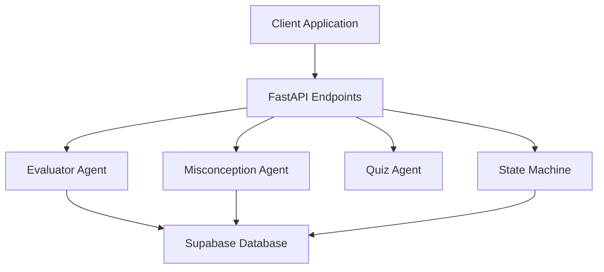
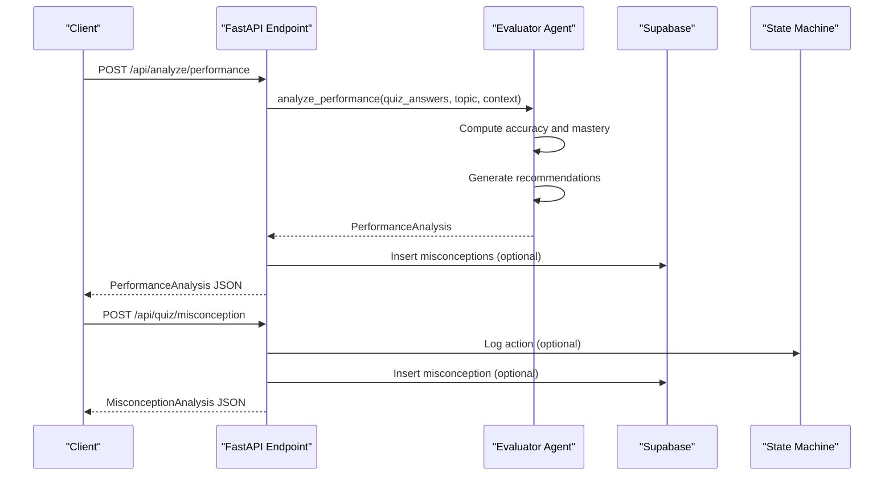
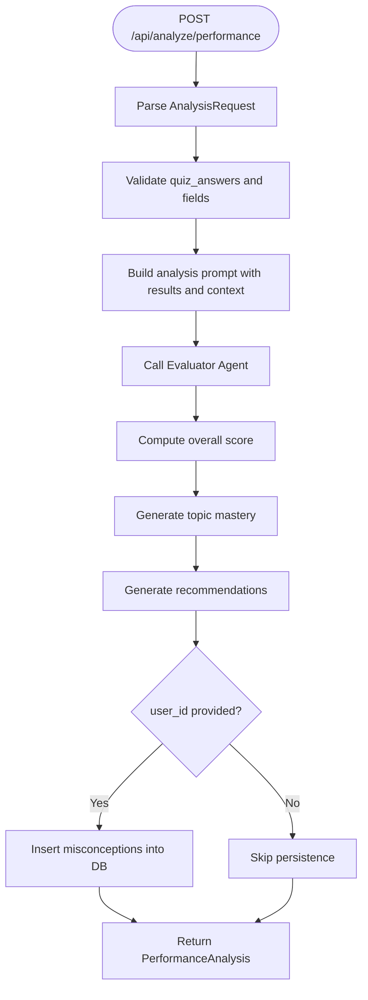
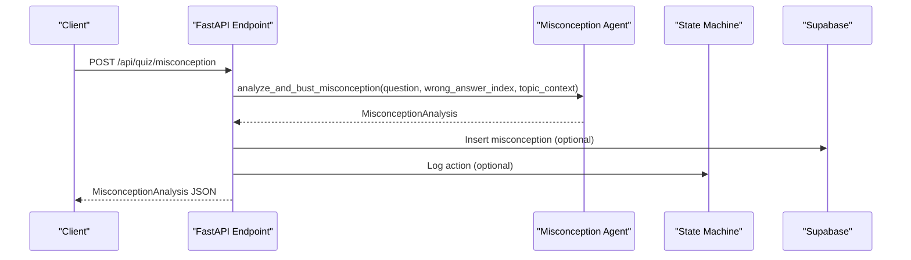
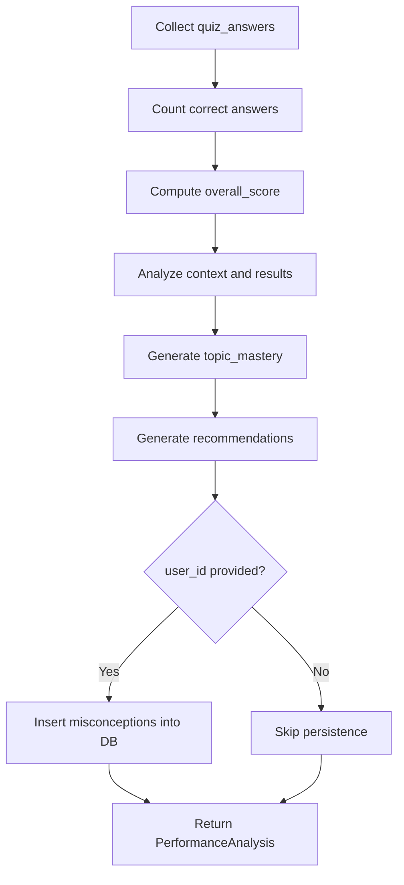
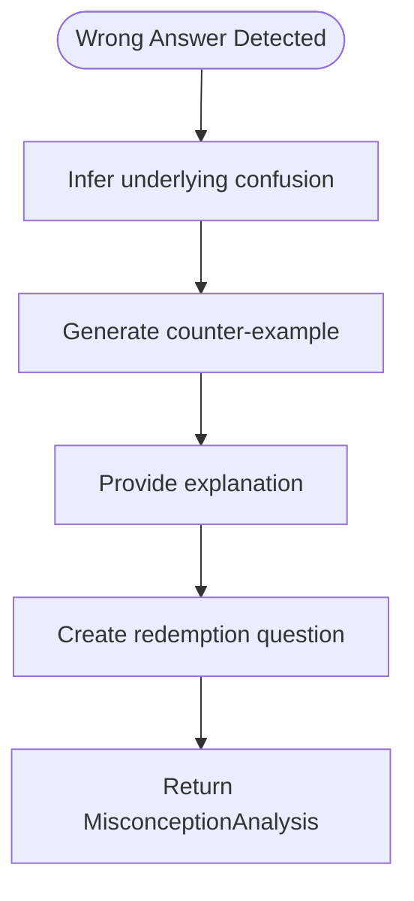
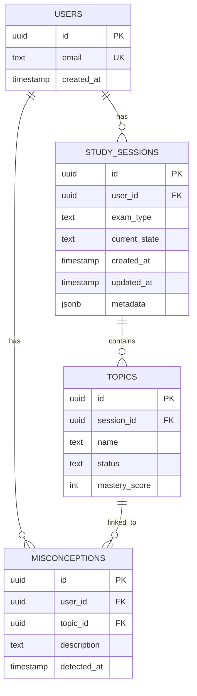
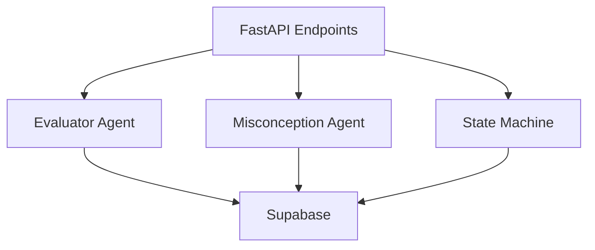

# Performance Analysis

<cite>
**Referenced Files in This Document**
- [main.py](file://backend/main.py)
- [router.py](file://backend/router.py)
- [evaluator_agent.py](file://backend/agents/evaluator_agent.py)
- [misconception_agent.py](file://backend/agents/misconception_agent.py)
- [schemas.py](file://backend/agents/schemas.py)
- [quiz_agent.py](file://backend/agents/quiz_agent.py)
- [state_machine.py](file://backend/agents/state_machine.py)
- [001_create_core_schema.sql](file://backend/migrations/001_create_core_schema.sql)
- [004_create_persistence_tables.sql](file://backend/migrations/004_create_persistence_tables.sql)
- [autopilot_agent.py](file://backend/agents/autopilot_agent.py)
</cite>

## Table of Contents
1. [Introduction](#introduction)
2. [Project Structure](#project-structure)
3. [Core Components](#core-components)
4. [Architecture Overview](#architecture-overview)
5. [Detailed Component Analysis](#detailed-component-analysis)
6. [Dependency Analysis](#dependency-analysis)
7. [Performance Considerations](#performance-considerations)
8. [Troubleshooting Guide](#troubleshooting-guide)
9. [Conclusion](#conclusion)

## Introduction
This document provides comprehensive API documentation for Performance Analysis endpoints in the ExamMentor AI platform. It focuses on two key endpoints:
- POST /api/analyze/performance: Performs comprehensive quiz performance analysis, calculating accuracy, assessing concept mastery, and generating personalized recommendations.
- POST /api/quiz/misconception: Analyzes a wrong answer to infer student confusion and generates targeted remediation content.

The documentation covers request/response schemas, parameter validation rules, response formats, and detailed examples. It also explains the performance analysis workflow, the misconception detection algorithm, and the integration with database persistence for storing misconceptions and tracking student progress.

## Project Structure
The backend is organized around FastAPI endpoints that delegate to specialized agents:
- FastAPI endpoints in main.py define request/response models and expose the API.
- Agents implement domain-specific logic:
  - Evaluator Agent performs performance analysis and generates recommendations.
  - Misconception Agent analyzes wrong answers and suggests remediation.
  - Quiz Agent handles quiz generation and answer evaluation.
  - State Machine manages session state and logs actions.
- Database migrations define the schema for persistence, including misconceptions and study sessions.

**Diagram sources**
- [main.py](file://backend/main.py#L433-L514)
- [evaluator_agent.py](file://backend/agents/evaluator_agent.py#L59-L115)
- [misconception_agent.py](file://backend/agents/misconception_agent.py#L21-L63)
- [state_machine.py](file://backend/agents/state_machine.py#L38-L136)

**Section sources**
- [main.py](file://backend/main.py#L433-L514)
- [evaluator_agent.py](file://backend/agents/evaluator_agent.py#L1-L198)
- [misconception_agent.py](file://backend/agents/misconception_agent.py#L1-L64)
- [state_machine.py](file://backend/agents/state_machine.py#L1-L136)

## Core Components
- AnalysisRequest: Input schema for performance analysis, including quiz answers, topic, context, and optional user/topic identifiers for persistence.
- MisconceptionRequest: Input schema for misconception analysis, including question details, student answer, and optional identifiers for persistence and session logging.
- PerformanceAnalysis: Output schema for performance analysis, including overall score, topic mastery breakdown, misconceptions, recommendations, and encouragement.
- MisconceptionAnalysis: Output schema for misconception analysis, including inferred confusion, counter-example, explanation, and a redemption question.

Validation rules enforced by Pydantic:
- AnalysisRequest: quiz_answers must be a non-empty list; user_id and topic_id are optional for persistence.
- MisconceptionRequest: question_id, question_text, options, correct_option_index, student_answer_index, concept_tested, topic_context are required; session_id and user_id are optional.
- QuizAnswer: question_id, question_text, concept_tested, student_answer, correct_answer, is_correct are required.

**Section sources**
- [main.py](file://backend/main.py#L75-L100)
- [evaluator_agent.py](file://backend/agents/evaluator_agent.py#L37-L55)
- [misconception_agent.py](file://backend/agents/misconception_agent.py#L13-L20)
- [schemas.py](file://backend/agents/schemas.py#L76-L84)

## Architecture Overview
The performance analysis workflow integrates multiple agents and persistence layers:
- API endpoints receive requests and convert them to internal models.
- Evaluator Agent analyzes quiz answers to compute accuracy, assess concept mastery, and generate recommendations.
- Misconception Agent analyzes wrong answers to infer conceptual confusion and provide remediation.
- State Machine persists session state and logs actions for audit trails.
- Database stores misconceptions and study sessions for progress tracking.

**Diagram sources**
- [main.py](file://backend/main.py#L433-L514)
- [evaluator_agent.py](file://backend/agents/evaluator_agent.py#L59-L115)
- [misconception_agent.py](file://backend/agents/misconception_agent.py#L21-L63)
- [state_machine.py](file://backend/agents/state_machine.py#L115-L136)

## Detailed Component Analysis

### POST /api/analyze/performance
Endpoint: POST /api/analyze/performance  
Description: Analyzes quiz performance and generates insights including overall score, topic mastery, misconceptions, recommendations, and encouragement.

Request Schema: AnalysisRequest
- quiz_answers: List[dict] — List of quiz answer records with fields: question_id, question_text, concept_tested, student_answer, correct_answer, is_correct.
- topic: string — The topic that was quizzed.
- context: string — Study material context used for analysis.
- user_id: string (optional) — Identifier for persisting misconceptions.
- topic_id: string (optional) — Identifier for the topic row if available.

Response Schema: PerformanceAnalysis
- overall_score: integer — Overall performance percentage (0–100).
- summary: string — Brief performance summary.
- topic_mastery: array of TopicMastery — Mastery breakdown per topic/concept.
- misconceptions: array of Misconception — Identified misconceptions with concept, description, correction, and suggested review.
- recommendations: array of StudyRecommendation — Prioritized study actions with priority, topic, and time estimate.
- encouragement: string — Motivational message for the student.

Processing Logic
- Accuracy Calculation: Computes the proportion of correct answers from quiz_answers.
- Concept Mastery Assessment: Uses the evaluator agent to analyze results and context, generating topic-wise mastery scores and strengths/weaknesses.
- Recommendation Generation: Produces actionable recommendations prioritized by impact and urgency.
- Persistence: When user_id is provided, inserts misconceptions into the misconceptions table with optional topic_id.

**Diagram sources**
- [main.py](file://backend/main.py#L433-L463)
- [evaluator_agent.py](file://backend/agents/evaluator_agent.py#L59-L115)

**Section sources**
- [main.py](file://backend/main.py#L433-L463)
- [evaluator_agent.py](file://backend/agents/evaluator_agent.py#L37-L115)

### POST /api/quiz/misconception
Endpoint: POST /api/quiz/misconception  
Description: Analyzes a wrong answer to infer student confusion and generates targeted remediation content including a counter-example and a redemption question.

Request Schema: MisconceptionRequest
- question_id: string — Unique identifier for the question.
- question_text: string — The question text.
- options: array of string — Available answer choices.
- correct_option_index: integer — Index of the correct answer (0-based).
- student_answer_index: integer — Index of the student’s chosen answer.
- concept_tested: string — The specific concept this question tests.
- topic_context: string — Topic and exam context for remediation.
- session_id: string (optional) — Session identifier for logging remediation actions.
- user_id: string (optional) — Identifier for persisting the misconception.

Response Schema: MisconceptionAnalysis
- wrong_option_chosen: string — The specific wrong option the student selected.
- inferred_confusion: string — The underlying conceptual mistake inferred from the wrong choice.
- counter_example: string — A specific example or logic that breaks the misconception.
- explanation: string — Pedagogical explanation of why the logic was flawed.
- redemption_question: Question — A new question designed to verify if the misconception is cleared.

Processing Logic
- Misconception Detection: Analyzes the wrong answer and context to infer the student’s confusion.
- Counter-Example Generation: Provides a concrete example that exposes the flaw in the student’s reasoning.
- Remediation: Offers a clear explanation of the correct concept.
- Redemption Question: Creates a new question at the same difficulty to test the corrected understanding.
- Persistence and Logging: When user_id is provided, inserts the inferred confusion into the misconceptions table. When session_id is provided, logs the action via the State Machine.

**Diagram sources**
- [main.py](file://backend/main.py#L465-L514)
- [misconception_agent.py](file://backend/agents/misconception_agent.py#L21-L63)
- [state_machine.py](file://backend/agents/state_machine.py#L115-L136)

**Section sources**
- [main.py](file://backend/main.py#L465-L514)
- [misconception_agent.py](file://backend/agents/misconception_agent.py#L13-L63)

### Parameter Validation Rules
- AnalysisRequest
  - quiz_answers: Must be a non-empty list; each item must include question_id, question_text, concept_tested, student_answer, correct_answer, is_correct.
  - topic: Required string.
  - context: Required string.
  - user_id: Optional string for persistence.
  - topic_id: Optional string for linking to a topic row.
- MisconceptionRequest
  - question_id: Required string.
  - question_text: Required string.
  - options: Required array of 4 strings.
  - correct_option_index: Required integer between 0 and 3.
  - student_answer_index: Required integer between 0 and 3.
  - concept_tested: Required string.
  - topic_context: Required string.
  - session_id: Optional string for session logging.
  - user_id: Optional string for persistence.

**Section sources**
- [main.py](file://backend/main.py#L75-L100)
- [schemas.py](file://backend/agents/schemas.py#L56-L64)

### Response Formats
- PerformanceAnalysis
  - overall_score: integer (0–100)
  - summary: string
  - topic_mastery: array of TopicMastery
    - topic: string
    - score: integer (0–100)
    - status: string (mastered, learning, weak, pending)
    - strength: string
    - weakness: string
  - misconceptions: array of Misconception
    - concept: string
    - description: string
    - correction: string
    - suggested_review: string
  - recommendations: array of StudyRecommendation
    - priority: integer
    - topic: string
    - action: string
    - time_estimate: string
  - encouragement: string
- MisconceptionAnalysis
  - wrong_option_chosen: string
  - inferred_confusion: string
  - counter_example: string
  - explanation: string
  - redemption_question: Question
    - id: string
    - text: string
    - options: array of string
    - correct_option_index: integer
    - explanation: string
    - difficulty: string
    - concept_tested: string

**Section sources**
- [evaluator_agent.py](file://backend/agents/evaluator_agent.py#L15-L44)
- [misconception_agent.py](file://backend/agents/misconception_agent.py#L13-L20)
- [schemas.py](file://backend/agents/schemas.py#L56-L64)

### Detailed Examples

#### Performance Analysis Example
- Request payload:
  - quiz_answers:
    - { question_id: "q1", question_text: "What is the capital of France?", concept_tested: "Geography", student_answer: "Berlin", correct_answer: "Paris", is_correct: false }
    - { question_id: "q2", question_text: "Which planet is known as the Red Planet?", concept_tested: "Solar System", student_answer: "Mars", correct_answer: "Mars", is_correct: true }
  - topic: "Geography and Science"
  - context: "This quiz covers basic geography and science facts for middle school students."
  - user_id: "user-123"
  - topic_id: "topic-456"
- Expected response:
  - overall_score: 50
  - summary: "You scored 50% on the quiz. Focus on geography fundamentals."
  - topic_mastery: [{ topic: "Geography", score: 0, status: "weak", strength: "", weakness: "Country capitals" }, { topic: "Solar System", score: 100, status: "mastered", strength: "Planet identification", weakness: "" }]
  - misconceptions: [{ concept: "Geography", description: "Confusion about European country capitals", correction: "Paris is the capital of France", suggested_review: "Review European capitals" }]
  - recommendations: [{ priority: 1, topic: "Geography", action: "Review European capitals", time_estimate: "30 minutes" }]
  - encouragement: "Great effort! Keep practicing to improve."

#### Misconception Analysis Example
- Request payload:
  - question_id: "q1"
  - question_text: "What is the capital of France?"
  - options: ["London", "Berlin", "Paris", "Madrid"]
  - correct_option_index: 2
  - student_answer_index: 1
  - concept_tested: "Geography"
  - topic_context: "Middle school geography quiz"
  - user_id: "user-123"
  - session_id: "session-789"
- Expected response:
  - wrong_option_chosen: "Berlin"
  - inferred_confusion: "Mix-up between German and French capitals"
  - counter_example: "Think of the Eiffel Tower located in Paris, not Berlin."
  - explanation: "Paris is the capital of France, while Berlin is the capital of Germany."
  - redemption_question: { id: "q-redemption", text: "Which city is home to the Brandenburg Gate?", options: ["Berlin", "Vienna", "Prague", "Warsaw"], correct_option_index: 0, explanation: "Brandenburg Gate is in Berlin", difficulty: "medium", concept_tested: "Geography" }

**Section sources**
- [evaluator_agent.py](file://backend/agents/evaluator_agent.py#L156-L198)
- [misconception_agent.py](file://backend/agents/misconception_agent.py#L21-L63)

### Performance Analysis Workflow
- Accuracy Calculation: Sums correct answers and divides by total to compute overall_score.
- Concept Mastery Assessment: Uses the evaluator agent to analyze results and context, generating topic-wise mastery scores and strengths/weaknesses.
- Recommendation Generation: Produces actionable recommendations prioritized by impact and urgency.
- Persistence: When user_id is provided, inserts misconceptions into the misconceptions table with optional topic_id.

**Diagram sources**
- [evaluator_agent.py](file://backend/agents/evaluator_agent.py#L85-L115)
- [main.py](file://backend/main.py#L447-L462)

**Section sources**
- [evaluator_agent.py](file://backend/agents/evaluator_agent.py#L59-L115)
- [main.py](file://backend/main.py#L433-L463)

### Misconception Detection Algorithm
- Input: Question, wrong_answer_index, topic_context.
- Inference: Determines why the student chose the wrong option and infers the underlying conceptual mistake.
- Counter-Example: Provides a specific example that breaks the misconception.
- Explanation: Offers a pedagogical explanation of the correct concept.
- Redemption Question: Creates a new question at the same difficulty to verify understanding.

**Diagram sources**
- [misconception_agent.py](file://backend/agents/misconception_agent.py#L21-L63)

**Section sources**
- [misconception_agent.py](file://backend/agents/misconception_agent.py#L21-L63)

### Integration with Database Persistence
- Misconceptions Table: Stores user_id, topic_id (optional), description, and detected_at timestamp.
- Study Sessions Table: Tracks user_id, exam_type, current_state, and metadata for session lifecycle.
- Persistence Logic:
  - Performance Analysis: When user_id is provided, inserts misconceptions into the misconceptions table with optional topic_id.
  - Misconception Endpoint: When user_id is provided, inserts the inferred confusion into the misconceptions table; when session_id is provided, logs the action via the State Machine.

**Diagram sources**
- [001_create_core_schema.sql](file://backend/migrations/001_create_core_schema.sql#L7-L41)

**Section sources**
- [main.py](file://backend/main.py#L447-L462)
- [main.py](file://backend/main.py#L491-L511)
- [001_create_core_schema.sql](file://backend/migrations/001_create_core_schema.sql#L34-L40)

## Dependency Analysis
The performance analysis endpoints depend on:
- Evaluator Agent for performance analysis and recommendations.
- Misconception Agent for wrong-answer analysis and remediation.
- State Machine for session logging and state persistence.
- Database for storing misconceptions and study sessions.

**Diagram sources**
- [main.py](file://backend/main.py#L433-L514)
- [evaluator_agent.py](file://backend/agents/evaluator_agent.py#L59-L115)
- [misconception_agent.py](file://backend/agents/misconception_agent.py#L21-L63)
- [state_machine.py](file://backend/agents/state_machine.py#L38-L136)

**Section sources**
- [main.py](file://backend/main.py#L433-L514)
- [evaluator_agent.py](file://backend/agents/evaluator_agent.py#L1-L198)
- [misconception_agent.py](file://backend/agents/misconception_agent.py#L1-L64)
- [state_machine.py](file://backend/agents/state_machine.py#L1-L136)

## Performance Considerations
- Asynchronous Processing: Endpoints use async patterns to handle concurrent requests efficiently.
- Structured Outputs: Agents leverage Gemini structured outputs to ensure consistent and validated responses.
- Retry Logic: Autopilot engine includes retry logic with exponential backoff for rate-limited or overloaded model responses.
- Streaming Responses: While not used for performance endpoints, the framework supports streaming for interactive experiences.

[No sources needed since this section provides general guidance]

## Troubleshooting Guide
- HTTP 500 Errors: Endpoints catch exceptions and return detailed error messages. Check logs for underlying causes.
- Missing Supabase Credentials: State Machine warns when Supabase credentials are missing, disabling persistence. Ensure SUPABASE_URL and SUPABASE_SERVICE_ROLE_KEY are configured.
- Persistence Failures: Misconception insertion failures are logged; verify database connectivity and permissions.
- Validation Errors: Ensure request payloads conform to Pydantic schemas; incorrect field types or missing required fields will cause validation errors.

**Section sources**
- [main.py](file://backend/main.py#L433-L514)
- [state_machine.py](file://backend/agents/state_machine.py#L54-L64)

## Conclusion
The Performance Analysis endpoints provide robust mechanisms for evaluating quiz performance and diagnosing misconceptions. They integrate seamlessly with agents for analysis and remediation, and persist insights to the database for tracking progress. By leveraging structured outputs and asynchronous processing, the system supports scalable, real-time performance dashboards and adaptive learning recommendations.