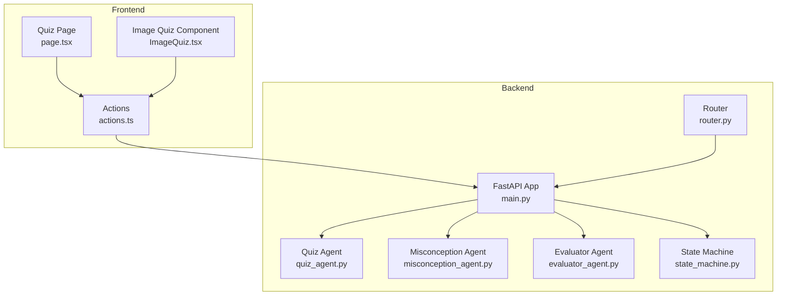
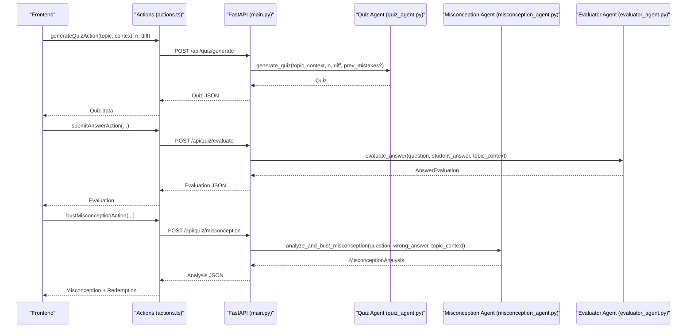
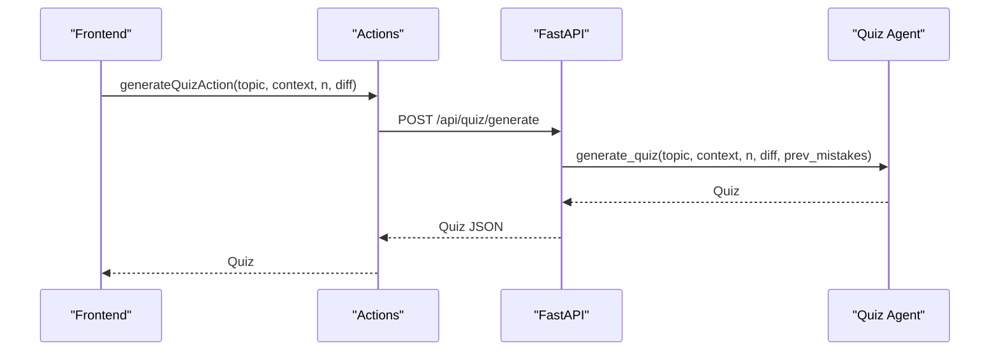
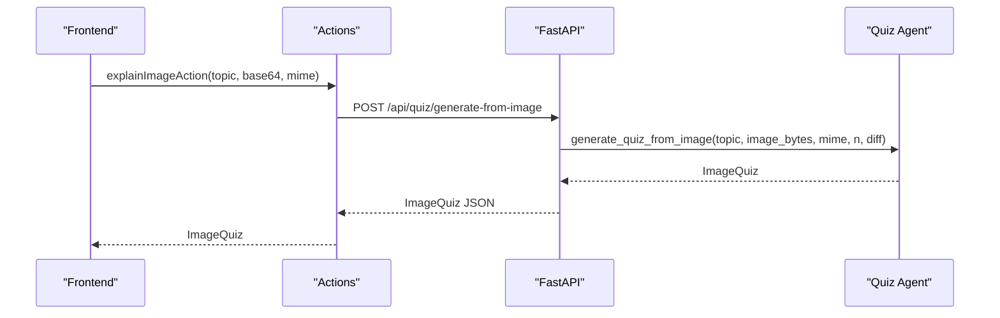
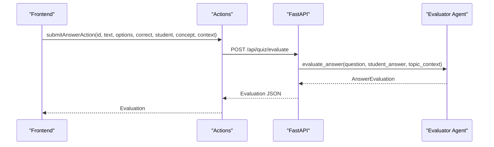
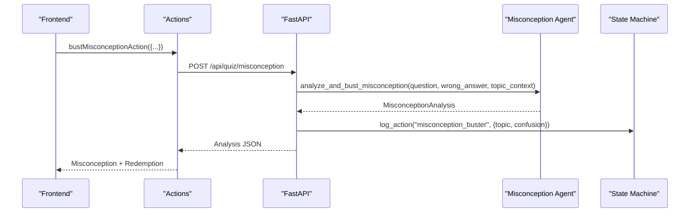
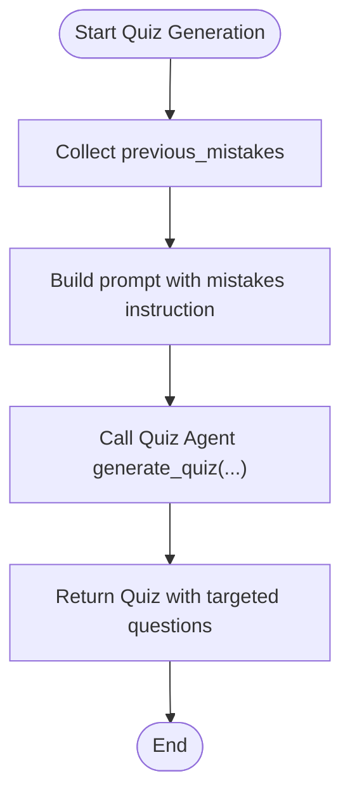
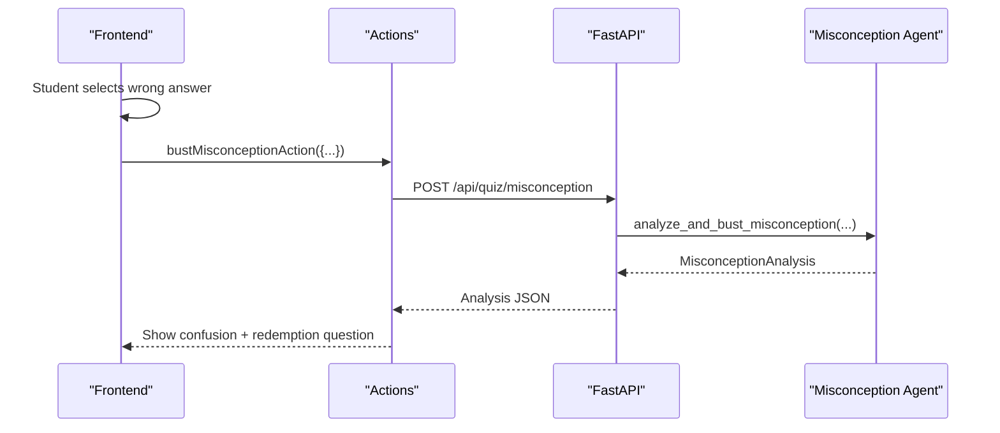
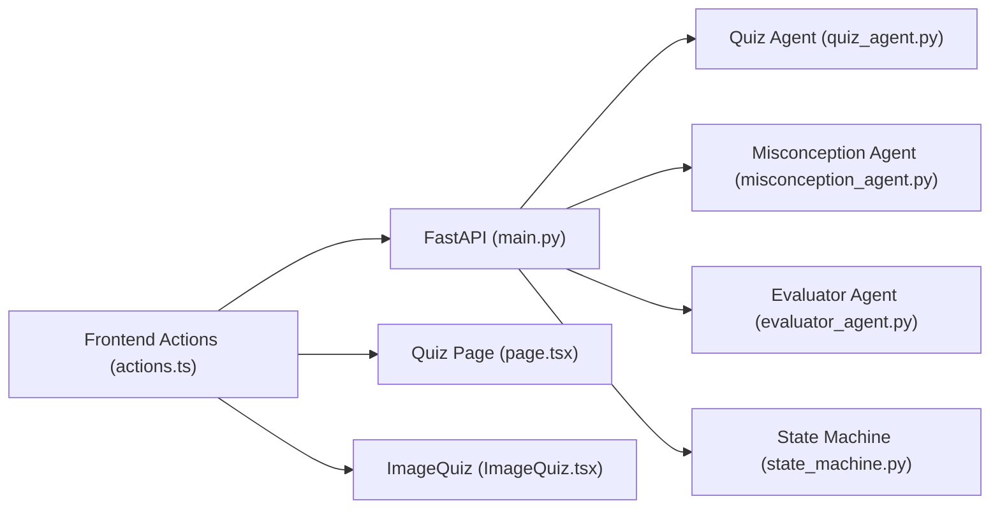

# Quiz and Assessment

<cite>
**Referenced Files in This Document**
- [main.py](file://backend/main.py)
- [router.py](file://backend/router.py)
- [quiz_agent.py](file://backend/agents/quiz_agent.py)
- [misconception_agent.py](file://backend/agents/misconception_agent.py)
- [evaluator_agent.py](file://backend/agents/evaluator_agent.py)
- [state_machine.py](file://backend/agents/state_machine.py)
- [actions.ts](file://frontend/app/actions.ts)
- [page.tsx](file://frontend/app/quiz/[topicId]/page.tsx)
- [ImageQuiz.tsx](file://frontend/components/ImageQuiz.tsx)
</cite>

## Table of Contents
1. [Introduction](#introduction)
2. [Project Structure](#project-structure)
3. [Core Components](#core-components)
4. [Architecture Overview](#architecture-overview)
5. [Detailed Component Analysis](#detailed-component-analysis)
6. [Dependency Analysis](#dependency-analysis)
7. [Performance Considerations](#performance-considerations)
8. [Troubleshooting Guide](#troubleshooting-guide)
9. [Conclusion](#conclusion)
10. [Appendices](#appendices)

## Introduction
This document provides comprehensive API documentation for Quiz and Assessment endpoints in the ExamMentor AI platform. It covers:
- Standard quiz generation via POST /api/quiz/generate
- Multimodal quiz generation from images via POST /api/quiz/generate-from-image
- Answer evaluation via POST /api/quiz/evaluate
- Misconception analysis and remediation via POST /api/quiz/misconception

It specifies request/response schemas, validation rules, and response formats, and explains the adaptive quiz system that personalizes question selection based on previous mistakes. Practical usage examples demonstrate building assessment interfaces, handling evaluation results, and implementing misconception remediation workflows.

## Project Structure
The backend exposes FastAPI endpoints under /api/ and integrates with agents for quiz generation, evaluation, and misconception analysis. The frontend provides interactive quiz experiences and calls these endpoints through server actions.

**Diagram sources**
- [main.py](file://backend/main.py#L24-L843)
- [router.py](file://backend/router.py#L1-L129)
- [quiz_agent.py](file://backend/agents/quiz_agent.py#L1-L283)
- [misconception_agent.py](file://backend/agents/misconception_agent.py#L1-L64)
- [evaluator_agent.py](file://backend/agents/evaluator_agent.py#L1-L198)
- [state_machine.py](file://backend/agents/state_machine.py#L1-L136)
- [actions.ts](file://frontend/app/actions.ts#L1-L512)
- [page.tsx](file://frontend/app/quiz/[topicId]/page.tsx#L1-L649)
- [ImageQuiz.tsx](file://frontend/components/ImageQuiz.tsx#L1-L409)

**Section sources**
- [main.py](file://backend/main.py#L24-L843)
- [router.py](file://backend/router.py#L1-L129)
- [actions.ts](file://frontend/app/actions.ts#L1-L512)

## Core Components
- QuizRequest: Standard quiz generation parameters including topic, context, number of questions, difficulty, and previous mistakes.
- ImageQuizRequest: Multimodal quiz generation parameters including topic, image base64, MIME type, number of questions, and difficulty.
- AnswerRequest: Answer evaluation parameters including question identity, options, correct index, student’s choice, concept tested, and topic context.
- MisconceptionRequest: Misconception analysis parameters including question identity, options, correct index, student’s choice, concept tested, topic context, and optional session/user identifiers.

Validation rules:
- Difficulty must be one of easy, medium, hard.
- Options must be arrays of strings with length 4 for multiple-choice questions.
- Correct and chosen indices must be integers within [0..3].
- num_questions must be a positive integer.
- Base64 image decoding is performed server-side for image-based endpoints.

Response formats:
- POST /api/quiz/generate returns a Quiz object with topic, questions, and time estimate.
- POST /api/quiz/generate-from-image returns an ImageQuiz object with topic, image description, visual elements used, time estimate, and questions containing visual references.
- POST /api/quiz/evaluate returns an AnswerEvaluation object with correctness, feedback, optional misconception, and a hint.
- POST /api/quiz/misconception returns a MisconceptionAnalysis object with inferred confusion, counter-example, explanation, and a redemption question.

**Section sources**
- [main.py](file://backend/main.py#L57-L99)
- [quiz_agent.py](file://backend/agents/quiz_agent.py#L28-L50)
- [quiz_agent.py](file://backend/agents/quiz_agent.py#L116-L136)
- [misconception_agent.py](file://backend/agents/misconception_agent.py#L13-L20)

## Architecture Overview
The quiz and assessment workflow integrates frontend actions with backend endpoints and agents. The adaptive system uses previous mistakes to personalize quiz generation, while misconception analysis provides targeted remediation.

**Diagram sources**
- [actions.ts](file://frontend/app/actions.ts#L243-L432)
- [main.py](file://backend/main.py#L329-L513)
- [quiz_agent.py](file://backend/agents/quiz_agent.py#L53-L111)
- [misconception_agent.py](file://backend/agents/misconception_agent.py#L21-L63)
- [evaluator_agent.py](file://backend/agents/evaluator_agent.py#L59-L115)

## Detailed Component Analysis

### Endpoint: POST /api/quiz/generate
- Purpose: Generate a standard quiz for a given topic and context.
- Request Schema: QuizRequest
  - topic: string
  - context: string
  - num_questions: integer (default 5)
  - difficulty: string (one of easy, medium, hard)
  - previous_mistakes: array of strings (optional)
- Response Schema: Quiz
  - topic: string
  - questions: array of Question
    - id: string
    - text: string
    - question_type: enum (multiple_choice)
    - options: array of 4 strings
    - correct_option_index: integer (0..3)
    - explanation: string
    - difficulty: enum (easy, medium, hard)
    - concept_tested: string
  - time_estimate_minutes: integer
- Validation:
  - difficulty constrained to allowed values.
  - num_questions must be positive.
  - Options must be exactly 4 strings.
  - Indices must be within bounds.
- Adaptive Behavior:
  - previous_mistakes influence question selection to target known misconceptions.

**Diagram sources**
- [actions.ts](file://frontend/app/actions.ts#L243-L267)
- [main.py](file://backend/main.py#L329-L346)
- [quiz_agent.py](file://backend/agents/quiz_agent.py#L53-L111)

**Section sources**
- [main.py](file://backend/main.py#L57-L63)
- [main.py](file://backend/main.py#L329-L346)
- [quiz_agent.py](file://backend/agents/quiz_agent.py#L53-L111)

### Endpoint: POST /api/quiz/generate-from-image
- Purpose: Generate a multimodal quiz grounded in a diagram or image.
- Request Schema: ImageQuizRequest
  - topic: string
  - image_base64: string (base64-encoded image)
  - mime_type: string (default image/jpeg)
  - num_questions: integer (default 5)
  - difficulty: string (one of easy, medium, hard)
- Response Schema: ImageQuiz
  - topic: string
  - image_description: string
  - visual_elements_used: array of strings
  - time_estimate_minutes: integer
  - questions: array of ImageQuizQuestion
    - id: string
    - text: string
    - visual_reference: string (spatial reference to image)
    - question_type: enum (multiple_choice)
    - options: array of 4 strings
    - correct_option_index: integer (0..3)
    - explanation: string
    - difficulty: enum (easy, medium, hard)
    - concept_tested: string
- Validation:
  - Base64 decoding is performed server-side.
  - MIME type must be supported.
  - Options must be exactly 4 strings.
- Behavior:
  - Questions explicitly reference visual regions (e.g., “top-left section”).

**Diagram sources**
- [actions.ts](file://frontend/app/actions.ts#L384-L406)
- [main.py](file://backend/main.py#L356-L401)
- [quiz_agent.py](file://backend/agents/quiz_agent.py#L138-L201)

**Section sources**
- [main.py](file://backend/main.py#L348-L354)
- [main.py](file://backend/main.py#L356-L401)
- [quiz_agent.py](file://backend/agents/quiz_agent.py#L116-L136)
- [quiz_agent.py](file://backend/agents/quiz_agent.py#L138-L201)
- [ImageQuiz.tsx](file://frontend/components/ImageQuiz.tsx#L83-L114)

### Endpoint: POST /api/quiz/evaluate
- Purpose: Evaluate a submitted answer and provide feedback.
- Request Schema: AnswerRequest
  - question_id: string
  - question_text: string
  - options: array of 4 strings
  - correct_option_index: integer (0..3)
  - student_answer_index: integer (0..3)
  - concept_tested: string
  - topic_context: string
- Response Schema: AnswerEvaluation
  - is_correct: boolean
  - feedback: string
  - misconception: string (optional)
  - hint_for_similar: string
- Validation:
  - Indices must be within [0..3].
  - Options must be 4 strings.

**Diagram sources**
- [actions.ts](file://frontend/app/actions.ts#L269-L299)
- [main.py](file://backend/main.py#L403-L429)
- [evaluator_agent.py](file://backend/agents/evaluator_agent.py#L59-L115)

**Section sources**
- [main.py](file://backend/main.py#L65-L73)
- [main.py](file://backend/main.py#L403-L429)
- [evaluator_agent.py](file://backend/agents/evaluator_agent.py#L45-L55)

### Endpoint: POST /api/quiz/misconception
- Purpose: Analyze a wrong answer to infer student confusion and generate a redemption question.
- Request Schema: MisconceptionRequest
  - question_id: string
  - question_text: string
  - options: array of 4 strings
  - correct_option_index: integer (0..3)
  - student_answer_index: integer (0..3)
  - concept_tested: string
  - topic_context: string
  - session_id: string (optional)
  - user_id: string (optional)
- Response Schema: MisconceptionAnalysis
  - wrong_option_chosen: string
  - inferred_confusion: string
  - counter_example: string
  - explanation: string
  - redemption_question: Question (same difficulty)
- Validation:
  - Indices must be within [0..3].
  - Options must be 4 strings.

**Diagram sources**
- [actions.ts](file://frontend/app/actions.ts#L408-L432)
- [main.py](file://backend/main.py#L465-L513)
- [misconception_agent.py](file://backend/agents/misconception_agent.py#L21-L63)
- [state_machine.py](file://backend/agents/state_machine.py#L115-L135)

**Section sources**
- [main.py](file://backend/main.py#L89-L99)
- [main.py](file://backend/main.py#L465-L513)
- [misconception_agent.py](file://backend/agents/misconception_agent.py#L13-L20)
- [state_machine.py](file://backend/agents/state_machine.py#L27-L36)

### Adaptive Quiz System
The adaptive system personalizes quiz generation by incorporating previous mistakes:
- Frontend collects previous mistakes (e.g., from prior quiz sessions).
- generateQuizAction sends previous_mistakes to /api/quiz/generate.
- Backend passes previous_mistakes to the Quiz Agent, which adjusts question selection to target known misconceptions.
- The State Machine persists session context and logs misconception events for future iterations.

**Diagram sources**
- [actions.ts](file://frontend/app/actions.ts#L243-L267)
- [main.py](file://backend/main.py#L329-L346)
- [quiz_agent.py](file://backend/agents/quiz_agent.py#L53-L111)
- [state_machine.py](file://backend/agents/state_machine.py#L80-L114)

**Section sources**
- [main.py](file://backend/main.py#L57-L63)
- [main.py](file://backend/main.py#L329-L346)
- [quiz_agent.py](file://backend/agents/quiz_agent.py#L53-L111)
- [state_machine.py](file://backend/agents/state_machine.py#L27-L36)

### Misconception Detection and Remediation Workflow
- When a student selects a wrong answer, the frontend can trigger misconception analysis.
- The backend evaluates the answer and, if incorrect, infers the underlying confusion and generates a redemption question.
- The frontend displays the misconception explanation and presents a redemption question to confirm understanding.

**Diagram sources**
- [page.tsx](file://frontend/app/quiz/[topicId]/page.tsx#L240-L273)
- [actions.ts](file://frontend/app/actions.ts#L408-L432)
- [main.py](file://backend/main.py#L465-L513)
- [misconception_agent.py](file://backend/agents/misconception_agent.py#L21-L63)

**Section sources**
- [page.tsx](file://frontend/app/quiz/[topicId]/page.tsx#L240-L273)
- [actions.ts](file://frontend/app/actions.ts#L408-L432)
- [main.py](file://backend/main.py#L465-L513)
- [misconception_agent.py](file://backend/agents/misconception_agent.py#L13-L20)

## Dependency Analysis
- FastAPI endpoints depend on agent modules for quiz generation, evaluation, and misconception analysis.
- The State Machine persists session context and logs actions for audit and continuity.
- Frontend actions encapsulate retry logic and caching for robust API consumption.

**Diagram sources**
- [actions.ts](file://frontend/app/actions.ts#L1-L512)
- [main.py](file://backend/main.py#L24-L843)
- [quiz_agent.py](file://backend/agents/quiz_agent.py#L1-L283)
- [misconception_agent.py](file://backend/agents/misconception_agent.py#L1-L64)
- [evaluator_agent.py](file://backend/agents/evaluator_agent.py#L1-L198)
- [state_machine.py](file://backend/agents/state_machine.py#L1-L136)
- [page.tsx](file://frontend/app/quiz/[topicId]/page.tsx#L1-L649)
- [ImageQuiz.tsx](file://frontend/components/ImageQuiz.tsx#L1-L409)

**Section sources**
- [main.py](file://backend/main.py#L24-L843)
- [state_machine.py](file://backend/agents/state_machine.py#L54-L114)
- [actions.ts](file://frontend/app/actions.ts#L17-L70)

## Performance Considerations
- Use num_questions judiciously; larger quizzes increase latency and token usage.
- Prefer moderate difficulty levels for balanced assessment timing.
- For multimodal quizzes, keep images reasonably sized to reduce processing time.
- Implement client-side caching for repeated quiz requests within a session.
- Batch operations where possible (e.g., saving quiz persistence after completion).

## Troubleshooting Guide
- Quiz generation failures:
  - Verify GEMINI_API_KEY and GEMINI_MODEL environment variables.
  - Ensure base64 image decoding succeeds for image-based endpoints.
- Evaluation failures:
  - Confirm indices are within [0..3] and options length is 4.
  - Check topic_context length to avoid truncation.
- Misconception analysis failures:
  - Validate question identity and concept_tested alignment.
  - Ensure session_id/user_id are present if persistence/logging is required.
- Frontend issues:
  - Use fetchWithRetry for transient network errors.
  - Inspect console logs for API responses and errors.

**Section sources**
- [main.py](file://backend/main.py#L329-L513)
- [actions.ts](file://frontend/app/actions.ts#L22-L70)
- [page.tsx](file://frontend/app/quiz/[topicId]/page.tsx#L104-L156)

## Conclusion
The Quiz and Assessment endpoints provide a robust foundation for adaptive, multimodal, and remediation-driven assessments. By leveraging previous mistakes, visual grounding, and structured misconceptions, the system delivers personalized learning experiences. The frontend actions and components integrate seamlessly with backend endpoints to support interactive quiz interfaces and remediation workflows.

## Appendices

### API Definitions

- POST /api/quiz/generate
  - Request: QuizRequest
  - Response: Quiz
  - Notes: previous_mistakes targets known misconceptions.

- POST /api/quiz/generate-from-image
  - Request: ImageQuizRequest
  - Response: ImageQuiz
  - Notes: Questions include visual references to image regions.

- POST /api/quiz/evaluate
  - Request: AnswerRequest
  - Response: AnswerEvaluation
  - Notes: Provides feedback and optional misconception.

- POST /api/quiz/misconception
  - Request: MisconceptionRequest
  - Response: MisconceptionAnalysis
  - Notes: Inferred confusion and redemption question.

**Section sources**
- [main.py](file://backend/main.py#L329-L513)
- [quiz_agent.py](file://backend/agents/quiz_agent.py#L28-L50)
- [quiz_agent.py](file://backend/agents/quiz_agent.py#L116-L136)
- [misconception_agent.py](file://backend/agents/misconception_agent.py#L13-L20)

### Practical Usage Examples

- Building a standard quiz interface:
  - Use generateQuizAction with topic, context, num_questions, difficulty.
  - Render questions and options; collect student_answer_index.
  - On submit, call submitAnswerAction and display AnswerEvaluation.

- Handling evaluation results:
  - Present correctness, feedback, and optional misconception.
  - Offer remediation resources or a redemption question.

- Implementing misconception remediation:
  - After a wrong answer, call bustMisconceptionAction.
  - Display inferred_confusion, counter_example, and redemption_question.
  - Optionally persist user_id/session_id for tracking.

- Multimodal quiz creation:
  - Use ImageQuiz component to upload an image.
  - Call explainImageAction to generate ImageQuiz.
  - Display image_description and visual_elements_used alongside questions.

**Section sources**
- [actions.ts](file://frontend/app/actions.ts#L243-L432)
- [page.tsx](file://frontend/app/quiz/[topicId]/page.tsx#L73-L156)
- [ImageQuiz.tsx](file://frontend/components/ImageQuiz.tsx#L83-L114)