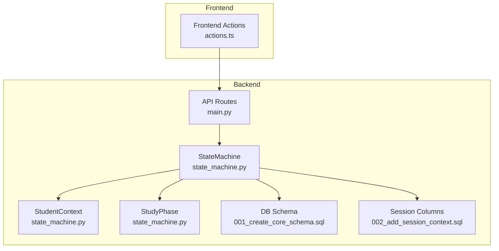
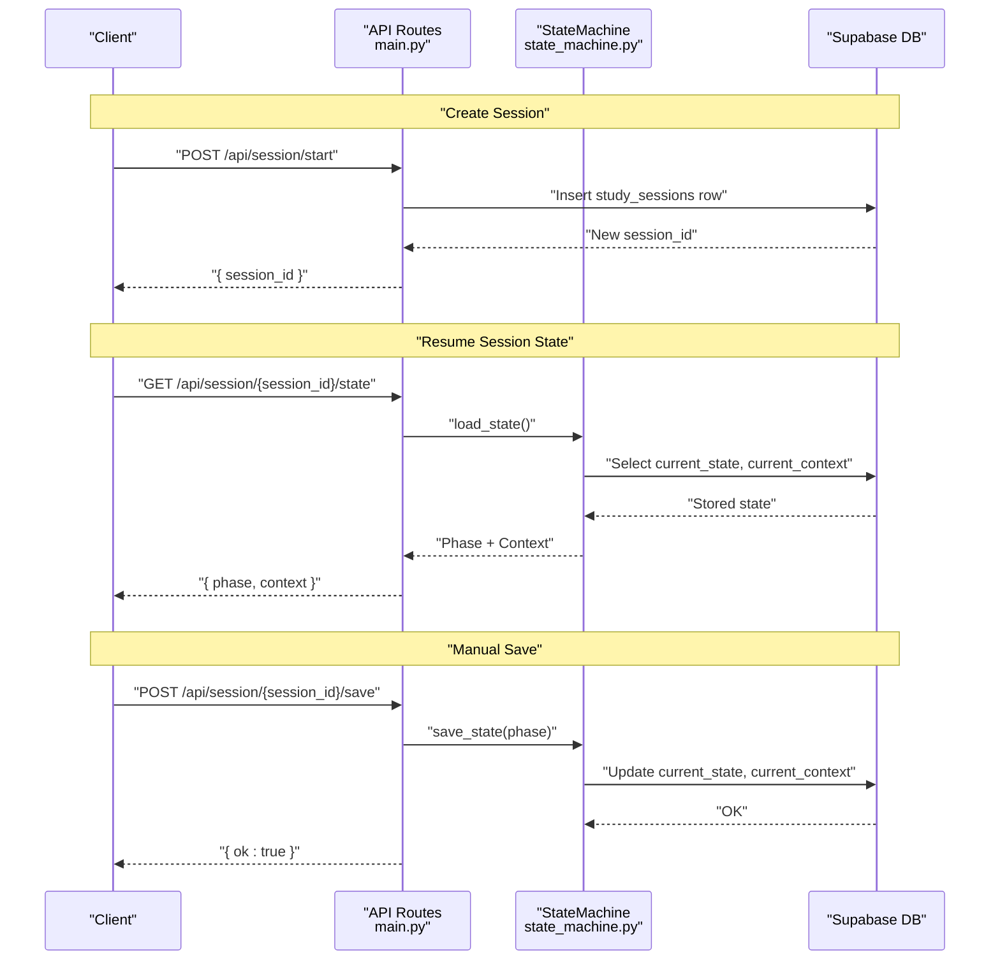
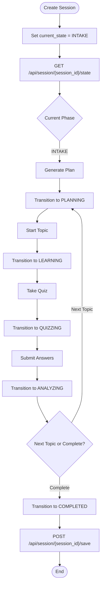
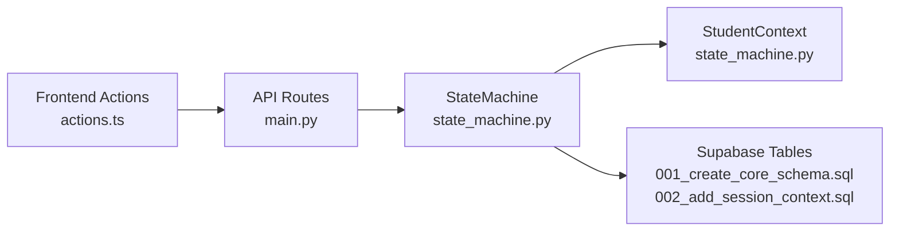

# Session Management

<cite>
**Referenced Files in This Document**
- [main.py](file://backend/main.py)
- [state_machine.py](file://backend/agents/state_machine.py)
- [schemas.py](file://backend/agents/schemas.py)
- [router.py](file://backend/router.py)
- [001_create_core_schema.sql](file://backend/migrations/001_create_core_schema.sql)
- [002_add_session_context.sql](file://backend/migrations/002_add_session_context.sql)
- [004_create_persistence_tables.sql](file://backend/migrations/004_create_persistence_tables.sql)
- [actions.ts](file://frontend/app/actions.ts)
</cite>

## Table of Contents
1. [Introduction](#introduction)
2. [Project Structure](#project-structure)
3. [Core Components](#core-components)
4. [Architecture Overview](#architecture-overview)
5. [Detailed Component Analysis](#detailed-component-analysis)
6. [Dependency Analysis](#dependency-analysis)
7. [Performance Considerations](#performance-considerations)
8. [Troubleshooting Guide](#troubleshooting-guide)
9. [Conclusion](#conclusion)
10. [Appendices](#appendices)

## Introduction
This document provides comprehensive API documentation for Session Management endpoints that enable stateful, persistent study sessions. It covers:
- POST /api/session/start for creating new study sessions
- GET /api/session/{session_id}/state for resuming session state
- POST /api/session/{session_id}/save for manual state persistence

It also documents the underlying StateMachine pattern used for state management, including context serialization, phase transitions, and session lifecycle management. Integration with Supabase for persistent state storage and retrieval is explained, along with session ID generation, state validation, and error handling. Practical usage examples demonstrate building session-aware applications, implementing stateful tutoring workflows, and managing user study sessions across multiple interactions.

## Project Structure
The session management functionality spans backend API routes, a state machine module, and Supabase-backed persistence. Frontend actions integrate with these endpoints to support seamless session continuity.



**Diagram sources**
- [main.py](file://backend/main.py#L516-L571)
- [state_machine.py](file://backend/agents/state_machine.py#L17-L135)
- [001_create_core_schema.sql](file://backend/migrations/001_create_core_schema.sql#L14-L22)
- [002_add_session_context.sql](file://backend/migrations/002_add_session_context.sql#L2-L4)
- [actions.ts](file://frontend/app/actions.ts#L434-L461)

**Section sources**
- [main.py](file://backend/main.py#L516-L571)
- [state_machine.py](file://backend/agents/state_machine.py#L17-L135)
- [001_create_core_schema.sql](file://backend/migrations/001_create_core_schema.sql#L14-L22)
- [002_add_session_context.sql](file://backend/migrations/002_add_session_context.sql#L2-L4)
- [actions.ts](file://frontend/app/actions.ts#L434-L461)

## Core Components
- SessionStartRequest: Request schema for creating a new session with user identification and exam type.
- StudyPhase: Enumeration of valid study workflow phases.
- StudentContext: Serializable context object persisted alongside session state.
- StateMachine: Orchestrates state transitions, loads/saves session state, and logs actions to Supabase.
- Supabase Integration: Persists current_state, current_context, and agent_history for each session.

Key behaviors:
- Session creation initializes current_state to INTAKE.
- State loading hydrates StudentContext and returns the current StudyPhase.
- Manual save updates current_state and current_context in Supabase.
- Action logging appends entries to agent_history.

**Section sources**
- [main.py](file://backend/main.py#L518-L538)
- [state_machine.py](file://backend/agents/state_machine.py#L17-L135)
- [001_create_core_schema.sql](file://backend/migrations/001_create_core_schema.sql#L14-L22)
- [002_add_session_context.sql](file://backend/migrations/002_add_session_context.sql#L2-L4)

## Architecture Overview
The session management architecture couples REST endpoints with a StateMachine that persists state to Supabase. The frontend triggers state persistence and restoration to maintain continuity across interactions.



**Diagram sources**
- [main.py](file://backend/main.py#L523-L571)
- [state_machine.py](file://backend/agents/state_machine.py#L80-L113)
- [001_create_core_schema.sql](file://backend/migrations/001_create_core_schema.sql#L14-L22)
- [002_add_session_context.sql](file://backend/migrations/002_add_session_context.sql#L2-L4)

## Detailed Component Analysis

### Endpoint: POST /api/session/start
Purpose:
- Create a new study session and return a session_id.

Request schema:
- SessionStartRequest
  - user_id: string (required)
  - exam_type: string (enum: NEET, JEE, UPSC, CAT; default: NEET)

Behavior:
- Inserts a new row into study_sessions with current_state set to INTAKE.
- Returns the newly created session_id.

Validation and error handling:
- Raises HTTP 500 on insertion failure or unexpected empty response.

Example usage:
- Client sends POST with user_id and optional exam_type.
- Server responds with session_id for subsequent state operations.

**Section sources**
- [main.py](file://backend/main.py#L518-L538)
- [001_create_core_schema.sql](file://backend/migrations/001_create_core_schema.sql#L14-L22)

### Endpoint: GET /api/session/{session_id}/state
Purpose:
- Resume session state from Supabase.

Path parameter:
- session_id: string (UUID)

Response schema:
- phase: string (one of INTAKE, PLANNING, LEARNING, QUIZZING, ANALYZING, COMPLETED; defaults to INTAKE if not found)
- context: object (StudentContext serialized)

Behavior:
- Constructs StudentContext with session_id and loads persisted state.
- Returns current StudyPhase and context.

Validation and error handling:
- Raises HTTP 500 on internal failures.

Example usage:
- Client calls GET to retrieve phase and context for UI rendering and continuation logic.

**Section sources**
- [main.py](file://backend/main.py#L541-L556)
- [state_machine.py](file://backend/agents/state_machine.py#L96-L113)

### Endpoint: POST /api/session/{session_id}/save
Purpose:
- Manually persist session state.

Path parameter:
- session_id: string (UUID)

Request payload:
- context_data: object (StudentContext fields)
- phase: string (one of INTAKE, PLANNING, LEARNING, QUIZZING, ANALYZING, COMPLETED)

Behavior:
- Reconstructs StudentContext from context_data.
- Saves current_state and current_context to Supabase.

Validation and error handling:
- Raises HTTP 500 on internal failures.

Example usage:
- Client sends updated context and phase to checkpoint progress.

**Section sources**
- [main.py](file://backend/main.py#L559-L571)
- [state_machine.py](file://backend/agents/state_machine.py#L80-L94)

### StateMachine Pattern and State Persistence
StateMachine enforces valid transitions and integrates with Supabase for persistence.

```mermaid
classDiagram
class StudyPhase {
<<enumeration>>
"INTAKE"
"PLANNING"
"LEARNING"
"QUIZZING"
"ANALYZING"
"COMPLETED"
}
class StudentContext {
+string user_id
+string session_id
+string current_topic
+number last_quiz_score
+string[] misconceptions
+string plan_cache_key
+map extra_data
}
class StateMachine {
+transition(current_phase, action) StudyPhase
+get_valid_actions(current_phase) string[]
+save_state(current_phase) void
+load_state() StudyPhase
+log_action(action, metadata) void
}
StateMachine --> StudentContext : "serializes/deserializes"
StateMachine --> StudyPhase : "valid transitions"
```

**Diagram sources**
- [state_machine.py](file://backend/agents/state_machine.py#L17-L135)

State transitions:
- INTAKE → PLANNING (on "generate_plan")
- PLANNING → LEARNING (on "start_topic")
- LEARNING → QUIZZING (on "take_quiz")
- QUIZZING → ANALYZING (on "submit_answers")
- ANALYZING → PLANNING (on "next_topic")
- ANALYZING → COMPLETED (on "complete")

Persistence schema:
- study_sessions table includes:
  - id (UUID)
  - user_id (UUID)
  - exam_type (text)
  - current_state (text)
  - current_context (JSONB)
  - agent_history (JSONB[])
  - created_at, updated_at, metadata

Supabase integration:
- save_state writes current_state and current_context.
- load_state reads current_state and current_context.
- log_action appends entries to agent_history.

**Section sources**
- [state_machine.py](file://backend/agents/state_machine.py#L44-L78)
- [state_machine.py](file://backend/agents/state_machine.py#L80-L135)
- [001_create_core_schema.sql](file://backend/migrations/001_create_core_schema.sql#L14-L22)
- [002_add_session_context.sql](file://backend/migrations/002_add_session_context.sql#L2-L4)

### Session Lifecycle Management
Session lifecycle is driven by StateMachine transitions and persisted to Supabase. The frontend can:
- Create sessions and immediately resume state.
- Periodically save state during tutoring workflows.
- Resume sessions across browser reloads or app restarts.



**Diagram sources**
- [state_machine.py](file://backend/agents/state_machine.py#L44-L52)
- [main.py](file://backend/main.py#L523-L571)

## Dependency Analysis
- API routes depend on StateMachine and StudentContext for state operations.
- StateMachine depends on Supabase client initialized from environment variables.
- Database migrations define the schema and columns used by StateMachine.



**Diagram sources**
- [main.py](file://backend/main.py#L516-L571)
- [state_machine.py](file://backend/agents/state_machine.py#L54-L63)
- [001_create_core_schema.sql](file://backend/migrations/001_create_core_schema.sql#L14-L22)
- [002_add_session_context.sql](file://backend/migrations/002_add_session_context.sql#L2-L4)
- [actions.ts](file://frontend/app/actions.ts#L434-L461)

**Section sources**
- [main.py](file://backend/main.py#L516-L571)
- [state_machine.py](file://backend/agents/state_machine.py#L54-L63)
- [001_create_core_schema.sql](file://backend/migrations/001_create_core_schema.sql#L14-L22)
- [002_add_session_context.sql](file://backend/migrations/002_add_session_context.sql#L2-L4)
- [actions.ts](file://frontend/app/actions.ts#L434-L461)

## Performance Considerations
- Minimize frequent save calls; batch updates when possible.
- Use selective field updates to reduce payload size.
- Leverage Supabase indexing on user_id and session_id for faster queries.
- Consider caching hot contexts in memory for short-lived sessions.

## Troubleshooting Guide
Common issues and resolutions:
- Missing Supabase credentials:
  - Symptom: Warning about missing credentials and persistence disabled.
  - Resolution: Set SUPABASE_URL and SUPABASE_SERVICE_ROLE_KEY or SUPABASE_ANON_KEY.
- HTTP 500 on session creation:
  - Cause: Insertion failure or empty response.
  - Resolution: Verify database connectivity and table permissions.
- HTTP 500 on state load/save:
  - Cause: Supabase client initialization or query failure.
  - Resolution: Check network, credentials, and table existence.
- Invalid phase or missing context:
  - Behavior: Defaults to INTAKE when state is not found.
  - Resolution: Ensure session_id is correct and session was created.

**Section sources**
- [state_machine.py](file://backend/agents/state_machine.py#L56-L63)
- [main.py](file://backend/main.py#L523-L571)

## Conclusion
The Session Management endpoints provide a robust foundation for stateful, persistent study sessions. By combining REST APIs with a StateMachine and Supabase persistence, applications can reliably resume and checkpoint learning workflows. The frontend integration enables seamless user experiences across interactions, while the StateMachine ensures valid transitions and structured state evolution.

## Appendices

### API Definitions

- POST /api/session/start
  - Request: SessionStartRequest
    - user_id: string
    - exam_type: string (default: NEET)
  - Response: { session_id: string }

- GET /api/session/{session_id}/state
  - Path: session_id: string (UUID)
  - Response: { phase: string, context: object }

- POST /api/session/{session_id}/save
  - Path: session_id: string (UUID)
  - Request: { context_data: object, phase: string }
  - Response: { ok: true }

**Section sources**
- [main.py](file://backend/main.py#L518-L571)

### Database Schema Notes
- study_sessions table columns used by session management:
  - id (UUID)
  - user_id (UUID)
  - exam_type (text)
  - current_state (text)
  - current_context (JSONB)
  - agent_history (JSONB[])
  - created_at, updated_at, metadata

**Section sources**
- [001_create_core_schema.sql](file://backend/migrations/001_create_core_schema.sql#L14-L22)
- [002_add_session_context.sql](file://backend/migrations/002_add_session_context.sql#L2-L4)

### Practical Usage Examples

- Creating a session with user identification and exam type:
  - Client calls POST /api/session/start with user_id and exam_type.
  - Server returns session_id.

- Resuming session state:
  - Client calls GET /api/session/{session_id}/state.
  - Server returns phase and context for UI rendering.

- Manual state persistence:
  - Client calls POST /api/session/{session_id}/save with context_data and phase.
  - Server persists state to Supabase.

- Building session-aware applications:
  - Use session_id as the primary key for stateful tutoring workflows.
  - Save state after each major action (e.g., after quiz submission).
  - Resume state on app startup or page reload.

- Managing user study sessions across multiple interactions:
  - Store session_id in local storage or cookies.
  - Periodically sync with Supabase to avoid data loss.
  - Use StateMachine.get_valid_actions to enforce UI affordances.

**Section sources**
- [main.py](file://backend/main.py#L523-L571)
- [state_machine.py](file://backend/agents/state_machine.py#L73-L78)
- [actions.ts](file://frontend/app/actions.ts#L434-L461)