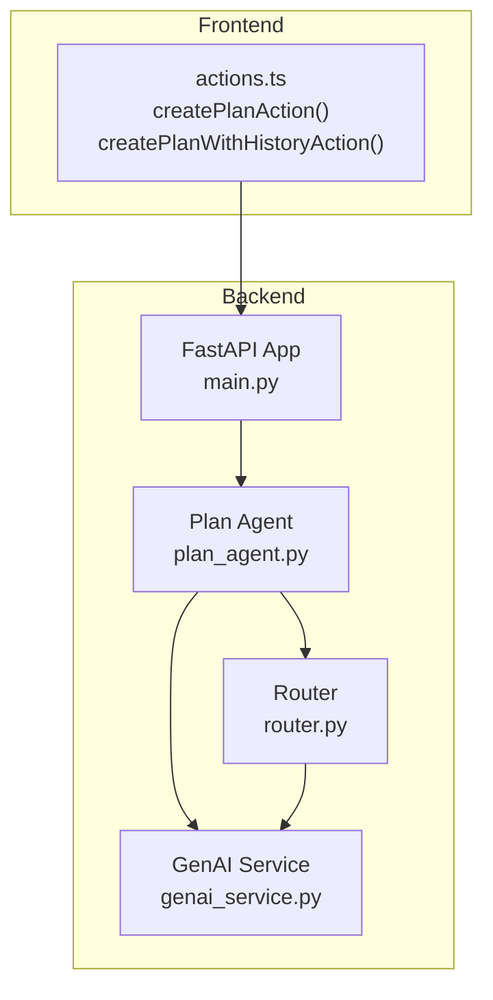
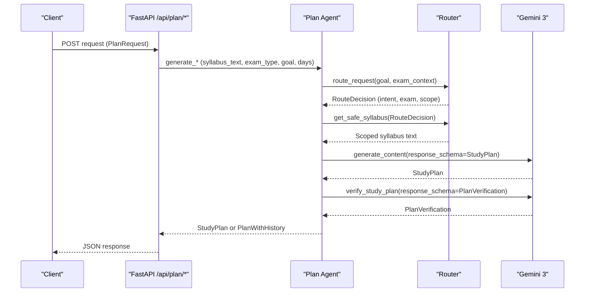
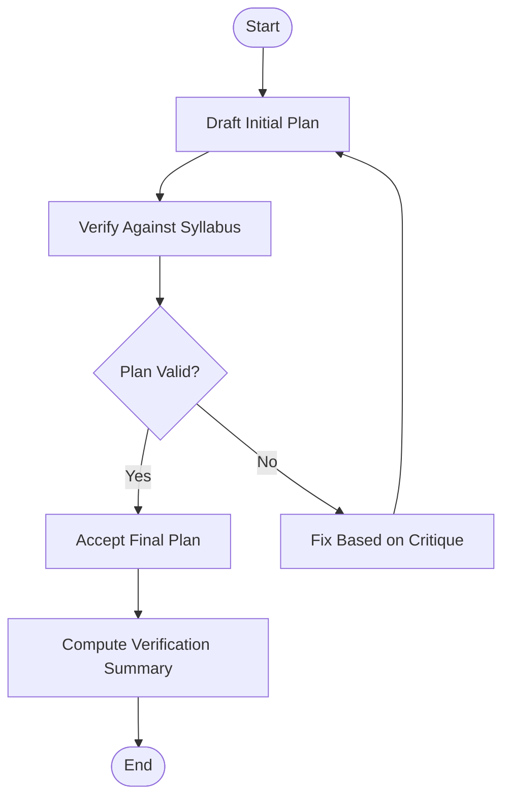
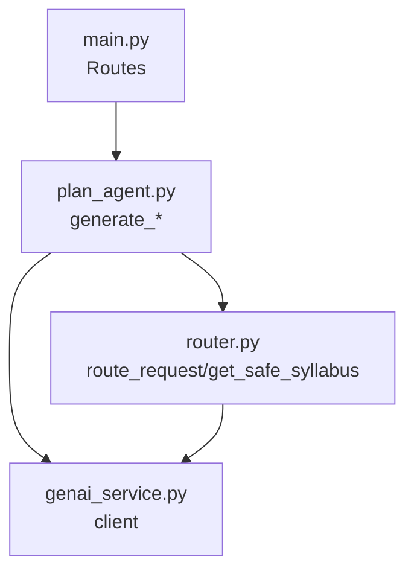

# Study Plan Generation

<cite>
**Referenced Files in This Document**
- [main.py](file://backend/main.py)
- [router.py](file://backend/router.py)
- [plan_agent.py](file://backend/agents/plan_agent.py)
- [schemas.py](file://backend/agents/schemas.py)
- [genai_service.py](file://backend/services/genai_service.py)
- [actions.ts](file://frontend/app/actions.ts)
</cite>

## Table of Contents
1. [Introduction](#introduction)
2. [Project Structure](#project-structure)
3. [Core Components](#core-components)
4. [Architecture Overview](#architecture-overview)
5. [Detailed Component Analysis](#detailed-component-analysis)
6. [Dependency Analysis](#dependency-analysis)
7. [Performance Considerations](#performance-considerations)
8. [Troubleshooting Guide](#troubleshooting-guide)
9. [Conclusion](#conclusion)
10. [Appendices](#appendices)

## Introduction
This document provides comprehensive API documentation for Study Plan Generation endpoints. It covers:
- POST /api/plan/generate for basic plan creation
- POST /api/plan/generate-verified for verified plan generation with self-correction
- POST /api/plan/generate-verified-with-history for full self-correction history with all versions
- POST /api/plan/stream-verified for streaming plan generation process

It specifies request/response schemas using Pydantic models (PlanRequest, StudyPlanResponse), parameter validation rules, error handling patterns, and explains the self-correction algorithm, iteration process, and verification metrics. Practical usage examples demonstrate typical client implementations for plan generation workflows.

## Project Structure
The plan generation feature spans backend FastAPI routes, a plan agent that orchestrates Gemini 3 structured outputs, a router that scopes syllabi by exam type and subject, and a frontend action layer that invokes the endpoints.

**Diagram sources**
- [main.py](file://backend/main.py#L128-L222)
- [router.py](file://backend/router.py#L64-L129)
- [plan_agent.py](file://backend/agents/plan_agent.py#L49-L304)
- [genai_service.py](file://backend/services/genai_service.py#L1-L10)
- [actions.ts](file://frontend/app/actions.ts#L121-L191)

**Section sources**
- [main.py](file://backend/main.py#L128-L222)
- [router.py](file://backend/router.py#L64-L129)
- [plan_agent.py](file://backend/agents/plan_agent.py#L49-L304)
- [genai_service.py](file://backend/services/genai_service.py#L1-L10)
- [actions.ts](file://frontend/app/actions.ts#L121-L191)

## Core Components
- PlanRequest: Request schema for plan generation endpoints.
- StudyPlanResponse: Response schema representing the generated study plan.
- Router: Exam and scope detection to constrain syllabus coverage.
- Plan Agent: Orchestrates plan drafting, verification, self-correction, and streaming.

Validation rules and constraints:
- PlanRequest.days defaults to 7 and is passed to plan generation.
- Router enforces subject/sub-subject scope constraints based on exam type.
- Plan verification checks coverage, feasibility, sequencing, and revision time.

**Section sources**
- [main.py](file://backend/main.py#L42-L47)
- [plan_agent.py](file://backend/agents/plan_agent.py#L30-L45)
- [router.py](file://backend/router.py#L91-L129)

## Architecture Overview
The plan generation pipeline integrates FastAPI routes, the plan agent, and the router. The plan agent uses Gemini 3 structured outputs to produce StudyPlan objects and iteratively verifies them against the syllabus.

**Diagram sources**
- [main.py](file://backend/main.py#L128-L222)
- [plan_agent.py](file://backend/agents/plan_agent.py#L49-L304)
- [router.py](file://backend/router.py#L64-L129)
- [genai_service.py](file://backend/services/genai_service.py#L1-L10)

## Detailed Component Analysis

### Endpoint: POST /api/plan/generate
- Purpose: Generate a study plan without self-correction.
- Request: PlanRequest
- Response: StudyPlanResponse
- Validation: Uses PlanRequest fields; days defaults to 7.
- Error handling: Catches exceptions and raises HTTP 500.

Request schema (PlanRequest):
- syllabus_text: string
- exam_type: string
- goal: string
- days: integer (default 7)

Response schema (StudyPlanResponse):
- exam_name: string
- total_days: integer
- overview: string
- schedule: array of DailyPlan
- critical_topics: array of string

DailyPlan:
- day: integer
- theme: string
- topics: array of Topic
- estimated_hours: number

Topic:
- name: string
- difficulty: string (easy, medium, hard)
- rationale: string

Validation rules:
- days must be a positive integer.
- exam_type must match supported exams (NEET, JEE, UPSC, CAT).
- goal must be a non-empty string.

Error handling:
- HTTP 500 on internal failures.

Example usage:
- Client sends PlanRequest with syllabus_text, exam_type, goal, days.
- Server responds with StudyPlanResponse.

**Section sources**
- [main.py](file://backend/main.py#L128-L143)
- [plan_agent.py](file://backend/agents/plan_agent.py#L49-L88)
- [plan_agent.py](file://backend/agents/plan_agent.py#L17-L45)

### Endpoint: POST /api/plan/generate-verified
- Purpose: Generate a verified study plan using iterative self-correction.
- Request: PlanRequest
- Response: StudyPlanResponse
- Validation: Same as basic endpoint.
- Error handling: Catches exceptions and raises HTTP 500.

Self-correction algorithm:
- Draft initial plan.
- Verify plan against syllabus and constraints.
- If invalid, fix the plan based on critique and iterate up to a configured maximum.
- Return the final validated plan.

Verification metrics:
- Coverage percentage
- Overloaded days count
- Prerequisite issues count
- Whether the plan is valid
- Iterations used

**Section sources**
- [main.py](file://backend/main.py#L145-L159)
- [plan_agent.py](file://backend/agents/plan_agent.py#L146-L161)
- [plan_agent.py](file://backend/agents/plan_agent.py#L163-L304)

### Endpoint: POST /api/plan/generate-verified-with-history
- Purpose: Generate a verified plan with full self-correction history.
- Request: PlanRequest
- Response: Extended JSON containing:
  - final_plan: StudyPlanResponse
  - versions: array of PlanVersion
  - total_iterations: integer
  - self_correction_applied: boolean
  - verification_summary: object with coverage_percent, overloaded_days_count, prerequisite_issues_count, is_valid, iterations_used

PlanVersion:
- version: integer
- plan: StudyPlanResponse
- verification: PlanVerification (nullable)
- was_accepted: boolean

PlanVerification:
- is_valid: boolean
- missing_topics: array of string
- overloaded_days: array of integer
- prerequisite_issues: array of string
- critique: string

Verification summary calculation:
- coverage_percent: 100 - (missing_topics count * 5)
- overloaded_days_count: count of overloaded days
- prerequisite_issues_count: count of prerequisite issues
- is_valid: validity flag
- iterations_used: total versions generated

**Section sources**
- [main.py](file://backend/main.py#L162-L202)
- [plan_agent.py](file://backend/agents/plan_agent.py#L129-L144)
- [plan_agent.py](file://backend/agents/plan_agent.py#L30-L45)
- [plan_agent.py](file://backend/agents/plan_agent.py#L89-L127)

### Endpoint: POST /api/plan/stream-verified
- Purpose: Stream the plan generation process with self-correction events.
- Request: PlanRequest
- Response: application/x-ndjson (newline-delimited JSON)
- Media type: application/x-ndjson
- Events:
  - debug: diagnostic messages
  - status: progress messages
  - draft: emitted after each draft (includes version and plan)
  - verification: emitted after each verification (includes version and verification result)
  - complete: emitted at the end with final_result

Streaming payload structure:
- type: "debug" | "status" | "draft" | "verification" | "complete"
- message: string (for debug/status)
- version: integer (for draft/verification)
- plan: StudyPlanResponse (for draft)
- result: PlanVerification (for verification)
- final_result: PlanWithHistory (for complete)

Client-side consumption:
- Parse each line as JSON.
- Handle events based on type.
- Update UI progressively as chunks arrive.

**Section sources**
- [main.py](file://backend/main.py#L205-L222)
- [plan_agent.py](file://backend/agents/plan_agent.py#L307-L476)

### Parameter Validation Rules
- PlanRequest:
  - syllabus_text: required, string
  - exam_type: required, one of neet, jee, upsc, cat
  - goal: required, string
  - days: optional, integer, default 7
- Router:
  - exam_type influences syllabus scope.
  - scope.subject and scope.sub_subject constrain coverage.
- Plan verification:
  - Checks coverage completeness.
  - Enforces feasible daily hours (< 8 hours).
  - Ensures prerequisite ordering.
  - Includes revision time allocation.

**Section sources**
- [main.py](file://backend/main.py#L42-L47)
- [router.py](file://backend/router.py#L91-L129)
- [plan_agent.py](file://backend/agents/plan_agent.py#L89-L127)

### Error Handling Patterns
- HTTP 500: Raised when plan generation or verification fails.
- HTTP 4xx: Client errors (e.g., PDF extraction) are surfaced with descriptive messages.
- Frontend retry logic: Retries on transient server errors with exponential backoff.

**Section sources**
- [main.py](file://backend/main.py#L141-L142)
- [main.py](file://backend/main.py#L158-L159)
- [main.py](file://backend/main.py#L201-L202)
- [actions.ts](file://frontend/app/actions.ts#L22-L70)

### Self-Correction Algorithm and Iteration Process

**Diagram sources**
- [plan_agent.py](file://backend/agents/plan_agent.py#L231-L287)

**Section sources**
- [plan_agent.py](file://backend/agents/plan_agent.py#L163-L304)

### Request/Response Schemas

#### PlanRequest
- syllabus_text: string
- exam_type: string
- goal: string
- days: integer (default 7)

#### StudyPlanResponse
- exam_name: string
- total_days: integer
- overview: string
- schedule: array of DailyPlan
- critical_topics: array of string

DailyPlan:
- day: integer
- theme: string
- topics: array of Topic
- estimated_hours: number

Topic:
- name: string
- difficulty: string (easy, medium, hard)
- rationale: string

PlanVerification:
- is_valid: boolean
- missing_topics: array of string
- overloaded_days: array of integer
- prerequisite_issues: array of string
- critique: string

PlanWithHistory:
- final_plan: StudyPlanResponse
- versions: array of PlanVersion
- total_iterations: integer
- self_correction_applied: boolean
- verification_summary: object

PlanVersion:
- version: integer
- plan: StudyPlanResponse
- verification: PlanVerification
- was_accepted: boolean

Verification Summary:
- coverage_percent: number
- overloaded_days_count: number
- prerequisite_issues_count: number
- is_valid: boolean
- iterations_used: number

**Section sources**
- [main.py](file://backend/main.py#L42-L47)
- [plan_agent.py](file://backend/agents/plan_agent.py#L30-L45)
- [plan_agent.py](file://backend/agents/plan_agent.py#L38-L45)
- [plan_agent.py](file://backend/agents/plan_agent.py#L129-L144)

### Examples

#### Example 1: Basic Plan Creation
- Endpoint: POST /api/plan/generate
- Request body:
  - syllabus_text: formatted exam syllabus text
  - exam_type: neet
  - goal: "Score 650+ and master organic chemistry"
  - days: 7
- Response: StudyPlanResponse with schedule and critical topics.

**Section sources**
- [main.py](file://backend/main.py#L128-L143)
- [plan_agent.py](file://backend/agents/plan_agent.py#L49-L88)

#### Example 2: Verified Plan Generation
- Endpoint: POST /api/plan/generate-verified
- Request body:
  - syllabus_text: formatted exam syllabus text
  - exam_type: jee
  - goal: "Complete mathematics and physics in 15 days"
  - days: 15
- Response: StudyPlanResponse with verified constraints.

**Section sources**
- [main.py](file://backend/main.py#L145-L159)
- [plan_agent.py](file://backend/agents/plan_agent.py#L146-L161)

#### Example 3: Full Self-Correction History
- Endpoint: POST /api/plan/generate-verified-with-history
- Request body:
  - syllabus_text: formatted exam syllabus text
  - exam_type: upsc
  - goal: "Master history and geography for mains"
  - days: 30
- Response:
  - final_plan: StudyPlanResponse
  - versions: array of PlanVersion
  - total_iterations: integer
  - self_correction_applied: boolean
  - verification_summary: object

**Section sources**
- [main.py](file://backend/main.py#L162-L202)
- [plan_agent.py](file://backend/agents/plan_agent.py#L163-L304)

#### Example 4: Streaming Verified Plan
- Endpoint: POST /api/plan/stream-verified
- Request body:
  - syllabus_text: formatted exam syllabus text
  - exam_type: cat
  - goal: "Improve quant and verbal scores"
  - days: 21
- Response (NDJSON):
  - {"type":"status","message":"Drafting initial plan..."}
  - {"type":"draft","version":1,"plan":{...}}
  - {"type":"verification","version":1,"result":{...}}
  - {"type":"status","message":"Fixing issues found in v1..."}
  - {"type":"draft","version":2,"plan":{...}}
  - {"type":"complete","final_result":{...}}

**Section sources**
- [main.py](file://backend/main.py#L205-L222)
- [plan_agent.py](file://backend/agents/plan_agent.py#L307-L476)

#### Example 5: Frontend Client Implementation
- Verified plan:
  - actions.ts: createPlanAction() posts to /api/plan/generate-verified.
  - Uses getDefaultSyllabus() to supply syllabus_text when not provided.
  - Implements retry logic and caching.
- Plan with history:
  - actions.ts: createPlanWithHistoryAction() posts to /api/plan/generate-verified-with-history.
  - Receives versions and verification_summary for rendering diffs.

**Section sources**
- [actions.ts](file://frontend/app/actions.ts#L121-L154)
- [actions.ts](file://frontend/app/actions.ts#L156-L191)
- [actions.ts](file://frontend/app/actions.ts#L465-L511)

## Dependency Analysis

**Diagram sources**
- [main.py](file://backend/main.py#L128-L222)
- [plan_agent.py](file://backend/agents/plan_agent.py#L49-L304)
- [router.py](file://backend/router.py#L64-L129)
- [genai_service.py](file://backend/services/genai_service.py#L1-L10)

**Section sources**
- [main.py](file://backend/main.py#L128-L222)
- [plan_agent.py](file://backend/agents/plan_agent.py#L49-L304)
- [router.py](file://backend/router.py#L64-L129)
- [genai_service.py](file://backend/services/genai_service.py#L1-L10)

## Performance Considerations
- Gemini 3 structured outputs ensure deterministic JSON and reduce parsing overhead.
- Streaming endpoint reduces perceived latency by delivering incremental updates.
- Router scope guard minimizes irrelevant syllabus processing.
- Frontend caching reduces repeated generation for similar requests.

[No sources needed since this section provides general guidance]

## Troubleshooting Guide
- HTTP 500 errors indicate internal failures in plan generation or verification. Check server logs and Gemini API availability.
- HTTP 4xx errors (e.g., PDF extraction) require client-side handling; implement retries with exponential backoff.
- Streaming clients should handle newline-delimited JSON and gracefully manage connection drops.
- If router clarification is needed, the system logs a message; ensure goal text is explicit about subject scope.

**Section sources**
- [main.py](file://backend/main.py#L141-L142)
- [main.py](file://backend/main.py#L158-L159)
- [main.py](file://backend/main.py#L201-L202)
- [plan_agent.py](file://backend/agents/plan_agent.py#L188-L191)
- [actions.ts](file://frontend/app/actions.ts#L22-L70)

## Conclusion
The Study Plan Generation endpoints provide robust, verifiable, and streamable plan creation workflows. They leverage structured outputs, iterative self-correction, and scoped syllabus routing to deliver high-quality study plans tailored to NEET, JEE, UPSC, and CAT exams. Clients can choose between basic generation, verified generation, full history exposure, and streaming updates to suit their UX needs.

[No sources needed since this section summarizes without analyzing specific files]

## Appendices

### Appendix A: Exam Type Specifications
- Supported values: neet, jee, upsc, cat
- Router maps each exam to a curated syllabus registry.

**Section sources**
- [router.py](file://backend/router.py#L14-L20)
- [router.py](file://backend/router.py#L35-L61)

### Appendix B: Default Syllabi (Frontend)
- getDefaultSyllabus() provides default syllabi for neet, jee, upsc, cat when not supplied by the client.

**Section sources**
- [actions.ts](file://frontend/app/actions.ts#L465-L511)