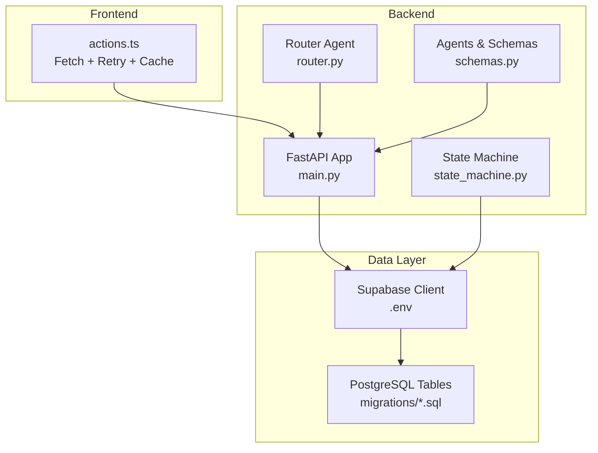
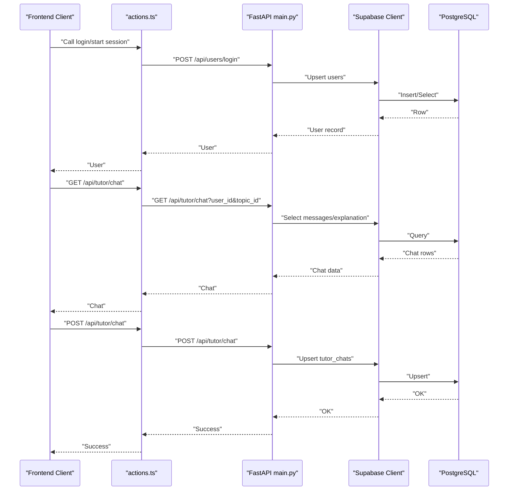
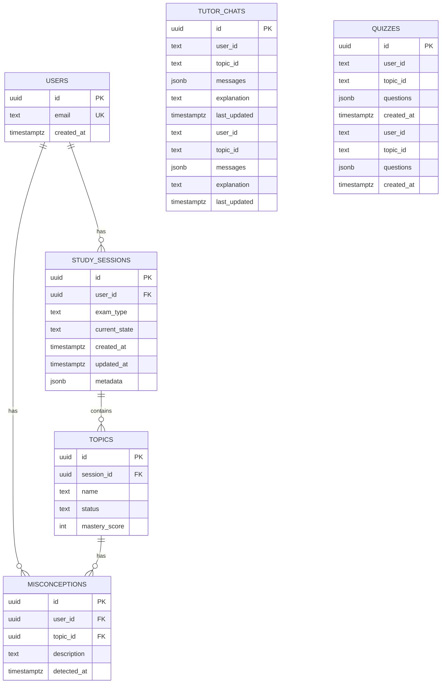
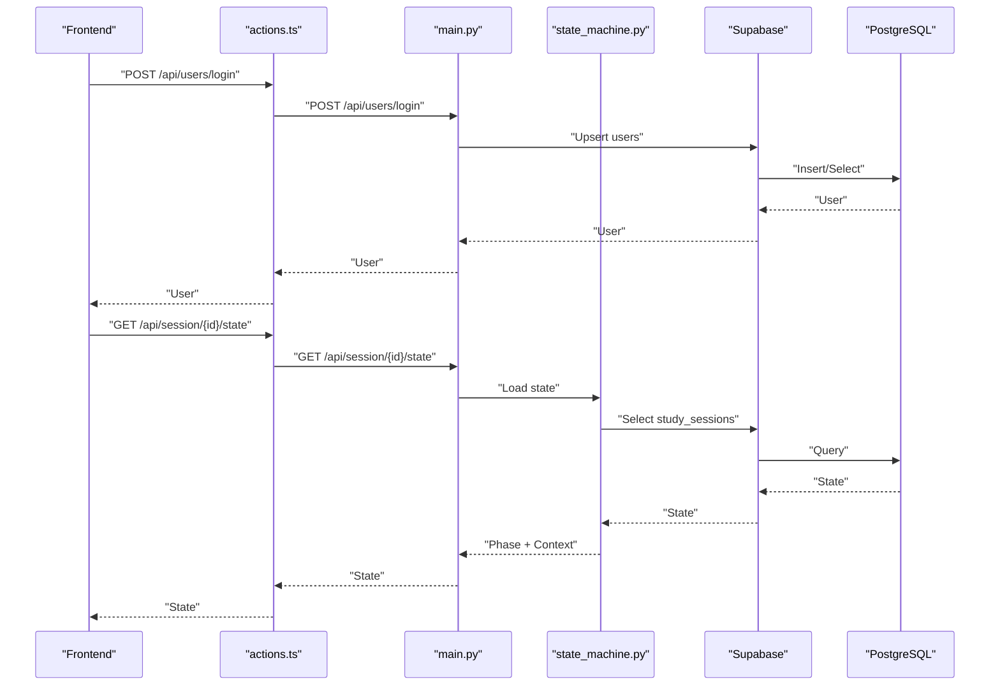
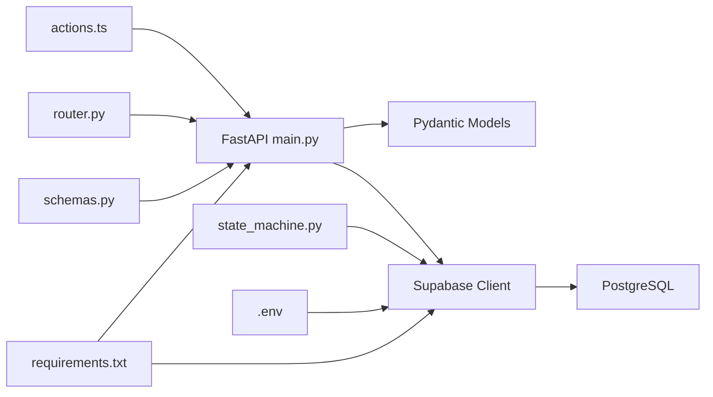

# User and Data Persistence

<cite>
**Referenced Files in This Document**
- [main.py](file://backend/main.py)
- [router.py](file://backend/router.py)
- [state_machine.py](file://backend/agents/state_machine.py)
- [schemas.py](file://backend/agents/schemas.py)
- [001_create_core_schema.sql](file://backend/migrations/001_create_core_schema.sql)
- [004_create_persistence_tables.sql](file://backend/migrations/004_create_persistence_tables.sql)
- [.env](file://backend/.env)
- [actions.ts](file://frontend/app/actions.ts)
- [requirements.txt](file://backend/requirements.txt)
</cite>

## Table of Contents
1. [Introduction](#introduction)
2. [Project Structure](#project-structure)
3. [Core Components](#core-components)
4. [Architecture Overview](#architecture-overview)
5. [Detailed Component Analysis](#detailed-component-analysis)
6. [Dependency Analysis](#dependency-analysis)
7. [Performance Considerations](#performance-considerations)
8. [Troubleshooting Guide](#troubleshooting-guide)
9. [Conclusion](#conclusion)
10. [Appendices](#appendices)

## Introduction
This document provides detailed API documentation for User and Data Persistence endpoints, focusing on:
- POST /api/users/login for user authentication and account management
- GET /api/tutor/chat for retrieving chat history
- POST /api/tutor/chat for saving conversation data

It also documents the integration with Supabase for user management, chat persistence, and data storage, along with the data models for users, tutor chats, study sessions, and misconceptions. The authentication flow, user identification, and data access patterns are explained, with practical usage examples for building user-centric applications, implementing conversation persistence, and managing educational data workflows.

## Project Structure
The backend is a FastAPI application that exposes REST endpoints and integrates with Supabase for persistence. The frontend interacts with the backend via actions and fetch calls. The database schema is defined via migrations, and Supabase configuration is loaded from environment variables.

**Diagram sources**
- [main.py](file://backend/main.py#L1-L843)
- [router.py](file://backend/router.py#L1-L129)
- [state_machine.py](file://backend/agents/state_machine.py#L1-L136)
- [schemas.py](file://backend/agents/schemas.py#L1-L106)
- [001_create_core_schema.sql](file://backend/migrations/001_create_core_schema.sql#L1-L46)
- [004_create_persistence_tables.sql](file://backend/migrations/004_create_persistence_tables.sql#L1-L44)
- [.env](file://backend/.env#L1-L5)

**Section sources**
- [main.py](file://backend/main.py#L1-L843)
- [router.py](file://backend/router.py#L1-L129)
- [state_machine.py](file://backend/agents/state_machine.py#L1-L136)
- [schemas.py](file://backend/agents/schemas.py#L1-L106)
- [001_create_core_schema.sql](file://backend/migrations/001_create_core_schema.sql#L1-L46)
- [004_create_persistence_tables.sql](file://backend/migrations/004_create_persistence_tables.sql#L1-L44)
- [.env](file://backend/.env#L1-L5)

## Core Components
- Supabase client initialization and environment configuration
- User login endpoint for account creation/retrieval
- Chat history retrieval and persistence endpoints
- Study session management and state persistence
- Misconception persistence to the database
- Frontend actions for robust API communication

**Section sources**
- [main.py](file://backend/main.py#L1-L843)
- [state_machine.py](file://backend/agents/state_machine.py#L1-L136)
- [001_create_core_schema.sql](file://backend/migrations/001_create_core_schema.sql#L1-L46)
- [004_create_persistence_tables.sql](file://backend/migrations/004_create_persistence_tables.sql#L1-L44)
- [.env](file://backend/.env#L1-L5)
- [actions.ts](file://frontend/app/actions.ts#L1-L512)

## Architecture Overview
The backend exposes user and persistence endpoints that integrate with Supabase. Requests are validated using Pydantic models, and responses are returned as JSON. The frontend uses actions to communicate with the backend, including retry logic and caching.

**Diagram sources**
- [main.py](file://backend/main.py#L763-L810)
- [004_create_persistence_tables.sql](file://backend/migrations/004_create_persistence_tables.sql#L1-L44)
- [.env](file://backend/.env#L1-L5)
- [actions.ts](file://frontend/app/actions.ts#L1-L512)

## Detailed Component Analysis

### User Authentication Endpoint
- Endpoint: POST /api/users/login
- Purpose: Create or retrieve a user by name
- Request Model: UserLoginRequest
  - name: string
- Response: User object (Supabase users table row)
- Behavior:
  - Checks for existing user by name
  - Creates a new user if not found
  - Returns the user record

Validation rules:
- name is required and non-empty

Data persistence pattern:
- Supabase users table (id, email, created_at)
- Unique constraint on email enforced in schema

Integration notes:
- Uses Supabase client initialized from environment variables
- Returns the first matching user or inserts a new user

Example usage:
- Frontend calls POST /api/users/login with a user’s display name
- Backend returns the user record for subsequent session management

**Section sources**
- [main.py](file://backend/main.py#L763-L777)
- [001_create_core_schema.sql](file://backend/migrations/001_create_core_schema.sql#L7-L12)
- [.env](file://backend/.env#L1-L5)

### Chat History Retrieval Endpoint
- Endpoint: GET /api/tutor/chat
- Purpose: Retrieve chat history for a user and topic
- Query Parameters:
  - user_id: string
  - topic_id: string
- Response:
  - messages: array of message objects
  - explanation: optional text
- Behavior:
  - Queries tutor_chats by user_id and topic_id
  - Returns empty messages array if not found
  - Prints and tolerates errors by returning empty messages

Validation rules:
- user_id and topic_id are required
- Accepts malformed UUIDs gracefully by returning empty results

Data persistence pattern:
- Supabase tutor_chats table (id, user_id, topic_id, messages, explanation, last_updated)
- Unique constraint on (user_id, topic_id)

Example usage:
- Frontend requests chat history for a specific user and topic
- Backend returns serialized messages and optional explanation

**Section sources**
- [main.py](file://backend/main.py#L779-L791)
- [004_create_persistence_tables.sql](file://backend/migrations/004_create_persistence_tables.sql#L3-L12)

### Chat History Persistence Endpoint
- Endpoint: POST /api/tutor/chat
- Purpose: Save or update chat history for a user and topic
- Request Model: ChatHistoryRequest
  - user_id: string
  - topic_id: string
  - messages: array of message objects
  - explanation: optional text
- Response: Status object
- Behavior:
  - Upserts tutor_chats with user_id, topic_id, messages, explanation
  - last_updated defaults to current timestamp

Validation rules:
- user_id and topic_id are required
- messages must be a valid JSON array
- explanation is optional

Data persistence pattern:
- Supabase tutor_chats table with unique constraint on (user_id, topic_id)
- Upsert ensures idempotent updates per user/topic pair

Example usage:
- Frontend sends conversation data after tutoring sessions
- Backend persists messages and optional explanation

**Section sources**
- [main.py](file://backend/main.py#L793-L810)
- [004_create_persistence_tables.sql](file://backend/migrations/004_create_persistence_tables.sql#L3-L12)

### Additional Persistence Endpoints
While not part of the core objective, the backend includes related persistence endpoints for quizzes and session state:

- GET /api/quiz/persistence
  - Retrieves the latest saved quiz for a user and topic
- POST /api/quiz/persistence
  - Saves generated quiz questions for a user and topic
- GET /api/session/{session_id}/state
  - Loads persisted session state
- POST /api/session/{session_id}/save
  - Manually saves session state

These endpoints complement the chat persistence and support broader educational workflows.

**Section sources**
- [main.py](file://backend/main.py#L812-L839)

### Data Models and Relationships
The backend relies on Supabase tables with defined relationships and policies:

- users
  - id (UUID), email (unique), created_at
- study_sessions
  - id (UUID), user_id (FK to users), exam_type, current_state, created_at, updated_at, metadata
- topics
  - id (UUID), session_id (FK to study_sessions), name, status, mastery_score
- misconceptions
  - id (UUID), user_id (FK to users), topic_id (FK to topics), description, detected_at
- tutor_chats
  - id (UUID), user_id, topic_id, messages (JSONB), explanation, last_updated
- quizzes
  - id (UUID), user_id, topic_id, questions (JSONB), created_at

**Diagram sources**
- [001_create_core_schema.sql](file://backend/migrations/001_create_core_schema.sql#L7-L40)
- [004_create_persistence_tables.sql](file://backend/migrations/004_create_persistence_tables.sql#L3-L21)

**Section sources**
- [001_create_core_schema.sql](file://backend/migrations/001_create_core_schema.sql#L1-L46)
- [004_create_persistence_tables.sql](file://backend/migrations/004_create_persistence_tables.sql#L1-L44)

### Authentication Flow and User Identification
- User identification:
  - The login endpoint uses a name-based approach to create or retrieve a user
  - Subsequent endpoints accept user_id and topic_id to scope data
- Session management:
  - Study sessions are created and state is persisted to study_sessions
  - State machine controls valid transitions and logs actions
- Access patterns:
  - Chat persistence uses user_id and topic_id as composite key
  - Misconception persistence optionally links to topics

**Diagram sources**
- [main.py](file://backend/main.py#L763-L777)
- [state_machine.py](file://backend/agents/state_machine.py#L96-L114)
- [actions.ts](file://frontend/app/actions.ts#L303-L319)

**Section sources**
- [main.py](file://backend/main.py#L763-L777)
- [state_machine.py](file://backend/agents/state_machine.py#L1-L136)
- [actions.ts](file://frontend/app/actions.ts#L303-L319)

### Practical Usage Examples

- User login workflow
  - Frontend calls POST /api/users/login with a name
  - Backend returns the user record
  - Store user ID locally for session and persistence operations

- Chat history retrieval by user and topic
  - Frontend calls GET /api/tutor/chat with user_id and topic_id
  - Backend returns messages and optional explanation
  - Render conversation UI with retrieved data

- Conversation data serialization and persistence
  - Frontend collects messages during tutoring
  - Calls POST /api/tutor/chat with user_id, topic_id, messages, and optional explanation
  - Backend upserts chat data scoped to user/topic

- Managing educational data workflows
  - Use study_sessions to track learning progress
  - Persist misconceptions and quizzes for analytics
  - Use session state endpoints to resume workflows

**Section sources**
- [main.py](file://backend/main.py#L763-L810)
- [004_create_persistence_tables.sql](file://backend/migrations/004_create_persistence_tables.sql#L3-L21)
- [actions.ts](file://frontend/app/actions.ts#L1-L512)

## Dependency Analysis
The backend depends on FastAPI, Pydantic, and Supabase. The frontend actions depend on Next.js runtime and the backend API. Migrations define the database schema and policies.

**Diagram sources**
- [main.py](file://backend/main.py#L1-L843)
- [router.py](file://backend/router.py#L1-L129)
- [state_machine.py](file://backend/agents/state_machine.py#L1-L136)
- [schemas.py](file://backend/agents/schemas.py#L1-L106)
- [.env](file://backend/.env#L1-L5)
- [requirements.txt](file://backend/requirements.txt#L1-L32)

**Section sources**
- [main.py](file://backend/main.py#L1-L843)
- [router.py](file://backend/router.py#L1-L129)
- [state_machine.py](file://backend/agents/state_machine.py#L1-L136)
- [schemas.py](file://backend/agents/schemas.py#L1-L106)
- [.env](file://backend/.env#L1-L5)
- [requirements.txt](file://backend/requirements.txt#L1-L32)

## Performance Considerations
- Indexes on frequently queried columns improve lookup performance
- Upsert on tutor_chats avoids duplicate entries and simplifies concurrency
- JSONB fields enable flexible storage for messages and questions
- Consider pagination for large histories and quiz collections
- Use Supabase RLS policies judiciously to balance security and performance

[No sources needed since this section provides general guidance]

## Troubleshooting Guide
- Login failures
  - Verify SUPABASE_URL and SUPABASE_KEY in environment
  - Ensure users table schema matches expectations
- Chat retrieval errors
  - Confirm user_id and topic_id are present and properly formatted
  - Check for database connectivity and RLS policy compliance
- Chat save errors
  - Validate request payload conforms to ChatHistoryRequest
  - Ensure unique constraint on (user_id, topic_id) is respected
- Session state issues
  - Confirm study_sessions row exists before loading state
  - Check Supabase credentials for state machine persistence

**Section sources**
- [main.py](file://backend/main.py#L763-L810)
- [state_machine.py](file://backend/agents/state_machine.py#L96-L114)
- [004_create_persistence_tables.sql](file://backend/migrations/004_create_persistence_tables.sql#L28-L44)
- [.env](file://backend/.env#L1-L5)

## Conclusion
The backend provides robust user authentication and data persistence capabilities for educational workflows. Supabase integration enables seamless chat history management, session state persistence, and misconception tracking. The documented endpoints, models, and patterns support building scalable user-centric applications with reliable conversation persistence and data access.

[No sources needed since this section summarizes without analyzing specific files]

## Appendices

### API Definitions

- POST /api/users/login
  - Request: UserLoginRequest
    - name: string
  - Response: User object
  - Notes: Creates or retrieves a user by name

- GET /api/tutor/chat
  - Query: user_id, topic_id
  - Response: { messages: array, explanation: string|null }
  - Notes: Returns chat history for a user and topic

- POST /api/tutor/chat
  - Request: ChatHistoryRequest
    - user_id: string
    - topic_id: string
    - messages: array
    - explanation: string|null
  - Response: { status: "success" }
  - Notes: Upserts chat history for a user and topic

**Section sources**
- [main.py](file://backend/main.py#L763-L810)

### Parameter Validation Rules
- UserLoginRequest
  - name: required, non-empty string
- ChatHistoryRequest
  - user_id: required
  - topic_id: required
  - messages: required, JSON array
  - explanation: optional
- GET /api/tutor/chat
  - user_id: required
  - topic_id: required

**Section sources**
- [main.py](file://backend/main.py#L101-L110)
- [main.py](file://backend/main.py#L779-L810)

### Data Persistence Patterns
- Upsert on tutor_chats using (user_id, topic_id)
- Insert on quizzes with user_id, topic_id, questions
- Select/Update on study_sessions for state persistence
- Insert on misconceptions with optional topic_id

**Section sources**
- [main.py](file://backend/main.py#L793-L810)
- [main.py](file://backend/main.py#L825-L839)
- [state_machine.py](file://backend/agents/state_machine.py#L80-L114)
- [004_create_persistence_tables.sql](file://backend/migrations/004_create_persistence_tables.sql#L3-L21)