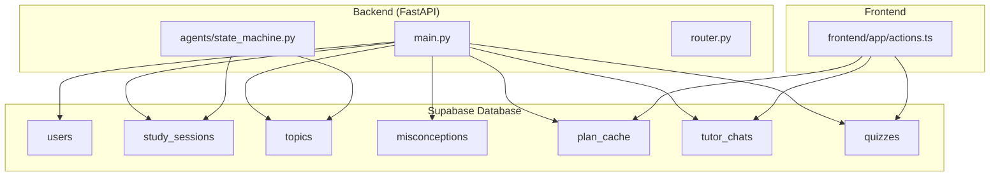
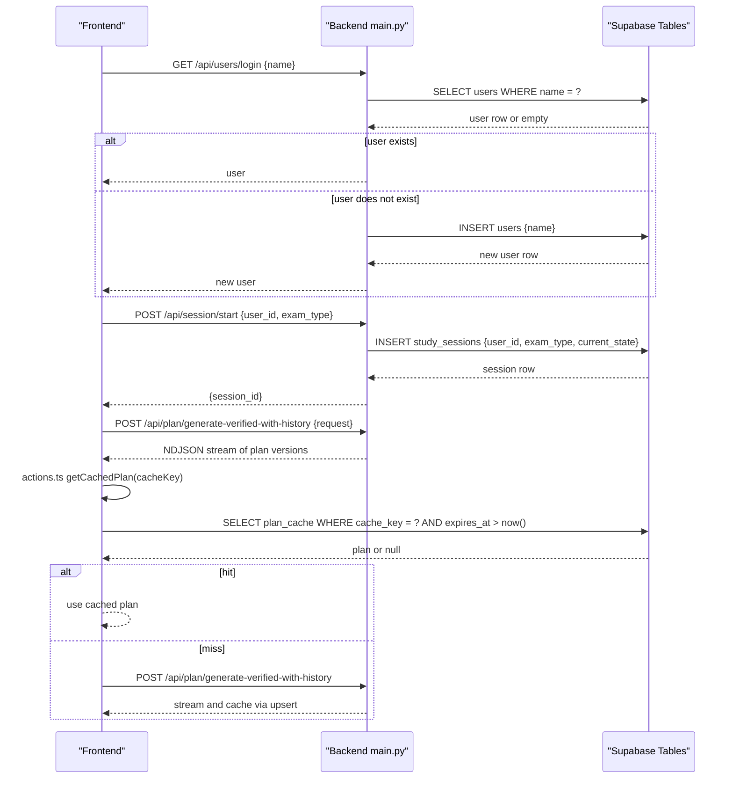
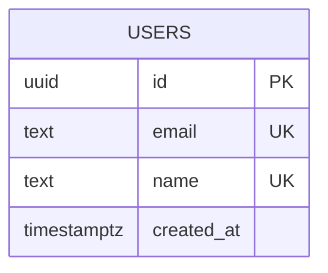
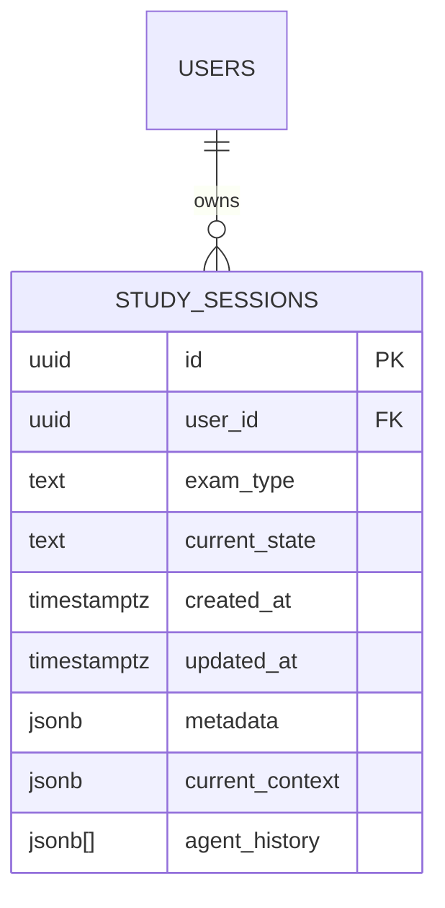
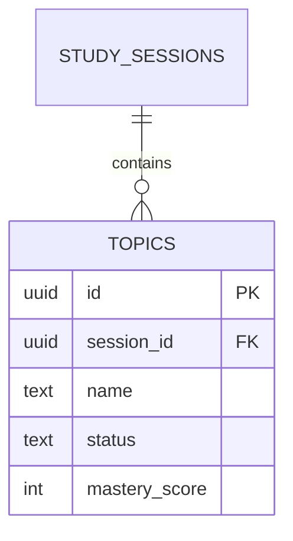
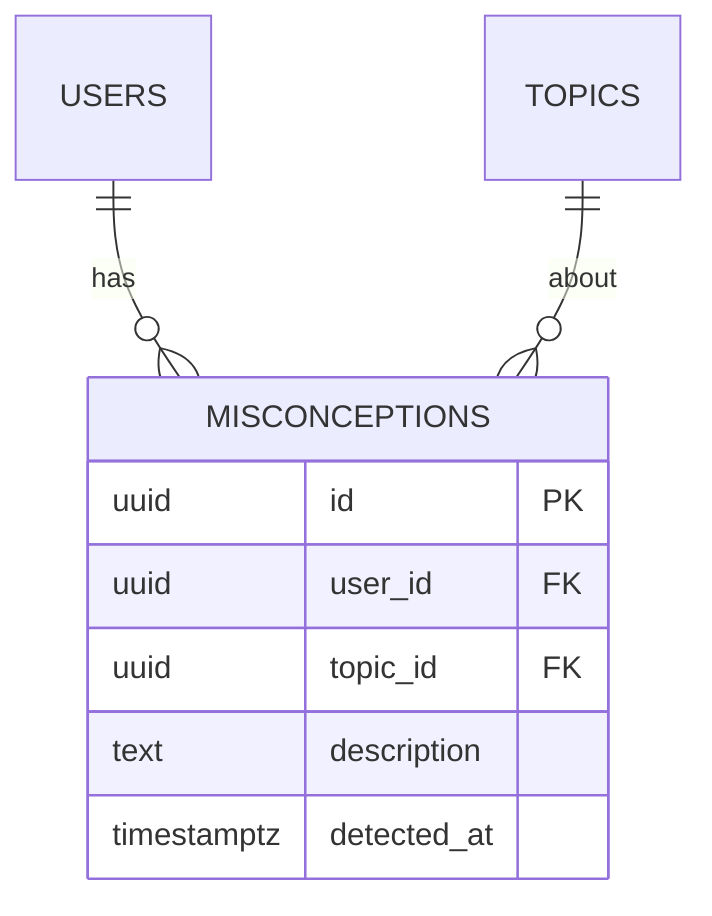
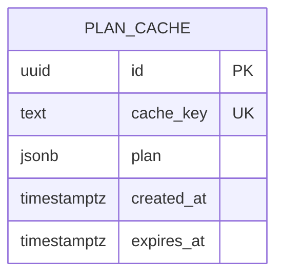
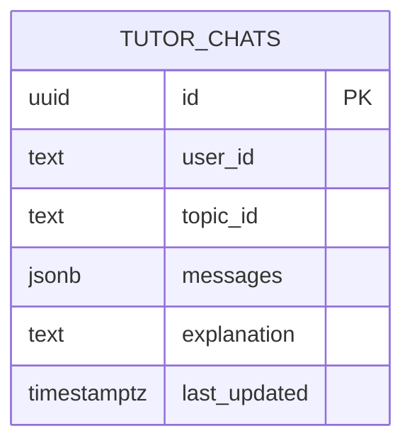
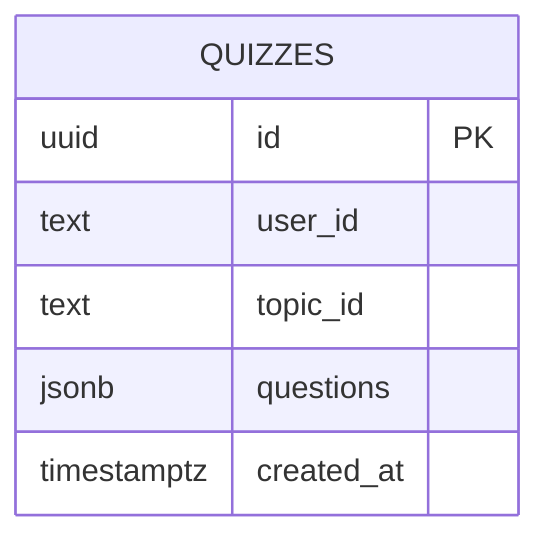
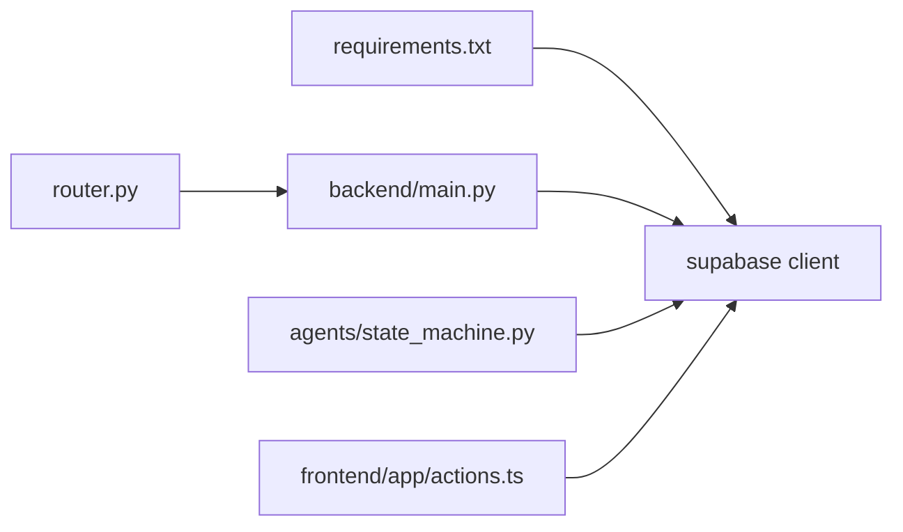

# Core Schema

<cite>
**Referenced Files in This Document**
- [001_create_core_schema.sql](file://backend/migrations/001_create_core_schema.sql)
- [002_add_session_context.sql](file://backend/migrations/002_add_session_context.sql)
- [003_fix_users_rls.sql](file://backend/migrations/003_fix_users_rls.sql)
- [004_create_persistence_tables.sql](file://backend/migrations/004_create_persistence_tables.sql)
- [main.py](file://backend/main.py)
- [state_machine.py](file://backend/agents/state_machine.py)
- [router.py](file://backend/router.py)
- [actions.ts](file://frontend/app/actions.ts)
- [requirements.txt](file://backend/requirements.txt)
</cite>

## Table of Contents
1. [Introduction](#introduction)
2. [Project Structure](#project-structure)
3. [Core Components](#core-components)
4. [Architecture Overview](#architecture-overview)
5. [Detailed Component Analysis](#detailed-component-analysis)
6. [Dependency Analysis](#dependency-analysis)
7. [Performance Considerations](#performance-considerations)
8. [Troubleshooting Guide](#troubleshooting-guide)
9. [Conclusion](#conclusion)

## Introduction
This document describes the core database schema powering Exammentor AI’s learning orchestration. It focuses on the fundamental entities: users, study_sessions, topics, and misconceptions. It documents table definitions, primary and foreign keys, data types, constraints, relationships, vector extension usage for semantic search, role-based security (RLS) policies, indexing strategies, validation rules, and practical query patterns. It also explains how the backend integrates with Supabase to persist and retrieve session state and related artifacts.

## Project Structure
The schema is defined and evolved through SQL migration files executed in Supabase. The backend uses Supabase client libraries to interact with these tables and persists session state and cached plans.

**Diagram sources**
- [001_create_core_schema.sql](file://backend/migrations/001_create_core_schema.sql#L1-L46)
- [002_add_session_context.sql](file://backend/migrations/002_add_session_context.sql#L1-L16)
- [003_fix_users_rls.sql](file://backend/migrations/003_fix_users_rls.sql#L1-L41)
- [004_create_persistence_tables.sql](file://backend/migrations/004_create_persistence_tables.sql#L1-L44)
- [main.py](file://backend/main.py#L1-L843)
- [state_machine.py](file://backend/agents/state_machine.py#L1-L136)
- [router.py](file://backend/router.py#L1-L129)
- [actions.ts](file://frontend/app/actions.ts#L1-L98)

**Section sources**
- [001_create_core_schema.sql](file://backend/migrations/001_create_core_schema.sql#L1-L46)
- [002_add_session_context.sql](file://backend/migrations/002_add_session_context.sql#L1-L16)
- [003_fix_users_rls.sql](file://backend/migrations/003_fix_users_rls.sql#L1-L41)
- [004_create_persistence_tables.sql](file://backend/migrations/004_create_persistence_tables.sql#L1-L44)
- [main.py](file://backend/main.py#L1-L843)
- [state_machine.py](file://backend/agents/state_machine.py#L1-L136)
- [router.py](file://backend/router.py#L1-L129)
- [actions.ts](file://frontend/app/actions.ts#L1-L98)

## Core Components
- users: Stores user identity and metadata for login and access control.
- study_sessions: Tracks per-user study sessions, current state, and persisted context/history.
- topics: Represents planned topics linked to a study session.
- misconceptions: Captures learner misconceptions associated with a user and optionally a topic.
- plan_cache: Caches computed study plans keyed by a hash of inputs to reduce latency.
- tutor_chats: Persists chat histories and explanations for a user-topic pair.
- quizzes: Stores generated quizzes for a user-topic pair.

Constraints and relationships:
- users.id is the PK for users and referenced by study_sessions.user_id.
- study_sessions.id is the PK and referenced by topics.session_id.
- topics.id is the PK and referenced by misconceptions.topic_id.
- users.id is also referenced by misconceptions.user_id.
- tutor_chats and quizzes are keyed by user_id and topic_id tuples.

Vector extension:
- The vector extension is enabled for future-proof semantic search capabilities.

RLS policies:
- RLS is enabled on users and related tables with permissive policies suitable for anonymous login and simple access patterns.

Indexes:
- Indexes on user_id, session_id, and topic_id optimize joins and lookups.

JSONB usage:
- study_sessions.metadata and current_context support flexible session data storage.
- plan_cache.plan stores serialized plan data.
- tutor_chats.messages and quizzes.questions store structured JSON.

**Section sources**
- [001_create_core_schema.sql](file://backend/migrations/001_create_core_schema.sql#L1-L46)
- [002_add_session_context.sql](file://backend/migrations/002_add_session_context.sql#L1-L16)
- [003_fix_users_rls.sql](file://backend/migrations/003_fix_users_rls.sql#L1-L41)
- [004_create_persistence_tables.sql](file://backend/migrations/004_create_persistence_tables.sql#L1-L44)

## Architecture Overview
The backend interacts with Supabase tables to manage the lifecycle of a study session, persist state, and cache plans. The frontend uses Supabase to access cached plans and persisted chats/quizzes.

**Diagram sources**
- [main.py](file://backend/main.py#L763-L777)
- [main.py](file://backend/main.py#L523-L539)
- [main.py](file://backend/main.py#L128-L223)
- [actions.ts](file://frontend/app/actions.ts#L74-L98)
- [002_add_session_context.sql](file://backend/migrations/002_add_session_context.sql#L7-L16)

**Section sources**
- [main.py](file://backend/main.py#L763-L777)
- [main.py](file://backend/main.py#L523-L539)
- [main.py](file://backend/main.py#L128-L223)
- [actions.ts](file://frontend/app/actions.ts#L74-L98)
- [002_add_session_context.sql](file://backend/migrations/002_add_session_context.sql#L1-L16)

## Detailed Component Analysis

### users
- Purpose: User identity and login record.
- Primary key: id (UUID).
- Columns:
  - id: UUID, primary key, default generated.
  - email: text, unique, not null.
  - created_at: timestamp with time zone, default now().
- RLS: Enabled; public select and insert policies are defined for anonymous login scenarios.
- Notes: Migration later adds name column and unique constraint for name-based login.

**Diagram sources**
- [001_create_core_schema.sql](file://backend/migrations/001_create_core_schema.sql#L8-L12)
- [003_fix_users_rls.sql](file://backend/migrations/003_fix_users_rls.sql#L3-L8)

**Section sources**
- [001_create_core_schema.sql](file://backend/migrations/001_create_core_schema.sql#L8-L12)
- [003_fix_users_rls.sql](file://backend/migrations/003_fix_users_rls.sql#L1-L41)

### study_sessions
- Purpose: Per-user study session lifecycle and persisted state.
- Primary key: id (UUID).
- Foreign key: user_id references users(id) with on delete cascade.
- Columns:
  - id: UUID, primary key, default generated.
  - user_id: UUID, not null.
  - exam_type: text, not null.
  - current_state: text, not null default 'INTAKE'.
  - created_at: timestamp with time zone, default now().
  - updated_at: timestamp with time zone, default now().
  - metadata: jsonb.
  - current_context: jsonb, default '{}'.
  - agent_history: jsonb[], default empty array.
- Indexes:
  - idx_study_sessions_user_id on user_id.
- RLS: Enabled; state persistence is performed via backend.

**Diagram sources**
- [001_create_core_schema.sql](file://backend/migrations/001_create_core_schema.sql#L14-L22)
- [002_add_session_context.sql](file://backend/migrations/002_add_session_context.sql#L2-L4)
- [001_create_core_schema.sql](file://backend/migrations/001_create_core_schema.sql#L43-L43)

**Section sources**
- [001_create_core_schema.sql](file://backend/migrations/001_create_core_schema.sql#L14-L22)
- [002_add_session_context.sql](file://backend/migrations/002_add_session_context.sql#L1-L16)
- [state_machine.py](file://backend/agents/state_machine.py#L80-L113)

### topics
- Purpose: Planned topics within a study session.
- Primary key: id (UUID).
- Foreign key: session_id references study_sessions(id) with on delete cascade.
- Columns:
  - id: UUID, primary key, default generated.
  - session_id: UUID, not null.
  - name: text, not null.
  - status: text, default 'pending'.
  - mastery_score: int, default 0.
- Indexes:
  - idx_topics_session_id on session_id.

**Diagram sources**
- [001_create_core_schema.sql](file://backend/migrations/001_create_core_schema.sql#L25-L31)
- [001_create_core_schema.sql](file://backend/migrations/001_create_core_schema.sql#L44-L44)

**Section sources**
- [001_create_core_schema.sql](file://backend/migrations/001_create_core_schema.sql#L25-L31)

### misconceptions
- Purpose: Records learner misconceptions tied to a user and optionally a topic.
- Primary key: id (UUID).
- Foreign keys:
  - user_id references users(id) with on delete cascade.
  - topic_id references topics(id) with on delete cascade.
- Columns:
  - id: UUID, primary key, default generated.
  - user_id: UUID, not null.
  - topic_id: UUID.
  - description: text.
  - detected_at: timestamp with time zone, default now().
- Indexes:
  - idx_misconceptions_user_id on user_id.

**Diagram sources**
- [001_create_core_schema.sql](file://backend/migrations/001_create_core_schema.sql#L34-L40)
- [001_create_core_schema.sql](file://backend/migrations/001_create_core_schema.sql#L45-L45)

**Section sources**
- [001_create_core_schema.sql](file://backend/migrations/001_create_core_schema.sql#L34-L40)

### plan_cache
- Purpose: Caches computed study plans keyed by a stable cache_key to reduce latency.
- Primary key: id (UUID).
- Columns:
  - id: UUID, primary key, default generated.
  - cache_key: text, unique, not null.
  - plan: jsonb, not null.
  - created_at: timestamp with time zone, default now().
  - expires_at: timestamp with time zone, default now() + 24h.
- Indexes:
  - idx_plan_cache_key on cache_key.

**Diagram sources**
- [002_add_session_context.sql](file://backend/migrations/002_add_session_context.sql#L7-L13)
- [002_add_session_context.sql](file://backend/migrations/002_add_session_context.sql#L15-L15)

**Section sources**
- [002_add_session_context.sql](file://backend/migrations/002_add_session_context.sql#L1-L16)

### tutor_chats
- Purpose: Persists chat histories and explanations for a user-topic pair.
- Primary key: id (UUID).
- Columns:
  - id: UUID, primary key, default generated.
  - user_id: text, not null.
  - topic_id: text, not null.
  - messages: jsonb, default empty array.
  - explanation: text.
  - last_updated: timestamp with time zone, default now().
  - Unique constraint: (user_id, topic_id).
- Indexes:
  - idx_tutor_chats_user_topic on (user_id, topic_id).

**Diagram sources**
- [004_create_persistence_tables.sql](file://backend/migrations/004_create_persistence_tables.sql#L4-L12)
- [004_create_persistence_tables.sql](file://backend/migrations/004_create_persistence_tables.sql#L24-L24)

**Section sources**
- [004_create_persistence_tables.sql](file://backend/migrations/004_create_persistence_tables.sql#L1-L44)

### quizzes
- Purpose: Stores generated quizzes for a user-topic pair.
- Primary key: id (UUID).
- Columns:
  - id: UUID, primary key, default generated.
  - user_id: text, not null.
  - topic_id: text, not null.
  - questions: jsonb, not null.
  - created_at: timestamp with time zone, default now().
- Indexes:
  - idx_quizzes_user_topic on (user_id, topic_id).
  - idx_quizzes_created_at on created_at DESC.

**Diagram sources**
- [004_create_persistence_tables.sql](file://backend/migrations/004_create_persistence_tables.sql#L15-L21)
- [004_create_persistence_tables.sql](file://backend/migrations/004_create_persistence_tables.sql#L25-L26)

**Section sources**
- [004_create_persistence_tables.sql](file://backend/migrations/004_create_persistence_tables.sql#L1-L44)

## Dependency Analysis
- Backend depends on Supabase client libraries to access tables.
- Frontend uses Supabase client to access plan_cache and persistence tables.
- State machine persists session state to study_sessions and reads it back.
- Router module supplies syllabi and routing decisions used by agents.

**Diagram sources**
- [requirements.txt](file://backend/requirements.txt#L30-L30)
- [main.py](file://backend/main.py#L15-L21)
- [state_machine.py](file://backend/agents/state_machine.py#L12-L14)
- [router.py](file://backend/router.py#L4-L4)
- [actions.ts](file://frontend/app/actions.ts#L5-L10)

**Section sources**
- [requirements.txt](file://backend/requirements.txt#L1-L32)
- [main.py](file://backend/main.py#L1-L843)
- [state_machine.py](file://backend/agents/state_machine.py#L1-L136)
- [router.py](file://backend/router.py#L1-L129)
- [actions.ts](file://frontend/app/actions.ts#L1-L98)

## Performance Considerations
- Indexes:
  - study_sessions(user_id): accelerates fetching sessions by user.
  - topics(session_id): accelerates fetching topics by session.
  - misconceptions(user_id): accelerates fetching misconceptions by user.
  - plan_cache(cache_key): accelerates cache lookups.
  - tutor_chats(user_id, topic_id): accelerates chat retrieval by user-topic.
  - quizzes(user_id, topic_id): accelerates quiz retrieval by user-topic.
  - quizzes(created_at DESC): supports recent quiz queries.
- JSONB storage:
  - metadata, current_context, agent_history, messages, and questions enable flexible schemas but can increase storage and require careful indexing for filtering.
- Vector extension:
  - Enabled for future semantic search; consider adding vector columns and indexes when migrating to embedding-based queries.

[No sources needed since this section provides general guidance]

## Troubleshooting Guide
- RLS policy conflicts:
  - Ensure RLS is enabled and policies permit the intended access patterns for users, tutor_chats, and quizzes.
- Session state persistence:
  - Verify that study_sessions updates include current_state, current_context, and agent_history.
- Cache misses:
  - Confirm plan_cache entries are inserted/upserted with correct cache_key and expiration.
- JSONB parsing errors:
  - Validate that JSON payloads conform to expected schemas before insertion/update.

**Section sources**
- [003_fix_users_rls.sql](file://backend/migrations/003_fix_users_rls.sql#L1-L41)
- [004_create_persistence_tables.sql](file://backend/migrations/004_create_persistence_tables.sql#L28-L44)
- [state_machine.py](file://backend/agents/state_machine.py#L80-L135)
- [actions.ts](file://frontend/app/actions.ts#L74-L98)

## Conclusion
The core schema organizes user identity, session lifecycle, topic planning, and misconception capture around a few central tables with clear foreign key relationships. Supabase RLS and indexes support secure, performant access patterns. The vector extension is provisioned for future semantic search. The backend and frontend integrate tightly with these tables to deliver a responsive, stateful learning experience.