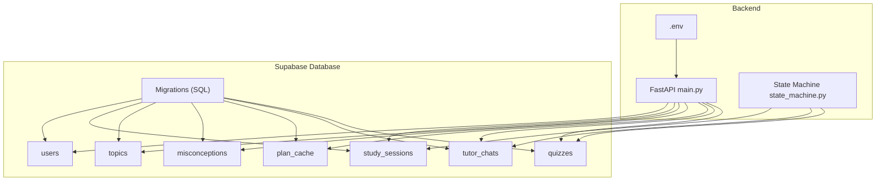
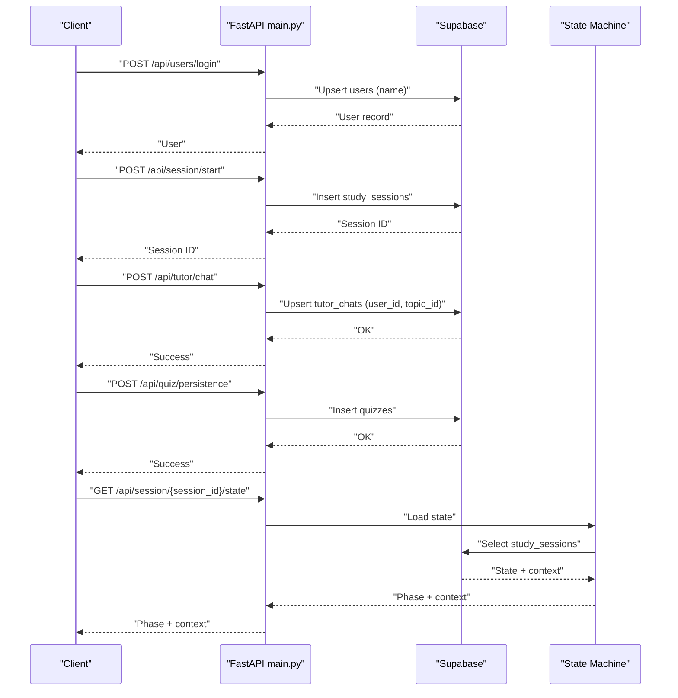
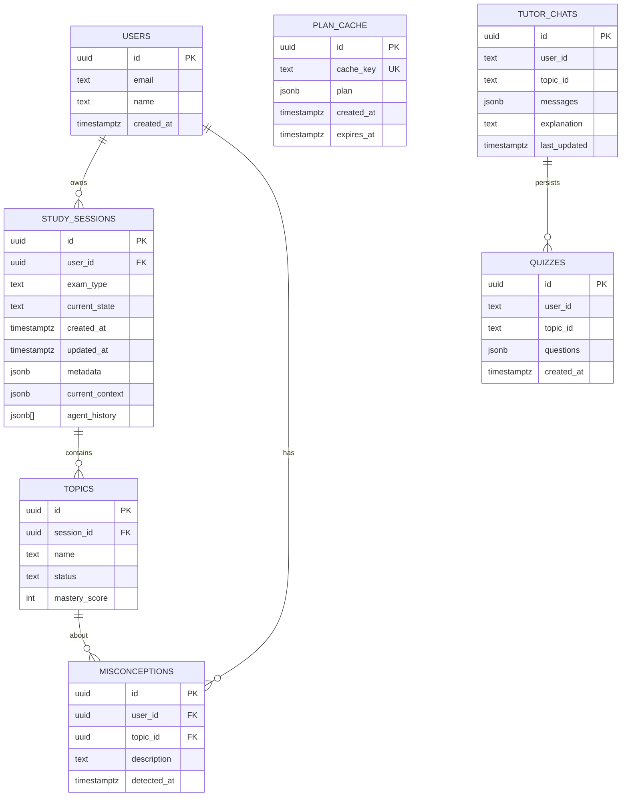
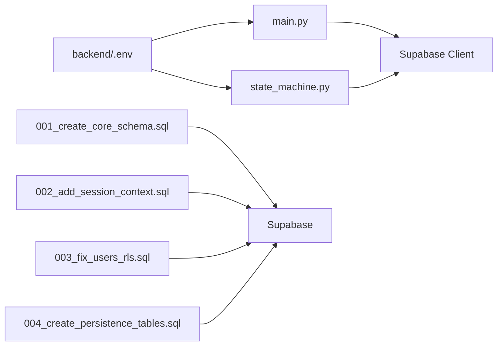

# Database Design

<cite>
**Referenced Files in This Document**
- [001_create_core_schema.sql](file://backend/migrations/001_create_core_schema.sql)
- [002_add_session_context.sql](file://backend/migrations/002_add_session_context.sql)
- [003_fix_users_rls.sql](file://backend/migrations/003_fix_users_rls.sql)
- [004_create_persistence_tables.sql](file://backend/migrations/004_create_persistence_tables.sql)
- [main.py](file://backend/main.py)
- [state_machine.py](file://backend/agents/state_machine.py)
- [.env](file://backend/.env)
</cite>

## Table of Contents
1. [Introduction](#introduction)
2. [Project Structure](#project-structure)
3. [Core Components](#core-components)
4. [Architecture Overview](#architecture-overview)
5. [Detailed Component Analysis](#detailed-component-analysis)
6. [Dependency Analysis](#dependency-analysis)
7. [Performance Considerations](#performance-considerations)
8. [Troubleshooting Guide](#troubleshooting-guide)
9. [Conclusion](#conclusion)
10. [Appendices](#appendices)

## Introduction
This document describes the database design for Exammentor AI, focusing on the entity relationships among users, study sessions, topics, study plans, quiz attempts, misconceptions, and tutor chats. It documents table definitions, primary and foreign keys, indexes, constraints, data validation rules, business logic enforced via constraints, migration history, role-based security (RLS) policies, access control mechanisms, data access patterns, query optimization strategies, indexing considerations, data lifecycle (session management, progress tracking, historical data retention), sample data structures, common query patterns, persistence strategy for AI-generated content and user interactions, data integrity measures, backup considerations, disaster recovery planning, and migration guides for schema changes and data versioning strategies.

## Project Structure
The database schema is defined and evolved through SQL migration files under backend/migrations. The backend API server (FastAPI) persists and retrieves data from Supabase using the Supabase Python client. The state machine persists session state and agent action logs into the study_sessions table. Environment variables configure the database connection.

**Diagram sources**
- [main.py](file://backend/main.py#L1-L120)
- [state_machine.py](file://backend/agents/state_machine.py#L1-L136)
- [.env](file://backend/.env#L1-L5)

**Section sources**
- [main.py](file://backend/main.py#L1-L120)
- [state_machine.py](file://backend/agents/state_machine.py#L1-L136)
- [.env](file://backend/.env#L1-L5)

## Core Components
This section defines the core relational entities and their constraints, including primary keys, foreign keys, indexes, and constraints. It also outlines data validation rules and business logic enforced through database constraints.

- users
  - Purpose: Stores user identities for login and access control.
  - Primary Key: id (UUID)
  - Constraints:
    - email: text, unique, not null (nullable was relaxed in later migration)
    - name: text, unique (added in later migration)
    - created_at: timestamp with time zone, default now()
  - Notes: RLS enabled; public select and insert policies created in migration 003.

- study_sessions
  - Purpose: Tracks user study sessions, current state, and agent history.
  - Primary Key: id (UUID)
  - Foreign Keys: user_id references users(id) with on delete cascade
  - Columns:
    - user_id: UUID (FK)
    - exam_type: text, not null
    - current_state: text, not null, default 'INTAKE'
    - created_at, updated_at: timestamps with time zone, default now()
    - metadata: jsonb
    - current_context: jsonb, default '{}'
    - agent_history: jsonb[], default empty array
  - Business Logic:
    - Cascade deletion of sessions when a user is deleted.
    - State transitions are managed by the state machine and persisted here.
  - Indexes:
    - idx_study_sessions_user_id on user_id

- topics
  - Purpose: Represents topics within a study session and tracks mastery.
  - Primary Key: id (UUID)
  - Foreign Keys: session_id references study_sessions(id) with on delete cascade
  - Columns:
    - session_id: UUID (FK)
    - name: text, not null
    - status: text, default 'pending'
    - mastery_score: int, default 0
  - Business Logic:
    - Cascade deletion when a session is deleted.
  - Indexes:
    - idx_topics_session_id on session_id

- misconceptions
  - Purpose: Captures conceptual errors inferred from quiz performance.
  - Primary Key: id (UUID)
  - Foreign Keys:
    - user_id references users(id) with on delete cascade
    - topic_id references topics(id) with on delete cascade
  - Columns:
    - user_id: UUID (FK)
    - topic_id: UUID (FK)
    - description: text
    - detected_at: timestamp with time zone, default now()
  - Business Logic:
    - Cascade deletion when user or topic is deleted.
  - Indexes:
    - idx_misconceptions_user_id on user_id

- plan_cache
  - Purpose: Caches generated study plans keyed by exam type and syllabus summary hash.
  - Primary Key: id (UUID)
  - Columns:
    - cache_key: text, unique, not null
    - plan: jsonb, not null
    - created_at: timestamp with time zone, default now()
    - expires_at: timestamp with time zone, default now() + 24 hours
  - Business Logic:
    - Unique cache_key ensures one plan per key.
    - Expiration supports TTL-based eviction.
  - Indexes:
    - idx_plan_cache_key on cache_key

- tutor_chats
  - Purpose: Persists chat histories and explanations for tutoring sessions.
  - Primary Key: id (UUID)
  - Columns:
    - user_id: text, not null
    - topic_id: text, not null
    - messages: jsonb, default '[]'
    - explanation: text
    - last_updated: timestamp with time zone, default now()
  - Constraints:
    - Unique constraint on (user_id, topic_id) to enforce one chat per user-topic pair.
  - Business Logic:
    - Upsert on (user_id, topic_id) to merge chat history.
  - Indexes:
    - idx_tutor_chats_user_topic on (user_id, topic_id)

- quizzes
  - Purpose: Stores generated quizzes for a user-topic pair.
  - Primary Key: id (UUID)
  - Columns:
    - user_id: text, not null
    - topic_id: text, not null
    - questions: jsonb, not null
    - created_at: timestamp with time zone, default now()
  - Business Logic:
    - One quiz per user-topic pair is upserted; retrieval orders by most recent.
  - Indexes:
    - idx_quizzes_user_topic on (user_id, topic_id)
    - idx_quizzes_created_at on created_at descending

**Section sources**
- [001_create_core_schema.sql](file://backend/migrations/001_create_core_schema.sql#L1-L46)
- [002_add_session_context.sql](file://backend/migrations/002_add_session_context.sql#L1-L16)
- [003_fix_users_rls.sql](file://backend/migrations/003_fix_users_rls.sql#L1-L41)
- [004_create_persistence_tables.sql](file://backend/migrations/004_create_persistence_tables.sql#L1-L44)

## Architecture Overview
The backend API persists and retrieves data from Supabase. The state machine persists session state and agent action logs into study_sessions. Tutor chats and quizzes are persisted into dedicated tables. RLS policies govern access to sensitive tables.

**Diagram sources**
- [main.py](file://backend/main.py#L763-L838)
- [state_machine.py](file://backend/agents/state_machine.py#L80-L136)

**Section sources**
- [main.py](file://backend/main.py#L763-L838)
- [state_machine.py](file://backend/agents/state_machine.py#L80-L136)

## Detailed Component Analysis

### Entity Relationship Model
The following ER diagram maps the entities and their relationships as defined by foreign keys and constraints.

**Diagram sources**
- [001_create_core_schema.sql](file://backend/migrations/001_create_core_schema.sql#L7-L46)
- [002_add_session_context.sql](file://backend/migrations/002_add_session_context.sql#L1-L16)
- [004_create_persistence_tables.sql](file://backend/migrations/004_create_persistence_tables.sql#L1-L44)

**Section sources**
- [001_create_core_schema.sql](file://backend/migrations/001_create_core_schema.sql#L7-L46)
- [002_add_session_context.sql](file://backend/migrations/002_add_session_context.sql#L1-L16)
- [004_create_persistence_tables.sql](file://backend/migrations/004_create_persistence_tables.sql#L1-L44)

### Data Validation Rules and Business Logic
- Not-null constraints:
  - study_sessions.exam_type, study_sessions.current_state, topics.name, misconceptions.description, tutor_chats.messages, tutor_chats.explanation, quizzes.questions.
- Defaults:
  - timestamps default to current time; study_sessions.current_state default 'INTAKE'; study_sessions.metadata default {}; tutor_chats.messages default []; plan_cache.expires_at default 24 hours after creation.
- Uniqueness:
  - users.email and users.name; plan_cache.cache_key; tutor_chats (user_id, topic_id) composite unique.
- Cascade deletes:
  - Deleting a user cascades to study_sessions; deleting a study_session cascades to topics and misconceptions.
- Composite foreign keys:
  - tutor_chats.user_id and topic_id are used as identifiers for persistence; the schema enforces uniqueness on this pair.

**Section sources**
- [001_create_core_schema.sql](file://backend/migrations/001_create_core_schema.sql#L14-L46)
- [002_add_session_context.sql](file://backend/migrations/002_add_session_context.sql#L1-L16)
- [004_create_persistence_tables.sql](file://backend/migrations/004_create_persistence_tables.sql#L1-L44)

### Role-Based Security (RLS) and Access Control
- RLS is enabled on users, tutor_chats, and quizzes.
- Policies:
  - users: public select and insert allowed.
  - tutor_chats: all operations allowed (public).
  - quizzes: all operations allowed (public).
- Authentication:
  - Supabase keys configured via environment variables; the backend uses the Supabase client to connect to the database.

**Section sources**
- [003_fix_users_rls.sql](file://backend/migrations/003_fix_users_rls.sql#L1-L41)
- [.env](file://backend/.env#L1-L5)

### Data Access Patterns and Query Optimization Strategies
- Upsert patterns:
  - tutor_chats upsert on (user_id, topic_id) to merge chat history.
  - quizzes insert; retrieval ordered by created_at desc to get latest.
- Indexes:
  - idx_study_sessions_user_id, idx_topics_session_id, idx_misconceptions_user_id for FK lookups.
  - idx_plan_cache_key for cache key lookup.
  - idx_tutor_chats_user_topic for chat retrieval.
  - idx_quizzes_user_topic and idx_quizzes_created_at for quiz retrieval.
- Query patterns:
  - Fetch latest quiz for a user-topic pair using order by created_at desc limit 1.
  - Retrieve chat messages and explanation by user_id and topic_id.
  - Load session state and agent history from study_sessions by id.

**Section sources**
- [main.py](file://backend/main.py#L779-L838)
- [001_create_core_schema.sql](file://backend/migrations/001_create_core_schema.sql#L42-L46)
- [002_add_session_context.sql](file://backend/migrations/002_add_session_context.sql#L15-L16)
- [004_create_persistence_tables.sql](file://backend/migrations/004_create_persistence_tables.sql#L23-L26)

### Data Lifecycle: Session Management, Progress Tracking, Historical Data Retention
- Session lifecycle:
  - Start session via API; state and context persisted to study_sessions.
  - State transitions tracked by state machine; agent actions logged to agent_history.
- Progress tracking:
  - topics table stores status and mastery_score per topic.
  - misconceptions captures conceptual errors to guide remediation.
- Historical data retention:
  - plan_cache has TTL via expires_at.
  - No explicit retention policy for other tables; consider implementing soft-deleted rows or archival tables for long-term analytics.

**Section sources**
- [main.py](file://backend/main.py#L516-L571)
- [state_machine.py](file://backend/agents/state_machine.py#L80-L136)
- [002_add_session_context.sql](file://backend/migrations/002_add_session_context.sql#L1-L16)
- [004_create_persistence_tables.sql](file://backend/migrations/004_create_persistence_tables.sql#L1-L44)

### Sample Data Structures and Common Query Patterns
- Sample structures:
  - users: id, email, name, created_at
  - study_sessions: id, user_id, exam_type, current_state, created_at, updated_at, metadata, current_context, agent_history
  - topics: id, session_id, name, status, mastery_score
  - misconceptions: id, user_id, topic_id, description, detected_at
  - plan_cache: id, cache_key, plan, created_at, expires_at
  - tutor_chats: id, user_id, topic_id, messages, explanation, last_updated
  - quizzes: id, user_id, topic_id, questions, created_at
- Common queries:
  - Upsert chat: on conflict (user_id, topic_id) do update.
  - Get latest quiz: select questions where user_id and topic_id, order by created_at desc limit 1.
  - Load session state: select current_state and current_context by session id.

**Section sources**
- [main.py](file://backend/main.py#L779-L838)
- [004_create_persistence_tables.sql](file://backend/migrations/004_create_persistence_tables.sql#L1-L44)

### Persistence Strategy for AI-Generated Content and User Interactions
- AI-generated content:
  - Tutor explanations and quiz questions are persisted to tutor_chats and quizzes respectively.
- User interactions:
  - Misconceptions inferred from quiz performance are inserted into misconceptions.
  - Session state and agent action logs are persisted to study_sessions.

**Section sources**
- [main.py](file://backend/main.py#L431-L514)
- [state_machine.py](file://backend/agents/state_machine.py#L80-L136)

## Dependency Analysis
The backend API depends on Supabase for persistence. The state machine depends on Supabase to load/save session state and agent logs. Migrations define the schema and constraints.

**Diagram sources**
- [main.py](file://backend/main.py#L1-L120)
- [state_machine.py](file://backend/agents/state_machine.py#L1-L136)
- [001_create_core_schema.sql](file://backend/migrations/001_create_core_schema.sql#L1-L46)
- [002_add_session_context.sql](file://backend/migrations/002_add_session_context.sql#L1-L16)
- [003_fix_users_rls.sql](file://backend/migrations/003_fix_users_rls.sql#L1-L41)
- [004_create_persistence_tables.sql](file://backend/migrations/004_create_persistence_tables.sql#L1-L44)
- [.env](file://backend/.env#L1-L5)

**Section sources**
- [main.py](file://backend/main.py#L1-L120)
- [state_machine.py](file://backend/agents/state_machine.py#L1-L136)
- [001_create_core_schema.sql](file://backend/migrations/001_create_core_schema.sql#L1-L46)
- [002_add_session_context.sql](file://backend/migrations/002_add_session_context.sql#L1-L16)
- [003_fix_users_rls.sql](file://backend/migrations/003_fix_users_rls.sql#L1-L41)
- [004_create_persistence_tables.sql](file://backend/migrations/004_create_persistence_tables.sql#L1-L44)
- [.env](file://backend/.env#L1-L5)

## Performance Considerations
- Indexes:
  - Ensure FK lookups on user_id, session_id, topic_id are indexed as implemented.
  - Consider adding covering indexes for frequent queries (e.g., retrieving latest quiz per user-topic).
- Query patterns:
  - Use upsert semantics to avoid duplicate writes.
  - Order by created_at desc with limit for latest quiz retrieval.
- Caching:
  - plan_cache reduces repeated plan generation workloads.
- Concurrency:
  - Upserts on unique composite keys prevent race conditions for chat and quiz persistence.

[No sources needed since this section provides general guidance]

## Troubleshooting Guide
- Connection issues:
  - Verify SUPABASE_URL and SUPABASE_KEY in environment variables.
- RLS access denied:
  - Confirm RLS policies are applied to users, tutor_chats, and quizzes.
- Upsert failures:
  - Ensure unique constraints on (user_id, topic_id) for tutor_chats and quizzes.
- State persistence failures:
  - Check that study_sessions updates succeed and agent_history is appended correctly.

**Section sources**
- [.env](file://backend/.env#L1-L5)
- [003_fix_users_rls.sql](file://backend/migrations/003_fix_users_rls.sql#L1-L41)
- [004_create_persistence_tables.sql](file://backend/migrations/004_create_persistence_tables.sql#L23-L44)
- [state_machine.py](file://backend/agents/state_machine.py#L80-L136)

## Conclusion
The Exammentor AI database schema centers around user study sessions, topics, misconceptions, and persistent AI artifacts (tutor chats and quizzes). Migrations define the schema, constraints, and RLS policies. The backend API and state machine coordinate persistence and session lifecycle. Indexes and upsert patterns optimize common access patterns. For production hardening, consider explicit data retention policies, audit logging, and backup/recovery procedures aligned with Supabase capabilities.

[No sources needed since this section summarizes without analyzing specific files]

## Appendices

### Migration History and Schema Evolution
- 001_create_core_schema.sql
  - Creates users, study_sessions, topics, misconceptions.
  - Adds vector extension and initial indexes.
- 002_add_session_context.sql
  - Adds current_context and agent_history to study_sessions.
  - Introduces plan_cache with TTL and index.
- 003_fix_users_rls.sql
  - Adjusts users table (email nullable, adds name unique), enables RLS.
  - Adds RLS policies for users, tutor_chats, and quizzes.
- 004_create_persistence_tables.sql
  - Creates tutor_chats and quizzes with indexes and RLS policies.

**Section sources**
- [001_create_core_schema.sql](file://backend/migrations/001_create_core_schema.sql#L1-L46)
- [002_add_session_context.sql](file://backend/migrations/002_add_session_context.sql#L1-L16)
- [003_fix_users_rls.sql](file://backend/migrations/003_fix_users_rls.sql#L1-L41)
- [004_create_persistence_tables.sql](file://backend/migrations/004_create_persistence_tables.sql#L1-L44)

### Data Integrity Measures
- Not-null constraints on critical fields.
- Unique constraints on cache_key and user-topic pairs.
- Cascade deletes to maintain referential integrity.
- RLS policies to control access.

**Section sources**
- [001_create_core_schema.sql](file://backend/migrations/001_create_core_schema.sql#L14-L46)
- [002_add_session_context.sql](file://backend/migrations/002_add_session_context.sql#L1-L16)
- [003_fix_users_rls.sql](file://backend/migrations/003_fix_users_rls.sql#L1-L41)
- [004_create_persistence_tables.sql](file://backend/migrations/004_create_persistence_tables.sql#L1-L44)

### Backup and Disaster Recovery
- Use Supabase-managed backups and point-in-time recovery.
- Maintain migration scripts for reproducible schema changes.
- Consider exporting and archiving plan_cache and persistent artifacts periodically.

[No sources needed since this section provides general guidance]

### Migration Guides and Data Versioning
- Apply migrations in order; verify indexes and policies after each step.
- For breaking changes, introduce new columns with defaults, backfill data, then drop old columns if needed.
- Version control migration filenames to track changes.

**Section sources**
- [001_create_core_schema.sql](file://backend/migrations/001_create_core_schema.sql#L1-L46)
- [002_add_session_context.sql](file://backend/migrations/002_add_session_context.sql#L1-L16)
- [003_fix_users_rls.sql](file://backend/migrations/003_fix_users_rls.sql#L1-L41)
- [004_create_persistence_tables.sql](file://backend/migrations/004_create_persistence_tables.sql#L1-L44)