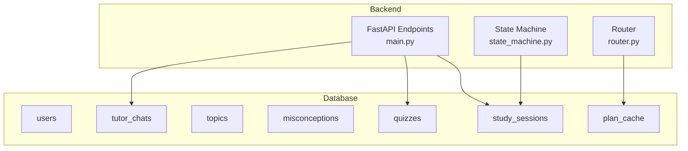
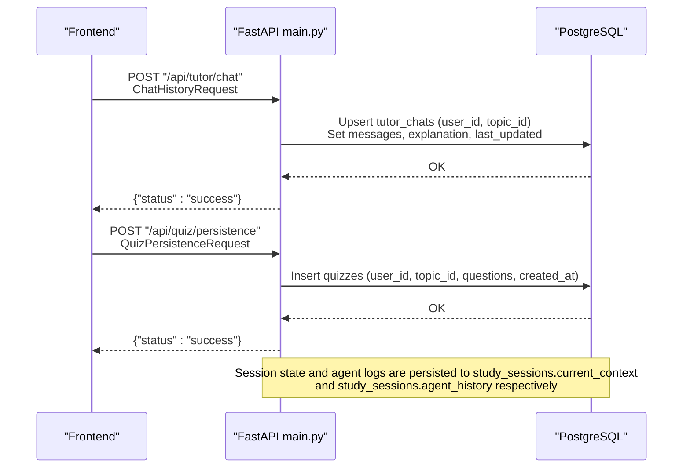
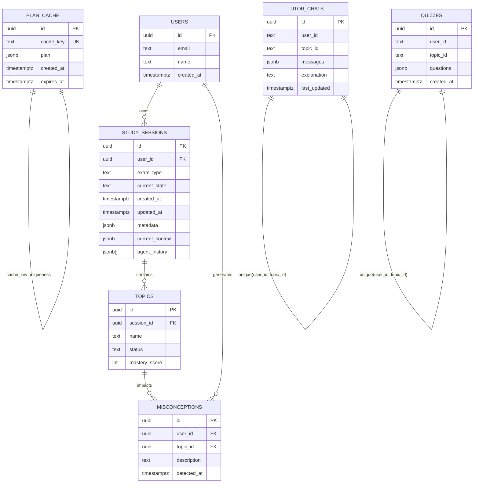
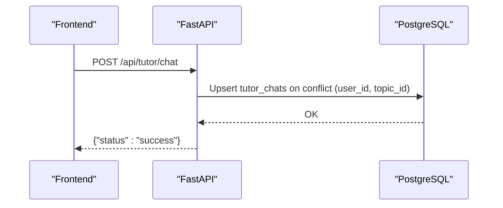
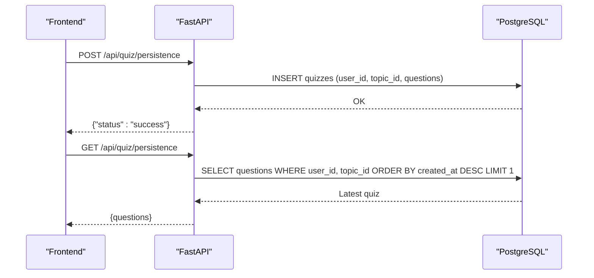
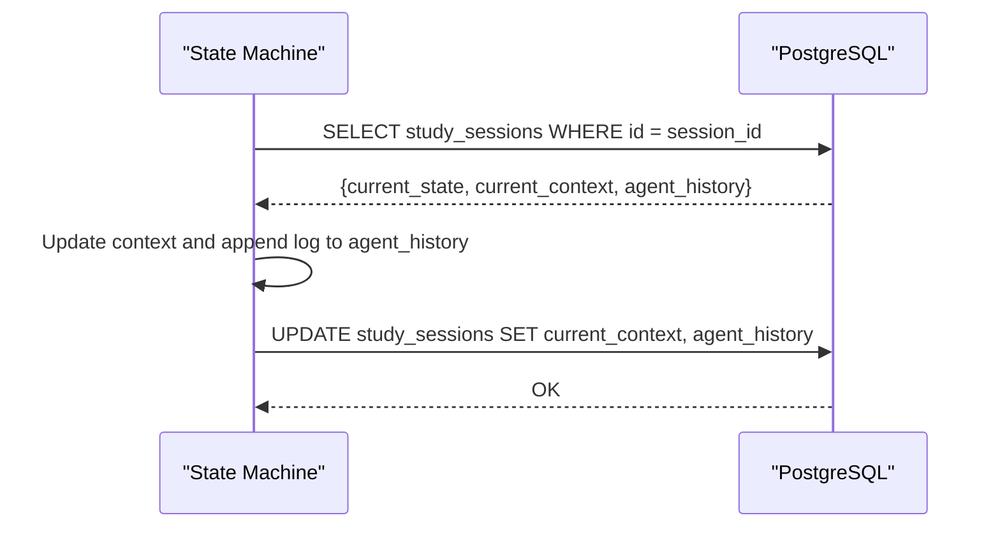
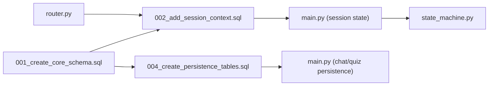

# Persistence Tables

<cite>
**Referenced Files in This Document**
- [001_create_core_schema.sql](file://backend/migrations/001_create_core_schema.sql)
- [002_add_session_context.sql](file://backend/migrations/002_add_session_context.sql)
- [003_fix_users_rls.sql](file://backend/migrations/003_fix_users_rls.sql)
- [004_create_persistence_tables.sql](file://backend/migrations/004_create_persistence_tables.sql)
- [main.py](file://backend/main.py)
- [state_machine.py](file://backend/agents/state_machine.py)
- [router.py](file://backend/router.py)
</cite>

## Table of Contents
1. [Introduction](#introduction)
2. [Project Structure](#project-structure)
3. [Core Components](#core-components)
4. [Architecture Overview](#architecture-overview)
5. [Detailed Component Analysis](#detailed-component-analysis)
6. [Dependency Analysis](#dependency-analysis)
7. [Performance Considerations](#performance-considerations)
8. [Troubleshooting Guide](#troubleshooting-guide)
9. [Conclusion](#conclusion)

## Introduction
This document explains the persistence tables that store AI-generated content and user interaction data in Exammentor AI. It focuses on:
- Long-term storage for tutoring sessions, quiz attempts, study plan versions, and AI-generated explanations
- Data retention strategies, archiving mechanisms, and historical data management
- Schema design choices, especially the use of JSONB for flexible content storage
- Relationships between persistence tables and core schema entities
- Examples of data insertion patterns for AI-generated content and user interactions
- Indexing strategies for efficient querying, including temporal and content-oriented queries
- Data lifecycle management and backup/recovery procedures specific to persistent AI content

## Project Structure
The persistence-related schema is defined across database migrations and is consumed by the backend API and agent state machine:
- Core schema migrations define users, study sessions, topics, and misconceptions
- Session context and plan cache are added to support long-running sessions and caching
- Dedicated persistence tables store tutor chats and quizzes for user-facing AI outputs
- The backend API exposes endpoints to upsert chat histories and insert quiz attempts
- The state machine persists agent action logs into the session’s agent history

**Diagram sources**
- [001_create_core_schema.sql](file://backend/migrations/001_create_core_schema.sql#L8-L40)
- [002_add_session_context.sql](file://backend/migrations/002_add_session_context.sql#L2-L13)
- [004_create_persistence_tables.sql](file://backend/migrations/004_create_persistence_tables.sql#L4-L21)
- [main.py](file://backend/main.py#L763-L839)
- [state_machine.py](file://backend/agents/state_machine.py#L101-L135)
- [router.py](file://backend/router.py#L64-L88)

**Section sources**
- [001_create_core_schema.sql](file://backend/migrations/001_create_core_schema.sql#L1-L46)
- [002_add_session_context.sql](file://backend/migrations/002_add_session_context.sql#L1-L16)
- [004_create_persistence_tables.sql](file://backend/migrations/004_create_persistence_tables.sql#L1-L44)
- [main.py](file://backend/main.py#L763-L839)
- [state_machine.py](file://backend/agents/state_machine.py#L101-L135)
- [router.py](file://backend/router.py#L64-L88)

## Core Components
- tutor_chats: Stores per-user, per-topic chat histories and explanations for tutoring sessions
- quizzes: Stores per-user, per-topic quiz attempts with structured question data
- study_sessions: Core session entity with JSONB fields for current_context and agent_history
- plan_cache: Semantic caching for study plans keyed by a composite cache_key with TTL
- users, topics, misconceptions: Core schema supporting session lifecycle and analytics

Key design characteristics:
- JSONB columns enable flexible, schema-less storage of structured AI outputs (e.g., messages, questions)
- Unique constraints and indexes optimize lookups by user/topic pairs and temporal ordering
- Row Level Security (RLS) policies are applied to persistence tables for controlled access

**Section sources**
- [004_create_persistence_tables.sql](file://backend/migrations/004_create_persistence_tables.sql#L4-L26)
- [002_add_session_context.sql](file://backend/migrations/002_add_session_context.sql#L2-L4)
- [001_create_core_schema.sql](file://backend/migrations/001_create_core_schema.sql#L8-L40)
- [003_fix_users_rls.sql](file://backend/migrations/003_fix_users_rls.sql#L25-L40)

## Architecture Overview
The persistence architecture integrates AI agent outputs with the core schema and backend endpoints:

**Diagram sources**
- [main.py](file://backend/main.py#L793-L839)
- [004_create_persistence_tables.sql](file://backend/migrations/004_create_persistence_tables.sql#L4-L21)
- [002_add_session_context.sql](file://backend/migrations/002_add_session_context.sql#L2-L4)

## Detailed Component Analysis

### tutor_chats
Purpose:
- Persist tutoring chat histories and explanations per user and topic
- Support retrieval and incremental updates for interactive tutoring

Schema highlights:
- Composite primary key via UUID plus unique constraint on (user_id, topic_id)
- JSONB messages field for flexible conversation storage
- Text explanation for the final AI explanation
- last_updated timestamp for recency tracking

Indexes:
- idx_tutor_chats_user_topic: supports fast lookup by user and topic

RLS:
- Enabled and open policy to allow access

Typical operations:
- Upsert on (user_id, topic_id) to merge new messages with existing history
- Retrieve latest messages and explanation for a given user/topic

**Section sources**
- [004_create_persistence_tables.sql](file://backend/migrations/004_create_persistence_tables.sql#L4-L12)
- [004_create_persistence_tables.sql](file://backend/migrations/004_create_persistence_tables.sql#L24-L26)
- [003_fix_users_rls.sql](file://backend/migrations/003_fix_users_rls.sql#L25-L33)
- [main.py](file://backend/main.py#L793-L810)

### quizzes
Purpose:
- Persist generated quiz attempts for later review and analytics
- Store structured questions with options, correct answers, and explanations

Schema highlights:
- JSONB questions field for flexible question sets
- created_at timestamp for temporal ordering
- Unique constraint on (user_id, topic_id) to prevent duplicates

Indexes:
- idx_quizzes_user_topic: fast per-user, per-topic retrieval
- idx_quizzes_created_at: descending order for recent-first queries

RLS:
- Enabled and open policy to allow access

Typical operations:
- Insert new quiz attempt
- Retrieve latest quiz attempt for a user/topic pair

**Section sources**
- [004_create_persistence_tables.sql](file://backend/migrations/004_create_persistence_tables.sql#L15-L21)
- [004_create_persistence_tables.sql](file://backend/migrations/004_create_persistence_tables.sql#L25-L26)
- [003_fix_users_rls.sql](file://backend/migrations/003_fix_users_rls.sql#L35-L40)
- [main.py](file://backend/main.py#L825-L839)

### study_sessions (session state and agent history)
Purpose:
- Maintain long-running tutoring sessions with current context and agent action logs
- Provide durable state for the autopilot and tutoring agents

Schema highlights:
- JSONB current_context: serialized session context for resuming
- JSONB[] agent_history: ordered list of agent actions with timestamps and metadata
- References to users via user_id

Lifecycle integration:
- State machine loads current_state and current_context from study_sessions
- State machine appends agent action logs to agent_history

**Section sources**
- [002_add_session_context.sql](file://backend/migrations/002_add_session_context.sql#L2-L4)
- [state_machine.py](file://backend/agents/state_machine.py#L101-L135)

### plan_cache (semantic caching)
Purpose:
- Cache study plan generations keyed by a composite cache_key with expiration
- Reduce repeated LLM calls for identical inputs

Schema highlights:
- cache_key: unique hash of exam_type and syllabus summary
- plan: JSONB containing the cached plan
- created_at and expires_at timestamps
- TTL enforced by expires_at

Indexes:
- idx_plan_cache_key: fast lookup by cache_key

**Section sources**
- [002_add_session_context.sql](file://backend/migrations/002_add_session_context.sql#L7-L13)
- [router.py](file://backend/router.py#L64-L88)

### Core schema relationships
- users.id → study_sessions.user_id (on delete cascade)
- study_sessions.id → topics.session_id (on delete cascade)
- users.id → misconceptions.user_id (on delete cascade)
- topics.id → misconceptions.topic_id (on delete cascade)

These relationships underpin session-driven analytics and mastery tracking.

**Section sources**
- [001_create_core_schema.sql](file://backend/migrations/001_create_core_schema.sql#L14-L40)

## Architecture Overview

**Diagram sources**
- [001_create_core_schema.sql](file://backend/migrations/001_create_core_schema.sql#L8-L40)
- [002_add_session_context.sql](file://backend/migrations/002_add_session_context.sql#L2-L4)
- [004_create_persistence_tables.sql](file://backend/migrations/004_create_persistence_tables.sql#L4-L21)

## Detailed Component Analysis

### Data Insertion Patterns

#### Upsert chat history (tutor_chats)
- Endpoint: POST /api/tutor/chat
- Behavior: Upsert by unique constraint (user_id, topic_id); merges new messages with existing history; updates last_updated
- Typical payload fields: user_id, topic_id, messages, explanation

**Diagram sources**
- [main.py](file://backend/main.py#L793-L810)
- [004_create_persistence_tables.sql](file://backend/migrations/004_create_persistence_tables.sql#L10-L11)

**Section sources**
- [main.py](file://backend/main.py#L793-L810)

#### Insert quiz attempt (quizzes)
- Endpoint: POST /api/quiz/persistence
- Behavior: Insert new quiz record with user_id, topic_id, questions; created_at auto-populated
- Retrieval: GET /api/quiz/persistence returns latest attempt by created_at DESC

**Diagram sources**
- [main.py](file://backend/main.py#L825-L839)
- [004_create_persistence_tables.sql](file://backend/migrations/004_create_persistence_tables.sql#L19-L20)

**Section sources**
- [main.py](file://backend/main.py#L812-L839)

#### Persist session state and agent logs (study_sessions)
- Loading state: Fetch current_state and current_context by session_id
- Logging actions: Append structured log entries to agent_history array

**Diagram sources**
- [state_machine.py](file://backend/agents/state_machine.py#L101-L135)
- [002_add_session_context.sql](file://backend/migrations/002_add_session_context.sql#L2-L4)

**Section sources**
- [state_machine.py](file://backend/agents/state_machine.py#L101-L135)

### Indexing Strategies
- tutor_chats
  - idx_tutor_chats_user_topic: efficient per-user, per-topic chat retrieval
- quizzes
  - idx_quizzes_user_topic: efficient per-user, per-topic quiz retrieval
  - idx_quizzes_created_at: descending order for recent-first queries
- plan_cache
  - idx_plan_cache_key: fast cache lookup by composite key

These indexes support:
- Temporal queries (recent-first ordering)
- Equality filters by user/topic
- Cache hit optimization

**Section sources**
- [004_create_persistence_tables.sql](file://backend/migrations/004_create_persistence_tables.sql#L24-L26)
- [002_add_session_context.sql](file://backend/migrations/002_add_session_context.sql#L15-L15)

### Data Retention, Archiving, and Historical Management
Retention and lifecycle:
- No explicit retention policies are defined in the migrations. Data persists until manually archived or deleted.
- plan_cache enforces TTL via expires_at; expired rows can be cleaned by a periodic job.

Archival mechanisms:
- Not implemented in the provided code. Recommended approaches:
  - Export older tutor_chats and quizzes to cold storage (e.g., S3) with metadata
  - Move archived records to separate tables or schemas with reduced indexing
  - Use partitioning by created_at for large-scale pruning

Historical data management:
- study_sessions stores agent_history as a JSONB array, enabling audit trails of agent decisions
- plan_cache stores multiple versions keyed by cache_key; consider adding a version field if needed

**Section sources**
- [002_add_session_context.sql](file://backend/migrations/002_add_session_context.sql#L11-L12)
- [state_machine.py](file://backend/agents/state_machine.py#L115-L135)

### Backup and Recovery Procedures
Recommended procedures for persistent AI content:
- Database backups
  - Schedule regular logical backups of PostgreSQL (e.g., using pg_dump) for tutor_chats, quizzes, study_sessions, and plan_cache
  - Include core schema tables (users, study_sessions, topics, misconceptions) for referential integrity
- Point-in-time recovery (PITR)
  - Enable WAL archiving and restore to a specific timestamp to recover from accidental deletions or corruption
- Export/import for compliance
  - Periodically export sensitive data (user_id-scoped) to encrypted archives for compliance or audits
- Cache invalidation
  - After restoring plan_cache, invalidate stale cache entries and re-seed hot keys

[No sources needed since this section provides general guidance]

## Dependency Analysis

**Diagram sources**
- [001_create_core_schema.sql](file://backend/migrations/001_create_core_schema.sql#L1-L46)
- [002_add_session_context.sql](file://backend/migrations/002_add_session_context.sql#L1-L16)
- [004_create_persistence_tables.sql](file://backend/migrations/004_create_persistence_tables.sql#L1-L44)
- [main.py](file://backend/main.py#L763-L839)
- [state_machine.py](file://backend/agents/state_machine.py#L101-L135)
- [router.py](file://backend/router.py#L64-L88)

**Section sources**
- [001_create_core_schema.sql](file://backend/migrations/001_create_core_schema.sql#L1-L46)
- [002_add_session_context.sql](file://backend/migrations/002_add_session_context.sql#L1-L16)
- [004_create_persistence_tables.sql](file://backend/migrations/004_create_persistence_tables.sql#L1-L44)
- [main.py](file://backend/main.py#L763-L839)
- [state_machine.py](file://backend/agents/state_machine.py#L101-L135)
- [router.py](file://backend/router.py#L64-L88)

## Performance Considerations
- JSONB indexing
  - Use GIN or GiST indexes for complex JSONB queries if content search becomes necessary
  - For now, equality and array operations are sufficient; keep indexes minimal to reduce write overhead
- Temporal queries
  - Leverage idx_quizzes_created_at for recent-first sorting without expensive sorts
- Concurrency
  - Upserts on unique(user_id, topic_id) minimize race conditions for chat persistence
- Caching
  - plan_cache reduces LLM load; monitor cache hit rate and tune TTL based on usage patterns

[No sources needed since this section provides general guidance]

## Troubleshooting Guide
Common issues and resolutions:
- Chat retrieval returns empty
  - Verify user_id and topic_id parameters; ensure upsert occurred with correct keys
  - Check RLS policies if access is denied
- Quiz retrieval returns null
  - Confirm the latest attempt exists; remember retrieval orders by created_at DESC
- Session state not loading
  - Ensure study_sessions row exists for the session_id; confirm current_context and agent_history fields are present
- Cache misses
  - Validate cache_key composition; ensure plan_cache TTL is not prematurely expiring entries

**Section sources**
- [main.py](file://backend/main.py#L783-L822)
- [003_fix_users_rls.sql](file://backend/migrations/003_fix_users_rls.sql#L25-L40)
- [state_machine.py](file://backend/agents/state_machine.py#L101-L135)

## Conclusion
The persistence layer in Exammentor AI combines dedicated tables for AI outputs (tutor_chats, quizzes) with session-centric storage (study_sessions) and semantic caching (plan_cache). JSONB enables flexible, schema-less storage of structured AI content while indexes and constraints ensure efficient querying and data integrity. While explicit retention and archival policies are not implemented, the foundation is in place to add lifecycle management and robust backup/recovery procedures tailored to persistent AI content.