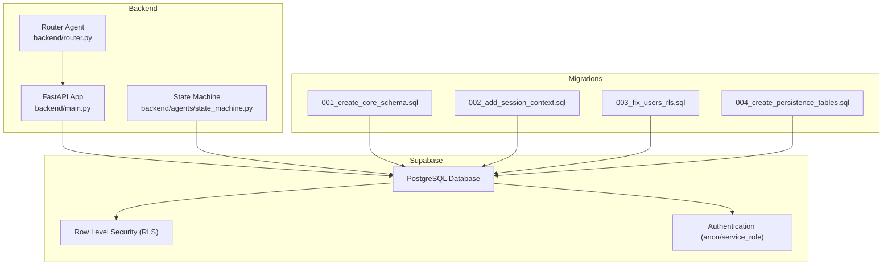
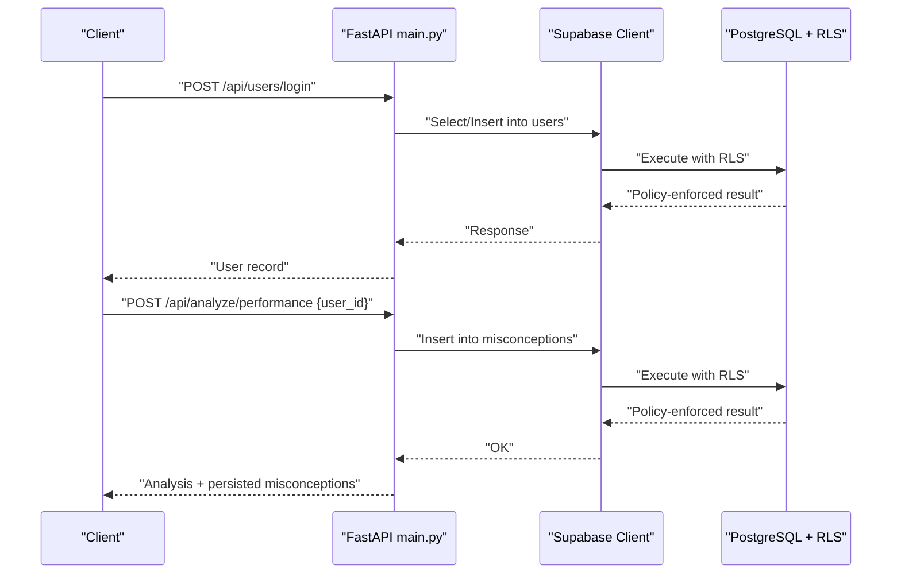
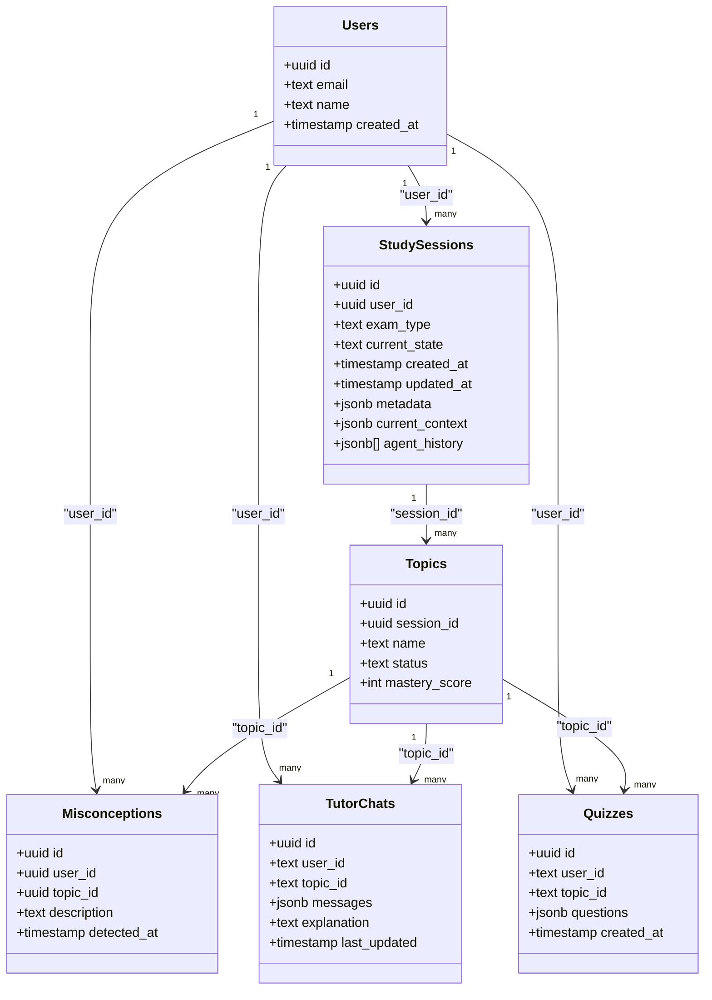
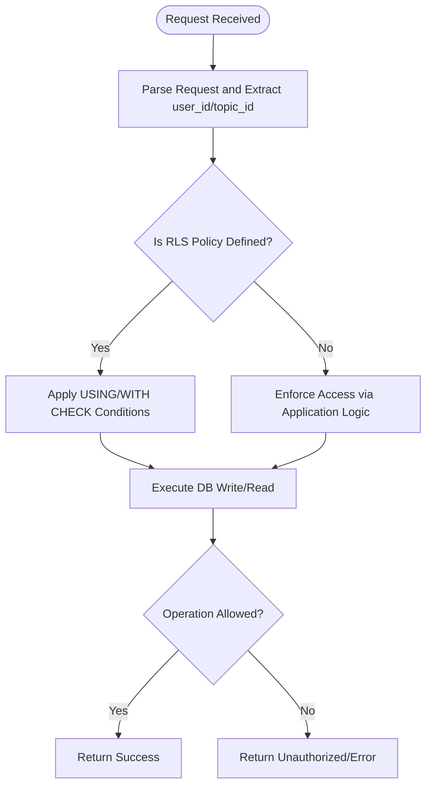
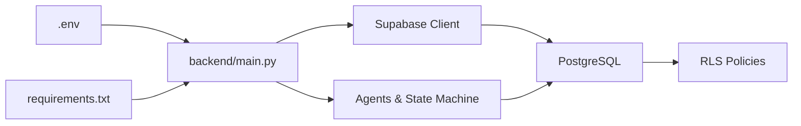

# Role-Based Security Policies

<cite>
**Referenced Files in This Document**
- [main.py](file://backend/main.py)
- [router.py](file://backend/router.py)
- [state_machine.py](file://backend/agents/state_machine.py)
- [001_create_core_schema.sql](file://backend/migrations/001_create_core_schema.sql)
- [002_add_session_context.sql](file://backend/migrations/002_add_session_context.sql)
- [003_fix_users_rls.sql](file://backend/migrations/003_fix_users_rls.sql)
- [004_create_persistence_tables.sql](file://backend/migrations/004_create_persistence_tables.sql)
- [.env](file://backend/.env)
- [requirements.txt](file://backend/requirements.txt)
</cite>

## Table of Contents
1. [Introduction](#introduction)
2. [Project Structure](#project-structure)
3. [Core Components](#core-components)
4. [Architecture Overview](#architecture-overview)
5. [Detailed Component Analysis](#detailed-component-analysis)
6. [Dependency Analysis](#dependency-analysis)
7. [Performance Considerations](#performance-considerations)
8. [Troubleshooting Guide](#troubleshooting-guide)
9. [Conclusion](#conclusion)

## Introduction
This document explains the role-based security (RLS) policies implemented in Exammentor AI’s database and how they enforce data isolation between users while preserving application functionality. It covers the security model, policy definitions for key tables (users, study_sessions, topics, misconceptions, tutor_chats, quizzes), integration with Supabase authentication, enforcement mechanisms, and operational guidance for testing and performance.

## Project Structure
The security model is primarily defined in database migrations and enforced by Supabase Row Level Security. The backend API server interacts with Supabase to persist and retrieve user data, study sessions, and learning artifacts. Authentication is configured via Supabase environment variables.

**Diagram sources**
- [main.py](file://backend/main.py#L1-L843)
- [router.py](file://backend/router.py#L1-L129)
- [state_machine.py](file://backend/agents/state_machine.py#L1-L136)
- [001_create_core_schema.sql](file://backend/migrations/001_create_core_schema.sql#L1-L46)
- [002_add_session_context.sql](file://backend/migrations/002_add_session_context.sql#L1-L16)
- [003_fix_users_rls.sql](file://backend/migrations/003_fix_users_rls.sql#L1-L41)
- [004_create_persistence_tables.sql](file://backend/migrations/004_create_persistence_tables.sql#L1-L44)

**Section sources**
- [main.py](file://backend/main.py#L1-L843)
- [router.py](file://backend/router.py#L1-L129)
- [state_machine.py](file://backend/agents/state_machine.py#L1-L136)
- [001_create_core_schema.sql](file://backend/migrations/001_create_core_schema.sql#L1-L46)
- [002_add_session_context.sql](file://backend/migrations/002_add_session_context.sql#L1-L16)
- [003_fix_users_rls.sql](file://backend/migrations/003_fix_users_rls.sql#L1-L41)
- [004_create_persistence_tables.sql](file://backend/migrations/004_create_persistence_tables.sql#L1-L44)

## Core Components
- Supabase RLS policies define access rules for each table.
- Application enforces user identity via Supabase authentication and persists data using service/anon keys.
- Tables involved: users, study_sessions, topics, misconceptions, tutor_chats, quizzes.
- Indexes support efficient filtering and joins.

Key observations:
- The users table enables RLS and allows anonymous inserts/selects for name-based login.
- Related persistence tables (tutor_chats, quizzes) also enable RLS and permit broad access for the current auth model.
- study_sessions and topics are referenced by foreign keys and used by the state machine for session persistence.

**Section sources**
- [003_fix_users_rls.sql](file://backend/migrations/003_fix_users_rls.sql#L1-L41)
- [004_create_persistence_tables.sql](file://backend/migrations/004_create_persistence_tables.sql#L1-L44)
- [001_create_core_schema.sql](file://backend/migrations/001_create_core_schema.sql#L1-L46)
- [state_machine.py](file://backend/agents/state_machine.py#L1-L136)

## Architecture Overview
The backend API server initializes a Supabase client and performs CRUD operations against tables. Supabase applies RLS policies server-side, ensuring that queries and mutations respect access controls. Authentication is configured via environment variables for anon and service roles.

**Diagram sources**
- [main.py](file://backend/main.py#L448-L462)
- [main.py](file://backend/main.py#L763-L777)
- [003_fix_users_rls.sql](file://backend/migrations/003_fix_users_rls.sql#L15-L22)
- [001_create_core_schema.sql](file://backend/migrations/001_create_core_schema.sql#L34-L40)

## Detailed Component Analysis

### Users Table
- Purpose: Store user identities for name-based login.
- RLS policies:
  - Select: permitted for everyone (anonymous access).
  - Insert: permitted for everyone (anonymous registration).
- Notes:
  - Email made nullable; name added as unique to support login.
  - RLS enabled on the table.

Security model:
- Anonymous users can register and read user records.
- Data isolation relies on application-layer checks and session/user_id usage in downstream tables.

Policy enforcement:
- Supabase evaluates USING/WITH CHECK conditions per-row.

**Section sources**
- [001_create_core_schema.sql](file://backend/migrations/001_create_core_schema.sql#L8-L12)
- [003_fix_users_rls.sql](file://backend/migrations/003_fix_users_rls.sql#L3-L8)
- [003_fix_users_rls.sql](file://backend/migrations/003_fix_users_rls.sql#L15-L22)

### Study Sessions and Topics
- Purpose: Track user study sessions and planned topics.
- Foreign keys:
  - study_sessions.user_id references users.id.
  - topics.session_id references study_sessions.id.
- RLS:
  - study_sessions and topics are referenced by application logic; RLS is not explicitly defined in the provided migrations.
- Application behavior:
  - Session state is persisted and loaded using session_id and user_id context.
  - Topics are inserted during autopilot to pre-populate the schedule.

Security model:
- Access is controlled by application logic using user_id/session_id.
- No explicit RLS policies on these tables in the provided migrations.

**Section sources**
- [001_create_core_schema.sql](file://backend/migrations/001_create_core_schema.sql#L14-L31)
- [state_machine.py](file://backend/agents/state_machine.py#L80-L113)
- [main.py](file://backend/main.py#L600-L627)

### Misconceptions
- Purpose: Persist misconceptions inferred from quiz performance.
- Foreign keys:
  - misconceptions.user_id references users.id.
  - misconceptions.topic_id references topics.id.
- RLS:
  - Not explicitly defined in the provided migrations; however, the application inserts using user_id and optionally topic_id.
- Application behavior:
  - Misconceptions are inserted during analysis when user_id is provided.

Security model:
- Access depends on application-layer user_id usage.
- No explicit RLS policies observed in the provided migrations.

**Section sources**
- [001_create_core_schema.sql](file://backend/migrations/001_create_core_schema.sql#L34-L40)
- [main.py](file://backend/main.py#L448-L462)

### Tutor Chats
- Purpose: Persist chat history and explanations per user/topic.
- RLS:
  - RLS enabled.
  - Policy allows all operations with unconditional USING/WITH CHECK.
- Indexes:
  - Composite index on (user_id, topic_id) supports lookups.

Security model:
- Broad access policy permits anonymous usage under current auth model.
- Data isolation is enforced by application-layer user_id/topic_id matching.

**Section sources**
- [004_create_persistence_tables.sql](file://backend/migrations/004_create_persistence_tables.sql#L4-L12)
- [004_create_persistence_tables.sql](file://backend/migrations/004_create_persistence_tables.sql#L28-L43)
- [main.py](file://backend/main.py#L779-L809)

### Quizzes
- Purpose: Persist generated quizzes per user/topic.
- RLS:
  - RLS enabled.
  - Policy allows all operations with unconditional USING/WITH CHECK.
- Indexes:
  - Composite index on (user_id, topic_id).
  - Created-at descending index for recent quiz retrieval.

Security model:
- Broad access policy permits anonymous usage under current auth model.
- Data isolation is enforced by application-layer user_id/topic_id matching.

**Section sources**
- [004_create_persistence_tables.sql](file://backend/migrations/004_create_persistence_tables.sql#L14-L21)
- [004_create_persistence_tables.sql](file://backend/migrations/004_create_persistence_tables.sql#L28-L43)
- [main.py](file://backend/main.py#L812-L838)

### Authentication Integration
- Supabase URL and keys are loaded from environment variables.
- Keys include anon and service_role tokens.
- The backend uses these credentials to initialize the Supabase client and perform operations.

Operational notes:
- Ensure environment variables are correctly set for the deployment environment.
- The presence of both anon and service_role keys indicates support for both anonymous and server-side operations.

**Section sources**
- [.env](file://backend/.env#L1-L5)
- [main.py](file://backend/main.py#L19-L21)
- [state_machine.py](file://backend/agents/state_machine.py#L54-L63)

## Architecture Overview

**Diagram sources**
- [001_create_core_schema.sql](file://backend/migrations/001_create_core_schema.sql#L8-L40)
- [002_add_session_context.sql](file://backend/migrations/002_add_session_context.sql#L2-L4)
- [004_create_persistence_tables.sql](file://backend/migrations/004_create_persistence_tables.sql#L4-L21)

## Detailed Component Analysis

### Policy Enforcement Flow

[No sources needed since this diagram shows conceptual workflow, not actual code structure]

### Data Isolation Mechanisms
- Application-layer isolation:
  - Endpoints accept user_id and topic_id and filter queries accordingly.
  - Examples: fetching chat history, saving quizzes, inserting misconceptions.
- Database-layer isolation:
  - RLS policies on users, tutor_chats, quizzes permit broad access in the current auth model.
  - study_sessions and topics rely on application-layer checks.

**Section sources**
- [main.py](file://backend/main.py#L779-L809)
- [main.py](file://backend/main.py#L812-L838)
- [main.py](file://backend/main.py#L448-L462)
- [003_fix_users_rls.sql](file://backend/migrations/003_fix_users_rls.sql#L24-L40)

### Relationship Integrity and Referential Constraints
- Foreign keys ensure referential integrity:
  - study_sessions.user_id -> users.id
  - topics.session_id -> study_sessions.id
  - misconceptions.user_id -> users.id, topic_id -> topics.id
  - tutor_chats.user_id -> users.id, topic_id -> topics.id
  - quizzes.user_id -> users.id, topic_id -> topics.id
- Indexes improve query performance for common filters.

**Section sources**
- [001_create_core_schema.sql](file://backend/migrations/001_create_core_schema.sql#L14-L40)
- [002_add_session_context.sql](file://backend/migrations/002_add_session_context.sql#L7-L13)
- [004_create_persistence_tables.sql](file://backend/migrations/004_create_persistence_tables.sql#L23-L26)

## Dependency Analysis

**Diagram sources**
- [.env](file://backend/.env#L1-L5)
- [requirements.txt](file://backend/requirements.txt#L1-L32)
- [main.py](file://backend/main.py#L19-L21)

**Section sources**
- [.env](file://backend/.env#L1-L5)
- [requirements.txt](file://backend/requirements.txt#L1-L32)
- [main.py](file://backend/main.py#L19-L21)

## Performance Considerations
- Indexes:
  - study_sessions(user_id), topics(session_id), misconceptions(user_id), tutor_chats(user_id, topic_id), quizzes(user_id, topic_id), quizzes(created_at DESC).
- RLS overhead:
  - Supabase evaluates USING/WITH CHECK per row; keep expressions simple.
  - Consider adding targeted RLS policies later to reduce broad USING(true) checks.
- Query patterns:
  - Application commonly filters by user_id and topic_id; ensure indexes align with these filters.

[No sources needed since this section provides general guidance]

## Troubleshooting Guide
Common issues and resolutions:
- Unauthorized access errors:
  - Verify Supabase credentials and roles in environment variables.
  - Confirm that RLS policies are enabled and not overly permissive or restrictive.
- Data not visible:
  - Ensure requests include correct user_id/topic_id.
  - Check that related rows exist (e.g., study_sessions and topics) before inserting dependent data.
- Policy conflicts:
  - Review USING/WITH CHECK conditions; simplify to avoid expensive evaluations.
- Session persistence failures:
  - Confirm study_sessions exists for the given session_id before loading/saving state.

Validation strategies:
- Unit/integration tests that simulate user flows and verify data visibility per user.
- Load tests to measure RLS overhead under concurrent access.
- Monitor Supabase logs for policy violations.

**Section sources**
- [main.py](file://backend/main.py#L763-L777)
- [state_machine.py](file://backend/agents/state_machine.py#L96-L113)
- [003_fix_users_rls.sql](file://backend/migrations/003_fix_users_rls.sql#L15-L22)
- [004_create_persistence_tables.sql](file://backend/migrations/004_create_persistence_tables.sql#L28-L43)

## Conclusion
Exammentor AI’s current security model leverages Supabase RLS for selective tables (users, tutor_chats, quizzes) and application-layer checks for others (study_sessions, topics, misconceptions). This hybrid approach balances simplicity with functional requirements. As the system evolves, consider tightening RLS policies and introducing fine-grained access controls to further strengthen isolation and auditability.