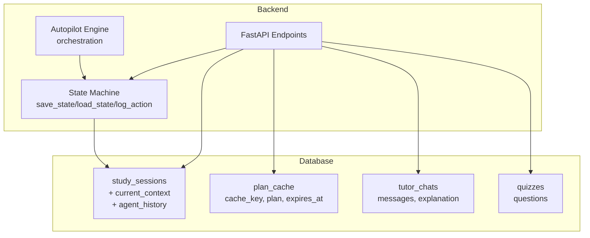
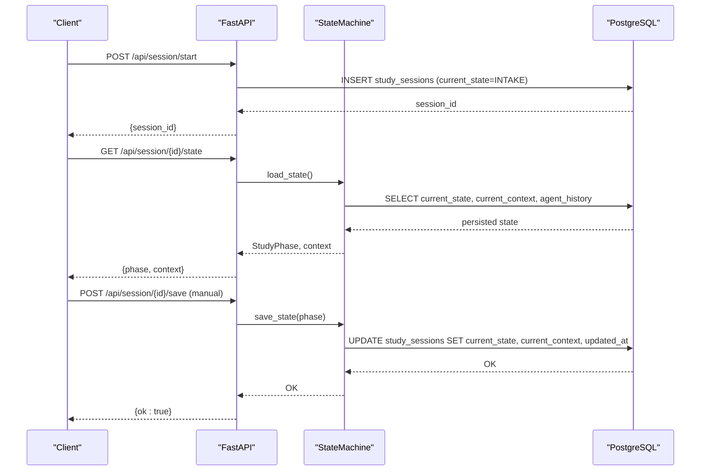
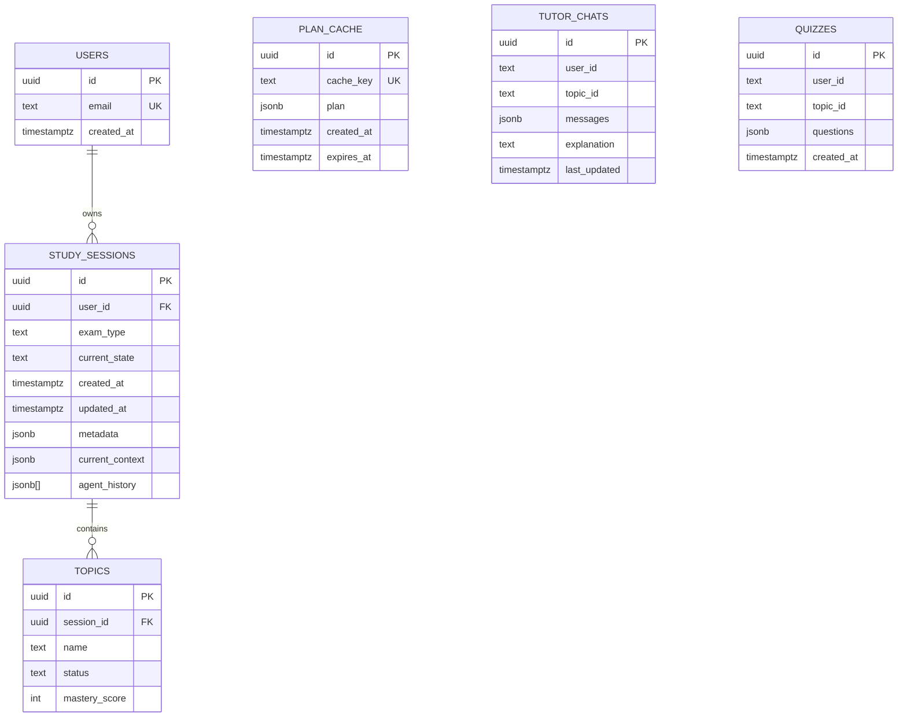
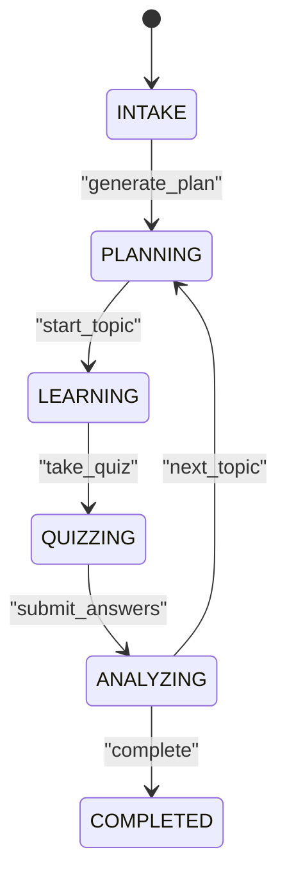
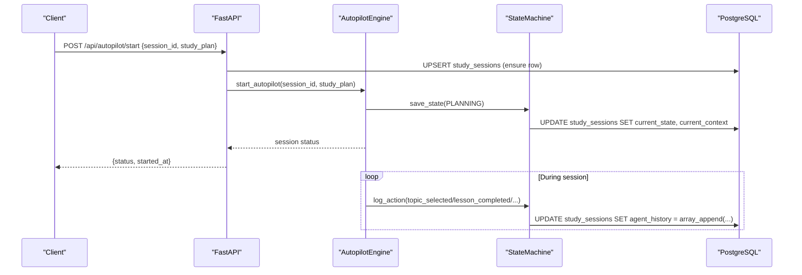
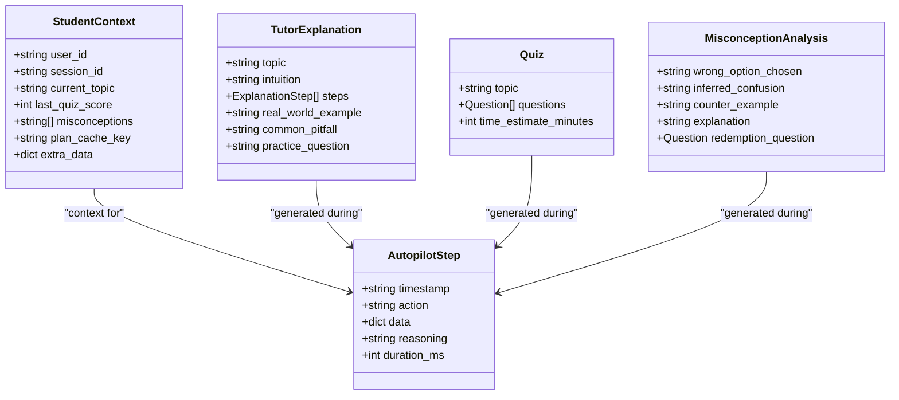
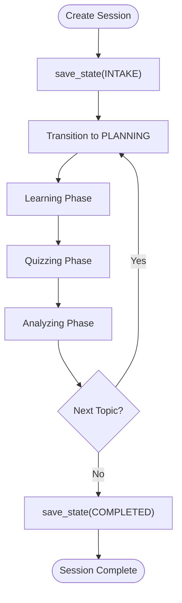
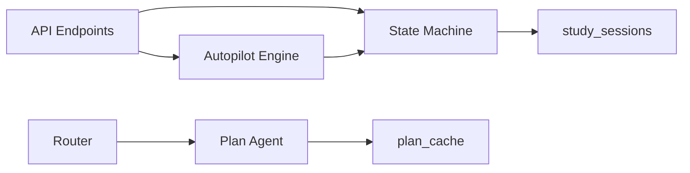

# Session Context

<cite>
**Referenced Files in This Document**
- [001_create_core_schema.sql](file://backend/migrations/001_create_core_schema.sql)
- [002_add_session_context.sql](file://backend/migrations/002_add_session_context.sql)
- [004_create_persistence_tables.sql](file://backend/migrations/004_create_persistence_tables.sql)
- [state_machine.py](file://backend/agents/state_machine.py)
- [main.py](file://backend/main.py)
- [autopilot_agent.py](file://backend/agents/autopilot_agent.py)
- [schemas.py](file://backend/agents/schemas.py)
- [tutor_agent.py](file://backend/agents/tutor_agent.py)
- [quiz_agent.py](file://backend/agents/quiz_agent.py)
- [misconception_agent.py](file://backend/agents/misconception_agent.py)
- [router.py](file://backend/router.py)
</cite>

## Table of Contents
1. [Introduction](#introduction)
2. [Project Structure](#project-structure)
3. [Core Components](#core-components)
4. [Architecture Overview](#architecture-overview)
5. [Detailed Component Analysis](#detailed-component-analysis)
6. [Dependency Analysis](#dependency-analysis)
7. [Performance Considerations](#performance-considerations)
8. [Troubleshooting Guide](#troubleshooting-guide)
9. [Conclusion](#conclusion)

## Introduction
This document explains the session context database schema extension that powers AI agent coordination and state management for study sessions. It details the new tables and columns introduced to persist session state, agent action histories, and cached plans. It also documents the session lifecycle, including state transitions, context preservation, and cleanup, along with the data structures used to represent AI conversations, decision-making contexts, and learning progress. Finally, it covers integration with the state machine, relationships to core schema entities, and performance considerations for accessing session context data.

## Project Structure
The session context enhancement spans:
- Database migrations that add persistence columns to the core study session table and introduce auxiliary persistence tables for chats and quizzes
- Backend state machine that persists and restores session state and agent action logs
- API endpoints that create sessions, save/load state, and integrate with the autopilot orchestration
- Agent modules that produce structured outputs and drive the session lifecycle

**Diagram sources**
- [001_create_core_schema.sql](file://backend/migrations/001_create_core_schema.sql#L14-L22)
- [002_add_session_context.sql](file://backend/migrations/002_add_session_context.sql#L2-L4)
- [002_add_session_context.sql](file://backend/migrations/002_add_session_context.sql#L7-L13)
- [004_create_persistence_tables.sql](file://backend/migrations/004_create_persistence_tables.sql#L4-L12)
- [004_create_persistence_tables.sql](file://backend/migrations/004_create_persistence_tables.sql#L15-L21)
- [state_machine.py](file://backend/agents/state_machine.py#L80-L114)
- [main.py](file://backend/main.py#L523-L571)
- [main.py](file://backend/main.py#L582-L646)
- [autopilot_agent.py](file://backend/agents/autopilot_agent.py#L431-L545)

**Section sources**
- [001_create_core_schema.sql](file://backend/migrations/001_create_core_schema.sql#L14-L22)
- [002_add_session_context.sql](file://backend/migrations/002_add_session_context.sql#L2-L4)
- [002_add_session_context.sql](file://backend/migrations/002_add_session_context.sql#L7-L13)
- [004_create_persistence_tables.sql](file://backend/migrations/004_create_persistence_tables.sql#L4-L12)
- [004_create_persistence_tables.sql](file://backend/migrations/004_create_persistence_tables.sql#L15-L21)
- [state_machine.py](file://backend/agents/state_machine.py#L80-L114)
- [main.py](file://backend/main.py#L523-L571)
- [main.py](file://backend/main.py#L582-L646)
- [autopilot_agent.py](file://backend/agents/autopilot_agent.py#L431-L545)

## Core Components
- Session state persistence: The study_sessions table now stores current_state, current_context (JSONB), and agent_history (JSONB array). These fields enable resuming workflows, auditing agent actions, and coordinating multi-agent decisions.
- Plan cache: The plan_cache table stores precomputed plans keyed by a hash of exam_type and syllabus summary, with TTL and a unique cache_key for fast retrieval.
- User persistence tables: tutor_chats and quizzes tables persist tutoring chat histories and generated quizzes with indexes for efficient lookups.
- State machine: The StateMachine class serializes and deserializes session context, validates transitions, and logs actions to agent_history.
- API integration: Endpoints create sessions, restore state, and coordinate with the autopilot engine to maintain session continuity.

**Section sources**
- [002_add_session_context.sql](file://backend/migrations/002_add_session_context.sql#L2-L4)
- [002_add_session_context.sql](file://backend/migrations/002_add_session_context.sql#L7-L13)
- [004_create_persistence_tables.sql](file://backend/migrations/004_create_persistence_tables.sql#L4-L12)
- [004_create_persistence_tables.sql](file://backend/migrations/004_create_persistence_tables.sql#L15-L21)
- [state_machine.py](file://backend/agents/state_machine.py#L27-L36)
- [state_machine.py](file://backend/agents/state_machine.py#L80-L114)
- [main.py](file://backend/main.py#L523-L571)
- [main.py](file://backend/main.py#L582-L646)

## Architecture Overview
The session context architecture integrates structured agent outputs with persistent state and caches to enable:
- Coordinated workflows across agents (planner, tutor, quiz, evaluator)
- Persistent session state and action logs
- Semantic caching for plan generation
- User-level persistence for chats and quizzes

**Diagram sources**
- [main.py](file://backend/main.py#L523-L571)
- [state_machine.py](file://backend/agents/state_machine.py#L96-L114)
- [state_machine.py](file://backend/agents/state_machine.py#L80-L95)

## Detailed Component Analysis

### Database Schema Extension
- study_sessions additions:
  - current_context: JSONB holding the serialized StudentContext for the session
  - agent_history: JSONB array of action logs with timestamps, actions, and metadata
- plan_cache:
  - cache_key: unique hash of exam_type and syllabus summary
  - plan: JSONB containing the cached plan
  - expires_at: TTL for cache entries
- tutor_chats and quizzes:
  - Messages and questions stored as JSONB
  - Indexes on user_id/topic_id and created_at for efficient queries

**Diagram sources**
- [001_create_core_schema.sql](file://backend/migrations/001_create_core_schema.sql#L8-L12)
- [001_create_core_schema.sql](file://backend/migrations/001_create_core_schema.sql#L14-L22)
- [001_create_core_schema.sql](file://backend/migrations/001_create_core_schema.sql#L25-L31)
- [002_add_session_context.sql](file://backend/migrations/002_add_session_context.sql#L2-L4)
- [002_add_session_context.sql](file://backend/migrations/002_add_session_context.sql#L7-L13)
- [004_create_persistence_tables.sql](file://backend/migrations/004_create_persistence_tables.sql#L4-L12)
- [004_create_persistence_tables.sql](file://backend/migrations/004_create_persistence_tables.sql#L15-L21)

**Section sources**
- [001_create_core_schema.sql](file://backend/migrations/001_create_core_schema.sql#L8-L12)
- [001_create_core_schema.sql](file://backend/migrations/001_create_core_schema.sql#L14-L22)
- [001_create_core_schema.sql](file://backend/migrations/001_create_core_schema.sql#L25-L31)
- [002_add_session_context.sql](file://backend/migrations/002_add_session_context.sql#L2-L4)
- [002_add_session_context.sql](file://backend/migrations/002_add_session_context.sql#L7-L13)
- [004_create_persistence_tables.sql](file://backend/migrations/004_create_persistence_tables.sql#L4-L12)
- [004_create_persistence_tables.sql](file://backend/migrations/004_create_persistence_tables.sql#L15-L21)

### State Machine and Session Lifecycle
- State transitions: The StateMachine enforces a strict workflow: INTAKE → PLANNING → LEARNING → QUIZZING → ANALYZING → COMPLETED.
- State persistence: save_state writes current_state, current_context, and updated_at to study_sessions.
- State restoration: load_state reads persisted state and reconstructs StudentContext.
- Action logging: log_action appends structured action entries to agent_history.

**Diagram sources**
- [state_machine.py](file://backend/agents/state_machine.py#L17-L25)
- [state_machine.py](file://backend/agents/state_machine.py#L44-L52)
- [state_machine.py](file://backend/agents/state_machine.py#L80-L114)

**Section sources**
- [state_machine.py](file://backend/agents/state_machine.py#L17-L25)
- [state_machine.py](file://backend/agents/state_machine.py#L44-L52)
- [state_machine.py](file://backend/agents/state_machine.py#L80-L114)

### Autopilot Orchestration and Session Context
- AutopilotSession tracks session status, current topic/phase, topic mastery, and a run log of steps with reasoning.
- The engine coordinates topic selection, micro-lessons, quizzes, and misconception analysis, updating session context and emitting steps.
- API endpoints create sessions, start autopilot runs, and expose status and interactive state (awaiting input, current content, current question).

**Diagram sources**
- [main.py](file://backend/main.py#L582-L646)
- [autopilot_agent.py](file://backend/agents/autopilot_agent.py#L431-L545)
- [state_machine.py](file://backend/agents/state_machine.py#L80-L136)

**Section sources**
- [autopilot_agent.py](file://backend/agents/autopilot_agent.py#L57-L87)
- [autopilot_agent.py](file://backend/agents/autopilot_agent.py#L431-L545)
- [main.py](file://backend/main.py#L582-L646)
- [state_machine.py](file://backend/agents/state_machine.py#L80-L136)

### Data Structures for Conversations, Decision Contexts, and Learning Progress
- StudentContext: Holds user_id, session_id, current_topic, last_quiz_score, misconceptions, plan_cache_key, and extra_data for cross-agent coordination.
- TutorExplanation: Structured explanation with intuition, steps, real-world example, common pitfall, and optional practice question.
- Quiz and Question: Structured quiz with questions, difficulty, concept-tested, and explanations.
- MisconceptionAnalysis: Diagnosis of wrong answers, inferred confusion, counter-example, and redemption question.
- AutopilotStep: Captures reasoning and timing for each orchestration decision.

**Diagram sources**
- [state_machine.py](file://backend/agents/state_machine.py#L27-L36)
- [tutor_agent.py](file://backend/agents/tutor_agent.py#L23-L30)
- [quiz_agent.py](file://backend/agents/quiz_agent.py#L39-L43)
- [misconception_agent.py](file://backend/agents/misconception_agent.py#L13-L20)
- [autopilot_agent.py](file://backend/agents/autopilot_agent.py#L39-L46)

**Section sources**
- [state_machine.py](file://backend/agents/state_machine.py#L27-L36)
- [tutor_agent.py](file://backend/agents/tutor_agent.py#L23-L30)
- [quiz_agent.py](file://backend/agents/quiz_agent.py#L39-L43)
- [misconception_agent.py](file://backend/agents/misconception_agent.py#L13-L20)
- [autopilot_agent.py](file://backend/agents/autopilot_agent.py#L39-L46)

### Session Lifecycle Management
- Creation: POST /api/session/start creates a study_sessions row with current_state set to INTAKE.
- Resumption: GET /api/session/{session_id}/state loads current_state and current_context; the state machine reconstructs StudentContext.
- Manual save: POST /api/session/{session_id}/save persists arbitrary context and phase.
- Autopilot lifecycle: The engine sets phases, logs actions, and updates session state continuously; endpoints expose status and interactive state.
- Cleanup: Sessions persist until completion or manual intervention; plan_cache entries expire after TTL.

**Diagram sources**
- [main.py](file://backend/main.py#L523-L571)
- [state_machine.py](file://backend/agents/state_machine.py#L65-L78)
- [state_machine.py](file://backend/agents/state_machine.py#L80-L114)
- [autopilot_agent.py](file://backend/agents/autopilot_agent.py#L431-L545)

**Section sources**
- [main.py](file://backend/main.py#L523-L571)
- [state_machine.py](file://backend/agents/state_machine.py#L65-L78)
- [state_machine.py](file://backend/agents/state_machine.py#L80-L114)
- [autopilot_agent.py](file://backend/agents/autopilot_agent.py#L431-L545)

### Queries and Data Retrieval Patterns
- Load session state: SELECT current_state, current_context, agent_history FROM study_sessions WHERE id = session_id
- Append action log: UPDATE study_sessions SET agent_history = array_append(agent_history, ?) WHERE id = session_id
- Retrieve plan cache: SELECT plan FROM plan_cache WHERE cache_key = ? AND expires_at > now()
- Upsert chat history: INSERT INTO tutor_chats (user_id, topic_id, messages, explanation) ON CONFLICT (user_id, topic_id) DO UPDATE SET messages = EXCLUDED.messages, last_updated = now()
- Save quiz: INSERT INTO quizzes (user_id, topic_id, questions) VALUES (?, ?, ?)
- Get latest quiz: SELECT questions FROM quizzes WHERE user_id = ? AND topic_id = ? ORDER BY created_at DESC LIMIT 1

**Section sources**
- [state_machine.py](file://backend/agents/state_machine.py#L96-L136)
- [002_add_session_context.sql](file://backend/migrations/002_add_session_context.sql#L7-L13)
- [004_create_persistence_tables.sql](file://backend/migrations/004_create_persistence_tables.sql#L4-L12)
- [004_create_persistence_tables.sql](file://backend/migrations/004_create_persistence_tables.sql#L15-L21)
- [main.py](file://backend/main.py#L780-L839)

### Integration with State Machine and Core Schema Entities
- study_sessions links to users and topics; session context augments these relationships with runtime state.
- StateMachine depends on study_sessions for persistence; it serializes StudentContext and appends action logs to agent_history.
- Router and plan agent leverage plan_cache to accelerate plan generation; cache keys are derived from exam_type and syllabus summaries.

**Section sources**
- [001_create_core_schema.sql](file://backend/migrations/001_create_core_schema.sql#L14-L22)
- [001_create_core_schema.sql](file://backend/migrations/001_create_core_schema.sql#L25-L31)
- [state_machine.py](file://backend/agents/state_machine.py#L54-L63)
- [router.py](file://backend/router.py#L35-L61)
- [002_add_session_context.sql](file://backend/migrations/002_add_session_context.sql#L7-L13)

## Dependency Analysis
- StateMachine depends on Supabase client and study_sessions table for persistence.
- AutopilotEngine depends on StateMachine for state persistence and on agent modules for orchestration.
- API endpoints depend on StateMachine and agent modules to manage sessions and expose status.
- plan_cache is independent but integrates with router and plan agent for caching.

**Diagram sources**
- [state_machine.py](file://backend/agents/state_machine.py#L54-L63)
- [main.py](file://backend/main.py#L582-L646)
- [autopilot_agent.py](file://backend/agents/autopilot_agent.py#L431-L545)
- [router.py](file://backend/router.py#L64-L88)
- [002_add_session_context.sql](file://backend/migrations/002_add_session_context.sql#L7-L13)

**Section sources**
- [state_machine.py](file://backend/agents/state_machine.py#L54-L63)
- [main.py](file://backend/main.py#L582-L646)
- [autopilot_agent.py](file://backend/agents/autopilot_agent.py#L431-L545)
- [router.py](file://backend/router.py#L64-L88)
- [002_add_session_context.sql](file://backend/migrations/002_add_session_context.sql#L7-L13)

## Performance Considerations
- Indexes:
  - study_sessions(user_id) supports user-scoped queries
  - idx_plan_cache_key accelerates plan cache lookups
  - tutor_chats(user_id, topic_id) and quizzes(user_id, topic_id) optimize upsert and retrieval
  - idx_quizzes_created_at enables efficient pagination of recent quizzes
- JSONB storage:
  - current_context and agent_history enable flexible schema evolution but require careful querying and selective projections
  - Consider partitioning or materialized views for frequently accessed subsets of agent_history
- Caching:
  - plan_cache TTL prevents stale data; ensure cache_key uniqueness and recalculation on syllabus changes
- Concurrency:
  - Use atomic operations (array_append) for agent_history updates
  - Upserts on tutor_chats minimize race conditions

**Section sources**
- [001_create_core_schema.sql](file://backend/migrations/001_create_core_schema.sql#L42-L46)
- [002_add_session_context.sql](file://backend/migrations/002_add_session_context.sql#L15-L16)
- [004_create_persistence_tables.sql](file://backend/migrations/004_create_persistence_tables.sql#L24-L26)

## Troubleshooting Guide
- State persistence failures:
  - Verify SUPABASE_URL and SUPABASE_SERVICE_ROLE_KEY are configured
  - Check save_state/load_state exceptions and retry logic
- Session not found:
  - Ensure study_sessions row exists before invoking StateMachine methods
  - Confirm session_id correctness in autopilot endpoints
- Autopilot stuck or not progressing:
  - Inspect agent_history for the last logged action
  - Validate state transitions and that the session is not paused
- Plan cache misses:
  - Recalculate cache_key when syllabus or exam_type changes
  - Monitor expires_at and refresh expired entries

**Section sources**
- [state_machine.py](file://backend/agents/state_machine.py#L56-L63)
- [state_machine.py](file://backend/agents/state_machine.py#L91-L113)
- [main.py](file://backend/main.py#L598-L628)
- [002_add_session_context.sql](file://backend/migrations/002_add_session_context.sql#L7-L13)

## Conclusion
The session context extension enriches the core study session schema with structured state, action logs, and plan caching. Together with the state machine and API endpoints, it enables robust, auditable, and resumable AI-driven study workflows. The design balances flexibility (JSONB) with performance (indexes, TTL) and integrates tightly with agent modules to coordinate multi-agent decision-making and learning progress tracking.