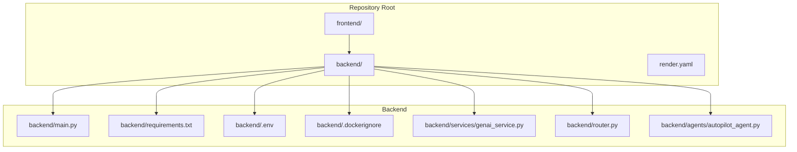
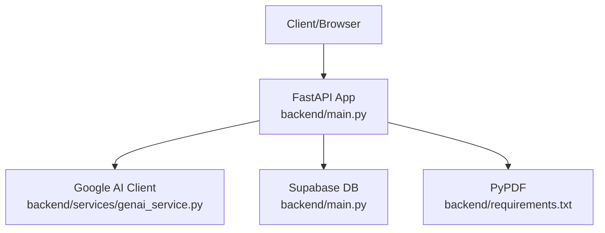
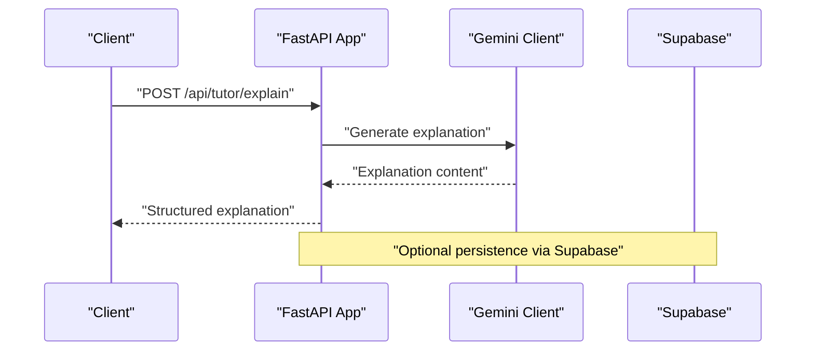
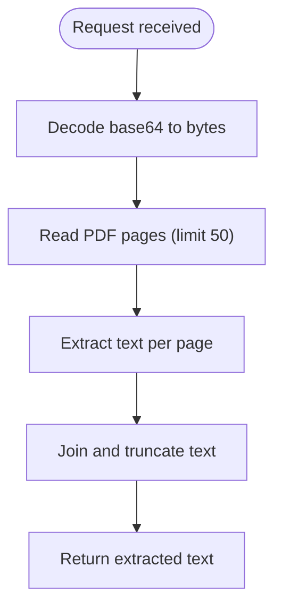
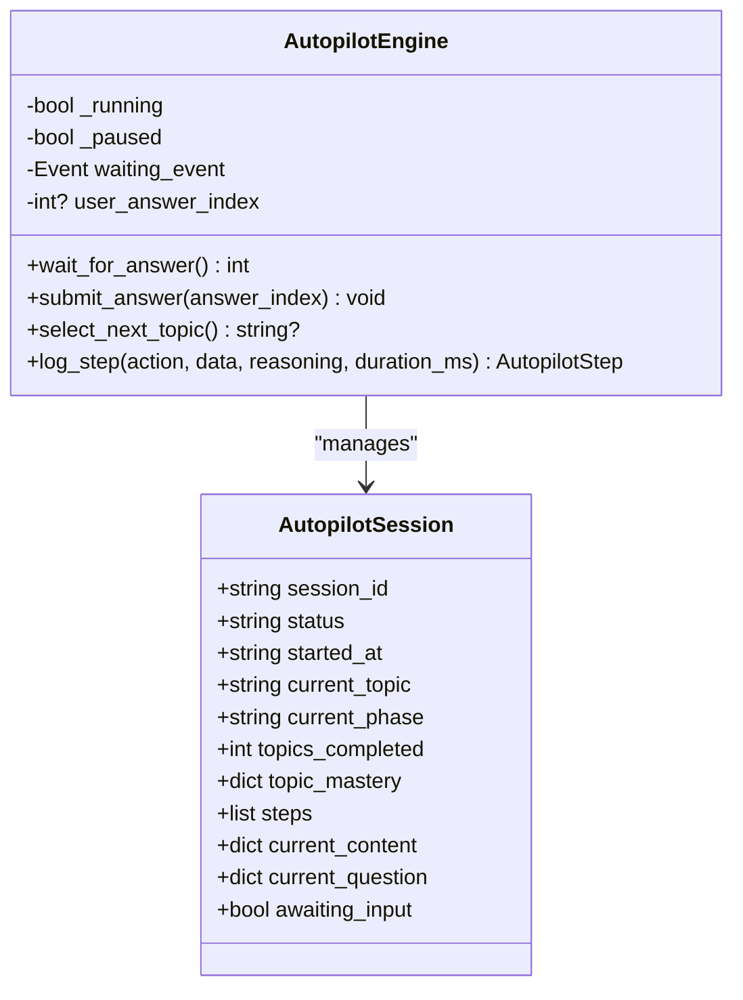
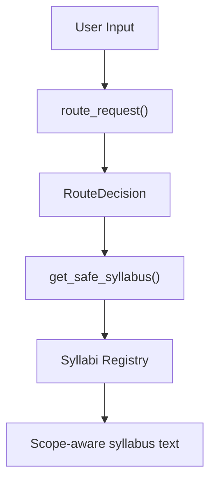
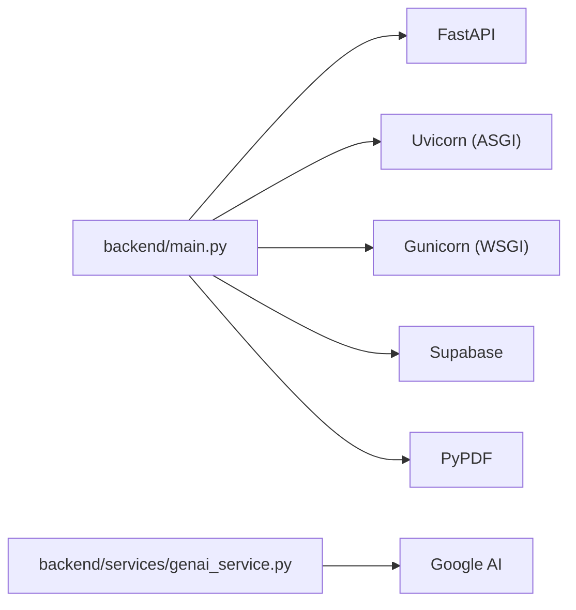

# Containerization and Deployment

<cite>
**Referenced Files in This Document**
- [backend/main.py](file://backend/main.py)
- [backend/requirements.txt](file://backend/requirements.txt)
- [backend/.dockerignore](file://backend/.dockerignore)
- [backend/.env](file://backend/.env)
- [backend/services/genai_service.py](file://backend/services/genai_service.py)
- [backend/router.py](file://backend/router.py)
- [backend/agents/autopilot_agent.py](file://backend/agents/autopilot_agent.py)
</cite>

## Table of Contents
1. [Introduction](#introduction)
2. [Project Structure](#project-structure)
3. [Core Components](#core-components)
4. [Architecture Overview](#architecture-overview)
5. [Detailed Component Analysis](#detailed-component-analysis)
6. [Dependency Analysis](#dependency-analysis)
7. [Performance Considerations](#performance-considerations)
8. [Troubleshooting Guide](#troubleshooting-guide)
9. [Conclusion](#conclusion)
10. [Appendices](#appendices)

## Introduction
This document describes the containerization and deployment strategy for Exammentor AI with a focus on Docker-based packaging and runtime configuration. It explains how the backend service is structured around a FastAPI application, how dependencies are managed, and how the system can be deployed using a platform that supports Docker-based workloads. The document also outlines recommended runtime settings, environment variable management, security considerations, and operational practices such as rollback and blue-green deployments.

## Project Structure
The repository is organized into a frontend (Next.js) and a backend (FastAPI) with supporting Python packages and configuration. For containerization and deployment, the backend is the primary target because it hosts the API server and integrates with external services.

**Diagram sources**
- [backend/main.py](file://backend/main.py#L1-L843)
- [backend/requirements.txt](file://backend/requirements.txt#L1-L32)
- [backend/.dockerignore](file://backend/.dockerignore#L1-L26)
- [backend/.env](file://backend/.env#L1-L5)
- [backend/services/genai_service.py](file://backend/services/genai_service.py#L1-L10)
- [backend/router.py](file://backend/router.py#L1-L129)
- [backend/agents/autopilot_agent.py](file://backend/agents/autopilot_agent.py#L1-L200)

**Section sources**
- [backend/main.py](file://backend/main.py#L1-L843)
- [backend/requirements.txt](file://backend/requirements.txt#L1-L32)
- [backend/.dockerignore](file://backend/.dockerignore#L1-L26)
- [backend/.env](file://backend/.env#L1-L5)
- [backend/services/genai_service.py](file://backend/services/genai_service.py#L1-L10)
- [backend/router.py](file://backend/router.py#L1-L129)
- [backend/agents/autopilot_agent.py](file://backend/agents/autopilot_agent.py#L1-L200)

## Core Components
- FastAPI application entrypoint and routing: The backend defines a FastAPI app with health checks and multiple agent-driven endpoints. It loads environment variables and connects to Supabase for persistence.
- External service integrations: The application initializes a Google AI client for generative tasks and uses Supabase for database operations.
- Dependencies: The Python requirements include FastAPI, Uvicorn (ASGI), Gunicorn (WSGI), PyPDF, and Supabase client among others.

Key implementation references:
- Application initialization and environment loading: [backend/main.py](file://backend/main.py#L17-L21)
- Supabase client creation: [backend/main.py](file://backend/main.py#L19-L21)
- Gemini client initialization: [backend/services/genai_service.py](file://backend/services/genai_service.py#L1-L10)
- Endpoint definitions and streaming responses: [backend/main.py](file://backend/main.py#L120-L223)
- Dependencies list: [backend/requirements.txt](file://backend/requirements.txt#L1-L32)

**Section sources**
- [backend/main.py](file://backend/main.py#L17-L21)
- [backend/main.py](file://backend/main.py#L120-L223)
- [backend/services/genai_service.py](file://backend/services/genai_service.py#L1-L10)
- [backend/requirements.txt](file://backend/requirements.txt#L1-L32)

## Architecture Overview
The backend is a FastAPI application that serves multiple endpoints for planning, tutoring, quizzing, and autonomous sessions. It relies on:
- Google AI for generative tasks
- Supabase for persistence
- PDF processing for study materials
- Streaming responses for real-time UI updates

**Diagram sources**
- [backend/main.py](file://backend/main.py#L17-L21)
- [backend/services/genai_service.py](file://backend/services/genai_service.py#L1-L10)
- [backend/requirements.txt](file://backend/requirements.txt#L1-L32)

**Section sources**
- [backend/main.py](file://backend/main.py#L17-L21)
- [backend/services/genai_service.py](file://backend/services/genai_service.py#L1-L10)
- [backend/requirements.txt](file://backend/requirements.txt#L1-L32)

## Detailed Component Analysis

### FastAPI Application and Endpoints
The application initializes environment variables, sets up CORS, and registers endpoints for:
- Health checks
- Study planning (with verification and streaming)
- Tutoring (explanations and image-based explanations)
- Quiz generation and evaluation
- Performance analysis and misconception busting
- Session management and autopilot orchestration

**Diagram sources**
- [backend/main.py](file://backend/main.py#L227-L243)
- [backend/services/genai_service.py](file://backend/services/genai_service.py#L1-L10)

**Section sources**
- [backend/main.py](file://backend/main.py#L227-L243)
- [backend/services/genai_service.py](file://backend/services/genai_service.py#L1-L10)

### PDF Text Extraction Endpoint
The backend supports extracting text from PDFs for use as study material context. It decodes base64 input, reads pages, and returns a truncated text summary.

**Diagram sources**
- [backend/main.py](file://backend/main.py#L267-L285)

**Section sources**
- [backend/main.py](file://backend/main.py#L267-L285)

### Autopilot Orchestration
The autopilot engine coordinates autonomous learning sessions, including topic selection, teaching, quizzing, and misconception handling. It logs decisions and supports pausing/resuming.

**Diagram sources**
- [backend/agents/autopilot_agent.py](file://backend/agents/autopilot_agent.py#L57-L87)
- [backend/agents/autopilot_agent.py](file://backend/agents/autopilot_agent.py#L100-L141)

**Section sources**
- [backend/agents/autopilot_agent.py](file://backend/agents/autopilot_agent.py#L57-L87)
- [backend/agents/autopilot_agent.py](file://backend/agents/autopilot_agent.py#L100-L141)

### Router and Syllabus Integration
The router module defines request schemas and routes user intents to appropriate syllabi, ensuring safe scope resolution across exams.

**Diagram sources**
- [backend/router.py](file://backend/router.py#L64-L88)
- [backend/router.py](file://backend/router.py#L91-L129)

**Section sources**
- [backend/router.py](file://backend/router.py#L64-L88)
- [backend/router.py](file://backend/router.py#L91-L129)

## Dependency Analysis
The backend depends on FastAPI for routing, Uvicorn for ASGI serving, Gunicorn for WSGI serving, Supabase for persistence, and PyPDF for PDF processing. The application also initializes a Google AI client for generative tasks.

**Diagram sources**
- [backend/requirements.txt](file://backend/requirements.txt#L1-L32)
- [backend/main.py](file://backend/main.py#L17-L21)
- [backend/services/genai_service.py](file://backend/services/genai_service.py#L1-L10)

**Section sources**
- [backend/requirements.txt](file://backend/requirements.txt#L1-L32)
- [backend/main.py](file://backend/main.py#L17-L21)
- [backend/services/genai_service.py](file://backend/services/genai_service.py#L1-L10)

## Performance Considerations
- Concurrency and workers: The backend includes both Uvicorn (ASGI) and Gunicorn (WSGI) dependencies. For production, choose one server based on workload characteristics. Uvicorn is suitable for ASGI applications and supports asynchronous features; Gunicorn is a traditional WSGI server.
- Streaming responses: The application uses streaming responses for real-time UI updates. Ensure adequate buffer sizes and network timeouts to maintain responsiveness.
- External service reliability: The autopilot engine implements retry logic with exponential backoff for overloaded or rate-limited responses from the generative model.
- Resource allocation: Configure CPU/memory limits according to expected concurrency and payload sizes. Monitor latency and adjust autoscaling thresholds accordingly.

[No sources needed since this section provides general guidance]

## Troubleshooting Guide
- Health checks: Use the health endpoint to verify service availability.
- Environment variables: Ensure required variables (e.g., Gemini API key, Supabase URL/key) are present and correctly formatted.
- PDF extraction failures: Validate base64 encoding and PDF structure; limit page count to avoid memory pressure.
- Supabase connectivity: Confirm credentials and network access; check for firewall or DNS issues.
- Generative model errors: Inspect retry logs and adjust backoff parameters if necessary.

**Section sources**
- [backend/main.py](file://backend/main.py#L120-L123)
- [backend/.env](file://backend/.env#L1-L5)
- [backend/main.py](file://backend/main.py#L267-L285)
- [backend/agents/autopilot_agent.py](file://backend/agents/autopilot_agent.py#L142-L162)

## Conclusion
Exammentor AI’s backend is container-ready as a FastAPI application with clear dependencies and environment-driven configuration. By leveraging Uvicorn or Gunicorn appropriately, managing environment variables securely, and applying sound operational practices, the system can be reliably deployed and scaled. The included streaming endpoints, PDF processing, and Supabase integration support a responsive, data-driven educational platform.

[No sources needed since this section summarizes without analyzing specific files]

## Appendices

### Containerization and Runtime Configuration
- Python runtime: Use a Python 3.11 base image to align with the project’s runtime expectations.
- ASGI server: Prefer Uvicorn for ASGI compatibility and asynchronous features.
- WSGI server: If using Gunicorn, configure 4 workers for concurrency.
- Build and startup commands:
  - Build: Install dependencies from the requirements file.
  - Startup: Launch the ASGI server pointing to the application module.
- Environment variables:
  - Manage sensitive keys via environment variables.
  - Example variables include the Gemini API key and Supabase credentials.
- Region selection: Choose a region close to users to minimize latency; the repository does not specify a region, so pick one aligned with your user base.
- Security best practices:
  - Keep the base image minimal and updated.
  - Mount only necessary volumes and restrict filesystem permissions.
  - Use secrets management for environment variables.
- Scaling:
  - Configure horizontal pod autoscaling based on CPU or custom metrics.
  - Set minimum and maximum replicas according to traffic patterns.
- Rollback and blue-green deployments:
  - Maintain multiple image tags and use deployment rollouts with health checks.
  - Switch traffic gradually to the new version and monitor metrics before finalizing.

[No sources needed since this section provides general guidance]