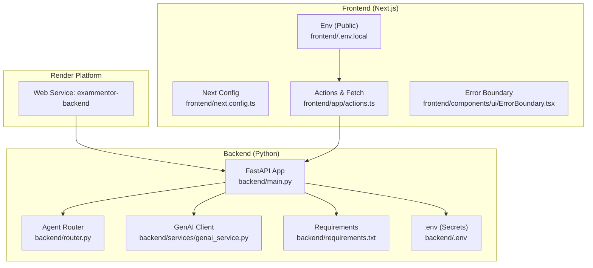
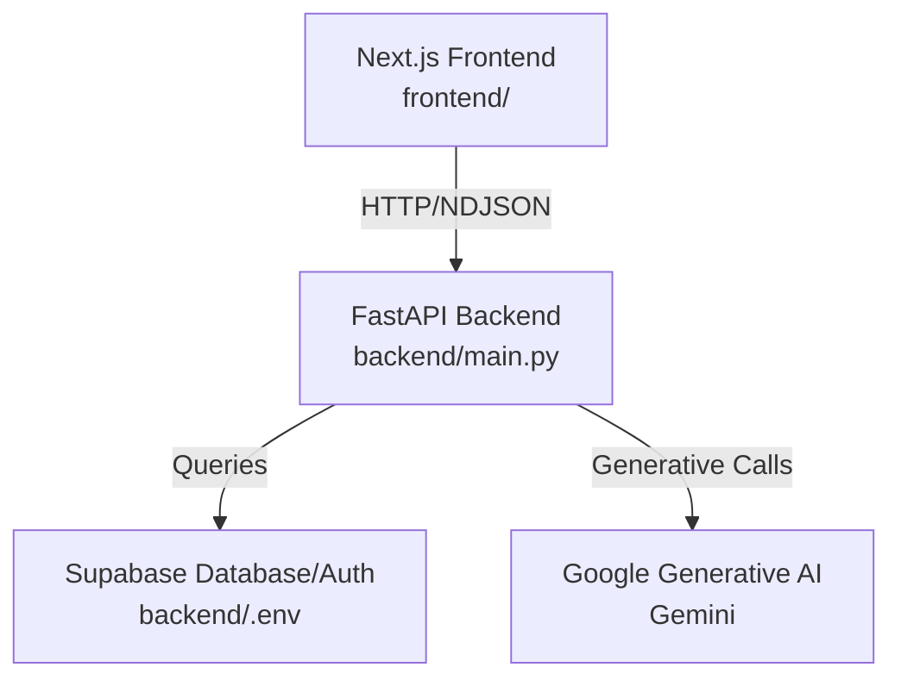
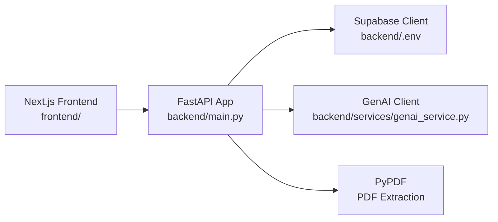

# Deployment and Operations

<cite>
**Referenced Files in This Document**
- [render.yaml](file://render.yaml)
- [backend/main.py](file://backend/main.py)
- [backend/router.py](file://backend/router.py)
- [backend/services/genai_service.py](file://backend/services/genai_service.py)
- [backend/requirements.txt](file://backend/requirements.txt)
- [backend/.dockerignore](file://backend/.dockerignore)
- [backend/.env](file://backend/.env)
- [frontend/.env.local](file://frontend/.env.local)
- [frontend/package.json](file://frontend/package.json)
- [frontend/app/layout.tsx](file://frontend/app/layout.tsx)
- [frontend/components/ui/ErrorBoundary.tsx](file://frontend/components/ui/ErrorBoundary.tsx)
- [frontend/app/actions.ts](file://frontend/app/actions.ts)
- [backend/migrations/001_create_core_schema.sql](file://backend/migrations/001_create_core_schema.sql)
- [.gitignore](file://.gitignore)
</cite>

## Table of Contents
1. [Introduction](#introduction)
2. [Project Structure](#project-structure)
3. [Core Components](#core-components)
4. [Architecture Overview](#architecture-overview)
5. [Detailed Component Analysis](#detailed-component-analysis)
6. [Dependency Analysis](#dependency-analysis)
7. [Performance Considerations](#performance-considerations)
8. [Troubleshooting Guide](#troubleshooting-guide)
9. [Conclusion](#conclusion)
10. [Appendices](#appendices)

## Introduction
This document provides comprehensive deployment and operations guidance for Exammentor AI. It covers containerization and platform deployment using Render, environment variable management across environments, CI/CD considerations, monitoring and logging strategies, performance and scaling, backup and disaster recovery, security practices, maintenance procedures, troubleshooting, and capacity planning.

## Project Structure
The repository follows a monorepo layout with a Python FastAPI backend and a Next.js frontend. Deployment is orchestrated via a Render configuration that builds and runs the backend service using Gunicorn and Uvicorn workers. Environment variables are managed separately for backend and frontend, with sensitive keys stored outside version control.

**Diagram sources**
- [render.yaml](file://render.yaml#L1-L13)
- [backend/main.py](file://backend/main.py#L1-L843)
- [backend/router.py](file://backend/router.py#L1-L129)
- [backend/services/genai_service.py](file://backend/services/genai_service.py#L1-L10)
- [backend/requirements.txt](file://backend/requirements.txt#L1-L32)
- [backend/.env](file://backend/.env#L1-L5)
- [frontend/next.config.ts](file://frontend/next.config.ts#L1-L8)
- [frontend/.env.local](file://frontend/.env.local#L1-L3)
- [frontend/app/actions.ts](file://frontend/app/actions.ts#L1-L54)
- [frontend/components/ui/ErrorBoundary.tsx](file://frontend/components/ui/ErrorBoundary.tsx#L1-L128)

**Section sources**
- [render.yaml](file://render.yaml#L1-L13)
- [backend/main.py](file://backend/main.py#L1-L843)
- [backend/router.py](file://backend/router.py#L1-L129)
- [backend/services/genai_service.py](file://backend/services/genai_service.py#L1-L10)
- [backend/requirements.txt](file://backend/requirements.txt#L1-L32)
- [backend/.env](file://backend/.env#L1-L5)
- [frontend/.env.local](file://frontend/.env.local#L1-L3)
- [frontend/next.config.ts](file://frontend/next.config.ts#L1-L8)
- [frontend/app/actions.ts](file://frontend/app/actions.ts#L1-L54)
- [frontend/components/ui/ErrorBoundary.tsx](file://frontend/components/ui/ErrorBoundary.tsx#L1-L128)

## Core Components
- Backend service: FastAPI application exposing AI agent endpoints, session/state management, and streaming responses. It integrates with Supabase for persistence and Google Generative AI for model inference.
- Frontend: Next.js application with client-side fetch logic, environment-driven API base URL, and error boundary handling.
- Deployment: Render-managed Python web service with Gunicorn and Uvicorn workers, configured via render.yaml.

Key operational aspects:
- Environment variables for API keys, database URLs, and model configuration are loaded from .env and .env.local.
- CORS is enabled broadly for development and production convenience.
- Health checks and streaming endpoints support real-time UI feedback.

**Section sources**
- [backend/main.py](file://backend/main.py#L1-L843)
- [backend/services/genai_service.py](file://backend/services/genai_service.py#L1-L10)
- [backend/router.py](file://backend/router.py#L1-L129)
- [backend/.env](file://backend/.env#L1-L5)
- [frontend/.env.local](file://frontend/.env.local#L1-L3)
- [render.yaml](file://render.yaml#L1-L13)

## Architecture Overview
The system consists of:
- Frontend Next.js app communicating with the backend API.
- Backend FastAPI app serving AI endpoints, managing sessions, and persisting data to Supabase.
- External integrations: Google Generative AI for model inference and Supabase for relational data and auth.

**Diagram sources**
- [backend/main.py](file://backend/main.py#L1-L843)
- [backend/services/genai_service.py](file://backend/services/genai_service.py#L1-L10)
- [backend/.env](file://backend/.env#L1-L5)
- [frontend/app/actions.ts](file://frontend/app/actions.ts#L1-L54)

## Detailed Component Analysis

### Backend Containerization and Render Deployment
- Build command installs Python dependencies from backend/requirements.txt.
- Start command runs Gunicorn with Uvicorn workers bound to $PORT.
- Environment variables include platform-specific tuning and Python version pinning.

Operational implications:
- Use Render’s environment variable injection for secrets and runtime configuration.
- Ensure PORT is respected by the WSGI server binding.
- Keep worker count aligned with CPU/memory resources.

**Section sources**
- [render.yaml](file://render.yaml#L1-L13)
- [backend/requirements.txt](file://backend/requirements.txt#L1-L32)

### Environment Variable Management
- Backend secrets (.env): API keys, database URL, and Supabase credentials.
- Frontend public variables (.env.local): API base URL and Supabase public keys.
- Version control ignores local env files to prevent accidental commits.

Recommended practice:
- Store secrets in Render’s dashboard environment variables.
- Use NEXT_PUBLIC_* prefix only for frontend-visible values.
- Maintain separate keys for development, staging, and production.

**Section sources**
- [backend/.env](file://backend/.env#L1-L5)
- [frontend/.env.local](file://frontend/.env.local#L1-L3)
- [.gitignore](file://.gitignore#L1-L13)

### CI/CD Pipeline and Automated Deployment
- Render automatically triggers builds on commits to the configured branch.
- Build step installs backend dependencies; start step launches the service.
- Recommended enhancements:
  - Add linting and unit tests pre-deploy.
  - Gate deployments with pull requests and automated checks.
  - Use Render’s environment toggles for staging and production promotion.

**Section sources**
- [render.yaml](file://render.yaml#L1-L13)

### Monitoring and Logging
- Backend:
  - Health endpoint for basic service checks.
  - Streaming endpoints for real-time feedback.
  - Consider adding structured logging and metrics exposure (e.g., Prometheus-compatible metrics).
- Frontend:
  - Error boundary component for graceful error handling.
  - Client-side fetch with retry logic for resilience.

Monitoring recommendations:
- Backend: Add OpenTelemetry SDK, request tracing, and error counters.
- Frontend: Integrate analytics and error reporting libraries; surface network errors via the error boundary.

**Section sources**
- [backend/main.py](file://backend/main.py#L119-L124)
- [frontend/components/ui/ErrorBoundary.tsx](file://frontend/components/ui/ErrorBoundary.tsx#L1-L128)
- [frontend/app/actions.ts](file://frontend/app/actions.ts#L1-L54)

### Performance Monitoring, Error Tracking, and Alerting
- Performance:
  - Track latency for AI generation calls and database queries.
  - Monitor worker utilization and queue depth for streaming endpoints.
- Error tracking:
  - Capture unhandled exceptions in backend and report to an observability platform.
  - Surface frontend errors via the error boundary and analytics.
- Alerting:
  - Set thresholds for error rates, latency p95/p99, and unhealthy instances.

[No sources needed since this section provides general guidance]

### Scaling Considerations
- Concurrent users and AI requests:
  - Increase Gunicorn workers proportionally to CPU cores; tune based on observed concurrency.
  - Offload long-running AI tasks to asynchronous workers or queues.
  - Use connection pooling for database and external API clients.
- Horizontal scaling:
  - Deploy multiple instances behind a load balancer.
  - Ensure stateless backend behavior and shared storage for session artifacts.

[No sources needed since this section provides general guidance]

### Backup and Disaster Recovery
- Database backups:
  - Leverage Supabase’s built-in backup and point-in-time recovery.
  - Export schema and data periodically for offsite retention.
- Application data:
  - Persist user sessions and chat history in Supabase; maintain audit logs.
- DR plan:
  - Test restoration from backups.
  - Maintain a secondary region/environment for failover.

**Section sources**
- [backend/migrations/001_create_core_schema.sql](file://backend/migrations/001_create_core_schema.sql#L1-L46)

### Security Best Practices
- TLS/SSL:
  - Serve HTTPS via Render’s managed certificates; enforce HTTPS redirects.
- Secrets management:
  - Store API keys and database credentials in Render environment variables.
  - Restrict access to environment variables and avoid embedding secrets in client bundles.
- Access control:
  - Use Supabase Row Level Security policies for data protection.
  - Enforce CORS appropriately in production.
- Network security:
  - Limit inbound ports and restrict outbound connections to trusted domains.

**Section sources**
- [backend/.env](file://backend/.env#L1-L5)
- [frontend/.env.local](file://frontend/.env.local#L1-L3)
- [backend/main.py](file://backend/main.py#L30-L37)

### Maintenance Procedures
- Dependency updates:
  - Pin major versions in requirements.txt; scan for vulnerabilities regularly.
  - Test updates in staging before promoting to production.
- Database migrations:
  - Apply schema changes via Supabase SQL editor or migration scripts; keep a changelog.
- System upgrades:
  - Update Python runtime and dependencies through Render’s environment settings.
  - Validate health checks after upgrades.

**Section sources**
- [backend/requirements.txt](file://backend/requirements.txt#L1-L32)
- [backend/migrations/001_create_core_schema.sql](file://backend/migrations/001_create_core_schema.sql#L1-L46)

### Troubleshooting Guide
Common issues and resolutions:
- Backend not starting:
  - Verify PORT binding and worker configuration in render.yaml.
  - Confirm environment variables are present in Render dashboard.
- AI API failures:
  - Check GEMINI_API_KEY validity and quota limits.
  - Inspect network connectivity and proxy settings.
- Database connectivity:
  - Validate DATABASE_URL and Supabase credentials.
  - Review Supabase logs and connection pool limits.
- Frontend errors:
  - Use the error boundary to capture and display meaningful messages.
  - Inspect NEXT_PUBLIC_API_BASE_URL and CORS configuration.

**Section sources**
- [render.yaml](file://render.yaml#L1-L13)
- [backend/services/genai_service.py](file://backend/services/genai_service.py#L1-L10)
- [backend/.env](file://backend/.env#L1-L5)
- [frontend/components/ui/ErrorBoundary.tsx](file://frontend/components/ui/ErrorBoundary.tsx#L1-L128)
- [frontend/app/actions.ts](file://frontend/app/actions.ts#L1-L54)

## Dependency Analysis
Runtime dependencies and their roles:
- FastAPI and Uvicorn: Web framework and ASGI server.
- Gunicorn: Production WSGI HTTP server.
- Supabase client: Database and auth integration.
- Google Generative AI: Model inference.
- PyPDF: PDF text extraction for study materials.

**Diagram sources**
- [backend/main.py](file://backend/main.py#L1-L843)
- [backend/services/genai_service.py](file://backend/services/genai_service.py#L1-L10)
- [backend/requirements.txt](file://backend/requirements.txt#L1-L32)
- [frontend/app/actions.ts](file://frontend/app/actions.ts#L1-L54)

**Section sources**
- [backend/requirements.txt](file://backend/requirements.txt#L1-L32)
- [backend/main.py](file://backend/main.py#L1-L843)
- [backend/services/genai_service.py](file://backend/services/genai_service.py#L1-L10)
- [frontend/app/actions.ts](file://frontend/app/actions.ts#L1-L54)

## Performance Considerations
- Optimize AI request batching and caching for repeated prompts.
- Tune Gunicorn worker count and timeout settings for concurrent streaming.
- Use connection pooling for Supabase and external APIs.
- Monitor memory usage and garbage collection impact on long-running sessions.

[No sources needed since this section provides general guidance]

## Troubleshooting Guide
- Health checks:
  - Use the /health endpoint to confirm service readiness.
- Streaming issues:
  - Validate NDJSON media type and client-side consumption logic.
- CORS errors:
  - Align frontend origin with backend CORS configuration.
- Database errors:
  - Check row-level security policies and index usage.

**Section sources**
- [backend/main.py](file://backend/main.py#L119-L124)
- [frontend/app/actions.ts](file://frontend/app/actions.ts#L1-L54)

## Conclusion
Exammentor AI is designed for straightforward deployment on Render with a clear separation of concerns between the Next.js frontend and FastAPI backend. By securing environment variables, instrumenting monitoring, and establishing robust CI/CD and backup procedures, the system can operate reliably at scale while maintaining strong security and observability.

[No sources needed since this section summarizes without analyzing specific files]

## Appendices

### Appendix A: Environment Variables Reference
- Backend (.env):
  - GEMINI_API_KEY
  - GEMINI_MODEL
  - DATABASE_URL
  - SUPABASE_URL
  - SUPABASE_KEY
- Frontend (.env.local):
  - NEXT_PUBLIC_API_BASE_URL
  - NEXT_PUBLIC_SUPABASE_URL
  - NEXT_PUBLIC_SUPABASE_ANON_KEY

**Section sources**
- [backend/.env](file://backend/.env#L1-L5)
- [frontend/.env.local](file://frontend/.env.local#L1-L3)

### Appendix B: Render Deployment Checklist
- Confirm buildCommand and startCommand correctness.
- Add environment variables in Render dashboard.
- Configure domain and SSL certificates.
- Set up health checks and monitoring hooks.

**Section sources**
- [render.yaml](file://render.yaml#L1-L13)