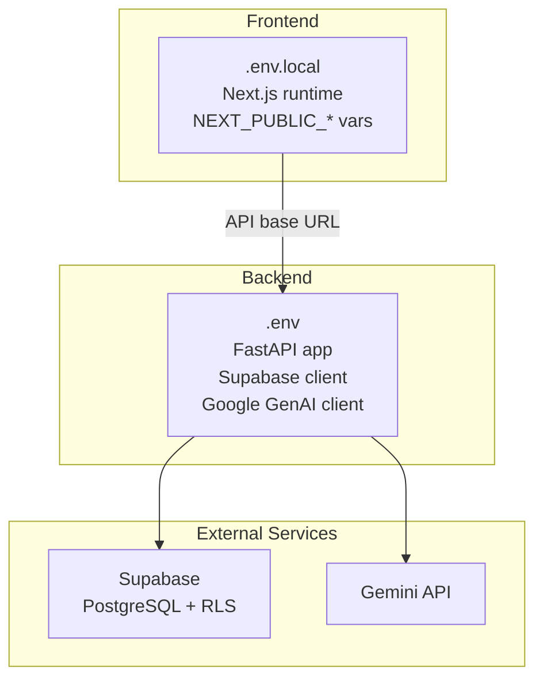
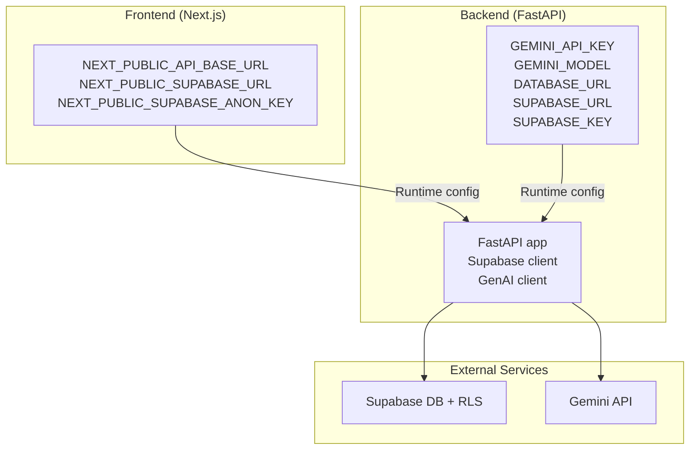
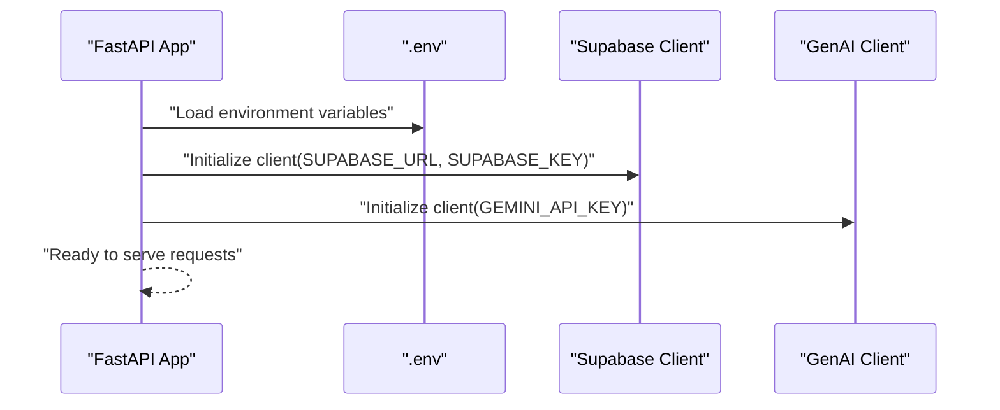
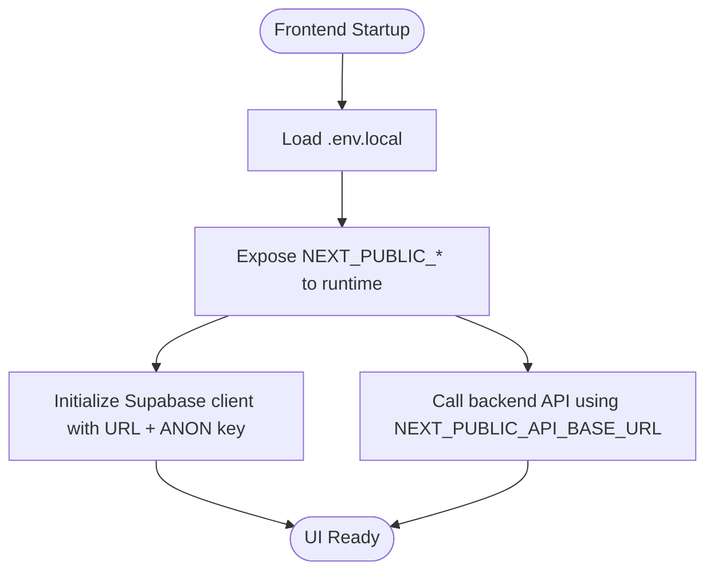
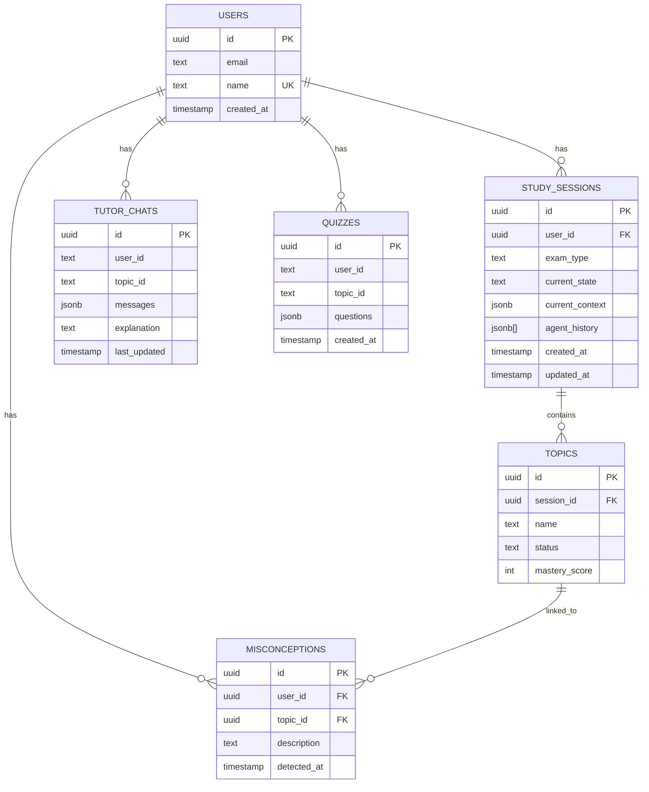
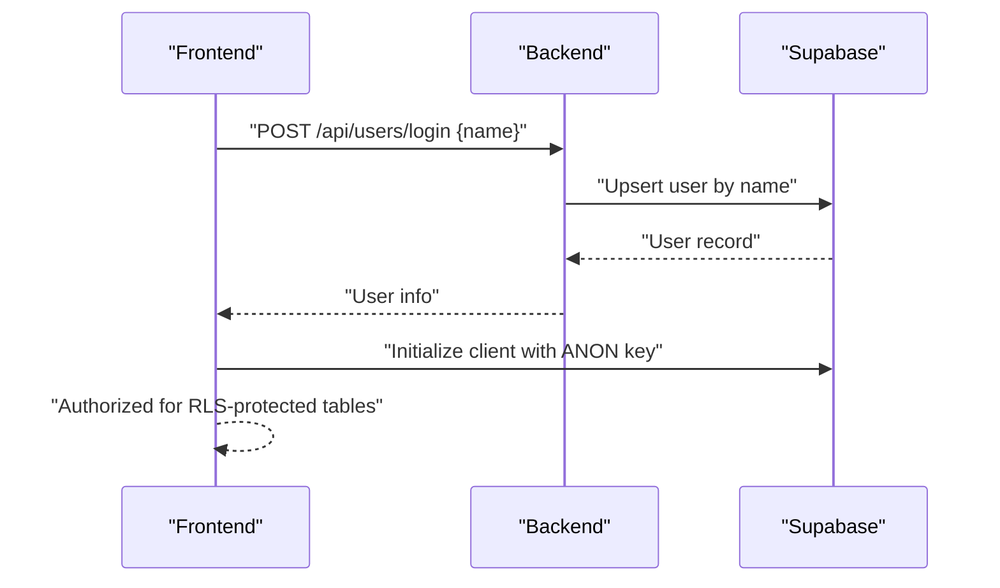
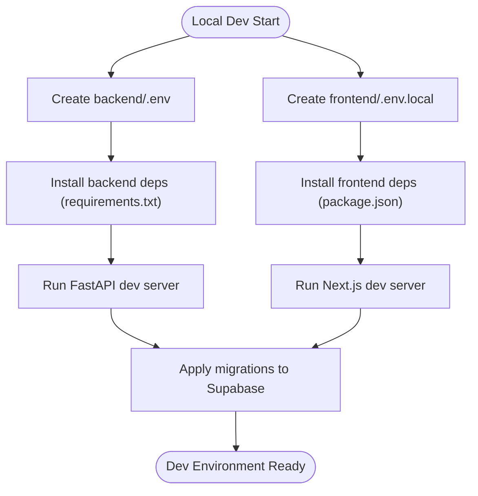
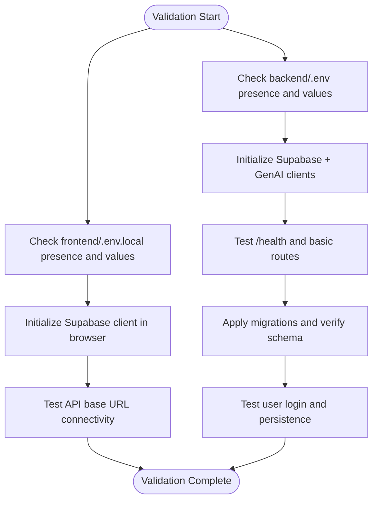
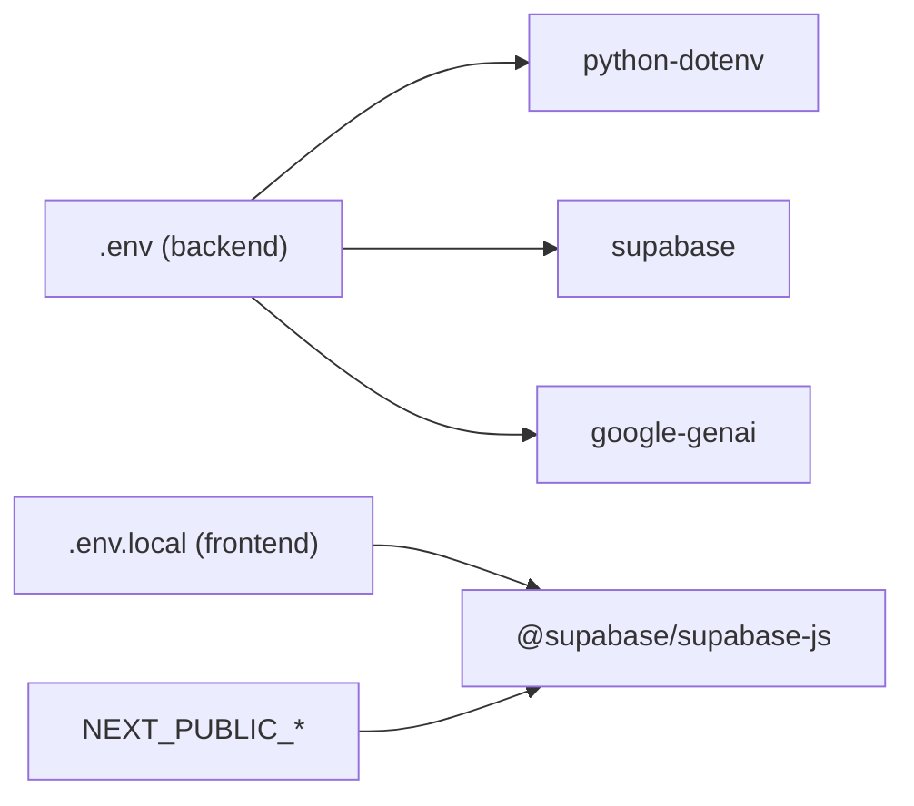

# Environment Management

<cite>
**Referenced Files in This Document**
- [backend/.env](file://backend/.env)
- [frontend/.env.local](file://frontend/.env.local)
- [backend/main.py](file://backend/main.py)
- [backend/services/genai_service.py](file://backend/services/genai_service.py)
- [backend/router.py](file://backend/router.py)
- [backend/requirements.txt](file://backend/requirements.txt)
- [frontend/package.json](file://frontend/package.json)
- [.gitignore](file://.gitignore)
- [backend/migrations/001_create_core_schema.sql](file://backend/migrations/001_create_core_schema.sql)
- [backend/migrations/002_add_session_context.sql](file://backend/migrations/002_add_session_context.sql)
- [backend/migrations/003_fix_users_rls.sql](file://backend/migrations/003_fix_users_rls.sql)
- [backend/migrations/004_create_persistence_tables.sql](file://backend/migrations/004_create_persistence_tables.sql)
</cite>

## Table of Contents
1. [Introduction](#introduction)
2. [Project Structure](#project-structure)
3. [Core Components](#core-components)
4. [Architecture Overview](#architecture-overview)
5. [Detailed Component Analysis](#detailed-component-analysis)
6. [Dependency Analysis](#dependency-analysis)
7. [Performance Considerations](#performance-considerations)
8. [Troubleshooting Guide](#troubleshooting-guide)
9. [Conclusion](#conclusion)
10. [Appendices](#appendices)

## Introduction
This document provides comprehensive environment management guidance for Exammentor AI across development, staging, and production environments. It covers configuration of environment variables for the Gemini AI API, Supabase database and authentication, and the distinction between backend and frontend environment files. It also documents local development setup, environment-specific deployment considerations, security practices for sensitive credentials, and validation/testing strategies.

## Project Structure
The repository is split into two primary areas:
- Backend: Python FastAPI service with environment variables loaded via python-dotenv, Supabase client initialization, and Google Generative AI integration.
- Frontend: Next.js application with environment variables exposed to the browser using the NEXT_PUBLIC_ prefix.

Key environment configuration locations:
- Backend environment: backend/.env
- Frontend environment: frontend/.env.local
- Version control exclusion: .gitignore excludes backend/.env and frontend/.env.local

**Diagram sources**
- [backend/.env](file://backend/.env#L1-L5)
- [frontend/.env.local](file://frontend/.env.local#L1-L3)
- [backend/main.py](file://backend/main.py#L17-L21)
- [backend/services/genai_service.py](file://backend/services/genai_service.py#L1-L10)

**Section sources**
- [backend/.env](file://backend/.env#L1-L5)
- [frontend/.env.local](file://frontend/.env.local#L1-L3)
- [.gitignore](file://.gitignore#L1-L4)

## Core Components
This section outlines the environment variables and their roles across environments.

- Backend environment variables (loaded by backend/.env):
  - GEMINI_API_KEY: API key for Google Generative AI
  - GEMINI_MODEL: Model identifier used by agents
  - DATABASE_URL: Supabase connection string
  - SUPABASE_URL: Supabase project URL
  - SUPABASE_KEY: Supabase project API key (anon or service role)

- Frontend environment variables (loaded by frontend/.env.local):
  - NEXT_PUBLIC_API_BASE_URL: Base URL for backend API calls from the browser
  - NEXT_PUBLIC_SUPABASE_URL: Supabase project URL for client SDK
  - NEXT_PUBLIC_SUPABASE_ANON_KEY: Supabase anonymous key for client SDK

- Supabase integration:
  - Backend initializes a Supabase client using SUPABASE_URL and SUPABASE_KEY
  - Frontend initializes a Supabase client using NEXT_PUBLIC_SUPABASE_URL and NEXT_PUBLIC_SUPABASE_ANON_KEY
  - Database schema and RLS policies are defined in migration files

- Google Generative AI integration:
  - Backend initializes a GenAI client using GEMINI_API_KEY
  - Router module references a centralized GenAI client instance

- Version control exclusion:
  - .gitignore excludes backend/.env and frontend/.env.local to prevent secrets from being committed

**Section sources**
- [backend/.env](file://backend/.env#L1-L5)
- [frontend/.env.local](file://frontend/.env.local#L1-L3)
- [backend/main.py](file://backend/main.py#L17-L21)
- [backend/services/genai_service.py](file://backend/services/genai_service.py#L1-L10)
- [backend/router.py](file://backend/router.py#L1-L6)
- [.gitignore](file://.gitignore#L1-L4)

## Architecture Overview
The environment-driven architecture ties together frontend, backend, and external services via environment variables.

**Diagram sources**
- [frontend/.env.local](file://frontend/.env.local#L1-L3)
- [backend/.env](file://backend/.env#L1-L5)
- [backend/main.py](file://backend/main.py#L17-L21)
- [backend/services/genai_service.py](file://backend/services/genai_service.py#L1-L10)

## Detailed Component Analysis

### Backend Environment Configuration
- Loading order and client initialization:
  - backend/main.py loads environment variables and initializes Supabase client
  - backend/services/genai_service.py loads environment variables and initializes the GenAI client
- Variables used:
  - DATABASE_URL, SUPABASE_URL, SUPABASE_KEY for backend Supabase client
  - GEMINI_API_KEY, GEMINI_MODEL for GenAI client and agent usage
- Supabase client usage:
  - Used for user creation/login, session persistence, chat history, and quiz persistence
- Router integration:
  - router.py imports the centralized GenAI client for routing decisions

**Diagram sources**
- [backend/main.py](file://backend/main.py#L17-L21)
- [backend/services/genai_service.py](file://backend/services/genai_service.py#L1-L10)
- [backend/.env](file://backend/.env#L1-L5)

**Section sources**
- [backend/main.py](file://backend/main.py#L17-L21)
- [backend/services/genai_service.py](file://backend/services/genai_service.py#L1-L10)
- [backend/.env](file://backend/.env#L1-L5)

### Frontend Environment Configuration
- Runtime exposure:
  - NEXT_PUBLIC_API_BASE_URL enables the frontend to call the backend API
  - NEXT_PUBLIC_SUPABASE_URL and NEXT_PUBLIC_SUPABASE_ANON_KEY enable the frontend to initialize Supabase client
- Build-time vs runtime:
  - Only NEXT_PUBLIC_* variables are embedded at build time; private keys should remain server-side

**Diagram sources**
- [frontend/.env.local](file://frontend/.env.local#L1-L3)
- [frontend/package.json](file://frontend/package.json#L1-L46)

**Section sources**
- [frontend/.env.local](file://frontend/.env.local#L1-L3)
- [frontend/package.json](file://frontend/package.json#L1-L46)

### Supabase Integration Settings
- Backend client initialization:
  - Uses SUPABASE_URL and SUPABASE_KEY to create a Supabase client
- Frontend client initialization:
  - Uses NEXT_PUBLIC_SUPABASE_URL and NEXT_PUBLIC_SUPABASE_ANON_KEY to create a Supabase client
- Database schema and RLS:
  - Core schema, session context, users RLS, and persistence tables are defined in migration files
  - RLS policies enable controlled access for anonymous users and public inserts/selects

**Diagram sources**
- [backend/migrations/001_create_core_schema.sql](file://backend/migrations/001_create_core_schema.sql#L7-L45)
- [backend/migrations/002_add_session_context.sql](file://backend/migrations/002_add_session_context.sql#L2-L15)
- [backend/migrations/003_fix_users_rls.sql](file://backend/migrations/003_fix_users_rls.sql#L3-L40)
- [backend/migrations/004_create_persistence_tables.sql](file://backend/migrations/004_create_persistence_tables.sql#L3-L26)

**Section sources**
- [backend/main.py](file://backend/main.py#L17-L21)
- [frontend/.env.local](file://frontend/.env.local#L2-L3)
- [backend/migrations/001_create_core_schema.sql](file://backend/migrations/001_create_core_schema.sql#L1-L46)
- [backend/migrations/002_add_session_context.sql](file://backend/migrations/002_add_session_context.sql#L1-L16)
- [backend/migrations/003_fix_users_rls.sql](file://backend/migrations/003_fix_users_rls.sql#L1-L41)
- [backend/migrations/004_create_persistence_tables.sql](file://backend/migrations/004_create_persistence_tables.sql#L1-L44)

### Authentication Token Management
- Backend:
  - Uses SUPABASE_KEY for server-side Supabase operations
- Frontend:
  - Uses NEXT_PUBLIC_SUPABASE_ANON_KEY for client-side Supabase operations
- User login flow:
  - Backend supports a simple login endpoint that creates or retrieves a user by name and persists to the users table

**Diagram sources**
- [backend/main.py](file://backend/main.py#L763-L777)
- [frontend/.env.local](file://frontend/.env.local#L2-L3)

**Section sources**
- [backend/main.py](file://backend/main.py#L763-L777)
- [frontend/.env.local](file://frontend/.env.local#L2-L3)

### Local Development Environment Setup
- Prerequisites:
  - Python virtual environment and dependencies installed via backend/requirements.txt
  - Node.js and Yarn for frontend
- Backend:
  - Place backend/.env with required variables
  - Run the FastAPI server (development server command is present in the backend file comments)
- Frontend:
  - Place frontend/.env.local with NEXT_PUBLIC_* variables
  - Run the Next.js development server
- Database:
  - Apply migrations to Supabase using the provided SQL files
  - Ensure DATABASE_URL points to the Supabase Postgres instance

**Diagram sources**
- [backend/requirements.txt](file://backend/requirements.txt#L1-L32)
- [frontend/package.json](file://frontend/package.json#L1-L46)
- [backend/.env](file://backend/.env#L1-L5)
- [frontend/.env.local](file://frontend/.env.local#L1-L3)
- [backend/migrations/001_create_core_schema.sql](file://backend/migrations/001_create_core_schema.sql#L1-L46)

**Section sources**
- [backend/requirements.txt](file://backend/requirements.txt#L1-L32)
- [frontend/package.json](file://frontend/package.json#L1-L46)
- [backend/.env](file://backend/.env#L1-L5)
- [frontend/.env.local](file://frontend/.env.local#L1-L3)
- [backend/migrations/001_create_core_schema.sql](file://backend/migrations/001_create_core_schema.sql#L1-L46)

### Environment-Specific Configurations
- Development:
  - Use local backend/.env and frontend/.env.local with local or staging Supabase endpoints
  - Ensure NEXT_PUBLIC_API_BASE_URL points to the local backend
- Staging:
  - Replace Supabase URL and keys with staging values
  - Keep API base URL pointing to the staging backend
- Production:
  - Replace Supabase URL and keys with production values
  - Ensure API base URL points to the production backend
  - Restrict CORS and enforce HTTPS in production deployments

Note: The repository does not include explicit environment-specific configuration files beyond .env and .env.local. For multi-environment deployments, external secret managers or platform-specific environment injection should be used.

**Section sources**
- [backend/.env](file://backend/.env#L1-L5)
- [frontend/.env.local](file://frontend/.env.local#L1-L3)

### Security Practices for Sensitive Credentials
- Never commit secrets:
  - .gitignore excludes backend/.env and frontend/.env.local
- Minimize exposure:
  - Use NEXT_PUBLIC_ prefix only for frontend-safe variables
  - Keep backend secrets server-side
- Rotation and access control:
  - Rotate Gemini API keys and Supabase keys regularly
  - Use least-privilege keys (e.g., anon vs service_role) and separate for frontend/backend where appropriate
- Validation:
  - Validate environment variables at startup
  - Fail fast if required variables are missing

**Section sources**
- [.gitignore](file://.gitignore#L1-L4)
- [backend/.env](file://backend/.env#L1-L5)
- [frontend/.env.local](file://frontend/.env.local#L1-L3)

### Environment Validation and Configuration Testing
- Backend validation:
  - Confirm Supabase client initialization succeeds with provided SUPABASE_URL and SUPABASE_KEY
  - Verify GenAI client initialization with GEMINI_API_KEY
  - Test basic endpoints (e.g., /health) to ensure service readiness
- Frontend validation:
  - Confirm NEXT_PUBLIC_API_BASE_URL resolves to the backend
  - Initialize Supabase client in the browser using NEXT_PUBLIC_SUPABASE_URL and NEXT_PUBLIC_SUPABASE_ANON_KEY
- Database validation:
  - Apply migrations and confirm tables exist with proper indexes and RLS policies
- Integration testing:
  - Smoke test user login, session creation, and chat persistence flows

**Diagram sources**
- [backend/.env](file://backend/.env#L1-L5)
- [frontend/.env.local](file://frontend/.env.local#L1-L3)
- [backend/main.py](file://backend/main.py#L120-L123)
- [backend/migrations/001_create_core_schema.sql](file://backend/migrations/001_create_core_schema.sql#L1-L46)

**Section sources**
- [backend/.env](file://backend/.env#L1-L5)
- [frontend/.env.local](file://frontend/.env.local#L1-L3)
- [backend/main.py](file://backend/main.py#L120-L123)
- [backend/migrations/001_create_core_schema.sql](file://backend/migrations/001_create_core_schema.sql#L1-L46)

## Dependency Analysis
- Backend dependencies for environment usage:
  - python-dotenv for loading .env
  - supabase for database and auth operations
  - google-genai for AI model interactions
- Frontend dependencies for environment usage:
  - @supabase/supabase-js for client-side Supabase operations
  - Next.js runtime for exposing NEXT_PUBLIC_* variables

**Diagram sources**
- [backend/requirements.txt](file://backend/requirements.txt#L19-L31)
- [frontend/package.json](file://frontend/package.json#L16-L16)
- [backend/.env](file://backend/.env#L1-L5)
- [frontend/.env.local](file://frontend/.env.local#L1-L3)

**Section sources**
- [backend/requirements.txt](file://backend/requirements.txt#L1-L32)
- [frontend/package.json](file://frontend/package.json#L1-L46)
- [backend/.env](file://backend/.env#L1-L5)
- [frontend/.env.local](file://frontend/.env.local#L1-L3)

## Performance Considerations
- Environment variable access overhead is negligible compared to network calls to Supabase and Gemini.
- Ensure database indexes defined in migrations are leveraged by queries.
- Use appropriate Gemini model identifiers and tune request sizes to balance latency and quality.

## Troubleshooting Guide
- Missing environment variables:
  - If Supabase or GenAI clients fail to initialize, verify backend/.env and frontend/.env.local contain all required keys.
- CORS errors:
  - Confirm frontend is calling NEXT_PUBLIC_API_BASE_URL and backend allows the origin.
- Supabase connectivity:
  - Validate DATABASE_URL, SUPABASE_URL, and SUPABASE_KEY; ensure migrations are applied.
- API base URL misconfiguration:
  - Ensure NEXT_PUBLIC_API_BASE_URL points to the running backend service.

**Section sources**
- [backend/.env](file://backend/.env#L1-L5)
- [frontend/.env.local](file://frontend/.env.local#L1-L3)
- [backend/main.py](file://backend/main.py#L17-L21)

## Conclusion
Exammentor AI’s environment management centers on secure, environment-variable-driven configuration for Gemini and Supabase across backend and frontend. By following the outlined setup, validation, and security practices, teams can reliably operate the system across development, staging, and production environments while protecting sensitive credentials.

## Appendices
- Migration reference:
  - Core schema, session context, users RLS, and persistence tables are defined in migration files.
- Dependency reference:
  - Backend requirements and frontend dependencies include the libraries needed for environment-driven configuration and runtime behavior.

**Section sources**
- [backend/migrations/001_create_core_schema.sql](file://backend/migrations/001_create_core_schema.sql#L1-L46)
- [backend/migrations/002_add_session_context.sql](file://backend/migrations/002_add_session_context.sql#L1-L16)
- [backend/migrations/003_fix_users_rls.sql](file://backend/migrations/003_fix_users_rls.sql#L1-L41)
- [backend/migrations/004_create_persistence_tables.sql](file://backend/migrations/004_create_persistence_tables.sql#L1-L44)
- [backend/requirements.txt](file://backend/requirements.txt#L1-L32)
- [frontend/package.json](file://frontend/package.json#L1-L46)