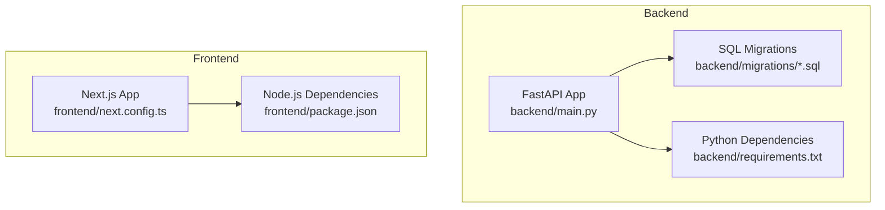
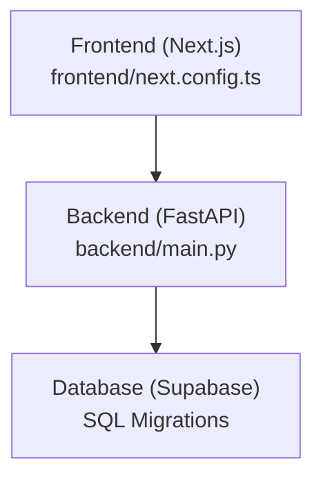
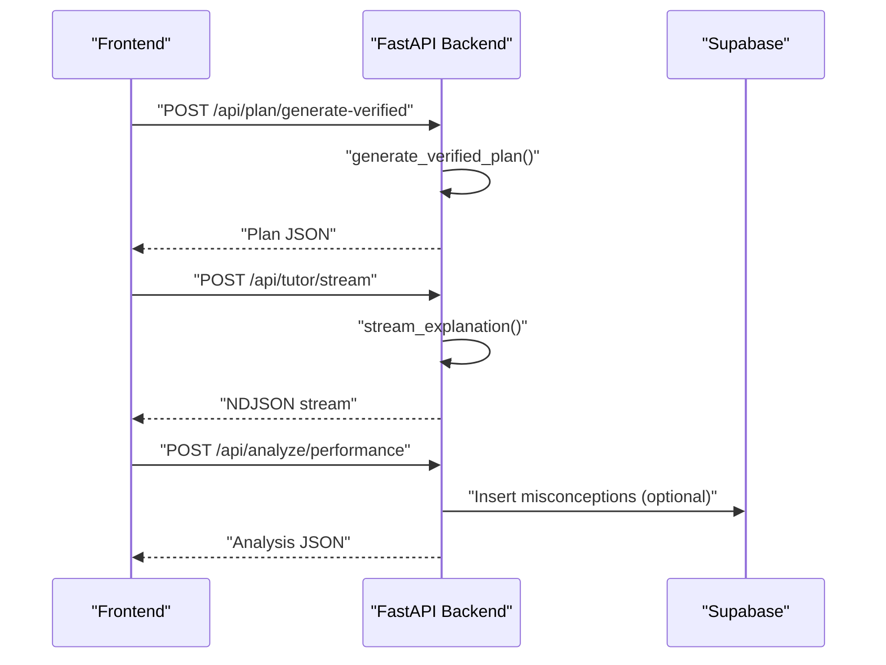
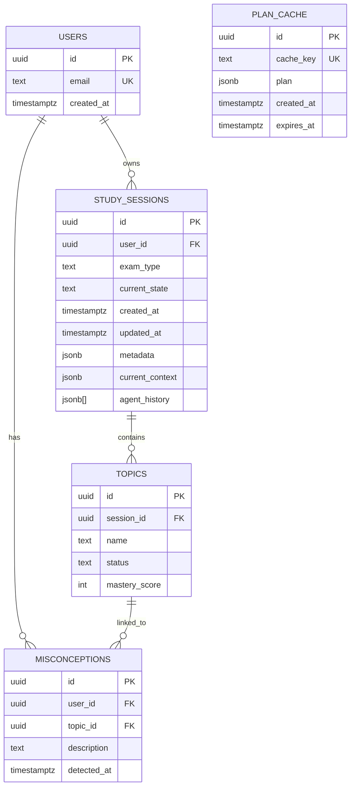
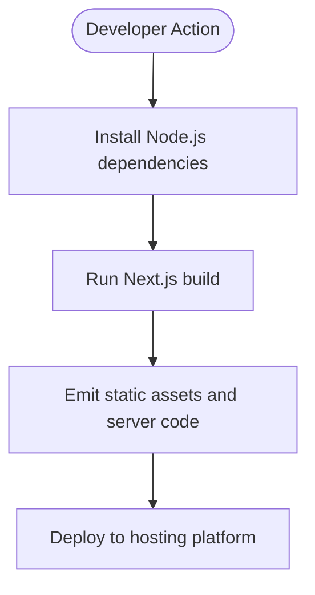
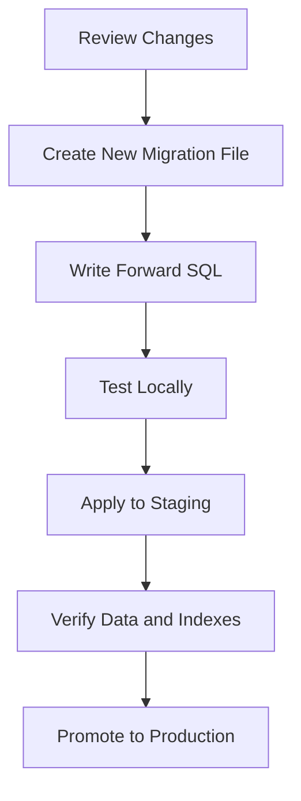

# Maintenance and Updates

<cite>
**Referenced Files in This Document**
- [backend/requirements.txt](file://backend/requirements.txt)
- [frontend/package.json](file://frontend/package.json)
- [backend/main.py](file://backend/main.py)
- [backend/migrations/001_create_core_schema.sql](file://backend/migrations/001_create_core_schema.sql)
- [backend/migrations/002_add_session_context.sql](file://backend/migrations/002_add_session_context.sql)
- [backend/migrations/003_fix_users_rls.sql](file://backend/migrations/003_fix_users_rls.sql)
- [backend/migrations/004_create_persistence_tables.sql](file://backend/migrations/004_create_persistence_tables.sql)
- [backend/tests/test_upgrades.py](file://backend/tests/test_upgrades.py)
- [backend/.dockerignore](file://backend/.dockerignore)
- [frontend/.gitignore](file://frontend/.gitignore)
- [frontend/next.config.ts](file://frontend/next.config.ts)
</cite>

## Table of Contents
1. [Introduction](#introduction)
2. [Project Structure](#project-structure)
3. [Core Components](#core-components)
4. [Architecture Overview](#architecture-overview)
5. [Detailed Component Analysis](#detailed-component-analysis)
6. [Dependency Update Procedures](#dependency-update-procedures)
7. [Database Migration Strategy](#database-migration-strategy)
8. [Update Rollout Process](#update-rollout-process)
9. [Hotfix Procedures](#hotfix-procedures)
10. [Backup and Restore](#backup-and-restore)
11. [Maintenance Windows and Downtime Planning](#maintenance-windows-and-downtime-planning)
12. [Rollback Procedures](#rollback-procedures)
13. [Monitoring and Post-Deployment Validation](#monitoring-and-post-deployment-validation)
14. [Capacity Planning and Performance Optimization](#capacity-planning-and-performance-optimization)
15. [Cost Management](#cost-management)
16. [Troubleshooting Guide](#troubleshooting-guide)
17. [Conclusion](#conclusion)

## Introduction
This document provides comprehensive maintenance and update procedures for Exammentor AI. It covers dependency updates for both backend Python packages and frontend Node.js modules, database migration strategy using SQL-based migrations, update rollout from pre-deployment testing to production, hotfix procedures, backup and restore processes, maintenance windows planning, downtime minimization, rollback procedures, monitoring and validation, capacity planning, performance optimization, and cloud cost management.

## Project Structure
The project is organized into a backend FastAPI service and a frontend Next.js application. The backend defines API endpoints, integrates with Supabase for persistence, and exposes agent-driven features. The frontend is a React application built with Next.js and TypeScript. Database schema and evolution are managed via SQL migration files.

**Diagram sources**
- [backend/main.py](file://backend/main.py#L1-L843)
- [backend/requirements.txt](file://backend/requirements.txt#L1-L32)
- [backend/migrations/001_create_core_schema.sql](file://backend/migrations/001_create_core_schema.sql#L1-L46)
- [frontend/next.config.ts](file://frontend/next.config.ts#L1-L8)
- [frontend/package.json](file://frontend/package.json#L1-L46)

**Section sources**
- [backend/main.py](file://backend/main.py#L1-L843)
- [backend/requirements.txt](file://backend/requirements.txt#L1-L32)
- [frontend/package.json](file://frontend/package.json#L1-L46)
- [frontend/next.config.ts](file://frontend/next.config.ts#L1-L8)

## Core Components
- Backend API server: Exposes endpoints for plan generation, tutoring, quizzes, performance analysis, session management, and autopilot orchestration. It integrates with Supabase for persistence and uses streaming responses for real-time UI feedback.
- Frontend Next.js application: Provides the user interface and client-side interactions. It builds with Next.js and uses Yarn for dependency management.
- Database schema: Managed via SQL migrations for users, sessions, topics, misconceptions, and caching tables. Indexes are included for performance.

Key implementation references:
- Backend entrypoint and routing: [backend/main.py](file://backend/main.py#L1-L843)
- Python dependencies: [backend/requirements.txt](file://backend/requirements.txt#L1-L32)
- Frontend dependencies and scripts: [frontend/package.json](file://frontend/package.json#L1-L46)
- Next.js configuration: [frontend/next.config.ts](file://frontend/next.config.ts#L1-L8)
- SQL migrations: [backend/migrations/001_create_core_schema.sql](file://backend/migrations/001_create_core_schema.sql#L1-L46), [backend/migrations/002_add_session_context.sql](file://backend/migrations/002_add_session_context.sql#L1-L16), [backend/migrations/003_fix_users_rls.sql](file://backend/migrations/003_fix_users_rls.sql), [backend/migrations/004_create_persistence_tables.sql](file://backend/migrations/004_create_persistence_tables.sql)

**Section sources**
- [backend/main.py](file://backend/main.py#L1-L843)
- [backend/requirements.txt](file://backend/requirements.txt#L1-L32)
- [frontend/package.json](file://frontend/package.json#L1-L46)
- [frontend/next.config.ts](file://frontend/next.config.ts#L1-L8)
- [backend/migrations/001_create_core_schema.sql](file://backend/migrations/001_create_core_schema.sql#L1-L46)
- [backend/migrations/002_add_session_context.sql](file://backend/migrations/002_add_session_context.sql#L1-L16)
- [backend/migrations/003_fix_users_rls.sql](file://backend/migrations/003_fix_users_rls.sql)
- [backend/migrations/004_create_persistence_tables.sql](file://backend/migrations/004_create_persistence_tables.sql)

## Architecture Overview
The system follows a classic backend-for-frontend pattern. The Next.js frontend communicates with the FastAPI backend over HTTP endpoints. The backend persists data to Supabase using SQL migrations and maintains session state for the autopilot feature.

**Diagram sources**
- [backend/main.py](file://backend/main.py#L1-L843)
- [frontend/next.config.ts](file://frontend/next.config.ts#L1-L8)
- [backend/migrations/001_create_core_schema.sql](file://backend/migrations/001_create_core_schema.sql#L1-L46)

**Section sources**
- [backend/main.py](file://backend/main.py#L1-L843)
- [frontend/next.config.ts](file://frontend/next.config.ts#L1-L8)
- [backend/migrations/001_create_core_schema.sql](file://backend/migrations/001_create_core_schema.sql#L1-L46)

## Detailed Component Analysis

### Backend API Endpoints and Data Flow
The backend defines endpoints for:
- Study planning and verification
- Tutoring explanations and streaming
- Quiz generation and evaluation
- Performance analysis and misconception handling
- Session management and autopilot orchestration
- User persistence and chat history

**Diagram sources**
- [backend/main.py](file://backend/main.py#L128-L222)
- [backend/main.py](file://backend/main.py#L227-L260)
- [backend/main.py](file://backend/main.py#L433-L462)

**Section sources**
- [backend/main.py](file://backend/main.py#L128-L222)
- [backend/main.py](file://backend/main.py#L227-L260)
- [backend/main.py](file://backend/main.py#L433-L462)

### Database Schema Evolution
The schema includes users, study sessions, topics, misconceptions, and caching tables. Indexes are defined for performance. Migrations add session context and plan cache.

**Diagram sources**
- [backend/migrations/001_create_core_schema.sql](file://backend/migrations/001_create_core_schema.sql#L7-L45)
- [backend/migrations/002_add_session_context.sql](file://backend/migrations/002_add_session_context.sql#L2-L15)

**Section sources**
- [backend/migrations/001_create_core_schema.sql](file://backend/migrations/001_create_core_schema.sql#L1-L46)
- [backend/migrations/002_add_session_context.sql](file://backend/migrations/002_add_session_context.sql#L1-L16)

### Frontend Build and Environment
The frontend uses Next.js with TypeScript and Yarn. Build artifacts and caches are ignored via .gitignore. The Next.js configuration file is minimal.

**Diagram sources**
- [frontend/package.json](file://frontend/package.json#L5-L10)
- [frontend/.gitignore](file://frontend/.gitignore#L16-L21)
- [frontend/next.config.ts](file://frontend/next.config.ts#L1-L8)

**Section sources**
- [frontend/package.json](file://frontend/package.json#L1-L46)
- [frontend/.gitignore](file://frontend/.gitignore#L1-L45)
- [frontend/next.config.ts](file://frontend/next.config.ts#L1-L8)

## Dependency Update Procedures

### Backend Python Packages
- Pin versions in requirements.txt to ensure reproducible environments.
- Use a virtual environment to isolate upgrades.
- Run unit and integration tests after updating dependencies.
- Validate streaming endpoints and Supabase connectivity post-upgrade.

Recommended steps:
1. Create a new branch for the upgrade.
2. Update requirements.txt with targeted version bumps.
3. Install dependencies in a clean virtual environment.
4. Execute backend tests and manual smoke tests.
5. Verify streaming endpoints and database writes.
6. Merge to staging, then to production with a release branch.

**Section sources**
- [backend/requirements.txt](file://backend/requirements.txt#L1-L32)
- [backend/.dockerignore](file://backend/.dockerignore#L1-L26)

### Frontend Node.js Modules
- Update dependencies in package.json.
- Prefer Yarn for deterministic installs.
- Run build and lint checks locally.
- Validate Next.js runtime behavior and asset generation.

Recommended steps:
1. Branch out for the update.
2. Update package.json dependencies.
3. Run yarn install and yarn build.
4. Execute lint and type checks.
5. Test interactive features and streaming UI.
6. Merge to staging and production.

**Section sources**
- [frontend/package.json](file://frontend/package.json#L1-L46)
- [frontend/.gitignore](file://frontend/.gitignore#L1-L45)

## Database Migration Strategy
The system uses SQL-based migrations stored under backend/migrations. Each migration file represents a discrete schema change. The migration set includes:
- Initial schema creation
- Addition of session context and plan cache
- Row-level security fixes
- Additional persistence tables

**Diagram sources**
- [backend/migrations/001_create_core_schema.sql](file://backend/migrations/001_create_core_schema.sql#L1-L46)
- [backend/migrations/002_add_session_context.sql](file://backend/migrations/002_add_session_context.sql#L1-L16)
- [backend/migrations/003_fix_users_rls.sql](file://backend/migrations/003_fix_users_rls.sql)
- [backend/migrations/004_create_persistence_tables.sql](file://backend/migrations/004_create_persistence_tables.sql)

**Section sources**
- [backend/migrations/001_create_core_schema.sql](file://backend/migrations/001_create_core_schema.sql#L1-L46)
- [backend/migrations/002_add_session_context.sql](file://backend/migrations/002_add_session_context.sql#L1-L16)
- [backend/migrations/003_fix_users_rls.sql](file://backend/migrations/003_fix_users_rls.sql)
- [backend/migrations/004_create_persistence_tables.sql](file://backend/migrations/004_create_persistence_tables.sql)

## Update Rollout Process
Pre-deployment:
- Run backend tests and upgrade verification suite.
- Perform frontend build and lint checks.
- Validate database migrations in a local Supabase instance.

Staging validation:
- Apply migrations to staging.
- Smoke-test all endpoints, especially streaming and session management.
- Load-test critical paths (plan generation, tutoring, autopilot).

Production deployment:
- Schedule maintenance window.
- Promote code and migrations together.
- Monitor health endpoints and key metrics.
- Validate user flows end-to-end.

**Section sources**
- [backend/tests/test_upgrades.py](file://backend/tests/test_upgrades.py#L1-L59)
- [backend/main.py](file://backend/main.py#L120-L123)

## Hotfix Procedures
Critical bugs or security patches:
- Isolate the fix in a dedicated branch.
- Include a minimal migration if schema changes are required.
- Test hotfix against staging environment.
- Deploy hotfix with a short maintenance window.
- Announce rollback window in case of regressions.

## Backup and Restore

### Application Code
- Store application code in version control (Git).
- Maintain separate branches for releases and hotfixes.
- Tag releases for traceability.

### Database Content
- Back up Supabase schema and data regularly.
- Export migrations and keep them in version control.
- Store backups offsite or in secure cloud storage.

Restore procedure:
- Restore database from backup.
- Recreate schema using migrations.
- Restart backend and frontend services.
- Validate health endpoints and user data.

## Maintenance Windows and Downtime Planning
- Schedule updates during low-traffic periods.
- Use blue-green deployments or rolling updates if supported by hosting platform.
- Keep downtime windows short; prefer incremental rollouts.
- Communicate planned maintenance to stakeholders.

## Rollback Procedures
- Keep previous container images and build artifacts.
- Revert database to last known good migration.
- Re-deploy previous application version.
- Validate rollback by checking health and key endpoints.

## Monitoring and Post-Deployment Validation
- Monitor health endpoint availability.
- Track error rates and latency for critical endpoints.
- Validate streaming responses and session state persistence.
- Confirm database writes for analytics and misconceptions.

## Capacity Planning and Performance Optimization
- Monitor CPU, memory, and network usage of backend and database.
- Scale backend instances based on concurrent streaming requests.
- Optimize database queries and ensure indexes are effective.
- Cache frequently accessed plans using the plan cache table.

## Cost Management
- Right-size compute resources based on traffic patterns.
- Use reserved or committed use discounts where applicable.
- Monitor storage growth and archive old data if needed.
- Review third-party service costs (AI APIs, hosting).

## Troubleshooting Guide
Common issues and remedies:
- Dependency conflicts: Reinstall dependencies in a clean environment; verify Python and Node versions.
- Migration failures: Inspect migration logs; apply forward-only changes; revert if necessary.
- Streaming errors: Validate backend streaming logic and network stability.
- Supabase connectivity: Check credentials and network policies; verify row-level security rules.

**Section sources**
- [backend/main.py](file://backend/main.py#L120-L123)
- [backend/tests/test_upgrades.py](file://backend/tests/test_upgrades.py#L1-L59)

## Conclusion
By following the documented procedures for dependency updates, database migrations, staged rollouts, hotfixes, backups, maintenance windows, rollbacks, monitoring, capacity planning, and cost management, Exammentor AI can maintain reliability and performance while continuously evolving.