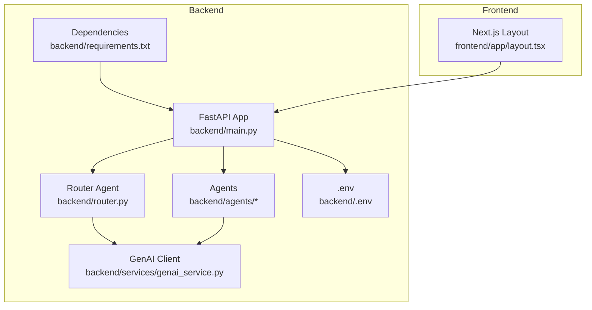
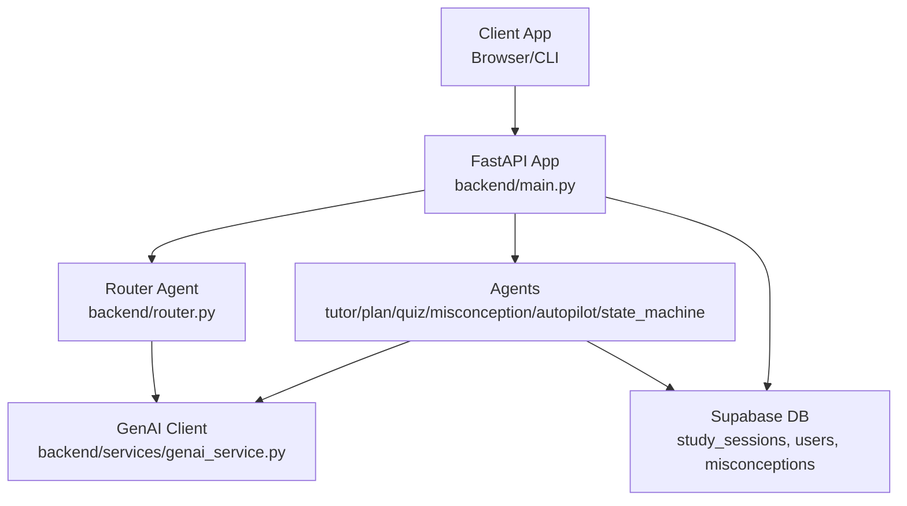
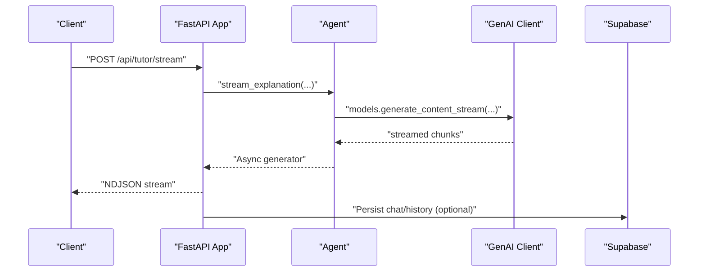
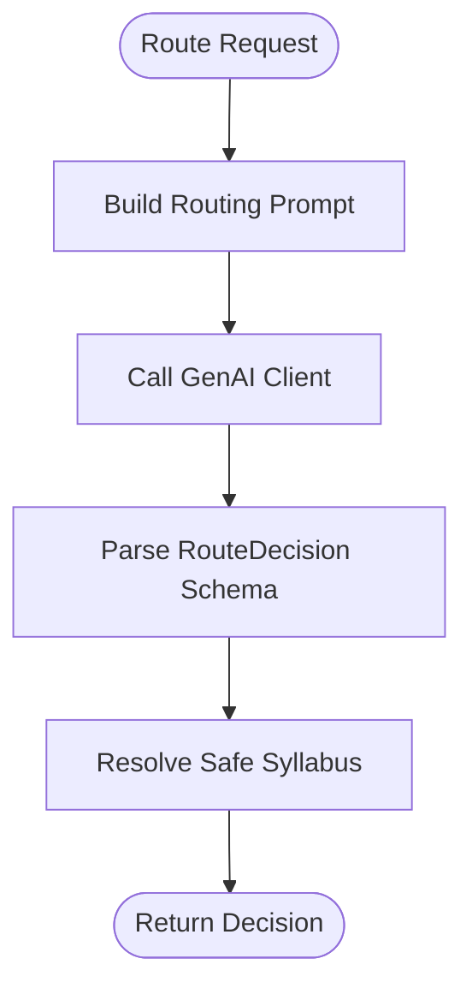
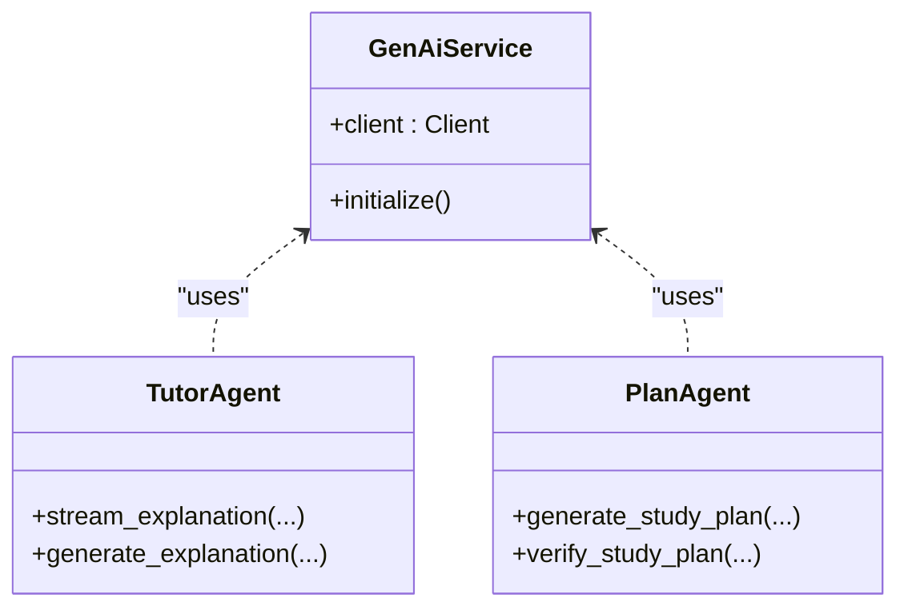
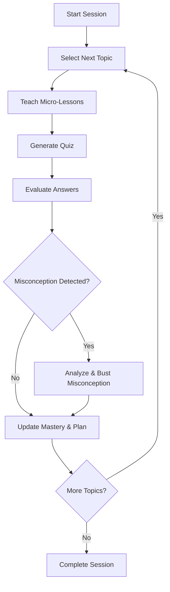
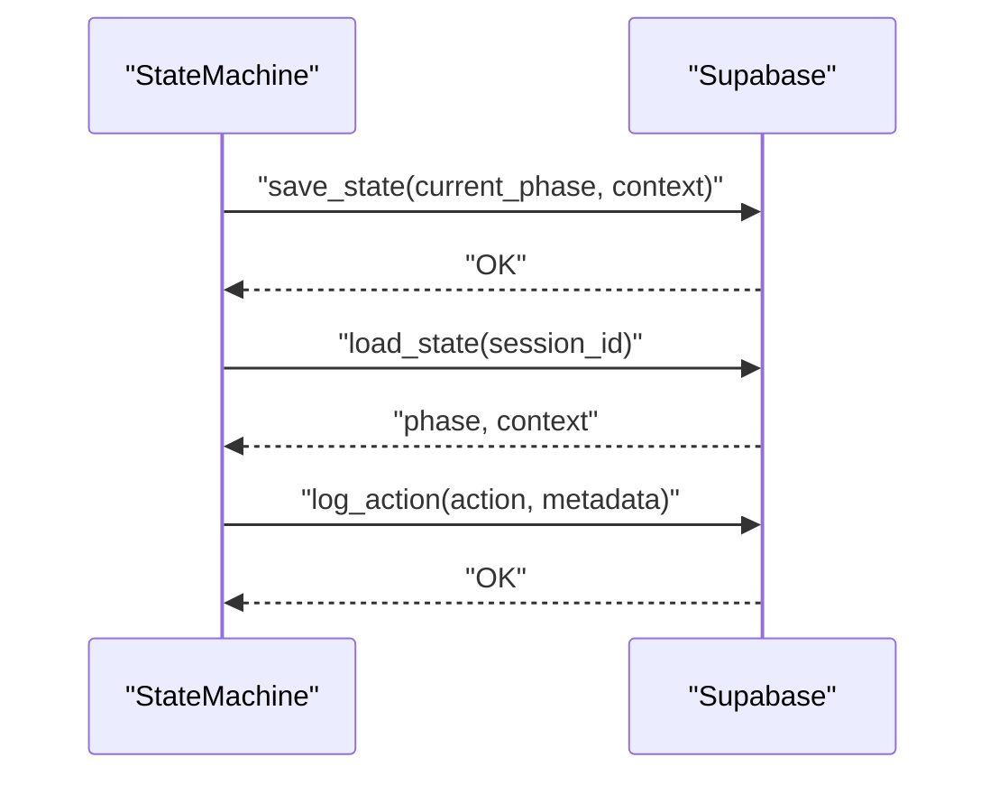
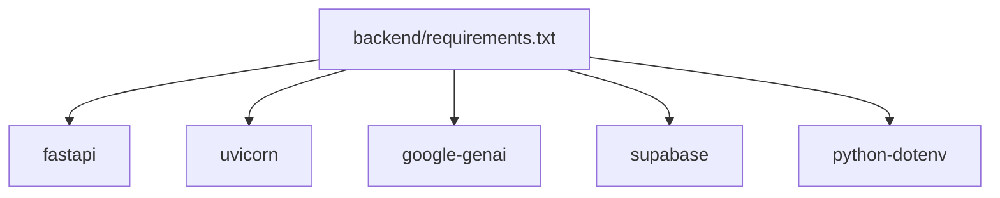

# Monitoring and Logging

<cite>
**Referenced Files in This Document**
- [backend/main.py](file://backend/main.py)
- [backend/router.py](file://backend/router.py)
- [backend/services/genai_service.py](file://backend/services/genai_service.py)
- [backend/agents/autopilot_agent.py](file://backend/agents/autopilot_agent.py)
- [backend/agents/tutor_agent.py](file://backend/agents/tutor_agent.py)
- [backend/agents/plan_agent.py](file://backend/agents/plan_agent.py)
- [backend/agents/state_machine.py](file://backend/agents/state_machine.py)
- [backend/requirements.txt](file://backend/requirements.txt)
- [backend/.env](file://backend/.env)
- [frontend/app/layout.tsx](file://frontend/app/layout.tsx)
</cite>

## Table of Contents
1. [Introduction](#introduction)
2. [Project Structure](#project-structure)
3. [Core Components](#core-components)
4. [Architecture Overview](#architecture-overview)
5. [Detailed Component Analysis](#detailed-component-analysis)
6. [Dependency Analysis](#dependency-analysis)
7. [Performance Considerations](#performance-considerations)
8. [Troubleshooting Guide](#troubleshooting-guide)
9. [Conclusion](#conclusion)
10. [Appendices](#appendices)

## Introduction
This document provides comprehensive monitoring and logging guidance for Exammentor AI. It covers logging configuration for the backend FastAPI application and frontend Next.js components, structured logging for AI agent interactions, request tracing, and performance metrics collection. It also documents monitoring setups for API response times, error rates, and AI model usage patterns, along with alerting configurations for critical system failures, database connectivity issues, and AI service unavailability. Distributed tracing for multi-agent orchestration and request flow tracking are addressed, alongside dashboard creation for system health, user engagement, and AI performance analytics. Log aggregation strategies, retention policies, and compliance considerations for educational data handling are explained, including integration with cloud monitoring platforms and custom metrics collection.

## Project Structure
The project consists of:
- Backend FastAPI application exposing AI agent endpoints and orchestration APIs
- AI agents implementing tutoring, planning, quiz generation, misconception analysis, and autopilot orchestration
- Frontend Next.js application rendering UI and routing user interactions
- Shared configuration via environment variables and centralized AI client initialization

**Diagram sources**
- [backend/main.py](file://backend/main.py#L1-L843)
- [backend/router.py](file://backend/router.py#L1-L129)
- [backend/services/genai_service.py](file://backend/services/genai_service.py#L1-L10)
- [backend/requirements.txt](file://backend/requirements.txt#L1-L32)
- [backend/.env](file://backend/.env#L1-L5)
- [frontend/app/layout.tsx](file://frontend/app/layout.tsx#L1-L41)

**Section sources**
- [backend/main.py](file://backend/main.py#L1-L843)
- [backend/router.py](file://backend/router.py#L1-L129)
- [backend/services/genai_service.py](file://backend/services/genai_service.py#L1-L10)
- [backend/requirements.txt](file://backend/requirements.txt#L1-L32)
- [backend/.env](file://backend/.env#L1-L5)
- [frontend/app/layout.tsx](file://frontend/app/layout.tsx#L1-L41)

## Core Components
- FastAPI application with AI agent endpoints, streaming support, and session management
- Router agent that interprets user intent and scopes, and selects appropriate syllabus content
- GenAI service that initializes the AI client for asynchronous model calls
- Agents for tutoring, planning, quizzes, misconception analysis, and autopilot orchestration
- State machine for session lifecycle and audit logging
- Frontend layout and theme provider for UI rendering

Key logging and monitoring hooks observed:
- Health check endpoint for basic service availability
- Streaming endpoints for real-time UI feedback and latency measurement
- Structured Pydantic models for AI outputs enabling structured logging
- Print statements for operational events and retries in autopilot orchestration
- Supabase persistence for session state and audit trails

**Section sources**
- [backend/main.py](file://backend/main.py#L120-L124)
- [backend/main.py](file://backend/main.py#L205-L223)
- [backend/router.py](file://backend/router.py#L64-L88)
- [backend/services/genai_service.py](file://backend/services/genai_service.py#L1-L10)
- [backend/agents/autopilot_agent.py](file://backend/agents/autopilot_agent.py#L142-L162)
- [backend/agents/state_machine.py](file://backend/agents/state_machine.py#L115-L136)

## Architecture Overview
The system integrates FastAPI endpoints with AI agents and Supabase for persistence. AI interactions leverage a centralized client initialized from environment variables. The router determines intent and scope, while agents produce structured outputs suitable for logging and analytics.

**Diagram sources**
- [backend/main.py](file://backend/main.py#L1-L843)
- [backend/router.py](file://backend/router.py#L64-L88)
- [backend/services/genai_service.py](file://backend/services/genai_service.py#L1-L10)
- [backend/agents/state_machine.py](file://backend/agents/state_machine.py#L54-L64)

## Detailed Component Analysis

### Backend FastAPI Application Logging and Metrics
- Health endpoint for readiness checks
- Streaming endpoints for tutoring and plan generation
- Structured request/response models enable robust logging and validation
- Error handling raises HTTP exceptions for consistent metrics

Recommended logging enhancements:
- Add request ID correlation for end-to-end tracing
- Instrument endpoint latency and error counters
- Capture structured logs for AI requests and responses
- Integrate structured logging library for JSON output

**Diagram sources**
- [backend/main.py](file://backend/main.py#L245-L261)
- [backend/agents/tutor_agent.py](file://backend/agents/tutor_agent.py#L51-L127)
- [backend/services/genai_service.py](file://backend/services/genai_service.py#L1-L10)

**Section sources**
- [backend/main.py](file://backend/main.py#L120-L124)
- [backend/main.py](file://backend/main.py#L245-L261)
- [backend/agents/tutor_agent.py](file://backend/agents/tutor_agent.py#L51-L127)

### Router Agent Logging for Intent and Scope
- Parses user input to determine intent, exam type, and scope
- Uses structured output schema for deterministic logging
- Retrieves syllabus content safely based on scope

Recommended logging:
- Log routing decisions with confidence scores
- Track scope guard outcomes and fallbacks
- Record syllabus retrieval metrics

**Diagram sources**
- [backend/router.py](file://backend/router.py#L64-L88)
- [backend/router.py](file://backend/router.py#L91-L129)

**Section sources**
- [backend/router.py](file://backend/router.py#L64-L88)
- [backend/router.py](file://backend/router.py#L91-L129)

### GenAI Service Initialization and Usage
- Centralized client initialization with environment variables
- Asynchronous model calls for streaming and structured outputs

Recommended logging:
- Log model usage counts and latency per endpoint
- Capture rate-limit and overload handling events
- Track structured output parsing success/failure

**Diagram sources**
- [backend/services/genai_service.py](file://backend/services/genai_service.py#L1-L10)
- [backend/agents/tutor_agent.py](file://backend/agents/tutor_agent.py#L131-L186)
- [backend/agents/plan_agent.py](file://backend/agents/plan_agent.py#L49-L87)

**Section sources**
- [backend/services/genai_service.py](file://backend/services/genai_service.py#L1-L10)
- [backend/agents/tutor_agent.py](file://backend/agents/tutor_agent.py#L131-L186)
- [backend/agents/plan_agent.py](file://backend/agents/plan_agent.py#L49-L87)

### Autopilot Orchestration Logging and Retries
- Comprehensive run log with timestamps, actions, reasoning, and durations
- Retry logic with exponential backoff for AI service overloads
- Interactive waiting for user answers with event signaling

Recommended logging:
- Emit structured autopilot run logs for dashboards
- Track retry counts and delays per operation
- Log user interaction timing and completion

**Diagram sources**
- [backend/agents/autopilot_agent.py](file://backend/agents/autopilot_agent.py#L182-L200)
- [backend/agents/autopilot_agent.py](file://backend/agents/autopilot_agent.py#L142-L162)

**Section sources**
- [backend/agents/autopilot_agent.py](file://backend/agents/autopilot_agent.py#L142-L162)
- [backend/agents/autopilot_agent.py](file://backend/agents/autopilot_agent.py#L164-L181)

### State Machine and Audit Logging
- Tracks study phases and validates transitions
- Persists session state and logs agent actions to Supabase
- Provides audit trail for compliance and debugging

Recommended logging:
- Log state transitions with timestamps and reasons
- Persist structured action logs for analytics
- Monitor persistence failures and retries

**Diagram sources**
- [backend/agents/state_machine.py](file://backend/agents/state_machine.py#L80-L95)
- [backend/agents/state_machine.py](file://backend/agents/state_machine.py#L96-L114)
- [backend/agents/state_machine.py](file://backend/agents/state_machine.py#L115-L136)

**Section sources**
- [backend/agents/state_machine.py](file://backend/agents/state_machine.py#L80-L95)
- [backend/agents/state_machine.py](file://backend/agents/state_machine.py#L96-L114)
- [backend/agents/state_machine.py](file://backend/agents/state_machine.py#L115-L136)

### Frontend Next.js Logging and Observability
- Layout and theme provider for UI rendering
- No explicit logging configuration present in the referenced file

Recommended logging:
- Add client-side telemetry for page load and interaction metrics
- Integrate with backend for cross-service tracing
- Ensure privacy-compliant logging for educational data

**Section sources**
- [frontend/app/layout.tsx](file://frontend/app/layout.tsx#L1-L41)

## Dependency Analysis
External dependencies relevant to monitoring and logging:
- FastAPI and Uvicorn for web server and ASGI runtime
- google-genai for AI model calls
- supabase for persistence and audit logging
- python-dotenv for environment configuration

**Diagram sources**
- [backend/requirements.txt](file://backend/requirements.txt#L1-L32)

**Section sources**
- [backend/requirements.txt](file://backend/requirements.txt#L1-L32)

## Performance Considerations
- Streaming endpoints reduce perceived latency and enable real-time feedback
- Structured outputs improve reliability and enable consistent logging
- Retry logic mitigates transient AI service overloads
- Environment-driven model selection allows tuning for performance

Recommendations:
- Instrument endpoint latency histograms and error rates
- Track AI model usage and cost metrics
- Monitor streaming throughput and chunk delivery times
- Implement circuit breakers for downstream AI services

[No sources needed since this section provides general guidance]

## Troubleshooting Guide
Common issues and remedies:
- AI service overloads: The autopilot engine implements retry with exponential backoff for 503/429 scenarios
- Supabase persistence failures: State machine logs persistence errors; verify credentials and network connectivity
- Missing environment variables: Ensure GEMINI_API_KEY, SUPABASE_URL, SUPABASE_KEY are configured
- Streaming timeouts: Verify client-side consumption and network stability

Operational logging points:
- Autopilot retry messages and delays
- State machine save/load and action logging failures
- Endpoint error handling raising HTTP exceptions

**Section sources**
- [backend/agents/autopilot_agent.py](file://backend/agents/autopilot_agent.py#L142-L162)
- [backend/agents/state_machine.py](file://backend/agents/state_machine.py#L94-L95)
- [backend/agents/state_machine.py](file://backend/agents/state_machine.py#L112-L113)
- [backend/agents/state_machine.py](file://backend/agents/state_machine.py#L135-L136)
- [backend/.env](file://backend/.env#L1-L5)

## Conclusion
This guide outlines a practical approach to monitoring and logging for Exammentor AI, focusing on structured logging for AI agent interactions, request tracing, and performance metrics. By instrumenting endpoints, agents, and state persistence, teams can build robust dashboards, alerts, and analytics for system health, user engagement, and AI performance. Integrating with cloud monitoring platforms and ensuring compliance for educational data will further strengthen observability.

[No sources needed since this section summarizes without analyzing specific files]

## Appendices

### A. Logging Configuration Checklist
- Backend
  - Add structured logging with request IDs and correlation IDs
  - Instrument FastAPI lifespan for startup/shutdown metrics
  - Log AI model calls with prompts, responses, and timings
  - Persist audit logs via state machine
- Frontend
  - Add client-side telemetry for navigation and interaction metrics
  - Ensure privacy-compliant logging and consent mechanisms

[No sources needed since this section provides general guidance]

### B. Alerting Configuration Examples
- Critical system failures: Service health check failures, startup errors
- Database connectivity: Supabase persistence failures, connection timeouts
- AI service unavailability: Rate limits, overloads, timeouts
- Distributed tracing: Missing spans, slow paths, cross-service latency

[No sources needed since this section provides general guidance]

### C. Dashboard Suggestions
- System health: CPU, memory, uptime, error rates
- User engagement: Active sessions, session duration, completion rates
- AI performance: Model latency, token usage, structured output success

[No sources needed since this section provides general guidance]

### D. Compliance and Retention
- Data minimization: Log only necessary fields for diagnostics
- Privacy controls: Anonymize personal data, obtain consent
- Retention policies: Define log retention periods per jurisdiction
- Audit trails: Maintain immutable records for state changes and agent actions

[No sources needed since this section provides general guidance]