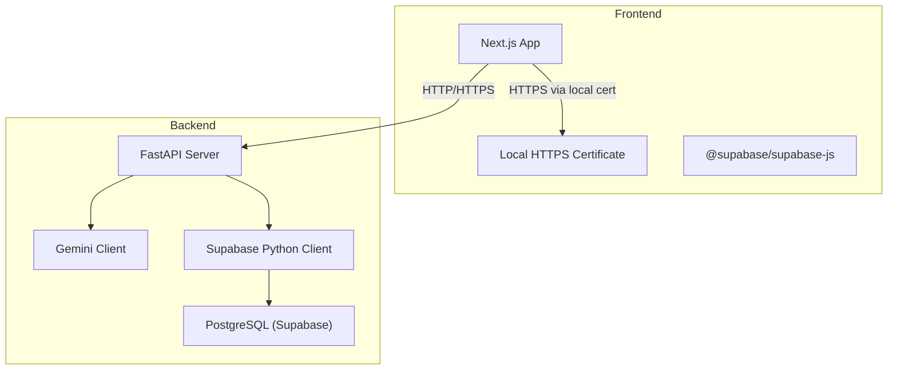
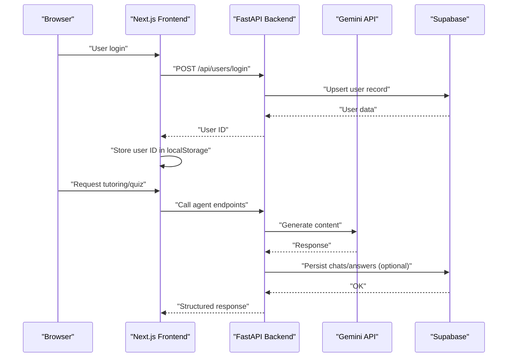
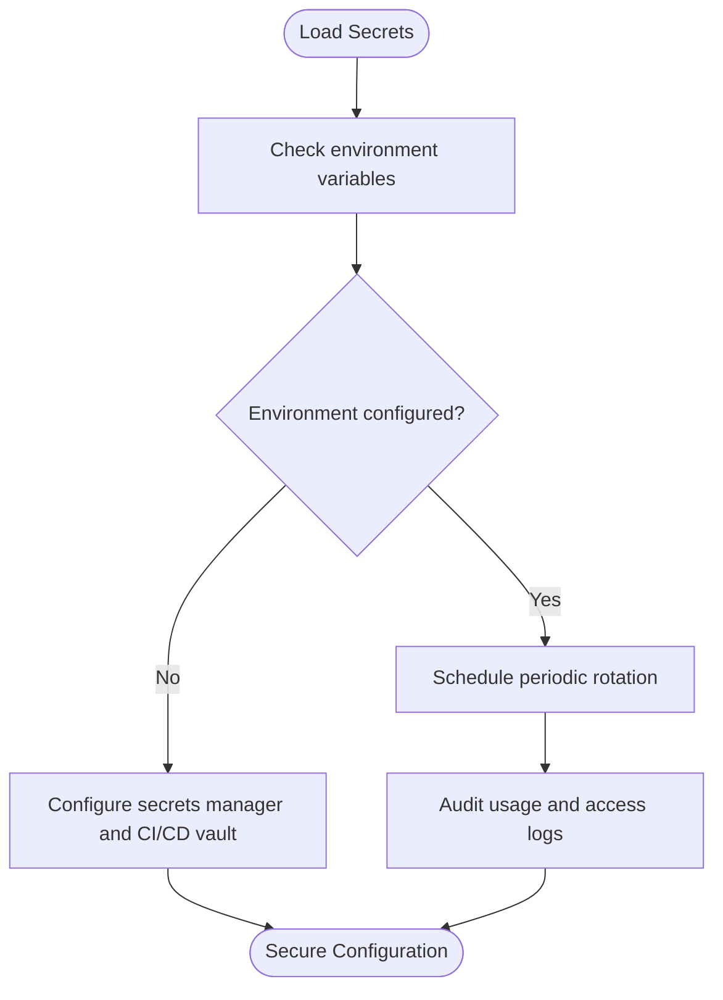
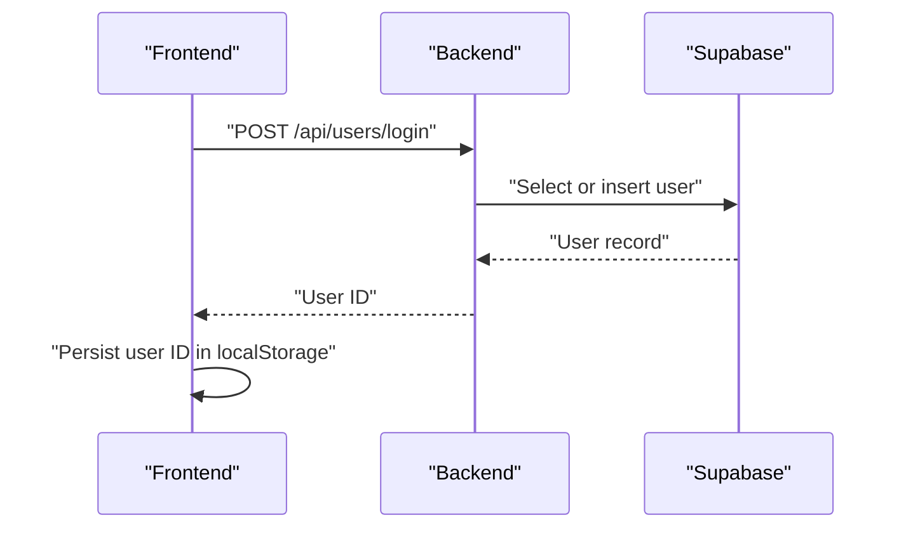
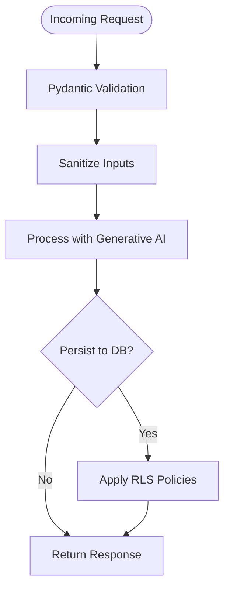
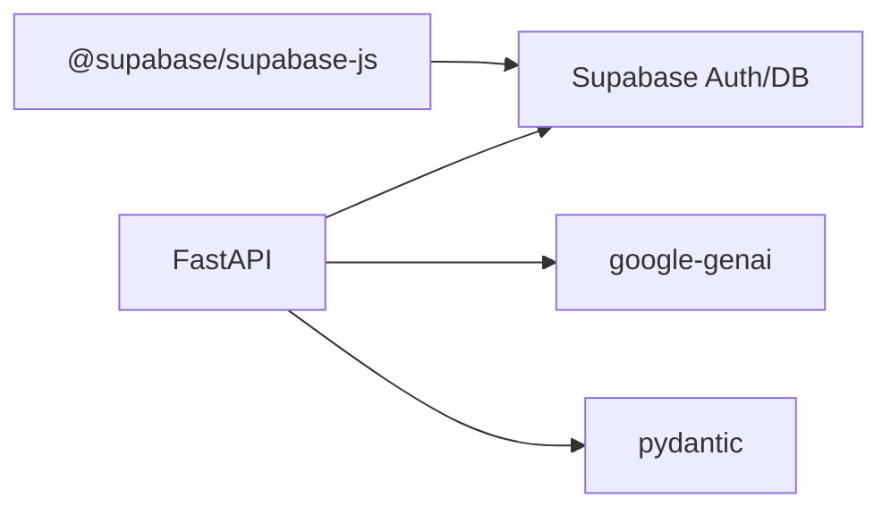

# Security and Compliance

<cite>
**Referenced Files in This Document**
- [backend/main.py](file://backend/main.py)
- [backend/router.py](file://backend/router.py)
- [backend/services/genai_service.py](file://backend/services/genai_service.py)
- [backend/.env](file://backend/.env)
- [backend/requirements.txt](file://backend/requirements.txt)
- [backend/migrations/003_fix_users_rls.sql](file://backend/migrations/003_fix_users_rls.sql)
- [frontend/.env.local](file://frontend/.env.local)
- [frontend/package.json](file://frontend/package.json)
- [frontend/next.config.ts](file://frontend/next.config.ts)
- [frontend/app/actions.ts](file://frontend/app/actions.ts)
- [frontend/app/learn/[topicId]/page.tsx](file://frontend/app/learn/[topicId]/page.tsx)
- [frontend/certificates/localhost.pem](file://frontend/certificates/localhost.pem)
- [frontend/app/layout.tsx](file://frontend/app/layout.tsx)
</cite>

## Table of Contents
1. [Introduction](#introduction)
2. [Project Structure](#project-structure)
3. [Core Components](#core-components)
4. [Architecture Overview](#architecture-overview)
5. [Detailed Component Analysis](#detailed-component-analysis)
6. [Dependency Analysis](#dependency-analysis)
7. [Performance Considerations](#performance-considerations)
8. [Troubleshooting Guide](#troubleshooting-guide)
9. [Conclusion](#conclusion)
10. [Appendices](#appendices)

## Introduction
This document provides comprehensive security and compliance guidance for Exammentor AI. It focuses on secure communication, API key management, authentication and authorization, data privacy, input validation and sanitization, deployment hardening, incident response, audits, and applicable compliance frameworks for educational technology platforms.

## Project Structure
The platform comprises:
- Frontend (Next.js) with local HTTPS certificate support and Supabase client integration
- Backend (FastAPI) exposing agent-driven endpoints, integrating Supabase for persistence and authentication, and Gemini for generative AI
- Environment configuration for API keys and service URLs
- Database migration enabling Row Level Security (RLS) for privacy controls

**Diagram sources**
- [frontend/certificates/localhost.pem](file://frontend/certificates/localhost.pem#L1-L25)
- [frontend/package.json](file://frontend/package.json#L11-L31)
- [backend/main.py](file://backend/main.py#L17-L21)
- [backend/services/genai_service.py](file://backend/services/genai_service.py#L1-L10)
- [backend/.env](file://backend/.env#L1-L5)

**Section sources**
- [frontend/next.config.ts](file://frontend/next.config.ts#L1-L8)
- [frontend/package.json](file://frontend/package.json#L11-L31)
- [backend/main.py](file://backend/main.py#L17-L21)
- [backend/services/genai_service.py](file://backend/services/genai_service.py#L1-L10)
- [backend/.env](file://backend/.env#L1-L5)

## Core Components
- Secure transport: Local HTTPS certificate for development; production-grade TLS should be enforced at ingress/load balancer level
- Authentication and authorization: Supabase Auth for user login; Supabase RLS for row-level access control
- API key management: Gemini API key loaded from environment; database credentials and Supabase keys from environment
- Data privacy: RLS policies on sensitive tables; minimal data retention and explicit persistence decisions
- Input validation: Pydantic models define request schemas; additional validation recommended for untrusted inputs
- Deployment: Docker-based packaging and Uvicorn/Gunicorn runtime; production requires hardened container and network policies

**Section sources**
- [frontend/certificates/localhost.pem](file://frontend/certificates/localhost.pem#L1-L25)
- [backend/.env](file://backend/.env#L1-L5)
- [backend/migrations/003_fix_users_rls.sql](file://backend/migrations/003_fix_users_rls.sql#L1-L40)
- [backend/main.py](file://backend/main.py#L42-L116)

## Architecture Overview
The system integrates frontend, backend, and external services with security-relevant flows:

**Diagram sources**
- [frontend/app/learn/[topicId]/page.tsx](file://frontend/app/learn/[topicId]/page.tsx#L99-L127)
- [backend/main.py](file://backend/main.py#L763-L776)
- [backend/services/genai_service.py](file://backend/services/genai_service.py#L1-L10)
- [backend/migrations/003_fix_users_rls.sql](file://backend/migrations/003_fix_users_rls.sql#L1-L40)

## Detailed Component Analysis

### SSL/TLS Configuration for Secure Communication
- Development: Local HTTPS certificate present for the frontend development server
- Production: Enforce TLS termination at ingress/load balancer; configure strong ciphers and protocols; automate certificate renewal
- Internal service-to-service: Ensure backend endpoints are served over HTTPS; avoid plain HTTP in production environments

Recommended practices:
- Use a reverse proxy (e.g., Nginx, Caddy) or cloud load balancer with TLS
- Enforce HSTS headers and modern TLS versions
- Rotate certificates regularly and monitor expiration

**Section sources**
- [frontend/certificates/localhost.pem](file://frontend/certificates/localhost.pem#L1-L25)
- [frontend/package.json](file://frontend/package.json#L6-L6)

### API Key Management for Gemini AI Access
Current state:
- Gemini API key loaded from environment variables
- Supabase URL and anonymous key loaded from environment variables

Recommended secure practices:
- Store secrets in a secrets manager (e.g., cloud KMS, HashiCorp Vault)
- Use short-lived API keys where possible; rotate keys periodically
- Restrict key scope and permissions; avoid embedding keys in client-side code
- Audit key usage and revoke compromised keys immediately

**Section sources**
- [backend/.env](file://backend/.env#L1-L5)
- [frontend/.env.local](file://frontend/.env.local#L1-L3)
- [backend/services/genai_service.py](file://backend/services/genai_service.py#L1-L10)

### Authentication and Authorization with Supabase Auth
- User login endpoint creates or retrieves users by name
- Supabase RLS policies applied to users, chats, and quizzes tables
- Frontend stores user ID locally after login

Security considerations:
- Enforce Supabase Auth for protected routes
- Apply RLS policies to prevent unauthorized access
- Avoid storing sensitive user identifiers in client-side storage beyond necessity
- Implement session timeout and logout flows

**Diagram sources**
- [backend/main.py](file://backend/main.py#L763-L776)
- [frontend/app/learn/[topicId]/page.tsx](file://frontend/app/learn/[topicId]/page.tsx#L99-L127)
- [backend/migrations/003_fix_users_rls.sql](file://backend/migrations/003_fix_users_rls.sql#L1-L40)

**Section sources**
- [backend/main.py](file://backend/main.py#L763-L776)
- [backend/migrations/003_fix_users_rls.sql](file://backend/migrations/003_fix_users_rls.sql#L1-L40)
- [frontend/app/learn/[topicId]/page.tsx](file://frontend/app/learn/[topicId]/page.tsx#L99-L127)

### Role-Based Access Control and Session Management
- RLS policies enable fine-grained access control on tables
- Session management persists state via Supabase; consider adding session tokens and refresh mechanisms
- Frontend session handled via local storage; ensure secure storage and clearing on logout

Recommendations:
- Define explicit roles and policy conditions
- Enforce JWT-based session validation on backend
- Implement automatic logout after inactivity

**Section sources**
- [backend/migrations/003_fix_users_rls.sql](file://backend/migrations/003_fix_users_rls.sql#L1-L40)
- [backend/main.py](file://backend/main.py#L516-L556)
- [frontend/app/learn/[topicId]/page.tsx](file://frontend/app/learn/[topicId]/page.tsx#L99-L127)

### Data Privacy and Educational Data Protection (Student Data)
- Minimal persistence: Only persist data when explicitly requested (e.g., misconceptions, chats)
- RLS policies protect access to sensitive tables
- Consider data minimization and retention policies aligned with educational regulations

GDPR considerations:
- Lawfulness, fairness, transparency in processing
- Data minimization and purpose limitation
- Storage limitation and security of data
- Data portability and rectification rights
- Mechanisms for consent withdrawal and data deletion

**Section sources**
- [backend/main.py](file://backend/main.py#L447-L462)
- [backend/main.py](file://backend/main.py#L491-L501)
- [backend/migrations/003_fix_users_rls.sql](file://backend/migrations/003_fix_users_rls.sql#L1-L40)

### Input Validation, Sanitization, and Vulnerability Protection
Current state:
- Pydantic models define request schemas
- Base64 decoding and PDF parsing occur in backend

Recommended protections:
- Validate and sanitize all untrusted inputs (paths, filenames, base64)
- Implement Content Security Policy (CSP) headers
- Add CSRF protection for state-changing requests
- Prevent SQL injection via ORM/SDK usage and parameterized queries
- Prevent XSS by escaping HTML and using safe rendering libraries

**Section sources**
- [backend/main.py](file://backend/main.py#L42-L116)
- [backend/router.py](file://backend/router.py#L64-L88)

### Secure Deployment Practices
- Container hardening: Use minimal base images, non-root users, and read-only filesystems
- Network security: Enforce firewall rules, allow only necessary ports, segment networks
- Secrets management: Inject secrets via environment variables or secret managers
- Runtime hardening: Disable unnecessary capabilities, apply resource limits, enable logging and monitoring

**Section sources**
- [backend/requirements.txt](file://backend/requirements.txt#L1-L32)
- [backend/main.py](file://backend/main.py#L17-L21)

### Incident Response, Audits, and Vulnerability Assessment
- Logging: Capture request IDs, timestamps, and error contexts
- Auditing: Maintain agent action logs and session histories
- Vulnerability scanning: Integrate SAST/DAST scans in CI/CD
- Response playbook: Define escalation paths, remediation steps, and communication procedures

**Section sources**
- [backend/agents/state_machine.py](file://backend/agents/state_machine.py#L115-L135)

## Dependency Analysis
External dependencies relevant to security:
- FastAPI and Uvicorn/Gunicorn for runtime
- Supabase client for authentication and persistence
- Google GenAI SDK for Gemini integration
- Pydantic for schema validation

**Diagram sources**
- [frontend/package.json](file://frontend/package.json#L16-L16)
- [backend/requirements.txt](file://backend/requirements.txt#L8-L31)
- [backend/services/genai_service.py](file://backend/services/genai_service.py#L1-L10)

**Section sources**
- [frontend/package.json](file://frontend/package.json#L11-L31)
- [backend/requirements.txt](file://backend/requirements.txt#L1-L32)

## Performance Considerations
- Minimize payload sizes for streaming endpoints
- Cache validated schemas and reduce repeated DB lookups
- Use connection pooling for Supabase and Gemini clients
- Monitor latency and throughput for agent endpoints

## Troubleshooting Guide
Common issues and mitigations:
- CORS misconfiguration: Review middleware origins and headers
- Supabase connectivity: Verify URL and keys; check RLS policies
- Gemini quota or rate limiting: Implement retry/backoff and fallback strategies
- Frontend fetch failures: Add robust retry logic and error surfaces

**Section sources**
- [backend/main.py](file://backend/main.py#L30-L37)
- [frontend/app/actions.ts](file://frontend/app/actions.ts#L22-L54)

## Conclusion
The platform establishes foundational security controls with Supabase Auth and RLS, environment-based secrets, and Pydantic validation. To achieve robust security and compliance, deploy hardened infrastructure, enforce strict TLS, implement comprehensive input validation, adopt secure coding standards, and establish incident response and audit processes tailored to educational data protection.

## Appendices

### Compliance Frameworks for Educational Technology Platforms
- GDPR: Data protection by design, lawfulness, transparency, data minimization, storage limitation, integrity, confidentiality
- FERPA: Protects student education records; restricts disclosure without consent
- CCPA/CPRA: Consumer privacy rights, access, deletion, opt-out
- ISO/IEC 27001: Information security management systems
- SOC 2: Security, availability, confidentiality, processing integrity, and privacy