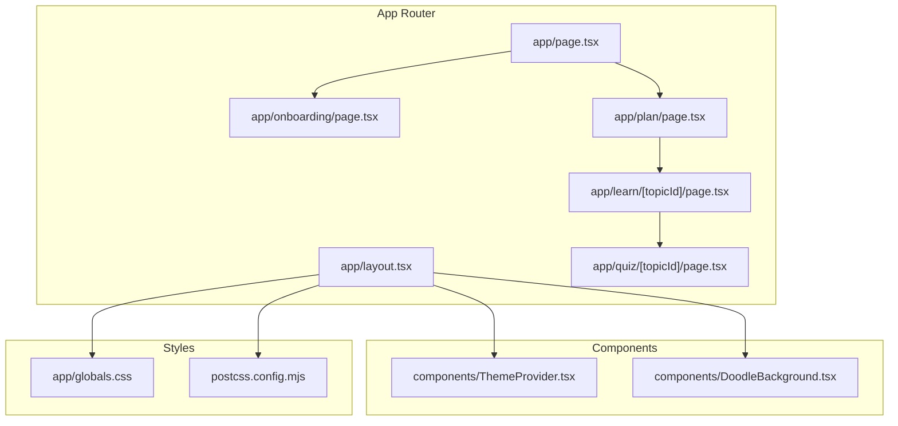
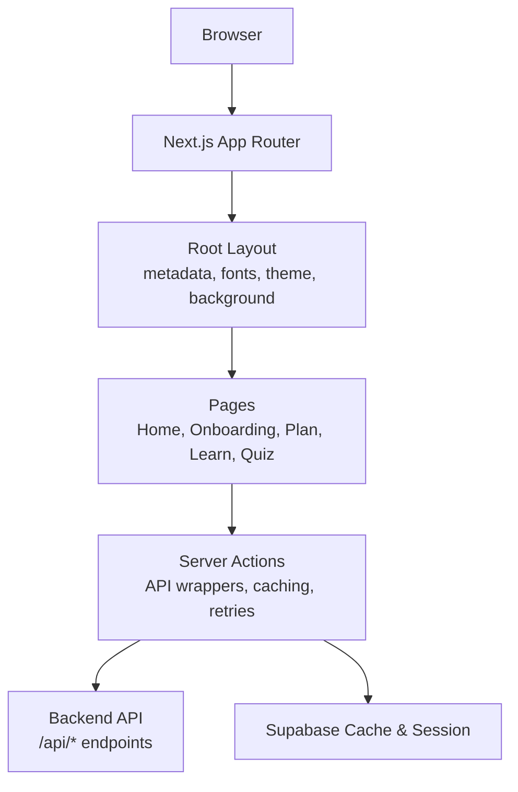
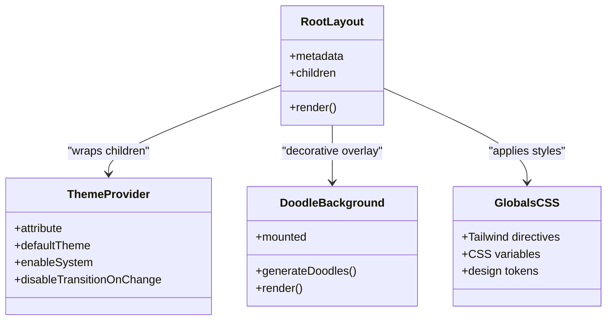
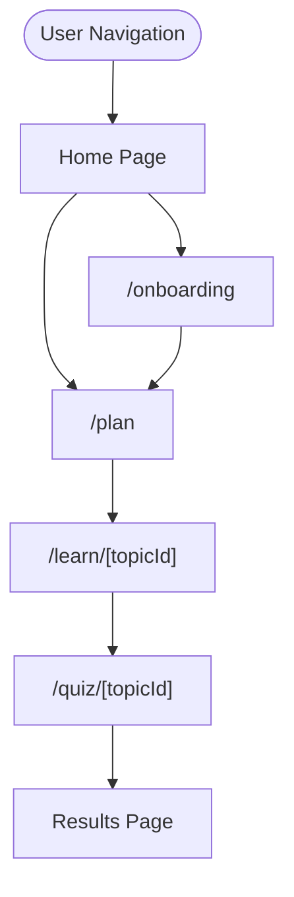
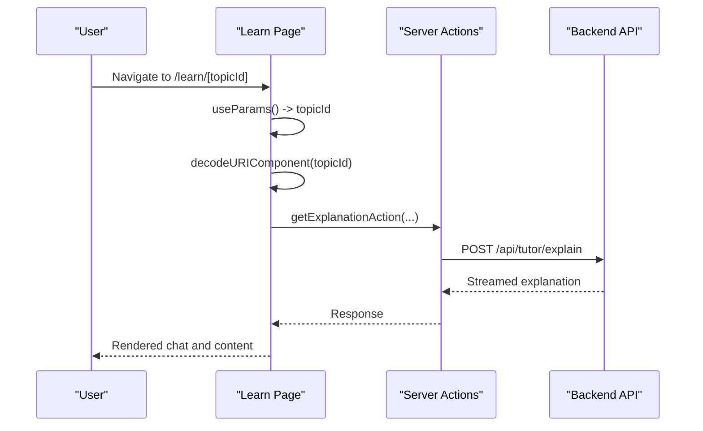
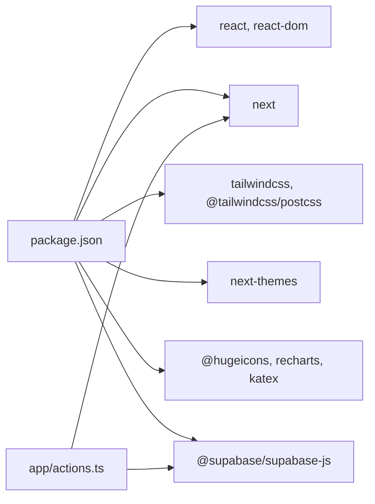

# Application Structure

<cite>
**Referenced Files in This Document**
- [layout.tsx](file://frontend/app/layout.tsx)
- [page.tsx](file://frontend/app/page.tsx)
- [onboarding/page.tsx](file://frontend/app/onboarding/page.tsx)
- [learn/[topicId]/page.tsx](file://frontend/app/learn/[topicId]/page.tsx)
- [quiz/[topicId]/page.tsx](file://frontend/app/quiz/[topicId]/page.tsx)
- [plan/page.tsx](file://frontend/app/plan/page.tsx)
- [ThemeProvider.tsx](file://frontend/components/ThemeProvider.tsx)
- [DoodleBackground.tsx](file://frontend/components/DoodleBackground.tsx)
- [actions.ts](file://frontend/app/actions.ts)
- [globals.css](file://frontend/app/globals.css)
- [postcss.config.mjs](file://frontend/postcss.config.mjs)
- [next.config.ts](file://frontend/next.config.ts)
- [package.json](file://frontend/package.json)
- [tsconfig.json](file://frontend/tsconfig.json)
</cite>

## Table of Contents
1. [Introduction](#introduction)
2. [Project Structure](#project-structure)
3. [Core Components](#core-components)
4. [Architecture Overview](#architecture-overview)
5. [Detailed Component Analysis](#detailed-component-analysis)
6. [Dependency Analysis](#dependency-analysis)
7. [Performance Considerations](#performance-considerations)
8. [Troubleshooting Guide](#troubleshooting-guide)
9. [Conclusion](#conclusion)

## Introduction
This document explains the Next.js application structure and routing system for the ExamMentor AI platform. It covers the App Router implementation, dynamic routing patterns for onboarding, study plans, topic learning, and quizzes. It also documents the root layout configuration with theme provider integration and font loading, global styling via Tailwind CSS and custom fonts, metadata and HTML document setup, component hierarchy, route parameters handling for dynamic URLs, build configuration and asset optimization, hydration warnings and SSR considerations, and guidance for extending the routing system.

## Project Structure
The frontend is a Next.js 16 application using the App Router. Pages are organized under the app directory with conventional nested routes and dynamic segments. Shared UI components and providers live under components. Global styles are centralized in app/globals.css with PostCSS configuration in postcss.config.mjs. The root layout defines metadata, fonts, theme provider, and background decoration.

**Diagram sources**
- [layout.tsx](file://frontend/app/layout.tsx#L1-L41)
- [page.tsx](file://frontend/app/page.tsx#L1-L198)
- [onboarding/page.tsx](file://frontend/app/onboarding/page.tsx#L1-L472)
- [plan/page.tsx](file://frontend/app/plan/page.tsx#L1-L268)
- [learn/[topicId]/page.tsx](file://frontend/app/learn/[topicId]/page.tsx#L1-L490)
- [quiz/[topicId]/page.tsx](file://frontend/app/quiz/[topicId]/page.tsx#L1-L649)
- [ThemeProvider.tsx](file://frontend/components/ThemeProvider.tsx#L1-L21)
- [DoodleBackground.tsx](file://frontend/components/DoodleBackground.tsx#L1-L110)
- [globals.css](file://frontend/app/globals.css#L1-L362)
- [postcss.config.mjs](file://frontend/postcss.config.mjs#L1-L8)

**Section sources**
- [layout.tsx](file://frontend/app/layout.tsx#L1-L41)
- [page.tsx](file://frontend/app/page.tsx#L1-L198)
- [onboarding/page.tsx](file://frontend/app/onboarding/page.tsx#L1-L472)
- [plan/page.tsx](file://frontend/app/plan/page.tsx#L1-L268)
- [learn/[topicId]/page.tsx](file://frontend/app/learn/[topicId]/page.tsx#L1-L490)
- [quiz/[topicId]/page.tsx](file://frontend/app/quiz/[topicId]/page.tsx#L1-L649)
- [ThemeProvider.tsx](file://frontend/components/ThemeProvider.tsx#L1-L21)
- [DoodleBackground.tsx](file://frontend/components/DoodleBackground.tsx#L1-L110)
- [globals.css](file://frontend/app/globals.css#L1-L362)
- [postcss.config.mjs](file://frontend/postcss.config.mjs#L1-L8)

## Core Components
- Root Layout: Defines metadata, loads Poppins and Geist Mono fonts, applies theme provider and doodle background, and sets global CSS.
- Theme Provider: Wraps children with next-themes to manage light/dark mode and system preference.
- Doodle Background: Renders randomized floating illustrations behind content for a playful UI.
- Global Styles: Tailwind-based design system with CSS variables for dual themes (light/default and dark), typography, shadows, and animations.
- Routing Pages:
  - Home: Entry point with navigation to onboarding, plan, and autopilot.
  - Onboarding: Multi-step form to generate a verified study plan with streaming verification.
  - Plan: Displays daily schedule and links to topic learning.
  - Learn: Interactive AI tutoring with optional PDF/image context and chat.
  - Quiz: Adaptive quiz with misconception detection and redemption questions.

**Section sources**
- [layout.tsx](file://frontend/app/layout.tsx#L1-L41)
- [ThemeProvider.tsx](file://frontend/components/ThemeProvider.tsx#L1-L21)
- [DoodleBackground.tsx](file://frontend/components/DoodleBackground.tsx#L1-L110)
- [globals.css](file://frontend/app/globals.css#L1-L362)
- [page.tsx](file://frontend/app/page.tsx#L1-L198)
- [onboarding/page.tsx](file://frontend/app/onboarding/page.tsx#L1-L472)
- [plan/page.tsx](file://frontend/app/plan/page.tsx#L1-L268)
- [learn/[topicId]/page.tsx](file://frontend/app/learn/[topicId]/page.tsx#L1-L490)
- [quiz/[topicId]/page.tsx](file://frontend/app/quiz/[topicId]/page.tsx#L1-L649)

## Architecture Overview
The application follows a layered architecture:
- Presentation Layer: App Router pages and shared UI components.
- Styling Layer: Tailwind CSS with a custom design system and CSS variables for themes.
- Data Layer: Server actions encapsulate API calls to the backend service, with retry logic and semantic caching.
- Integration Layer: Supabase client for caching and session persistence.

**Diagram sources**
- [layout.tsx](file://frontend/app/layout.tsx#L1-L41)
- [page.tsx](file://frontend/app/page.tsx#L1-L198)
- [onboarding/page.tsx](file://frontend/app/onboarding/page.tsx#L1-L472)
- [plan/page.tsx](file://frontend/app/plan/page.tsx#L1-L268)
- [learn/[topicId]/page.tsx](file://frontend/app/learn/[topicId]/page.tsx#L1-L490)
- [quiz/[topicId]/page.tsx](file://frontend/app/quiz/[topicId]/page.tsx#L1-L649)
- [actions.ts](file://frontend/app/actions.ts#L1-L512)

## Detailed Component Analysis

### Root Layout and Theme Provider
- Metadata: Title and description configured at the root.
- Fonts: Poppins and Geist Mono loaded via next/font with CSS variables for dynamic theming.
- Theme Provider: next-themes manages theme switching with system preference disabled and transitions disabled for predictable SSR behavior.
- Background: DoodleBackground renders randomized illustrations client-side to avoid hydration mismatches.
- Global CSS: Imports Tailwind directives and custom design tokens mapped to CSS variables.

**Diagram sources**
- [layout.tsx](file://frontend/app/layout.tsx#L1-L41)
- [ThemeProvider.tsx](file://frontend/components/ThemeProvider.tsx#L1-L21)
- [DoodleBackground.tsx](file://frontend/components/DoodleBackground.tsx#L1-L110)
- [globals.css](file://frontend/app/globals.css#L1-L362)

**Section sources**
- [layout.tsx](file://frontend/app/layout.tsx#L1-L41)
- [ThemeProvider.tsx](file://frontend/components/ThemeProvider.tsx#L1-L21)
- [DoodleBackground.tsx](file://frontend/components/DoodleBackground.tsx#L1-L110)
- [globals.css](file://frontend/app/globals.css#L1-L362)

### Dynamic Routing Patterns
- Onboarding: Static route under app/onboarding/page.tsx; generates plan and persists to localStorage.
- Study Plan: Static route under app/plan/page.tsx; reads localStorage and navigates to first topic.
- Topic Learning: Dynamic route app/learn/[topicId]/page.tsx; extracts topicId from params and decodes display name.
- Quiz: Dynamic route app/quiz/[topicId]/page.tsx; uses topicId to generate and evaluate questions.

**Diagram sources**
- [page.tsx](file://frontend/app/page.tsx#L1-L198)
- [onboarding/page.tsx](file://frontend/app/onboarding/page.tsx#L1-L472)
- [plan/page.tsx](file://frontend/app/plan/page.tsx#L1-L268)
- [learn/[topicId]/page.tsx](file://frontend/app/learn/[topicId]/page.tsx#L1-L490)
- [quiz/[topicId]/page.tsx](file://frontend/app/quiz/[topicId]/page.tsx#L1-L649)

**Section sources**
- [page.tsx](file://frontend/app/page.tsx#L1-L198)
- [onboarding/page.tsx](file://frontend/app/onboarding/page.tsx#L1-L472)
- [plan/page.tsx](file://frontend/app/plan/page.tsx#L1-L268)
- [learn/[topicId]/page.tsx](file://frontend/app/learn/[topicId]/page.tsx#L1-L490)
- [quiz/[topicId]/page.tsx](file://frontend/app/quiz/[topicId]/page.tsx#L1-L649)

### Route Parameters Handling for Dynamic URLs
- Learn Page: Uses useParams to extract topicId, decodes hyphens to spaces for display.
- Quiz Page: Mirrors the same pattern to maintain consistent navigation and URL semantics.
- Plan Page: Generates dynamic links to learn pages using topic names sanitized to URL-safe segments.

**Diagram sources**
- [learn/[topicId]/page.tsx](file://frontend/app/learn/[topicId]/page.tsx#L1-L490)
- [actions.ts](file://frontend/app/actions.ts#L195-L223)

**Section sources**
- [learn/[topicId]/page.tsx](file://frontend/app/learn/[topicId]/page.tsx#L24-L38)
- [quiz/[topicId]/page.tsx](file://frontend/app/quiz/[topicId]/page.tsx#L38-L41)
- [plan/page.tsx](file://frontend/app/plan/page.tsx#L131-L133)

### Global Styling with Tailwind and Custom Fonts
- Tailwind: Enabled via @tailwindcss/postcss plugin and tw-animate-css for animations.
- Design System: CSS variables map to Tailwind-compatible tokens for primary, secondary, muted, chart colors, and radii.
- Themes: Dual theme support with :root for light and .dark for dark; chart and status colors adapt per theme.
- Typography and Utilities: Custom animations and glass-like card variants for UI consistency.

**Section sources**
- [postcss.config.mjs](file://frontend/postcss.config.mjs#L1-L8)
- [globals.css](file://frontend/app/globals.css#L1-L362)

### Build Configuration and Asset Optimization
- Next Config: Empty default configuration; defaults apply.
- Scripts: Dev server runs with experimental HTTPS; production build and start supported.
- Dependencies: React 19, Next 16, Tailwind 4, next-themes, and libraries for math rendering and UI.
- TypeScript: Strict mode enabled with bundler module resolution and path aliases.

**Section sources**
- [next.config.ts](file://frontend/next.config.ts#L1-L8)
- [package.json](file://frontend/package.json#L1-L46)
- [tsconfig.json](file://frontend/tsconfig.json#L1-L35)

### Hydration Warnings and SSR Considerations
- Hydration Warning Mitigation: DoodleBackground defers rendering until mounted on the client to prevent SSR/client markup mismatches.
- Theme Provider: Disables transition on change to avoid FOUC during SSR.
- Root Layout: Uses suppressHydrationWarning on html element to minimize warnings while preserving accessibility.

**Section sources**
- [DoodleBackground.tsx](file://frontend/components/DoodleBackground.tsx#L68-L108)
- [ThemeProvider.tsx](file://frontend/components/ThemeProvider.tsx#L10-L20)
- [layout.tsx](file://frontend/app/layout.tsx#L31-L40)

### Extending the Routing System and Maintaining Consistent Navigation
- New Feature Pattern:
  - Add a new page under app/<feature>/page.tsx.
  - Export metadata and use server actions for backend integration.
  - Integrate navigation from existing pages using Link or router.push.
- Dynamic Segments:
  - Use [param] in the filename and useParams to access values.
  - Sanitize and encode parameters consistently (e.g., URL-safe topic names).
- Navigation Consistency:
  - Centralize navigation in shared components or utilities.
  - Maintain consistent metadata and theme usage across pages.

[No sources needed since this section provides general guidance]

## Dependency Analysis
The application’s runtime dependencies include React, Next.js, Tailwind CSS, next-themes, and UI libraries. Server actions depend on the backend API base URL and Supabase for caching and session persistence.

**Diagram sources**
- [package.json](file://frontend/package.json#L1-L46)
- [actions.ts](file://frontend/app/actions.ts#L1-L14)

**Section sources**
- [package.json](file://frontend/package.json#L1-L46)
- [actions.ts](file://frontend/app/actions.ts#L1-L14)

## Performance Considerations
- Client-side hydration: Keep client-only components (e.g., DoodleBackground) guarded by client directives and mounted checks to reduce SSR overhead.
- Font loading: next/font preloads subsets and weights; keep weights minimal to reduce payload.
- Styling: Tailwind JIT builds only used utilities; avoid unused variants and utilities to reduce CSS size.
- Server actions: Use semantic caching and exponential backoff to reduce repeated network requests.
- Images and assets: Serve optimized images and lazy-load non-critical assets.

[No sources needed since this section provides general guidance]

## Troubleshooting Guide
- Hydration mismatches: Ensure client-only components render only after mount and avoid server-rendered dynamic content.
- Theme flicker: next-themes disables transitions on change; verify defaultTheme and system preference settings.
- API failures: Server actions implement retry logic and structured error logging; inspect network tab and console for 4xx/5xx responses.
- Navigation issues: Verify dynamic segment encoding/decoding and ensure URL-safe topic names.

**Section sources**
- [DoodleBackground.tsx](file://frontend/components/DoodleBackground.tsx#L68-L108)
- [ThemeProvider.tsx](file://frontend/components/ThemeProvider.tsx#L10-L20)
- [actions.ts](file://frontend/app/actions.ts#L22-L70)

## Conclusion
The application leverages Next.js App Router to deliver a cohesive, theme-aware learning experience. Dynamic routing supports scalable topic-based flows, while server actions encapsulate backend integration with caching and retries. The styling system provides a robust, dual-theme design language. Following the extension guidelines ensures consistent navigation and maintainability as new features are added.