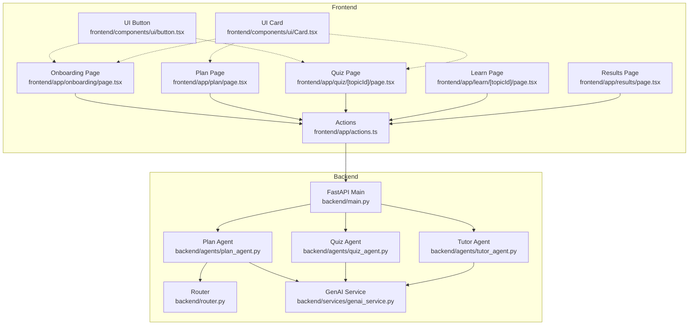
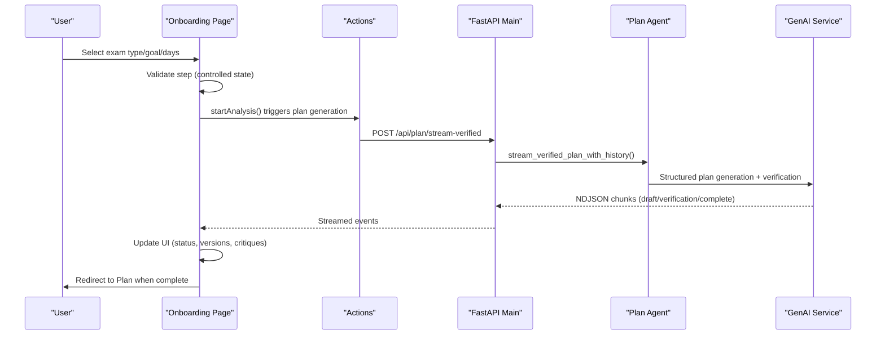
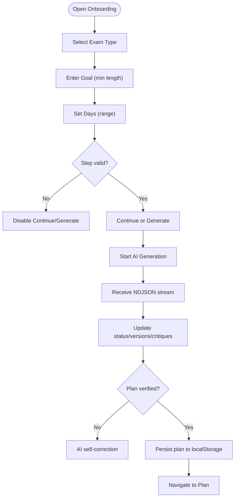
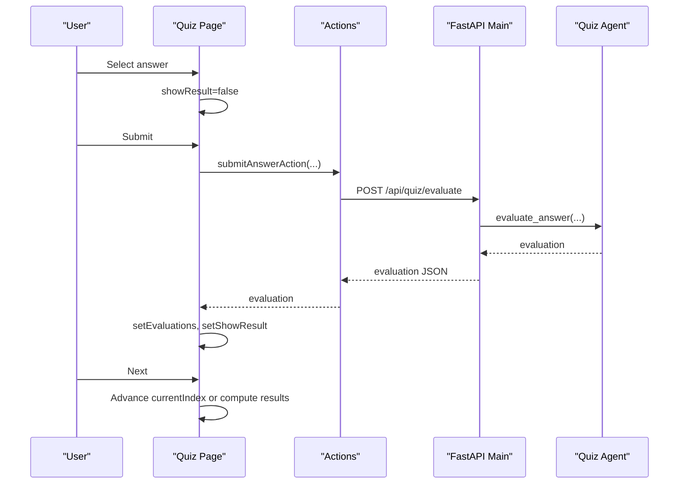
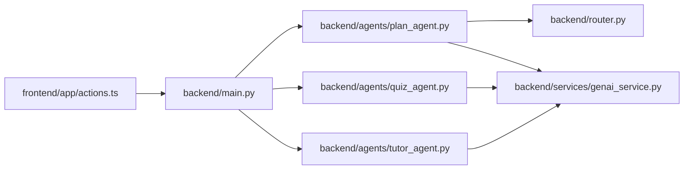

# Form Handling

<cite>
**Referenced Files in This Document**
- [frontend/app/onboarding/page.tsx](file://frontend/app/onboarding/page.tsx)
- [frontend/app/plan/page.tsx](file://frontend/app/plan/page.tsx)
- [frontend/app/quiz/[topicId]/page.tsx](file://frontend/app/quiz/[topicId]/page.tsx)
- [frontend/app/learn/[topicId]/page.tsx](file://frontend/app/learn/[topicId]/page.tsx)
- [frontend/app/results/page.tsx](file://frontend/app/results/page.tsx)
- [frontend/app/actions.ts](file://frontend/app/actions.ts)
- [backend/main.py](file://backend/main.py)
- [backend/agents/plan_agent.py](file://backend/agents/plan_agent.py)
- [backend/agents/quiz_agent.py](file://backend/agents/quiz_agent.py)
- [backend/agents/tutor_agent.py](file://backend/agents/tutor_agent.py)
- [backend/router.py](file://backend/router.py)
- [backend/services/genai_service.py](file://backend/services/genai_service.py)
- [frontend/components/ui/button.tsx](file://frontend/components/ui/button.tsx)
- [frontend/components/ui/Card.tsx](file://frontend/components/ui/Card.tsx)
</cite>

## Table of Contents
1. [Introduction](#introduction)
2. [Project Structure](#project-structure)
3. [Core Components](#core-components)
4. [Architecture Overview](#architecture-overview)
5. [Detailed Component Analysis](#detailed-component-analysis)
6. [Dependency Analysis](#dependency-analysis)
7. [Performance Considerations](#performance-considerations)
8. [Troubleshooting Guide](#troubleshooting-guide)
9. [Conclusion](#conclusion)
10. [Appendices](#appendices)

## Introduction
This document explains form handling patterns across the application’s user onboarding, study plan creation, and quiz interactions. It covers:
- Client-side validation and user-driven transitions
- Controlled and uncontrolled component patterns
- Submission workflows and error handling
- Integration with AI-generated content (streaming plans, tutoring, quizzes, misconceptions)
- Complex patterns like multi-step onboarding and dynamic quiz question forms
- State management and progress tracking
- Accessibility and performance considerations

## Project Structure
The frontend uses Next.js App Router with client components for interactive flows. Actions encapsulate server-side logic and API integrations. The backend exposes FastAPI endpoints for AI agents and persistence.

**Diagram sources**
- [frontend/app/onboarding/page.tsx](file://frontend/app/onboarding/page.tsx#L91-L472)
- [frontend/app/plan/page.tsx](file://frontend/app/plan/page.tsx#L35-L268)
- [frontend/app/quiz/[topicId]/page.tsx](file://frontend/app/quiz/[topicId]/page.tsx#L38-L649)
- [frontend/app/learn/[topicId]/page.tsx](file://frontend/app/learn/[topicId]/page.tsx#L24-L490)
- [frontend/app/results/page.tsx](file://frontend/app/results/page.tsx#L44-L365)
- [frontend/app/actions.ts](file://frontend/app/actions.ts#L1-L512)
- [backend/main.py](file://backend/main.py#L1-L843)
- [backend/agents/plan_agent.py](file://backend/agents/plan_agent.py#L1-L200)
- [backend/agents/quiz_agent.py](file://backend/agents/quiz_agent.py#L1-L200)
- [backend/agents/tutor_agent.py](file://backend/agents/tutor_agent.py#L1-L200)
- [backend/router.py](file://backend/router.py#L1-L129)
- [backend/services/genai_service.py](file://backend/services/genai_service.py#L1-L10)
- [frontend/components/ui/button.tsx](file://frontend/components/ui/button.tsx#L1-L58)
- [frontend/components/ui/Card.tsx](file://frontend/components/ui/Card.tsx#L1-L105)

**Section sources**
- [frontend/app/onboarding/page.tsx](file://frontend/app/onboarding/page.tsx#L91-L472)
- [frontend/app/plan/page.tsx](file://frontend/app/plan/page.tsx#L35-L268)
- [frontend/app/quiz/[topicId]/page.tsx](file://frontend/app/quiz/[topicId]/page.tsx#L38-L649)
- [frontend/app/learn/[topicId]/page.tsx](file://frontend/app/learn/[topicId]/page.tsx#L24-L490)
- [frontend/app/results/page.tsx](file://frontend/app/results/page.tsx#L44-L365)
- [frontend/app/actions.ts](file://frontend/app/actions.ts#L1-L512)
- [backend/main.py](file://backend/main.py#L1-L843)

## Core Components
- Onboarding multi-step form: collects exam type, goal, timeline; triggers AI plan generation with streaming verification.
- Study plan page: displays AI-generated plan, supports session initialization and navigation.
- Quiz form: dynamic question flow with evaluation, misconception analysis, and results.
- Learn page: chat with AI tutor, optional study material upload, and streaming explanations.
- Results page: performance analysis and recommendations.

Validation and submission:
- Client-side: step gating, disabled/enabled states, controlled inputs.
- Server-side: actions wrap API calls with retry logic and caching.

**Section sources**
- [frontend/app/onboarding/page.tsx](file://frontend/app/onboarding/page.tsx#L221-L225)
- [frontend/app/quiz/[topicId]/page.tsx](file://frontend/app/quiz/[topicId]/page.tsx#L202-L238)
- [frontend/app/actions.ts](file://frontend/app/actions.ts#L22-L70)

## Architecture Overview
End-to-end flow for onboarding and plan generation:

**Diagram sources**
- [frontend/app/onboarding/page.tsx](file://frontend/app/onboarding/page.tsx#L112-L219)
- [frontend/app/actions.ts](file://frontend/app/actions.ts#L121-L154)
- [backend/main.py](file://backend/main.py#L205-L222)
- [backend/agents/plan_agent.py](file://backend/agents/plan_agent.py#L163-L200)
- [backend/services/genai_service.py](file://backend/services/genai_service.py#L1-L10)

## Detailed Component Analysis

### Onboarding Multi-Step Form
- Pattern: Controlled components with local state for each step.
- Validation: Step gating based on filled fields; “Generate My Plan” initiates AI generation.
- Submission: Calls server action that streams plan verification and updates UI progressively.
- Error handling: Displays server errors and allows retry.

**Diagram sources**
- [frontend/app/onboarding/page.tsx](file://frontend/app/onboarding/page.tsx#L91-L219)
- [backend/main.py](file://backend/main.py#L205-L222)
- [backend/agents/plan_agent.py](file://backend/agents/plan_agent.py#L163-L200)

**Section sources**
- [frontend/app/onboarding/page.tsx](file://frontend/app/onboarding/page.tsx#L221-L225)
- [frontend/app/onboarding/page.tsx](file://frontend/app/onboarding/page.tsx#L112-L219)

### Study Plan Page
- Loads plan from localStorage; redirects to onboarding if missing.
- Initializes a study session if user is logged in.
- Renders daily schedule with expandable topics and links to learning.

**Section sources**
- [frontend/app/plan/page.tsx](file://frontend/app/plan/page.tsx#L42-L73)
- [frontend/app/plan/page.tsx](file://frontend/app/plan/page.tsx#L124-L136)

### Quiz Interaction Form
- Dynamic question flow: controlled selection, submit-and-show-result, next-question navigation.
- Evaluation: submits answer to backend for AI evaluation; shows explanation and feedback.
- Misconception analysis: optional “Why did I get this wrong?” with counter-example and redemption question.
- Results: computes score, persists answers, navigates to results page.

**Diagram sources**
- [frontend/app/quiz/[topicId]/page.tsx](file://frontend/app/quiz/[topicId]/page.tsx#L197-L238)
- [frontend/app/actions.ts](file://frontend/app/actions.ts#L269-L299)
- [backend/main.py](file://backend/main.py#L403-L429)
- [backend/agents/quiz_agent.py](file://backend/agents/quiz_agent.py#L45-L51)

**Section sources**
- [frontend/app/quiz/[topicId]/page.tsx](file://frontend/app/quiz/[topicId]/page.tsx#L197-L296)
- [frontend/app/quiz/[topicId]/page.tsx](file://frontend/app/quiz/[topicId]/page.tsx#L240-L273)

### Learn Page and AI Tutor
- Controlled input for chat; streaming explanations from backend.
- Optional study material upload (PDF or image) with context extraction.
- User persistence: name modal, login, and chat history retrieval/saving.

**Section sources**
- [frontend/app/learn/[topicId]/page.tsx](file://frontend/app/learn/[topicId]/page.tsx#L24-L67)
- [frontend/app/learn/[topicId]/page.tsx](file://frontend/app/learn/[topicId]/page.tsx#L178-L233)
- [backend/main.py](file://backend/main.py#L245-L261)

### Results Page
- Computes score and renders performance analysis.
- Displays misconceptions and recommendations; integrates with backend analysis endpoint.

**Section sources**
- [frontend/app/results/page.tsx](file://frontend/app/results/page.tsx#L58-L146)
- [backend/main.py](file://backend/main.py#L433-L463)

## Dependency Analysis
- Frontend actions encapsulate API calls, retries, and caching for plan generation.
- Backend FastAPI routes delegate to agents; agents use GenAI service for structured outputs.
- Router module provides syllabus scoping and intent routing for plan generation.

**Diagram sources**
- [frontend/app/actions.ts](file://frontend/app/actions.ts#L1-L512)
- [backend/main.py](file://backend/main.py#L1-L843)
- [backend/agents/plan_agent.py](file://backend/agents/plan_agent.py#L1-L200)
- [backend/agents/quiz_agent.py](file://backend/agents/quiz_agent.py#L1-L200)
- [backend/agents/tutor_agent.py](file://backend/agents/tutor_agent.py#L1-L200)
- [backend/router.py](file://backend/router.py#L1-L129)
- [backend/services/genai_service.py](file://backend/services/genai_service.py#L1-L10)

**Section sources**
- [frontend/app/actions.ts](file://frontend/app/actions.ts#L100-L154)
- [backend/main.py](file://backend/main.py#L127-L203)

## Performance Considerations
- Streaming responses: NDJSON for plan generation and tutoring reduce perceived latency.
- Client-side caching: localStorage for plans and answers avoids repeated network requests.
- Retry and exponential backoff: actions.ts implements retry logic for robustness.
- UI rendering: controlled components minimize unnecessary re-renders; skeleton loaders improve perceived performance.

[No sources needed since this section provides general guidance]

## Troubleshooting Guide
Common issues and resolutions:
- Onboarding stuck on generating: ensure API base URL is configured; check network tab for 5xx responses; verify GenAI service key.
- Quiz evaluation failures: client continues to show result even if evaluation fails; confirm backend endpoint availability and payload correctness.
- Misconception analysis not appearing: verify user/session IDs are present; check backend persistence logic.
- Plan not loading: confirm localStorage contains studyPlan; otherwise redirect to onboarding.
- PDF/image context not applied: ensure file upload completes and base64 conversion succeeds; backend extracts text or describes image.

**Section sources**
- [frontend/app/onboarding/page.tsx](file://frontend/app/onboarding/page.tsx#L214-L219)
- [frontend/app/quiz/[topicId]/page.tsx](file://frontend/app/quiz/[topicId]/page.tsx#L228-L238)
- [frontend/app/plan/page.tsx](file://frontend/app/plan/page.tsx#L46-L60)
- [frontend/app/actions.ts](file://frontend/app/actions.ts#L22-L70)

## Conclusion
The application implements robust form handling across onboarding, plan creation, and quiz interactions. Client-side controlled components manage state and validation, while server actions orchestrate AI-powered workflows with streaming and retry logic. The backend’s agent architecture ensures structured, reliable outputs for tutoring, planning, and assessment.

[No sources needed since this section summarizes without analyzing specific files]

## Appendices

### Accessibility Notes
- Buttons and cards use semantic variants and consistent focus styles; ensure keyboard navigation follows tab order.
- Inputs and buttons are labeled; consider aria-live regions for streaming content and status updates.
- Color alone is not used to convey meaning; include textual cues for statuses and critiques.

**Section sources**
- [frontend/components/ui/button.tsx](file://frontend/components/ui/button.tsx#L6-L34)
- [frontend/components/ui/Card.tsx](file://frontend/components/ui/Card.tsx#L5-L20)