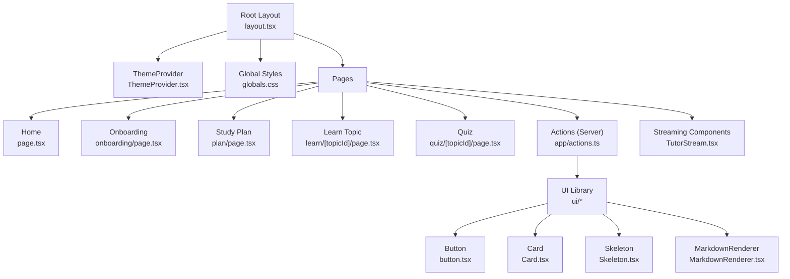
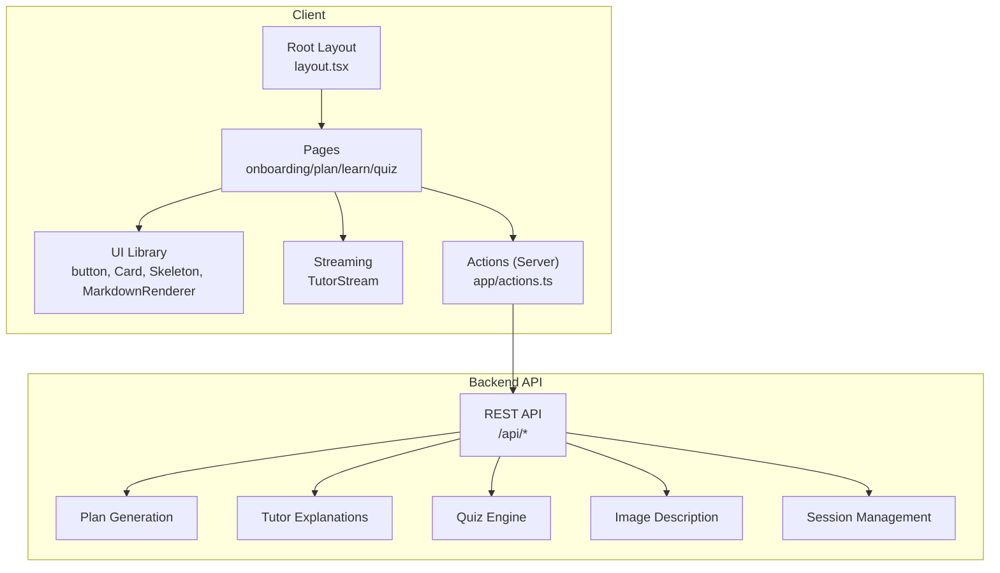
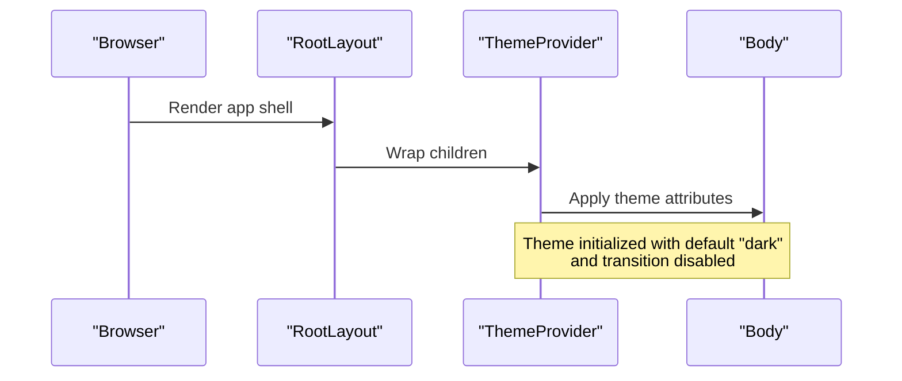
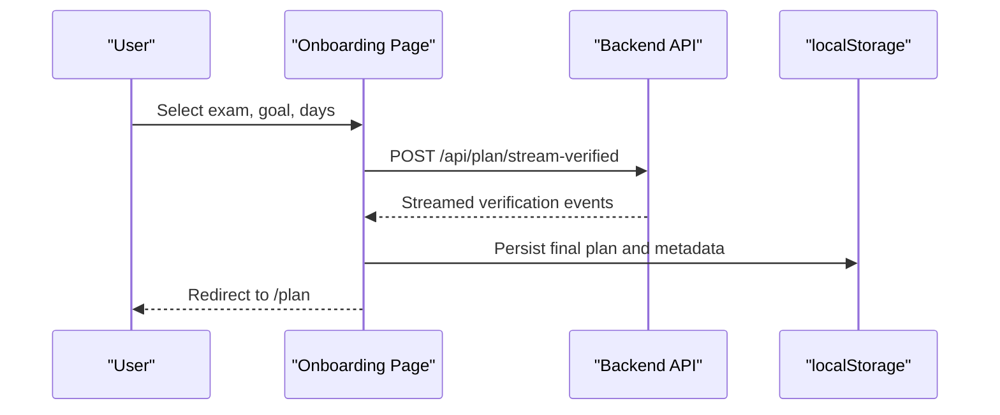
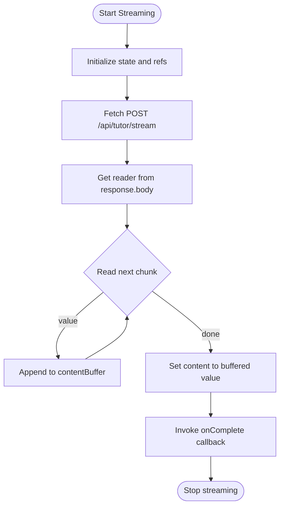
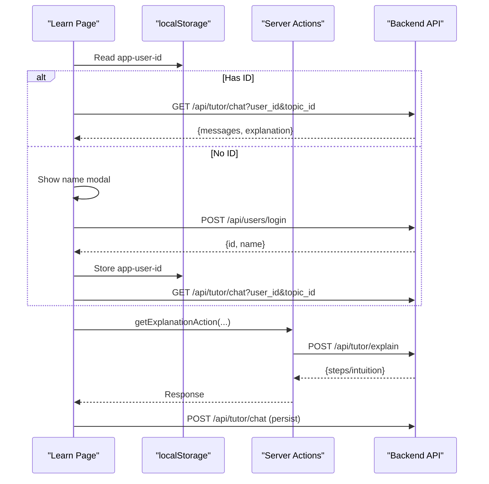
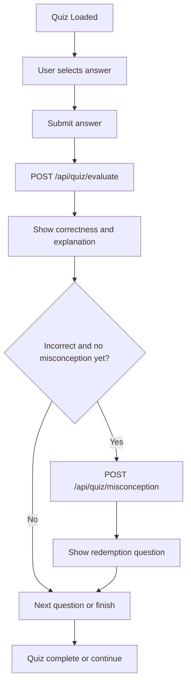
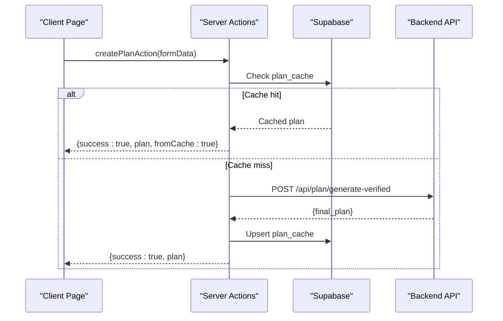
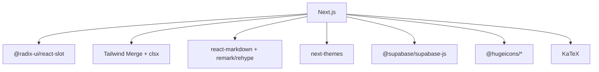

# Frontend Application

<cite>
**Referenced Files in This Document**
- [layout.tsx](file://frontend/app/layout.tsx)
- [ThemeProvider.tsx](file://frontend/components/ThemeProvider.tsx)
- [globals.css](file://frontend/app/globals.css)
- [page.tsx](file://frontend/app/page.tsx)
- [button.tsx](file://frontend/components/ui/button.tsx)
- [Card.tsx](file://frontend/components/ui/Card.tsx)
- [Skeleton.tsx](file://frontend/components/ui/Skeleton.tsx)
- [MarkdownRenderer.tsx](file://frontend/components/MarkdownRenderer.tsx)
- [TutorStream.tsx](file://frontend/components/TutorStream.tsx)
- [actions.ts](file://frontend/app/actions.ts)
- [onboarding/page.tsx](file://frontend/app/onboarding/page.tsx)
- [learn/[topicId]/page.tsx](file://frontend/app/learn/[topicId]/page.tsx)
- [quiz/[topicId]/page.tsx](file://frontend/app/quiz/[topicId]/page.tsx)
- [plan/page.tsx](file://frontend/app/plan/page.tsx)
- [utils.ts](file://frontend/lib/utils.ts)
- [next.config.ts](file://frontend/next.config.ts)
- [package.json](file://frontend/package.json)
</cite>

## Table of Contents
1. [Introduction](#introduction)
2. [Project Structure](#project-structure)
3. [Core Components](#core-components)
4. [Architecture Overview](#architecture-overview)
5. [Detailed Component Analysis](#detailed-component-analysis)
6. [Dependency Analysis](#dependency-analysis)
7. [Performance Considerations](#performance-considerations)
8. [Troubleshooting Guide](#troubleshooting-guide)
9. [Conclusion](#conclusion)
10. [Appendices](#appendices)

## Introduction
This document explains the Next.js frontend application architecture for the ExamMentor AI platform. It covers the App Router-based structure, dynamic routing for onboarding, study plans, topic learning, and quizzes. It documents the reusable UI component library, theme system, streaming response handling for real-time explanations and plan generation updates, state management patterns, form handling, accessibility and responsive design, client-side data fetching, and integration with backend APIs. It also provides guidance on component composition, troubleshooting, and performance optimization.

## Project Structure
The frontend follows Next.js App Router conventions with a strict file-system-based routing model. Pages are organized under the app directory, with dynamic segments for topic-based learning and quizzes. A shared UI library provides reusable components, and a ThemeProvider enables dark/light mode with system preference support. Global styles and fonts are configured at the root layout level.

**Diagram sources**
- [layout.tsx](file://frontend/app/layout.tsx#L25-L40)
- [ThemeProvider.tsx](file://frontend/components/ThemeProvider.tsx#L5-L20)
- [globals.css](file://frontend/app/globals.css)
- [page.tsx](file://frontend/app/page.tsx#L21-L198)
- [onboarding/page.tsx](file://frontend/app/onboarding/page.tsx#L91-L472)
- [plan/page.tsx](file://frontend/app/plan/page.tsx#L35-L268)
- [learn/[topicId]/page.tsx](file://frontend/app/learn/[topicId]/page.tsx#L24-L490)
- [quiz/[topicId]/page.tsx](file://frontend/app/quiz/[topicId]/page.tsx#L38-L649)
- [actions.ts](file://frontend/app/actions.ts#L1-L512)
- [button.tsx](file://frontend/components/ui/button.tsx#L6-L58)
- [Card.tsx](file://frontend/components/ui/Card.tsx#L5-L105)
- [Skeleton.tsx](file://frontend/components/ui/Skeleton.tsx)
- [MarkdownRenderer.tsx](file://frontend/components/MarkdownRenderer.tsx#L13-L52)
- [TutorStream.tsx](file://frontend/components/TutorStream.tsx#L16-L151)

**Section sources**
- [layout.tsx](file://frontend/app/layout.tsx#L25-L40)
- [page.tsx](file://frontend/app/page.tsx#L21-L198)
- [onboarding/page.tsx](file://frontend/app/onboarding/page.tsx#L91-L472)
- [plan/page.tsx](file://frontend/app/plan/page.tsx#L35-L268)
- [learn/[topicId]/page.tsx](file://frontend/app/learn/[topicId]/page.tsx#L24-L490)
- [quiz/[topicId]/page.tsx](file://frontend/app/quiz/[topicId]/page.tsx#L38-L649)
- [actions.ts](file://frontend/app/actions.ts#L1-L512)
- [button.tsx](file://frontend/components/ui/button.tsx#L6-L58)
- [Card.tsx](file://frontend/components/ui/Card.tsx#L5-L105)
- [MarkdownRenderer.tsx](file://frontend/components/MarkdownRenderer.tsx#L13-L52)
- [TutorStream.tsx](file://frontend/components/TutorStream.tsx#L16-L151)

## Core Components
- ThemeProvider: Wraps the app with theme switching and disables theme transition on initial load for hydration stability.
- UI Library: Reusable components with variant-driven styling and consistent spacing via a shared utility function.
- MarkdownRenderer: Renders math-enabled Markdown with KaTeX and GitHub Flavored Markdown support.
- TutorStream: Streams AI explanations with intelligent scrolling and periodic UI updates for smooth rendering.

Key implementation patterns:
- Variants and sizes for buttons and cards use class variance authority for consistent styling.
- Utility function merges Tailwind classes safely to avoid conflicts.
- Streaming UI buffers incremental chunks and flushes at a fixed cadence to maintain responsiveness.

**Section sources**
- [ThemeProvider.tsx](file://frontend/components/ThemeProvider.tsx#L5-L20)
- [button.tsx](file://frontend/components/ui/button.tsx#L6-L58)
- [Card.tsx](file://frontend/components/ui/Card.tsx#L5-L105)
- [utils.ts](file://frontend/lib/utils.ts#L4-L6)
- [MarkdownRenderer.tsx](file://frontend/components/MarkdownRenderer.tsx#L13-L52)
- [TutorStream.tsx](file://frontend/components/TutorStream.tsx#L16-L151)

## Architecture Overview
The frontend integrates tightly with a backend API via client-side fetch calls and server actions. Server actions encapsulate retry logic, semantic caching, and Supabase persistence. Dynamic routing supports onboarding, plan generation, topic learning, and quizzes. Streaming endpoints deliver real-time updates for explanations and plan verification.

**Diagram sources**
- [layout.tsx](file://frontend/app/layout.tsx#L25-L40)
- [onboarding/page.tsx](file://frontend/app/onboarding/page.tsx#L112-L219)
- [learn/[topicId]/page.tsx](file://frontend/app/learn/[topicId]/page.tsx#L178-L233)
- [quiz/[topicId]/page.tsx](file://frontend/app/quiz/[topicId]/page.tsx#L98-L156)
- [plan/page.tsx](file://frontend/app/plan/page.tsx#L42-L73)
- [actions.ts](file://frontend/app/actions.ts#L121-L154)
- [TutorStream.tsx](file://frontend/components/TutorStream.tsx#L64-L115)

## Detailed Component Analysis

### Theme System and Styling
- ThemeProvider wraps the entire app and sets default theme to dark with system preference disabled. Transition on theme change is disabled to prevent FOUC during hydration.
- Fonts are loaded via Next.js font optimization and applied at the root html element. Global styles include KaTeX CSS for mathematical rendering.

**Diagram sources**
- [layout.tsx](file://frontend/app/layout.tsx#L30-L39)
- [ThemeProvider.tsx](file://frontend/components/ThemeProvider.tsx#L11-L19)

**Section sources**
- [layout.tsx](file://frontend/app/layout.tsx#L20-L40)
- [ThemeProvider.tsx](file://frontend/components/ThemeProvider.tsx#L5-L20)

### Dynamic Routing and Pages
- Onboarding page: Multi-step wizard guiding users to select exam type, set goals, and define timeline, then streams plan verification and fixes.
- Study Plan page: Displays AI-generated plan with daily breakdowns, critical topics, and navigation to topic learning.
- Learn Topic page: Interactive chat with AI tutor, optional PDF/image materials, and streaming explanations.
- Quiz page: Generates topic-specific quizzes, evaluates answers, detects misconceptions, and provides redemption questions.

**Diagram sources**
- [onboarding/page.tsx](file://frontend/app/onboarding/page.tsx#L112-L219)

**Section sources**
- [onboarding/page.tsx](file://frontend/app/onboarding/page.tsx#L91-L472)
- [plan/page.tsx](file://frontend/app/plan/page.tsx#L35-L268)
- [learn/[topicId]/page.tsx](file://frontend/app/learn/[topicId]/page.tsx#L24-L490)
- [quiz/[topicId]/page.tsx](file://frontend/app/quiz/[topicId]/page.tsx#L38-L649)

### Streaming Response Handling
- TutorStream implements a streaming fetch to the tutor endpoint, buffering decoded chunks and periodically flushing to the UI at a smooth frame rate. It manages auto-scroll behavior based on user scroll position and triggers completion callbacks.

**Diagram sources**
- [TutorStream.tsx](file://frontend/components/TutorStream.tsx#L64-L115)

**Section sources**
- [TutorStream.tsx](file://frontend/components/TutorStream.tsx#L16-L151)

### State Management Approaches
- Client-side persistence: User identity, plan, and session identifiers are stored in localStorage. Pages hydrate state on mount and conditionally initialize user sessions.
- Server actions: Encapsulate backend calls with retry logic and semantic caching. They also persist session state and manage plan caching.
- Component-local state: Pages manage UI state (messages, quiz answers, selected options) with React hooks and pass callbacks to child components.

**Diagram sources**
- [learn/[topicId]/page.tsx](file://frontend/app/learn/[topicId]/page.tsx#L50-L127)
- [actions.ts](file://frontend/app/actions.ts#L195-L223)

**Section sources**
- [learn/[topicId]/page.tsx](file://frontend/app/learn/[topicId]/page.tsx#L41-L127)
- [plan/page.tsx](file://frontend/app/plan/page.tsx#L62-L73)
- [actions.ts](file://frontend/app/actions.ts#L303-L319)

### Form Handling and Interactions
- Onboarding: Controlled inputs for exam selection, goal text, and timeline slider; validation ensures progression only when inputs are sufficient.
- Learn Topic: Text input for follow-up questions; submission sends messages and persists chat history; optional PDF/image upload extracts text/description for context.
- Quiz: Option selection, answer submission, and misconception detection; redemption questions are presented upon incorrect answers.

**Diagram sources**
- [quiz/[topicId]/page.tsx](file://frontend/app/quiz/[topicId]/page.tsx#L202-L296)

**Section sources**
- [onboarding/page.tsx](file://frontend/app/onboarding/page.tsx#L221-L225)
- [learn/[topicId]/page.tsx](file://frontend/app/learn/[topicId]/page.tsx#L178-L233)
- [quiz/[topicId]/page.tsx](file://frontend/app/quiz/[topicId]/page.tsx#L202-L296)

### UI Patterns and Accessibility
- Responsive design: Grid layouts adapt to mobile and desktop; inputs and buttons scale appropriately; typography remains readable across breakpoints.
- Accessibility: Semantic HTML, proper contrast in theme modes, focus-visible outlines, and clear affordances for interactive elements.
- Animations: Subtle transitions and fade-in effects enhance perceived performance without being distracting.

**Section sources**
- [page.tsx](file://frontend/app/page.tsx#L68-L194)
- [learn/[topicId]/page.tsx](file://frontend/app/learn/[topicId]/page.tsx#L336-L488)
- [quiz/[topicId]/page.tsx](file://frontend/app/quiz/[topicId]/page.tsx#L388-L647)

### Integration with Backend APIs
- Client-side fetch: Pages call endpoints for chat history, plan generation, quiz persistence, and session management.
- Server actions: Centralize network logic with retry/backoff, semantic caching, and Supabase persistence.
- Environment configuration: API base URL is read from environment variables.

**Diagram sources**
- [actions.ts](file://frontend/app/actions.ts#L74-L98)
- [actions.ts](file://frontend/app/actions.ts#L121-L154)

**Section sources**
- [learn/[topicId]/page.tsx](file://frontend/app/learn/[topicId]/page.tsx#L69-L97)
- [quiz/[topicId]/page.tsx](file://frontend/app/quiz/[topicId]/page.tsx#L81-L95)
- [actions.ts](file://frontend/app/actions.ts#L12-L13)

### Component Composition and Prop Drilling
- Parent-to-child props: Pages pass context (e.g., exam type, plan) and callbacks (e.g., onComplete) to child components.
- Minimal prop drilling: Shared state is kept close to where it is needed; server actions centralize cross-cutting concerns.

**Section sources**
- [learn/[topicId]/page.tsx](file://frontend/app/learn/[topicId]/page.tsx#L386-L393)
- [quiz/[topicId]/page.tsx](file://frontend/app/quiz/[topicId]/page.tsx#L127-L144)

## Dependency Analysis
External libraries include Next.js, Radix UI, class-variance-authority, Tailwind utilities, react-markdown with remark/rehype plugins, and Supabase for persistence. The UI library leverages Tailwind classes merged via a utility function.

**Diagram sources**
- [package.json](file://frontend/package.json#L11-L31)

**Section sources**
- [package.json](file://frontend/package.json#L11-L31)
- [utils.ts](file://frontend/lib/utils.ts#L4-L6)

## Performance Considerations
- Streaming UI: Buffer and flush at a fixed cadence to keep the UI responsive during long-running operations.
- Retry/backoff: Server actions implement exponential backoff for transient failures.
- Semantic caching: Plans are cached in Supabase with expiration to reduce repeated computation.
- Lazy hydration: Pages hydrate progressively; skeleton loaders improve perceived performance.
- Font optimization: Preloaded Google Fonts at the root layout minimize layout shifts.

[No sources needed since this section provides general guidance]

## Troubleshooting Guide
Common issues and resolutions:
- Hydration mismatch with theme: Ensure ThemeProvider is applied at the root and disable transition on theme change.
- Streaming errors: Verify backend streaming endpoint is reachable and that the response body has a reader.
- Quiz evaluation failures: Gracefully fall back to showing results and logging errors; allow retry.
- Session persistence: Confirm session start action runs once per user and session ID is persisted.

**Section sources**
- [ThemeProvider.tsx](file://frontend/components/ThemeProvider.tsx#L11-L19)
- [TutorStream.tsx](file://frontend/components/TutorStream.tsx#L117-L123)
- [quiz/[topicId]/page.tsx](file://frontend/app/quiz/[topicId]/page.tsx#L228-L237)
- [plan/page.tsx](file://frontend/app/plan/page.tsx#L62-L73)

## Conclusion
The frontend employs Next.js App Router with dynamic routing, a robust UI component library, and a theme provider for consistent styling. Real-time streaming enhances the learning experience, while server actions encapsulate reliability and caching. State management balances local persistence with server-backed storage, and the design emphasizes accessibility and responsiveness.

[No sources needed since this section summarizes without analyzing specific files]

## Appendices

### API Surface Summary
- Plan generation and verification: POST endpoints for generating verified plans and streaming verification.
- Tutor explanations: POST endpoint for explanations and image-based explanations.
- Quiz engine: Generate, evaluate, and misconception detection endpoints.
- Session management: Start and save session state endpoints.
- Multimodal: Extract PDF text and describe images for context.

**Section sources**
- [actions.ts](file://frontend/app/actions.ts#L121-L154)
- [actions.ts](file://frontend/app/actions.ts#L195-L223)
- [actions.ts](file://frontend/app/actions.ts#L243-L299)
- [actions.ts](file://frontend/app/actions.ts#L303-L319)
- [actions.ts](file://frontend/app/actions.ts#L361-L432)