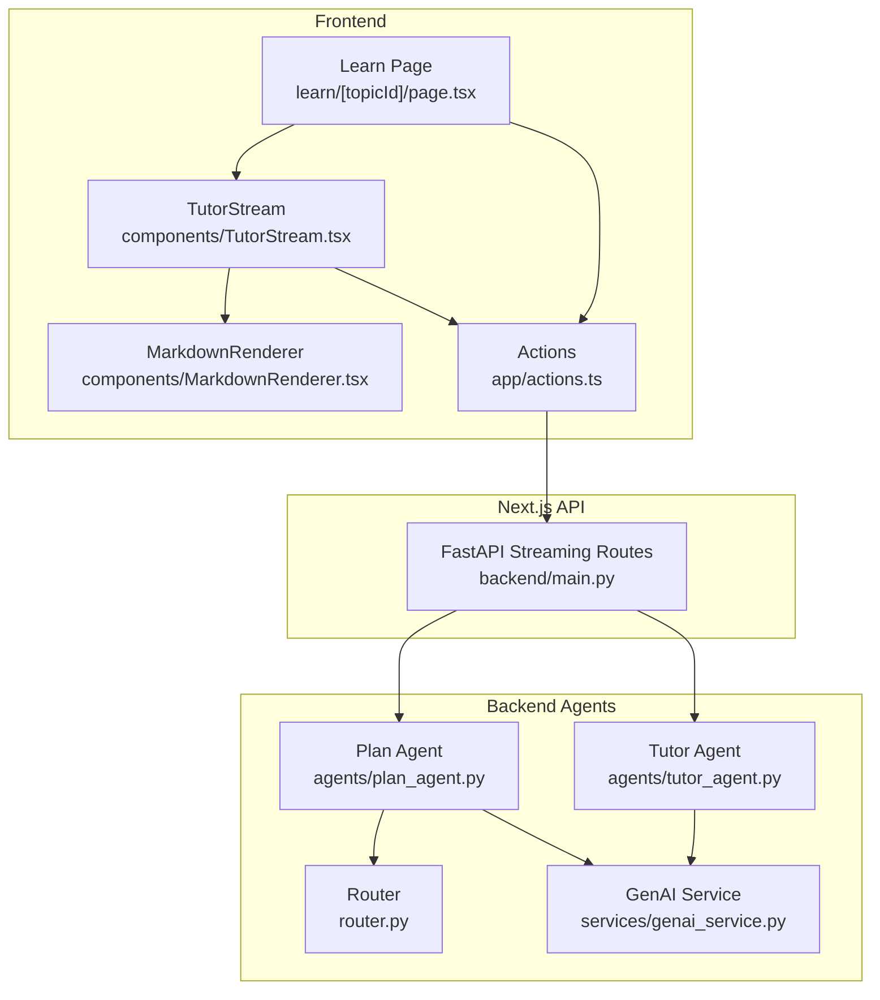
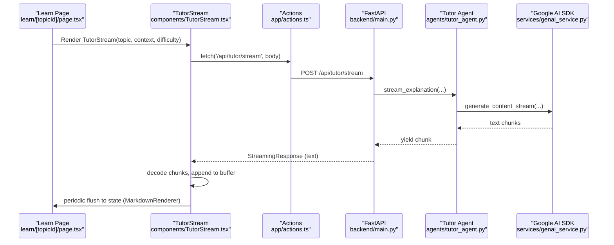
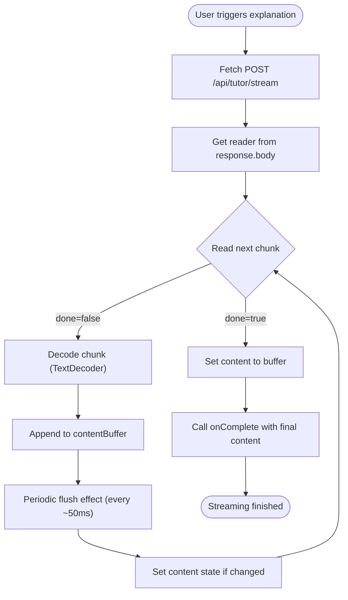
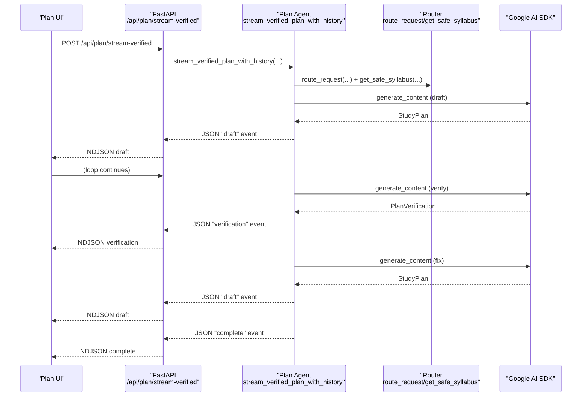
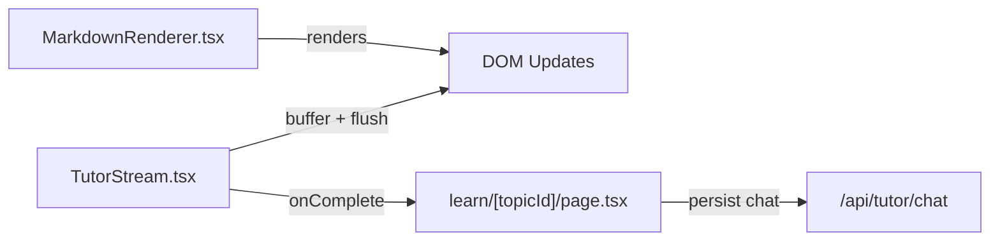
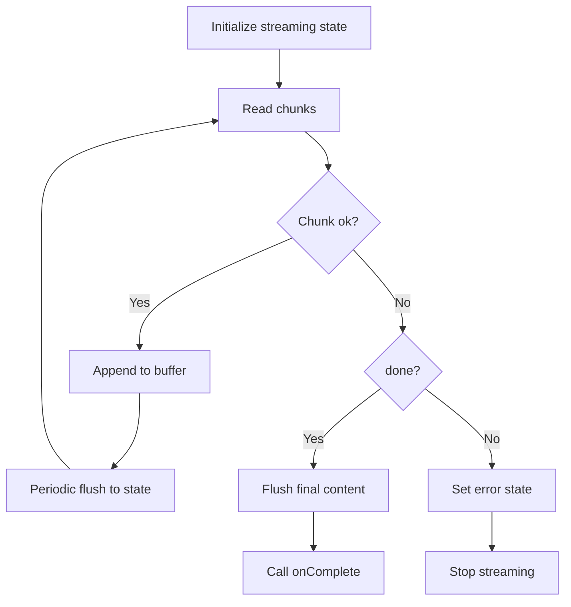
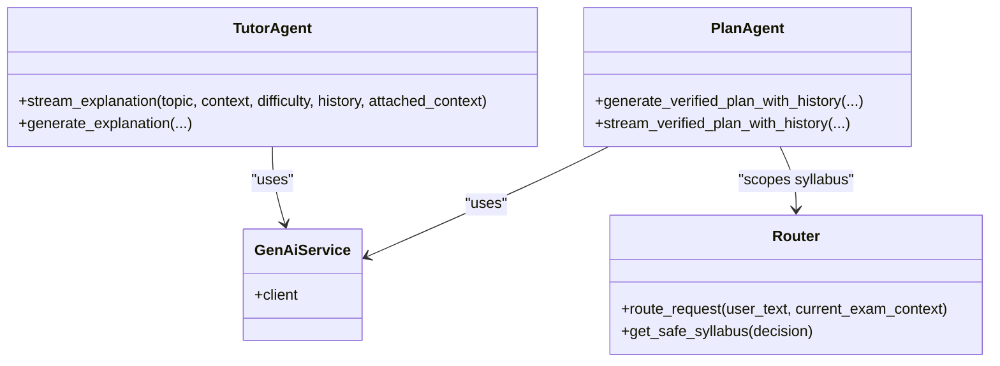
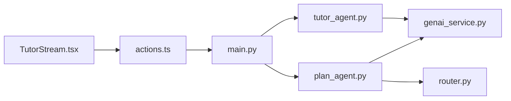

# Streaming Integration

<cite>
**Referenced Files in This Document**
- [TutorStream.tsx](file://frontend/components/TutorStream.tsx)
- [MarkdownRenderer.tsx](file://frontend/components/MarkdownRenderer.tsx)
- [actions.ts](file://frontend/app/actions.ts)
- [learn.page.tsx](file://frontend/app/learn/[topicId]/page.tsx)
- [main.py](file://backend/main.py)
- [tutor_agent.py](file://backend/agents/tutor_agent.py)
- [plan_agent.py](file://backend/agents/plan_agent.py)
- [genai_service.py](file://backend/services/genai_service.py)
- [router.py](file://backend/router.py)
</cite>

## Table of Contents
1. [Introduction](#introduction)
2. [Project Structure](#project-structure)
3. [Core Components](#core-components)
4. [Architecture Overview](#architecture-overview)
5. [Detailed Component Analysis](#detailed-component-analysis)
6. [Dependency Analysis](#dependency-analysis)
7. [Performance Considerations](#performance-considerations)
8. [Troubleshooting Guide](#troubleshooting-guide)
9. [Conclusion](#conclusion)

## Introduction
This document explains the real-time streaming integration between the frontend and backend AI services. It focuses on:
- Streaming tutor explanations and plan generation updates
- Parsing streaming data and updating the UI continuously
- Bidirectional communication patterns and state management
- Error recovery and fallback strategies
- Performance considerations and debugging techniques

The system uses newline-delimited JSON streaming for plan generation and character-level streaming for tutor explanations, enabling smooth, incremental rendering in the browser.

## Project Structure
The streaming integration spans three layers:
- Frontend React components and Next.js app router actions
- Next.js API routes exposing streaming endpoints
- Backend agents generating streamed content via Google AI SDK

**Diagram sources**
- [learn.page.tsx](file://frontend/app/learn/[topicId]/page.tsx#L386-L394)
- [TutorStream.tsx](file://frontend/components/TutorStream.tsx#L63-L115)
- [MarkdownRenderer.tsx](file://frontend/components/MarkdownRenderer.tsx#L39-L52)
- [actions.ts](file://frontend/app/actions.ts#L195-L223)
- [main.py](file://backend/main.py#L205-L260)
- [tutor_agent.py](file://backend/agents/tutor_agent.py#L51-L127)
- [plan_agent.py](file://backend/agents/plan_agent.py#L307-L476)
- [router.py](file://backend/router.py#L64-L88)
- [genai_service.py](file://backend/services/genai_service.py#L1-L10)

**Section sources**
- [learn.page.tsx](file://frontend/app/learn/[topicId]/page.tsx#L1-L490)
- [TutorStream.tsx](file://frontend/components/TutorStream.tsx#L1-L151)
- [MarkdownRenderer.tsx](file://frontend/components/MarkdownRenderer.tsx#L1-L53)
- [actions.ts](file://frontend/app/actions.ts#L1-L512)
- [main.py](file://backend/main.py#L1-L843)
- [tutor_agent.py](file://backend/agents/tutor_agent.py#L1-L277)
- [plan_agent.py](file://backend/agents/plan_agent.py#L1-L524)
- [router.py](file://backend/router.py#L1-L129)
- [genai_service.py](file://backend/services/genai_service.py#L1-L10)

## Core Components
- Tutor explanation streaming: Frontend reads a byte stream and decodes chunks incrementally; the backend streams text from the AI model.
- Plan generation streaming: Backend emits newline-delimited JSON chunks describing plan drafts, verifications, and completion; frontend parses and renders incremental UI updates.
- Markdown rendering: Streaming content is rendered using a Markdown component supporting math and GitHub Flavored Markdown.
- Retry and caching: Shared action utilities provide robust network handling and semantic caching for plan requests.

**Section sources**
- [TutorStream.tsx](file://frontend/components/TutorStream.tsx#L63-L115)
- [main.py](file://backend/main.py#L205-L260)
- [tutor_agent.py](file://backend/agents/tutor_agent.py#L51-L127)
- [plan_agent.py](file://backend/agents/plan_agent.py#L307-L476)
- [MarkdownRenderer.tsx](file://frontend/components/MarkdownRenderer.tsx#L39-L52)
- [actions.ts](file://frontend/app/actions.ts#L17-L70)

## Architecture Overview
The streaming pipeline connects the frontend UI to backend agents through Next.js routes. Two distinct streaming modes exist:
- Tutor explanation streaming: application/x-ndjson with raw text chunks
- Plan generation streaming: application/x-ndjson with structured JSON events

**Diagram sources**
- [learn.page.tsx](file://frontend/app/learn/[topicId]/page.tsx#L386-L394)
- [TutorStream.tsx](file://frontend/components/TutorStream.tsx#L63-L115)
- [actions.ts](file://frontend/app/actions.ts#L195-L223)
- [main.py](file://backend/main.py#L245-L260)
- [tutor_agent.py](file://backend/agents/tutor_agent.py#L51-L127)
- [genai_service.py](file://backend/services/genai_service.py#L1-L10)

## Detailed Component Analysis

### Tutor Explanation Streaming (Character-Level)
- Frontend:
  - Initiates a POST to the streaming endpoint with topic, context, difficulty, and optional attached context.
  - Reads the response body via a reader and decodes chunks incrementally.
  - Uses a buffered string and a periodic flush interval to maintain smooth UI updates without overwhelming React re-renders.
  - Implements smart scrolling: detects if the user is near the bottom; if so, auto-scrolls to keep content in view.
  - Emits a completion callback with the final content and sets streaming state to false.
- Backend:
  - Exposes a streaming route that yields text chunks from the AI model.
  - The agent composes a prompt with optional history and attached context, then streams raw text.

**Diagram sources**
- [TutorStream.tsx](file://frontend/components/TutorStream.tsx#L63-L115)
- [main.py](file://backend/main.py#L245-L260)
- [tutor_agent.py](file://backend/agents/tutor_agent.py#L51-L127)

**Section sources**
- [TutorStream.tsx](file://frontend/components/TutorStream.tsx#L1-L151)
- [tutor_agent.py](file://backend/agents/tutor_agent.py#L51-L127)
- [main.py](file://backend/main.py#L245-L260)

### Plan Generation Streaming (NDJSON Events)
- Frontend:
  - The plan generation UI listens for NDJSON events and parses them into typed actions (draft, verification, status, debug, complete).
  - Renders incremental plan previews, verification summaries, and iteration counts.
- Backend:
  - The plan agent performs a self-correction loop: draft → verify → fix → repeat, emitting structured JSON events.
  - The router scopes the syllabus and injects constraints into the goal to guide the plan.
  - The streaming endpoint returns newline-delimited JSON chunks.

**Diagram sources**
- [main.py](file://backend/main.py#L205-L222)
- [plan_agent.py](file://backend/agents/plan_agent.py#L307-L476)
- [router.py](file://backend/router.py#L64-L129)
- [genai_service.py](file://backend/services/genai_service.py#L1-L10)

**Section sources**
- [main.py](file://backend/main.py#L205-L222)
- [plan_agent.py](file://backend/agents/plan_agent.py#L307-L476)
- [router.py](file://backend/router.py#L64-L129)

### Markdown Rendering and Real-Time DOM Updates
- The MarkdownRenderer component renders the streamed content with support for math and GitHub Flavored Markdown.
- The TutorStream component manages a scroll-aware buffer and throttled flush to balance responsiveness and performance.
- The Learn page integrates streaming explanations with chat history and optional study material context.

**Diagram sources**
- [TutorStream.tsx](file://frontend/components/TutorStream.tsx#L43-L61)
- [MarkdownRenderer.tsx](file://frontend/components/MarkdownRenderer.tsx#L39-L52)
- [learn.page.tsx](file://frontend/app/learn/[topicId]/page.tsx#L227-L233)

**Section sources**
- [MarkdownRenderer.tsx](file://frontend/components/MarkdownRenderer.tsx#L1-L53)
- [TutorStream.tsx](file://frontend/components/TutorStream.tsx#L1-L151)
- [learn.page.tsx](file://frontend/app/learn/[topicId]/page.tsx#L374-L407)

### State Management and Error Recovery
- Streaming state:
  - Tracks isStreaming, content, error, and a contentBuffer for incremental updates.
  - Uses refs to manage auto-scroll behavior and a periodic flush interval.
- Error handling:
  - Catches decoding and network errors, displays a user-visible error card, and stops streaming.
  - The shared actions utility provides exponential backoff and retry logic for non-streaming endpoints.
- Completion:
  - On stream completion, the final content is flushed, onComplete is invoked, and the UI persists chat history.

**Diagram sources**
- [TutorStream.tsx](file://frontend/components/TutorStream.tsx#L63-L115)
- [actions.ts](file://frontend/app/actions.ts#L17-L70)

**Section sources**
- [TutorStream.tsx](file://frontend/components/TutorStream.tsx#L1-L151)
- [actions.ts](file://frontend/app/actions.ts#L17-L70)

### Integration with AI Agent Responses
- Tutor agent:
  - Accepts topic, context, difficulty, optional history, and attached context.
  - Streams raw text chunks from the AI model.
- Plan agent:
  - Uses router scoping and a self-correction loop to produce a robust plan.
  - Emits NDJSON events describing each iteration and verification outcome.

**Diagram sources**
- [genai_service.py](file://backend/services/genai_service.py#L1-L10)
- [tutor_agent.py](file://backend/agents/tutor_agent.py#L51-L127)
- [plan_agent.py](file://backend/agents/plan_agent.py#L163-L304)
- [router.py](file://backend/router.py#L64-L129)

**Section sources**
- [tutor_agent.py](file://backend/agents/tutor_agent.py#L51-L127)
- [plan_agent.py](file://backend/agents/plan_agent.py#L163-L304)
- [router.py](file://backend/router.py#L64-L129)
- [genai_service.py](file://backend/services/genai_service.py#L1-L10)

## Dependency Analysis
- Frontend-to-backend:
  - TutorStream invokes actions that call FastAPI endpoints.
  - The Learn page coordinates streaming explanations and chat persistence.
- Backend-to-AI:
  - Agents depend on the centralized Google AI client initialized in the service module.
  - Plan agent depends on router logic to scope syllabus content.

**Diagram sources**
- [TutorStream.tsx](file://frontend/components/TutorStream.tsx#L63-L115)
- [actions.ts](file://frontend/app/actions.ts#L195-L223)
- [main.py](file://backend/main.py#L245-L260)
- [tutor_agent.py](file://backend/agents/tutor_agent.py#L51-L127)
- [plan_agent.py](file://backend/agents/plan_agent.py#L307-L476)
- [router.py](file://backend/router.py#L64-L129)
- [genai_service.py](file://backend/services/genai_service.py#L1-L10)

**Section sources**
- [TutorStream.tsx](file://frontend/components/TutorStream.tsx#L1-L151)
- [actions.ts](file://frontend/app/actions.ts#L1-L512)
- [main.py](file://backend/main.py#L1-L843)
- [tutor_agent.py](file://backend/agents/tutor_agent.py#L1-L277)
- [plan_agent.py](file://backend/agents/plan_agent.py#L1-L524)
- [router.py](file://backend/router.py#L1-L129)
- [genai_service.py](file://backend/services/genai_service.py#L1-L10)

## Performance Considerations
- Streaming throughput:
  - Use a moderate flush interval (e.g., 50 ms) to balance responsiveness and render cost.
  - Avoid frequent React state updates by comparing buffers before flushing.
- Memory management:
  - Keep the contentBuffer minimal and avoid concatenating excessively large strings.
  - Consider truncating very long histories or attached contexts to reduce memory pressure.
- Rendering cost:
  - Markdown rendering is CPU-intensive; throttle updates and avoid unnecessary re-renders.
- Network resilience:
  - Implement retries with exponential backoff for non-streaming endpoints.
  - For streaming, surface errors promptly and allow users to retry.

[No sources needed since this section provides general guidance]

## Troubleshooting Guide
- Streaming not appearing:
  - Verify the endpoint returns application/x-ndjson and that the response body supports a reader.
  - Ensure the backend yields chunks and the route is reachable.
- Decoder errors:
  - Confirm the TextDecoder is used with the correct encoding and stream flag.
- UI not updating:
  - Check the periodic flush effect runs while isStreaming is true.
  - Ensure the buffer comparison prevents redundant state updates.
- Backend errors:
  - Inspect the agent’s prompt construction and ensure required environment variables are present.
  - Validate the AI SDK client initialization and model availability.
- Persistence issues:
  - Confirm chat save endpoints receive proper payloads and that user sessions are established.

**Section sources**
- [TutorStream.tsx](file://frontend/components/TutorStream.tsx#L85-L110)
- [main.py](file://backend/main.py#L245-L260)
- [tutor_agent.py](file://backend/agents/tutor_agent.py#L119-L126)
- [actions.ts](file://frontend/app/actions.ts#L17-L70)

## Conclusion
The streaming integration delivers responsive, incremental updates for both tutor explanations and plan generation. By combining NDJSON streaming with careful state management and Markdown rendering, the system provides a smooth, real-time learning experience. Robust error handling and retry logic ensure reliability, while performance-conscious buffering and flushing keep the UI responsive even with large outputs.