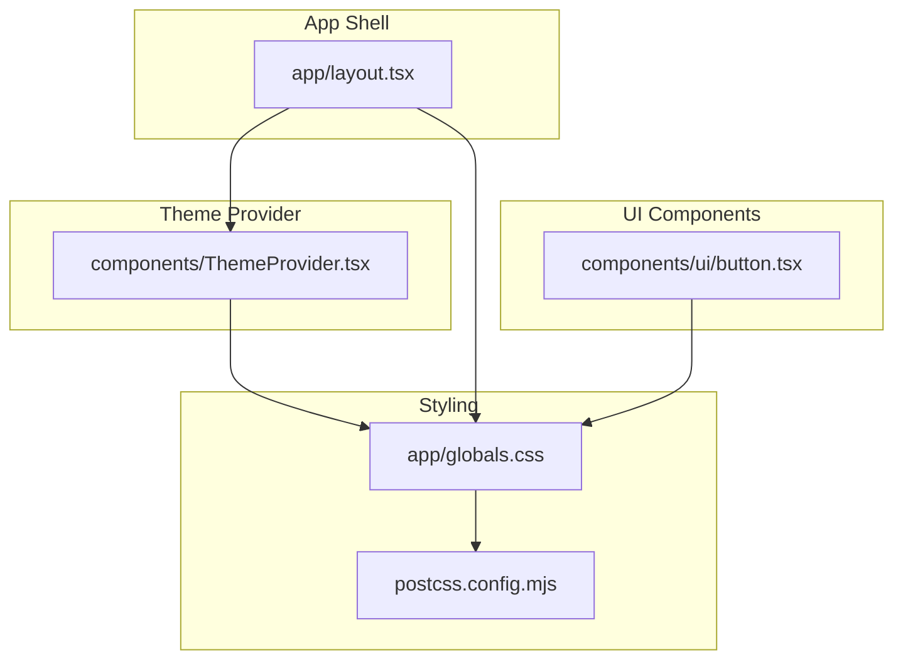
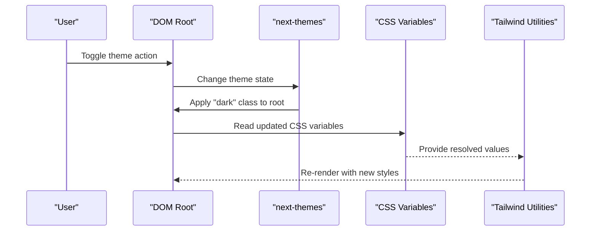
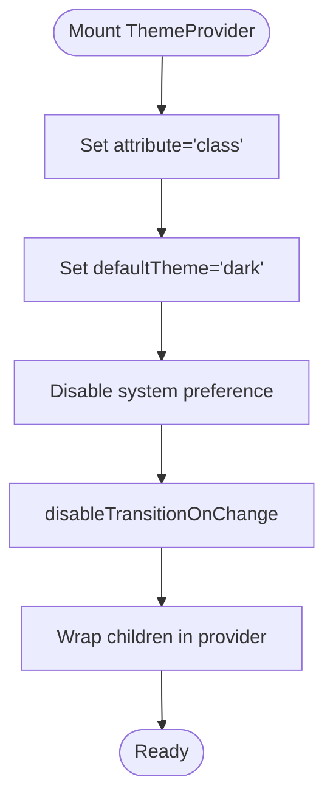
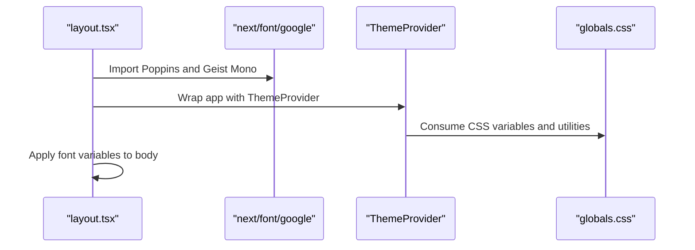
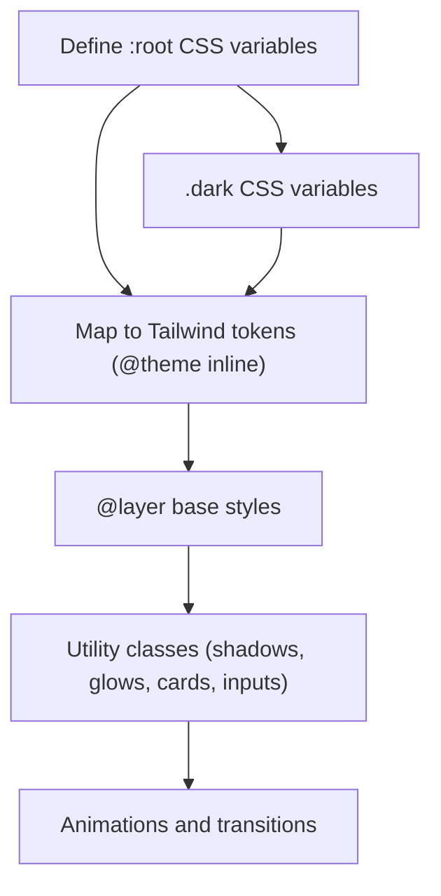
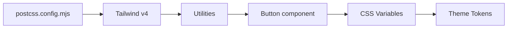
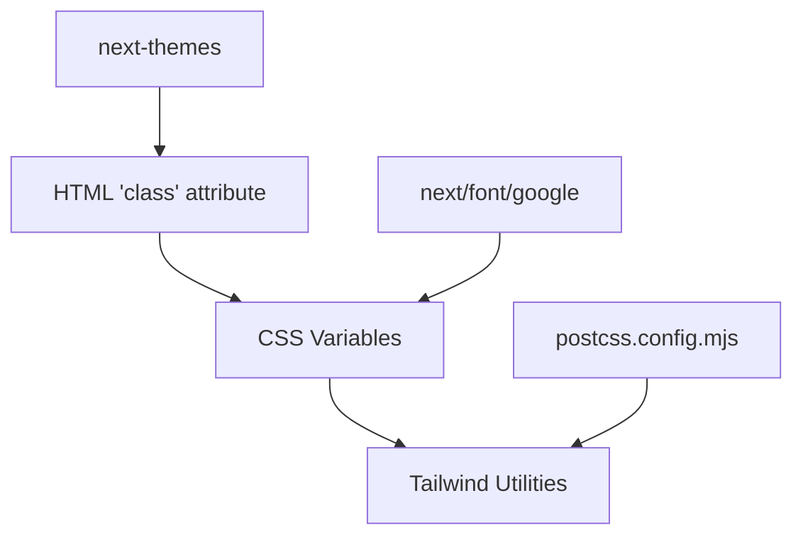

# Theme System

<cite>
**Referenced Files in This Document**
- [ThemeProvider.tsx](file://frontend/components/ThemeProvider.tsx)
- [layout.tsx](file://frontend/app/layout.tsx)
- [globals.css](file://frontend/app/globals.css)
- [button.tsx](file://frontend/components/ui/button.tsx)
- [postcss.config.mjs](file://frontend/postcss.config.mjs)
- [package.json](file://frontend/package.json)
- [next.config.ts](file://frontend/next.config.ts)
</cite>

## Table of Contents
1. [Introduction](#introduction)
2. [Project Structure](#project-structure)
3. [Core Components](#core-components)
4. [Architecture Overview](#architecture-overview)
5. [Detailed Component Analysis](#detailed-component-analysis)
6. [Dependency Analysis](#dependency-analysis)
7. [Performance Considerations](#performance-considerations)
8. [Troubleshooting Guide](#troubleshooting-guide)
9. [Conclusion](#conclusion)
10. [Appendices](#appendices)

## Introduction
This document explains the theme system implementation for the frontend application. It covers how ThemeProvider and CSS custom properties work together to support light and dark modes, how theme persistence is handled across sessions, and how the design system integrates with Next.js font optimization and Google Fonts. It also documents the Tailwind CSS configuration and utility class usage patterns, responsive design approaches, and accessibility considerations for contrast and readability. Finally, it provides practical guidance for extending or modifying themes and optimizing performance during theme switching and hydration.

## Project Structure
The theme system spans a small set of focused files:
- Theme provider wrapper around next-themes
- Application layout that sets up fonts and wraps the app tree
- Global CSS that defines CSS custom properties and Tailwind v4 theme mappings
- UI components that consume theme-aware utilities
- Build configuration for PostCSS and Next.js

**Diagram sources**
- [layout.tsx](file://frontend/app/layout.tsx#L1-L41)
- [ThemeProvider.tsx](file://frontend/components/ThemeProvider.tsx#L1-L21)
- [globals.css](file://frontend/app/globals.css#L1-L362)
- [postcss.config.mjs](file://frontend/postcss.config.mjs#L1-L8)
- [button.tsx](file://frontend/components/ui/button.tsx#L1-L58)

**Section sources**
- [layout.tsx](file://frontend/app/layout.tsx#L1-L41)
- [ThemeProvider.tsx](file://frontend/components/ThemeProvider.tsx#L1-L21)
- [globals.css](file://frontend/app/globals.css#L1-L362)
- [postcss.config.mjs](file://frontend/postcss.config.mjs#L1-L8)
- [button.tsx](file://frontend/components/ui/button.tsx#L1-L58)

## Core Components
- ThemeProvider: Wraps the app with next-themes, setting the attribute to "class", defaulting to "dark", disabling OS preference detection, and suppressing transition on theme change for instant switching.
- Layout: Declares Google Fonts via next/font, exposes font variables to CSS, and wraps the entire app in ThemeProvider.
- Global CSS: Defines CSS custom properties for colors, typography, spacing, and radii; maps them into Tailwind v4 tokens; and provides dark-mode variants via a custom selector.
- UI Components: Use Tailwind utilities and theme-aware classes that resolve to CSS variables.

Key behaviors:
- Theme switching toggles the "dark" class on the root element.
- CSS custom properties drive all color and sizing tokens.
- Tailwind utilities resolve to current CSS variable values.

**Section sources**
- [ThemeProvider.tsx](file://frontend/components/ThemeProvider.tsx#L1-L21)
- [layout.tsx](file://frontend/app/layout.tsx#L1-L41)
- [globals.css](file://frontend/app/globals.css#L1-L362)
- [button.tsx](file://frontend/components/ui/button.tsx#L1-L58)

## Architecture Overview
The theme system architecture centers on three pillars:
- CSS custom properties for dynamic theming
- next-themes for state management and persistence
- Tailwind v4 for utility-first styling

**Diagram sources**
- [ThemeProvider.tsx](file://frontend/components/ThemeProvider.tsx#L1-L21)
- [globals.css](file://frontend/app/globals.css#L1-L362)

## Detailed Component Analysis

### ThemeProvider
- Purpose: Provide theme context to the app using next-themes.
- Behavior:
  - Sets attribute to "class" so Tailwind can target ".dark".
  - Defaults to "dark" theme.
  - Disables system preference detection.
  - Disables transitions on theme change to avoid FOIT/flash.
- Persistence: next-themes persists the selected theme in localStorage by default.

**Diagram sources**
- [ThemeProvider.tsx](file://frontend/components/ThemeProvider.tsx#L1-L21)

**Section sources**
- [ThemeProvider.tsx](file://frontend/components/ThemeProvider.tsx#L1-L21)

### Layout and Font Integration
- Declares two Google Fonts via next/font:
  - Poppins with multiple weights/styles exposed as "--font-poppins".
  - Geist Mono exposed as "--font-geist-mono".
- Applies font variables to the body and wraps children in ThemeProvider.
- Includes KaTeX CSS for math rendering.

**Diagram sources**
- [layout.tsx](file://frontend/app/layout.tsx#L1-L41)
- [globals.css](file://frontend/app/globals.css#L1-L362)

**Section sources**
- [layout.tsx](file://frontend/app/layout.tsx#L1-L41)

### Global CSS and CSS Custom Properties
- Defines a dual-theme palette:
  - Light theme (default) with cream/beige tones.
  - Dark theme with dark gray tones.
- Uses CSS custom properties for:
  - Background, foreground, primary/accent/muted colors
  - Borders, inputs, ring highlights
  - Sidebar colors and chart colors
  - Status and mastery level colors
  - Radius tokens for rounded corners
- Maps CSS variables into Tailwind v4 tokens via @theme inline.
- Provides dark variant targeting via @custom-variant dark.
- Adds layered base styles, typography tweaks, and utility classes for shadows, glows, cards, inputs, animations, and transitions.

**Diagram sources**
- [globals.css](file://frontend/app/globals.css#L1-L362)

**Section sources**
- [globals.css](file://frontend/app/globals.css#L1-L362)

### Tailwind CSS Configuration and Utility Usage
- PostCSS plugin configuration enables Tailwind v4.
- The design system relies on Tailwind utilities that resolve to CSS variables, ensuring consistent theming across components.
- Example usage in UI components:
  - Buttons use theme-aware variants (e.g., primary, destructive, outline) that resolve to current CSS variable values.
  - Backdrop blur, ring, border, and shadow utilities integrate with the theme’s color tokens.

**Diagram sources**
- [postcss.config.mjs](file://frontend/postcss.config.mjs#L1-L8)
- [button.tsx](file://frontend/components/ui/button.tsx#L1-L58)
- [globals.css](file://frontend/app/globals.css#L1-L362)

**Section sources**
- [postcss.config.mjs](file://frontend/postcss.config.mjs#L1-L8)
- [button.tsx](file://frontend/components/ui/button.tsx#L1-L58)

### Responsive Design and Mobile-First Approach
- The design system does not define explicit breakpoints in the provided files.
- Mobile-first is achieved through:
  - Default base styles applied at all screen sizes.
  - Utility classes for responsive layouts (e.g., padding, margin, spacing).
  - Tailwind’s default responsive modifiers (e.g., sm:, md:, lg:).
- Recommendation: Define a consistent breakpoint scale in Tailwind configuration for predictable responsive behavior.

[No sources needed since this section provides general guidance]

### Color Palette and Accessibility Considerations
- Color palette:
  - Primary/accent/muted/destructive palettes defined for both themes.
  - Sidebar and chart colors aligned with theme.
  - Status and mastery level colors optimized for both themes.
- Contrast and readability:
  - Foreground/background pairs adjust per theme to maintain legibility.
  - Ring highlights and borders use theme-aware tokens for focus states.
- Recommendations:
  - Validate WCAG contrast ratios for critical UI elements.
  - Prefer semantic color roles (primary, destructive, muted) over hardcoded colors.
  - Test readability across devices and lighting conditions.

**Section sources**
- [globals.css](file://frontend/app/globals.css#L57-L189)

### Theme-Aware Component Styling and Conditional Rendering
- Components consume Tailwind utilities that resolve to CSS variables, so styling updates automatically when the theme changes.
- Conditional rendering based on theme state:
  - Use the "dark" class on the root element to conditionally style elements.
  - Access theme state via next-themes hooks if needed for logic-driven rendering.
- Example patterns:
  - Buttons switch background/foreground based on current theme.
  - Cards and inputs adapt to theme-aware borders and backgrounds.

**Section sources**
- [button.tsx](file://frontend/components/ui/button.tsx#L1-L58)
- [globals.css](file://frontend/app/globals.css#L1-L362)
- [ThemeProvider.tsx](file://frontend/components/ThemeProvider.tsx#L1-L21)

### Adding New Themes or Modifying Existing Ones
- Steps to add a new theme:
  - Define a new CSS custom property block (e.g., .theme-name) with the same keys as the existing themes.
  - Add a mapping in next-themes to recognize the new theme name.
  - Optionally update the default theme and disable system preference if desired.
- Steps to modify an existing theme:
  - Adjust the relevant CSS variables in the appropriate theme block.
  - Verify Tailwind token mappings remain consistent.
  - Test contrast and readability across components.

**Section sources**
- [globals.css](file://frontend/app/globals.css#L57-L189)
- [ThemeProvider.tsx](file://frontend/components/ThemeProvider.tsx#L1-L21)

## Dependency Analysis
- next-themes: Manages theme state, persistence, and DOM attribute application.
- Tailwind v4: Resolves utilities to CSS variables, enabling dynamic theming.
- next/font/google: Optimizes and loads Google Fonts, exposing font variables to CSS.
- postcss.config.mjs: Enables Tailwind v4 plugin.

**Diagram sources**
- [ThemeProvider.tsx](file://frontend/components/ThemeProvider.tsx#L1-L21)
- [globals.css](file://frontend/app/globals.css#L1-L362)
- [layout.tsx](file://frontend/app/layout.tsx#L1-L41)
- [postcss.config.mjs](file://frontend/postcss.config.mjs#L1-L8)

**Section sources**
- [package.json](file://frontend/package.json#L1-L46)
- [next.config.ts](file://frontend/next.config.ts#L1-L8)

## Performance Considerations
- Instant theme switching:
  - disableTransitionOnChange prevents FOIT/flash during theme change.
- Hydration:
  - suppressHydrationWarning on html element avoids mismatches while the theme initializes.
- CSS custom properties:
  - Efficiently update styles without re-rendering components.
- Font optimization:
  - next/font loads fonts with automatic optimization and variable exposure.
- Tailwind utilities:
  - Keep utility usage scoped to avoid generating unused CSS.

**Section sources**
- [ThemeProvider.tsx](file://frontend/components/ThemeProvider.tsx#L1-L21)
- [layout.tsx](file://frontend/app/layout.tsx#L1-L41)
- [globals.css](file://frontend/app/globals.css#L1-L362)

## Troubleshooting Guide
- Theme does not persist:
  - Verify next-themes is configured to persist the selected theme (localStorage by default).
- Theme toggle feels sluggish:
  - Ensure disableTransitionOnChange remains enabled to avoid transition delays.
- Fonts not applying:
  - Confirm font variables are applied to the body and that next/font is imported correctly.
- Tailwind utilities not reflecting theme:
  - Ensure @theme inline mappings are present and PostCSS plugin is active.
- Hydration warnings:
  - Confirm suppressHydrationWarning is used appropriately and initial theme matches server expectations.

**Section sources**
- [ThemeProvider.tsx](file://frontend/components/ThemeProvider.tsx#L1-L21)
- [layout.tsx](file://frontend/app/layout.tsx#L1-L41)
- [globals.css](file://frontend/app/globals.css#L1-L362)
- [postcss.config.mjs](file://frontend/postcss.config.mjs#L1-L8)

## Conclusion
The theme system leverages CSS custom properties, next-themes, and Tailwind v4 to deliver a robust, efficient, and accessible dual-theme experience. By centralizing design tokens in CSS variables and mapping them into Tailwind, components remain theme-aware without manual prop drilling. With font optimization and careful hydration handling, the system balances performance and user experience. Extending or modifying themes is straightforward due to the centralized token model.

## Appendices
- Next.js font optimization and Google Fonts:
  - Poppins and Geist Mono are loaded via next/font with variable exposure for CSS consumption.
- Tailwind configuration:
  - Tailwind v4 is enabled via PostCSS plugin; ensure no conflicting configurations override this setup.

**Section sources**
- [layout.tsx](file://frontend/app/layout.tsx#L1-L41)
- [postcss.config.mjs](file://frontend/postcss.config.mjs#L1-L8)