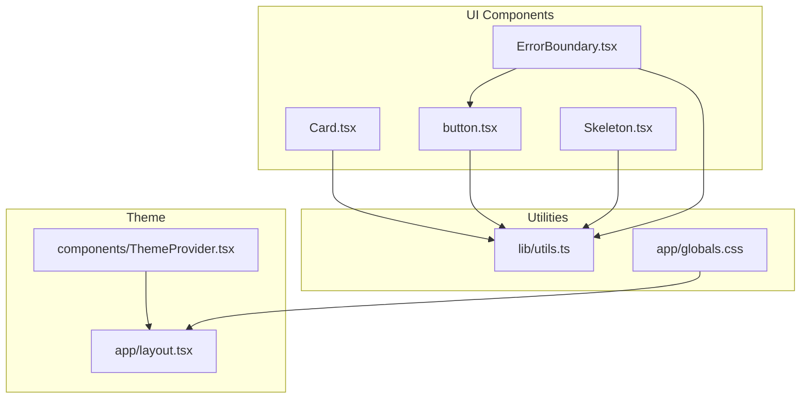
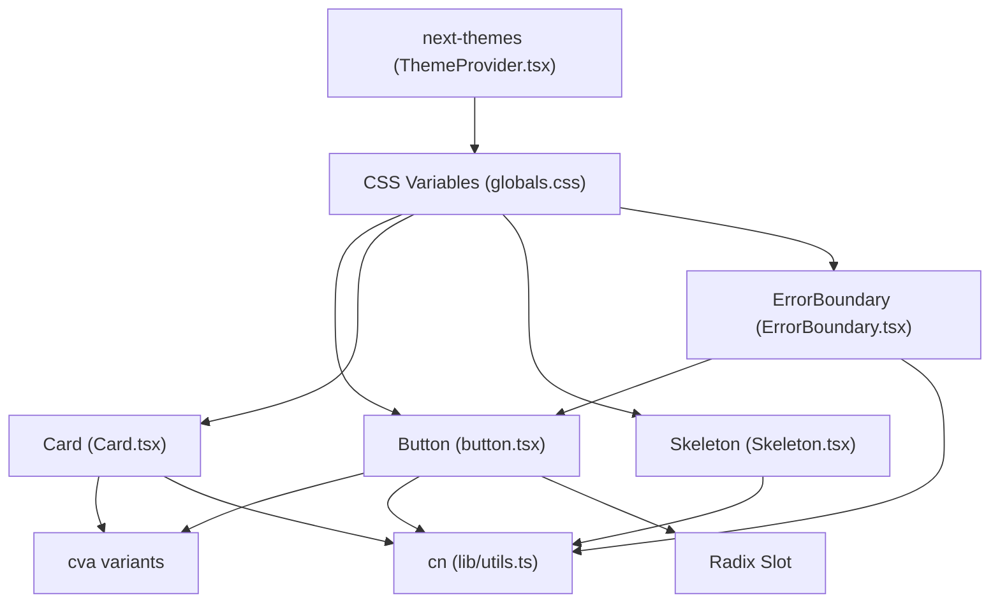
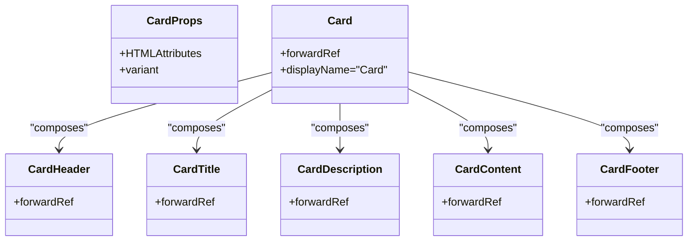
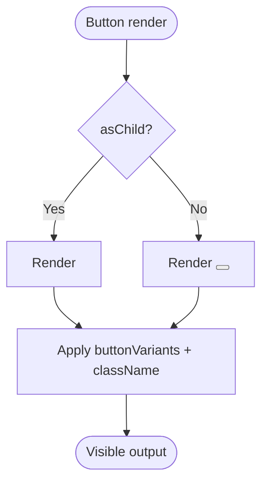
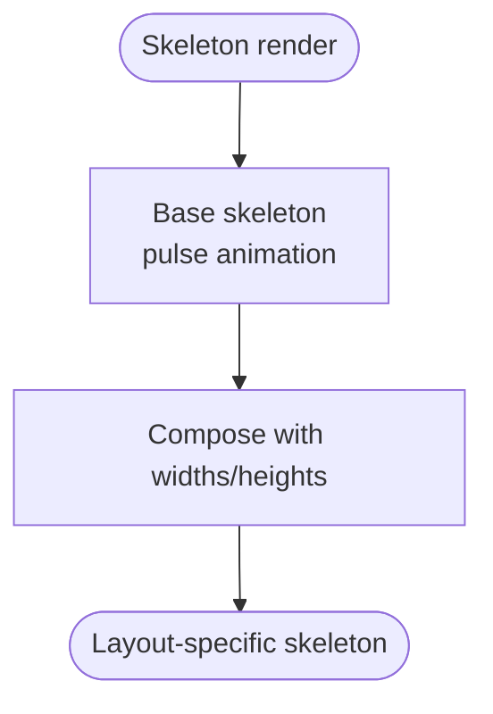
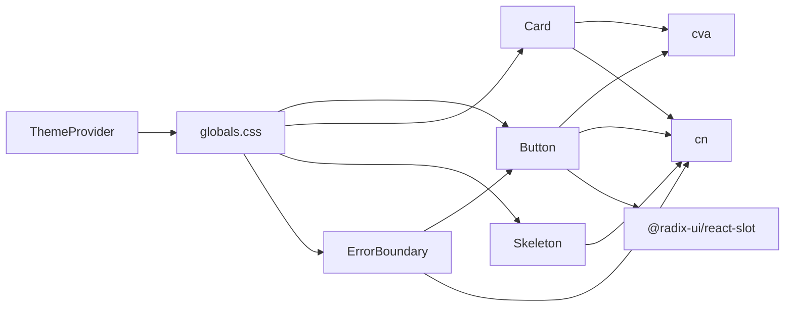

# UI Components

<cite>
**Referenced Files in This Document**
- [Card.tsx](file://frontend/components/ui/Card.tsx)
- [button.tsx](file://frontend/components/ui/button.tsx)
- [Skeleton.tsx](file://frontend/components/ui/Skeleton.tsx)
- [ErrorBoundary.tsx](file://frontend/components/ui/ErrorBoundary.tsx)
- [utils.ts](file://frontend/lib/utils.ts)
- [globals.css](file://frontend/app/globals.css)
- [ThemeProvider.tsx](file://frontend/components/ThemeProvider.tsx)
- [layout.tsx](file://frontend/app/layout.tsx)
- [package.json](file://frontend/package.json)
</cite>

## Table of Contents
1. [Introduction](#introduction)
2. [Project Structure](#project-structure)
3. [Core Components](#core-components)
4. [Architecture Overview](#architecture-overview)
5. [Detailed Component Analysis](#detailed-component-analysis)
6. [Dependency Analysis](#dependency-analysis)
7. [Performance Considerations](#performance-considerations)
8. [Accessibility Features](#accessibility-features)
9. [Customization and Theming](#customization-and-theming)
10. [Troubleshooting Guide](#troubleshooting-guide)
11. [Conclusion](#conclusion)

## Introduction
This document describes the custom UI component library and reusable component patterns used in the frontend. It focuses on four core components: Card, Button, Skeleton, and ErrorBoundary. It explains their styling variants, content composition patterns, TypeScript interfaces, and how they integrate with the design system and theme provider. It also covers accessibility features, composition patterns, performance characteristics, and guidelines for extending and customizing components while maintaining design system consistency.

## Project Structure
The UI components live under the components/ui directory and are complemented by shared utilities, global styles, and a theme provider that enables light/dark dual-theme support.



**Diagram sources**
- [Card.tsx](file://frontend/components/ui/Card.tsx#L1-L105)
- [button.tsx](file://frontend/components/ui/button.tsx#L1-L58)
- [Skeleton.tsx](file://frontend/components/ui/Skeleton.tsx#L1-L192)
- [ErrorBoundary.tsx](file://frontend/components/ui/ErrorBoundary.tsx#L1-L129)
- [utils.ts](file://frontend/lib/utils.ts#L1-L7)
- [globals.css](file://frontend/app/globals.css#L1-L362)
- [ThemeProvider.tsx](file://frontend/components/ThemeProvider.tsx#L1-L21)
- [layout.tsx](file://frontend/app/layout.tsx#L1-L41)

**Section sources**
- [Card.tsx](file://frontend/components/ui/Card.tsx#L1-L105)
- [button.tsx](file://frontend/components/ui/button.tsx#L1-L58)
- [Skeleton.tsx](file://frontend/components/ui/Skeleton.tsx#L1-L192)
- [ErrorBoundary.tsx](file://frontend/components/ui/ErrorBoundary.tsx#L1-L129)
- [utils.ts](file://frontend/lib/utils.ts#L1-L7)
- [globals.css](file://frontend/app/globals.css#L1-L362)
- [ThemeProvider.tsx](file://frontend/components/ThemeProvider.tsx#L1-L21)
- [layout.tsx](file://frontend/app/layout.tsx#L1-L41)

## Core Components
This section summarizes each component’s purpose, props, variants, and composition patterns.

- Card
  - Purpose: Container with multiple visual variants and semantic subcomponents for header, title, description, content, and footer.
  - Variants: default, elevated, soft, glass.
  - Composition: Card wraps CardHeader, CardTitle, CardDescription, CardContent, CardFooter.
  - Props: Inherits standard HTML attributes plus variant selection via VariantProps.

- Button
  - Purpose: Action element with multiple variants, sizes, and an asChild slot pattern for semantic composition.
  - Variants: default, destructive, outline, secondary, ghost, link, premium, glass.
  - Sizes: default, sm, md, lg, xl, icon.
  - Props: Inherits button attributes plus variant, size, and asChild.

- Skeleton
  - Purpose: Loading placeholders with standardized animations and prebuilt skeletons for common layouts.
  - Variants: generic Skeleton, CardSkeleton, TextSkeleton, QuizSkeleton, PlanSkeleton, ResultsSkeleton, LearnSkeleton, OnboardingSkeleton.
  - Props: className, style for the base skeleton; optional lines for TextSkeleton.

- ErrorBoundary
  - Purpose: Class-based boundary to gracefully handle runtime errors with user-friendly messaging and retry/back navigation.
  - Props: children, fallbackPath.
  - Additional: ErrorDisplay functional component for inline async operation error presentation.

**Section sources**
- [Card.tsx](file://frontend/components/ui/Card.tsx#L22-L36)
- [button.tsx](file://frontend/components/ui/button.tsx#L6-L34)
- [Skeleton.tsx](file://frontend/components/ui/Skeleton.tsx#L6-L21)
- [ErrorBoundary.tsx](file://frontend/components/ui/ErrorBoundary.tsx#L13-L21)

## Architecture Overview
The components rely on:
- Tailwind CSS and CSS custom properties for theming and animations.
- class-variance-authority (cva) for variant-driven styling.
- cn utility for merging Tailwind classes safely.
- next-themes for dual-theme support (light/dark).
- Radix UI Slot for flexible composition in Button.



**Diagram sources**
- [button.tsx](file://frontend/components/ui/button.tsx#L1-L58)
- [Card.tsx](file://frontend/components/ui/Card.tsx#L1-L105)
- [Skeleton.tsx](file://frontend/components/ui/Skeleton.tsx#L1-L192)
- [ErrorBoundary.tsx](file://frontend/components/ui/ErrorBoundary.tsx#L1-L129)
- [utils.ts](file://frontend/lib/utils.ts#L1-L7)
- [ThemeProvider.tsx](file://frontend/components/ThemeProvider.tsx#L1-L21)
- [globals.css](file://frontend/app/globals.css#L1-L362)

## Detailed Component Analysis

### Card Component
The Card component provides a flexible container with multiple visual variants and semantic subcomponents for structured content.

- Variants and styling
  - Uses cva to define variant classes for default, elevated, soft, and glass.
  - Applies transitions and backdrop blur for premium feel.
- Composition pattern
  - CardHeader, CardTitle, CardDescription, CardContent, CardFooter are separate forwardRef’d components.
  - Consumers compose these parts to build consistent card layouts.
- TypeScript
  - CardProps extends HTML attributes and VariantProps of cardVariants.
- Accessibility
  - No explicit ARIA roles; consumers can add roles as needed when composing lists or grids.



**Diagram sources**
- [Card.tsx](file://frontend/components/ui/Card.tsx#L22-L104)

**Section sources**
- [Card.tsx](file://frontend/components/ui/Card.tsx#L5-L36)
- [Card.tsx](file://frontend/components/ui/Card.tsx#L38-L95)

### Button Component
The Button component supports multiple variants, sizes, and semantic composition via Radix Slot.

- Variants and sizes
  - Variants: default, destructive, outline, secondary, ghost, link, premium, glass.
  - Sizes: default, sm, md, lg, xl, icon.
- Composition
  - asChild allows rendering a different host element (e.g., Link) while preserving Button styles.
- Accessibility
  - Focus-visible outline and ring are applied for keyboard navigation.
  - Disabled states prevent interaction and reduce opacity.
- Interaction states
  - Hover, focus, active states are styled via variants and transitions.



**Diagram sources**
- [button.tsx](file://frontend/components/ui/button.tsx#L36-L55)

**Section sources**
- [button.tsx](file://frontend/components/ui/button.tsx#L6-L34)
- [button.tsx](file://frontend/components/ui/button.tsx#L36-L57)

### Skeleton Component
Skeleton provides lightweight loading placeholders and specialized skeletons for common layouts.

- Generic Skeleton
  - Base skeleton with pulse animation and muted background.
- Prebuilt skeletons
  - CardSkeleton, TextSkeleton, QuizSkeleton, PlanSkeleton, ResultsSkeleton, LearnSkeleton, OnboardingSkeleton.
- Composition
  - Reuses generic Skeleton with widths and heights appropriate to the layout.
- Animation and performance
  - Uses CSS animations for subtle motion; minimal DOM overhead.



**Diagram sources**
- [Skeleton.tsx](file://frontend/components/ui/Skeleton.tsx#L11-L21)
- [Skeleton.tsx](file://frontend/components/ui/Skeleton.tsx#L23-L32)
- [Skeleton.tsx](file://frontend/components/ui/Skeleton.tsx#L48-L77)

**Section sources**
- [Skeleton.tsx](file://frontend/components/ui/Skeleton.tsx#L6-L21)
- [Skeleton.tsx](file://frontend/components/ui/Skeleton.tsx#L23-L77)
- [Skeleton.tsx](file://frontend/components/ui/Skeleton.tsx#L115-L167)
- [Skeleton.tsx](file://frontend/components/ui/Skeleton.tsx#L169-L191)

### ErrorBoundary Component
ErrorBoundary provides graceful error handling with retry and navigation options.

- Class-based Error Boundary
  - Captures errors via getDerivedStateFromError and componentDidCatch.
  - Renders a friendly UI with optional back navigation and retry action.
- Functional ErrorDisplay
  - Inline error presentation for asynchronous operations with optional retry and back navigation.
- Composition
  - Uses Button and Link for interactive controls.

```mermaid
sequenceDiagram
participant Child as "Children"
participant EB as "ErrorBoundary"
participant Btn as "Button"
participant Link as "Link"
Child->>EB : Render children
EB-->>Child : Normal render
Note over Child : Runtime error occurs
Child->>EB : Error thrown
EB->>EB : getDerivedStateFromError
EB->>EB : componentDidCatch
EB-->>Child : Render fallback UI
EB->>Btn : "Try Again" handler
Btn-->>EB : onClick
EB-->>Child : Reset state and re-render children
EB->>Link : "Go Back" (optional)
```

**Diagram sources**
- [ErrorBoundary.tsx](file://frontend/components/ui/ErrorBoundary.tsx#L23-L82)
- [ErrorBoundary.tsx](file://frontend/components/ui/ErrorBoundary.tsx#L92-L128)

**Section sources**
- [ErrorBoundary.tsx](file://frontend/components/ui/ErrorBoundary.tsx#L23-L82)
- [ErrorBoundary.tsx](file://frontend/components/ui/ErrorBoundary.tsx#L84-L128)

## Dependency Analysis
The components depend on shared utilities and theme infrastructure.



**Diagram sources**
- [button.tsx](file://frontend/components/ui/button.tsx#L1-L58)
- [Card.tsx](file://frontend/components/ui/Card.tsx#L1-L105)
- [Skeleton.tsx](file://frontend/components/ui/Skeleton.tsx#L1-L192)
- [ErrorBoundary.tsx](file://frontend/components/ui/ErrorBoundary.tsx#L1-L129)
- [utils.ts](file://frontend/lib/utils.ts#L1-L7)
- [ThemeProvider.tsx](file://frontend/components/ThemeProvider.tsx#L1-L21)
- [globals.css](file://frontend/app/globals.css#L1-L362)

**Section sources**
- [package.json](file://frontend/package.json#L11-L31)
- [utils.ts](file://frontend/lib/utils.ts#L1-L7)
- [globals.css](file://frontend/app/globals.css#L1-L362)
- [ThemeProvider.tsx](file://frontend/components/ThemeProvider.tsx#L1-L21)

## Performance Considerations
- Skeleton
  - Uses CSS animations and minimal DOM nodes; ideal for progressive loading.
- Button
  - Lightweight wrapper around native button or Slot; avoid unnecessary re-renders by passing stable props.
- Card
  - Uses backdrop blur and shadows; keep nesting shallow for large lists.
- Theme and CSS
  - CSS variables and Tailwind utilities are efficient; avoid excessive custom CSS overrides.

[No sources needed since this section provides general guidance]

## Accessibility Features
- Focus management
  - Button applies focus-visible outline and ring for keyboard navigation.
- Semantic composition
  - Button supports asChild to render links or buttons semantically.
- ErrorBoundary
  - Provides actionable controls (retry, go back) with clear labels.
- Recommendations
  - Add ARIA attributes (role, aria-* states) when composing lists, dialogs, or complex widgets.
  - Ensure sufficient color contrast per theme variants.
  - Provide visible focus indicators consistently across custom controls.

[No sources needed since this section provides general guidance]

## Customization and Theming
- Design tokens
  - CSS custom properties define primary, secondary, muted, destructive, borders, and chart colors for both light and dark themes.
- Variant extension
  - Extend cva variants in Button and Card to add new styles while keeping consistent spacing and transitions.
- Utility functions
  - Use cn to merge classes safely; avoid conflicting Tailwind utilities.
- Animations and transitions
  - Leverage transition-premium and animate-* utilities for smooth interactions.
- Example patterns
  - Use card-soft and card-elevated utility classes for consistent panel styling.
  - Apply shadow-soft utilities for subtle depth cues.

**Section sources**
- [globals.css](file://frontend/app/globals.css#L13-L55)
- [globals.css](file://frontend/app/globals.css#L58-L189)
- [globals.css](file://frontend/app/globals.css#L236-L288)
- [globals.css](file://frontend/app/globals.css#L303-L355)
- [Card.tsx](file://frontend/components/ui/Card.tsx#L5-L20)
- [button.tsx](file://frontend/components/ui/button.tsx#L6-L34)

## Troubleshooting Guide
- Button not responding
  - Verify disabled state and pointer-events classes; ensure asChild renders the intended host element.
- Card styles not applying
  - Confirm variant prop and className merging via cn; check for conflicting overrides.
- Skeleton not visible
  - Ensure muted background and animate-pulse classes are present; verify parent container visibility.
- ErrorBoundary not catching errors
  - Wrap route segments or pages with ErrorBoundary; ensure error boundaries are placed near the error source.
- Theme not switching
  - Confirm next-themes provider is mounted at the root; verify CSS variables are defined for both themes.

**Section sources**
- [button.tsx](file://frontend/components/ui/button.tsx#L36-L57)
- [Card.tsx](file://frontend/components/ui/Card.tsx#L27-L36)
- [Skeleton.tsx](file://frontend/components/ui/Skeleton.tsx#L11-L21)
- [ErrorBoundary.tsx](file://frontend/components/ui/ErrorBoundary.tsx#L23-L82)
- [ThemeProvider.tsx](file://frontend/components/ThemeProvider.tsx#L5-L20)

## Conclusion
The UI component library emphasizes consistency, composability, and theme-aware styling. Card, Button, Skeleton, and ErrorBoundary form a cohesive toolkit that integrates with the design system and theme provider. By leveraging cva, cn, and CSS custom properties, components remain extensible and maintainable. Following the composition patterns and accessibility recommendations ensures a robust, inclusive user experience across light and dark themes.