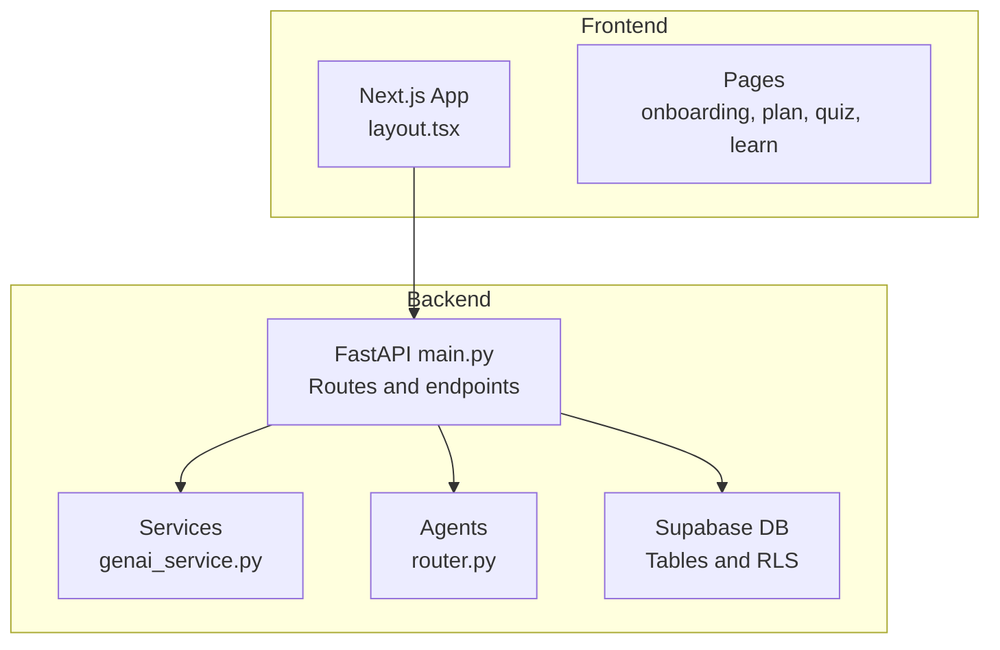
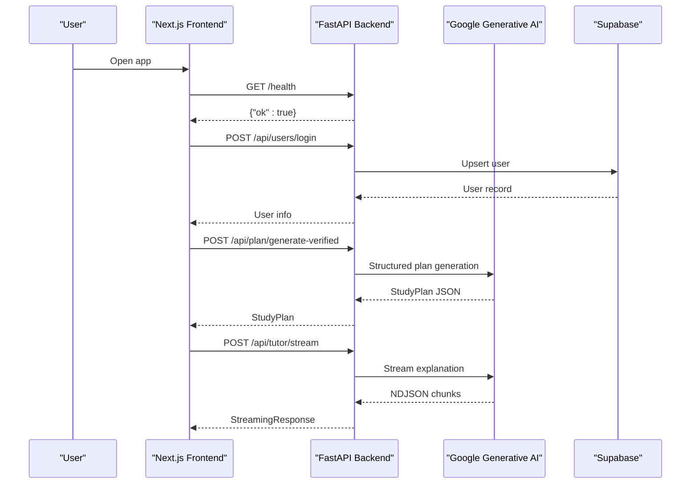
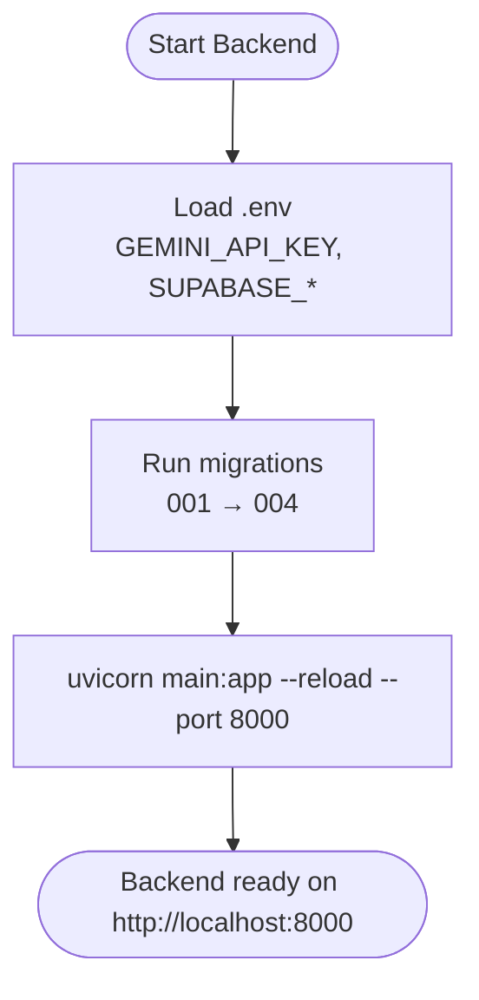
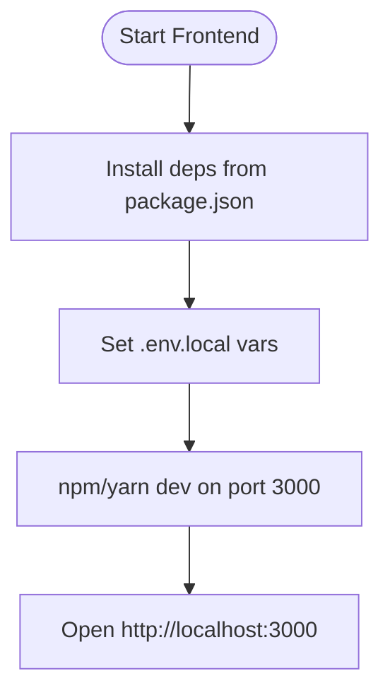
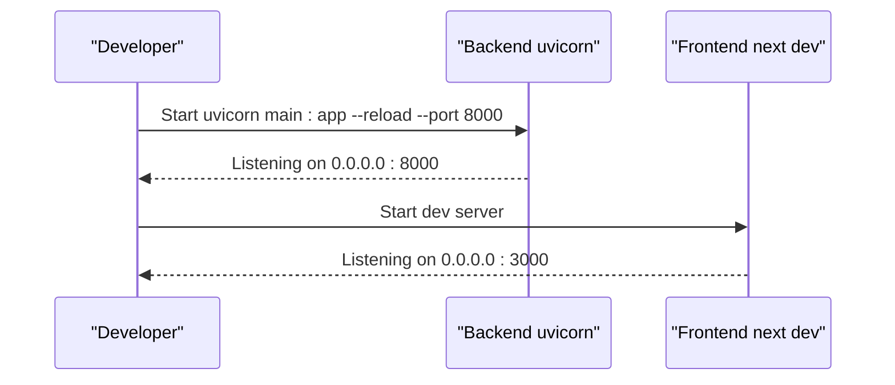
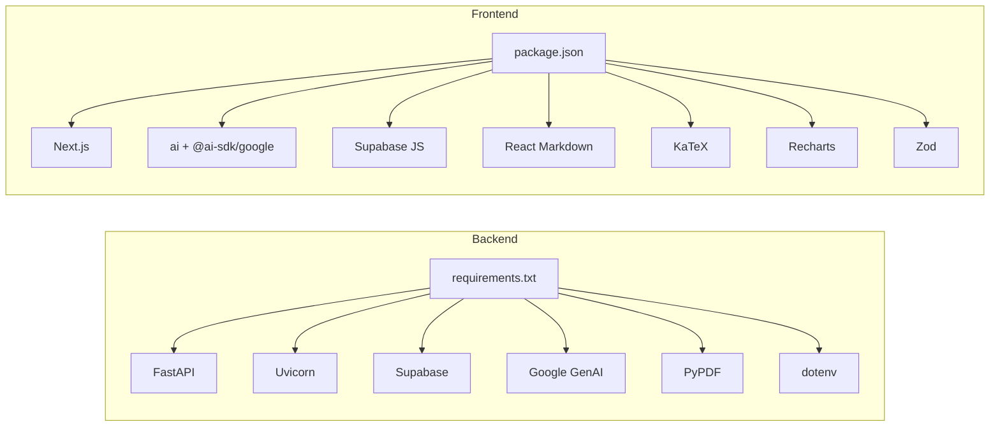

# Getting Started

<cite>
**Referenced Files in This Document**
- [backend/requirements.txt](file://backend/requirements.txt)
- [frontend/package.json](file://frontend/package.json)
- [backend/.env](file://backend/.env)
- [frontend/.env.local](file://frontend/.env.local)
- [backend/main.py](file://backend/main.py)
- [backend/services/genai_service.py](file://backend/services/genai_service.py)
- [backend/router.py](file://backend/router.py)
- [backend/migrations/001_create_core_schema.sql](file://backend/migrations/001_create_core_schema.sql)
- [backend/migrations/002_add_session_context.sql](file://backend/migrations/002_add_session_context.sql)
- [backend/migrations/003_fix_users_rls.sql](file://backend/migrations/003_fix_users_rls.sql)
- [backend/migrations/004_create_persistence_tables.sql](file://backend/migrations/004_create_persistence_tables.sql)
- [frontend/README.md](file://frontend/README.md)
- [render.yaml](file://render.yaml)
</cite>

## Table of Contents
1. [Introduction](#introduction)
2. [Project Structure](#project-structure)
3. [Core Components](#core-components)
4. [Architecture Overview](#architecture-overview)
5. [Detailed Component Analysis](#detailed-component-analysis)
6. [Dependency Analysis](#dependency-analysis)
7. [Performance Considerations](#performance-considerations)
8. [Troubleshooting Guide](#troubleshooting-guide)
9. [Conclusion](#conclusion)
10. [Appendices](#appendices)

## Introduction
This guide helps you set up and run Exammentor AI locally, covering both the FastAPI backend and Next.js frontend. You will configure environment variables, initialize the Supabase database with provided migrations, install dependencies, and start both servers. It also includes a quick walkthrough to create an account and generate a sample study plan, plus troubleshooting tips and production preparation guidance.

## Project Structure
The project is split into two primary parts:
- Backend: FastAPI server exposing agent-driven endpoints for planning, tutoring, quizzing, and session management. It integrates with Google Generative AI and Supabase.
- Frontend: Next.js application that communicates with the backend API and renders the UI.

**Diagram sources**
- [backend/main.py](file://backend/main.py#L1-L80)
- [backend/services/genai_service.py](file://backend/services/genai_service.py#L1-L10)
- [backend/router.py](file://backend/router.py#L1-L129)
- [frontend/app/layout.tsx](file://frontend/app/layout.tsx#L1-L41)

**Section sources**
- [backend/main.py](file://backend/main.py#L1-L80)
- [frontend/app/layout.tsx](file://frontend/app/layout.tsx#L1-L41)

## Core Components
- Backend API server with endpoints for:
  - Study plan generation (legacy and verified modes)
  - Real-time streaming explanations
  - Quiz generation and evaluation
  - Misconception analysis and persistence
  - Session lifecycle and autopilot orchestration
  - User login and chat/history persistence
- Generative AI integration via Google Generative AI client configured from environment
- Supabase client initialized from environment variables for persistence
- Frontend Next.js app with theme provider, math rendering, and routing

Key environment variables:
- Backend: GEMINI_API_KEY, GEMINI_MODEL, DATABASE_URL, SUPABASE_URL, SUPABASE_KEY
- Frontend: NEXT_PUBLIC_API_BASE_URL, NEXT_PUBLIC_SUPABASE_URL, NEXT_PUBLIC_SUPABASE_ANON_KEY

**Section sources**
- [backend/main.py](file://backend/main.py#L118-L800)
- [backend/services/genai_service.py](file://backend/services/genai_service.py#L1-L10)
- [backend/.env](file://backend/.env#L1-L5)
- [frontend/.env.local](file://frontend/.env.local#L1-L3)

## Architecture Overview
The frontend communicates with the backend API over HTTP. The backend uses:
- Google Generative AI for agent logic and structured outputs
- Supabase for user sessions, chat history, quizzes, and misconceptions

**Diagram sources**
- [backend/main.py](file://backend/main.py#L120-L260)
- [backend/services/genai_service.py](file://backend/services/genai_service.py#L1-L10)

## Detailed Component Analysis

### Backend Setup and Dependencies
- Prerequisites:
  - Python 3.8+ (project targets 3.11 in production)
  - pip installed
- Install dependencies:
  - Navigate to the backend directory and run the pip install command from requirements.txt
- Environment variables:
  - Copy the provided .env.example to .env and set GEMINI_API_KEY, GEMINI_MODEL, DATABASE_URL, SUPABASE_URL, SUPABASE_KEY
- Database initialization:
  - Apply migrations in order using the Supabase SQL editor or your Postgres client
  - Migrations define users, sessions, topics, misconceptions, and supporting tables
- Start the backend:
  - Use uvicorn to serve main.py on port 8000
  - The server listens on 0.0.0.0:8000 and enables CORS for frontend access

**Diagram sources**
- [backend/.env](file://backend/.env#L1-L5)
- [backend/migrations/001_create_core_schema.sql](file://backend/migrations/001_create_core_schema.sql#L1-L46)
- [backend/migrations/002_add_session_context.sql](file://backend/migrations/002_add_session_context.sql#L1-L16)
- [backend/migrations/003_fix_users_rls.sql](file://backend/migrations/003_fix_users_rls.sql#L1-L41)
- [backend/migrations/004_create_persistence_tables.sql](file://backend/migrations/004_create_persistence_tables.sql#L1-L44)
- [backend/main.py](file://backend/main.py#L759-L760)

**Section sources**
- [backend/requirements.txt](file://backend/requirements.txt#L1-L32)
- [backend/.env](file://backend/.env#L1-L5)
- [backend/migrations/001_create_core_schema.sql](file://backend/migrations/001_create_core_schema.sql#L1-L46)
- [backend/migrations/002_add_session_context.sql](file://backend/migrations/002_add_session_context.sql#L1-L16)
- [backend/migrations/003_fix_users_rls.sql](file://backend/migrations/003_fix_users_rls.sql#L1-L41)
- [backend/migrations/004_create_persistence_tables.sql](file://backend/migrations/004_create_persistence_tables.sql#L1-L44)
- [backend/main.py](file://backend/main.py#L759-L760)

### Frontend Setup and Dependencies
- Prerequisites:
  - Node.js and a package manager (Yarn recommended)
- Install dependencies:
  - Navigate to the frontend directory and install packages from package.json
- Environment variables:
  - Set NEXT_PUBLIC_API_BASE_URL to http://localhost:8000
  - Set NEXT_PUBLIC_SUPABASE_URL and NEXT_PUBLIC_SUPABASE_ANON_KEY from your Supabase project
- Start the frontend:
  - Run the dev script to launch Next.js on port 3000
  - Visit http://localhost:3000 in your browser

**Diagram sources**
- [frontend/package.json](file://frontend/package.json#L1-L46)
- [frontend/.env.local](file://frontend/.env.local#L1-L3)
- [frontend/README.md](file://frontend/README.md#L1-L37)

**Section sources**
- [frontend/package.json](file://frontend/package.json#L1-L46)
- [frontend/.env.local](file://frontend/.env.local#L1-L3)
- [frontend/README.md](file://frontend/README.md#L1-L37)

### Database Initialization (Supabase)
- Run the migrations in order:
  - 001_create_core_schema.sql: Creates users, study_sessions, topics, misconceptions, and indexes
  - 002_add_session_context.sql: Adds session context and plan cache
  - 003_fix_users_rls.sql: Adjusts users table and adds RLS policies for users, tutor_chats, quizzes
  - 004_create_persistence_tables.sql: Creates tutor_chats and quizzes tables with indexes and policies
- These migrations enable user login, session state, chat history, quiz persistence, and misconceptions tracking

**Section sources**
- [backend/migrations/001_create_core_schema.sql](file://backend/migrations/001_create_core_schema.sql#L1-L46)
- [backend/migrations/002_add_session_context.sql](file://backend/migrations/002_add_session_context.sql#L1-L16)
- [backend/migrations/003_fix_users_rls.sql](file://backend/migrations/003_fix_users_rls.sql#L1-L41)
- [backend/migrations/004_create_persistence_tables.sql](file://backend/migrations/004_create_persistence_tables.sql#L1-L44)

### Local Development Servers
- Backend (FastAPI):
  - Use uvicorn to serve main.py on port 8000
  - Verify with GET /health
- Frontend (Next.js):
  - Use npm/yarn/pnpm/bun dev to start on port 3000
  - Access the home page and navigate to onboarding, plan, quiz, and learn pages

**Diagram sources**
- [backend/main.py](file://backend/main.py#L759-L760)
- [frontend/README.md](file://frontend/README.md#L5-L15)

**Section sources**
- [backend/main.py](file://backend/main.py#L759-L760)
- [frontend/README.md](file://frontend/README.md#L5-L15)

### Initial Project Walkthrough
- Access the application:
  - Open http://localhost:3000 in your browser
- Create a user account:
  - The frontend triggers a login endpoint; the backend creates or retrieves a user record in Supabase
- Generate a sample study plan:
  - Use the plan page to submit a syllabus text, exam type, goal, and number of days
  - The backend calls the plan agent, which uses Google Generative AI to produce a structured plan
- Review streaming explanations:
  - Use the tutor streaming endpoint to receive real-time explanation updates

**Section sources**
- [backend/main.py](file://backend/main.py#L763-L777)
- [backend/main.py](file://backend/main.py#L128-L223)

## Dependency Analysis
- Backend dependencies include FastAPI, Uvicorn, Supabase client, Google Generative AI SDK, PyPDF for PDF text extraction, and python-dotenv for environment loading
- Frontend dependencies include Next.js, @ai-sdk/google, @supabase/supabase-js, react-markdown, recharts, katex, radix-ui, tailwind-merge, and zod

**Diagram sources**
- [backend/requirements.txt](file://backend/requirements.txt#L1-L32)
- [frontend/package.json](file://frontend/package.json#L11-L31)

**Section sources**
- [backend/requirements.txt](file://backend/requirements.txt#L1-L32)
- [frontend/package.json](file://frontend/package.json#L11-L31)

## Performance Considerations
- Keep PDF extraction limited to a reasonable number of pages to avoid long processing times
- Use streaming endpoints for real-time UI feedback to reduce perceived latency
- Configure production workers and bind address appropriately for deployment

## Troubleshooting Guide
Common setup issues and resolutions:
- Backend does not start on port 8000:
  - Ensure uvicorn is installed and main.py is served from the backend directory
  - Confirm environment variables are loaded (.env present and correct)
- Frontend cannot connect to backend:
  - Verify NEXT_PUBLIC_API_BASE_URL points to http://localhost:8000
  - Check CORS settings in the backend (currently allows all origins)
- Supabase errors:
  - Confirm SUPABASE_URL and SUPABASE_KEY are set in backend .env
  - Ensure migrations ran successfully and tables exist
- Gemini API errors:
  - Verify GEMINI_API_KEY is valid and GEMINI_MODEL is supported
- PDF extraction failures:
  - Ensure the uploaded PDF is valid and not password-protected
- Production deployment:
  - Confirm render.yaml build and start commands align with requirements.txt and main.py location

**Section sources**
- [backend/main.py](file://backend/main.py#L17-L21)
- [backend/.env](file://backend/.env#L1-L5)
- [frontend/.env.local](file://frontend/.env.local#L1-L3)
- [render.yaml](file://render.yaml#L1-L13)

## Conclusion
You now have a complete local development environment for Exammentor AI. The backend and frontend are configured, the database is initialized with migrations, and you can create a user and generate a study plan. Use the troubleshooting tips for common issues and prepare for production using the deployment guidance below.

## Appendices

### Environment Variables Reference
- Backend (.env):
  - GEMINI_API_KEY: Your Google AI API key
  - GEMINI_MODEL: Model identifier for generation
  - DATABASE_URL: Supabase Postgres connection URL
  - SUPABASE_URL: Supabase project URL
  - SUPABASE_KEY: Supabase project API key
- Frontend (.env.local):
  - NEXT_PUBLIC_API_BASE_URL: Base URL for backend API
  - NEXT_PUBLIC_SUPABASE_URL: Supabase project URL
  - NEXT_PUBLIC_SUPABASE_ANON_KEY: Supabase anonymous API key

**Section sources**
- [backend/.env](file://backend/.env#L1-L5)
- [frontend/.env.local](file://frontend/.env.local#L1-L3)

### Deployment Preparation
- Build and start commands:
  - Build: pip install -r backend/requirements.txt
  - Start: gunicorn main:app --workers 4 --worker-class uvicorn.workers.UvicornWorker --bind 0.0.0.0:$PORT
- Environment variables to set in production:
  - GEMINI_API_KEY, GEMINI_MODEL, DATABASE_URL, SUPABASE_URL, SUPABASE_KEY
  - NEXT_PUBLIC_API_BASE_URL, NEXT_PUBLIC_SUPABASE_URL, NEXT_PUBLIC_SUPABASE_ANON_KEY
- Target Python version:
  - The production configuration targets Python 3.11.0

**Section sources**
- [render.yaml](file://render.yaml#L1-L13)