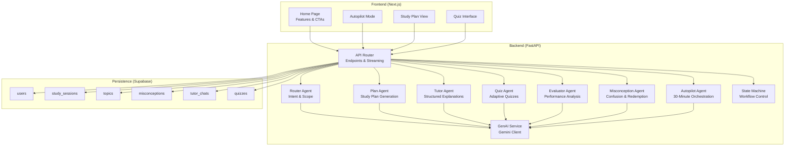
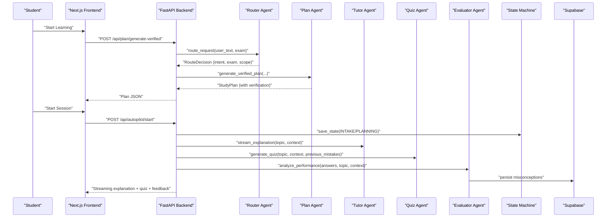
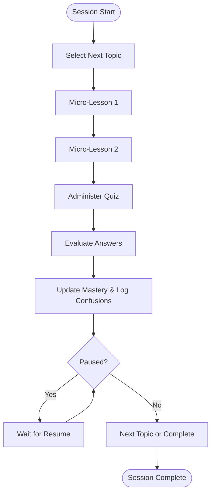
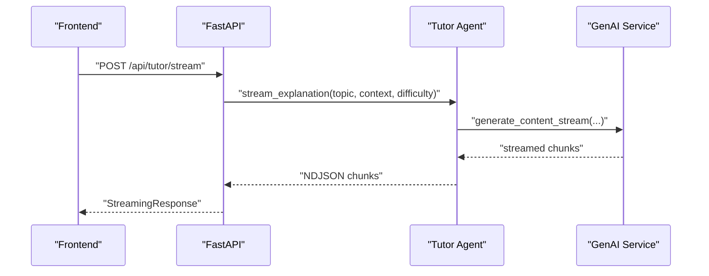
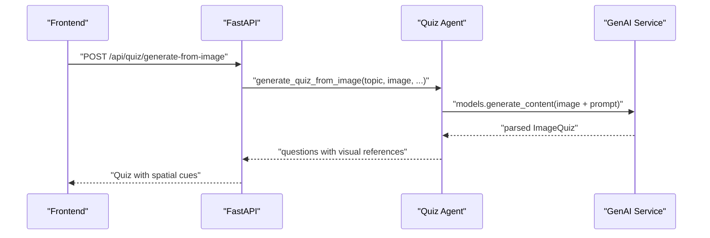
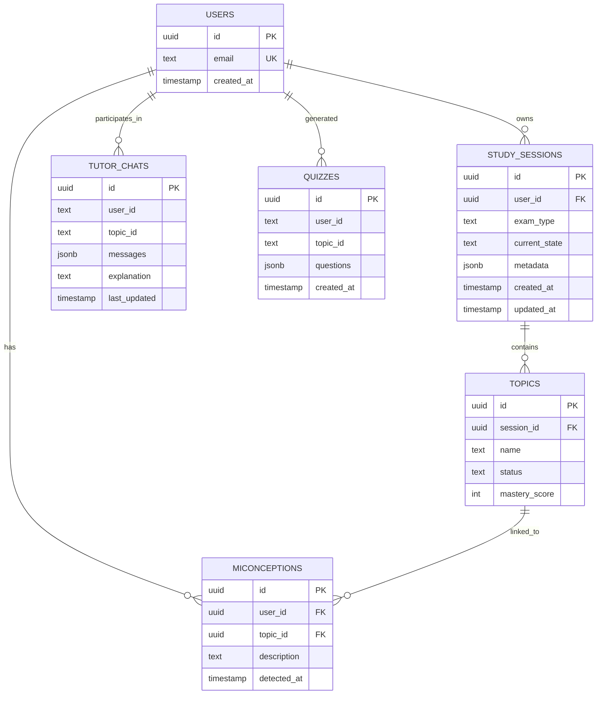
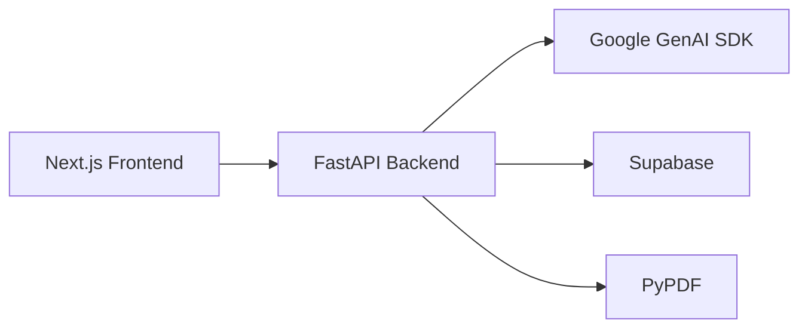

# Project Overview

<cite>
**Referenced Files in This Document**
- [backend/main.py](file://backend/main.py)
- [backend/router.py](file://backend/router.py)
- [backend/agents/autopilot_agent.py](file://backend/agents/autopilot_agent.py)
- [backend/agents/state_machine.py](file://backend/agents/state_machine.py)
- [backend/agents/plan_agent.py](file://backend/agents/plan_agent.py)
- [backend/agents/tutor_agent.py](file://backend/agents/tutor_agent.py)
- [backend/agents/quiz_agent.py](file://backend/agents/quiz_agent.py)
- [backend/services/genai_service.py](file://backend/services/genai_service.py)
- [backend/migrations/001_create_core_schema.sql](file://backend/migrations/001_create_core_schema.sql)
- [backend/migrations/004_create_persistence_tables.sql](file://backend/migrations/004_create_persistence_tables.sql)
- [frontend/app/layout.tsx](file://frontend/app/layout.tsx)
- [frontend/app/page.tsx](file://frontend/app/page.tsx)
- [frontend/package.json](file://frontend/package.json)
- [backend/requirements.txt](file://backend/requirements.txt)
</cite>

## Table of Contents
1. [Introduction](#introduction)
2. [Project Structure](#project-structure)
3. [Core Components](#core-components)
4. [Architecture Overview](#architecture-overview)
5. [Detailed Component Analysis](#detailed-component-analysis)
6. [Dependency Analysis](#dependency-analysis)
7. [Performance Considerations](#performance-considerations)
8. [Troubleshooting Guide](#troubleshooting-guide)
9. [Conclusion](#conclusion)

## Introduction
ExamMentor AI is a multi-agent AI-powered study coaching platform designed for competitive exam preparation across NEET, JEE, UPSC, and CAT. The platform’s purpose is to deliver autonomous, personalized learning experiences through a combination of structured study plans, interactive AI tutoring, adaptive quizzing, and misconception detection. Built for speed and innovation, it leverages FastAPI for a responsive backend, Next.js for a modern frontend, Google Gemini AI models for reasoning and generation, and Supabase for persistence and real-time collaboration.

The platform emphasizes “Action Era” capabilities: long-running autonomous sessions, self-correcting plans, multimodal quiz generation, streaming explanations, and 30-minute unattended learning. These features collectively enable students to learn independently, receive immediate feedback, and track mastery over time.

## Project Structure
The repository is organized into a backend (FastAPI) and a frontend (Next.js) with shared agent logic and a Supabase-backed persistence layer. The backend exposes REST endpoints for each agent capability, streams real-time tutoring, and orchestrates autonomous learning sessions. The frontend provides guided flows for onboarding, plan viewing, quiz taking, and autopilot mode, integrating with the backend APIs and Supabase for user and session state.

**Diagram sources**
- [backend/main.py](file://backend/main.py#L120-L800)
- [backend/router.py](file://backend/router.py#L64-L88)
- [backend/agents/plan_agent.py](file://backend/agents/plan_agent.py#L49-L87)
- [backend/agents/tutor_agent.py](file://backend/agents/tutor_agent.py#L51-L126)
- [backend/agents/quiz_agent.py](file://backend/agents/quiz_agent.py#L53-L111)
- [backend/agents/autopilot_agent.py](file://backend/agents/autopilot_agent.py#L584-L628)
- [backend/agents/state_machine.py](file://backend/agents/state_machine.py#L38-L136)
- [backend/services/genai_service.py](file://backend/services/genai_service.py#L1-L10)
- [backend/migrations/001_create_core_schema.sql](file://backend/migrations/001_create_core_schema.sql#L7-L45)
- [backend/migrations/004_create_persistence_tables.sql](file://backend/migrations/004_create_persistence_tables.sql#L3-L26)

**Section sources**
- [backend/main.py](file://backend/main.py#L1-L120)
- [frontend/app/layout.tsx](file://frontend/app/layout.tsx#L20-L23)
- [frontend/app/page.tsx](file://frontend/app/page.tsx#L21-L198)

## Core Components
- Multi-Agent AI System
  - Plan Agent: Generates and verifies study plans with structured outputs and self-correction loops.
  - Tutor Agent: Provides streaming and structured explanations with multimodal support.
  - Quiz Agent: Creates adaptive quizzes and multimodal diagram-based quizzes.
  - Evaluator Agent: Analyzes quiz performance and persists misconceptions.
  - Misconception Agent: Identifies wrong reasoning and generates targeted redemption content.
  - Autopilot Agent: Orchestrates 30-minute autonomous learning sessions with interactive quizzing.
  - State Machine: Enforces valid transitions across intake, planning, learning, quizzing, analyzing, and completion.
  - Router Agent: Determines intent, exam type, and subject scope from user input.

- Backend (FastAPI)
  - Streaming endpoints for real-time UI feedback.
  - Structured request/response models for all agents.
  - Session management and autopilot controls.
  - PDF text extraction and image description endpoints.

- Frontend (Next.js)
  - Home page showcasing Action Era features.
  - Onboarding and plan/quiz/autopilot flows.
  - Integration with Supabase and Gemini SDKs.

- Persistence (Supabase)
  - Users, study sessions, topics, misconceptions, tutor chats, and quizzes tables.
  - Row-level security and indexes for performance.

**Section sources**
- [backend/agents/plan_agent.py](file://backend/agents/plan_agent.py#L49-L160)
- [backend/agents/tutor_agent.py](file://backend/agents/tutor_agent.py#L51-L186)
- [backend/agents/quiz_agent.py](file://backend/agents/quiz_agent.py#L53-L200)
- [backend/agents/autopilot_agent.py](file://backend/agents/autopilot_agent.py#L100-L544)
- [backend/agents/state_machine.py](file://backend/agents/state_machine.py#L38-L136)
- [backend/router.py](file://backend/router.py#L64-L128)
- [backend/main.py](file://backend/main.py#L120-L800)
- [backend/migrations/001_create_core_schema.sql](file://backend/migrations/001_create_core_schema.sql#L7-L45)
- [backend/migrations/004_create_persistence_tables.sql](file://backend/migrations/004_create_persistence_tables.sql#L3-L26)
- [frontend/app/page.tsx](file://frontend/app/page.tsx#L77-L151)

## Architecture Overview
The system is built around a multi-agent architecture coordinated by the backend API. The Router Agent interprets user intent and scope, the Plan Agent generates and verifies study plans, the Tutor Agent delivers explanations (streaming and structured), the Quiz Agent creates adaptive assessments, and the Evaluator/Misconception Agents diagnose and remediate misconceptions. The Autopilot Agent orchestrates end-to-end autonomous sessions, while the State Machine enforces workflow transitions. All agents use the centralized GenAI service to call Gemini models, and the backend persists state and analytics to Supabase.

**Diagram sources**
- [backend/main.py](file://backend/main.py#L128-L222)
- [backend/router.py](file://backend/router.py#L64-L88)
- [backend/agents/plan_agent.py](file://backend/agents/plan_agent.py#L146-L160)
- [backend/agents/tutor_agent.py](file://backend/agents/tutor_agent.py#L51-L126)
- [backend/agents/quiz_agent.py](file://backend/agents/quiz_agent.py#L53-L111)
- [backend/agents/state_machine.py](file://backend/agents/state_machine.py#L80-L94)
- [backend/migrations/004_create_persistence_tables.sql](file://backend/migrations/004_create_persistence_tables.sql#L3-L26)

## Detailed Component Analysis

### Multi-Agent Orchestration
The multi-agent system coordinates specialized capabilities:
- Router Agent determines intent, exam type, and subject scope from natural language input.
- Plan Agent generates structured study plans and iteratively verifies them against syllabi and pedagogical constraints.
- Tutor Agent provides streaming explanations and structured outputs with multimodal support.
- Quiz Agent generates adaptive quizzes and multimodal diagram-based quizzes.
- Evaluator and Misconception Agents analyze performance and persist misconceptions for targeted remediation.
- Autopilot Agent orchestrates 30-minute autonomous sessions, selecting topics, delivering lessons, administering quizzes, and updating mastery.
- State Machine ensures valid transitions across the learning workflow.

```mermaid
classDiagram
class RouterAgent {
+route_request(user_text, exam) RouteDecision
+get_safe_syllabus(decision) str
}
class PlanAgent {
+generate_study_plan(...)
+verify_study_plan(plan, syllabus, exam) PlanVerification
+generate_verified_plan(...)
+generate_verified_plan_with_history(...)
}
class TutorAgent {
+stream_explanation(topic, context, difficulty, history, attached)
+generate_explanation(...)
+explain_image(...)
}
class QuizAgent {
+generate_quiz(topic, context, num, difficulty, prev_mistakes)
+generate_quiz_from_image(topic, image, ...)
+evaluate_answer(question, student_answer, topic_context)
}
class EvaluatorAgent {
+analyze_performance(answers, topic, context)
}
class MisconceptionAgent {
+analyze_and_bust_misconception(question, wrong_answer, topic_context)
}
class AutopilotAgent {
+start_autopilot(session_id, study_plan, exam_type, duration)
+get_session(session_id)
+pause/resume/stop(session_id)
}
class StateMachine {
+transition(current_phase, action) StudyPhase
+save_state(phase)
+load_state() StudyPhase
+log_action(action, metadata)
}
class GenAIService {
+client
}
RouterAgent --> GenAIService : "uses"
PlanAgent --> GenAIService : "uses"
TutorAgent --> GenAIService : "uses"
QuizAgent --> GenAIService : "uses"
EvaluatorAgent --> GenAIService : "uses"
MisconceptionAgent --> GenAIService : "uses"
AutopilotAgent --> GenAIService : "uses"
StateMachine --> Supabase : "persists"
```

**Diagram sources**
- [backend/router.py](file://backend/router.py#L64-L128)
- [backend/agents/plan_agent.py](file://backend/agents/plan_agent.py#L49-L160)
- [backend/agents/tutor_agent.py](file://backend/agents/tutor_agent.py#L51-L186)
- [backend/agents/quiz_agent.py](file://backend/agents/quiz_agent.py#L53-L200)
- [backend/agents/autopilot_agent.py](file://backend/agents/autopilot_agent.py#L584-L628)
- [backend/agents/state_machine.py](file://backend/agents/state_machine.py#L38-L136)
- [backend/services/genai_service.py](file://backend/services/genai_service.py#L1-L10)

**Section sources**
- [backend/router.py](file://backend/router.py#L64-L128)
- [backend/agents/plan_agent.py](file://backend/agents/plan_agent.py#L146-L200)
- [backend/agents/tutor_agent.py](file://backend/agents/tutor_agent.py#L51-L186)
- [backend/agents/quiz_agent.py](file://backend/agents/quiz_agent.py#L53-L200)
- [backend/agents/autopilot_agent.py](file://backend/agents/autopilot_agent.py#L100-L544)
- [backend/agents/state_machine.py](file://backend/agents/state_machine.py#L38-L136)

### Autopilot 30-Minute Autonomous Learning
Autopilot orchestrates a full learning cycle within a bounded time window:
- Selects the next topic based on mastery and plan.
- Teaches two micro-lessons.
- Administers a short quiz.
- Analyzes results and updates mastery.
- Supports interactive answering and pause/resume/stop controls.

**Diagram sources**
- [backend/agents/autopilot_agent.py](file://backend/agents/autopilot_agent.py#L431-L544)
- [backend/main.py](file://backend/main.py#L582-L757)

**Section sources**
- [backend/agents/autopilot_agent.py](file://backend/agents/autopilot_agent.py#L584-L628)
- [backend/main.py](file://backend/main.py#L582-L757)

### Streaming Explanations and Real-Time UI Feedback
The Tutor Agent supports streaming responses to provide real-time UI updates during explanations, enabling smooth, engaging tutoring sessions.

**Diagram sources**
- [backend/agents/tutor_agent.py](file://backend/agents/tutor_agent.py#L51-L126)
- [backend/main.py](file://backend/main.py#L245-L260)
- [backend/services/genai_service.py](file://backend/services/genai_service.py#L1-L10)

**Section sources**
- [backend/agents/tutor_agent.py](file://backend/agents/tutor_agent.py#L51-L126)
- [backend/main.py](file://backend/main.py#L245-L260)

### Multimodal Quiz Generation from Diagrams
The Quiz Agent can analyze images and generate questions that reference specific visual regions, demonstrating multimodal reasoning.

**Diagram sources**
- [backend/agents/quiz_agent.py](file://backend/agents/quiz_agent.py#L138-L200)
- [backend/main.py](file://backend/main.py#L356-L400)
- [backend/services/genai_service.py](file://backend/services/genai_service.py#L1-L10)

**Section sources**
- [backend/agents/quiz_agent.py](file://backend/agents/quiz_agent.py#L138-L200)
- [backend/main.py](file://backend/main.py#L356-L400)

### Persistent State and Mastery Tracking
Supabase tables capture user identity, study sessions, topics, misconceptions, and chat/quiz history, enabling continuity and analytics.

**Diagram sources**
- [backend/migrations/001_create_core_schema.sql](file://backend/migrations/001_create_core_schema.sql#L7-L45)
- [backend/migrations/004_create_persistence_tables.sql](file://backend/migrations/004_create_persistence_tables.sql#L3-L26)

**Section sources**
- [backend/migrations/001_create_core_schema.sql](file://backend/migrations/001_create_core_schema.sql#L7-L45)
- [backend/migrations/004_create_persistence_tables.sql](file://backend/migrations/004_create_persistence_tables.sql#L3-L26)

## Dependency Analysis
- Technology Stack
  - Backend: FastAPI, Python, Google GenAI SDK, Supabase Python client, PyPDF for PDF text extraction.
  - Frontend: Next.js, React, @ai-sdk/google, @supabase/supabase-js, TailwindCSS, KaTeX.
  - AI Models: Gemini 2.0 Flash, Gemini 2.5 Pro Preview, Gemini 3 Flash Preview (various endpoints).
  - Database: Supabase PostgreSQL with vector extension enabled.

- External Integrations
  - Gemini AI models for structured outputs, streaming, and multimodal generation.
  - Supabase for user management, session state, topics, misconceptions, and chat/quiz persistence.
  - PDF parsing via PyPDF for extracting study material context.

**Diagram sources**
- [frontend/package.json](file://frontend/package.json#L11-L31)
- [backend/requirements.txt](file://backend/requirements.txt#L8-L32)
- [backend/main.py](file://backend/main.py#L15-L21)

**Section sources**
- [frontend/package.json](file://frontend/package.json#L11-L31)
- [backend/requirements.txt](file://backend/requirements.txt#L8-L32)
- [backend/main.py](file://backend/main.py#L15-L21)

## Performance Considerations
- Streaming Responses: Use NDJSON streaming for tutoring to reduce latency and improve perceived responsiveness.
- Retry Logic: Implement exponential backoff for model overload scenarios to handle rate limits gracefully.
- Asynchronous Operations: Keep I/O-bound tasks asynchronous to maximize throughput.
- Database Indexes: Ensure proper indexing on frequently queried columns (user_id, topic_id, created_at).
- Model Selection: Prefer lighter models for routing and quick decisions; reserve heavier models for complex reasoning.

## Troubleshooting Guide
- Health Checks: Use the health endpoint to verify backend availability.
- CORS Issues: Confirm CORS middleware allows requests from the frontend origin.
- Gemini API Errors: Handle 503/429 responses with retry logic; adjust model selection if overloaded.
- Session State: Verify session creation and retrieval endpoints; ensure session_id uniqueness and lifecycle management.
- PDF Extraction: Validate base64 encoding and page limits; handle empty or unreadable PDFs gracefully.
- Persistence Failures: Monitor Supabase insert/update operations; implement logging for failures.

**Section sources**
- [backend/main.py](file://backend/main.py#L120-L123)
- [backend/main.py](file://backend/main.py#L30-L37)
- [backend/agents/autopilot_agent.py](file://backend/agents/autopilot_agent.py#L142-L162)
- [backend/main.py](file://backend/main.py#L267-L284)
- [backend/main.py](file://backend/main.py#L523-L538)

## Conclusion
ExamMentor AI delivers a comprehensive, autonomous study coaching experience tailored for competitive exam aspirants. By combining structured AI agents, multimodal reasoning, streaming explanations, and persistent mastery tracking, it enables students to learn independently, adaptively, and effectively. The platform’s Action Era features—self-correcting plans, 30-minute autopilot sessions, and multimodal quizzes—position it as a powerful tool for modern exam preparation, with a clear path for future enhancements and scalability.