# AI Integration and Prompt Engineering

<cite>
**Referenced Files in This Document**
- [genai_service.py](file://backend/services/genai_service.py)
- [schemas.py](file://backend/agents/schemas.py)
- [router.py](file://backend/router.py)
- [plan_agent.py](file://backend/agents/plan_agent.py)
- [tutor_agent.py](file://backend/agents/tutor_agent.py)
- [quiz_agent.py](file://backend/agents/quiz_agent.py)
- [misconception_agent.py](file://backend/agents/misconception_agent.py)
- [evaluator_agent.py](file://backend/agents/evaluator_agent.py)
- [autopilot_agent.py](file://backend/agents/autopilot_agent.py)
- [state_machine.py](file://backend/agents/state_machine.py)
- [main.py](file://backend/main.py)
- [.env](file://backend/.env)
- [requirements.txt](file://backend/requirements.txt)
- [test_gemini.py](file://backend/tests/test_gemini.py)
</cite>

## Table of Contents
1. [Introduction](#introduction)
2. [Project Structure](#project-structure)
3. [Core Components](#core-components)
4. [Architecture Overview](#architecture-overview)
5. [Detailed Component Analysis](#detailed-component-analysis)
6. [Dependency Analysis](#dependency-analysis)
7. [Performance Considerations](#performance-considerations)
8. [Troubleshooting Guide](#troubleshooting-guide)
9. [Conclusion](#conclusion)

## Introduction
This document explains how Exammentor AI integrates Google’s Gemini 3.0 (and related preview models) to power a multi-agent tutoring system. It covers structured output schemas using Pydantic, prompt engineering patterns for different agent types, schema-based validation, error handling and retry strategies, multimodal capabilities, routing and syllabus scoping, authentication and cloud integrations, cost optimization, fallback mechanisms, model selection criteria, and performance monitoring.

## Project Structure
The backend is a FastAPI application that exposes REST endpoints for agents and orchestration. Agents encapsulate domain-specific logic and integrate with the GenAI service for model calls. A central router classifies user intents and scopes content to appropriate syllabi. State persistence is integrated with Supabase.

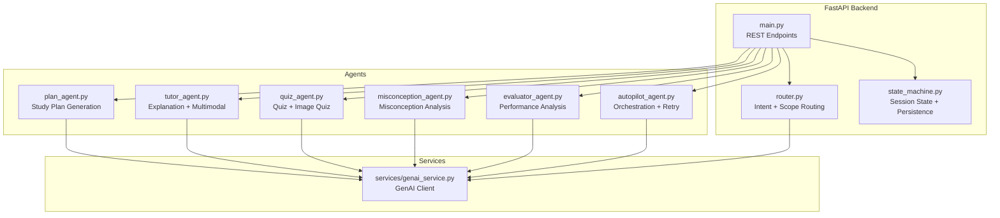

**Diagram sources**
- [main.py](file://backend/main.py#L1-L843)
- [router.py](file://backend/router.py#L1-L129)
- [state_machine.py](file://backend/agents/state_machine.py#L1-L136)
- [plan_agent.py](file://backend/agents/plan_agent.py#L1-L524)
- [tutor_agent.py](file://backend/agents/tutor_agent.py#L1-L277)
- [quiz_agent.py](file://backend/agents/quiz_agent.py#L1-L283)
- [misconception_agent.py](file://backend/agents/misconception_agent.py#L1-L64)
- [evaluator_agent.py](file://backend/agents/evaluator_agent.py#L1-L198)
- [autopilot_agent.py](file://backend/agents/autopilot_agent.py#L1-L628)
- [genai_service.py](file://backend/services/genai_service.py#L1-L10)

**Section sources**
- [main.py](file://backend/main.py#L1-L843)
- [router.py](file://backend/router.py#L1-L129)
- [state_machine.py](file://backend/agents/state_machine.py#L1-L136)
- [genai_service.py](file://backend/services/genai_service.py#L1-L10)

## Core Components
- GenAI Service: Initializes the Google GenAI client and exposes a shared client for agents.
- Agent Schemas: Pydantic models define strict output schemas for reliable JSON responses.
- Router: Classifies intent, exam type, and subject scope; scopes syllabi safely.
- Agents:
  - Plan Agent: Generates and verifies study plans with self-correction.
  - Tutor Agent: Provides structured explanations and multimodal explanations.
  - Quiz Agent: Creates adaptive quizzes and evaluates answers.
  - Misconception Agent: Diagnoses conceptual errors and suggests remediation.
  - Evaluator Agent: Analyzes performance and generates recommendations.
  - Autopilot Agent: Orchestrates autonomous 30-minute learning sessions with retries and interactive quiz support.
- State Machine: Enforces valid workflow transitions and persists session state to Supabase.
- API Endpoints: FastAPI routes expose all agent capabilities and session management.

**Section sources**
- [genai_service.py](file://backend/services/genai_service.py#L1-L10)
- [schemas.py](file://backend/agents/schemas.py#L1-L106)
- [router.py](file://backend/router.py#L1-L129)
- [plan_agent.py](file://backend/agents/plan_agent.py#L1-L524)
- [tutor_agent.py](file://backend/agents/tutor_agent.py#L1-L277)
- [quiz_agent.py](file://backend/agents/quiz_agent.py#L1-L283)
- [misconception_agent.py](file://backend/agents/misconception_agent.py#L1-L64)
- [evaluator_agent.py](file://backend/agents/evaluator_agent.py#L1-L198)
- [autopilot_agent.py](file://backend/agents/autopilot_agent.py#L1-L628)
- [state_machine.py](file://backend/agents/state_machine.py#L1-L136)
- [main.py](file://backend/main.py#L1-L843)

## Architecture Overview
The system integrates Google Cloud GenAI with FastAPI endpoints. Agents use structured outputs to guarantee valid JSON, enabling robust downstream processing. The router scopes content to syllabi, and the state machine ensures coherent session progression. Supabase persists session state and user data.

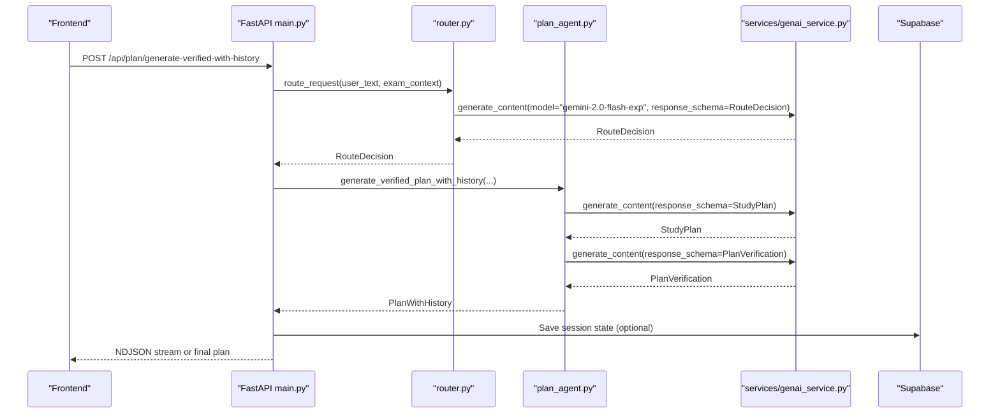

**Diagram sources**
- [main.py](file://backend/main.py#L162-L222)
- [router.py](file://backend/router.py#L64-L88)
- [plan_agent.py](file://backend/agents/plan_agent.py#L163-L304)
- [genai_service.py](file://backend/services/genai_service.py#L1-L10)

**Section sources**
- [main.py](file://backend/main.py#L162-L222)
- [router.py](file://backend/router.py#L64-L88)
- [plan_agent.py](file://backend/agents/plan_agent.py#L163-L304)
- [genai_service.py](file://backend/services/genai_service.py#L1-L10)

## Detailed Component Analysis

### GenAI Service and Authentication
- Initializes the GenAI client using the API key from environment variables.
- Exposes a shared client for agents to call model APIs asynchronously.

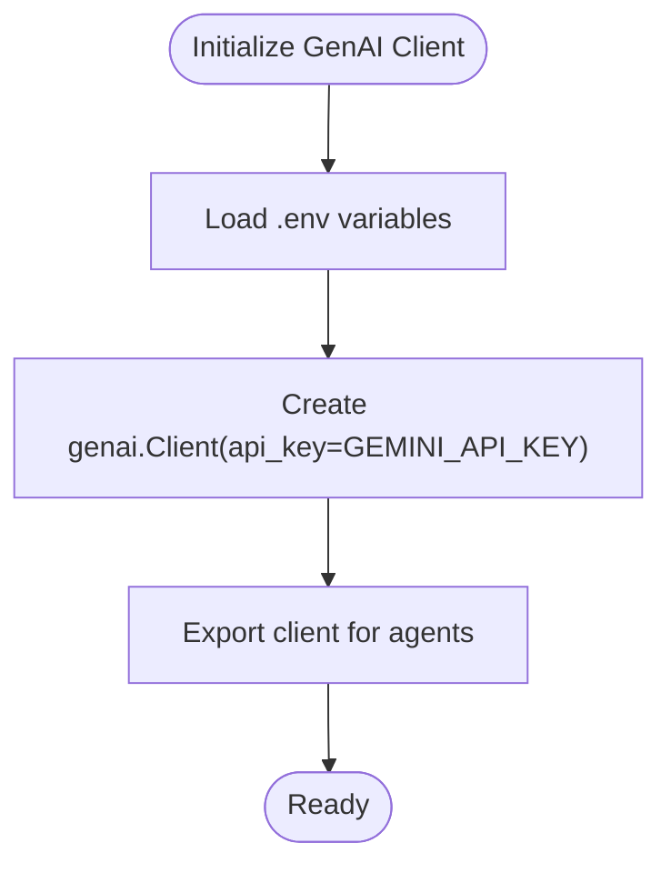

**Diagram sources**
- [genai_service.py](file://backend/services/genai_service.py#L1-L10)
- [.env](file://backend/.env#L1-L5)

**Section sources**
- [genai_service.py](file://backend/services/genai_service.py#L1-L10)
- [.env](file://backend/.env#L1-L5)

### Structured Output Schemas with Pydantic
- Defines strict schemas for each agent’s output to enforce valid JSON.
- Provides a helper to configure response_mime_type and response_schema for Gemini.

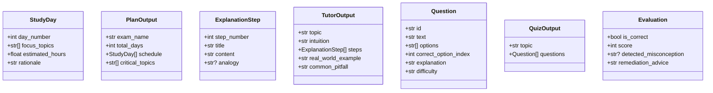

**Diagram sources**
- [schemas.py](file://backend/agents/schemas.py#L16-L105)

**Section sources**
- [schemas.py](file://backend/agents/schemas.py#L1-L106)

### Router: Intent Classification and Syllabus Scoping
- Identifies intent (plan, explain, quiz, autopilot), exam type, and subject scope.
- Safely retrieves syllabus text based on scope and exam type.
- Uses a lightweight model for routing to reduce latency.

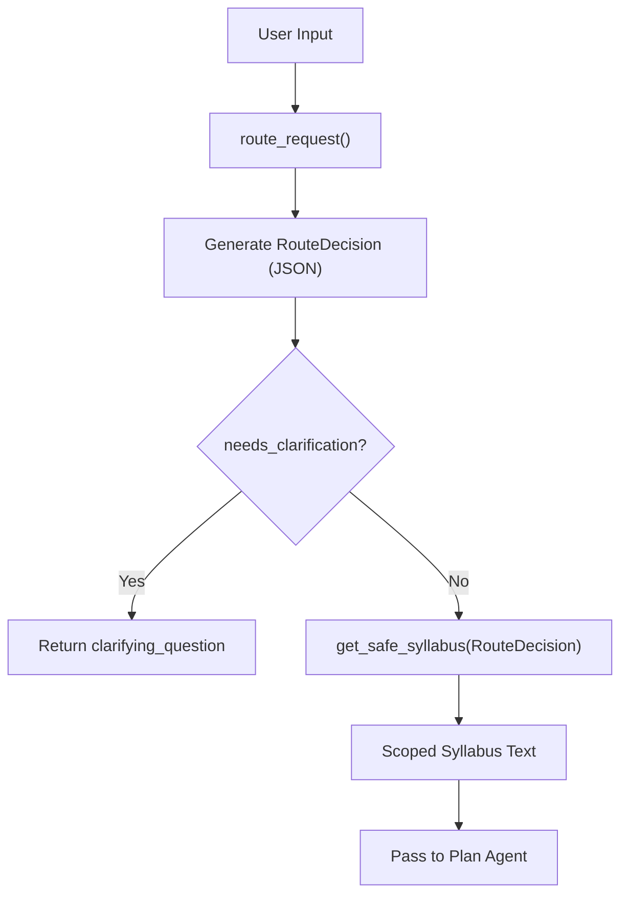

**Diagram sources**
- [router.py](file://backend/router.py#L64-L88)
- [router.py](file://backend/router.py#L91-L129)

**Section sources**
- [router.py](file://backend/router.py#L1-L129)

### Plan Agent: Study Plan Generation and Self-Correction
- Generates a structured study plan using a schema-backed model call.
- Iteratively verifies and fixes the plan to meet coverage, feasibility, sequencing, and revision requirements.
- Streams the process with NDJSON for UI feedback.

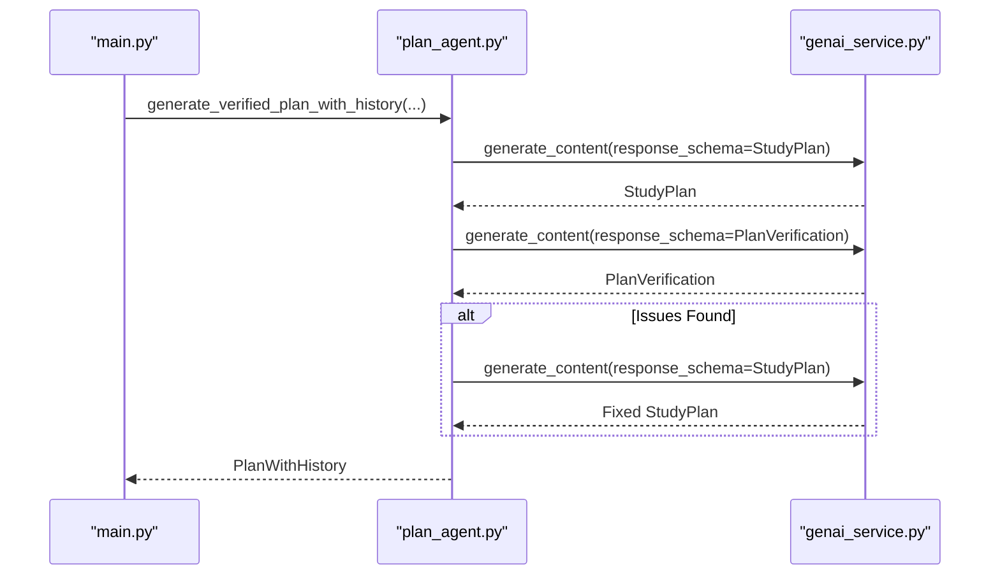

**Diagram sources**
- [plan_agent.py](file://backend/agents/plan_agent.py#L163-L304)
- [genai_service.py](file://backend/services/genai_service.py#L1-L10)

**Section sources**
- [plan_agent.py](file://backend/agents/plan_agent.py#L1-L524)

### Tutor Agent: Explanation Generation and Multimodal Grounding
- Generates structured explanations with steps, analogies, pitfalls, and practice questions.
- Streams explanations for real-time UI rendering.
- Supports multimodal explanations using images and image descriptions.

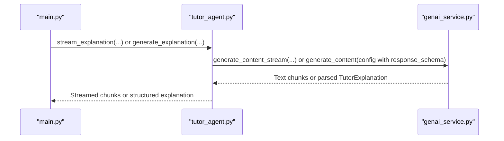

**Diagram sources**
- [tutor_agent.py](file://backend/agents/tutor_agent.py#L51-L186)
- [genai_service.py](file://backend/services/genai_service.py#L1-L10)

**Section sources**
- [tutor_agent.py](file://backend/agents/tutor_agent.py#L1-L277)

### Quiz Agent: Adaptive Quizzes and Multimodal Quiz Creation
- Generates adaptive quizzes with concept alignment and difficulty targeting.
- Evaluates answers and identifies misconceptions.
- Creates image-grounded quizzes with spatial references.

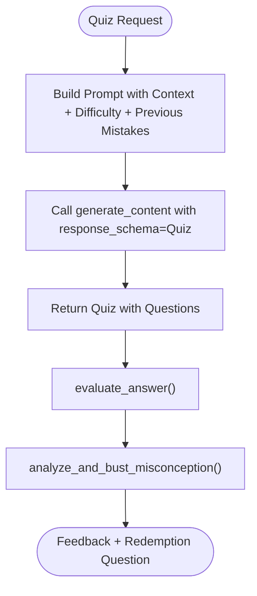

**Diagram sources**
- [quiz_agent.py](file://backend/agents/quiz_agent.py#L53-L111)
- [quiz_agent.py](file://backend/agents/quiz_agent.py#L206-L246)
- [misconception_agent.py](file://backend/agents/misconception_agent.py#L21-L63)

**Section sources**
- [quiz_agent.py](file://backend/agents/quiz_agent.py#L1-L283)
- [misconception_agent.py](file://backend/agents/misconception_agent.py#L1-L64)

### Evaluator Agent: Performance Analysis and Recommendations
- Analyzes quiz results to compute mastery, detect misconceptions, and suggest actionable recommendations.
- Can generate progress reports across sessions.

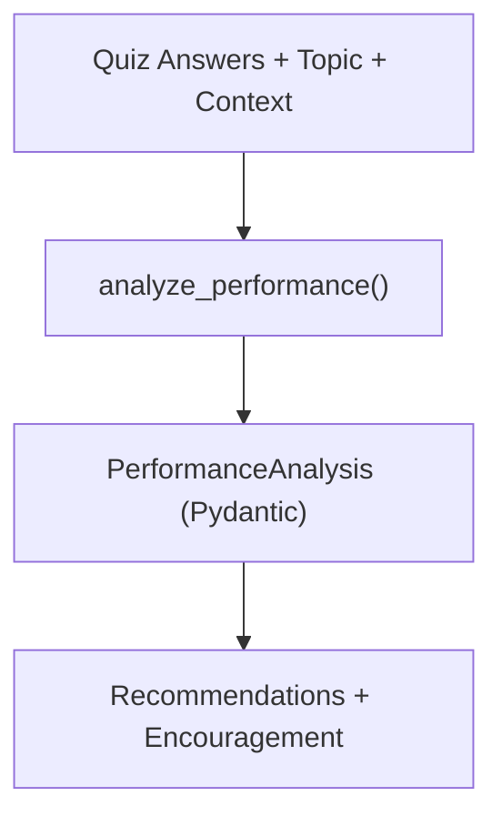

**Diagram sources**
- [evaluator_agent.py](file://backend/agents/evaluator_agent.py#L59-L115)

**Section sources**
- [evaluator_agent.py](file://backend/agents/evaluator_agent.py#L1-L198)

### Autopilot Agent: Autonomous Learning Orchestration
- Orchestrates topic selection, micro-lessons, quizzes, and misconception analysis.
- Implements interactive quiz mode with user answer submission.
- Includes retry logic with exponential backoff for rate-limited or overloaded responses.
- Emits a run log with reasoning for each decision.

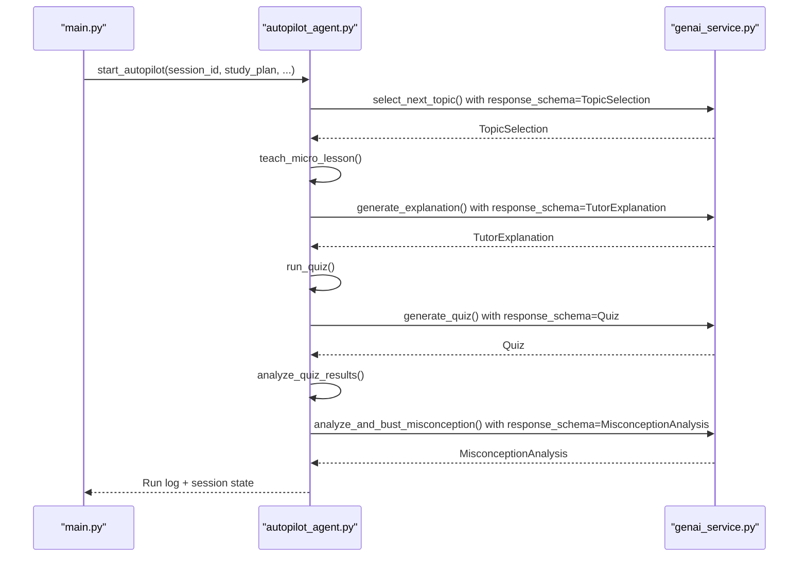

**Diagram sources**
- [autopilot_agent.py](file://backend/agents/autopilot_agent.py#L182-L429)
- [genai_service.py](file://backend/services/genai_service.py#L1-L10)

**Section sources**
- [autopilot_agent.py](file://backend/agents/autopilot_agent.py#L1-L628)

### State Machine and Persistence
- Enforces valid transitions across study phases.
- Persists session state and logs actions to Supabase.
- Loads and resumes session state for continuity.

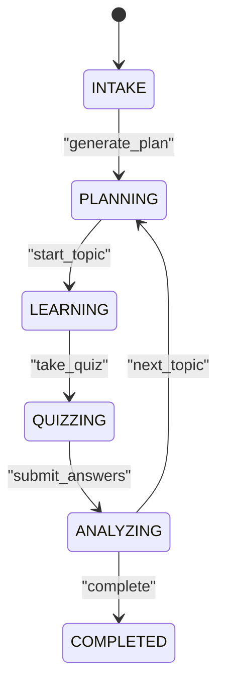

**Diagram sources**
- [state_machine.py](file://backend/agents/state_machine.py#L17-L78)

**Section sources**
- [state_machine.py](file://backend/agents/state_machine.py#L1-L136)
- [main.py](file://backend/main.py#L541-L571)

## Dependency Analysis
- External libraries include FastAPI, Pydantic, google-genai, supabase, uvicorn, pypdf, tenacity (retries), and python-dotenv.
- The GenAI client is centralized and reused across agents.
- Supabase is used for session persistence and user data.

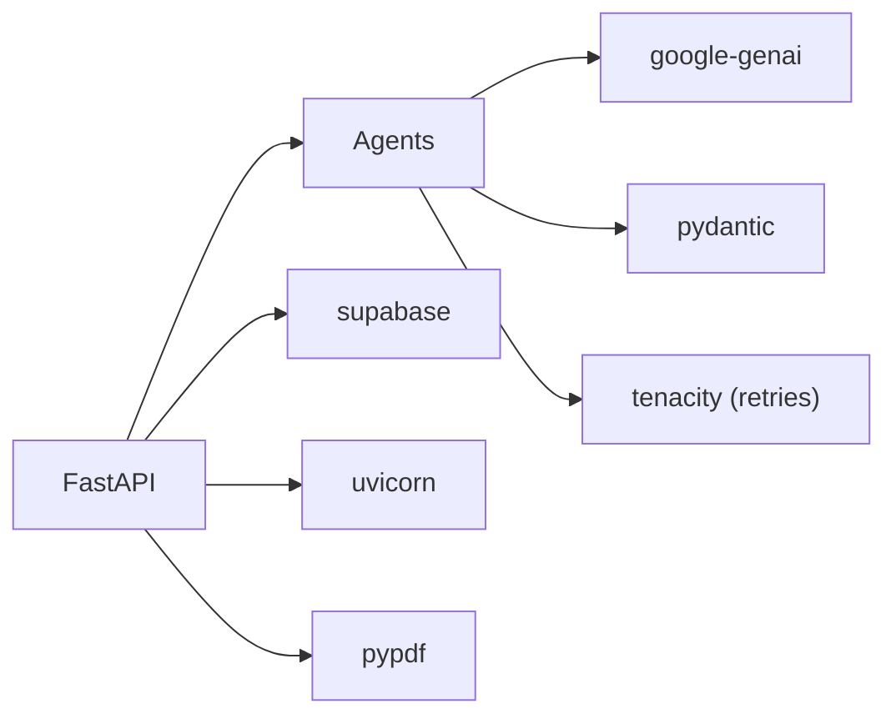

**Diagram sources**
- [requirements.txt](file://backend/requirements.txt#L1-L32)
- [genai_service.py](file://backend/services/genai_service.py#L1-L10)

**Section sources**
- [requirements.txt](file://backend/requirements.txt#L1-L32)
- [genai_service.py](file://backend/services/genai_service.py#L1-L10)

## Performance Considerations
- Structured outputs reduce parsing overhead and improve reliability.
- Streaming explanations improve perceived latency and UX.
- Asynchronous model calls enable concurrency and responsiveness.
- Exponential backoff reduces retry storms under rate limits.
- Model selection:
  - Use lighter models for routing and quick decisions.
  - Use Gemini 3 Flash for fast, cost-effective generation.
  - Use Gemini 3 Pro for higher accuracy when needed.
- Cost optimization:
  - Prefer streaming and smaller models for frequent operations.
  - Limit PDF extraction to a capped number of pages.
  - Cache syllabus-scoped prompts where feasible.
- Monitoring:
  - Track session run logs and step durations in Autopilot.
  - Capture endpoint latencies and error rates.
  - Monitor Supabase write/read throughput.

[No sources needed since this section provides general guidance]

## Troubleshooting Guide
- Authentication failures:
  - Verify GEMINI_API_KEY and GEMINI_MODEL in environment variables.
  - Confirm the GenAI client initialization and endpoint availability.
- Rate limiting and overloads:
  - The Autopilot engine retries with exponential backoff on 503/429 or overloaded signals.
  - Consider adding jitter and circuit breaker patterns for resilience.
- Schema mismatches:
  - Ensure response_schema matches the Pydantic model exactly.
  - Validate JSON output with the helper configuration.
- PDF extraction issues:
  - Limit pages and handle empty text gracefully.
- State persistence:
  - Confirm SUPABASE_URL and SUPABASE_KEY are configured.
  - Inspect Supabase table permissions and network connectivity.

**Section sources**
- [.env](file://backend/.env#L1-L5)
- [test_gemini.py](file://backend/tests/test_gemini.py#L1-L18)
- [autopilot_agent.py](file://backend/agents/autopilot_agent.py#L142-L161)
- [main.py](file://backend/main.py#L267-L284)
- [state_machine.py](file://backend/agents/state_machine.py#L56-L63)

## Conclusion
Exammentor AI leverages Gemini 3.0 and preview models through a centralized GenAI service, enforcing reliable, schema-backed outputs with Pydantic. The system integrates intent classification, syllabus scoping, multimodal processing, and autonomous orchestration. Robust retry logic, streaming responses, and Supabase persistence deliver a responsive, scalable tutoring experience. By applying model selection criteria, cost-conscious design, and comprehensive monitoring, the platform supports both experimentation and production-grade performance.