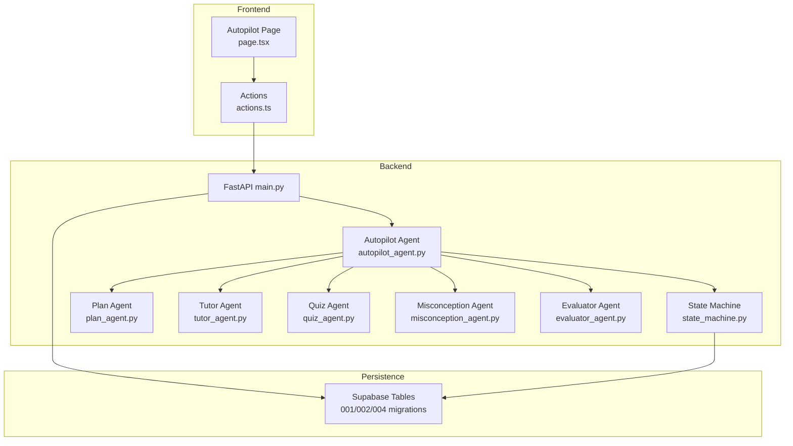
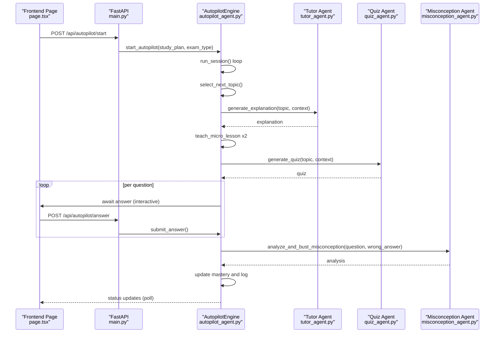
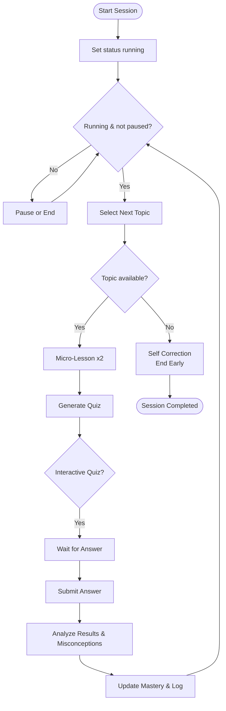
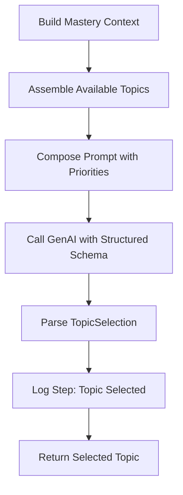
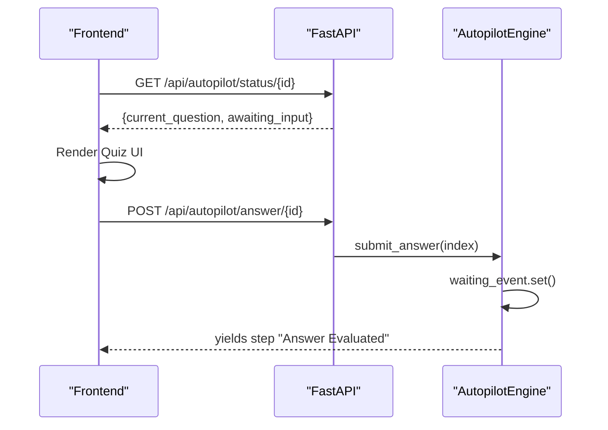
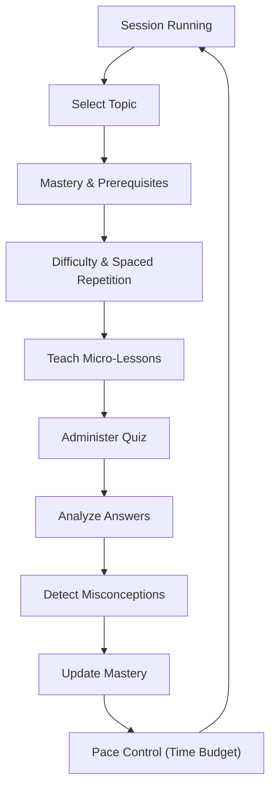
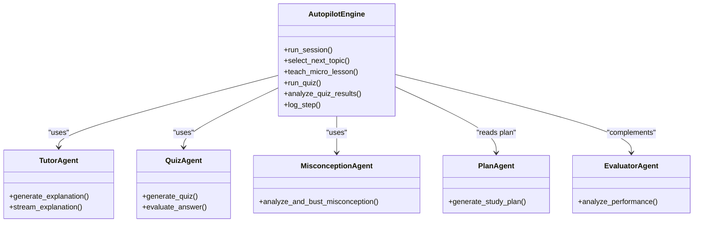
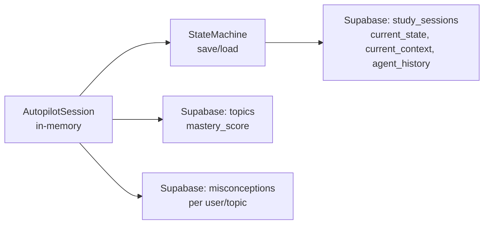
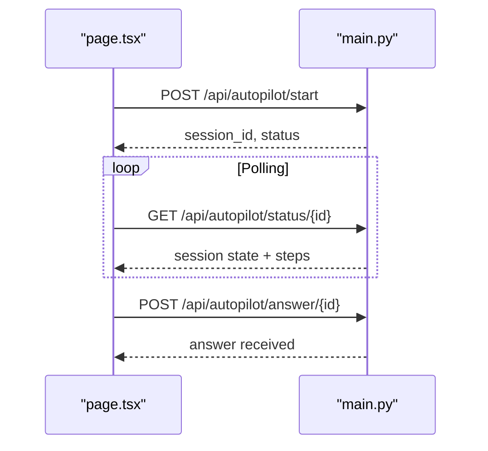
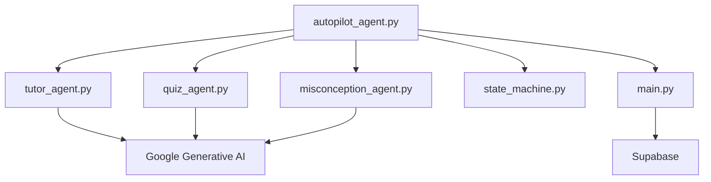

# Autopilot Agent

<cite>
**Referenced Files in This Document**
- [autopilot_agent.py](file://backend/agents/autopilot_agent.py)
- [main.py](file://backend/main.py)
- [schemas.py](file://backend/agents/schemas.py)
- [state_machine.py](file://backend/agents/state_machine.py)
- [plan_agent.py](file://backend/agents/plan_agent.py)
- [tutor_agent.py](file://backend/agents/tutor_agent.py)
- [quiz_agent.py](file://backend/agents/quiz_agent.py)
- [misconception_agent.py](file://backend/agents/misconception_agent.py)
- [evaluator_agent.py](file://backend/agents/evaluator_agent.py)
- [001_create_core_schema.sql](file://backend/migrations/001_create_core_schema.sql)
- [002_add_session_context.sql](file://backend/migrations/002_add_session_context.sql)
- [004_create_persistence_tables.sql](file://backend/migrations/004_create_persistence_tables.sql)
- [page.tsx](file://frontend/app/autopilot/page.tsx)
- [actions.ts](file://frontend/app/actions.ts)
</cite>

## Table of Contents
1. [Introduction](#introduction)
2. [Project Structure](#project-structure)
3. [Core Components](#core-components)
4. [Architecture Overview](#architecture-overview)
5. [Detailed Component Analysis](#detailed-component-analysis)
6. [Dependency Analysis](#dependency-analysis)
7. [Performance Considerations](#performance-considerations)
8. [Troubleshooting Guide](#troubleshooting-guide)
9. [Conclusion](#conclusion)
10. [Appendices](#appendices)

## Introduction
The Autopilot Agent orchestrates autonomous 30-minute learning sessions, demonstrating “Action Era” autonomy by selecting topics, delivering micro-lessons, administering quizzes, and self-correcting based on misconceptions. It integrates tightly with other agents (Planner, Tutor, Quiz, Misconception, Evaluator) and persists state for unattended operation. The frontend exposes a hands-free experience with interactive controls for pause/resume/stop and real-time visibility into the AI’s reasoning through a live run log.

## Project Structure
The Autopilot Agent lives in the backend agents module and is exposed via FastAPI endpoints. The frontend provides a dedicated page to start, monitor, and control autopilot sessions. Persistence leverages Supabase tables for sessions, topics, misconceptions, and cached plans.

**Diagram sources**
- [main.py](file://backend/main.py#L573-L757)
- [autopilot_agent.py](file://backend/agents/autopilot_agent.py#L560-L628)
- [state_machine.py](file://backend/agents/state_machine.py#L38-L136)
- [plan_agent.py](file://backend/agents/plan_agent.py#L49-L304)
- [tutor_agent.py](file://backend/agents/tutor_agent.py#L51-L247)
- [quiz_agent.py](file://backend/agents/quiz_agent.py#L53-L246)
- [misconception_agent.py](file://backend/agents/misconception_agent.py#L21-L63)
- [evaluator_agent.py](file://backend/agents/evaluator_agent.py#L59-L151)
- [001_create_core_schema.sql](file://backend/migrations/001_create_core_schema.sql#L14-L40)
- [002_add_session_context.sql](file://backend/migrations/002_add_session_context.sql#L2-L4)
- [004_create_persistence_tables.sql](file://backend/migrations/004_create_persistence_tables.sql#L3-L21)

**Section sources**
- [main.py](file://backend/main.py#L573-L757)
- [autopilot_agent.py](file://backend/agents/autopilot_agent.py#L560-L628)
- [page.tsx](file://frontend/app/autopilot/page.tsx#L141-L677)
- [actions.ts](file://frontend/app/actions.ts#L303-L319)
- [001_create_core_schema.sql](file://backend/migrations/001_create_core_schema.sql#L14-L40)
- [002_add_session_context.sql](file://backend/migrations/002_add_session_context.sql#L2-L4)
- [004_create_persistence_tables.sql](file://backend/migrations/004_create_persistence_tables.sql#L3-L21)

## Core Components
- AutopilotEngine: Orchestrates the full session lifecycle, including topic selection, micro-lesson delivery, quiz administration, misconception analysis, and logging.
- AutopilotSession: Holds runtime state (status, timing, current topic/phase, mastery, run log, and interactive UI state).
- Session Manager: In-memory registry for active sessions and engines; creates tasks to run sessions asynchronously.
- Frontend Autopilot Page: Polls session status, displays run log, and supports pause/resume/stop and answer submission.
- State Machine: Enforces valid transitions across study phases and persists state to Supabase.

**Section sources**
- [autopilot_agent.py](file://backend/agents/autopilot_agent.py#L99-L558)
- [main.py](file://backend/main.py#L573-L757)
- [page.tsx](file://frontend/app/autopilot/page.tsx#L141-L677)
- [state_machine.py](file://backend/agents/state_machine.py#L38-L136)

## Architecture Overview
The Autopilot Agent is the central coordinator that:
- Receives a study plan and optional user context.
- Runs a loop: select topic → teach micro-lessons → quiz → analyze → update mastery.
- Uses other agents for tutoring, quizzing, and misconception remediation.
- Persists session state and logs decisions for transparency.
- Integrates with the State Machine for structured workflow control.

**Diagram sources**
- [main.py](file://backend/main.py#L582-L757)
- [autopilot_agent.py](file://backend/agents/autopilot_agent.py#L431-L544)
- [tutor_agent.py](file://backend/agents/tutor_agent.py#L131-L186)
- [quiz_agent.py](file://backend/agents/quiz_agent.py#L53-L111)
- [misconception_agent.py](file://backend/agents/misconception_agent.py#L21-L63)
- [page.tsx](file://frontend/app/autopilot/page.tsx#L172-L214)

## Detailed Component Analysis

### Autopilot Engine and Session Lifecycle
- Session Initiation: The frontend starts a session via the API, which creates or retrieves a session and spins up an engine task. The engine sets status to running immediately to avoid frontend polling races.
- Main Loop: The engine runs a time-bounded loop (default 30 minutes) that cycles through topic selection, micro-lessons, quiz, and analysis. It yields steps for live UI updates.
- Interactive Quiz Mode: During quizzes, the engine waits for user answers and resumes execution upon receipt.
- State Management: The engine maintains current phase, topic, elapsed time, and a run log with timestamps and reasoning for each step.

**Diagram sources**
- [autopilot_agent.py](file://backend/agents/autopilot_agent.py#L431-L544)
- [main.py](file://backend/main.py#L582-L757)

**Section sources**
- [autopilot_agent.py](file://backend/agents/autopilot_agent.py#L431-L544)
- [main.py](file://backend/main.py#L582-L757)

### Topic Selection Algorithm
- Inputs: Study plan (schedule), current session mastery, topics attempted this session, exam type.
- Process: Builds a mastery context, constructs a prompt instructing prioritization of low mastery, prerequisite adherence, and spacing, and requests a structured selection response.
- Output: Selected topic, reasoning, priority score, prerequisites met, and estimated difficulty.

**Diagram sources**
- [autopilot_agent.py](file://backend/agents/autopilot_agent.py#L182-L256)
- [schemas.py](file://backend/agents/schemas.py#L89-L106)

**Section sources**
- [autopilot_agent.py](file://backend/agents/autopilot_agent.py#L182-L256)
- [schemas.py](file://backend/agents/schemas.py#L89-L106)

### Interactive Question Handling
- During quiz generation, the engine sets the current question and clears lesson content, signaling the frontend to render the quiz UI.
- The engine waits for an answer via an asyncio event. The frontend polls status and, when awaiting_input is true, allows the user to click an option.
- On submission, the frontend posts to the answer endpoint, which resolves the waiting event with the chosen index.

**Diagram sources**
- [main.py](file://backend/main.py#L648-L757)
- [autopilot_agent.py](file://backend/agents/autopilot_agent.py#L122-L141)
- [page.tsx](file://frontend/app/autopilot/page.tsx#L172-L214)

**Section sources**
- [main.py](file://backend/main.py#L648-L757)
- [autopilot_agent.py](file://backend/agents/autopilot_agent.py#L122-L141)
- [page.tsx](file://frontend/app/autopilot/page.tsx#L315-L332)

### Autonomous Decision-Making and Self-Correction
- Topic Sequencing: Uses mastery scores and prerequisites to decide next topic.
- Difficulty Adjustment: Uses previous misconceptions to tailor quiz difficulty and focus.
- Session Pacing: Enforces a time budget; the loop checks elapsed time and ends when target duration is reached.
- Self-Correction: If no topics remain, logs a self-correction step and ends early.

**Diagram sources**
- [autopilot_agent.py](file://backend/agents/autopilot_agent.py#L182-L544)

**Section sources**
- [autopilot_agent.py](file://backend/agents/autopilot_agent.py#L182-L544)

### Integration with Other Agents
- Tutor Agent: Provides micro-lesson explanations with structured outputs and streaming support.
- Quiz Agent: Generates adaptive quizzes and evaluates answers with misconception detection.
- Misconception Agent: Diagnoses conceptual errors and suggests remediation.
- Planner Agent: Supplies the study plan used for topic selection.
- Evaluator Agent: Provides performance analysis and recommendations (used in non-autopilot flows).

**Diagram sources**
- [autopilot_agent.py](file://backend/agents/autopilot_agent.py#L258-L429)
- [tutor_agent.py](file://backend/agents/tutor_agent.py#L131-L186)
- [quiz_agent.py](file://backend/agents/quiz_agent.py#L53-L111)
- [misconception_agent.py](file://backend/agents/misconception_agent.py#L21-L63)
- [plan_agent.py](file://backend/agents/plan_agent.py#L49-L87)
- [evaluator_agent.py](file://backend/agents/evaluator_agent.py#L59-L115)

**Section sources**
- [autopilot_agent.py](file://backend/agents/autopilot_agent.py#L258-L429)
- [tutor_agent.py](file://backend/agents/tutor_agent.py#L131-L186)
- [quiz_agent.py](file://backend/agents/quiz_agent.py#L53-L111)
- [misconception_agent.py](file://backend/agents/misconception_agent.py#L21-L63)
- [plan_agent.py](file://backend/agents/plan_agent.py#L49-L87)
- [evaluator_agent.py](file://backend/agents/evaluator_agent.py#L59-L115)

### State Management and Persistence
- Session State: Maintained in memory by the session manager; includes status, timing, current topic/phase, mastery, and run log.
- Persistent State: The State Machine can persist current state and context to Supabase and log agent actions for audit trails.
- Frontend Persistence: The backend also supports creating study sessions and saving/loading state via API endpoints.

**Diagram sources**
- [autopilot_agent.py](file://backend/agents/autopilot_agent.py#L560-L628)
- [state_machine.py](file://backend/agents/state_machine.py#L80-L135)
- [001_create_core_schema.sql](file://backend/migrations/001_create_core_schema.sql#L14-L40)
- [002_add_session_context.sql](file://backend/migrations/002_add_session_context.sql#L2-L4)
- [004_create_persistence_tables.sql](file://backend/migrations/004_create_persistence_tables.sql#L3-L21)

**Section sources**
- [autopilot_agent.py](file://backend/agents/autopilot_agent.py#L560-L628)
- [state_machine.py](file://backend/agents/state_machine.py#L80-L135)
- [001_create_core_schema.sql](file://backend/migrations/001_create_core_schema.sql#L14-L40)
- [002_add_session_context.sql](file://backend/migrations/002_add_session_context.sql#L2-L4)
- [004_create_persistence_tables.sql](file://backend/migrations/004_create_persistence_tables.sql#L3-L21)

### Frontend Integration and UX
- Start Session: Validates presence of a study plan, optionally creates a study session, and initiates autopilot.
- Status Polling: Polls the backend for session status and updates UI (current phase, content, questions, run log).
- Interactive Controls: Pause/Resume/Stop toggles the engine state; answer submission posts to the backend to resume quiz flow.
- Run Log: Displays each AutopilotStep with icons and reasoning for transparency.

**Diagram sources**
- [page.tsx](file://frontend/app/autopilot/page.tsx#L172-L214)
- [main.py](file://backend/main.py#L582-L757)

**Section sources**
- [page.tsx](file://frontend/app/autopilot/page.tsx#L141-L677)
- [actions.ts](file://frontend/app/actions.ts#L303-L319)
- [main.py](file://backend/main.py#L582-L757)

## Dependency Analysis
- Internal Dependencies:
  - Autopilot Agent depends on Tutor, Quiz, and Misconception agents for content and remediation.
  - Session Manager depends on the State Machine for persistence and transitions.
- External Dependencies:
  - Google Generative AI client for structured outputs and streaming.
  - Supabase for session, topic, and misconception persistence.
  - FastAPI for HTTP endpoints and streaming responses.

**Diagram sources**
- [autopilot_agent.py](file://backend/agents/autopilot_agent.py#L100-L121)
- [tutor_agent.py](file://backend/agents/tutor_agent.py#L71-L126)
- [quiz_agent.py](file://backend/agents/quiz_agent.py#L73-L111)
- [misconception_agent.py](file://backend/agents/misconception_agent.py#L29-L61)
- [state_machine.py](file://backend/agents/state_machine.py#L54-L63)
- [main.py](file://backend/main.py#L19-L21)

**Section sources**
- [autopilot_agent.py](file://backend/agents/autopilot_agent.py#L100-L121)
- [tutor_agent.py](file://backend/agents/tutor_agent.py#L71-L126)
- [quiz_agent.py](file://backend/agents/quiz_agent.py#L73-L111)
- [misconception_agent.py](file://backend/agents/misconception_agent.py#L29-L61)
- [state_machine.py](file://backend/agents/state_machine.py#L54-L63)
- [main.py](file://backend/main.py#L19-L21)

## Performance Considerations
- Asynchronous Execution: Background tasks prevent blocking; ensure proper cleanup on completion or errors.
- Retry Logic: The engine retries model calls with exponential backoff for transient errors (e.g., 503/429).
- Streaming: Tutor explanations stream for responsive UI; quiz generation uses structured outputs to reduce parsing overhead.
- Time Budgeting: The loop checks elapsed time and exits when the target duration is reached, preventing runaway sessions.
- Frontend Polling: Controlled polling interval balances responsiveness and server load.

[No sources needed since this section provides general guidance]

## Troubleshooting Guide
- Session Already Running: Starting an autopilot session with an active session ID fails; ensure to stop or resume appropriately.
- No Topics Available: If the study plan is exhausted, the engine logs a self-correction step and ends early.
- Model Overloaded: Transient model errors trigger retries with exponential backoff; verify API keys and quotas.
- State Persistence: Missing Supabase credentials disables persistence; verify environment variables and table permissions.
- Interactive Quiz Not Responding: Ensure awaiting_input is true and the answer endpoint is invoked; the engine resumes on submission.

**Section sources**
- [main.py](file://backend/main.py#L593-L597)
- [autopilot_agent.py](file://backend/agents/autopilot_agent.py#L142-L162)
- [state_machine.py](file://backend/agents/state_machine.py#L56-L63)

## Conclusion
The Autopilot Agent delivers a robust, autonomous learning experience by orchestrating topic selection, micro-lessons, quizzes, and misconception remediation. Its transparent run log, structured state management, and seamless integration with other agents and Supabase enable hands-free, unattended study sessions. The frontend provides intuitive controls and real-time insight into the AI’s reasoning, making it suitable for extended, self-directed study periods.

[No sources needed since this section summarizes without analyzing specific files]

## Appendices

### API Endpoints for Autopilot
- Start Session: POST /api/autopilot/start
- Get Status: GET /api/autopilot/status/{session_id}
- Pause Session: POST /api/autopilot/pause/{session_id}
- Resume Session: POST /api/autopilot/resume/{session_id}
- Stop Session: POST /api/autopilot/stop/{session_id}
- Submit Answer: POST /api/autopilot/answer/{session_id}

**Section sources**
- [main.py](file://backend/main.py#L582-L757)