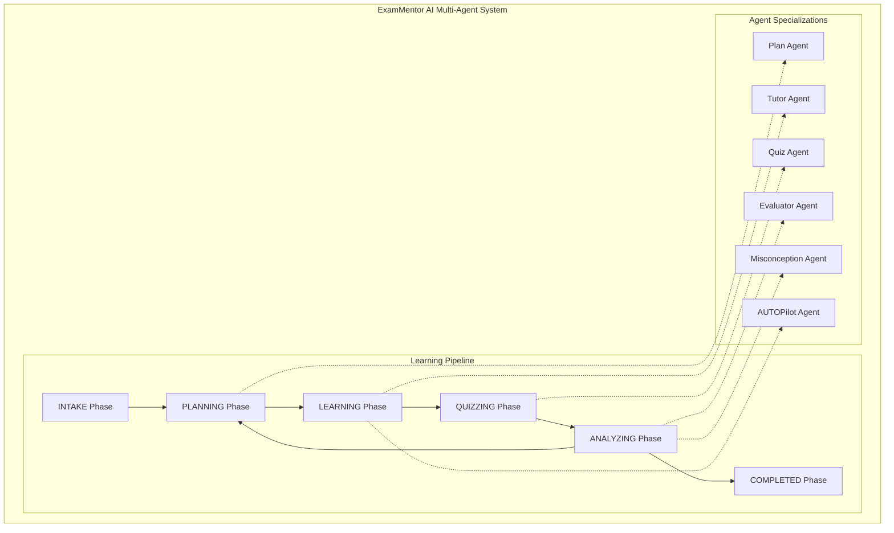
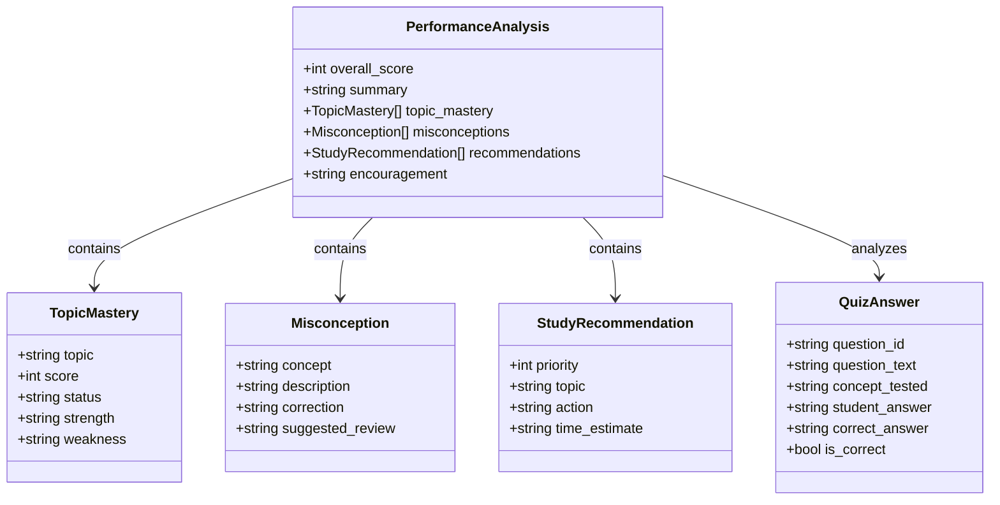
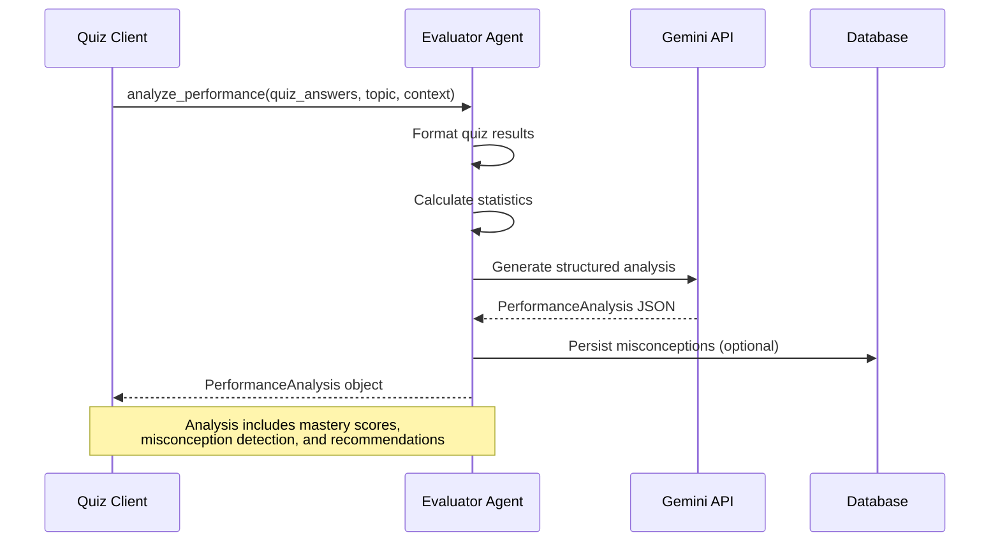
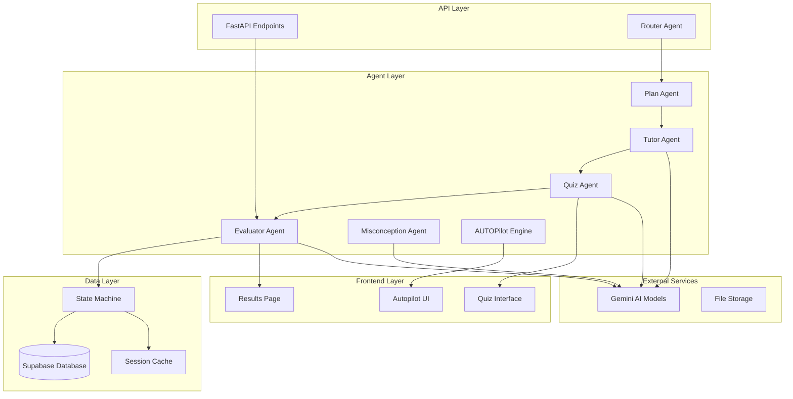
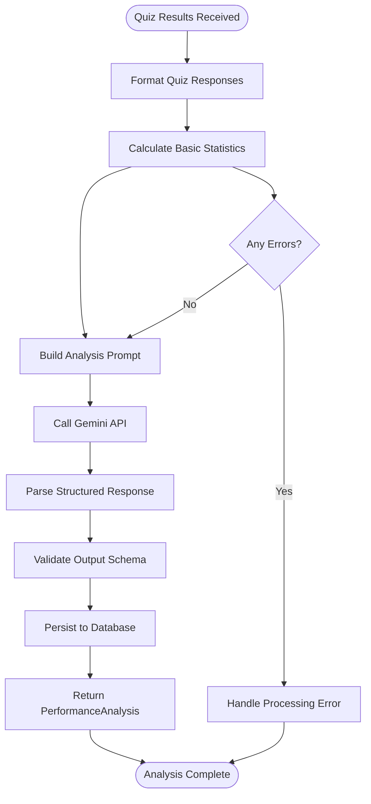
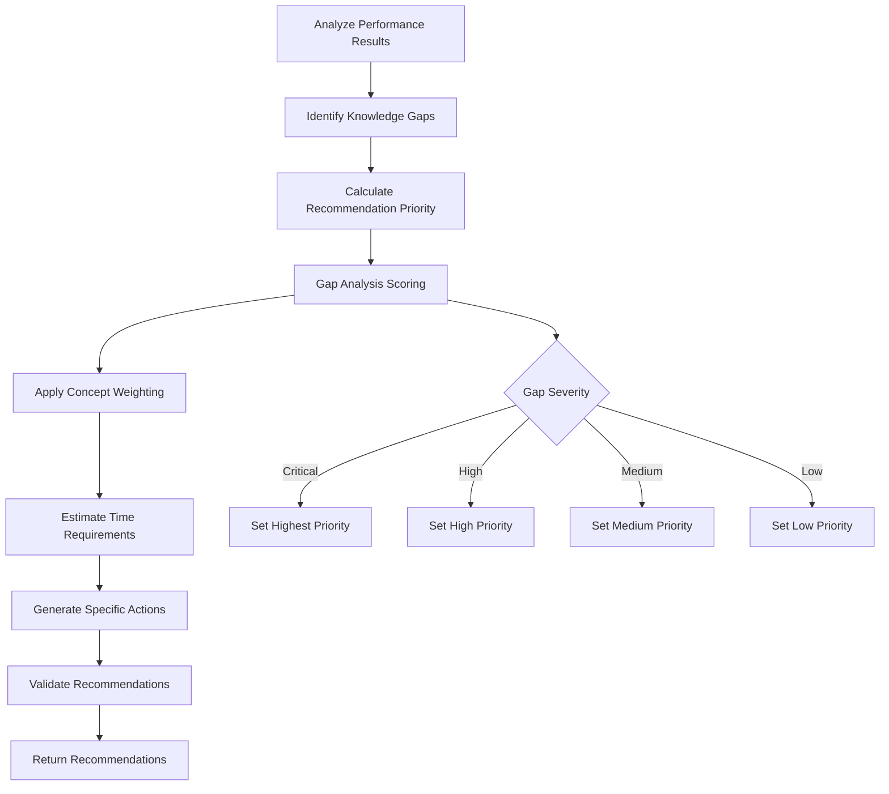
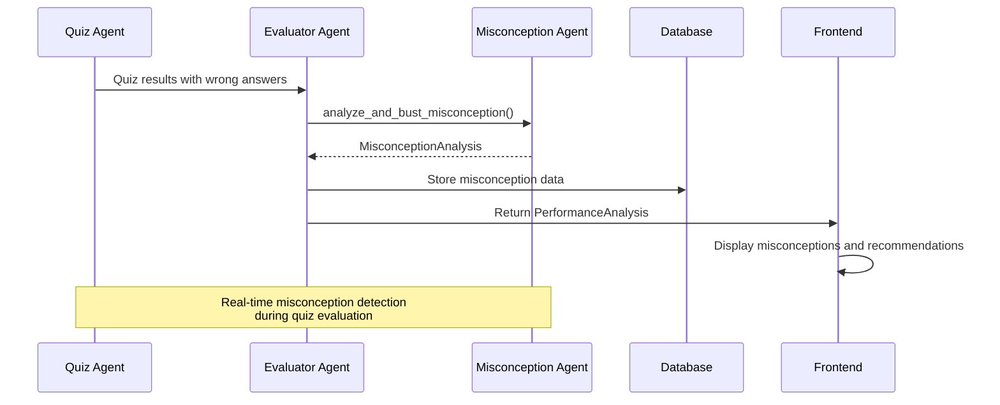
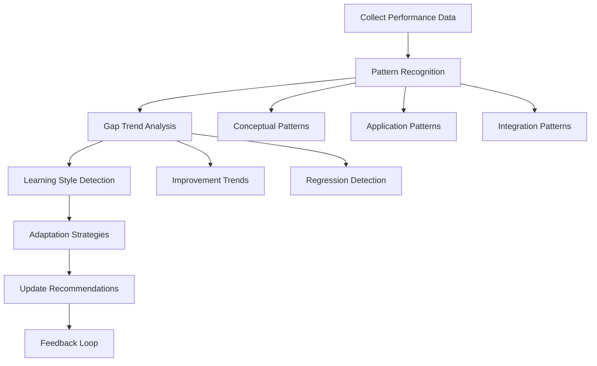
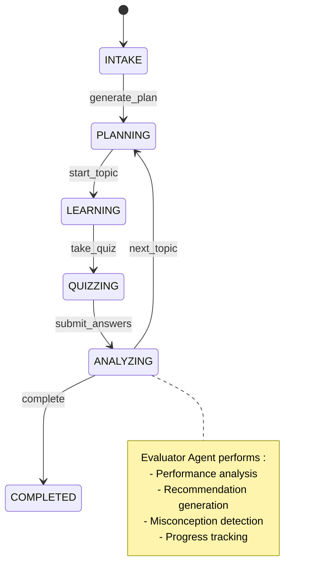
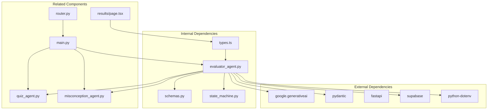

# Evaluator Agent

<cite>
**Referenced Files in This Document**
- [evaluator_agent.py](file://backend/agents/evaluator_agent.py)
- [schemas.py](file://backend/agents/schemas.py)
- [state_machine.py](file://backend/agents/state_machine.py)
- [misconception_agent.py](file://backend/agents/misconception_agent.py)
- [quiz_agent.py](file://backend/agents/quiz_agent.py)
- [main.py](file://backend/main.py)
- [router.py](file://backend/router.py)
- [types.ts](file://frontend/lib/types.ts)
- [page.tsx](file://frontend/app/results/page.tsx)
</cite>

## Table of Contents
1. [Introduction](#introduction)
2. [Project Structure](#project-structure)
3. [Core Components](#core-components)
4. [Architecture Overview](#architecture-overview)
5. [Detailed Component Analysis](#detailed-component-analysis)
6. [Dependency Analysis](#dependency-analysis)
7. [Performance Considerations](#performance-considerations)
8. [Troubleshooting Guide](#troubleshooting-guide)
9. [Conclusion](#conclusion)

## Introduction
The Evaluator Agent is a core component of the ExamMentor AI system responsible for performance analysis and recommendation generation. It analyzes quiz results to diagnose knowledge gaps, track mastery progression, and generate personalized learning recommendations. The agent integrates deeply with the misconception detection system and forms a crucial part of the closed-loop learning system that coordinates multiple specialized agents for comprehensive student assessment and personalized learning path optimization.

## Project Structure
The Evaluator Agent operates within a multi-agent ecosystem designed for autonomous learning sessions. The system follows a structured workflow that progresses through distinct phases, with each agent having specific responsibilities and well-defined interfaces.

**Diagram sources**
- [state_machine.py](file://backend/agents/state_machine.py#L17-L52)
- [evaluator_agent.py](file://backend/agents/evaluator_agent.py#L59-L115)

**Section sources**
- [state_machine.py](file://backend/agents/state_machine.py#L17-L52)
- [evaluator_agent.py](file://backend/agents/evaluator_agent.py#L1-L198)

## Core Components
The Evaluator Agent consists of several interconnected components that work together to provide comprehensive performance analysis and recommendation generation.

### Performance Analysis Models
The agent uses structured Pydantic models to ensure consistent and reliable output formatting:

**Diagram sources**
- [evaluator_agent.py](file://backend/agents/evaluator_agent.py#L15-L43)
- [evaluator_agent.py](file://backend/agents/evaluator_agent.py#L48-L55)

### Analysis Workflow
The evaluation process follows a systematic approach that transforms raw quiz data into actionable insights:

**Diagram sources**
- [evaluator_agent.py](file://backend/agents/evaluator_agent.py#L59-L115)
- [main.py](file://backend/main.py#L465-L513)

**Section sources**
- [evaluator_agent.py](file://backend/agents/evaluator_agent.py#L15-L115)
- [schemas.py](file://backend/agents/schemas.py#L76-L84)

## Architecture Overview
The Evaluator Agent integrates seamlessly with the broader ExamMentor AI ecosystem, serving as the central coordinator for performance analysis and recommendation generation.

**Diagram sources**
- [main.py](file://backend/main.py#L1-L200)
- [state_machine.py](file://backend/agents/state_machine.py#L38-L136)
- [evaluator_agent.py](file://backend/agents/evaluator_agent.py#L75-L115)

## Detailed Component Analysis

### Performance Analysis Engine
The core analysis engine transforms raw quiz responses into comprehensive performance insights through a sophisticated multi-stage process.

#### Data Processing Pipeline
The agent processes quiz data through several stages to extract meaningful patterns and insights:

**Diagram sources**
- [evaluator_agent.py](file://backend/agents/evaluator_agent.py#L77-L115)

#### Mastery Tracking Implementation
The agent implements sophisticated mastery tracking that goes beyond simple percentage scores:

| Mastery Level | Score Range | Status Description | Action Priority |
|---------------|-------------|-------------------|-----------------|
| Expert | 90-100% | Demonstrates deep understanding | Low Priority |
| Proficient | 75-89% | Solid grasp with minor gaps | Medium Priority |
| Developing | 60-74% | Partial understanding | High Priority |
| Needs Help | 0-59% | Significant gaps in knowledge | Critical Priority |

The mastery tracking considers multiple factors including:
- Conceptual understanding depth
- Application ability
- Pattern recognition skills
- Error analysis capabilities

**Section sources**
- [evaluator_agent.py](file://backend/agents/evaluator_agent.py#L59-L115)
- [schemas.py](file://backend/agents/schemas.py#L76-L84)

### Recommendation Generation Algorithms
The recommendation system employs multiple algorithms to generate personalized learning pathways:

#### Priority-Based Recommendation System
Recommendations are prioritized using a multi-criteria scoring algorithm:

**Diagram sources**
- [evaluator_agent.py](file://backend/agents/evaluator_agent.py#L30-L43)

#### Remediation Strategy Framework
The agent generates targeted remediation strategies based on identified misconceptions:

| Misconception Type | Remediation Approach | Time Estimate | Resource Type |
|-------------------|---------------------|---------------|---------------|
| Conceptual | Conceptual re-explanation | 15-30 min | Video/Text |
| Procedural | Step-by-step practice | 20-45 min | Interactive Quiz |
| Application | Problem-solving practice | 25-60 min | Mixed Practice |
| Integration | Cross-topic connections | 30-90 min | Integrated Review |

**Section sources**
- [evaluator_agent.py](file://backend/agents/evaluator_agent.py#L30-L43)
- [misconception_agent.py](file://backend/agents/misconception_agent.py#L21-L63)

### Integration with Misconception Data
The Evaluator Agent maintains deep integration with the misconception detection system to provide comprehensive learning analytics.

#### Misconception Data Flow

**Diagram sources**
- [evaluator_agent.py](file://backend/agents/evaluator_agent.py#L59-L115)
- [misconception_agent.py](file://backend/agents/misconception_agent.py#L21-L63)
- [main.py](file://backend/main.py#L465-L513)

#### Learning Pattern Analysis
The agent analyzes learning patterns to optimize future recommendations:

**Diagram sources**
- [evaluator_agent.py](file://backend/agents/evaluator_agent.py#L120-L151)

**Section sources**
- [evaluator_agent.py](file://backend/agents/evaluator_agent.py#L120-L151)
- [misconception_agent.py](file://backend/agents/misconception_agent.py#L21-L63)

### Closed-Loop Learning System Coordination
The Evaluator Agent serves as the central coordinator in the closed-loop learning system, orchestrating feedback and adaptation cycles.

#### State Management Integration

**Diagram sources**
- [state_machine.py](file://backend/agents/state_machine.py#L17-L52)

#### Cross-Agent Communication
The Evaluator Agent coordinates with other agents through well-defined interfaces:

| Agent Interaction | Purpose | Data Exchange | Timing |
|------------------|---------|---------------|--------|
| Plan Agent | Update study plan | Topic mastery data | After analysis |
| Quiz Agent | Adaptive question generation | Previous mistakes data | During quiz creation |
| Tutor Agent | Content adaptation | Learning style preferences | During explanation |
| Misconception Agent | Deep remediation | Detailed misconception data | On error detection |

**Section sources**
- [state_machine.py](file://backend/agents/state_machine.py#L38-L136)
- [evaluator_agent.py](file://backend/agents/evaluator_agent.py#L59-L115)

## Dependency Analysis
The Evaluator Agent has well-defined dependencies that support its core functionality and integration capabilities.

**Diagram sources**
- [evaluator_agent.py](file://backend/agents/evaluator_agent.py#L7-L11)
- [main.py](file://backend/main.py#L1-L200)
- [types.ts](file://frontend/lib/types.ts#L74-L124)

### API Integration Points
The Evaluator Agent exposes several API endpoints for external integration:

| Endpoint | Method | Purpose | Authentication |
|----------|--------|---------|----------------|
| `/api/quiz/analyze` | POST | Analyze quiz performance | JWT Required |
| `/api/progress/report` | POST | Generate progress reports | JWT Required |
| `/api/quiz/misconception` | POST | Get misconception analysis | JWT Required |

**Section sources**
- [main.py](file://backend/main.py#L75-L81)
- [main.py](file://backend/main.py#L465-L513)

## Performance Considerations
The Evaluator Agent is designed for optimal performance in production environments with several built-in optimizations.

### Asynchronous Processing
The agent utilizes asynchronous programming patterns to handle concurrent requests efficiently:

- **Non-blocking I/O**: All Gemini API calls use async/await patterns
- **Connection pooling**: Efficient reuse of API connections
- **Timeout handling**: Configurable timeouts for external service calls
- **Error recovery**: Automatic retry mechanisms for transient failures

### Memory Management
The agent implements memory-efficient processing for large datasets:

- **Streaming responses**: Large analyses are processed in chunks
- **Lazy evaluation**: Data processing deferred until needed
- **Resource cleanup**: Proper cleanup of temporary resources
- **Batch processing**: Multiple analyses processed efficiently

### Caching Strategies
Several caching mechanisms reduce computational overhead:

- **Session state caching**: Persistent state storage for continuity
- **Model response caching**: Frequently accessed analysis results cached
- **Context caching**: Study material context cached for repeated use
- **Recommendation caching**: Personalized recommendations cached per user

## Troubleshooting Guide
Common issues and their solutions when working with the Evaluator Agent:

### API Integration Issues
**Problem**: Gemini API connection failures
**Solution**: 
- Verify GEMINI_API_KEY environment variable
- Check network connectivity to Gemini endpoints
- Implement exponential backoff for retry logic

**Problem**: Response parsing errors
**Solution**:
- Validate Pydantic model schemas
- Check response MIME type configuration
- Implement fallback parsing strategies

### Data Consistency Issues
**Problem**: Inconsistent performance analysis results
**Solution**:
- Implement data validation before processing
- Add logging for debugging analysis discrepancies
- Use deterministic processing for reproducible results

**Problem**: State synchronization issues
**Solution**:
- Implement proper state locking mechanisms
- Add conflict resolution for concurrent updates
- Use transactional database operations

### Performance Bottlenecks
**Problem**: Slow analysis response times
**Solution**:
- Optimize prompt construction for minimal token usage
- Implement result caching for frequently accessed data
- Use connection pooling for external API calls

**Section sources**
- [evaluator_agent.py](file://backend/agents/evaluator_agent.py#L75-L115)
- [state_machine.py](file://backend/agents/state_machine.py#L80-L136)

## Conclusion
The Evaluator Agent represents a sophisticated component of the ExamMentor AI system that transforms raw quiz data into actionable learning insights. Through its comprehensive performance analysis, mastery tracking, and recommendation generation capabilities, it serves as the cornerstone of personalized learning path optimization.

The agent's integration with the misconception detection system, state management framework, and broader multi-agent ecosystem creates a robust foundation for autonomous learning experiences. Its structured approach to performance analysis, combined with adaptive recommendation algorithms, ensures that students receive timely, relevant, and effective learning guidance.

The closed-loop nature of the system, where evaluations feed back into planning and instruction, creates a continuous improvement cycle that adapts to individual learning patterns and preferences. This comprehensive approach positions the Evaluator Agent as a critical component in delivering personalized, effective educational experiences.

Future enhancements could include machine learning-based recommendation systems, more sophisticated pattern recognition algorithms, and expanded integration with external educational resources and assessment tools.