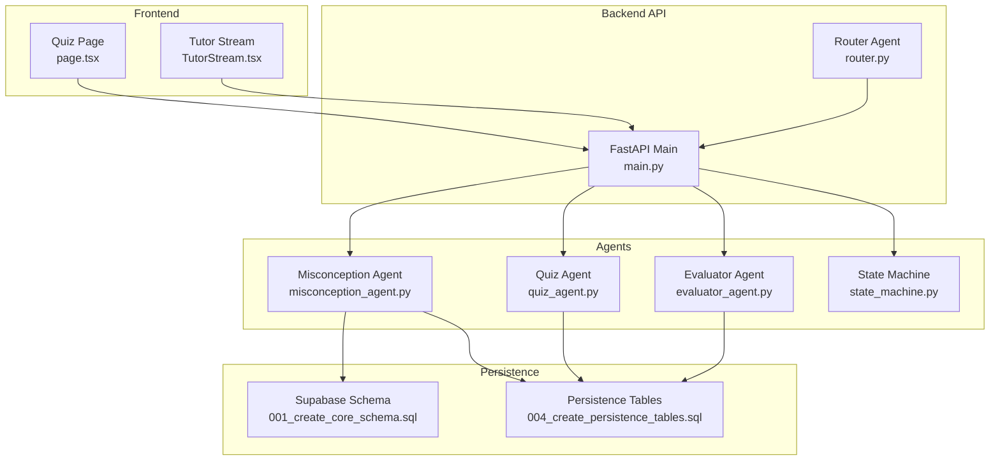
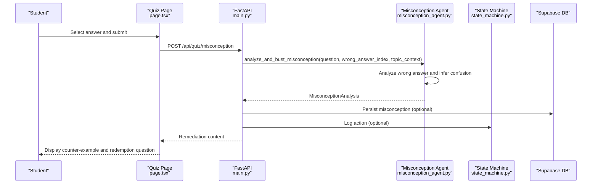
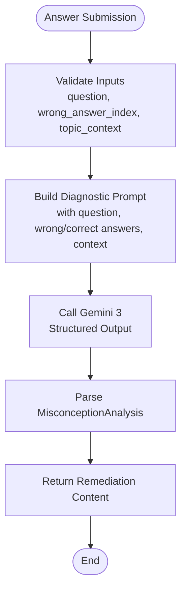
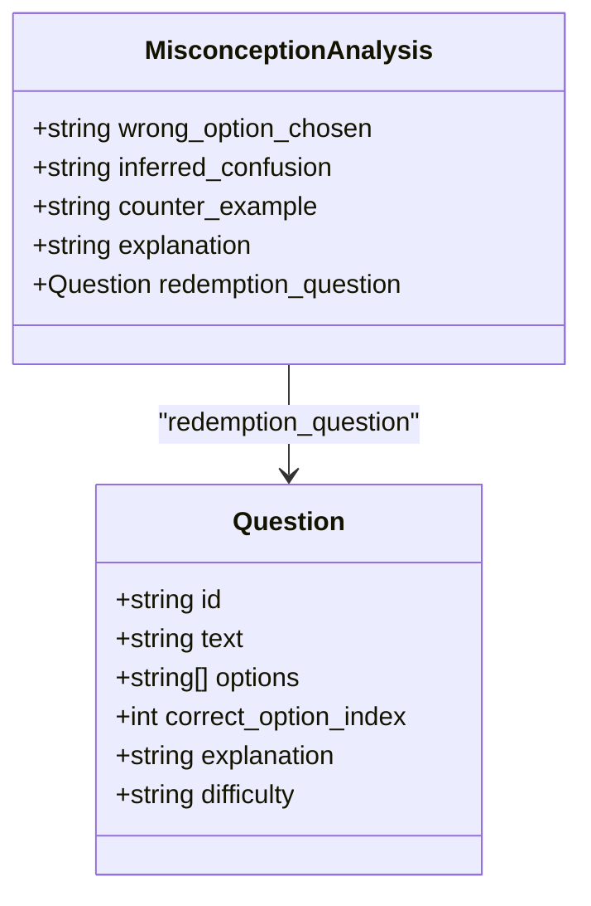
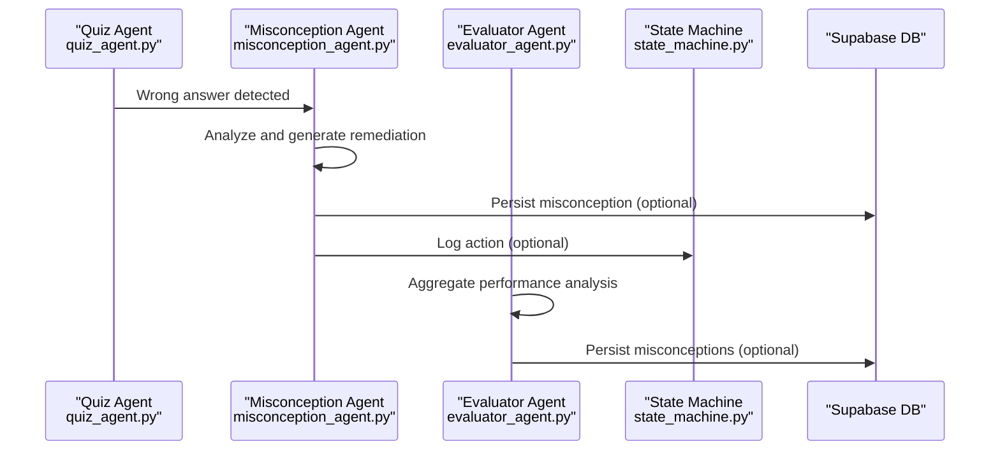
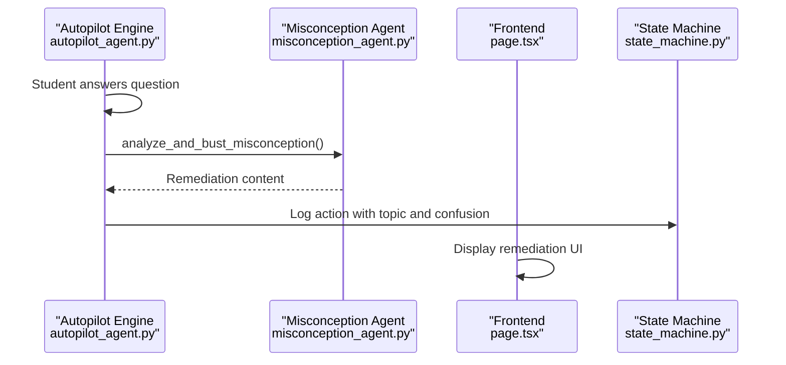
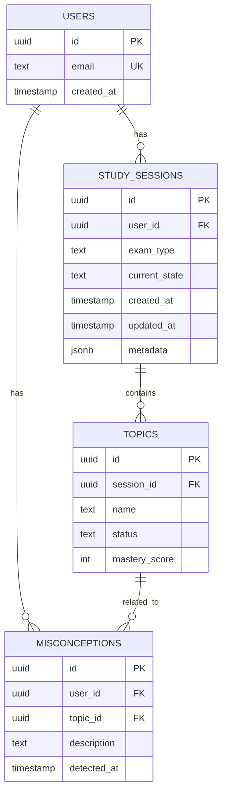
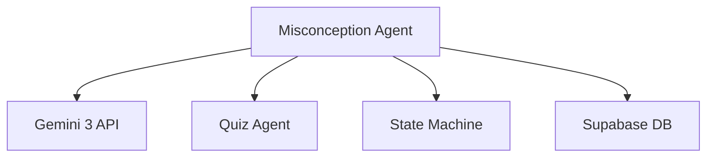

# Misconception Agent

<cite>
**Referenced Files in This Document**
- [misconception_agent.py](file://backend/agents/misconception_agent.py)
- [schemas.py](file://backend/agents/schemas.py)
- [quiz_agent.py](file://backend/agents/quiz_agent.py)
- [evaluator_agent.py](file://backend/agents/evaluator_agent.py)
- [state_machine.py](file://backend/agents/state_machine.py)
- [main.py](file://backend/main.py)
- [router.py](file://backend/router.py)
- [001_create_core_schema.sql](file://backend/migrations/001_create_core_schema.sql)
- [004_create_persistence_tables.sql](file://backend/migrations/004_create_persistence_tables.sql)
- [page.tsx](file://frontend/app/quiz/[topicId]/page.tsx)
- [TutorStream.tsx](file://frontend/components/TutorStream.tsx)
- [autopilot_agent.py](file://backend/agents/autopilot_agent.py)
</cite>

## Table of Contents
1. [Introduction](#introduction)
2. [Project Structure](#project-structure)
3. [Core Components](#core-components)
4. [Architecture Overview](#architecture-overview)
5. [Detailed Component Analysis](#detailed-component-analysis)
6. [Dependency Analysis](#dependency-analysis)
7. [Performance Considerations](#performance-considerations)
8. [Troubleshooting Guide](#troubleshooting-guide)
9. [Conclusion](#conclusion)
10. [Appendices](#appendices)

## Introduction
The Misconception Agent is a specialized component designed to detect, diagnose, and address student learning errors and misconceptions. When a student answers a quiz question incorrectly, the agent performs a deep diagnostic analysis to infer the underlying conceptual confusion, provides a targeted counter-example that exposes the flaw in reasoning, offers a pedagogical explanation, and generates a redemption question to verify conceptual correction. This agent plays a central role in adaptive learning by transforming incorrect answers into targeted remediation opportunities, thereby enhancing the overall educational effectiveness of the system.

## Project Structure
The Misconception Agent is part of a multi-agent ecosystem orchestrated by a FastAPI backend with a Next.js frontend. The agent integrates with quiz evaluation, tutoring, and session state management to deliver a seamless adaptive learning experience.

**Diagram sources**
- [main.py](file://backend/main.py#L1-L843)
- [misconception_agent.py](file://backend/agents/misconception_agent.py#L1-L64)
- [quiz_agent.py](file://backend/agents/quiz_agent.py#L1-L283)
- [evaluator_agent.py](file://backend/agents/evaluator_agent.py#L1-L198)
- [state_machine.py](file://backend/agents/state_machine.py#L1-L136)
- [router.py](file://backend/router.py#L1-L129)
- [001_create_core_schema.sql](file://backend/migrations/001_create_core_schema.sql#L1-L45)
- [004_create_persistence_tables.sql](file://backend/migrations/004_create_persistence_tables.sql#L1-L44)

**Section sources**
- [main.py](file://backend/main.py#L1-L843)
- [misconception_agent.py](file://backend/agents/misconception_agent.py#L1-L64)
- [router.py](file://backend/router.py#L1-L129)

## Core Components
- Misconception Analysis Schema: Defines the structured output format for misconception detection, including inferred confusion, counter-example, explanation, and redemption question.
- Misconception Detection Algorithm: Uses Gemini 3's structured output capabilities to analyze quiz answers and generate targeted remediation.
- Integration Points: Seamlessly connects with quiz evaluation, tutoring, session state management, and persistence layers.

**Section sources**
- [misconception_agent.py](file://backend/agents/misconception_agent.py#L13-L25)
- [schemas.py](file://backend/agents/schemas.py#L76-L84)

## Architecture Overview
The Misconception Agent operates within a multi-agent architecture where it receives quiz answer data, performs analysis, and returns remediation content. The system maintains session state, persists data, and coordinates with other agents for a cohesive learning experience.

**Diagram sources**
- [page.tsx](file://frontend/app/quiz/[topicId]/page.tsx#L240-L273)
- [main.py](file://backend/main.py#L465-L513)
- [misconception_agent.py](file://backend/agents/misconception_agent.py#L21-L63)
- [state_machine.py](file://backend/agents/state_machine.py#L115-L135)

## Detailed Component Analysis

### Misconception Detection Algorithm
The agent employs a structured prompt-driven approach to analyze quiz answers and generate remediation content. The algorithm follows a four-step process:
1. Infer: Determine why the student selected the wrong option and identify the underlying conceptual confusion.
2. Bust: Provide a counter-example that clearly demonstrates the flaw in the student's reasoning.
3. Explain: Offer a concise, pedagogical explanation of the correct concept.
4. Redeem: Generate a new question at the same difficulty level that targets the specific misconception.

**Diagram sources**
- [misconception_agent.py](file://backend/agents/misconception_agent.py#L21-L63)

**Section sources**
- [misconception_agent.py](file://backend/agents/misconception_agent.py#L21-L63)

### Error Pattern Recognition and Categorization
The agent recognizes common error patterns through structured analysis:
- Conceptual Misalignment: Students confuse related but distinct concepts.
- Procedural Errors: Incorrect application of formulas or procedures.
- Misinterpretation: Misreading or misunderstanding question context.
- Knowledge Gaps: Lack of foundational understanding.

Categorization is implicit in the inferred confusion field, which captures the underlying conceptual mistake. The redemption question serves as a targeted verification mechanism for each category.

**Section sources**
- [misconception_agent.py](file://backend/agents/misconception_agent.py#L13-L19)

### Remediation Strategies and Targeted Interventions
The agent implements several remediation strategies:
- Counter-Examples: Specific examples that expose flawed reasoning.
- Pedagogical Explanations: Clear, concept-focused explanations.
- Redemption Questions: Fresh questions targeting the same misconception.
- Adaptive Difficulty: Maintains question difficulty consistency for reinforcement.

**Diagram sources**
- [misconception_agent.py](file://backend/agents/misconception_agent.py#L13-L19)
- [schemas.py](file://backend/agents/schemas.py#L56-L64)

**Section sources**
- [misconception_agent.py](file://backend/agents/misconception_agent.py#L13-L19)
- [schemas.py](file://backend/agents/schemas.py#L56-L64)

### Integration with Quiz Responses and Evaluation Data
The agent integrates with the quiz evaluation pipeline:
- Quiz Agent: Provides question context and correct answer information.
- Evaluator Agent: Generates performance analysis and identifies misconceptions.
- State Machine: Tracks session state and logs agent actions.
- Persistence Layer: Stores misconceptions for future reference and analysis.

**Diagram sources**
- [quiz_agent.py](file://backend/agents/quiz_agent.py#L206-L246)
- [misconception_agent.py](file://backend/agents/misconception_agent.py#L21-L63)
- [evaluator_agent.py](file://backend/agents/evaluator_agent.py#L59-L115)
- [state_machine.py](file://backend/agents/state_machine.py#L115-L135)
- [main.py](file://backend/main.py#L447-L462)

**Section sources**
- [quiz_agent.py](file://backend/agents/quiz_agent.py#L206-L246)
- [evaluator_agent.py](file://backend/agents/evaluator_agent.py#L59-L115)
- [main.py](file://backend/main.py#L447-L462)

### Integration with Tutoring Sessions and Autopilot Mode
The agent participates in autonomous learning sessions:
- Autopilot Engine: Detects misconceptions during quiz completion and triggers remediation.
- Session State: Maintains context across learning phases.
- Interactive Mode: Supports real-time remediation requests from the frontend.

**Diagram sources**
- [autopilot_agent.py](file://backend/agents/autopilot_agent.py#L349-L373)
- [misconception_agent.py](file://backend/agents/misconception_agent.py#L21-L63)
- [state_machine.py](file://backend/agents/state_machine.py#L115-L135)
- [page.tsx](file://frontend/app/quiz/[topicId]/page.tsx#L240-L273)

**Section sources**
- [autopilot_agent.py](file://backend/agents/autopilot_agent.py#L349-L373)
- [page.tsx](file://frontend/app/quiz/[topicId]/page.tsx#L240-L273)

### Persistence and Data Tracking
The system persists misconceptions and related data:
- Misconceptions Table: Stores user-specific misconceptions with timestamps.
- Study Sessions: Tracks session state and agent actions.
- Quiz Persistence: Saves quiz data for later retrieval.

**Diagram sources**
- [001_create_core_schema.sql](file://backend/migrations/001_create_core_schema.sql#L7-L40)
- [004_create_persistence_tables.sql](file://backend/migrations/004_create_persistence_tables.sql#L3-L21)

**Section sources**
- [001_create_core_schema.sql](file://backend/migrations/001_create_core_schema.sql#L7-L40)
- [004_create_persistence_tables.sql](file://backend/migrations/004_create_persistence_tables.sql#L3-L21)

## Dependency Analysis
The Misconception Agent depends on several key components:
- Gemini 3 API: Provides structured output capabilities for consistent analysis.
- Quiz Agent: Supplies question context and correct answer information.
- State Machine: Manages session state and logs agent actions.
- Persistence Layer: Stores misconceptions and related data.

**Diagram sources**
- [misconception_agent.py](file://backend/agents/misconception_agent.py#L29-L61)
- [main.py](file://backend/main.py#L465-L513)
- [state_machine.py](file://backend/agents/state_machine.py#L54-L63)

**Section sources**
- [misconception_agent.py](file://backend/agents/misconception_agent.py#L29-L61)
- [main.py](file://backend/main.py#L465-L513)

## Performance Considerations
- Structured Output Efficiency: Using Gemini 3's response_schema ensures consistent parsing and reduces downstream processing overhead.
- Asynchronous Processing: The agent leverages async/await patterns for efficient I/O operations.
- Prompt Optimization: Carefully crafted prompts minimize token usage while maintaining diagnostic accuracy.
- Caching Opportunities: Previous misconceptions can inform future quiz generation to reduce redundant remediation.

## Troubleshooting Guide
Common issues and resolutions:
- Gemini API Errors: Implement retry logic with exponential backoff for transient failures.
- Missing Credentials: Ensure GEMINI_API_KEY and SUPABASE credentials are configured.
- Parsing Failures: Validate response_schema alignment with expected output format.
- State Persistence: Verify Supabase connection and table permissions.

**Section sources**
- [autopilot_agent.py](file://backend/agents/autopilot_agent.py#L142-L161)
- [main.py](file://backend/main.py#L491-L500)

## Conclusion
The Misconception Agent represents a sophisticated approach to adaptive learning error correction. By transforming incorrect answers into targeted remediation opportunities, it addresses fundamental learning gaps and enhances educational effectiveness. The agent's integration with quiz evaluation, tutoring, session state management, and persistence layers creates a comprehensive system for identifying, categorizing, and resolving student misconceptions. Through structured analysis, counter-examples, and redemption questions, the agent provides immediate, actionable feedback that supports long-term learning outcomes.

## Appendices

### Example Misconception Detection Workflow
1. Student selects wrong answer on quiz question
2. Frontend calls /api/quiz/misconception endpoint
3. Backend reconstructs Question object and calls analyze_and_bust_misconception
4. Agent analyzes wrong answer and infers confusion
5. Agent generates counter-example and redemption question
6. Agent persists misconception (optional) and logs action (optional)
7. Frontend displays remediation content to student

**Section sources**
- [page.tsx](file://frontend/app/quiz/[topicId]/page.tsx#L240-L273)
- [main.py](file://backend/main.py#L465-L513)
- [misconception_agent.py](file://backend/agents/misconception_agent.py#L21-L63)

### Remediation Effectiveness Tracking
The system tracks remediation effectiveness through:
- Redemption Question Performance: Monitoring subsequent performance on targeted questions
- Misconception Persistence: Storing misconceptions for future reference and analysis
- Session Analytics: Aggregating remediation data across learning sessions
- Mastery Updates: Updating topic mastery scores based on remediation outcomes

**Section sources**
- [evaluator_agent.py](file://backend/agents/evaluator_agent.py#L59-L115)
- [main.py](file://backend/main.py#L447-L462)