# Multi-Agent System Architecture

<cite>
**Referenced Files in This Document**
- [backend/agents/__init__.py](file://backend/agents/__init__.py)
- [backend/agents/plan_agent.py](file://backend/agents/plan_agent.py)
- [backend/agents/tutor_agent.py](file://backend/agents/tutor_agent.py)
- [backend/agents/quiz_agent.py](file://backend/agents/quiz_agent.py)
- [backend/agents/evaluator_agent.py](file://backend/agents/evaluator_agent.py)
- [backend/agents/misconception_agent.py](file://backend/agents/misconception_agent.py)
- [backend/agents/autopilot_agent.py](file://backend/agents/autopilot_agent.py)
- [backend/agents/state_machine.py](file://backend/agents/state_machine.py)
- [backend/agents/schemas.py](file://backend/agents/schemas.py)
- [backend/services/genai_service.py](file://backend/services/genai_service.py)
- [backend/router.py](file://backend/router.py)
- [backend/main.py](file://backend/main.py)
- [backend/migrations/001_create_core_schema.sql](file://backend/migrations/001_create_core_schema.sql)
- [backend/migrations/004_create_persistence_tables.sql](file://backend/migrations/004_create_persistence_tables.sql)
- [backend/requirements.txt](file://backend/requirements.txt)
- [backend/.env](file://backend/.env)
</cite>

## Table of Contents
1. [Introduction](#introduction)
2. [Project Structure](#project-structure)
3. [Core Components](#core-components)
4. [Architecture Overview](#architecture-overview)
5. [Detailed Component Analysis](#detailed-component-analysis)
6. [Dependency Analysis](#dependency-analysis)
7. [Performance Considerations](#performance-considerations)
8. [Troubleshooting Guide](#troubleshooting-guide)
9. [Conclusion](#conclusion)
10. [Appendices](#appendices)

## Introduction
This document explains the multi-agent system architecture powering Exammentor AI’s educational platform. The system composes specialized AI agents to deliver a full learning pipeline: planning, instruction, assessment, analysis, and autonomous orchestration. It emphasizes structured outputs, robust state management, and seamless integration with Google Gemini models and Supabase persistence.

The agents collaborate around a shared state machine and a centralized router, ensuring valid transitions and consistent session tracking. The Autopilot Agent orchestrates autonomous 30-minute learning sessions, demonstrating “Action Era” self-correction and interactive decision-making.

## Project Structure
The backend is organized into modular packages:
- agents: Specialized agents and shared schemas
- services: Shared service integrations (e.g., Gemini client)
- router: Intent routing and syllabus scoping
- main.py: FastAPI endpoints exposing agent capabilities
- migrations: Supabase schema and policy definitions
- requirements.txt and .env: Dependencies and environment configuration

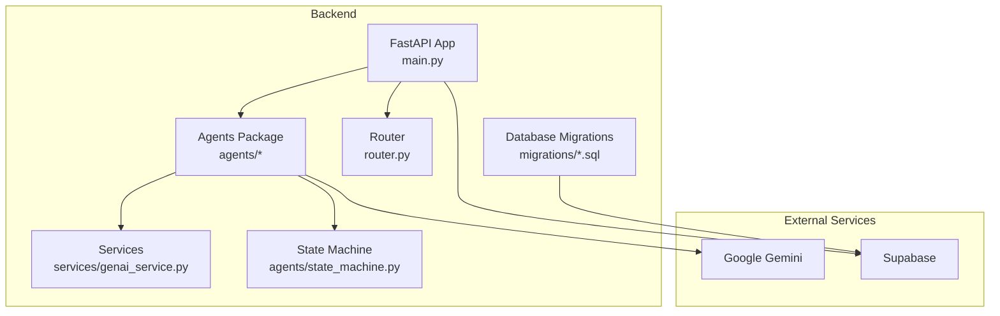

**Diagram sources**
- [backend/main.py](file://backend/main.py#L1-L120)
- [backend/agents/__init__.py](file://backend/agents/__init__.py#L1-L96)
- [backend/services/genai_service.py](file://backend/services/genai_service.py#L1-L10)
- [backend/router.py](file://backend/router.py#L1-L129)
- [backend/agents/state_machine.py](file://backend/agents/state_machine.py#L1-L136)
- [backend/migrations/001_create_core_schema.sql](file://backend/migrations/001_create_core_schema.sql#L1-L46)
- [backend/migrations/004_create_persistence_tables.sql](file://backend/migrations/004_create_persistence_tables.sql#L1-L44)

**Section sources**
- [backend/main.py](file://backend/main.py#L1-L120)
- [backend/agents/__init__.py](file://backend/agents/__init__.py#L1-L96)

## Core Components
- Plan Agent: Generates structured study plans with iterative verification and self-correction, integrating a router for syllabus scoping.
- Tutor Agent: Provides structured, streaming explanations using the Feynman technique, with multimodal support for diagrams.
- Quiz Agent: Creates adaptive quizzes and evaluates answers, with multimodal quiz generation from images.
- Evaluator Agent: Analyzes quiz performance, synthesizes misconceptions, and generates recommendations.
- Misconception Agent: Diagnoses conceptual errors and suggests targeted remediation.
- Autopilot Agent: Orchestrates autonomous 30-minute learning sessions, coordinating topic selection, teaching, quizzing, and error analysis.
- State Machine: Enforces valid workflow transitions and persists session state to Supabase.
- Router: Determines intent, exam type, and subject scope to constrain plan generation and tutoring.
- Shared Schemas: Strict Pydantic models ensure structured outputs across agents.

**Section sources**
- [backend/agents/plan_agent.py](file://backend/agents/plan_agent.py#L1-L120)
- [backend/agents/tutor_agent.py](file://backend/agents/tutor_agent.py#L1-L120)
- [backend/agents/quiz_agent.py](file://backend/agents/quiz_agent.py#L1-L120)
- [backend/agents/evaluator_agent.py](file://backend/agents/evaluator_agent.py#L1-L120)
- [backend/agents/misconception_agent.py](file://backend/agents/misconception_agent.py#L1-L64)
- [backend/agents/autopilot_agent.py](file://backend/agents/autopilot_agent.py#L1-L120)
- [backend/agents/state_machine.py](file://backend/agents/state_machine.py#L1-L136)
- [backend/agents/schemas.py](file://backend/agents/schemas.py#L1-L106)

## Architecture Overview
The system integrates FastAPI endpoints with specialized agents. Agents rely on a centralized Gemini client and communicate via structured Pydantic models. The State Machine coordinates transitions, while the Router scopes content to the appropriate syllabus. Supabase persists sessions, topics, misconceptions, and chat/quizzes.

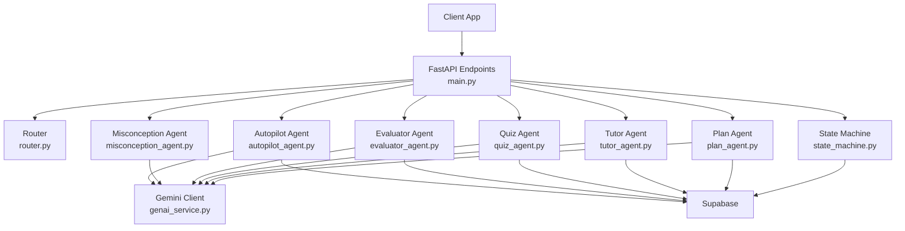

**Diagram sources**
- [backend/main.py](file://backend/main.py#L120-L843)
- [backend/router.py](file://backend/router.py#L64-L88)
- [backend/agents/plan_agent.py](file://backend/agents/plan_agent.py#L49-L87)
- [backend/agents/tutor_agent.py](file://backend/agents/tutor_agent.py#L131-L186)
- [backend/agents/quiz_agent.py](file://backend/agents/quiz_agent.py#L53-L111)
- [backend/agents/evaluator_agent.py](file://backend/agents/evaluator_agent.py#L59-L115)
- [backend/agents/misconception_agent.py](file://backend/agents/misconception_agent.py#L21-L63)
- [backend/agents/autopilot_agent.py](file://backend/agents/autopilot_agent.py#L100-L120)
- [backend/agents/state_machine.py](file://backend/agents/state_machine.py#L38-L136)
- [backend/services/genai_service.py](file://backend/services/genai_service.py#L1-L10)

## Detailed Component Analysis

### Plan Agent
Responsibilities:
- Generate structured study plans constrained by syllabus scope.
- Self-correct plans iteratively using a verification loop.
- Stream the entire process for real-time UI feedback.

Key features:
- Router integration for intent/routing and syllabus scoping.
- Structured outputs via Pydantic models for guaranteed JSON.
- Iterative verification and fix cycles to improve plan quality.

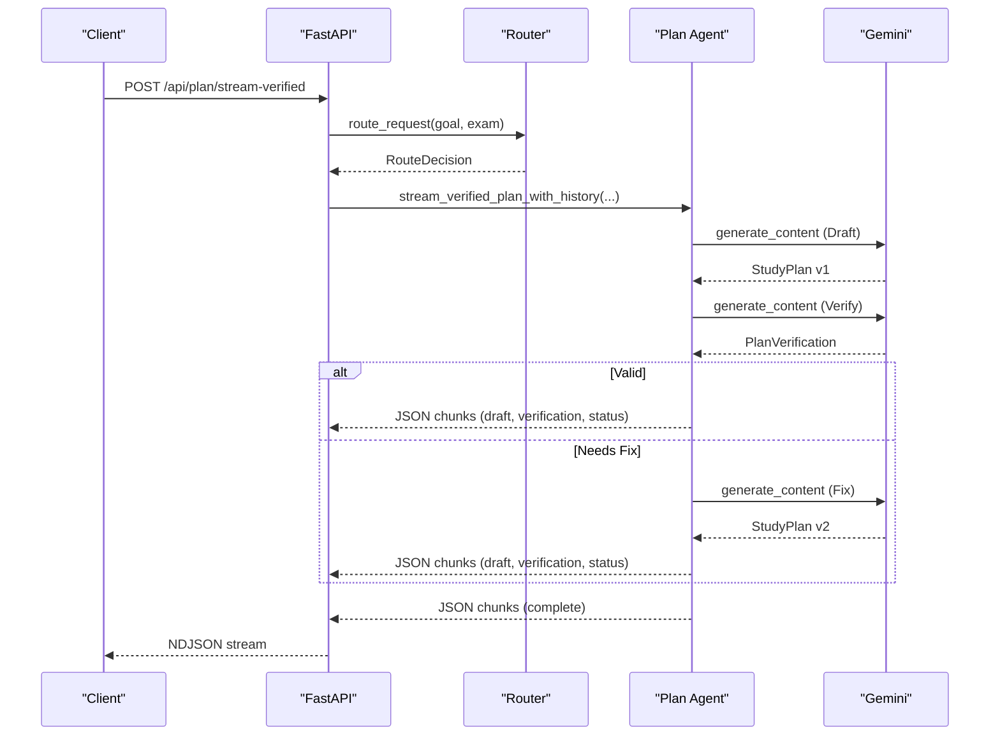

**Diagram sources**
- [backend/main.py](file://backend/main.py#L205-L222)
- [backend/router.py](file://backend/router.py#L64-L88)
- [backend/agents/plan_agent.py](file://backend/agents/plan_agent.py#L307-L475)

**Section sources**
- [backend/agents/plan_agent.py](file://backend/agents/plan_agent.py#L49-L304)
- [backend/router.py](file://backend/router.py#L64-L128)

### Tutor Agent
Responsibilities:
- Provide structured explanations with step-by-step breakdowns.
- Stream explanations for real-time UI feedback.
- Support multimodal explanations using diagrams.

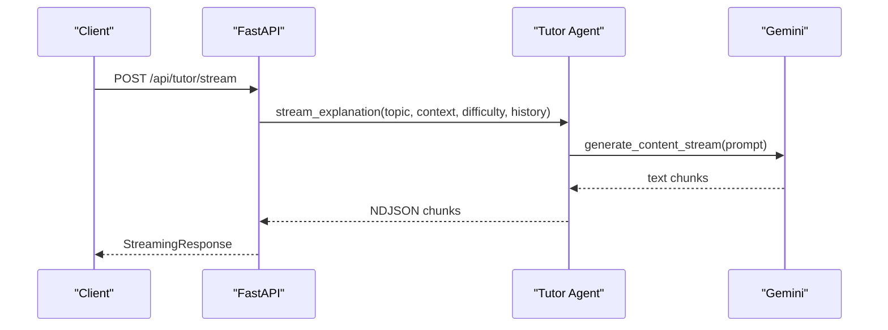

**Diagram sources**
- [backend/main.py](file://backend/main.py#L245-L260)
- [backend/agents/tutor_agent.py](file://backend/agents/tutor_agent.py#L51-L127)

**Section sources**
- [backend/agents/tutor_agent.py](file://backend/agents/tutor_agent.py#L1-L277)

### Quiz Agent
Responsibilities:
- Generate adaptive quizzes aligned to topic mastery.
- Evaluate answers and identify misconceptions.
- Create multimodal quizzes grounded in diagrams.

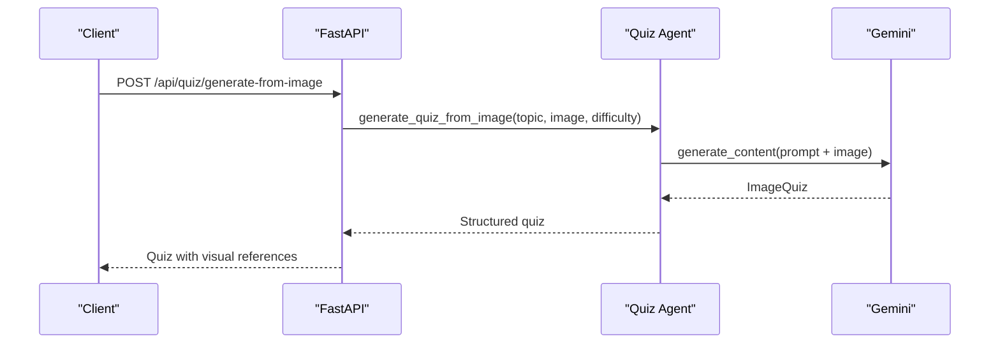

**Diagram sources**
- [backend/main.py](file://backend/main.py#L356-L400)
- [backend/agents/quiz_agent.py](file://backend/agents/quiz_agent.py#L138-L201)

**Section sources**
- [backend/agents/quiz_agent.py](file://backend/agents/quiz_agent.py#L1-L283)

### Evaluator Agent
Responsibilities:
- Analyze quiz performance and synthesize misconceptions.
- Generate actionable recommendations and progress reports.

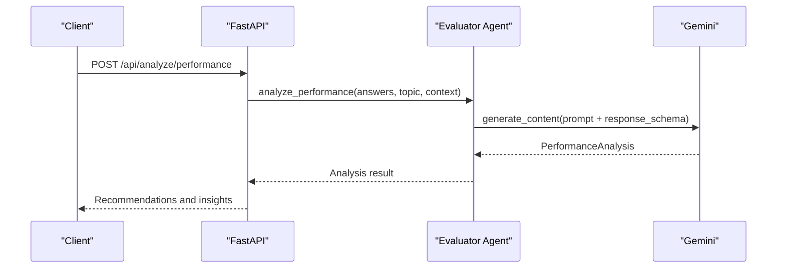

**Diagram sources**
- [backend/main.py](file://backend/main.py#L433-L462)
- [backend/agents/evaluator_agent.py](file://backend/agents/evaluator_agent.py#L59-L115)

**Section sources**
- [backend/agents/evaluator_agent.py](file://backend/agents/evaluator_agent.py#L1-L198)

### Misconception Agent
Responsibilities:
- Diagnose conceptual errors behind wrong answers.
- Provide counter-examples and redemption questions.

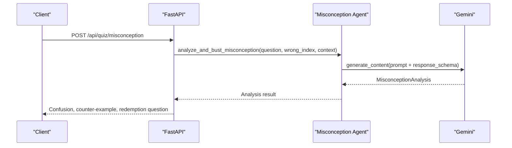

**Diagram sources**
- [backend/main.py](file://backend/main.py#L465-L513)
- [backend/agents/misconception_agent.py](file://backend/agents/misconception_agent.py#L21-L63)

**Section sources**
- [backend/agents/misconception_agent.py](file://backend/agents/misconception_agent.py#L1-L64)

### Autopilot Agent
Responsibilities:
- Orchestrate autonomous 30-minute learning sessions.
- Select topics, teach micro-lessons, run quizzes, analyze results, and update mastery.
- Maintain a run log with reasoning for each decision.

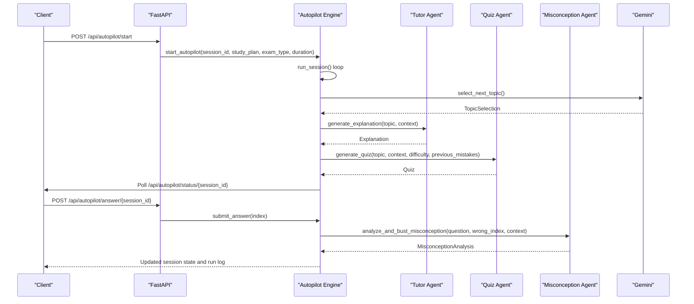

**Diagram sources**
- [backend/main.py](file://backend/main.py#L582-L756)
- [backend/agents/autopilot_agent.py](file://backend/agents/autopilot_agent.py#L431-L544)
- [backend/agents/tutor_agent.py](file://backend/agents/tutor_agent.py#L131-L186)
- [backend/agents/quiz_agent.py](file://backend/agents/quiz_agent.py#L53-L111)
- [backend/agents/misconception_agent.py](file://backend/agents/misconception_agent.py#L21-L63)

**Section sources**
- [backend/agents/autopilot_agent.py](file://backend/agents/autopilot_agent.py#L1-L628)

### State Machine and Session Management
Responsibilities:
- Enforce valid transitions across INTAKE → PLANNING → LEARNING → QUIZZING → ANALYZING → COMPLETED.
- Persist session state and agent actions to Supabase.
- Provide rehydration of session state for continuity.

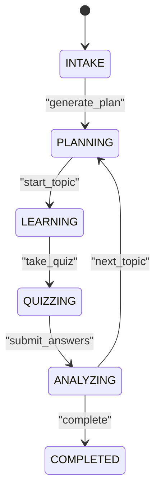

**Diagram sources**
- [backend/agents/state_machine.py](file://backend/agents/state_machine.py#L17-L78)

**Section sources**
- [backend/agents/state_machine.py](file://backend/agents/state_machine.py#L1-L136)
- [backend/main.py](file://backend/main.py#L516-L571)

### Router and Syllabus Scoping
Responsibilities:
- Determine intent (plan, explain, quiz, autopilot), exam type, and subject scope.
- Safely constrain plan generation to the correct syllabus subset.

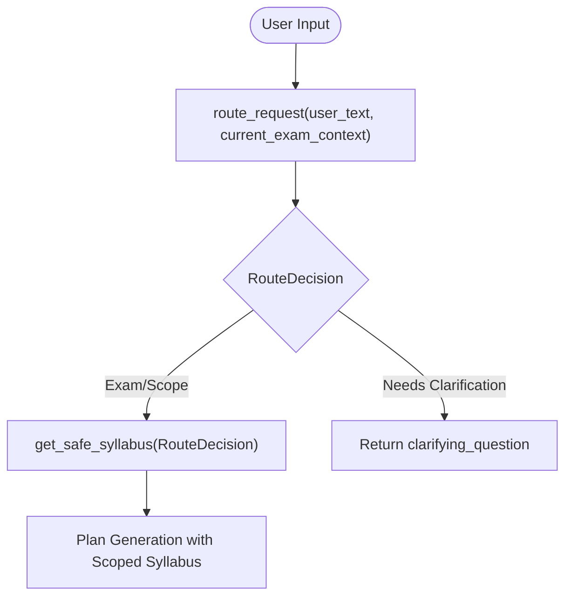

**Diagram sources**
- [backend/router.py](file://backend/router.py#L64-L128)

**Section sources**
- [backend/router.py](file://backend/router.py#L1-L129)

## Dependency Analysis
The agents depend on a centralized Gemini client and share schemas for structured outputs. The FastAPI app wires endpoints to agent functions, while Supabase persists state and analytics.

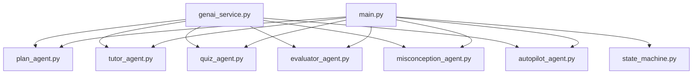

**Diagram sources**
- [backend/services/genai_service.py](file://backend/services/genai_service.py#L1-L10)
- [backend/agents/plan_agent.py](file://backend/agents/plan_agent.py#L11-L12)
- [backend/agents/tutor_agent.py](file://backend/agents/tutor_agent.py#L7-L11)
- [backend/agents/quiz_agent.py](file://backend/agents/quiz_agent.py#L7-L11)
- [backend/agents/evaluator_agent.py](file://backend/agents/evaluator_agent.py#L7-L8)
- [backend/agents/misconception_agent.py](file://backend/agents/misconception_agent.py#L7-L11)
- [backend/agents/autopilot_agent.py](file://backend/agents/autopilot_agent.py#L14-L20)
- [backend/main.py](file://backend/main.py#L1-L30)

**Section sources**
- [backend/agents/__init__.py](file://backend/agents/__init__.py#L1-L96)
- [backend/main.py](file://backend/main.py#L1-L120)

## Performance Considerations
- Structured outputs: Using Gemini’s response_schema ensures deterministic parsing and reduces retries.
- Streaming: Streaming endpoints (tutor explanation and plan generation) improve perceived latency and UX.
- Retry with exponential backoff: The Autopilot Engine retries model calls on transient errors (e.g., 503/429).
- Asynchronous orchestration: Background tasks and async I/O minimize blocking and improve throughput.
- Caching and persistence: Supabase indexing supports efficient lookups for chats, quizzes, and misconceptions.

[No sources needed since this section provides general guidance]

## Troubleshooting Guide
Common issues and strategies:
- Model overload or rate limiting: The Autopilot Engine retries with exponential backoff and logs steps with durations for diagnosis.
- Missing Supabase credentials: State persistence is disabled with a warning; verify SUPABASE_URL and keys.
- Session conflicts: The Autopilot start endpoint prevents starting a second session with the same ID.
- PDF extraction failures: Endpoint validates base64 and page limits; adjust payload sizes accordingly.
- Router ambiguity: Clarification requests may be needed; handle returned clarifying questions in the frontend.

**Section sources**
- [backend/agents/autopilot_agent.py](file://backend/agents/autopilot_agent.py#L142-L161)
- [backend/agents/state_machine.py](file://backend/agents/state_machine.py#L56-L63)
- [backend/main.py](file://backend/main.py#L592-L596)
- [backend/main.py](file://backend/main.py#L267-L284)

## Conclusion
Exammentor AI’s multi-agent architecture separates concerns cleanly: planning, instruction, assessment, analysis, and autonomous orchestration. Structured outputs, a state machine, and router-driven scoping ensure reliable, explainable workflows. The system scales with streaming, asynchronous orchestration, and persistent analytics, enabling complex reasoning and “Action Era” demonstrations of AI self-correction.

[No sources needed since this section summarizes without analyzing specific files]

## Appendices

### Agent Communication Patterns
- Request/Response: REST endpoints invoke agent functions with validated request models.
- Streaming: NDJSON streams provide real-time feedback for explanations and plan generation.
- Interactive: Autopilot supports pause/resume and answer submission during quiz phases.

**Section sources**
- [backend/main.py](file://backend/main.py#L205-L260)
- [backend/main.py](file://backend/main.py#L582-L756)

### Shared Service Dependencies
- Gemini client: Centralized initialization with async support for all agents.
- Supabase: Session state, topics, misconceptions, and chat/quizzes persistence.

**Section sources**
- [backend/services/genai_service.py](file://backend/services/genai_service.py#L1-L10)
- [backend/migrations/001_create_core_schema.sql](file://backend/migrations/001_create_core_schema.sql#L1-L46)
- [backend/migrations/004_create_persistence_tables.sql](file://backend/migrations/004_create_persistence_tables.sql#L1-L44)

### Environment and Setup
- Environment variables: API keys and database URLs configured via .env.
- Dependencies: FastAPI, Google GenAI SDK, Supabase Python client, PyPDF for PDF extraction.

**Section sources**
- [backend/.env](file://backend/.env#L1-L5)
- [backend/requirements.txt](file://backend/requirements.txt#L1-L32)