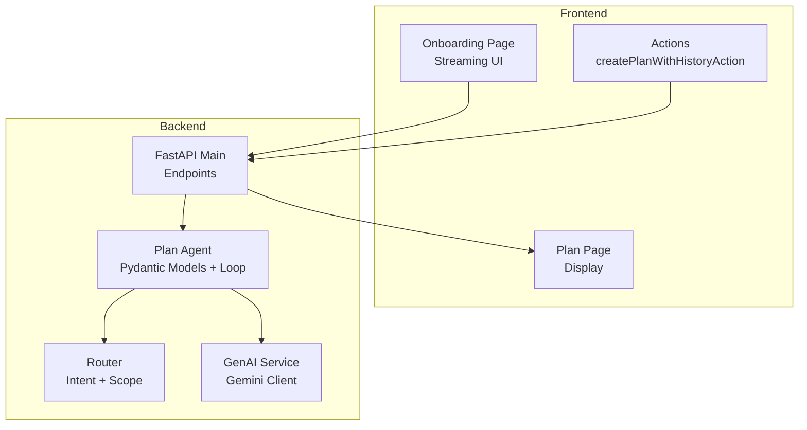
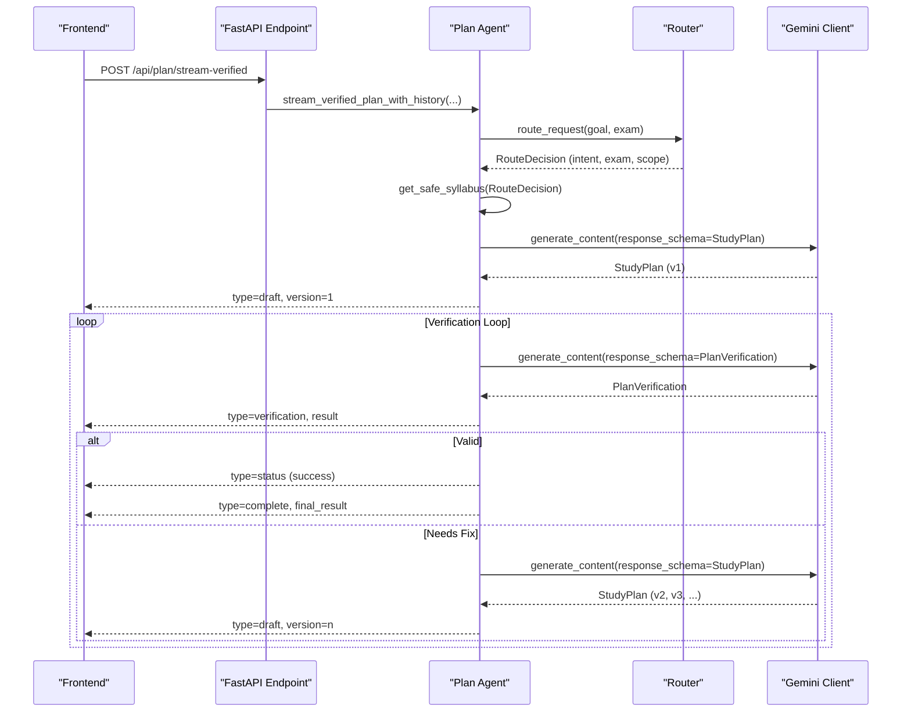
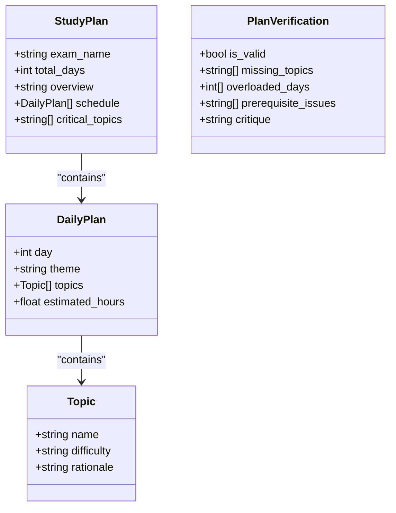
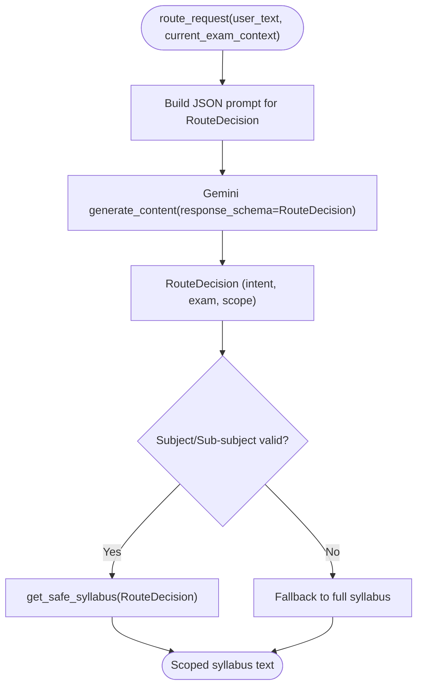
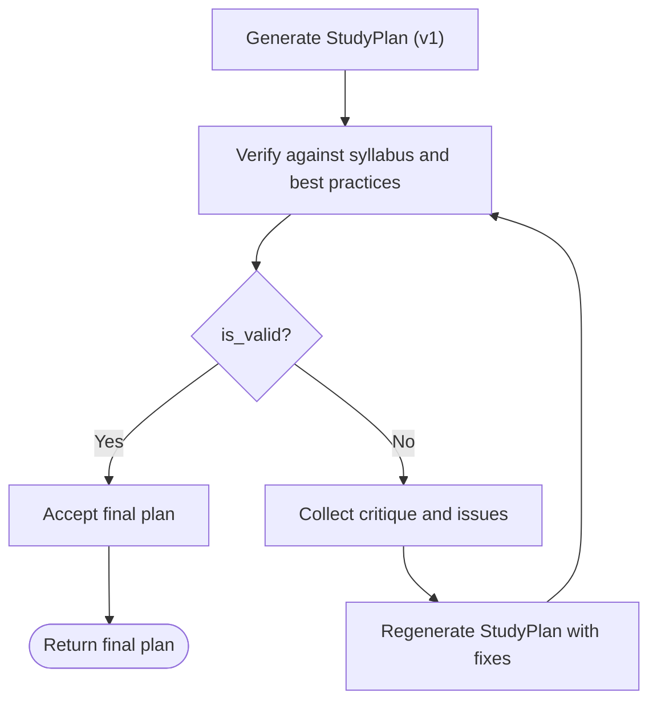
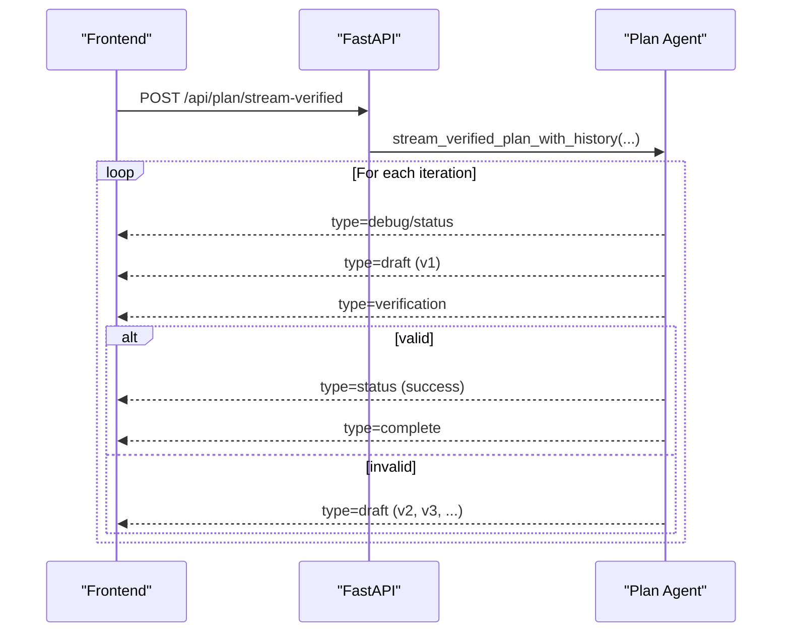
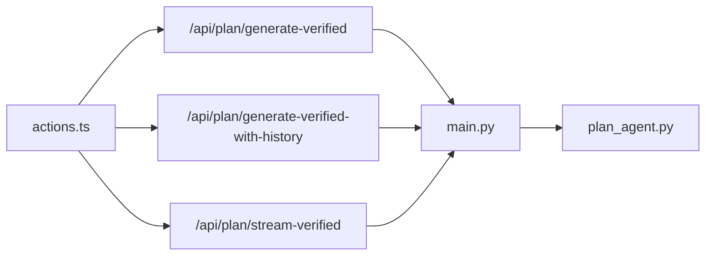
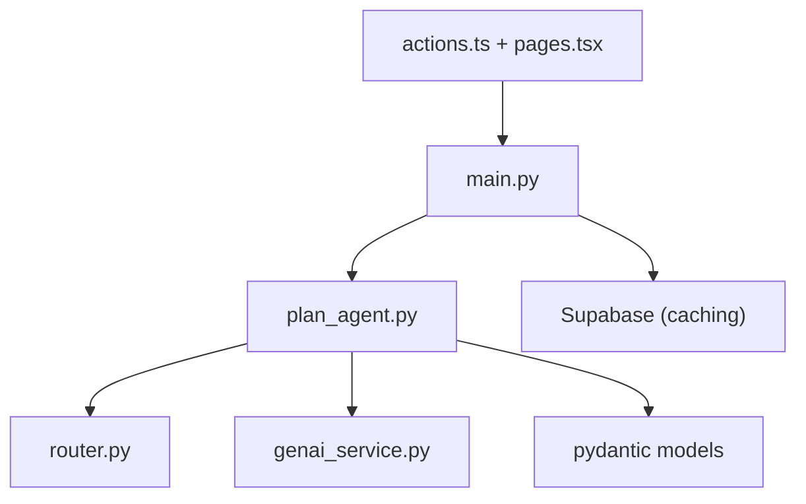

# Plan Agent

<cite>
**Referenced Files in This Document**
- [plan_agent.py](file://backend/agents/plan_agent.py)
- [schemas.py](file://backend/agents/schemas.py)
- [genai_service.py](file://backend/services/genai_service.py)
- [router.py](file://backend/router.py)
- [main.py](file://backend/main.py)
- [actions.ts](file://frontend/app/actions.ts)
- [page.tsx (Onboarding)](file://frontend/app/onboarding/page.tsx)
- [page.tsx (Plan)](file://frontend/app/plan/page.tsx)
- [requirements.txt](file://backend/requirements.txt)
</cite>

## Table of Contents
1. [Introduction](#introduction)
2. [Project Structure](#project-structure)
3. [Core Components](#core-components)
4. [Architecture Overview](#architecture-overview)
5. [Detailed Component Analysis](#detailed-component-analysis)
6. [Dependency Analysis](#dependency-analysis)
7. [Performance Considerations](#performance-considerations)
8. [Troubleshooting Guide](#troubleshooting-guide)
9. [Conclusion](#conclusion)
10. [Appendices](#appendices)

## Introduction
This document explains the Plan Agent responsible for generating personalized study plans using Gemini 3 Structured Outputs. It covers the StudyPlan Pydantic model, the self-correction verification loop, the router integration for syllabus scoping, and the streaming implementation for real-time feedback. It also documents the three-phase process: initial plan generation, verification against syllabus and pedagogical best practices, and automated self-correction. Finally, it provides concrete examples of plan generation workflows, verification criteria, and the complete self-correction process.

## Project Structure
The Plan Agent spans backend and frontend components:
- Backend FastAPI endpoints expose plan generation and verification APIs, including streaming.
- The Plan Agent module defines strict Pydantic models and orchestrates the self-correction loop.
- The Router module scopes syllabi based on user intent and exam context.
- The GenAI service initializes the Gemini client for asynchronous generation.
- Frontend actions and pages coordinate plan creation and display.

**Diagram sources**
- [main.py](file://backend/main.py#L126-L223)
- [plan_agent.py](file://backend/agents/plan_agent.py#L1-L524)
- [router.py](file://backend/router.py#L64-L129)
- [genai_service.py](file://backend/services/genai_service.py#L1-L10)
- [page.tsx (Onboarding)](file://frontend/app/onboarding/page.tsx#L122-L219)
- [actions.ts](file://frontend/app/actions.ts#L156-L191)
- [page.tsx (Plan)](file://frontend/app/plan/page.tsx#L35-L267)

**Section sources**
- [main.py](file://backend/main.py#L126-L223)
- [plan_agent.py](file://backend/agents/plan_agent.py#L1-L524)
- [router.py](file://backend/router.py#L64-L129)
- [genai_service.py](file://backend/services/genai_service.py#L1-L10)
- [page.tsx (Onboarding)](file://frontend/app/onboarding/page.tsx#L122-L219)
- [actions.ts](file://frontend/app/actions.ts#L156-L191)
- [page.tsx (Plan)](file://frontend/app/plan/page.tsx#L35-L267)

## Core Components
- StudyPlan Pydantic model: Defines the validated JSON structure for the final plan, including exam_name, total_days, overview, schedule, and critical_topics.
- Router: Interprets user intent and exam context to scope the syllabus.
- Plan Agent: Orchestrates generation, verification, and self-correction with structured outputs.
- GenAI Service: Provides the Gemini client for asynchronous generation with response_schema validation.
- Streaming: Real-time NDJSON feed of plan generation events for UI feedback.

**Section sources**
- [plan_agent.py](file://backend/agents/plan_agent.py#L30-L45)
- [router.py](file://backend/router.py#L64-L129)
- [genai_service.py](file://backend/services/genai_service.py#L1-L10)
- [main.py](file://backend/main.py#L205-L222)

## Architecture Overview
The Plan Agent follows a three-phase pipeline:
1. Initial plan generation using Gemini 3 Structured Outputs.
2. Verification against syllabus coverage, feasibility, sequencing, and strategy.
3. Automated self-correction by regenerating the plan incorporating critique.

**Diagram sources**
- [main.py](file://backend/main.py#L205-L222)
- [plan_agent.py](file://backend/agents/plan_agent.py#L307-L476)
- [router.py](file://backend/router.py#L64-L129)
- [genai_service.py](file://backend/services/genai_service.py#L1-L10)

## Detailed Component Analysis

### StudyPlan Model and Related Types
The StudyPlan model enforces strict JSON output from Gemini 3 Structured Outputs. It includes:
- exam_name: The exam name.
- total_days: Total duration of the plan in days.
- overview: A brief strategy summary for the student.
- schedule: A list of daily entries with day, theme, topics, and estimated hours.
- critical_topics: Top 3–5 most important topics to focus on.

Related models:
- Topic: name, difficulty (easy, medium, hard), rationale.
- DailyPlan: day, theme, topics, estimated_hours.
- PlanVerification: validation outcome, missing topics, overloaded days, prerequisite issues, and critique.

**Diagram sources**
- [plan_agent.py](file://backend/agents/plan_agent.py#L17-L45)

**Section sources**
- [plan_agent.py](file://backend/agents/plan_agent.py#L17-L45)

### Router Integration for Syllabus Scoping
The Router interprets user intent and exam context to determine:
- Intent: plan, explain, quiz, autopilot, or unknown.
- Exam: neet, jee, upsc, cat, or none.
- Scope: subject, sub-subject, and topics.

It then selects a scoped syllabus via get_safe_syllabus, applying safety checks and fallbacks.

**Diagram sources**
- [router.py](file://backend/router.py#L64-L129)

**Section sources**
- [router.py](file://backend/router.py#L64-L129)

### Self-Correction Verification Loop
The Plan Agent implements a robust self-correction loop:
- Initial plan generation produces StudyPlan (v1).
- Verification uses PlanVerification to check coverage, feasibility, sequencing, and strategy.
- If invalid, the Agent regenerates the plan incorporating critique and repeats until valid or max iterations reached.
- The loop tracks versions and summaries for UI diff visualization.

**Diagram sources**
- [plan_agent.py](file://backend/agents/plan_agent.py#L146-L304)

**Section sources**
- [plan_agent.py](file://backend/agents/plan_agent.py#L146-L304)

### Streaming Implementation for Real-Time Feedback
The backend streams NDJSON events:
- debug: routing information.
- status: progress messages.
- draft: intermediate plan versions.
- verification: validation results.
- complete: final result with versions and summary.

The frontend reads the stream, updates UI phases, and stores the final plan.

**Diagram sources**
- [main.py](file://backend/main.py#L205-L222)
- [plan_agent.py](file://backend/agents/plan_agent.py#L307-L476)
- [page.tsx (Onboarding)](file://frontend/app/onboarding/page.tsx#L122-L219)

**Section sources**
- [main.py](file://backend/main.py#L205-L222)
- [plan_agent.py](file://backend/agents/plan_agent.py#L307-L476)
- [page.tsx (Onboarding)](file://frontend/app/onboarding/page.tsx#L122-L219)

### API Endpoints and Frontend Integration
Backend endpoints:
- POST /api/plan/generate: Legacy plan generation.
- POST /api/plan/generate-verified: Verified plan without history.
- POST /api/plan/generate-verified-with-history: Full history for diff UI.
- POST /api/plan/stream-verified: Streaming NDJSON.

Frontend actions:
- createPlanWithHistoryAction: Calls the history endpoint and persists versions.
- createPlanAction: Calls the verified endpoint and caches results.

**Diagram sources**
- [main.py](file://backend/main.py#L128-L222)
- [actions.ts](file://frontend/app/actions.ts#L156-L191)

**Section sources**
- [main.py](file://backend/main.py#L128-L222)
- [actions.ts](file://frontend/app/actions.ts#L156-L191)

## Dependency Analysis
- Plan Agent depends on:
  - Router for syllabus scoping.
  - GenAI Service for Gemini client initialization.
  - Pydantic models for structured outputs.
- Backend FastAPI depends on:
  - Plan Agent for orchestration.
  - Supabase for caching and persistence.
- Frontend depends on:
  - Actions for API calls.
  - Pages for rendering and navigation.

**Diagram sources**
- [plan_agent.py](file://backend/agents/plan_agent.py#L1-L524)
- [router.py](file://backend/router.py#L64-L129)
- [genai_service.py](file://backend/services/genai_service.py#L1-L10)
- [main.py](file://backend/main.py#L1-L843)
- [actions.ts](file://frontend/app/actions.ts#L156-L191)

**Section sources**
- [plan_agent.py](file://backend/agents/plan_agent.py#L1-L524)
- [router.py](file://backend/router.py#L64-L129)
- [genai_service.py](file://backend/services/genai_service.py#L1-L10)
- [main.py](file://backend/main.py#L1-L843)
- [actions.ts](file://frontend/app/actions.ts#L156-L191)

## Performance Considerations
- Structured Outputs: Using response_schema ensures deterministic JSON and reduces post-processing overhead.
- Streaming: NDJSON enables responsive UI updates without long polling.
- Caching: Frontend actions cache plans by request hash to reduce repeated generations.
- Retry Logic: Frontend actions implement exponential backoff for transient failures.
- Router Efficiency: Minimal prompt and schema-based routing avoids heavy computation.

[No sources needed since this section provides general guidance]

## Troubleshooting Guide
Common issues and resolutions:
- Gemini API errors: Verify GEMINI_API_KEY and model availability. Check backend logs for exceptions raised by generate_content.
- Streaming failures: Ensure the endpoint returns application/x-ndjson and the frontend reads the stream correctly.
- Router ambiguity: If needs_clarification is true, the Agent logs a clarifying question; implement a follow-up mechanism to refine the goal.
- Validation failures: Review PlanVerification critiques and adjust goal constraints (e.g., scope constraints injected into the goal).
- Frontend storage: If localStorage parsing fails, clear stale data and redirect to onboarding.

**Section sources**
- [plan_agent.py](file://backend/agents/plan_agent.py#L181-L214)
- [page.tsx (Onboarding)](file://frontend/app/onboarding/page.tsx#L181-L211)
- [actions.ts](file://frontend/app/actions.ts#L156-L191)

## Conclusion
The Plan Agent delivers a robust, structured, and self-correcting study plan generation pipeline. By combining Gemini 3 Structured Outputs, router-driven syllabus scoping, and streaming feedback, it ensures plans meet syllabus requirements and pedagogical best practices. The frontend integrates seamlessly with backend endpoints to provide a responsive, transparent user experience.

[No sources needed since this section summarizes without analyzing specific files]

## Appendices

### Verification Criteria
- Coverage: All major topics from the syllabus are included.
- Feasibility: No day exceeds 8 hours.
- Sequencing: Prerequisites are scheduled before advanced topics.
- Strategy: Revision time is built into the plan.

**Section sources**
- [plan_agent.py](file://backend/agents/plan_agent.py#L98-L115)

### Example Workflows
- Workflow A: NEET Organic Chemistry Mastery
  - Goal: “Score 650+ and master organic chemistry.”
  - Days: 7
  - Router: intent=plan, exam=neet, scope=chemistry (organic).
  - Plan: Generated with scoped syllabus, verified, and self-corrected if needed.
  - Streaming: UI shows draft, verification, and final plan.

- Workflow B: JEE Physics Mechanics
  - Goal: “Score 95+ percentile and master mechanics.”
  - Days: 14
  - Router: intent=plan, exam=jee, scope=physics.
  - Plan: Generated with scoped syllabus, verified, and self-corrected.

**Section sources**
- [page.tsx (Onboarding)](file://frontend/app/onboarding/page.tsx#L112-L219)
- [actions.ts](file://frontend/app/actions.ts#L156-L191)
- [router.py](file://backend/router.py#L90-L129)

### Dependencies Overview
- Backend dependencies include FastAPI, Pydantic, google-genai, python-dotenv, supabase, gunicorn, and pypdf.

**Section sources**
- [requirements.txt](file://backend/requirements.txt#L1-L32)