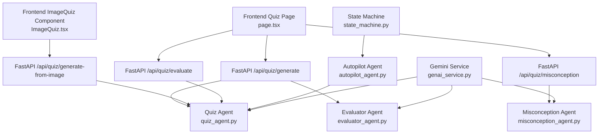
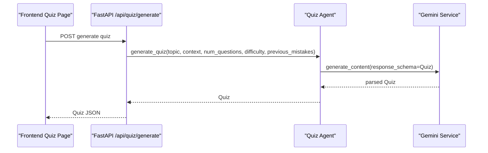
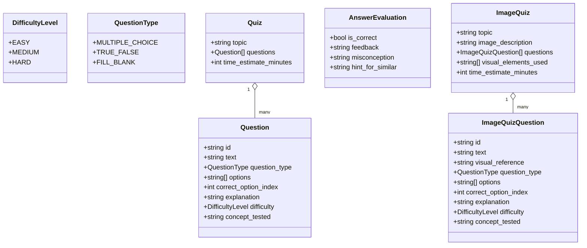
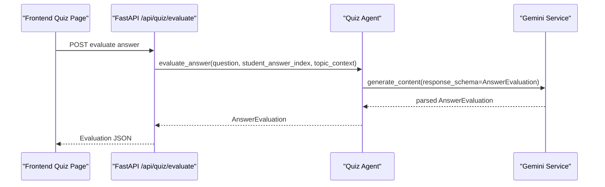
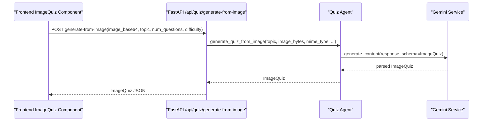
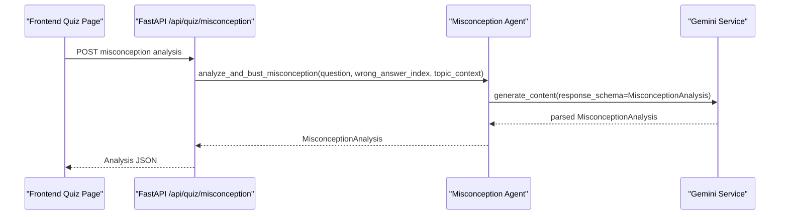
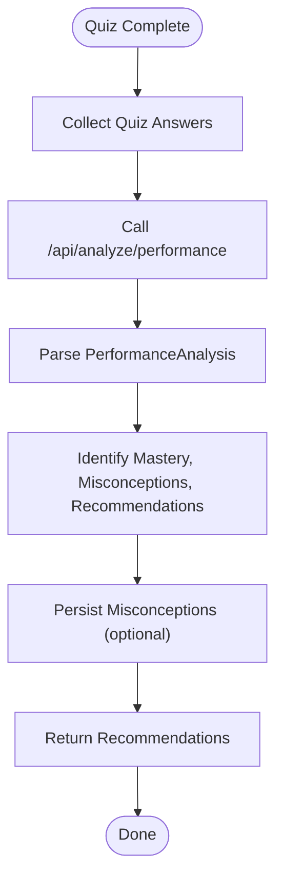
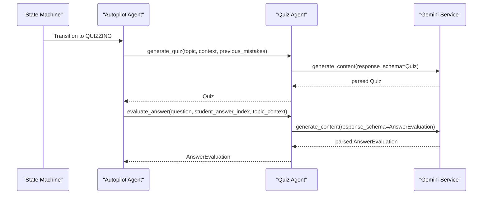
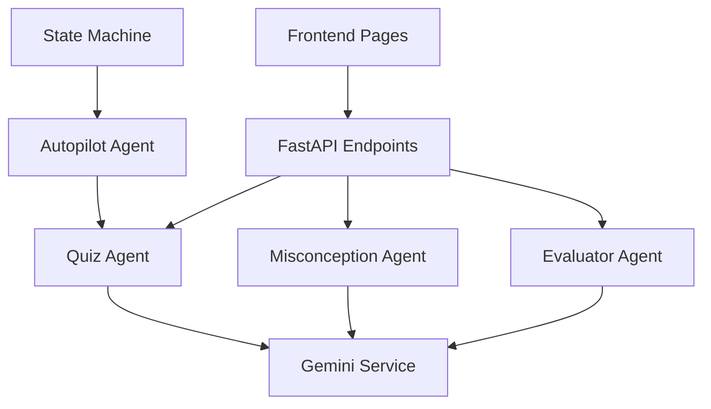

# Quiz Agent

<cite>
**Referenced Files in This Document**
- [quiz_agent.py](file://backend/agents/quiz_agent.py)
- [schemas.py](file://backend/agents/schemas.py)
- [genai_service.py](file://backend/services/genai_service.py)
- [evaluator_agent.py](file://backend/agents/evaluator_agent.py)
- [misconception_agent.py](file://backend/agents/misconception_agent.py)
- [main.py](file://backend/main.py)
- [page.tsx](file://frontend/app/quiz/[topicId]/page.tsx)
- [ImageQuiz.tsx](file://frontend/components/ImageQuiz.tsx)
- [state_machine.py](file://backend/agents/state_machine.py)
- [autopilot_agent.py](file://backend/agents/autopilot_agent.py)
- [.env](file://backend/.env)
</cite>

## Table of Contents
1. [Introduction](#introduction)
2. [Project Structure](#project-structure)
3. [Core Components](#core-components)
4. [Architecture Overview](#architecture-overview)
5. [Detailed Component Analysis](#detailed-component-analysis)
6. [Dependency Analysis](#dependency-analysis)
7. [Performance Considerations](#performance-considerations)
8. [Troubleshooting Guide](#troubleshooting-guide)
9. [Conclusion](#conclusion)

## Introduction
This document explains the Quiz Agent that generates adaptive assessments and evaluates student responses. It covers:
- Quiz generation process: question creation, answer evaluation, and feedback provision
- Multimodal quiz capabilities for diagram-based questions
- Adaptive difficulty adjustment based on student performance
- Question evaluation logic, misconception detection, and performance analysis
- Examples of quiz generation workflows, evaluation criteria, and integration with the broader assessment system
- The agent’s role in formative assessment and learning optimization

## Project Structure
The Quiz Agent spans backend agents, frontend pages, and supporting services:
- Backend agents: quiz generation, evaluation, and misconception analysis
- Frontend pages: quiz UI and multimodal diagram quiz
- API endpoints: orchestrated by FastAPI
- State machine and autopilot: integrate quizzes into a structured learning workflow

**Diagram sources**
- [page.tsx](file://frontend/app/quiz/[topicId]/page.tsx#L127-L144)
- [ImageQuiz.tsx](file://frontend/components/ImageQuiz.tsx#L89-L114)
- [main.py](file://backend/main.py#L329-L429)
- [quiz_agent.py](file://backend/agents/quiz_agent.py#L53-L246)
- [misconception_agent.py](file://backend/agents/misconception_agent.py#L21-L63)
- [evaluator_agent.py](file://backend/agents/evaluator_agent.py#L59-L115)
- [state_machine.py](file://backend/agents/state_machine.py#L38-L136)
- [autopilot_agent.py](file://backend/agents/autopilot_agent.py#L295-L429)
- [genai_service.py](file://backend/services/genai_service.py#L1-L10)

**Section sources**
- [main.py](file://backend/main.py#L329-L429)
- [quiz_agent.py](file://backend/agents/quiz_agent.py#L53-L246)
- [page.tsx](file://frontend/app/quiz/[topicId]/page.tsx#L127-L144)
- [ImageQuiz.tsx](file://frontend/components/ImageQuiz.tsx#L89-L114)

## Core Components
- Quiz Agent: generates adaptive quizzes and evaluates answers with structured feedback
- Misconception Agent: identifies underlying confusion and provides targeted remediation
- Evaluator Agent: performs performance analysis and recommendation generation
- Frontend Quiz Pages: present questions, collect answers, and display feedback
- API Endpoints: expose quiz generation, evaluation, and misconception busting
- State Machine and Autopilot: integrate quizzes into a guided learning journey

Key responsibilities:
- Generate quizzes aligned to topic mastery and prior misconceptions
- Evaluate answers and provide personalized feedback
- Detect misconceptions and offer redemption questions
- Support multimodal diagram-based quizzes
- Integrate with broader assessment and learning systems

**Section sources**
- [quiz_agent.py](file://backend/agents/quiz_agent.py#L53-L246)
- [misconception_agent.py](file://backend/agents/misconception_agent.py#L21-L63)
- [evaluator_agent.py](file://backend/agents/evaluator_agent.py#L59-L115)
- [page.tsx](file://frontend/app/quiz/[topicId]/page.tsx#L202-L238)
- [ImageQuiz.tsx](file://frontend/components/ImageQuiz.tsx#L116-L123)

## Architecture Overview
The Quiz Agent participates in two primary workflows:
1) Student-driven quiz: generate quiz, submit answers, receive evaluation and misconception analysis
2) Multimodal diagram quiz: upload image, generate diagram-grounded questions, answer and review

**Diagram sources**
- [page.tsx](file://frontend/app/quiz/[topicId]/page.tsx#L127-L144)
- [main.py](file://backend/main.py#L329-L346)
- [quiz_agent.py](file://backend/agents/quiz_agent.py#L53-L111)
- [genai_service.py](file://backend/services/genai_service.py#L1-L10)

## Detailed Component Analysis

### Quiz Generation and Evaluation
The Quiz Agent defines data models for questions and quizzes and exposes asynchronous generation functions. It integrates with Gemini 3 Structured Outputs to produce validated JSON.

**Diagram sources**
- [quiz_agent.py](file://backend/agents/quiz_agent.py#L16-L50)
- [quiz_agent.py](file://backend/agents/quiz_agent.py#L116-L136)

Key generation and evaluation functions:
- generate_quiz: creates a quiz tailored to topic, context, difficulty, and prior misconceptions
- evaluate_answer: returns correctness, personalized feedback, misconception, and hint
- generate_quiz_from_image: produces diagram-grounded questions with visual references

**Diagram sources**
- [page.tsx](file://frontend/app/quiz/[topicId]/page.tsx#L209-L221)
- [main.py](file://backend/main.py#L403-L429)
- [quiz_agent.py](file://backend/agents/quiz_agent.py#L206-L246)
- [genai_service.py](file://backend/services/genai_service.py#L1-L10)

**Section sources**
- [quiz_agent.py](file://backend/agents/quiz_agent.py#L53-L246)
- [main.py](file://backend/main.py#L329-L429)

### Multimodal Diagram-Based Quiz
The multimodal capability generates questions that reference specific visual elements in an image, requiring visual grounding.

**Diagram sources**
- [ImageQuiz.tsx](file://frontend/components/ImageQuiz.tsx#L89-L114)
- [main.py](file://backend/main.py#L356-L401)
- [quiz_agent.py](file://backend/agents/quiz_agent.py#L138-L201)
- [genai_service.py](file://backend/services/genai_service.py#L1-L10)

**Section sources**
- [quiz_agent.py](file://backend/agents/quiz_agent.py#L138-L201)
- [ImageQuiz.tsx](file://frontend/components/ImageQuiz.tsx#L89-L114)

### Misconception Detection and Remediation
When a student answers incorrectly, the Misconception Agent infers the underlying confusion, provides a counter-example, and offers a redemption question.

**Diagram sources**
- [page.tsx](file://frontend/app/quiz/[topicId]/page.tsx#L253-L263)
- [main.py](file://backend/main.py#L465-L514)
- [misconception_agent.py](file://backend/agents/misconception_agent.py#L21-L63)
- [genai_service.py](file://backend/services/genai_service.py#L1-L10)

**Section sources**
- [misconception_agent.py](file://backend/agents/misconception_agent.py#L21-L63)
- [page.tsx](file://frontend/app/quiz/[topicId]/page.tsx#L240-L273)

### Performance Analysis and Recommendations
After quiz completion, the Evaluator Agent analyzes results, identifies misconceptions, and provides actionable recommendations.

**Diagram sources**
- [page.tsx](file://frontend/app/quiz/[topicId]/page.tsx#L286-L294)
- [main.py](file://backend/main.py#L433-L462)
- [evaluator_agent.py](file://backend/agents/evaluator_agent.py#L59-L115)

**Section sources**
- [evaluator_agent.py](file://backend/agents/evaluator_agent.py#L59-L115)
- [main.py](file://backend/main.py#L433-L462)

### Integration with State Machine and Autopilot
The Quiz Agent integrates with the State Machine and Autopilot to support guided, adaptive learning sessions.

**Diagram sources**
- [state_machine.py](file://backend/agents/state_machine.py#L44-L78)
- [autopilot_agent.py](file://backend/agents/autopilot_agent.py#L295-L429)
- [quiz_agent.py](file://backend/agents/quiz_agent.py#L53-L246)
- [genai_service.py](file://backend/services/genai_service.py#L1-L10)

**Section sources**
- [state_machine.py](file://backend/agents/state_machine.py#L38-L136)
- [autopilot_agent.py](file://backend/agents/autopilot_agent.py#L295-L429)

## Dependency Analysis
- Quiz Agent depends on:
  - Gemini client initialized in genai_service.py
  - FastAPI endpoints in main.py for generation, evaluation, and misconception endpoints
  - Frontend pages for user interaction
- Misconception Agent and Evaluator Agent depend on Gemini for structured outputs
- Autopilot orchestrates the entire flow and persists state via Supabase

**Diagram sources**
- [genai_service.py](file://backend/services/genai_service.py#L1-L10)
- [main.py](file://backend/main.py#L329-L514)
- [quiz_agent.py](file://backend/agents/quiz_agent.py#L53-L246)
- [misconception_agent.py](file://backend/agents/misconception_agent.py#L21-L63)
- [evaluator_agent.py](file://backend/agents/evaluator_agent.py#L59-L115)
- [state_machine.py](file://backend/agents/state_machine.py#L38-L136)
- [autopilot_agent.py](file://backend/agents/autopilot_agent.py#L295-L429)

**Section sources**
- [main.py](file://backend/main.py#L329-L514)
- [genai_service.py](file://backend/services/genai_service.py#L1-L10)

## Performance Considerations
- Structured outputs: Using Gemini 3 Structured Outputs ensures deterministic JSON parsing and reduces retries
- Asynchronous operations: All agent functions are async to minimize latency and improve throughput
- Adaptive difficulty: Adjusts quiz difficulty and targets misconceptions to reduce redundant practice
- Multimodal prompts: Require larger models and careful prompt engineering to avoid token limits
- Caching and persistence: Consider caching quiz templates and persisting misconceptions to reduce repeated generation

## Troubleshooting Guide
Common issues and resolutions:
- Missing environment variables: Ensure GEMINI_API_KEY and GEMINI_MODEL are set
  - See [.env](file://backend/.env#L1-L5)
- Model overload errors: The Autopilot Agent includes retry logic with exponential backoff
  - See [autopilot_agent.py](file://backend/agents/autopilot_agent.py#L142-L162)
- Gemini client initialization: Verify genai_service.py loads environment and initializes client
  - See [genai_service.py](file://backend/services/genai_service.py#L1-L10)
- Frontend quiz persistence: Confirm API base URL and quiz persistence endpoints
  - See [page.tsx](file://frontend/app/quiz/[topicId]/page.tsx#L71-L95)
- Multimodal image handling: Validate image MIME type and base64 encoding
  - See [ImageQuiz.tsx](file://frontend/components/ImageQuiz.tsx#L59-L81)

**Section sources**
- [.env](file://backend/.env#L1-L5)
- [autopilot_agent.py](file://backend/agents/autopilot_agent.py#L142-L162)
- [genai_service.py](file://backend/services/genai_service.py#L1-L10)
- [page.tsx](file://frontend/app/quiz/[topicId]/page.tsx#L71-L95)
- [ImageQuiz.tsx](file://frontend/components/ImageQuiz.tsx#L59-L81)

## Conclusion
The Quiz Agent enables adaptive, multimodal assessments that drive formative feedback and remediation. By integrating structured outputs, misconception detection, and performance analysis, it supports continuous learning optimization. Combined with the State Machine and Autopilot, it forms a cohesive system for guided, autonomous study experiences.