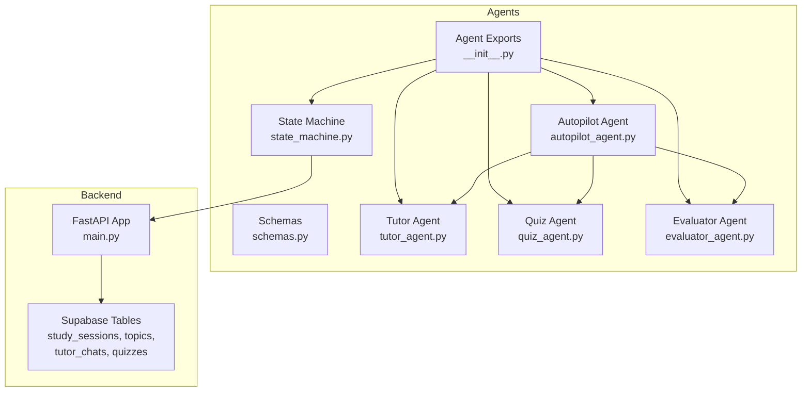
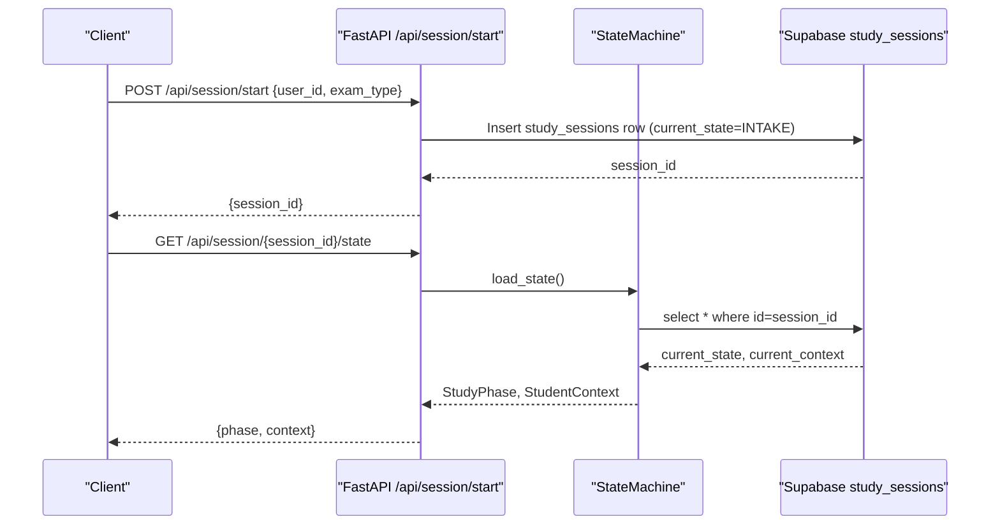
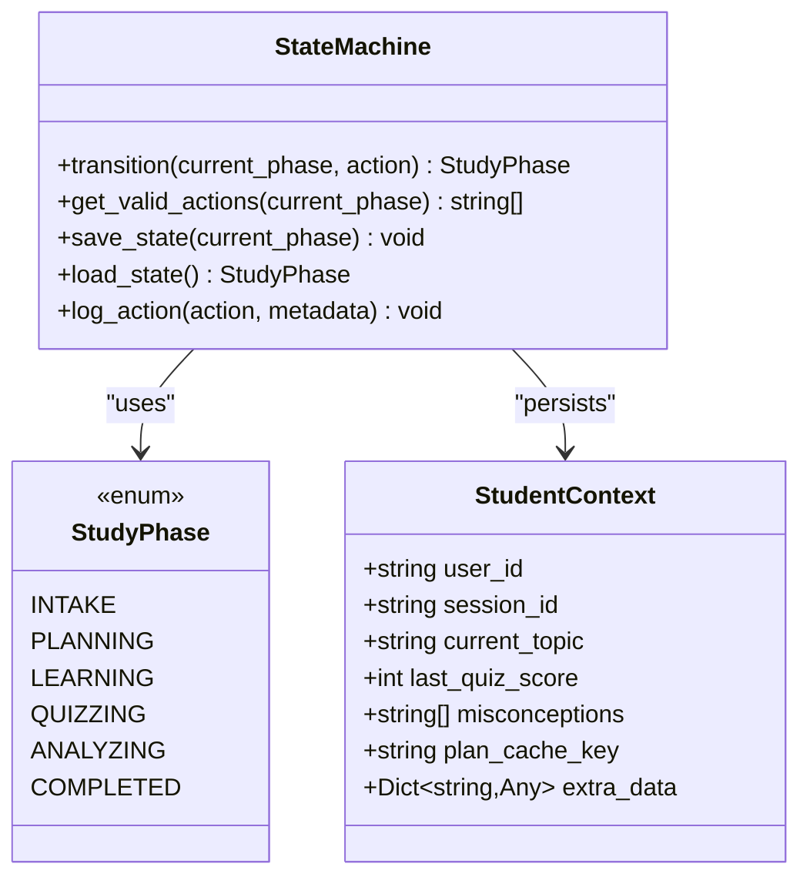
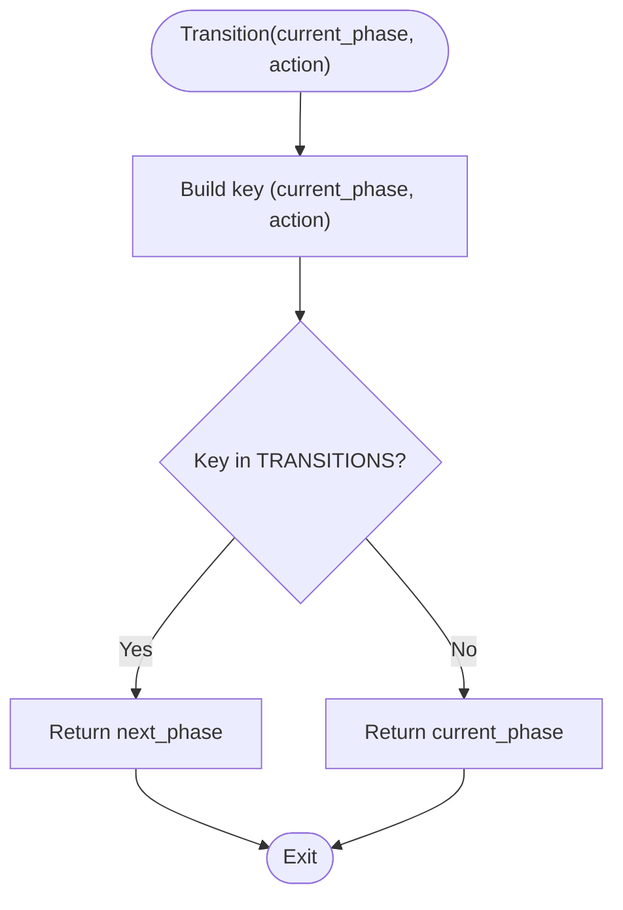
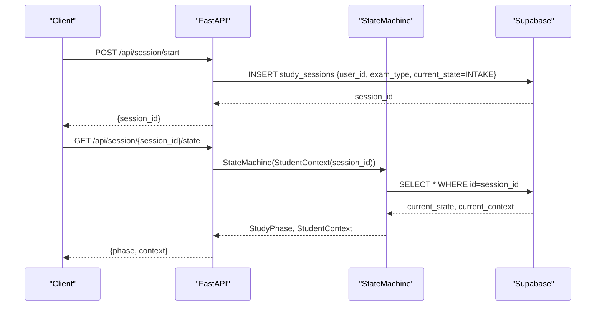
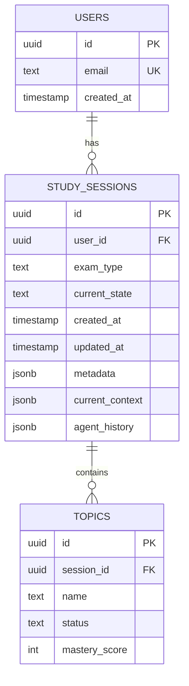
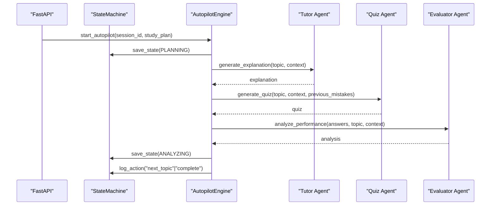
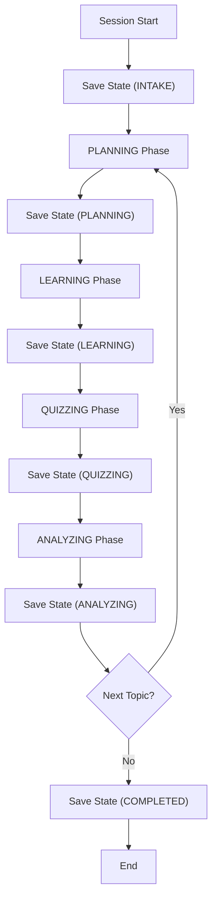
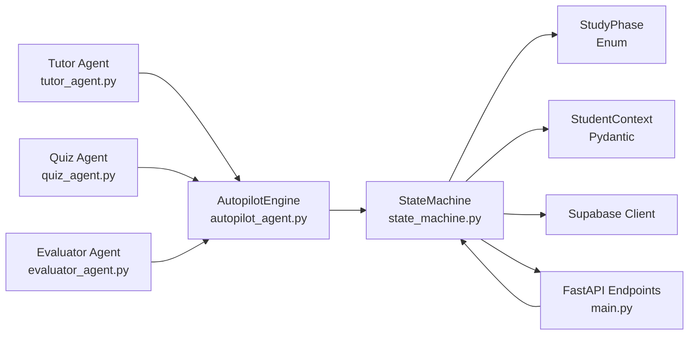

# State Machine

<cite>
**Referenced Files in This Document**
- [state_machine.py](file://backend/agents/state_machine.py)
- [__init__.py](file://backend/agents/__init__.py)
- [main.py](file://backend/main.py)
- [001_create_core_schema.sql](file://backend/migrations/001_create_core_schema.sql)
- [002_add_session_context.sql](file://backend/migrations/002_add_session_context.sql)
- [004_create_persistence_tables.sql](file://backend/migrations/004_create_persistence_tables.sql)
- [schemas.py](file://backend/agents/schemas.py)
- [autopilot_agent.py](file://backend/agents/autopilot_agent.py)
- [tutor_agent.py](file://backend/agents/tutor_agent.py)
- [quiz_agent.py](file://backend/agents/quiz_agent.py)
- [evaluator_agent.py](file://backend/agents/evaluator_agent.py)
</cite>

## Table of Contents
1. [Introduction](#introduction)
2. [Project Structure](#project-structure)
3. [Core Components](#core-components)
4. [Architecture Overview](#architecture-overview)
5. [Detailed Component Analysis](#detailed-component-analysis)
6. [Dependency Analysis](#dependency-analysis)
7. [Performance Considerations](#performance-considerations)
8. [Troubleshooting Guide](#troubleshooting-guide)
9. [Conclusion](#conclusion)

## Introduction
This document explains the State Machine that coordinates workflow phases and session persistence across the multi-agent system. It covers state transition logic, session lifecycle management, data persistence mechanisms, agent integration, validation of transitions, session state tracking, progress persistence, and recovery for interrupted sessions. It also provides examples of state transition workflows, session management patterns, and how the state machine orchestrates agent interactions to ensure reliable workflow execution.

## Project Structure
The state machine resides in the agents package and integrates with the FastAPI backend and Supabase persistence. The agents package exports the state machine and agent schemas for easy import across the system. The backend exposes session management endpoints that create and resume sessions, and the database migrations define the schema for persistent state.

**Diagram sources**
- [state_machine.py](file://backend/agents/state_machine.py#L38-L136)
- [__init__.py](file://backend/agents/__init__.py#L1-L96)
- [main.py](file://backend/main.py#L516-L645)
- [001_create_core_schema.sql](file://backend/migrations/001_create_core_schema.sql#L14-L22)
- [002_add_session_context.sql](file://backend/migrations/002_add_session_context.sql#L2-L4)
- [schemas.py](file://backend/agents/schemas.py#L1-L106)
- [autopilot_agent.py](file://backend/agents/autopilot_agent.py#L1-L628)
- [tutor_agent.py](file://backend/agents/tutor_agent.py#L1-L200)
- [quiz_agent.py](file://backend/agents/quiz_agent.py#L1-L200)
- [evaluator_agent.py](file://backend/agents/evaluator_agent.py#L1-L198)

**Section sources**
- [state_machine.py](file://backend/agents/state_machine.py#L1-L136)
- [__init__.py](file://backend/agents/__init__.py#L1-L96)
- [main.py](file://backend/main.py#L516-L645)
- [001_create_core_schema.sql](file://backend/migrations/001_create_core_schema.sql#L14-L22)
- [002_add_session_context.sql](file://backend/migrations/002_add_session_context.sql#L2-L4)

## Core Components
- StudyPhase: Defines the six workflow phases: INTAKE, PLANNING, LEARNING, QUIZZING, ANALYZING, COMPLETED.
- StudentContext: Tracks session-scoped state including user_id, session_id, current_topic, last_quiz_score, misconceptions, plan_cache_key, and extra_data.
- StateMachine: Validates transitions, persists and rehydrates session state, and logs agent actions.

Key responsibilities:
- Transition validation: Ensures actions follow the intended workflow order.
- Persistence: Saves current_state and current_context to the study_sessions table.
- Recovery: Loads persisted state to resume interrupted sessions.
- Audit logging: Appends agent action logs to the session history.

**Section sources**
- [state_machine.py](file://backend/agents/state_machine.py#L17-L36)
- [state_machine.py](file://backend/agents/state_machine.py#L38-L136)

## Architecture Overview
The state machine acts as the central coordinator for the multi-agent system. It validates transitions between phases, persists session state, and enables recovery. The backend creates sessions, resumes them, and coordinates agent interactions. Agents produce structured outputs that inform state transitions and progress tracking.

**Diagram sources**
- [main.py](file://backend/main.py#L523-L556)
- [state_machine.py](file://backend/agents/state_machine.py#L96-L113)

## Detailed Component Analysis

### State Machine Class
The StateMachine encapsulates:
- Phase transitions: A deterministic map of (current_phase, action) to next_phase.
- Valid actions: Utility to list permitted actions for the current phase.
- Persistence: Save and load session state to/from Supabase.
- Action logging: Append audit entries to the session history.

**Diagram sources**
- [state_machine.py](file://backend/agents/state_machine.py#L17-L36)
- [state_machine.py](file://backend/agents/state_machine.py#L38-L136)

**Section sources**
- [state_machine.py](file://backend/agents/state_machine.py#L38-L136)

### Transition Logic and Validation
Transitions enforce a strict workflow:
- INTAKE → PLANNING on "generate_plan"
- PLANNING → LEARNING on "start_topic"
- LEARNING → QUIZZING on "take_quiz"
- QUIZZING → ANALYZING on "submit_answers"
- ANALYZING → PLANNING on "next_topic"
- ANALYZING → COMPLETED on "complete"

Invalid actions remain in the current phase, preventing out-of-order execution.

**Diagram sources**
- [state_machine.py](file://backend/agents/state_machine.py#L44-L71)

**Section sources**
- [state_machine.py](file://backend/agents/state_machine.py#L44-L78)

### Session Lifecycle Management
Sessions are created and resumed via backend endpoints:
- Creation: POST /api/session/start inserts a study_sessions row with current_state=INTAKE and returns session_id.
- Resume: GET /api/session/{session_id}/state loads persisted state and context.

**Diagram sources**
- [main.py](file://backend/main.py#L523-L556)
- [state_machine.py](file://backend/agents/state_machine.py#L96-L113)

**Section sources**
- [main.py](file://backend/main.py#L523-L556)
- [state_machine.py](file://backend/agents/state_machine.py#L96-L113)

### Data Persistence Mechanisms
Persistence relies on Supabase:
- study_sessions: Stores current_state, current_context, agent_history, and metadata.
- Migration 002 adds current_context and agent_history columns.
- Migration 001 defines the core schema including study_sessions and topics.

**Diagram sources**
- [001_create_core_schema.sql](file://backend/migrations/001_create_core_schema.sql#L14-L22)
- [001_create_core_schema.sql](file://backend/migrations/001_create_core_schema.sql#L25-L31)
- [002_add_session_context.sql](file://backend/migrations/002_add_session_context.sql#L2-L4)

**Section sources**
- [001_create_core_schema.sql](file://backend/migrations/001_create_core_schema.sql#L14-L22)
- [002_add_session_context.sql](file://backend/migrations/002_add_session_context.sql#L2-L4)

### Integration with Agents for Coordinated Workflow Execution
The state machine coordinates agents through:
- Phase-driven orchestration: Each phase triggers specific agent actions (e.g., PLANNING invokes plan generation, LEARNING invokes tutoring).
- Structured outputs: Agents return validated schemas that inform subsequent phases.
- Autopilot integration: The Autopilot Agent orchestrates topic selection, micro-lessons, quizzes, and misconception analysis, updating session state and emitting run logs.

**Diagram sources**
- [main.py](file://backend/main.py#L582-L641)
- [autopilot_agent.py](file://backend/agents/autopilot_agent.py#L431-L545)
- [tutor_agent.py](file://backend/agents/tutor_agent.py#L131-L186)
- [quiz_agent.py](file://backend/agents/quiz_agent.py#L53-L111)
- [evaluator_agent.py](file://backend/agents/evaluator_agent.py#L59-L115)
- [state_machine.py](file://backend/agents/state_machine.py#L80-L135)

**Section sources**
- [main.py](file://backend/main.py#L582-L641)
- [autopilot_agent.py](file://backend/agents/autopilot_agent.py#L431-L545)
- [tutor_agent.py](file://backend/agents/tutor_agent.py#L131-L186)
- [quiz_agent.py](file://backend/agents/quiz_agent.py#L53-L111)
- [evaluator_agent.py](file://backend/agents/evaluator_agent.py#L59-L115)
- [state_machine.py](file://backend/agents/state_machine.py#L80-L135)

### Session State Tracking, Progress Persistence, and Recovery
- State tracking: The StateMachine stores current_state and current_context in study_sessions.
- Progress persistence: AutopilotSession tracks topics attempted, completed, and mastery levels; these can be persisted alongside session state.
- Recovery: On startup or resume, load_state() restores the phase and context, enabling seamless continuation.

**Diagram sources**
- [state_machine.py](file://backend/agents/state_machine.py#L80-L113)
- [autopilot_agent.py](file://backend/agents/autopilot_agent.py#L57-L87)

**Section sources**
- [state_machine.py](file://backend/agents/state_machine.py#L80-L113)
- [autopilot_agent.py](file://backend/agents/autopilot_agent.py#L57-L87)

### Examples of State Transition Workflows
- Intake to Planning: After collecting student info, generate a study plan; transition to LEARNING.
- Learning to Quizzing: Deliver micro-lessons; trigger a quiz; transition to ANALYZING.
- Analyzing to Planning: Based on performance, adjust the plan and move to the next topic; or complete the session.

These workflows are enforced by the transition map and validated by get_valid_actions.

**Section sources**
- [state_machine.py](file://backend/agents/state_machine.py#L44-L78)

### Session Management Patterns
- Session creation: POST /api/session/start initializes current_state=INTAKE.
- Session resumption: GET /api/session/{session_id}/state retrieves persisted state and context.
- Manual save: POST /api/session/{session_id}/save allows explicit state persistence.

**Section sources**
- [main.py](file://backend/main.py#L523-L570)

### Coordination Through State-Based Orchestration
- The state machine ensures agents operate in the correct order.
- Structured schemas (PlanOutput, TutorOutput, QuizOutput, Evaluation) guide agent outputs and inform state transitions.
- Autopilot orchestrates end-to-end autonomous sessions, logging decisions and updating session state continuously.

**Section sources**
- [schemas.py](file://backend/agents/schemas.py#L16-L105)
- [autopilot_agent.py](file://backend/agents/autopilot_agent.py#L100-L545)

## Dependency Analysis
The state machine depends on:
- Supabase client for persistence.
- Pydantic models for typed context and outputs.
- Enum for phases.
- Agent modules for orchestrated workflows.

**Diagram sources**
- [state_machine.py](file://backend/agents/state_machine.py#L54-L63)
- [main.py](file://backend/main.py#L516-L641)
- [autopilot_agent.py](file://backend/agents/autopilot_agent.py#L100-L545)
- [tutor_agent.py](file://backend/agents/tutor_agent.py#L1-L200)
- [quiz_agent.py](file://backend/agents/quiz_agent.py#L1-L200)
- [evaluator_agent.py](file://backend/agents/evaluator_agent.py#L1-L198)

**Section sources**
- [state_machine.py](file://backend/agents/state_machine.py#L54-L63)
- [main.py](file://backend/main.py#L516-L641)
- [autopilot_agent.py](file://backend/agents/autopilot_agent.py#L100-L545)

## Performance Considerations
- Asynchronous persistence: save_state and load_state use async Supabase calls to minimize latency.
- Minimal payload: Only current_state and current_context are persisted; agent_history grows over time and should be trimmed if needed.
- Retry logic: The AutopilotEngine retries operations with exponential backoff for rate-limited or overloaded model responses.
- Indexing: Study sessions and topics tables include indexes to optimize lookups.

[No sources needed since this section provides general guidance]

## Troubleshooting Guide
Common issues and remedies:
- Missing Supabase credentials: The StateMachine prints a warning and disables persistence. Ensure SUPABASE_URL and SUPABASE_SERVICE_ROLE_KEY or SUPABASE_ANON_KEY are configured.
- Persistence failures: save_state and load_state catch exceptions and print errors; verify table permissions and network connectivity.
- Invalid transitions: If an action leads to an unexpected phase, confirm the action aligns with the current phase according to TRANSITIONS.
- Session not found: When resuming, ensure the session_id exists in study_sessions; otherwise, create a new session.

**Section sources**
- [state_machine.py](file://backend/agents/state_machine.py#L56-L63)
- [state_machine.py](file://backend/agents/state_machine.py#L91-L94)
- [state_machine.py](file://backend/agents/state_machine.py#L111-L113)

## Conclusion
The State Machine is the central coordinator that enforces a disciplined workflow across the multi-agent system. By validating transitions, persisting session state, and logging actions, it ensures reliable, recoverable, and auditable execution. Together with the backend’s session management and the agents’ structured outputs, it enables seamless orchestration of planning, teaching, quizzing, and evaluation—delivering a robust foundation for autonomous, adaptive learning experiences.