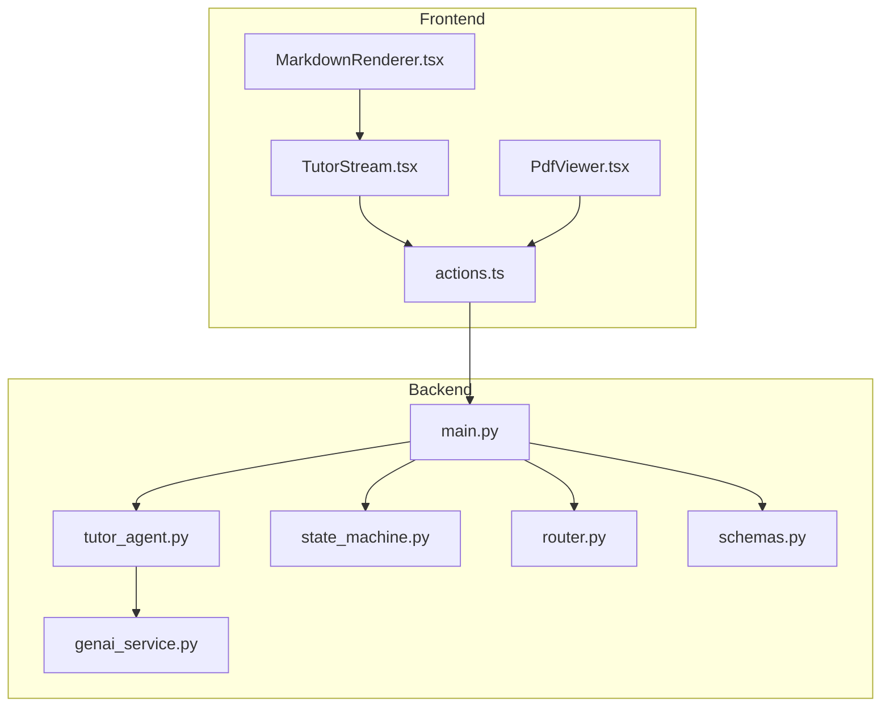
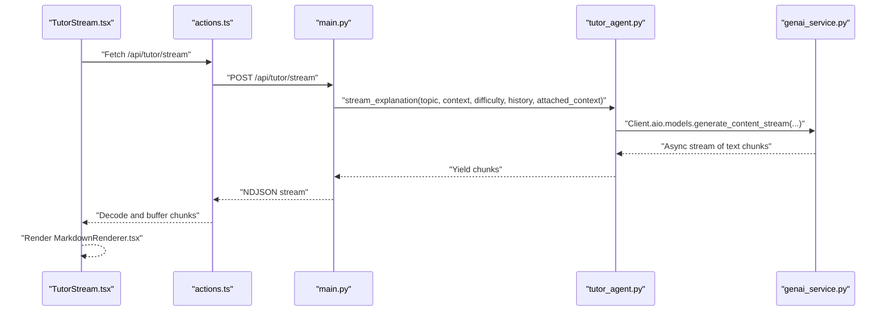
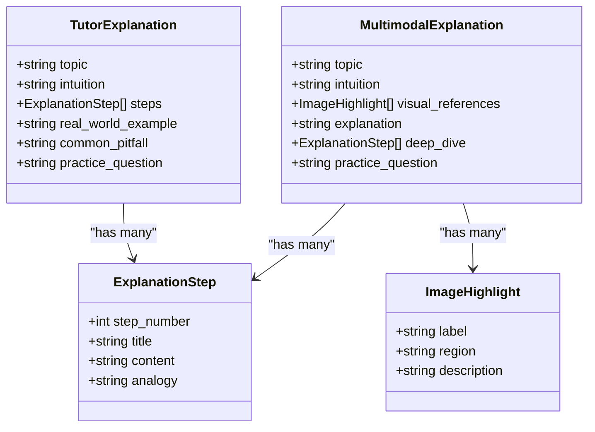
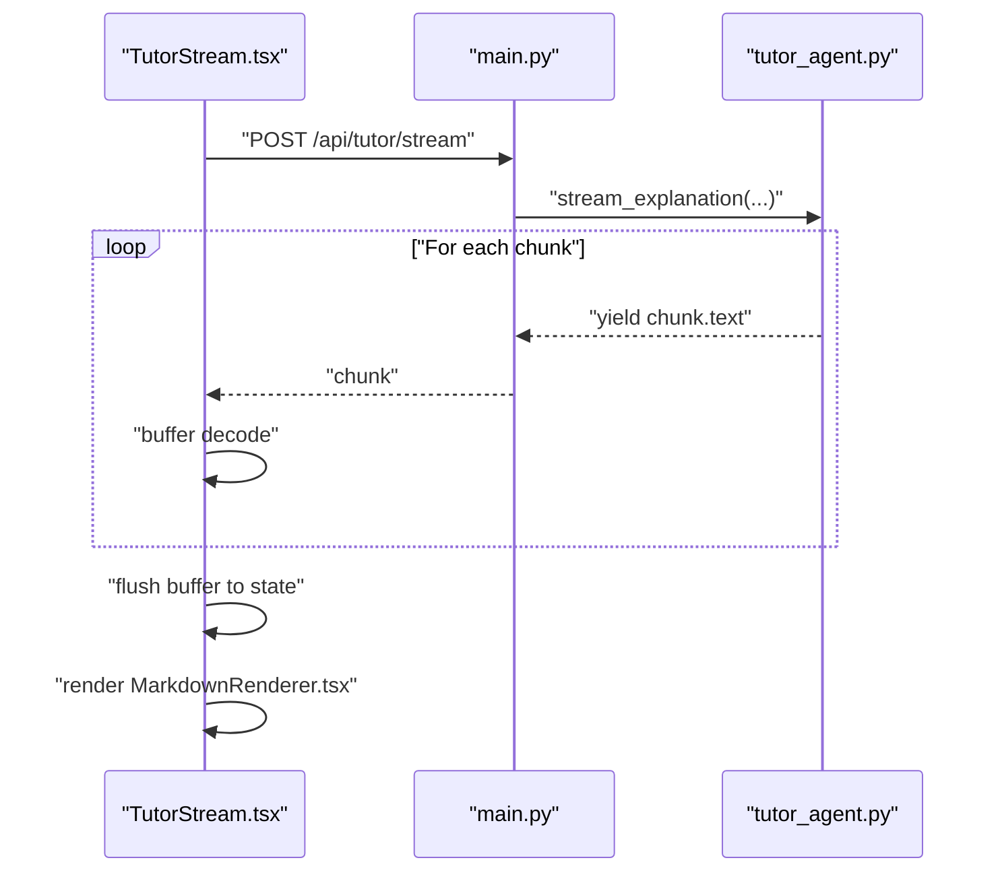
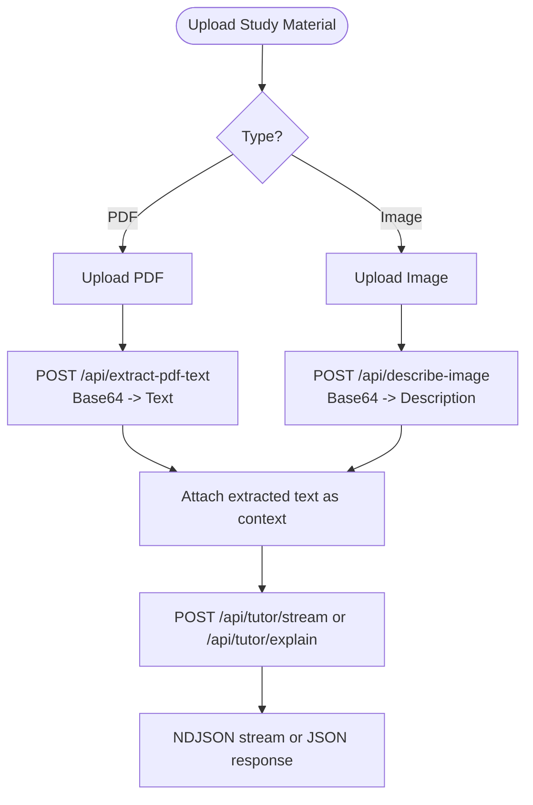
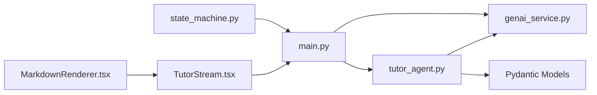

# Tutor Agent

<cite>
**Referenced Files in This Document**
- [tutor_agent.py](file://backend/agents/tutor_agent.py)
- [state_machine.py](file://backend/agents/state_machine.py)
- [genai_service.py](file://backend/services/genai_service.py)
- [schemas.py](file://backend/agents/schemas.py)
- [main.py](file://backend/main.py)
- [router.py](file://backend/router.py)
- [TutorStream.tsx](file://frontend/components/TutorStream.tsx)
- [MarkdownRenderer.tsx](file://frontend/components/MarkdownRenderer.tsx)
- [PdfViewer.tsx](file://frontend/components/PdfViewer.tsx)
- [actions.ts](file://frontend/app/actions.ts)
</cite>

## Table of Contents
1. [Introduction](#introduction)
2. [Project Structure](#project-structure)
3. [Core Components](#core-components)
4. [Architecture Overview](#architecture-overview)
5. [Detailed Component Analysis](#detailed-component-analysis)
6. [Dependency Analysis](#dependency-analysis)
7. [Performance Considerations](#performance-considerations)
8. [Troubleshooting Guide](#troubleshooting-guide)
9. [Conclusion](#conclusion)
10. [Appendices](#appendices)

## Introduction
This document describes the Tutor Agent responsible for interactive AI tutoring and explanation generation. It explains the structured explanation generation process using the Feynman technique for simplifying complex concepts, the streaming response implementation for real-time tutoring sessions, and multimodal content handling including PDF text extraction. It also documents the explanation generation prompts, content structuring, integration with Gemini 3 models for natural language processing, tutoring workflows, explanation quality assurance, and the streaming data format used for frontend presentation. Finally, it outlines the agent’s role in the overall learning orchestration and its integration with the state machine for session management.

## Project Structure
The Tutor Agent spans backend and frontend components:
- Backend:
  - Agents: tutor_agent.py (explanations, streaming, multimodal)
  - Services: genai_service.py (Gemini client)
  - Orchestration: state_machine.py (session lifecycle)
  - API: main.py (FastAPI endpoints for streaming, PDF extraction, multimodal)
  - Router: router.py (intent routing and syllabus scoping)
  - Shared schemas: schemas.py (Pydantic models for structured outputs)
- Frontend:
  - UI: TutorStream.tsx (streaming UI and buffering)
  - Rendering: MarkdownRenderer.tsx (math-enabled markdown rendering)
  - Materials: PdfViewer.tsx (PDF/image viewer and upload)
  - Actions: actions.ts (API calls for tutoring, PDF extraction, image description)

**Diagram sources**
- [main.py](file://backend/main.py#L245-L260)
- [tutor_agent.py](file://backend/agents/tutor_agent.py#L51-L127)
- [genai_service.py](file://backend/services/genai_service.py#L1-L10)
- [state_machine.py](file://backend/agents/state_machine.py#L38-L114)
- [router.py](file://backend/router.py#L64-L88)
- [schemas.py](file://backend/agents/schemas.py#L36-L50)
- [TutorStream.tsx](file://frontend/components/TutorStream.tsx#L64-L115)
- [MarkdownRenderer.tsx](file://frontend/components/MarkdownRenderer.tsx#L39-L52)
- [PdfViewer.tsx](file://frontend/components/PdfViewer.tsx#L13-L37)
- [actions.ts](file://frontend/app/actions.ts#L195-L239)

**Section sources**
- [main.py](file://backend/main.py#L1-L124)
- [tutor_agent.py](file://backend/agents/tutor_agent.py#L1-L50)
- [genai_service.py](file://backend/services/genai_service.py#L1-L10)
- [state_machine.py](file://backend/agents/state_machine.py#L1-L42)
- [router.py](file://backend/router.py#L1-L33)
- [schemas.py](file://backend/agents/schemas.py#L1-L10)
- [TutorStream.tsx](file://frontend/components/TutorStream.tsx#L1-L27)
- [MarkdownRenderer.tsx](file://frontend/components/MarkdownRenderer.tsx#L1-L12)
- [PdfViewer.tsx](file://frontend/components/PdfViewer.tsx#L1-L12)
- [actions.ts](file://frontend/app/actions.ts#L193-L239)

## Core Components
- Tutor Agent (backend):
  - Structured explanation generator using Gemini 3 models with Pydantic schemas
  - Streaming explanation generator for real-time UI feedback
  - Multimodal explanation and image description for visual grounding
- State Machine (backend):
  - Enforces valid transitions across study phases (INTAKE → PLANNING → LEARNING → QUIZZING → ANALYZING → COMPLETED)
  - Persists and loads session state and logs agent actions
- Frontend Tutor Stream (frontend):
  - Real-time streaming UI with buffered updates and auto-scroll behavior
  - Markdown rendering with math support
- PDF/Image Integration (backend + frontend):
  - PDF text extraction endpoint
  - Image description and multimodal explanation endpoints
  - Study material upload and display

**Section sources**
- [tutor_agent.py](file://backend/agents/tutor_agent.py#L14-L47)
- [state_machine.py](file://backend/agents/state_machine.py#L17-L78)
- [TutorStream.tsx](file://frontend/components/TutorStream.tsx#L16-L61)
- [main.py](file://backend/main.py#L245-L260)
- [actions.ts](file://frontend/app/actions.ts#L225-L239)

## Architecture Overview
The Tutor Agent integrates with Gemini 3 models to produce structured explanations and supports multimodal inputs. The backend exposes streaming and non-streaming endpoints, while the frontend renders streaming content and handles PDF/image uploads. The state machine coordinates session phases and persists progress.

**Diagram sources**
- [TutorStream.tsx](file://frontend/components/TutorStream.tsx#L64-L115)
- [actions.ts](file://frontend/app/actions.ts#L195-L223)
- [main.py](file://backend/main.py#L245-L260)
- [tutor_agent.py](file://backend/agents/tutor_agent.py#L51-L127)
- [genai_service.py](file://backend/services/genai_service.py#L1-L10)

## Detailed Component Analysis

### Structured Explanation Generation (Feynman Technique)
The Tutor Agent generates explanations aligned with the Feynman Technique:
- Intuition: Start with a simple analogy or mental model
- Deep explanation: Step-by-step breakdown with reasoning and analogies
- Real-world example: Concrete application
- Common pitfall: Typical misconception to avoid
- Quick check: A short question to test understanding

It supports:
- Non-streaming structured output with Pydantic validation
- Streaming character-by-character for live UI feedback
- Multimodal explanations with visual highlights
- Difficulty adjustment (easy, medium, hard) with tailored instruction depth

**Diagram sources**
- [tutor_agent.py](file://backend/agents/tutor_agent.py#L16-L47)

**Section sources**
- [tutor_agent.py](file://backend/agents/tutor_agent.py#L14-L47)
- [tutor_agent.py](file://backend/agents/tutor_agent.py#L129-L186)
- [tutor_agent.py](file://backend/agents/tutor_agent.py#L189-L222)

### Streaming Response Implementation
The backend streams explanations using NDJSON with a dedicated endpoint. The frontend buffers and renders chunks smoothly.

**Diagram sources**
- [TutorStream.tsx](file://frontend/components/TutorStream.tsx#L64-L115)
- [main.py](file://backend/main.py#L245-L260)
- [tutor_agent.py](file://backend/agents/tutor_agent.py#L51-L127)

**Section sources**
- [main.py](file://backend/main.py#L245-L260)
- [TutorStream.tsx](file://frontend/components/TutorStream.tsx#L64-L115)
- [MarkdownRenderer.tsx](file://frontend/components/MarkdownRenderer.tsx#L39-L52)

### PDF Text Extraction and Multimodal Content Handling
The system supports:
- PDF text extraction for study material context
- Image description for uploaded documents/notes
- Multimodal explanation using diagrams/images

**Diagram sources**
- [main.py](file://backend/main.py#L267-L284)
- [main.py](file://backend/main.py#L310-L324)
- [actions.ts](file://frontend/app/actions.ts#L225-L239)
- [PdfViewer.tsx](file://frontend/components/PdfViewer.tsx#L13-L37)

**Section sources**
- [main.py](file://backend/main.py#L267-L284)
- [main.py](file://backend/main.py#L310-L324)
- [actions.ts](file://frontend/app/actions.ts#L225-L239)
- [PdfViewer.tsx](file://frontend/components/PdfViewer.tsx#L13-L37)

### Explanation Generation Prompts and Content Structuring
Prompts guide the model to:
- Use the Feynman Technique (intuition, step-by-step reasoning, real-world example, common pitfalls, quick check)
- Adjust depth by difficulty
- Incorporate previous conversation history
- Reference uploaded study material when provided

Validation ensures structured JSON output aligned with Pydantic models.

**Section sources**
- [tutor_agent.py](file://backend/agents/tutor_agent.py#L93-L117)
- [tutor_agent.py](file://backend/agents/tutor_agent.py#L159-L175)
- [tutor_agent.py](file://backend/agents/tutor_agent.py#L199-L208)
- [schemas.py](file://backend/agents/schemas.py#L36-L50)

### Integration with Gemini 3 Models
- Non-streaming structured explanations use response_schema with Pydantic models
- Streaming uses generate_content_stream for real-time tokens
- Multimodal endpoints pass image bytes alongside text prompts
- Client initialization centralized in genai_service.py

**Section sources**
- [tutor_agent.py](file://backend/agents/tutor_agent.py#L177-L184)
- [tutor_agent.py](file://backend/agents/tutor_agent.py#L120-L126)
- [tutor_agent.py](file://backend/agents/tutor_agent.py#L210-L220)
- [genai_service.py](file://backend/services/genai_service.py#L1-L10)

### Tutoring Workflows and Quality Assurance
- Workflow orchestration via State Machine:
  - INTAKE → PLANNING → LEARNING → QUIZZING → ANALYZING → COMPLETED
  - Valid transitions enforced; session state persisted and logged
- Quality assurance:
  - Structured JSON outputs validated by Pydantic
  - Streaming ensures responsive UI feedback
  - Multimodal grounding improves explanation clarity

**Section sources**
- [state_machine.py](file://backend/agents/state_machine.py#L17-L78)
- [state_machine.py](file://backend/agents/state_machine.py#L80-L114)
- [schemas.py](file://backend/agents/schemas.py#L36-L50)

### Streaming Data Format for Frontend Presentation
- Media type: application/x-ndjson
- Each chunk is a text fragment yielded by the backend
- Frontend decodes and buffers chunks, periodically flushing to state for smooth rendering
- MarkdownRenderer renders headings, lists, code blocks, and math

**Section sources**
- [main.py](file://backend/main.py#L245-L260)
- [TutorStream.tsx](file://frontend/components/TutorStream.tsx#L64-L115)
- [MarkdownRenderer.tsx](file://frontend/components/MarkdownRenderer.tsx#L39-L52)

## Dependency Analysis
The Tutor Agent depends on:
- Gemini client for async model calls
- Pydantic models for structured outputs
- FastAPI endpoints for streaming and multimodal requests
- Frontend components for rendering and buffering

**Diagram sources**
- [tutor_agent.py](file://backend/agents/tutor_agent.py#L1-L12)
- [genai_service.py](file://backend/services/genai_service.py#L1-L10)
- [main.py](file://backend/main.py#L245-L260)
- [TutorStream.tsx](file://frontend/components/TutorStream.tsx#L64-L115)
- [MarkdownRenderer.tsx](file://frontend/components/MarkdownRenderer.tsx#L39-L52)
- [state_machine.py](file://backend/agents/state_machine.py#L38-L114)

**Section sources**
- [tutor_agent.py](file://backend/agents/tutor_agent.py#L1-L12)
- [genai_service.py](file://backend/services/genai_service.py#L1-L10)
- [main.py](file://backend/main.py#L245-L260)
- [TutorStream.tsx](file://frontend/components/TutorStream.tsx#L64-L115)
- [MarkdownRenderer.tsx](file://frontend/components/MarkdownRenderer.tsx#L39-L52)
- [state_machine.py](file://backend/agents/state_machine.py#L38-L114)

## Performance Considerations
- Streaming NDJSON reduces latency and improves perceived responsiveness
- Buffering and periodic flush in the frontend smooths rendering at ~20 fps
- Limiting PDF extraction to first 50 pages and truncating text mitigates payload size
- Image description and multimodal explanations leverage model vision capabilities efficiently

[No sources needed since this section provides general guidance]

## Troubleshooting Guide
- Streaming errors:
  - Verify API endpoint returns NDJSON and frontend reads response.body
  - Check for network errors and ensure CORS is configured
- PDF extraction failures:
  - Confirm base64 decoding and page count limits
  - Validate PDF readability and text extraction capability
- Multimodal issues:
  - Ensure image MIME type and base64 encoding are correct
  - Confirm model supports multimodal inputs
- State persistence:
  - Check Supabase credentials and table existence
  - Validate JSON serialization of context and state

**Section sources**
- [TutorStream.tsx](file://frontend/components/TutorStream.tsx#L85-L110)
- [main.py](file://backend/main.py#L267-L284)
- [main.py](file://backend/main.py#L310-L324)
- [state_machine.py](file://backend/agents/state_machine.py#L80-L114)

## Conclusion
The Tutor Agent delivers a robust, multimodal, and structured tutoring experience powered by Gemini 3 models. It integrates seamlessly with the state machine for session orchestration, supports real-time streaming for responsive UI, and provides high-quality explanations using the Feynman Technique. The system’s modular design enables future enhancements such as adaptive difficulty, richer multimodal reasoning, and expanded agent collaboration.

[No sources needed since this section summarizes without analyzing specific files]

## Appendices

### API Endpoints Used by the Tutor Agent
- POST /api/tutor/stream: Stream explanations (NDJSON)
- POST /api/tutor/explain: Structured explanation (JSON)
- POST /api/extract-pdf-text: Extract text from uploaded PDF
- POST /api/describe-image: Describe image for study material context
- POST /api/tutor/explain-image: Multimodal explanation using an image

**Section sources**
- [main.py](file://backend/main.py#L245-L260)
- [main.py](file://backend/main.py#L227-L243)
- [main.py](file://backend/main.py#L267-L284)
- [main.py](file://backend/main.py#L310-L324)
- [main.py](file://backend/main.py#L287-L303)