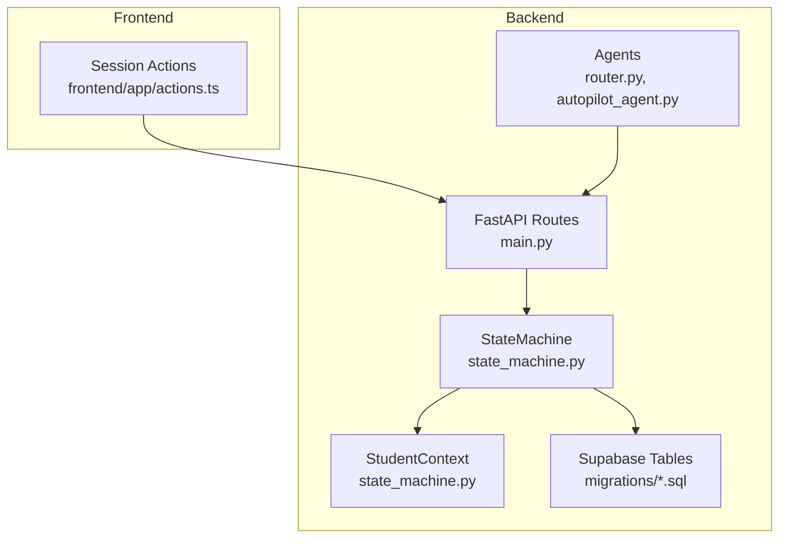
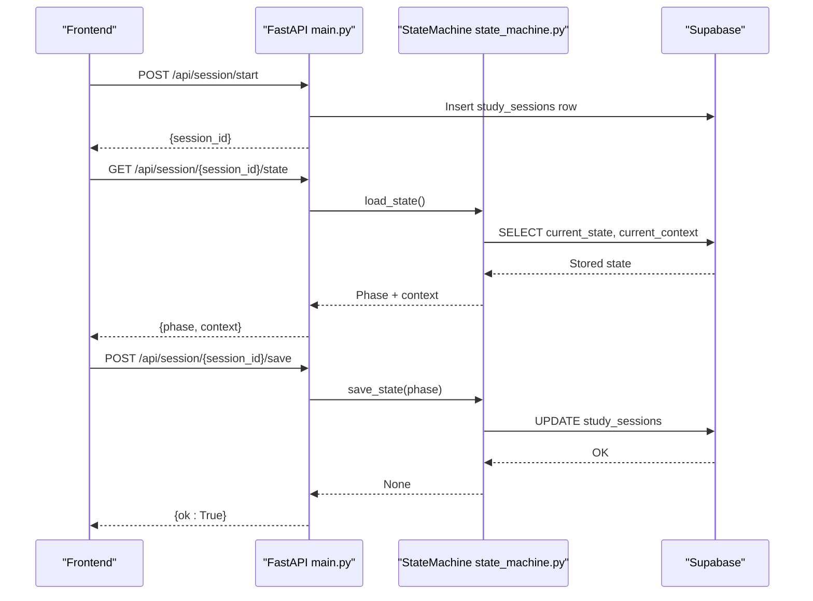
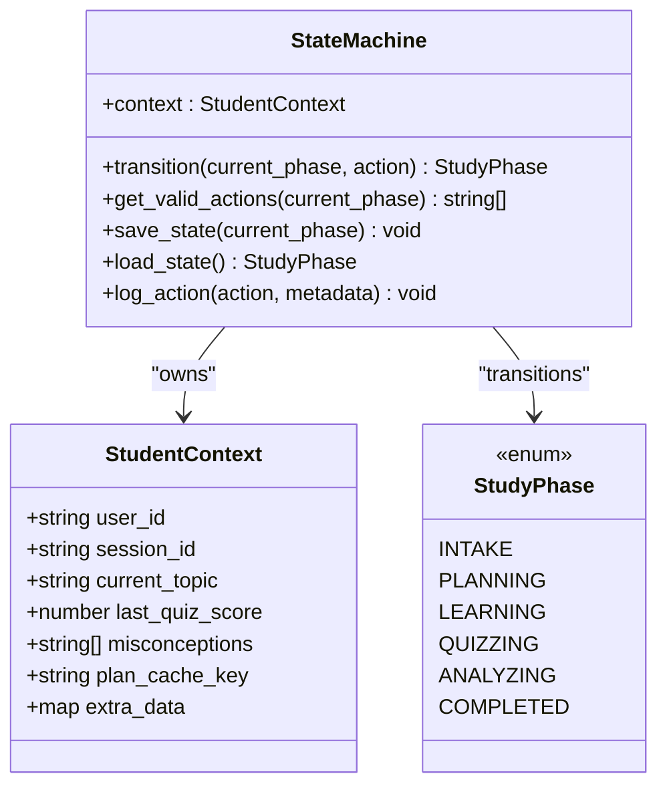
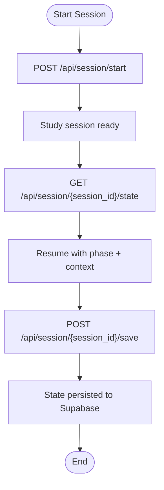
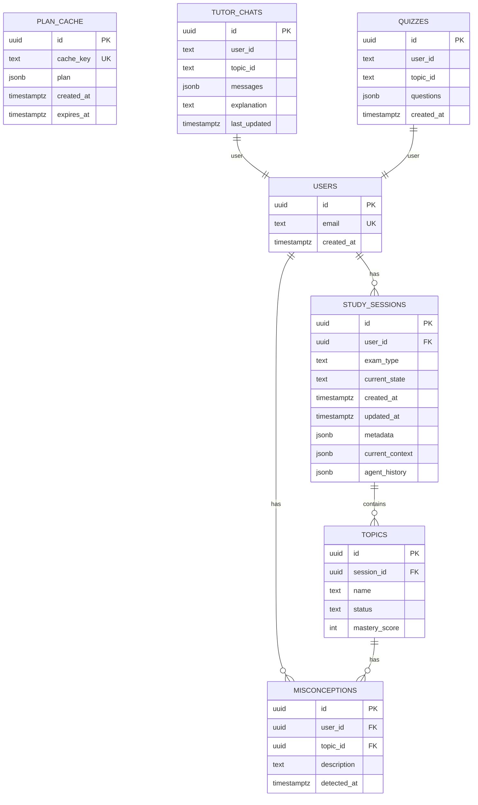
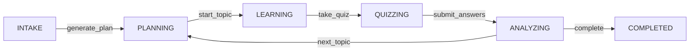
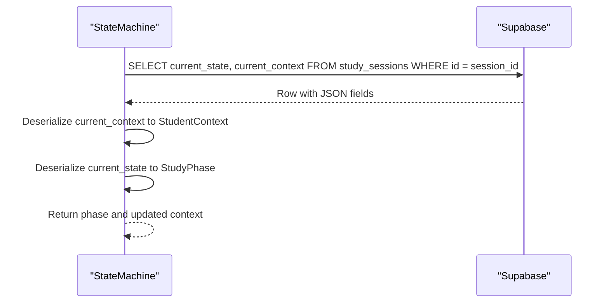
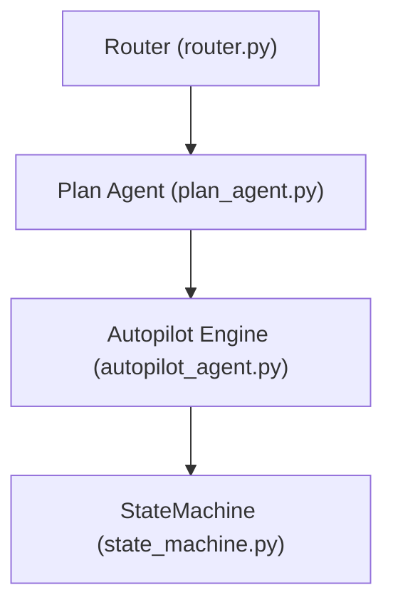
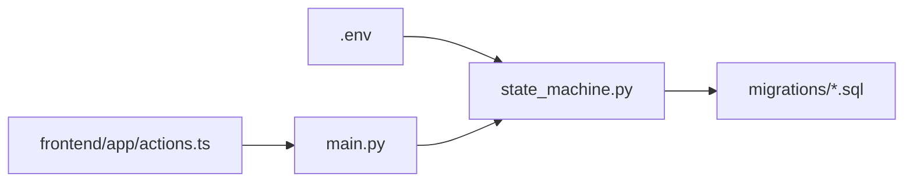

# State Management and Persistence

<cite>
**Referenced Files in This Document**
- [state_machine.py](file://backend/agents/state_machine.py)
- [schemas.py](file://backend/agents/schemas.py)
- [main.py](file://backend/main.py)
- [001_create_core_schema.sql](file://backend/migrations/001_create_core_schema.sql)
- [002_add_session_context.sql](file://backend/migrations/002_add_session_context.sql)
- [004_create_persistence_tables.sql](file://backend/migrations/004_create_persistence_tables.sql)
- [actions.ts](file://frontend/app/actions.ts)
- [router.py](file://backend/router.py)
- [autopilot_agent.py](file://backend/agents/autopilot_agent.py)
- [backend/.env](file://backend/.env)
</cite>

## Table of Contents
1. [Introduction](#introduction)
2. [Project Structure](#project-structure)
3. [Core Components](#core-components)
4. [Architecture Overview](#architecture-overview)
5. [Detailed Component Analysis](#detailed-component-analysis)
6. [Dependency Analysis](#dependency-analysis)
7. [Performance Considerations](#performance-considerations)
8. [Troubleshooting Guide](#troubleshooting-guide)
9. [Conclusion](#conclusion)

## Introduction
This document explains Exammentor AI’s state management and persistence architecture. It focuses on the StateMachine class implementing the state pattern to manage study session workflows across phases (INTAKE, PLANNING, LEARNING, QUIZZING, ANALYZING, COMPLETED). It documents the StudentContext model for maintaining session state, the integration with Supabase for persistent storage, session lifecycle management, state transitions, and data persistence strategies. It also covers serialization and deserialization of state, recovery mechanisms, concurrency considerations, validation, and error recovery patterns. Practical examples illustrate state manipulation and session management operations, and how state persistence enables resumable learning experiences coordinated by agents.

## Project Structure
The state management and persistence logic spans backend Python modules and frontend TypeScript actions:
- Backend Python defines the state machine, session routes, and database migrations.
- Frontend TypeScript provides session state retrieval and manual save operations.
- Router and agent modules coordinate session orchestration and state transitions.

**Diagram sources**
- [state_machine.py](file://backend/agents/state_machine.py#L38-L135)
- [main.py](file://backend/main.py#L516-L571)
- [001_create_core_schema.sql](file://backend/migrations/001_create_core_schema.sql#L14-L22)
- [002_add_session_context.sql](file://backend/migrations/002_add_session_context.sql#L2-L4)
- [004_create_persistence_tables.sql](file://backend/migrations/004_create_persistence_tables.sql#L3-L26)
- [actions.ts](file://frontend/app/actions.ts#L434-L461)
- [router.py](file://backend/router.py#L64-L88)
- [autopilot_agent.py](file://backend/agents/autopilot_agent.py#L57-L87)

**Section sources**
- [state_machine.py](file://backend/agents/state_machine.py#L1-L135)
- [main.py](file://backend/main.py#L516-L571)
- [001_create_core_schema.sql](file://backend/migrations/001_create_core_schema.sql#L14-L22)
- [002_add_session_context.sql](file://backend/migrations/002_add_session_context.sql#L2-L4)
- [004_create_persistence_tables.sql](file://backend/migrations/004_create_persistence_tables.sql#L3-L26)
- [actions.ts](file://frontend/app/actions.ts#L434-L461)
- [router.py](file://backend/router.py#L64-L88)
- [autopilot_agent.py](file://backend/agents/autopilot_agent.py#L57-L87)

## Core Components
- StateMachine: Implements the state pattern with explicit transitions between study phases and integrates with Supabase for persistence and audit logging.
- StudentContext: Pydantic model encapsulating session state (user_id, session_id, current_topic, last_quiz_score, misconceptions, plan_cache_key, extra_data).
- Session lifecycle endpoints: Create sessions, load persisted state, and manually save state.
- Database schema: study_sessions with current_state, current_context, agent_history; plan_cache for semantic caching; tutor_chats and quizzes for related persistence.

Key responsibilities:
- Enforce valid state transitions.
- Persist and hydrate session state to/from Supabase.
- Log agent actions to the session history.
- Support resumable sessions and agent coordination.

**Section sources**
- [state_machine.py](file://backend/agents/state_machine.py#L17-L36)
- [state_machine.py](file://backend/agents/state_machine.py#L38-L78)
- [state_machine.py](file://backend/agents/state_machine.py#L80-L135)
- [main.py](file://backend/main.py#L523-L556)
- [001_create_core_schema.sql](file://backend/migrations/001_create_core_schema.sql#L14-L22)
- [002_add_session_context.sql](file://backend/migrations/002_add_session_context.sql#L2-L4)
- [004_create_persistence_tables.sql](file://backend/migrations/004_create_persistence_tables.sql#L3-L26)

## Architecture Overview
The state management architecture combines a finite-state machine with persistent storage to enable resumable, agent-coordinated learning sessions.

**Diagram sources**
- [main.py](file://backend/main.py#L523-L556)
- [state_machine.py](file://backend/agents/state_machine.py#L96-L113)
- [state_machine.py](file://backend/agents/state_machine.py#L80-L94)

## Detailed Component Analysis

### StateMachine Class
The StateMachine enforces a strict workflow using a transition map and supports persistence and action logging.

- Transition rules: A tuple of (current_phase, action) maps to the next StudyPhase. Invalid transitions return the current phase.
- Persistence: save_state writes current_state and current_context to study_sessions; load_state reads and reconstructs StudentContext.
- Audit logging: log_action appends entries to agent_history.

Operational notes:
- Supabase client initialization depends on environment variables; missing credentials disable persistence.
- Serialization uses Pydantic’s model_dump for context and enum value for phase.

**Diagram sources**
- [state_machine.py](file://backend/agents/state_machine.py#L17-L36)
- [state_machine.py](file://backend/agents/state_machine.py#L38-L78)
- [state_machine.py](file://backend/agents/state_machine.py#L80-L135)

**Section sources**
- [state_machine.py](file://backend/agents/state_machine.py#L38-L78)
- [state_machine.py](file://backend/agents/state_machine.py#L80-L135)

### StudentContext Model
StudentContext captures session state for cross-agent coordination and persistence.

Fields:
- user_id: Identifies the learner.
- session_id: Links state to a study_sessions row.
- current_topic: Tracks the active topic.
- last_quiz_score: Stores recent quiz performance.
- misconceptions: Accumulates identified conceptual errors.
- plan_cache_key: Enables semantic caching of plans.
- extra_data: Extensible storage for agent-specific metadata.

Validation:
- Pydantic BaseModel ensures type safety and defaults for optional fields.

**Section sources**
- [state_machine.py](file://backend/agents/state_machine.py#L27-L36)

### Session Lifecycle Management
Endpoints support creating sessions, loading persisted state, and manual saves.

- POST /api/session/start: Creates a study_sessions row with initial current_state set to INTAKE.
- GET /api/session/{session_id}/state: Loads current_state and current_context from Supabase.
- POST /api/session/{session_id}/save: Manually persists a given phase and context.

Frontend actions mirror backend endpoints:
- getSessionStateAction: Calls GET /api/session/{session_id}/state.
- saveSessionStateAction: Calls POST /api/session/{session_id}/save.

**Diagram sources**
- [main.py](file://backend/main.py#L523-L556)
- [actions.ts](file://frontend/app/actions.ts#L434-L461)

**Section sources**
- [main.py](file://backend/main.py#L523-L556)
- [actions.ts](file://frontend/app/actions.ts#L434-L461)

### Data Persistence Strategies
- study_sessions: Stores current_state, current_context (JSONB), agent_history (JSONB array), and timestamps.
- plan_cache: Stores cached plans keyed by a hash of exam_type and syllabus summary with TTL.
- tutor_chats and quizzes: Persist tutoring conversations and generated quizzes for reuse.

Migrations:
- 001_create_core_schema.sql: Defines users, study_sessions, topics, misconceptions tables and indexes.
- 002_add_session_context.sql: Adds current_context and agent_history columns; creates plan_cache.
- 004_create_persistence_tables.sql: Creates tutor_chats and quizzes with indexes and RLS policies.

**Diagram sources**
- [001_create_core_schema.sql](file://backend/migrations/001_create_core_schema.sql#L8-L45)
- [002_add_session_context.sql](file://backend/migrations/002_add_session_context.sql#L7-L15)
- [004_create_persistence_tables.sql](file://backend/migrations/004_create_persistence_tables.sql#L4-L26)

**Section sources**
- [001_create_core_schema.sql](file://backend/migrations/001_create_core_schema.sql#L14-L22)
- [002_add_session_context.sql](file://backend/migrations/002_add_session_context.sql#L2-L4)
- [004_create_persistence_tables.sql](file://backend/migrations/004_create_persistence_tables.sql#L3-L26)

### State Transitions and Validation
Transitions are validated against a deterministic map. The StateMachine exposes get_valid_actions to enumerate allowed actions from a given phase.

Validation:
- Invalid actions remain in the current phase.
- Valid actions advance the workflow predictably.

**Diagram sources**
- [state_machine.py](file://backend/agents/state_machine.py#L44-L52)

**Section sources**
- [state_machine.py](file://backend/agents/state_machine.py#L65-L78)
- [state_machine.py](file://backend/agents/state_machine.py#L44-L52)

### Serialization, Deserialization, and Recovery
- Serialization: StudentContext is serialized to JSONB via model_dump; StudyPhase is serialized as a string value.
- Deserialization: On load, current_context is reconstructed into StudentContext; current_state is converted back to StudyPhase.
- Recovery: If Supabase is unavailable, persistence is disabled and warnings are printed; state remains in-memory.

**Diagram sources**
- [state_machine.py](file://backend/agents/state_machine.py#L96-L113)

**Section sources**
- [state_machine.py](file://backend/agents/state_machine.py#L80-L94)
- [state_machine.py](file://backend/agents/state_machine.py#L96-L113)

### Relationship Between Session State and Agent Coordination
Agents operate within the session lifecycle:
- Router and plan_agent.py use the routing layer to scope content and generate plans.
- Autopilot orchestrates topic selection, tutoring, quizzing, and analysis, logging decisions to the session steps.
- StateMachine coordinates transitions and persists state for resumability.

**Diagram sources**
- [router.py](file://backend/router.py#L64-L88)
- [plan_agent.py](file://backend/agents/plan_agent.py#L182-L200)
- [autopilot_agent.py](file://backend/agents/autopilot_agent.py#L182-L200)
- [state_machine.py](file://backend/agents/state_machine.py#L38-L78)

**Section sources**
- [router.py](file://backend/router.py#L64-L88)
- [plan_agent.py](file://backend/agents/plan_agent.py#L182-L200)
- [autopilot_agent.py](file://backend/agents/autopilot_agent.py#L182-L200)
- [state_machine.py](file://backend/agents/state_machine.py#L38-L78)

### Practical Examples
- Starting a session: Call POST /api/session/start to create a study_sessions row and receive a session_id.
- Resuming state: Call GET /api/session/{session_id}/state to retrieve current_state and current_context.
- Manual save: Call POST /api/session/{session_id}/save with context_data and phase to persist state.
- Frontend integration: Use getSessionStateAction and saveSessionStateAction helpers.

**Section sources**
- [main.py](file://backend/main.py#L523-L556)
- [actions.ts](file://frontend/app/actions.ts#L434-L461)

## Dependency Analysis
- StateMachine depends on:
  - StudentContext for state representation.
  - Supabase client for persistence and audit logging.
  - Environment variables for Supabase credentials.
- FastAPI routes depend on StateMachine for session state operations.
- Frontend actions depend on backend routes for session state retrieval and persistence.
- Agents depend on router and plan schemas for structured outputs.

**Diagram sources**
- [backend/.env](file://backend/.env#L3-L5)
- [state_machine.py](file://backend/agents/state_machine.py#L54-L63)
- [main.py](file://backend/main.py#L523-L556)
- [actions.ts](file://frontend/app/actions.ts#L434-L461)
- [001_create_core_schema.sql](file://backend/migrations/001_create_core_schema.sql#L14-L22)

**Section sources**
- [backend/.env](file://backend/.env#L3-L5)
- [state_machine.py](file://backend/agents/state_machine.py#L54-L63)
- [main.py](file://backend/main.py#L523-L556)
- [actions.ts](file://frontend/app/actions.ts#L434-L461)
- [001_create_core_schema.sql](file://backend/migrations/001_create_core_schema.sql#L14-L22)

## Performance Considerations
- JSONB fields (current_context, agent_history) enable flexible schema evolution but require careful indexing for large histories.
- plan_cache uses a unique cache_key and TTL to reduce repeated plan generation costs.
- Frontend fetchWithRetry applies exponential backoff to mitigate transient failures.
- Consider adding indexes on study_sessions(user_id) and study_sessions(updated_at) for frequent queries.

[No sources needed since this section provides general guidance]

## Troubleshooting Guide
Common issues and resolutions:
- Missing Supabase credentials: StateMachine prints a warning and disables persistence. Ensure SUPABASE_URL and SUPABASE_KEY are configured.
- Supabase connectivity errors: save_state and load_state catch exceptions and print error messages; verify network and credentials.
- Invalid transitions: get_valid_actions returns allowed actions; ensure actions align with the current phase.
- Frontend state retrieval failures: getSessionStateAction returns null on error; confirm session_id validity and API availability.

**Section sources**
- [state_machine.py](file://backend/agents/state_machine.py#L57-L63)
- [state_machine.py](file://backend/agents/state_machine.py#L91-L94)
- [state_machine.py](file://backend/agents/state_machine.py#L111-L113)
- [actions.ts](file://frontend/app/actions.ts#L436-L443)

## Conclusion
Exammentor AI’s state management leverages a state pattern implemented by StateMachine to enforce a predictable learning workflow. StudentContext encapsulates session state for agent coordination, while Supabase provides durable persistence and audit logging. The session lifecycle endpoints enable resumable experiences, and the database schema supports caching and related content. Together, these components deliver robust, recoverable, and agent-driven study sessions.