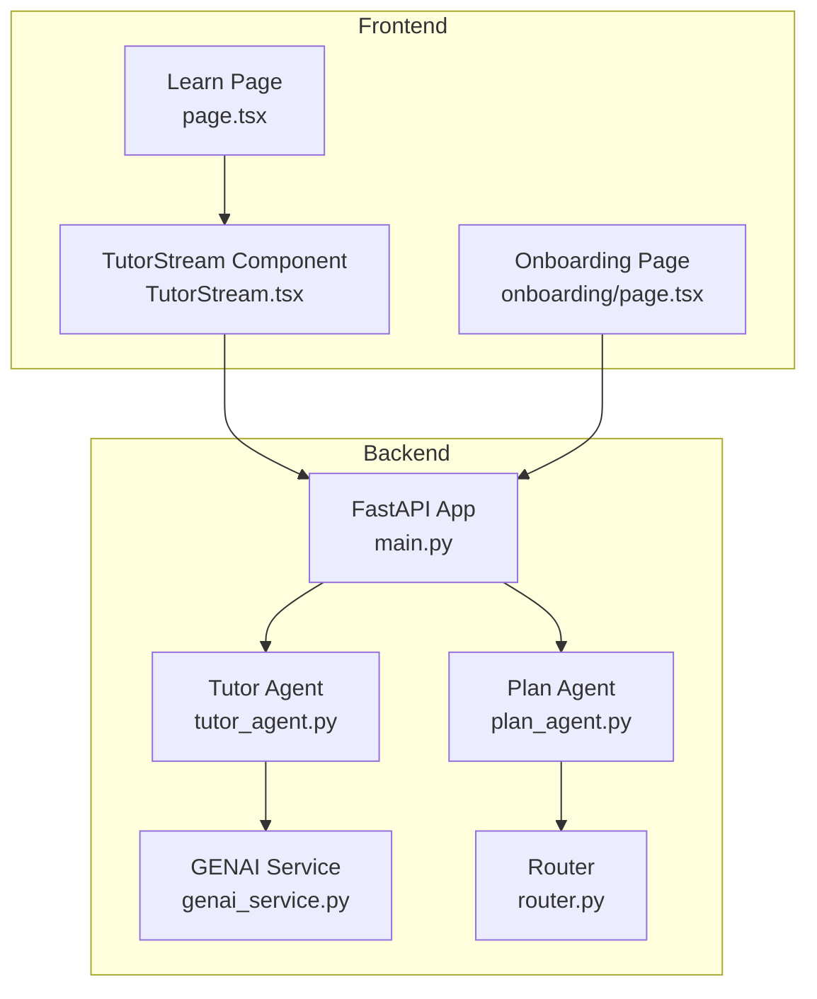
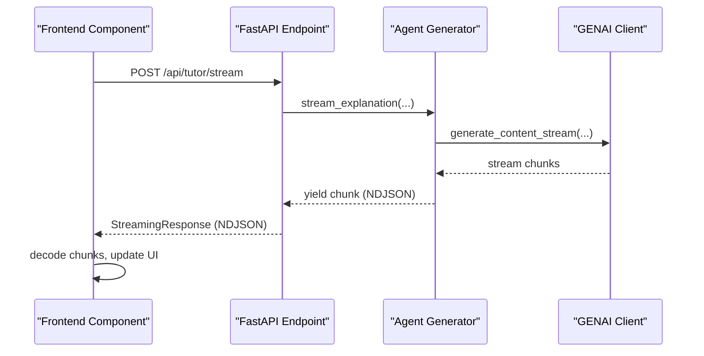
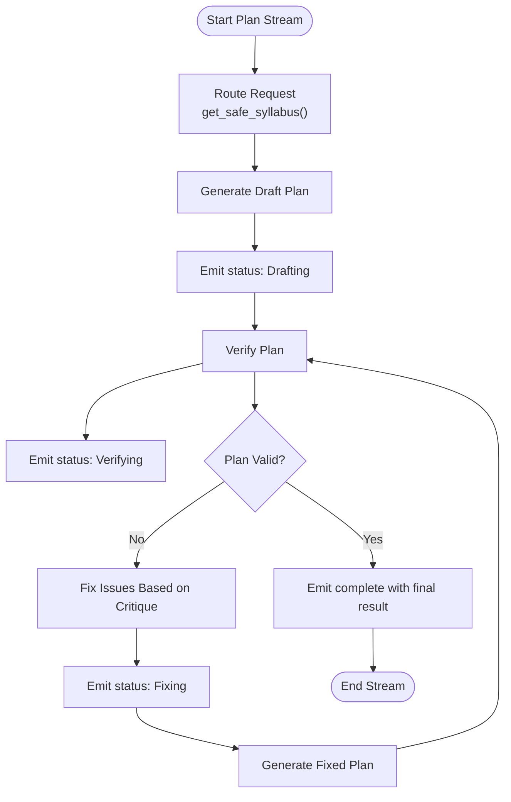
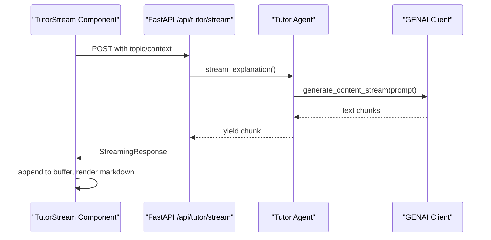
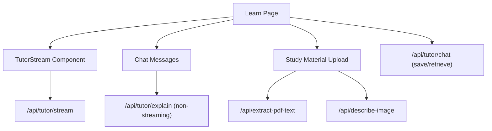
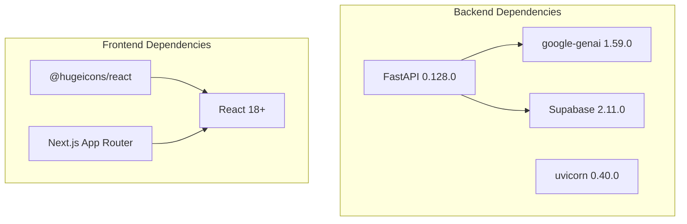

# Streaming Response Architecture

<cite>
**Referenced Files in This Document**
- [main.py](file://backend/main.py)
- [plan_agent.py](file://backend/agents/plan_agent.py)
- [tutor_agent.py](file://backend/agents/tutor_agent.py)
- [genai_service.py](file://backend/services/genai_service.py)
- [TutorStream.tsx](file://frontend/components/TutorStream.tsx)
- [page.tsx](file://frontend/app/learn/[topicId]/page.tsx)
- [onboarding/page.tsx](file://frontend/app/onboarding/page.tsx)
- [router.py](file://backend/router.py)
- [requirements.txt](file://backend/requirements.txt)
</cite>

## Table of Contents
1. [Introduction](#introduction)
2. [Project Structure](#project-structure)
3. [Core Components](#core-components)
4. [Architecture Overview](#architecture-overview)
5. [Detailed Component Analysis](#detailed-component-analysis)
6. [Dependency Analysis](#dependency-analysis)
7. [Performance Considerations](#performance-considerations)
8. [Troubleshooting Guide](#troubleshooting-guide)
9. [Conclusion](#conclusion)

## Introduction
This document explains Exammentor AI's streaming response architecture that enables real-time UI updates through Server-Sent Events (SSE) using FastAPI's StreamingResponse with newline-delimited JSON (NDJSON) format. The system streams plan generation progress, explanation delivery, and interactive tutoring sessions to provide immediate feedback and progressive disclosure of information. The backend implements async generator patterns to yield NDJSON chunks, while the frontend consumes these streams using the Fetch API ReadableStream interface to update the UI incrementally.

## Project Structure
The streaming architecture spans three layers:
- Backend API: FastAPI endpoints that return StreamingResponse with NDJSON
- Agents: Async generators that produce streaming chunks
- Frontend: React components that consume the stream and render incremental updates

**Diagram sources**
- [main.py](file://backend/main.py#L205-L223)
- [plan_agent.py](file://backend/agents/plan_agent.py#L307-L323)
- [tutor_agent.py](file://backend/agents/tutor_agent.py#L51-L70)
- [genai_service.py](file://backend/services/genai_service.py#L1-L9)
- [router.py](file://backend/router.py#L64-L88)
- [TutorStream.tsx](file://frontend/components/TutorStream.tsx#L64-L115)
- [page.tsx](file://frontend/app/learn/[topicId]/page.tsx#L386-L394)
- [onboarding/page.tsx](file://frontend/app/onboarding/page.tsx#L133-L219)

**Section sources**
- [main.py](file://backend/main.py#L205-L223)
- [plan_agent.py](file://backend/agents/plan_agent.py#L307-L323)
- [tutor_agent.py](file://backend/agents/tutor_agent.py#L51-L70)
- [genai_service.py](file://backend/services/genai_service.py#L1-L9)
- [router.py](file://backend/router.py#L64-L88)
- [TutorStream.tsx](file://frontend/components/TutorStream.tsx#L64-L115)
- [page.tsx](file://frontend/app/learn/[topicId]/page.tsx#L386-L394)
- [onboarding/page.tsx](file://frontend/app/onboarding/page.tsx#L133-L219)

## Core Components
- Streaming endpoints in FastAPI return StreamingResponse with media type "application/x-ndjson"
- Async generators in agents yield newline-delimited JSON chunks
- Frontend consumes the stream using fetch() with ReadableStream and decodes chunks incrementally
- Chunk format supports multiple event types (status, draft, verification, complete, debug) for plan streaming
- Character-level streaming for explanations ensures immediate UI feedback

Key implementation references:
- Streaming plan endpoint: [stream_verified_plan_endpoint](file://backend/main.py#L205-L223)
- Streaming explanation endpoint: [stream_topic_explanation](file://backend/main.py#L245-L261)
- Plan streaming generator: [stream_verified_plan_with_history](file://backend/agents/plan_agent.py#L307-L323)
- Explanation streaming generator: [stream_explanation](file://backend/agents/tutor_agent.py#L51-L70)
- GENAI client initialization: [genai_service.py](file://backend/services/genai_service.py#L1-L9)

**Section sources**
- [main.py](file://backend/main.py#L205-L223)
- [main.py](file://backend/main.py#L245-L261)
- [plan_agent.py](file://backend/agents/plan_agent.py#L307-L323)
- [tutor_agent.py](file://backend/agents/tutor_agent.py#L51-L70)
- [genai_service.py](file://backend/services/genai_service.py#L1-L9)

## Architecture Overview
The streaming architecture follows a producer-consumer pattern:
- Producers: Async generators in plan_agent.py and tutor_agent.py
- Transport: FastAPI StreamingResponse with NDJSON
- Consumers: Frontend components using fetch() and ReadableStream

**Diagram sources**
- [main.py](file://backend/main.py#L245-L261)
- [tutor_agent.py](file://backend/agents/tutor_agent.py#L119-L127)
- [TutorStream.tsx](file://frontend/components/TutorStream.tsx#L75-L104)

**Section sources**
- [main.py](file://backend/main.py#L245-L261)
- [tutor_agent.py](file://backend/agents/tutor_agent.py#L119-L127)
- [TutorStream.tsx](file://frontend/components/TutorStream.tsx#L75-L104)

## Detailed Component Analysis

### Plan Generation Streaming
The plan streaming implementation provides transparency into the AI's self-correction process:
- Emits status updates for each phase (drafting, verifying, fixing)
- Streams intermediate plan versions for diff visualization
- Sends verification results with critiques and missing topics
- Completes with the final validated plan and summary metrics

**Diagram sources**
- [plan_agent.py](file://backend/agents/plan_agent.py#L325-L350)
- [plan_agent.py](file://backend/agents/plan_agent.py#L372-L400)
- [plan_agent.py](file://backend/agents/plan_agent.py#L402-L448)
- [plan_agent.py](file://backend/agents/plan_agent.py#L472-L476)

Frontend consumption pattern:
- Uses fetch() with ReadableStream
- Parses NDJSON lines incrementally
- Updates UI based on event types (status, draft, verification, complete)
- Stores final plan in local storage for later navigation

**Section sources**
- [plan_agent.py](file://backend/agents/plan_agent.py#L307-L323)
- [plan_agent.py](file://backend/agents/plan_agent.py#L325-L350)
- [plan_agent.py](file://backend/agents/plan_agent.py#L372-L400)
- [plan_agent.py](file://backend/agents/plan_agent.py#L402-L448)
- [plan_agent.py](file://backend/agents/plan_agent.py#L472-L476)
- [onboarding/page.tsx](file://frontend/app/onboarding/page.tsx#L133-L219)

### Explanation Delivery Streaming
The explanation streaming provides immediate, character-level feedback:
- Uses generate_content_stream() for live text emission
- Yields raw text chunks for progressive UI updates
- Supports difficulty levels and optional attached context
- Integrates with markdown rendering for rich content display

**Diagram sources**
- [main.py](file://backend/main.py#L245-L261)
- [tutor_agent.py](file://backend/agents/tutor_agent.py#L119-L127)
- [TutorStream.tsx](file://frontend/components/TutorStream.tsx#L64-L115)

Frontend streaming implementation highlights:
- Uses response.body.getReader() for streaming consumption
- Decodes chunks with TextDecoder in streaming mode
- Buffers incoming data and flushes to state at ~20fps for smooth updates
- Maintains smart scrolling behavior to keep content at bottom when user hasn't scrolled up
- Handles completion callbacks to persist final content

**Section sources**
- [tutor_agent.py](file://backend/agents/tutor_agent.py#L51-L70)
- [tutor_agent.py](file://backend/agents/tutor_agent.py#L119-L127)
- [TutorStream.tsx](file://frontend/components/TutorStream.tsx#L64-L115)
- [TutorStream.tsx](file://frontend/components/TutorStream.tsx#L134-L147)

### Interactive Tutoring Sessions
The tutoring interface combines streaming explanations with chat interactions:
- Initial streaming explanation delivered via TutorStream component
- Subsequent chat messages processed through traditional endpoints
- Study material integration via PDF/image upload with context extraction
- Persistent chat history storage and retrieval

**Diagram sources**
- [page.tsx](file://frontend/app/learn/[topicId]/page.tsx#L386-L394)
- [page.tsx](file://frontend/app/learn/[topicId]/page.tsx#L192-L225)
- [page.tsx](file://frontend/app/learn/[topicId]/page.tsx#L154-L170)
- [main.py](file://backend/main.py#L227-L243)
- [main.py](file://backend/main.py#L267-L285)
- [main.py](file://backend/main.py#L287-L324)

**Section sources**
- [page.tsx](file://frontend/app/learn/[topicId]/page.tsx#L386-L394)
- [page.tsx](file://frontend/app/learn/[topicId]/page.tsx#L192-L225)
- [page.tsx](file://frontend/app/learn/[topicId]/page.tsx#L154-L170)
- [main.py](file://backend/main.py#L227-L243)
- [main.py](file://backend/main.py#L267-L285)
- [main.py](file://backend/main.py#L287-L324)

## Dependency Analysis
The streaming architecture relies on several key dependencies and service integrations:

**Diagram sources**
- [requirements.txt](file://backend/requirements.txt#L8-L31)

Key integration points:
- GENAI client for streaming content generation
- Supabase for chat history persistence
- Next.js App Router for page-level streaming consumption
- React components for incremental UI updates

**Section sources**
- [requirements.txt](file://backend/requirements.txt#L1-L32)
- [genai_service.py](file://backend/services/genai_service.py#L1-L9)

## Performance Considerations
The streaming architecture incorporates several optimization techniques:

- **Chunk-based transmission**: NDJSON format allows immediate parsing of complete lines without waiting for entire responses
- **Buffered rendering**: Frontend buffers incoming chunks and flushes at ~20fps to balance responsiveness with performance
- **Smart scrolling**: Maintains user focus on new content while allowing manual scrolling to review history
- **Incremental markdown rendering**: Updates only when content changes to minimize re-renders
- **Connection reuse**: StreamingResponse maintains persistent connections for long-running operations
- **Memory management**: Proper cleanup of URLs and resources when components unmount

Best practices for maintainability:
- Always include proper error boundaries around streaming components
- Implement retry mechanisms for transient network failures
- Use appropriate loading states to indicate streaming progress
- Consider debouncing rapid UI updates to prevent excessive re-renders

## Troubleshooting Guide
Common streaming issues and solutions:

**Connection Failures**
- Verify CORS configuration allows frontend origin
- Check network connectivity to GENAI service
- Ensure StreamingResponse media type matches frontend expectations

**Parsing Errors**
- NDJSON requires newline-delimited format; malformed lines cause JSON.parse errors
- Frontend should handle incomplete lines gracefully using buffer splitting
- Validate chunk encoding (UTF-8) to prevent decode errors

**Performance Issues**
- Monitor frontend flush intervals to balance smoothness with resource usage
- Implement backpressure handling for high-throughput streams
- Consider chunk size optimization for different content types

**Reconnection Strategies**
- Implement exponential backoff for automatic retries
- Preserve streaming state across reconnections when possible
- Provide user controls to pause/resume streaming sessions

**Section sources**
- [TutorStream.tsx](file://frontend/components/TutorStream.tsx#L117-L123)
- [onboarding/page.tsx](file://frontend/app/onboarding/page.tsx#L208-L211)

## Conclusion
Exammentor AI's streaming response architecture demonstrates a robust implementation of real-time UI updates using FastAPI's StreamingResponse with NDJSON format. The system successfully delivers immediate feedback through plan generation transparency, character-level explanation streaming, and interactive tutoring experiences. The architecture balances user experience with technical reliability through careful chunk management, intelligent buffering, and comprehensive error handling. This foundation provides excellent scalability for additional streaming features while maintaining responsive, engaging user interactions.