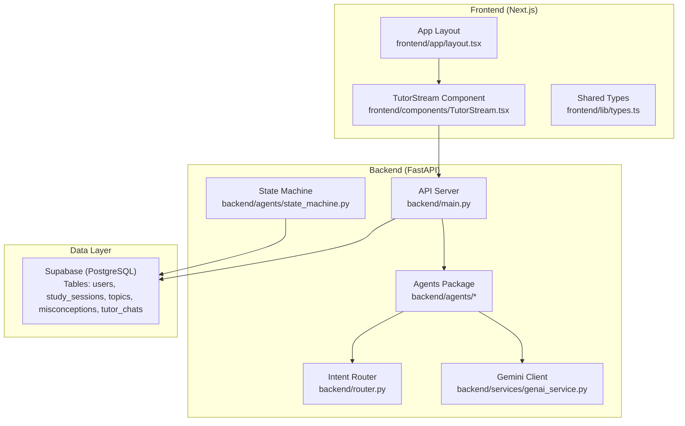
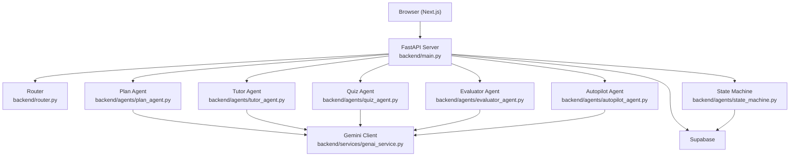
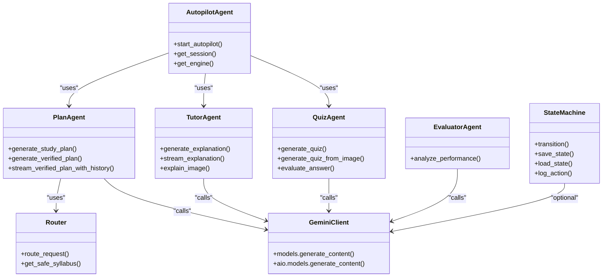
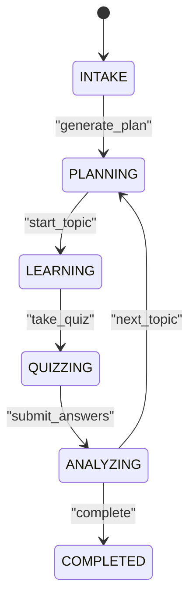
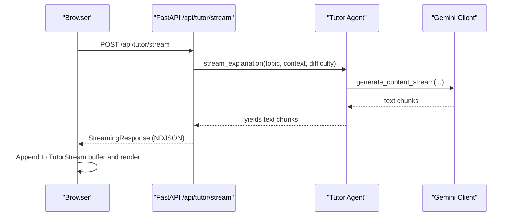
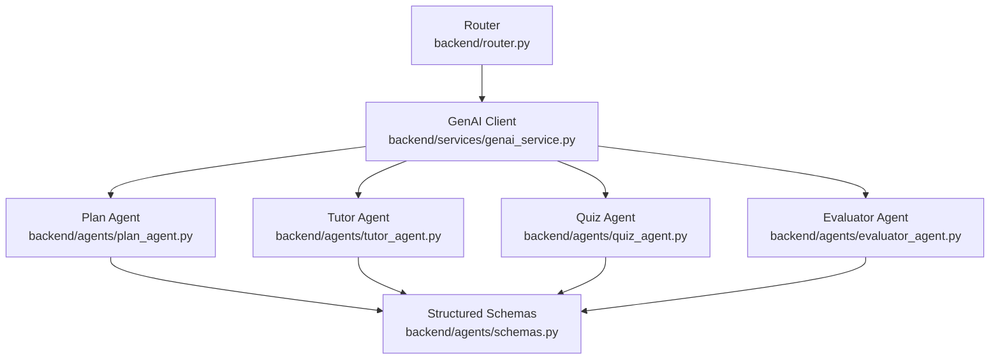
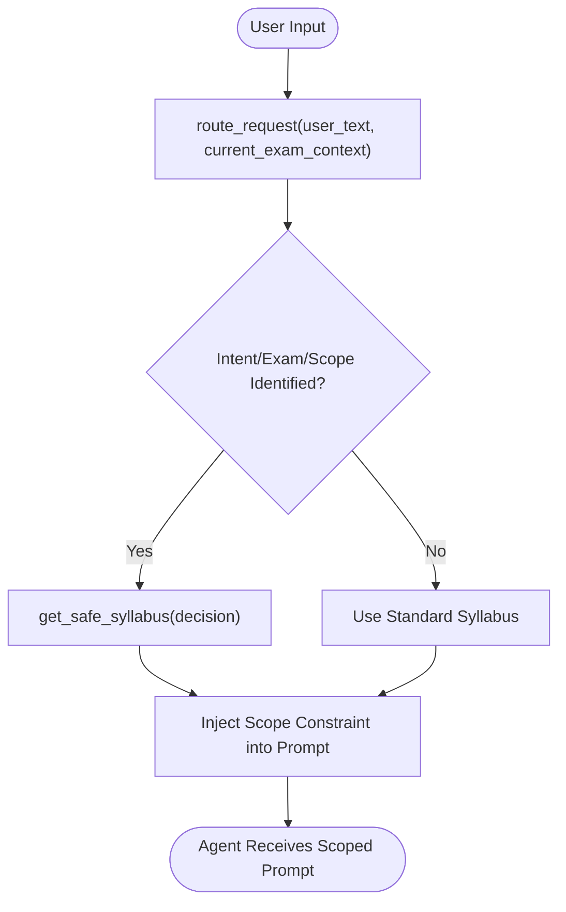
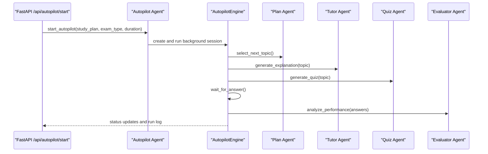
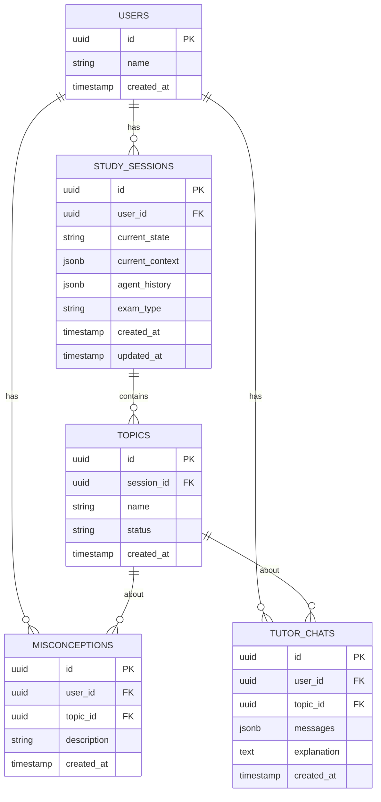
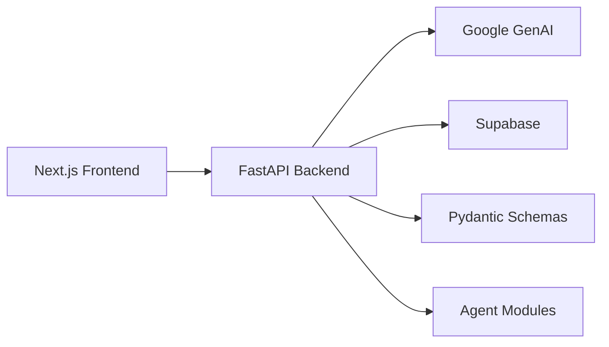

# System Architecture

<cite>
**Referenced Files in This Document**
- [backend/main.py](file://backend/main.py)
- [backend/router.py](file://backend/router.py)
- [backend/services/genai_service.py](file://backend/services/genai_service.py)
- [backend/agents/state_machine.py](file://backend/agents/state_machine.py)
- [backend/agents/schemas.py](file://backend/agents/schemas.py)
- [backend/agents/plan_agent.py](file://backend/agents/plan_agent.py)
- [backend/agents/tutor_agent.py](file://backend/agents/tutor_agent.py)
- [backend/agents/quiz_agent.py](file://backend/agents/quiz_agent.py)
- [backend/agents/evaluator_agent.py](file://backend/agents/evaluator_agent.py)
- [backend/agents/autopilot_agent.py](file://backend/agents/autopilot_agent.py)
- [frontend/app/layout.tsx](file://frontend/app/layout.tsx)
- [frontend/components/TutorStream.tsx](file://frontend/components/TutorStream.tsx)
- [frontend/lib/types.ts](file://frontend/lib/types.ts)
- [backend/requirements.txt](file://backend/requirements.txt)
</cite>

## Table of Contents
1. [Introduction](#introduction)
2. [Project Structure](#project-structure)
3. [Core Components](#core-components)
4. [Architecture Overview](#architecture-overview)
5. [Detailed Component Analysis](#detailed-component-analysis)
6. [Dependency Analysis](#dependency-analysis)
7. [Performance Considerations](#performance-considerations)
8. [Troubleshooting Guide](#troubleshooting-guide)
9. [Conclusion](#conclusion)
10. [Appendices](#appendices)

## Introduction
This document describes the system architecture of Exammentor AI, an educational AI platform designed to support student learning through a multi-agent system orchestrated by FastAPI and powered by Google Gemini. The platform integrates a Next.js frontend with real-time streaming capabilities, a FastAPI backend exposing specialized agents for planning, tutoring, quizzing, evaluation, and autopilot orchestration, and a Supabase-backed persistence layer. The architecture emphasizes modularity, structured AI outputs, streaming UI updates, and a state machine-driven workflow to manage study sessions.

## Project Structure
The repository is organized into a frontend (Next.js) and a backend (FastAPI) with modular Python packages for agents and shared services. The backend exposes REST endpoints that delegate to specialized agents, which in turn integrate with the Gemini AI models and persist state to Supabase.

**Diagram sources**
- [backend/main.py](file://backend/main.py#L1-L843)
- [backend/router.py](file://backend/router.py#L1-L129)
- [backend/services/genai_service.py](file://backend/services/genai_service.py#L1-L10)
- [backend/agents/state_machine.py](file://backend/agents/state_machine.py#L1-L136)
- [frontend/app/layout.tsx](file://frontend/app/layout.tsx#L1-L41)
- [frontend/components/TutorStream.tsx](file://frontend/components/TutorStream.tsx#L1-L151)
- [frontend/lib/types.ts](file://frontend/lib/types.ts#L1-L138)

**Section sources**
- [backend/main.py](file://backend/main.py#L1-L843)
- [backend/router.py](file://backend/router.py#L1-L129)
- [backend/services/genai_service.py](file://backend/services/genai_service.py#L1-L10)
- [backend/agents/state_machine.py](file://backend/agents/state_machine.py#L1-L136)
- [frontend/app/layout.tsx](file://frontend/app/layout.tsx#L1-L41)
- [frontend/components/TutorStream.tsx](file://frontend/components/TutorStream.tsx#L1-L151)
- [frontend/lib/types.ts](file://frontend/lib/types.ts#L1-L138)

## Core Components
- Frontend (Next.js): Provides the user interface with streaming UI updates for explanations and interactive quiz experiences. The TutorStream component streams NDJSON responses from the backend and renders markdown content.
- FastAPI Backend: Exposes REST endpoints for planning, tutoring, quizzing, evaluation, session management, and autopilot orchestration. It validates requests, delegates to agents, persists data to Supabase, and supports streaming responses.
- Agents: Specialized modules implementing distinct roles:
  - Planner: Generates structured study plans with optional verification and self-correction loops.
  - Tutor: Provides structured explanations and multimodal explanations with streaming support.
  - Quiz: Creates adaptive quizzes and evaluates answers with misconception detection.
  - Evaluator: Analyzes quiz performance and generates personalized recommendations.
  - Autopilot: Orchestrates autonomous 30-minute learning sessions with interactive quizzing and run logging.
- Router: Performs intent classification and syllabus scoping using Gemini to constrain agent prompts to specific exam domains and subjects.
- State Machine: Enforces a strict workflow (INTAKE → PLANNING → LEARNING → QUIZZING → ANALYZING → COMPLETED) and persists session state to Supabase.
- Gemini Integration: Centralized client initialization and structured output schemas to ensure deterministic JSON responses from the LLM.
- Supabase: Stores user profiles, study sessions, topics, misconceptions, and chat histories.

**Section sources**
- [backend/main.py](file://backend/main.py#L1-L843)
- [backend/router.py](file://backend/router.py#L1-L129)
- [backend/services/genai_service.py](file://backend/services/genai_service.py#L1-L10)
- [backend/agents/state_machine.py](file://backend/agents/state_machine.py#L1-L136)
- [backend/agents/schemas.py](file://backend/agents/schemas.py#L1-L106)
- [backend/agents/plan_agent.py](file://backend/agents/plan_agent.py#L1-L524)
- [backend/agents/tutor_agent.py](file://backend/agents/tutor_agent.py#L1-L277)
- [backend/agents/quiz_agent.py](file://backend/agents/quiz_agent.py#L1-L283)
- [backend/agents/evaluator_agent.py](file://backend/agents/evaluator_agent.py#L1-L198)
- [backend/agents/autopilot_agent.py](file://backend/agents/autopilot_agent.py#L1-L628)
- [frontend/components/TutorStream.tsx](file://frontend/components/TutorStream.tsx#L1-L151)
- [frontend/lib/types.ts](file://frontend/lib/types.ts#L1-L138)

## Architecture Overview
The system follows a microservices-style backend composed of cohesive agent modules, each responsible for a distinct capability. The FastAPI server acts as the orchestrator, delegating to agents and integrating with Gemini and Supabase. The frontend consumes streaming endpoints to deliver real-time UI updates.

**Diagram sources**
- [backend/main.py](file://backend/main.py#L1-L843)
- [backend/router.py](file://backend/router.py#L1-L129)
- [backend/agents/plan_agent.py](file://backend/agents/plan_agent.py#L1-L524)
- [backend/agents/tutor_agent.py](file://backend/agents/tutor_agent.py#L1-L277)
- [backend/agents/quiz_agent.py](file://backend/agents/quiz_agent.py#L1-L283)
- [backend/agents/evaluator_agent.py](file://backend/agents/evaluator_agent.py#L1-L198)
- [backend/agents/autopilot_agent.py](file://backend/agents/autopilot_agent.py#L1-L628)
- [backend/agents/state_machine.py](file://backend/agents/state_machine.py#L1-L136)
- [backend/services/genai_service.py](file://backend/services/genai_service.py#L1-L10)

## Detailed Component Analysis

### Multi-Agent System Pattern
The backend implements a multi-agent system with specialized agents:
- Planner: Generates structured study plans and verifies them against syllabi and pedagogical constraints.
- Tutor: Provides structured explanations and multimodal explanations with streaming support.
- Quiz: Generates adaptive quizzes and evaluates answers with misconception detection.
- Evaluator: Analyzes quiz performance and produces personalized recommendations.
- Autopilot: Orchestrates autonomous learning sessions, interacting with other agents and managing interactive quizzing.

**Diagram sources**
- [backend/agents/plan_agent.py](file://backend/agents/plan_agent.py#L1-L524)
- [backend/agents/tutor_agent.py](file://backend/agents/tutor_agent.py#L1-L277)
- [backend/agents/quiz_agent.py](file://backend/agents/quiz_agent.py#L1-L283)
- [backend/agents/evaluator_agent.py](file://backend/agents/evaluator_agent.py#L1-L198)
- [backend/agents/autopilot_agent.py](file://backend/agents/autopilot_agent.py#L1-L628)
- [backend/router.py](file://backend/router.py#L1-L129)
- [backend/agents/state_machine.py](file://backend/agents/state_machine.py#L1-L136)
- [backend/services/genai_service.py](file://backend/services/genai_service.py#L1-L10)

**Section sources**
- [backend/agents/plan_agent.py](file://backend/agents/plan_agent.py#L1-L524)
- [backend/agents/tutor_agent.py](file://backend/agents/tutor_agent.py#L1-L277)
- [backend/agents/quiz_agent.py](file://backend/agents/quiz_agent.py#L1-L283)
- [backend/agents/evaluator_agent.py](file://backend/agents/evaluator_agent.py#L1-L198)
- [backend/agents/autopilot_agent.py](file://backend/agents/autopilot_agent.py#L1-L628)
- [backend/router.py](file://backend/router.py#L1-L129)
- [backend/agents/state_machine.py](file://backend/agents/state_machine.py#L1-L136)
- [backend/services/genai_service.py](file://backend/services/genai_service.py#L1-L10)

### State Machine Pattern for Study Sessions
The state machine enforces a strict workflow and persists session state to Supabase. It defines valid transitions and logs agent actions for auditability.

**Diagram sources**
- [backend/agents/state_machine.py](file://backend/agents/state_machine.py#L17-L52)

**Section sources**
- [backend/agents/state_machine.py](file://backend/agents/state_machine.py#L1-L136)

### Streaming Response Architecture
The backend supports streaming responses for real-time UI updates:
- Plan generation supports streaming with newline-delimited JSON chunks.
- Tutor explanations support streaming character-by-character for immediate feedback.
- Autopilot sessions stream run logs for transparency and interactivity.

**Diagram sources**
- [backend/main.py](file://backend/main.py#L245-L261)
- [backend/agents/tutor_agent.py](file://backend/agents/tutor_agent.py#L51-L127)
- [frontend/components/TutorStream.tsx](file://frontend/components/TutorStream.tsx#L64-L115)

**Section sources**
- [backend/main.py](file://backend/main.py#L245-L261)
- [backend/agents/tutor_agent.py](file://backend/agents/tutor_agent.py#L51-L127)
- [frontend/components/TutorStream.tsx](file://frontend/components/TutorStream.tsx#L1-L151)

### Gemini Integration Pattern
Gemini is integrated centrally with structured output schemas to ensure deterministic JSON responses:
- Central client initialization and async operations.
- Structured output schemas for each agent’s domain.
- Router uses Gemini to classify intent and scope syllabi safely.

**Diagram sources**
- [backend/services/genai_service.py](file://backend/services/genai_service.py#L1-L10)
- [backend/agents/plan_agent.py](file://backend/agents/plan_agent.py#L1-L524)
- [backend/agents/tutor_agent.py](file://backend/agents/tutor_agent.py#L1-L277)
- [backend/agents/quiz_agent.py](file://backend/agents/quiz_agent.py#L1-L283)
- [backend/agents/evaluator_agent.py](file://backend/agents/evaluator_agent.py#L1-L198)
- [backend/router.py](file://backend/router.py#L64-L88)
- [backend/agents/schemas.py](file://backend/agents/schemas.py#L1-L106)

**Section sources**
- [backend/services/genai_service.py](file://backend/services/genai_service.py#L1-L10)
- [backend/agents/schemas.py](file://backend/agents/schemas.py#L1-L106)
- [backend/router.py](file://backend/router.py#L64-L88)

### Router: Intent Classification and Syllabus Scoping
The router classifies user intent, determines the exam type, and scopes the syllabus to ensure agent prompts remain grounded and constrained.

**Diagram sources**
- [backend/router.py](file://backend/router.py#L64-L129)

**Section sources**
- [backend/router.py](file://backend/router.py#L1-L129)

### Autopilot Orchestration
Autopilot coordinates autonomous learning sessions, selecting topics, delivering lessons, administering quizzes, and updating mastery models. It maintains an interactive state for user answers and logs every decision.

**Diagram sources**
- [backend/agents/autopilot_agent.py](file://backend/agents/autopilot_agent.py#L584-L628)
- [backend/agents/plan_agent.py](file://backend/agents/plan_agent.py#L181-L304)
- [backend/agents/tutor_agent.py](file://backend/agents/tutor_agent.py#L131-L186)
- [backend/agents/quiz_agent.py](file://backend/agents/quiz_agent.py#L53-L111)
- [backend/agents/evaluator_agent.py](file://backend/agents/evaluator_agent.py#L59-L115)

**Section sources**
- [backend/agents/autopilot_agent.py](file://backend/agents/autopilot_agent.py#L1-L628)

### Data Persistence and Session State
Supabase persists user profiles, study sessions, topics, misconceptions, and chat histories. The state machine saves and loads session state, and the API persists misconceptions and chat histories.

**Diagram sources**
- [backend/main.py](file://backend/main.py#L447-L462)
- [backend/main.py](file://backend/main.py#L491-L513)
- [backend/main.py](file://backend/main.py#L779-L800)
- [backend/agents/state_machine.py](file://backend/agents/state_machine.py#L80-L113)

**Section sources**
- [backend/main.py](file://backend/main.py#L447-L462)
- [backend/main.py](file://backend/main.py#L491-L513)
- [backend/main.py](file://backend/main.py#L779-L800)
- [backend/agents/state_machine.py](file://backend/agents/state_machine.py#L80-L113)

## Dependency Analysis
The backend depends on FastAPI for routing and streaming, Google GenAI for model inference, Supabase for persistence, and Pydantic for structured outputs. The frontend depends on Next.js runtime and consumes streaming endpoints.

**Diagram sources**
- [backend/requirements.txt](file://backend/requirements.txt#L1-L32)
- [backend/main.py](file://backend/main.py#L1-L843)
- [frontend/components/TutorStream.tsx](file://frontend/components/TutorStream.tsx#L72-L115)

**Section sources**
- [backend/requirements.txt](file://backend/requirements.txt#L1-L32)
- [backend/main.py](file://backend/main.py#L1-L843)
- [frontend/components/TutorStream.tsx](file://frontend/components/TutorStream.tsx#L72-L115)

## Performance Considerations
- Streaming: Streaming NDJSON responses reduce perceived latency and enable real-time UI updates.
- Retry and Backoff: Autopilot includes retry logic with exponential backoff for model overload scenarios.
- Asynchronous Operations: Agents leverage async model calls to improve throughput.
- Structured Outputs: Pydantic schemas reduce parsing overhead and improve reliability.
- Scalability: Microservices-style agent modules promote horizontal scaling and independent deployment.

[No sources needed since this section provides general guidance]

## Troubleshooting Guide
- Streaming Issues: Verify the backend endpoint returns StreamingResponse with the correct media type and that the frontend reads the stream properly.
- Gemini Errors: Check API key configuration and model availability; implement retry logic for transient failures.
- Session Persistence: Confirm Supabase credentials and table permissions; inspect saved state and agent history logs.
- Router Failures: Validate router prompt and schema; ensure syllabus scoping matches the intended exam domain.

**Section sources**
- [backend/main.py](file://backend/main.py#L245-L261)
- [backend/services/genai_service.py](file://backend/services/genai_service.py#L1-L10)
- [backend/agents/state_machine.py](file://backend/agents/state_machine.py#L80-L113)
- [backend/router.py](file://backend/router.py#L64-L88)

## Conclusion
Exammentor AI employs a modular, agent-centric architecture with clear separation of concerns. The FastAPI backend orchestrates specialized agents, integrates Gemini for structured outputs, and persists state via Supabase. The frontend leverages streaming to deliver responsive, real-time interactions. The state machine ensures disciplined workflow progression, while the router constrains prompts to specific domains for reliable outcomes. This design balances scalability, maintainability, and user experience for an educational AI platform.

[No sources needed since this section summarizes without analyzing specific files]

## Appendices

### Technology Stack Decisions
- FastAPI: High-performance ASGI framework with automatic OpenAPI docs and streaming support.
- Google GenAI: Structured output schemas and async model APIs align with the platform’s requirements.
- Supabase: PostgreSQL-backed real-time database with auth and edge functions.
- Next.js: SSR/SSG, streaming, and component modularity for the frontend.
- Pydantic: Strong typing and validation for agent I/O and schema-driven AI outputs.

**Section sources**
- [backend/requirements.txt](file://backend/requirements.txt#L1-L32)
- [backend/main.py](file://backend/main.py#L1-L843)
- [frontend/app/layout.tsx](file://frontend/app/layout.tsx#L1-L41)

### Architectural Trade-offs
- Centralized Gemini Client: Simplifies configuration but introduces a single dependency; consider regional endpoints or failover strategies.
- In-Memory Autopilot Sessions: Easy to prototype; production should migrate to persistent storage.
- Loose Coupling via Schemas: Ensures robustness; requires careful schema evolution and backward compatibility.
- Streaming UI: Enhances UX but increases network complexity; ensure proper buffering and error handling.

[No sources needed since this section provides general guidance]